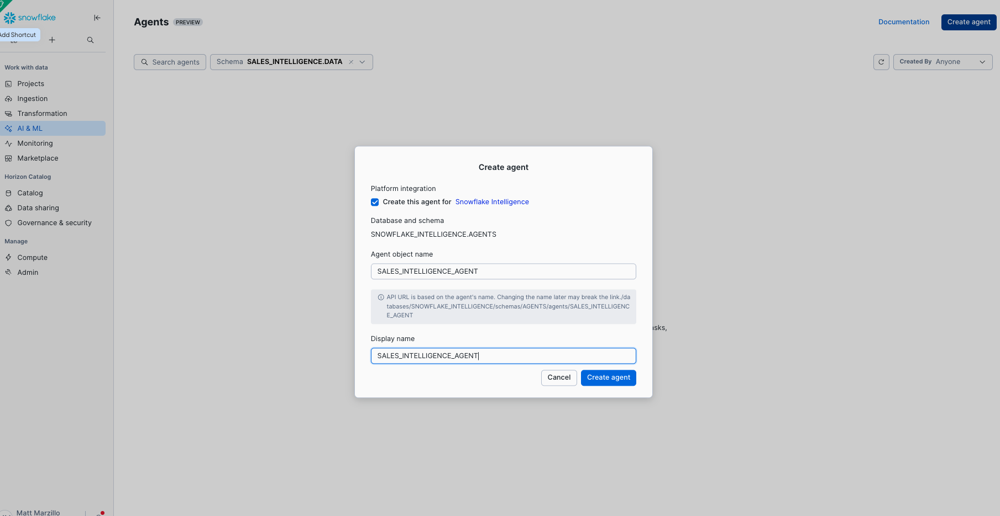
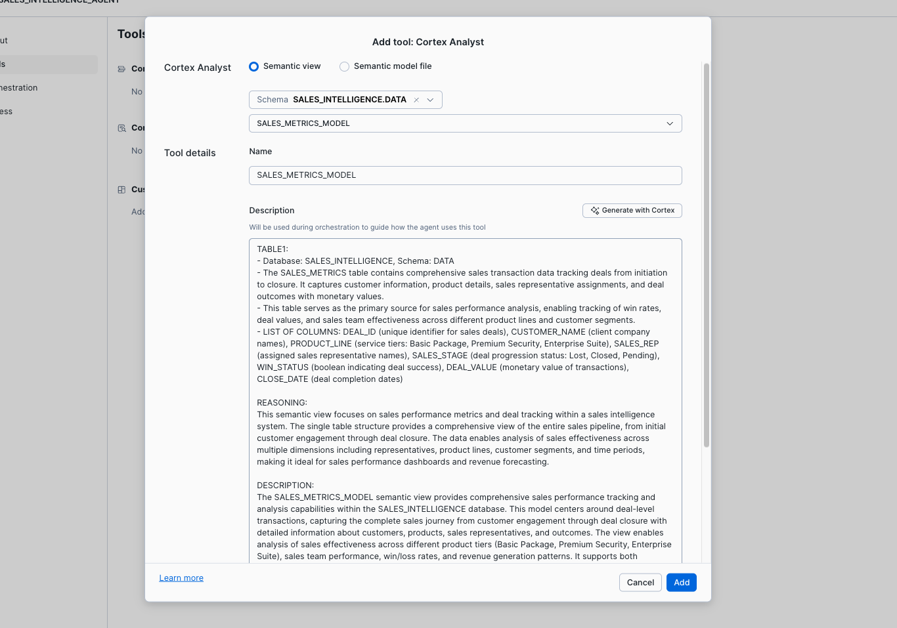
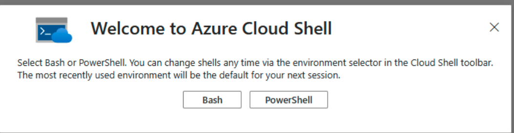
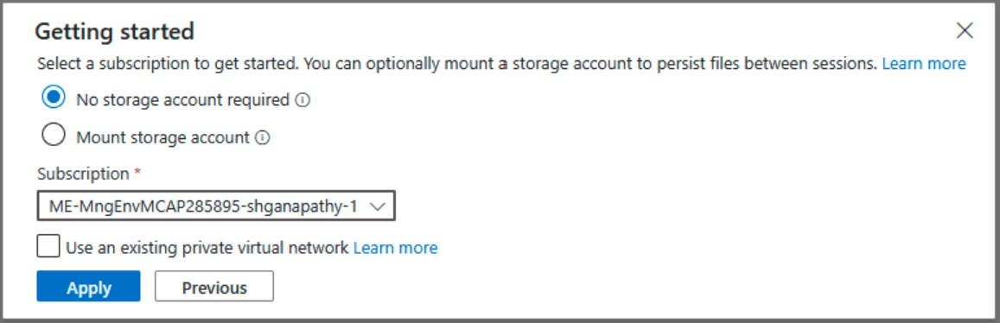
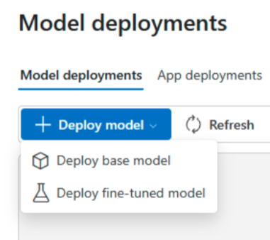
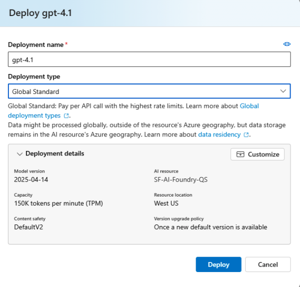
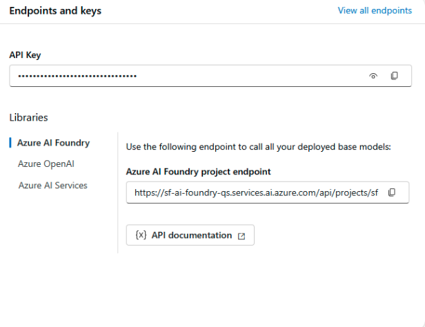

author: Matt Marzillo
id: getting-started-with-ai-foundry-and-the-snowflake-managed-mcp
categories: snowflake-site:taxonomy/solution-center/certification/quickstart, snowflake-site:taxonomy/product/ai, snowflake-site:taxonomy/snowflake-feature/ingestion/conversational-assistants
language: en
summary: Connect Microsoft AI Foundry with Snowflake Managed MCP for cross-platform AI model deployment and unified data integration.
environments: web
status: Published 
feedback link: https://github.com/Snowflake-Labs/sfguides/issues


# Getting Started with AI Foundry and the Snowflake Managed MCP Server
<!-- ------------------------ -->
## Overview 

[Azure AI Foundry](https://ai.azure.com/?cid=learnDocs) is a unified Azure platform-as-a-service offering enterprise AI operations, model builders, and application development. This foundation combines production-grade infrastructure with friendly interfaces, enabling developers to focus on building applications rather than managing infrastructure. 

Azure AI Foundry unifies agents, models, and tools under a single management grouping with built-in enterprise-readiness capabilities including tracing, monitoring, evaluations, and customizable enterprise setup configurations. The platform provides streamlined management through unified Role-based access control (RBAC), networking, and policies under one Azure resource provider namespace. 

Model Context Protocol (MCP), is an open-source standard that lets AI agents securely interact with business applications and external data systems, such as databases and content repositories. MCP lets enterprise businesses reduce integration challenges and quickly deliver outcomes from models. Since its launch, MCP has become foundational for agentic applications, providing a consistent and secure mechanism for invoking tools and retrieving data.

[The Snowflake-managed MCP server](https://docs.snowflake.com/en/user-guide/snowflake-cortex/cortex-agents-mcp) lets AI agents securely retrieve data from Snowflake accounts without needing to deploy separate infrastructure. You can configure the MCP server to serve Cortex Analyst, Cortex Search, and Cortex Agents as tools, along with custom tools and SQL executions on the standards-based interface. MCP clients discover and invoke these tools, and retrieve data required for the application. With managed MCP servers on Snowflake, you can build scalable enterprise-grade applications while maintaining access and privacy controls.

This Hands-on lab focuses on integrating AI Foundry into Snowflake Cortex through the Snowflake managed MCP Server. Using the two services together allows users to build a agent in AI Foundry and tool alongside Snowflake Cortex services on top of their Snowflake data efficiently and securely. 

### Use Case
In this Hands-on Lab, you'll learn how to build an Intelligent Sales Assistant that leverages Snowflake's capabilities for analyzing sales conversations and metrics using the AI Foundry Agents with the MCP Tools and Snowflake Managed MCP. Using AI Foundry Agents, we'll create an interactive and intuitive assistant. 


### Prerequisites
- Familiarity with [Snowflake](https://signup.snowflake.com/?utm_source=snowflake-devrel&utm_medium=developer-guides&utm_cta=developer-guides) and a Snowflake account
- Familiarity with Azure [AI Foundry](https://azure.microsoft.com/en-us/products/ai-foundry) and capabilities 
- Familiarity with azure cli

### What You’ll Learn
- Creating Snowflake Cortex Services for Search and Analyst 
- Create a Snowflake Managed MCP Server 
- Creating an Azure AI Foundry Agent 
- Chatting with AI Foundry Agent to get Insights from Cortex Services through MCP.  


1. User will make a prompt to the AI Foundry Agent built with SDK.
2. Using the Ai Foundry runtime, an orchestrator model in AI Foundry model will orchestrate across Cortex Agents via an MCP client and Snowflake’s hosted MCP Server (and presumably other tools).
3. The agent can access other Microsoft tools or services via MCP, the SDK or an HTTP Request.
4. After orchestrating services the agent will prepare an answer and return it to the user.

### What You’ll Need
- [Snowflake account](https://signup.snowflake.com/?utm_source=snowflake-devrel&utm_medium=developer-guides&utm_cta=developer-guides) 
- [Azure Trial Account](https://go.microsoft.com/fwlink/?linkid=2322223&clcid=0x409&icid=cloud-services)
- An IDE like Visual Studio Code with Python 3.12 and [uv](https://docs.astral.sh/uv/)

### What You'll Build
- A Snowflake Search Service 
- A Snowflake Analyst Service 
- A Snowflake Managed MCP Server 
- An AI Foundry Agent 
- A Client communicating with AI Foundry. 

<!-- ------------------------ -->
## Set Up Snowflake Environment

This Section covers the Snowflake Services and Configurations. 

### Setup Sample Data

Run the following command inside Snowflake. We will start with Creating the Database, Schema and Warehouse and creating the table to insert the necessary Sample Data. All commands are run as ACCOUNTADMIN. 

```sql
-- Create database and schema
USE ROLE ACCOUNTADMIN;
CREATE OR REPLACE DATABASE sales_intelligence;
CREATE OR REPLACE SCHEMA sales_intelligence.data;
CREATE OR REPLACE WAREHOUSE sales_intelligence_wh;
```

Next Create the Tables for the Sales Data


```sql
-- Create tables for sales data
CREATE TABLE sales_conversations (
    conversation_id VARCHAR,
    transcript_text TEXT,
    customer_name VARCHAR,
    deal_stage VARCHAR,
    sales_rep VARCHAR,
    conversation_date TIMESTAMP,
    deal_value FLOAT,
    product_line VARCHAR
);

CREATE TABLE sales_metrics (
    deal_id FLOAT PRIMARY KEY,
    customer_name VARCHAR,
    deal_value FLOAT,
    close_date DATE,
    sales_stage VARCHAR,
    win_status BOOLEAN,
    sales_rep VARCHAR,
    product_line VARCHAR
);

-- First, let's insert data into sales_conversations
INSERT INTO sales_conversations 
(conversation_id, transcript_text, customer_name, deal_stage, sales_rep, conversation_date, deal_value, product_line)
VALUES
('CONV001', 'Initial discovery call with TechCorp Inc''s IT Director and Solutions Architect. Client showed strong interest in our enterprise solution features, particularly the automated workflow capabilities. Main discussion centered around integration timeline and complexity. They currently use Legacy System X for their core operations and expressed concerns about potential disruption during migration. Team asked detailed questions about API compatibility and data migration tools. Action items: 1) Provide detailed integration timeline document 2) Schedule technical deep-dive with their infrastructure team 3) Share case studies of similar Legacy System X migrations. Client mentioned Q2 budget allocation for digital transformation initiatives. Overall positive engagement with clear next steps.', 'TechCorp Inc', 'Discovery', 'Sarah Johnson', '2024-01-15 10:30:00', 75000, 'Enterprise Suite'),

('CONV002', 'Follow-up call with SmallBiz Solutions'' Operations Manager and Finance Director. Primary focus was on pricing structure and ROI timeline. They compared our Basic Package pricing with Competitor Y''s small business offering. Key discussion points included: monthly vs. annual billing options, user license limitations, and potential cost savings from process automation. Client requested detailed ROI analysis focusing on: 1) Time saved in daily operations 2) Resource allocation improvements 3) Projected efficiency gains. Budget constraints were clearly communicated - they have a maximum budget of $30K for this year. Showed interest in starting with basic package with room for potential upgrade in Q4. Need to provide competitive analysis and customized ROI calculator by next week.', 'SmallBiz Solutions', 'Negotiation', 'Mike Chen', '2024-01-16 14:45:00', 25000, 'Basic Package'),

('CONV003', 'Strategy session with SecureBank Ltd''s CISO and Security Operations team. Extremely positive 90-minute deep dive into our Premium Security package. Customer emphasized immediate need for implementation due to recent industry compliance updates. Our advanced security features, especially multi-factor authentication and encryption protocols, were identified as perfect fits for their requirements. Technical team was particularly impressed with our zero-trust architecture approach and real-time threat monitoring capabilities. They''ve already secured budget approval and have executive buy-in. Compliance documentation is ready for review. Action items include: finalizing implementation timeline, scheduling security audit, and preparing necessary documentation for their risk assessment team. Client ready to move forward with contract discussions.', 'SecureBank Ltd', 'Closing', 'Rachel Torres', '2024-01-17 11:20:00', 150000, 'Premium Security'),

('CONV004', 'Comprehensive discovery call with GrowthStart Up''s CTO and Department Heads. Team of 500+ employees across 3 continents discussed current challenges with their existing solution. Major pain points identified: system crashes during peak usage, limited cross-department reporting capabilities, and poor scalability for remote teams. Deep dive into their current workflow revealed bottlenecks in data sharing and collaboration. Technical requirements gathered for each department. Platform demo focused on scalability features and global team management capabilities. Client particularly interested in our API ecosystem and custom reporting engine. Next steps: schedule department-specific workflow analysis and prepare detailed platform migration plan.', 'GrowthStart Up', 'Discovery', 'Sarah Johnson', '2024-01-18 09:15:00', 100000, 'Enterprise Suite'),

('CONV005', 'In-depth demo session with DataDriven Co''s Analytics team and Business Intelligence managers. Showcase focused on advanced analytics capabilities, custom dashboard creation, and real-time data processing features. Team was particularly impressed with our machine learning integration and predictive analytics models. Competitor comparison requested specifically against Market Leader Z and Innovative Start-up X. Price point falls within their allocated budget range, but team expressed interest in multi-year commitment with corresponding discount structure. Technical questions centered around data warehouse integration and custom visualization capabilities. Action items: prepare detailed competitor feature comparison matrix and draft multi-year pricing proposals with various discount scenarios.', 'DataDriven Co', 'Demo', 'James Wilson', '2024-01-19 13:30:00', 85000, 'Analytics Pro'),

('CONV006', 'Extended technical deep dive with HealthTech Solutions'' IT Security team, Compliance Officer, and System Architects. Four-hour session focused on API infrastructure, data security protocols, and compliance requirements. Team raised specific concerns about HIPAA compliance, data encryption standards, and API rate limiting. Detailed discussion of our security architecture, including: end-to-end encryption, audit logging, and disaster recovery protocols. Client requires extensive documentation on compliance certifications, particularly SOC 2 and HITRUST. Security team performed initial architecture review and requested additional information about: database segregation, backup procedures, and incident response protocols. Follow-up session scheduled with their compliance team next week.', 'HealthTech Solutions', 'Technical Review', 'Rachel Torres', '2024-01-20 15:45:00', 120000, 'Premium Security'),

('CONV007', 'Contract review meeting with LegalEase Corp''s General Counsel, Procurement Director, and IT Manager. Detailed analysis of SLA terms, focusing on uptime guarantees and support response times. Legal team requested specific modifications to liability clauses and data handling agreements. Procurement raised questions about payment terms and service credit structure. Key discussion points included: disaster recovery commitments, data retention policies, and exit clause specifications. IT Manager confirmed technical requirements are met pending final security assessment. Agreement reached on most terms, with only SLA modifications remaining for discussion. Legal team to provide revised contract language by end of week. Overall positive session with clear path to closing.', 'LegalEase Corp', 'Negotiation', 'Mike Chen', '2024-01-21 10:00:00', 95000, 'Enterprise Suite'),

('CONV008', 'Quarterly business review with GlobalTrade Inc''s current implementation team and potential expansion stakeholders. Current implementation in Finance department showcasing strong adoption rates and 40% improvement in processing times. Discussion focused on expanding solution to Operations and HR departments. Users highlighted positive experiences with customer support and platform stability. Challenges identified in current usage: need for additional custom reports and increased automation in workflow processes. Expansion requirements gathered from Operations Director: inventory management integration, supplier portal access, and enhanced tracking capabilities. HR team interested in recruitment and onboarding workflow automation. Next steps: prepare department-specific implementation plans and ROI analysis for expansion.', 'GlobalTrade Inc', 'Expansion', 'James Wilson', '2024-01-22 14:20:00', 45000, 'Basic Package'),

('CONV009', 'Emergency planning session with FastTrack Ltd''s Executive team and Project Managers. Critical need for rapid implementation due to current system failure. Team willing to pay premium for expedited deployment and dedicated support team. Detailed discussion of accelerated implementation timeline and resource requirements. Key requirements: minimal disruption to operations, phased data migration, and emergency support protocols. Technical team confident in meeting aggressive timeline with additional resources. Executive sponsor emphasized importance of going live within 30 days. Immediate next steps: finalize expedited implementation plan, assign dedicated support team, and begin emergency onboarding procedures. Team to reconvene daily for progress updates.', 'FastTrack Ltd', 'Closing', 'Sarah Johnson', '2024-01-23 16:30:00', 180000, 'Premium Security'),

('CONV010', 'Quarterly strategic review with UpgradeNow Corp''s Department Heads and Analytics team. Current implementation meeting basic needs but team requiring more sophisticated analytics capabilities. Deep dive into current usage patterns revealed opportunities for workflow optimization and advanced reporting needs. Users expressed strong satisfaction with platform stability and basic features, but requiring enhanced data visualization and predictive analytics capabilities. Analytics team presented specific requirements: custom dashboard creation, advanced data modeling tools, and integrated BI features. Discussion about upgrade path from current package to Analytics Pro tier. ROI analysis presented showing potential 60% improvement in reporting efficiency. Team to present upgrade proposal to executive committee next month.', 'UpgradeNow Corp', 'Expansion', 'Rachel Torres', '2024-01-24 11:45:00', 65000, 'Analytics Pro');

-- Now, let's insert corresponding data into sales_metrics
INSERT INTO sales_metrics 
(deal_id, customer_name, deal_value, close_date, sales_stage, win_status, sales_rep, product_line)
VALUES
('001', 'TechCorp Inc', 75000, '2024-02-15', 'Closed', true, 'Sarah Johnson', 'Enterprise Suite'),

('002', 'SmallBiz Solutions', 25000, '2024-02-01', 'Lost', false, 'Mike Chen', 'Basic Package'),

('003', 'SecureBank Ltd', 150000, '2024-01-30', 'Closed', true, 'Rachel Torres', 'Premium Security'),

('004', 'GrowthStart Up', 100000, '2024-02-10', 'Pending', false, 'Sarah Johnson', 'Enterprise Suite'),

('005', 'DataDriven Co', 85000, '2024-02-05', 'Closed', true, 'James Wilson', 'Analytics Pro'),

('006', 'HealthTech Solutions', 120000, '2024-02-20', 'Pending', false, 'Rachel Torres', 'Premium Security'),

('007', 'LegalEase Corp', 95000, '2024-01-25', 'Closed', true, 'Mike Chen', 'Enterprise Suite'),

('008', 'GlobalTrade Inc', 45000, '2024-02-08', 'Closed', true, 'James Wilson', 'Basic Package'),

('009', 'FastTrack Ltd', 180000, '2024-02-12', 'Closed', true, 'Sarah Johnson', 'Premium Security'),

('010', 'UpgradeNow Corp', 65000, '2024-02-18', 'Pending', false, 'Rachel Torres', 'Analytics Pro');
```

Next, we will setup Cortex Search on the unstructured data.

```sql
-- Enable change tracking
ALTER TABLE sales_conversations SET CHANGE_TRACKING = TRUE;

-- Create the search service
CREATE OR REPLACE CORTEX SEARCH SERVICE sales_conversation_search
  ON transcript_text
  ATTRIBUTES customer_name, deal_stage, sales_rep
  WAREHOUSE = sales_intelligence_wh
  TARGET_LAG = '1 hour'
  AS (
    SELECT
        transcript_text,
        customer_name,
        deal_stage,
        sales_rep,
        conversation_date
    FROM sales_conversations
    WHERE conversation_date >= '2024-01-01' 
);

CREATE OR REPLACE STAGE models DIRECTORY = (ENABLE = TRUE);
```

Setting up Cortex Analyst
- Go to **AI * ML** on the side and select **Cortex Analyst**.
- Select the SALES_INTELLIGENCE.DATA Database and Schema.
- Select **Create New** and select **Create new Semantic View**.
 

 Select the MODELS Stage and name the Analyst Service SALES_METRICS_MODEL and select **Next**.
 - Select the SALES_INTELLIGENCE database and the SALES_METRICS table then select **Next**.
 - Select all of the columns and select **Create and Save**.

 This is a VERY simple Analyst service. You can click through the dimensions and see that Cortex used LLMs to write descriptions and synonyms for each of the dimensions. We're going to leave this as-is, but know that you can adjust this as needed to enhance the performance of Cortex Analyst.
 

 Setting up Cortex Agent
 - Go to **AI * ML** on the side and select **Cortex Agent**.
 - Select the SALES_INTELLIGENCE.DATA Database and Schema.
 - Select **Create Agent**.
 - Name the agent SALES_INTELLIGENCE_AGENT and create the agent.
 
 
 Let's add the tools and orchestration to the agent
 - Select **Edit** in the top right.
 - Select **Tools** and **Add** by Cortex Analyst.
 - Select the SALES_INTELLIGENCE.DATA Database and Schema and Select the SALES_METRICS_MODEL and generate a Description with Cortex AI.
 - Select **Add**
 
 
 - Select **Add** by Cortex Search.
 - Select the SALES_INTELLIGENCE.DATA Database and Schema and Select the SALES_CONVERSATION_SEARCH.
 - Enter the name SALES_CONVERSATION_SEARCH and enter the description "the search service is for providing information on sales call transcripts".
 - Select **Add**.
 
 
 - Select **Orchestration** and s leave the model set to **auto**.
 - Add the following orchestration instructions, "use the analyst tool for sales metric and the search tool for call details, be quick with decisions efficiency is important".
 - Add the following response instructions, "make the response concise and direct so that a strategic sales person can quickly understand the information provided. Provide answers that are suitable for all chat interfaces with no visualizations and quick and brief responses".
 - Click on **Access** and select the Analyst role.
 - Select **Save**.


### Setting up Snowflake MCP Server

We will be using the Snowflake Managed MCP Server to expose the Cortex Analyst and Search as tools. Run the following command in the same SQL worksheet as above 

```sql
CREATE OR REPLACE MCP SERVER sales_intelligence_mcp_server 
FROM SPECIFICATION $$ 
    tools: 
    - title: "Sales Intelligence Agent" 
      name: "sales_intelligence_agent" 
      type: "CORTEX_AGENT_RUN" 
      identifier: "SALES_INTELLIGENCE.DATA.SALES_INTELLIGENCE_AGENT" 
      description: "This agent orchestrates between Sales data for analyzing sales conversations using cortex search service (SALES_CONVERSATION_SEARCH) and metrics (sales_metrics_model.yaml)" 
$$ ;
```

You can describe the MCP Server to confirm the properties 

*This Guide shows how to create a simple MCP Server object with just the Cortex Agent, see the appendix for the Snowflake MCP Server Configuration specifying the Search and Analyst service.*

```sql
DESCRIBE MCP SERVER sales_intelligence_mcp_server 
```

### Setting up PAT Token

```sql
CREATE AUTHENTICATION POLICY test_auth_policy 
  PAT_POLICY=( 
    NETWORK_POLICY_EVALUATION = ENFORCED_NOT_REQUIRED 
  ); 

ALTER USER ADD PROGRAMMATIC ACCESS TOKEN aif_token; 
```
Note down the token_secret value as this will be used for Authentication from AI Foundry. 

This completes the Snowflake Setup. Now let’s proceed with the AI Foundry Setup. 
<!-- ------------------------ -->
## Setup AI Foundry

Before you begin, you will need an active Azure Subscription and Tenant or Trial signed up. This section can also be done through the Azure Portal UI. 

### Enabling Cloud Shell

Navigate to the Azure Portal and click on the Cloud Shell  on the Top and select bash shell. 



Select the Subscription and click Apply. Mount the storage is optional.



Your Cloud Shell is ready to use. 

### Create Azure Resources 

Run the following script inside the Cloud Shell to create a Resource Group and the Azure AI Foundry Resource. 

```bash
# Create Resource Group 
az group create --name SF-AI-Foundry-QS-RG --location WestUS 

# Create AI Foundry 
az cognitiveservices account create --name SF-AI-Foundry-QS --resource-group SF-AI-Foundry-QS-RG --kind AIServices --sku S0 --location westus 
```

Navigate into the AI Foundry Portal in the created Resource and select Model+Endpoints. Then click Deploy Model and Deploy Base model.



In the list, search for gpt-4.1 and select gpt-4.1 chat completion model. Click Confirm to navigate to next screen and Click Deploy. 



Select the Agents on the Menu. It will prompt to create the Project with default name. Click Create.  

*If you cannot create a project go back to the azure portal and create a new AI Foundry Resource with a defined Project, it will only take 2 minutes.*

Navigate to the Overview and copy the AI Foundry Project Endpoint URL.



Azure Resources are ready. Next, we will create the Agent and Chat with the Data. 

<!-- ------------------------ -->
## Deploy AI Agents and Client

We will be using the following information from the above section here. 

Snowflake Account - Obtained from Step 1 
PAT Token - Obtained from Step 1 
PROJECT_ENDPOINT - Obtained from Step 2 

### Installing Python 

In your IDE (VS Code, Cursor or whatever you chose) connect to the [azure cli](https://learn.microsoft.com/en-us/cli/azure/?view=azure-cli-latest)

Download Python 3.12 from python.org based on your Operating System. Make sure Python is added to the Execution path. 
  
### Installing uv 

The Solution uses uv so it can be configured and executed easily. You can install uv directly by following [uv installation](https://docs.astral.sh/uv/getting-started/installation/#standalone-installer). The Optional step below uses the Pip method. 

Install Pip by running the following command.

```bash
python -m ensurepip --upgrade 
```

Now install uv using pip

```bash
pip install uv
```

### Configuring Agent 
- Clone or download the following Repository into the local machine - https://github.com/Azure/ai-foundry-isv-mcp-agent 
- Navigate to the Project folder in the Files Explorer 
- Inside the ai_foundry_agent folder, rename the ai_foundry_template.env to ai_foundry.env 
- Update the Project Endpoint and save the file 
- Rename the file agent_config_template.yaml to agent_config.yaml 
- Adding the following to the agent_config.yaml. Replace the account url with your Snowflake Account URL and the Auth_Token with the Auth token. 
```bash
snowflake-cortex-sales-agent: 
  Agent_Instruction: "You are a specialized analytics assistant focused on providing concise responses about sales metrics and sales conversations using MCP tools to communicate with Snowflake Cortex Agent. You will be sending the users request to the MCP Tools sales_intelligence_agent and return the response back. Do not use your internal Knowledge Source" 
  MCP_Server_Label: "snowflake_cortex_mcp" 
  MCP_Server_URL: "https://<account_name>.snowflakecomputing.com/api/v2/databases/SALES_INTELLIGENCE/schemas/DATA/mcp-servers/sales_intelligence_mcp_server" 
  Auth_Token: "<Insert Auth Token>" 
  Allowed_Tools: [] 
  Approval_Mode: "never" 
  Logging: true 
  Log_Path: "./logs/agent_logs.txt" 
  Delete_Agent_After_Run: False 
  Ignore_Existing_Agent: True 
```
- To run the MCP Client, run the following command in the terminal under the Project Folder
```bash
uv run ai-foundry-chat-cli --agent_name snowflake-cortex-sales-agent
```

You can ask the following questions to get answers from Cortex 
- Tell me about the call with SecureBank 
- What is the average Sales by Customers? 
- How many deals did Sarah Johnson win compared to deals she lost? 

You can also run it in UI mode through Streamlit. Run the following command for Streamlit.

```bash
uv run python -m streamlit run "mcp_client\streamlit\app.py" 
```

In your browser, navigate to https://localhost:8501/. Enter the Agent name as snowflake-cortex-sales-agent and press Enter. Type in the above questions. 

You have successfully completed the lab. Optionally delete the Resources to avoid any costs on the Trial accounts. 

<!-- ------------------------ -->
## Conclusion and Resources

### Technical Considerations
This quickstart showed you how to set up the connection to the Snowflake Managed MCP Server from the an AI Foundry Agent. Now that you have the connection you are ready to continue connecting to many Cortex Agents and Services via the Model Context Protocol.

### What you learned
By following this quickstart, you learned how to:
- Creating Snowflake Cortex Services for Search, Analyst and Agents
- Creating an AI Foundry Agent
- Connecting your AI Foundry Agent to the Cortex Services via MCP

### Resources
- Learn more about the complete [Snowflake Cortex set of features](/en/product/features/cortex/)
- Learn more about using [Agents in Cortex](https://docs.snowflake.com/en/user-guide/snowflake-cortex/cortex-agents)
- Learn more about using [AI Foundry](https://ai.azure.com/)

<!-- ------------------------ -->
## Appendix

### Snowflake MCP Server Configuration with Search and Analyst

```sql
CREATE OR REPLACE MCP SERVER sales_intelligence_mcp_server 
FROM SPECIFICATION $$ 
    tools: 
      - name: "sales_metrics_model" 
        type: "CORTEX_ANALYST_MESSAGE" 
        identifier: "SALES_INTELLIGENCE.DATA.SALES_METRICS_MODEL" 
        description: "Semantic view for sales deals, including deal details, customer information, sales stage, and outcome, as well as the sales representative and product line associated with each deal, allowing for analysis and tracking of sales performance and trends." 
        title: "Semantic view for revenue" 
      - name: "sales_conversation_search" 
        type: "CORTEX_SEARCH_SERVICE_QUERY" 
        identifier: "SALES_INTELLIGENCE.DATA.SALES_CONVERSATION_SEARCH" 
        description: "This contains the Conversational Transcripts by the Sales Rep with the Customers" 
        title: "Sales Conversation Search" 
$$ 
```