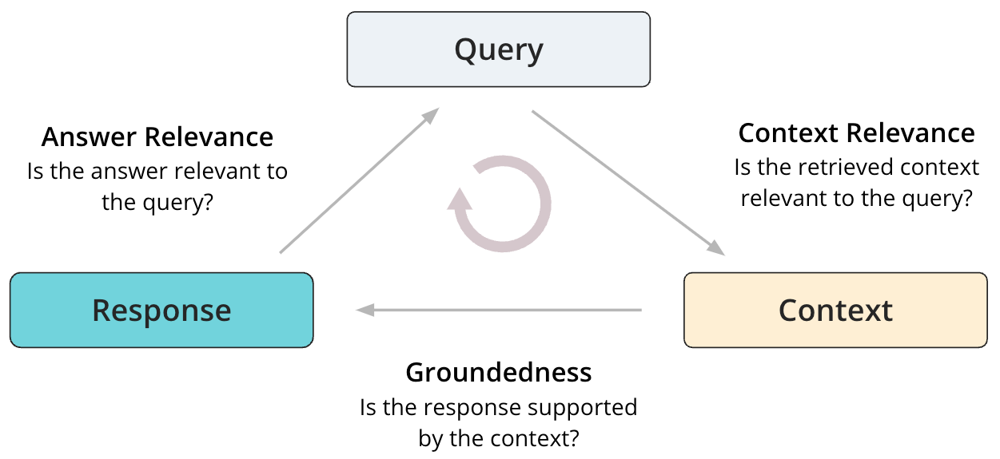
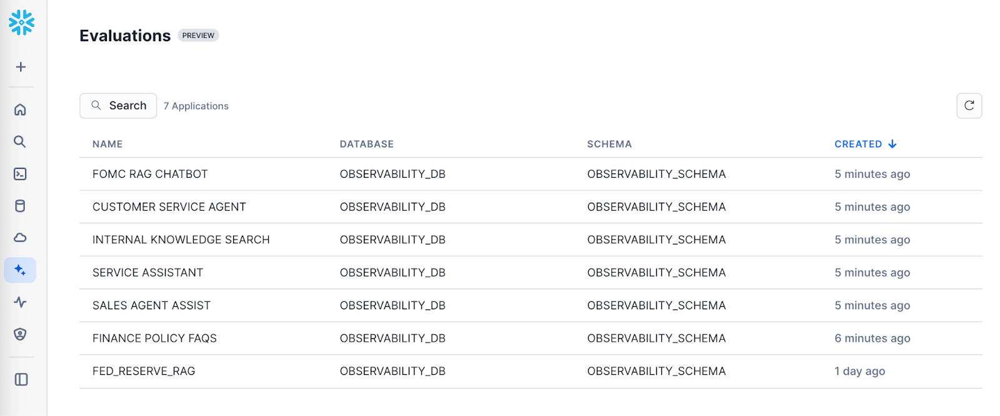
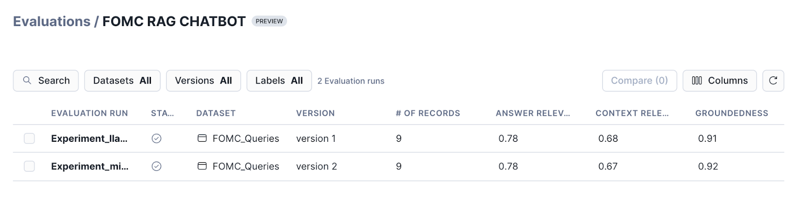
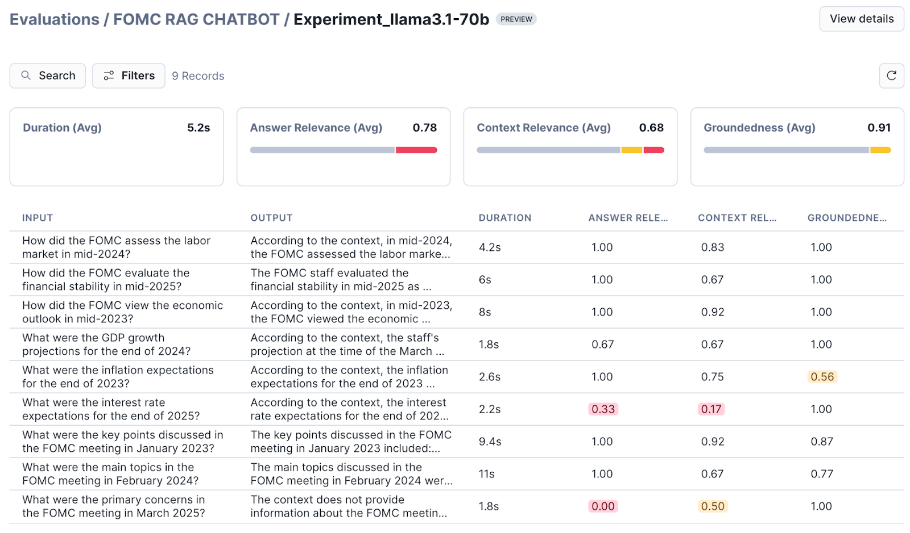
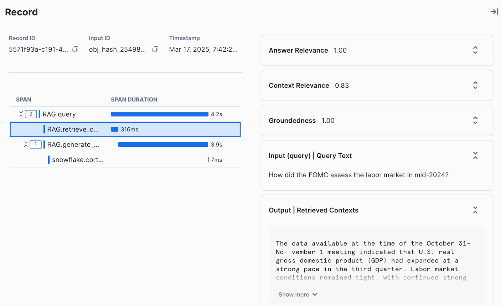

author: Josh Reini
id: getting-started-with-ai-observability
categories: snowflake-site:taxonomy/solution-center/certification/quickstart, snowflake-site:taxonomy/product/ai
language: en
summary: Monitor AI model performance with Snowflake AI Observability for drift detection, quality metrics, and production monitoring.
environments: web
status: Published
feedback link: https://github.com/Snowflake-Labs/sfguides/issues
fork repo link: https://github.com/Snowflake-Labs/sfguide-getting-started-with-ai-observability


# Getting Started with AI Observability

## Overview

The widespread integration of large language models (LLMs) and generative AI in mission-critical business processes has created a need for robust AI observability to address the inherent “black box” and nondeterministic nature of these systems and applications. The complexity of AI systems makes it challenging to understand their behavior, performance and resource consumption.

[AI observability](https://docs.snowflake.com/en/user-guide/snowflake-cortex/ai-observability) enables developers to monitor, analyze and visualize the internal states, inputs and outputs of generative AI applications, increasing accuracy, trust, efficiency and regulatory compliance in real-world environments. AI observability spans all stages of application development, including development, testing and production, and anchors on three key pillars:
* **Tracing**: As developers build and customize their applications, tracing enables them to visualize the inputs, outputs and intermediate states of the application. This provides granular information of each component within the application to enable better debugging and explainability of the application behavior.
* **Evaluations**: After the initial version of the application is ready, developers conduct systematic evaluations to assess their application's performance to proactively improve response accuracy. This allows them to test and compare different models and prompts and finalize the configuration for product deployments.
* **Monitoring**: Once the application is deployed in production, developers need to constantly monitor the performance of their application to ensure operational reliability and avoid performance drift. Continuous monitoring also enables them to fine-tune the application by eliminating failure points and accommodating data drift.

In this quickstart, you'll build a [Retrieval-Augmented Generation](https://www.snowflake.com/en/fundamentals/rag/) (RAG) system using Cortex Search and Cortex LLMs. This will be the basis of our example. Last, you'll create a test set and run LLM-as-judge evaluations in batch against your application.

### What is TruLens?

[TruLens](https://www.trulens.org/) is a library for tracking and evaluating Generative AI applications in open source, along with powering Snowflake AI Observability.

### What You Will Learn
- How to load, parse, and chunk data for RAG
- How to create a RAG with Cortex Search and Complete, adding TruLens instrumentation
- How to set application metadata for experiment tracking
- How to create a run and configure your test set for evaluation
- How to compute evaluation metrics in batch on the run
- How to navigate AI Observability to view and compare traces and evaluation results

### What You Will Build
- A retrieval-augmented generation (RAG) app
- An evaluation run with computed metrics

### Prerequisites
- A Snowflake account with Cortex LLM Functions and Cortex Search enabled.  If you do not have a Snowflake account, you can register for a [free trial account](https://signup.snowflake.com/?utm_source=snowflake-devrel&utm_medium=developer-guides&utm_cta=developer-guides&_fsi=yYZEVo4S&_fsi=yYZEVo4S).
- A Snowflake account login with ACCOUNTADMIN role. If you have this role in your environment, you may choose to use it. If not, you will need to 1) Register for a free trial, 2) Use a different role that has the ability to create database, schema, tables, stages, tasks, user-defined functions, and stored procedures OR 3) Use an existing database and schema in which you are able to create the mentioned objects.

## Setup Environment

This phase prepares your environment and creates the dedicated database and warehouse. If you are not working in a Snowflake trial account and do not have ACCOUNTADMIN privileges, ensure that the user role has the following roles granted ():

- SNOWFLAKE.CORTEX_USER database role
- SNOWFLAKE.AI_OBSERVABILITY_EVENTS_LOOKUP application role
- CREATE EXTERNAL AGENT privilege on the schema

For more information, see [Required Privileges for AI Observability](https://docs.snowflake.com/en/user-guide/snowflake-cortex/ai-observability/reference#label-ai-observability-required-privileges).

We will use a [Snowflake Notebook](https://docs.snowflake.com/en/user-guide/ui-snowsight/notebooks) to execute all the setup. Open the [getting-started-with-ai-observability.ipynb](https://github.com/Snowflake-Labs/sfguide-getting-started-with-ai-observability/blob/main/getting-started-with-ai-observability.ipynb) file from the GitHub repository and download it to open the Notebook. ***(NOTE: Do NOT right-click to download.)***

Then, create a new Snowflake Notebook by importing the notebook file in Snowsight.
* Projects » Notebooks
* Click the + Notebook drop-down and select Import .ipynb file
* Select the getting-started-with-ai-observability.ipynb file
* In Create notebook, configure the fields to your liking and click Create when done

Once in the Snowflake Notebook, we will [import packages](https://docs.snowflake.com/en/user-guide/ui-snowsight/notebooks-import-packages) from Anaconda: 
* Select Packages menu at the top of your Notebook
* Search for these packages listed in the Snowflake Anaconda channel
     * `snowflake-ml-python`
     * `snowflake.core`
     * `trulens-core==1.5.2`
     * `trulens-providers-cortex==1.5.2`
     * `trulens-connectors-snowflake==1.5.2`
 * Select a package to install it for use in your Notebook, and optionally change the default package version in the list of Installed Packages
 * Packages installed by you appear under Installed Packages
 * After the package is added, it may take some time to be installed. After it is installed, you will see a confirmation message and you can then import and use the libraries in a Python cell

Once we have the Snowflake Notebook with the right packages installed, we are ready to go.

In the notebook, we will begin by setting up your Snowflake environment. Execute these cells to create a new database, warehouse, and establish a session.

```python
from snowflake.snowpark.context import get_active_session
session = get_active_session()
```

```sql
CREATE DATABASE IF NOT EXISTS cortex_search_tutorial_db;

CREATE OR REPLACE WAREHOUSE cortex_search_tutorial_wh WITH
     WAREHOUSE_SIZE='X-SMALL'
     AUTO_SUSPEND = 120
     AUTO_RESUME = TRUE
     INITIALLY_SUSPENDED=TRUE;

USE WAREHOUSE cortex_search_tutorial_wh;
```

## Prepare Data

This phase focuses on acquiring the documents needed for your RAG application and securely storing them in Snowflake using an internal stage. These documents will be indexed by Cortex Search in a later step. 

You will use a sample dataset of the Federal Open Market Committee (FOMC) meeting minutes for this example. This is a sample of twelve 10-page documents with meeting notes from FOMC meetings from 2023 and 2024. Download the files directly from your browser through this link: [FOMC minutes sample](https://drive.google.com/file/d/1C6TdVjy6d-GnasGO6ZrIEVJQRcedDQxG/view).

The complete set of FOMC minutes can be found at the [US Federal Reserve’s website](https://www.federalreserve.gov/monetarypolicy/fomccalendars.htm).

> NOTE: Make sure to first unzip all the contents of the zipped folder to upload the PDF files.

Execute the following SQL commands in your Snowflake Notebook to create a dedicated stage within your database. This stage is where you will upload the downloaded PDF files.

```sql
CREATE OR REPLACE STAGE cortex_search_tutorial_db.public.fomc
    DIRECTORY = (ENABLE = TRUE)
    ENCRYPTION = (TYPE = 'SNOWFLAKE_SSE');
```

Now upload the dataset. You can upload the dataset in Snowsight or using SQL. To upload in Snowsight:

1. Select Catalog » Database Explorer
2. Select your database `cortex_search_tutorial_db`.
3. Select your schema `public`.
4. Select **Stages** and choose `fomc`.
5. On the top right, select the **+ Files** button.
6. Drag and drop files into the UI or select **Browse** to choose a file from the dialog window.
7. Select **Upload** to upload your file.

Run the following command in your Snowflake Notebook to confirm that your PDF files have been successfully uploaded to the stage.

```sql
ls @cortex_search_tutorial_db.public.fomc
```

You should see a list of the PDF files, confirming they are ready to be parsed and indexed for RAG.

### Parse the data

To make the PDF data useful for retrieval, we must first extract the text content and then break that content into small, searchable segments.

We use the built in SNOWFLAKE.CORTEX.PARSE_DOCUMENT function to extract text from the PDF files stored in your stage, placing the result into a new table. 

Execute the following SQL commands in your Snowflake Notebook to parse the uploaded PDF files and extract their content.

```sql
CREATE OR REPLACE TABLE CORTEX_SEARCH_TUTORIAL_DB.PUBLIC.PARSED_FOMC_CONTENT AS SELECT 
      relative_path,
      TO_VARCHAR(
        SNOWFLAKE.CORTEX.PARSE_DOCUMENT(
          @cortex_search_tutorial_db.public.fomc, 
          relative_path, 
          {'mode': 'LAYOUT'}
        ) :content
      ) AS parsed_text
    FROM directory(@cortex_search_tutorial_db.public.fomc)
    WHERE relative_path LIKE '%.pdf'
```

### Chunk the data

Large text blocks are inefficient for search. We use the SNOWFLAKE.CORTEX.SPLIT_TEXT_RECURSIVE_CHARACTER function to break the parsed content into smaller, overlapping chunks. This overlap ensures context is not lost at the chunk boundaries. 

Execute the following commands in your Snowflake Notebook to split the parsed text into manageable chunks for efficient searching.

```sql
CREATE OR REPLACE TABLE CORTEX_SEARCH_TUTORIAL_DB.PUBLIC.CHUNKED_FOMC_CONTENT (
    file_name VARCHAR,
    CHUNK VARCHAR
);

INSERT INTO CORTEX_SEARCH_TUTORIAL_DB.PUBLIC.CHUNKED_FOMC_CONTENT (file_name, CHUNK)
SELECT
    relative_path,
    c.value AS CHUNK
FROM
    CORTEX_SEARCH_TUTORIAL_DB.PUBLIC.PARSED_FOMC_CONTENT,
    LATERAL FLATTEN( input => SNOWFLAKE.CORTEX.SPLIT_TEXT_RECURSIVE_CHARACTER (
        parsed_text,
        'markdown',
        1800,
        250
    )) c;
```

## Create a RAG

In this phase, you will create the Cortex Search Service, establish the tracing mechanism using TruLens, and construct the complete RAG application.

We create the search index over the chunked FOMC data, defining the warehouse and the embedding model. Execute the following commands in your Snowflake Notebook to set up the Cortex Search service and enable efficient querying of the chunked content.

```sql
CREATE OR REPLACE CORTEX SEARCH SERVICE CORTEX_SEARCH_TUTORIAL_DB.PUBLIC.FOMC_SEARCH_SERVICE
    ON chunk
    WAREHOUSE = cortex_search_tutorial_wh
    TARGET_LAG = '1 hour'
    EMBEDDING_MODEL = 'snowflake-arctic-embed-l-v2.0'
    AS (
    SELECT
        file_name,
        chunk
    FROM CORTEX_SEARCH_TUTORIAL_DB.PUBLIC.CHUNKED_FOMC_CONTENT
    );
```

Next, we define a class `CortexSearchRetreiver` to connect to our Cortex Search Service and add the `retrieve` method that we can leverage to call it from within the Snowflake Notebook session. Execute the following code in the Snowflake Notebook:

```python
from snowflake.snowpark.context import get_active_session
session = get_active_session()
```

```python
import os
from snowflake.core import Root
from typing import List
from snowflake.snowpark.session import Session

class CortexSearchRetriever:

    def __init__(self, snowpark_session: Session, limit_to_retrieve: int = 4):
        self._snowpark_session = snowpark_session
        self._limit_to_retrieve = limit_to_retrieve

    def retrieve(self, query: str) -> List[str]:
        root = Root(session)

        search_service = (root
          .databases["CORTEX_SEARCH_TUTORIAL_DB"]
          .schemas["PUBLIC"]
          .cortex_search_services["FOMC_SEARCH_SERVICE"]
        )
        resp = search_service.search(
          query=query,
          columns=["chunk"],
          limit=self._limit_to_retrieve
        )

        if resp.results:
            return [curr["chunk"] for curr in resp.results]
        else:
            return []
```

```python
retriever = CortexSearchRetriever(snowpark_session=session, limit_to_retrieve=3)

retrieved_context = retriever.retrieve(query="how was inflation expected to evolve in 2024?")

retrieved_context
```

Create a database and schema to store our traces and evaluations.

```sql
create or replace database observability_db;
use database observability_db;
create or replace schema observability_schema;
use schema observability_schema;
```

Then, we construct the RAG system with integrated instrumentation using the retriever we created previously. By including the span type and attributes in instrumentation, it will power evaluations of the spans captured.

```python
from snowflake.cortex import complete
from trulens.core.otel.instrument import instrument
from trulens.otel.semconv.trace import SpanAttributes

class RAG:

    def __init__(self):
        self.retriever = CortexSearchRetriever(snowpark_session=session, limit_to_retrieve=4)

    @instrument(
        span_type=SpanAttributes.SpanType.RETRIEVAL,
        attributes={
            SpanAttributes.RETRIEVAL.QUERY_TEXT: "query",
            SpanAttributes.RETRIEVAL.RETRIEVED_CONTEXTS: "return",
            }
    )
    def retrieve_context(self, query: str) -> list:
        """
        Retrieve relevant text from vector store.
        """
        return self.retriever.retrieve(query)


    @instrument(
        span_type=SpanAttributes.SpanType.GENERATION)
    def generate_completion(self, query: str, context_str: list) -> str:
        """
        Generate answer from context.
        """
        prompt = f"""
          You are an expert assistant extracting information from context provided.
          Answer the question in long-form, fully and completely, based on the context. Do not hallucinate.
          If you don´t have the information just say so. If you do have the information you need, just tell me the answer.
          Context: {context_str}
          Question:
          {query}
          Answer:
        """
        response = ""
        stream = complete("mistral-large2", prompt, stream = True)
        for update in stream:    
          response += update
          print(update, end = '')
        return response

    @instrument(
        span_type=SpanAttributes.SpanType.RECORD_ROOT, 
        attributes={
            SpanAttributes.RECORD_ROOT.INPUT: "query",
            SpanAttributes.RECORD_ROOT.OUTPUT: "return",
        })
    def query(self, query: str) -> str:
        context_str = self.retrieve_context(query)
        return self.generate_completion(query, context_str)


rag = RAG()
```

Test the RAG system by querying it with a sample question. The successful execution of the RAG query confirms that the tracing is active and the system is ready for formal evaluation.

```python
response = rag.query("how was inflation expected to evolve in 2024?")
```

## Register the App

We will register your newly built RAG system with the TruLens observability framework. This registration tells the system where to store the evaluation results and tracing data within Snowflake and defines the specific application you are tracking. We will set metadata, including application name, version, and Snowpark session, to store the experiments.

```python
from trulens.apps.app import TruApp
from trulens.connectors.snowflake import SnowflakeConnector

tru_snowflake_connector = SnowflakeConnector(snowpark_session=session)

app_name = "fed_reserve_rag"
app_version = "cortex_search"

tru_rag = TruApp(
        rag,
        app_name=app_name,
        app_version=app_version,
        connector=tru_snowflake_connector
    )
```
Your application is now ready to run formal evaluations.

## Create a Run

This phase prepares the formal test set and registers the evaluation experiment with TruLens. We will prepare a set of test queries to evaluate the RAG system.

The evaluation requires a dataset of predefined questions and their corresponding correct answers, which are the ground truth responses. The test set can be either a dataframe in Python or a table in Snowflake. In this example, we'll use a table in Snowflake.

1. Download the `fomc_dataset.csv` [dataset](https://github.com/Snowflake-Labs/sfguide-getting-started-with-ai-observability/blob/main/fomc_dataset.csv) provided on GitHub.
2. Upload `fomc_dataset.csv` to Snowflake via Snowsight:
     * Select Ingestion » Add data
     * Select the tile Load data into a Table
     * Upload the `fomc_dataset.csv` file from the [GitHub repository](https://github.com/Snowflake-Labs/sfguide-getting-started-with-ai-observability/tree/main)
     * Choose `OBSERVABILITY_DB.OBSERVABILITY_SCHEMA` for the schema
     * Select + Create new table
     * Name the new table `FOMC_DATA`, then click next
     * Update the column names to `QUERY` and `GROUND_TRUTH_RESPONSE`
     * Select Load

Execute the following code in your Snowflake Notebook. This will set up the configuration for running experiments and add the run to Snowflake.

```python
from trulens.core.run import Run
from trulens.core.run import RunConfig

run_name = "experiment_1_run"

run_config = RunConfig(
    run_name=run_name,
    dataset_name="FOMC_DATA",
    description="Questions about the Federal Open Market Committee meetings",
    label="fomc_rag_eval",
    source_type="TABLE",
    dataset_spec={
        "input": "QUERY",
        "ground_truth_output":"GROUND_TRUTH_RESPONSE",
    },
)

run: Run = tru_rag.add_run(run_config=run_config)
```

Start the experiment run with the prepared test set. This will invoke the application in batch using the inputs in the dataset you provided in the run.

```python
run.start()
```

This may take around 10 to 15 minutes to load. Once this process completes, all the data will be collected and you can proceed to calculate the evaluation metrics.

## Compute Evaluation Metrics

We will analyze the performance of the RAG system by computing relevant metrics.

Execute the following command in your Snowflake Notebook to trigger the batch computation of the three RAG triad.

```python
run.compute_metrics([
    "answer_relevance",
    "context_relevance",
    "groundedness",
])
```

Evaluation metrics provide a quantifiable way to measure the accuracy and performance of your application. These metrics are computed using specific inputs to the application, LLM-generated outputs and any intermediate information (e.g., retrieved results for a RAG application). Additionally, some metrics can also be computed using ground truth if available.

Metric computations use the "LLM-as-a-judge" approach, where an LLM is used to generate a score (between 0 - 1) and an associated explanation is given based on the provided information.

The starting point for evaluating RAGs is the RAG triad of context relevance, groundedness and answer relevance. These are localized evaluations of a RAG system, so you can pinpoint the root cause of poor performance. They are also reference-free, meaning they can be run without using ground truth data.



### Context Relevance
Context Relevance determines if the retrieved context from the retriever or the search service is relevant to the user query. Given the user query and retrieved context, an LLM judge is used to determine relevance of the retrieved context based on the query. 

### Groundedness
Groundedness determines if the generated response is supported by and grounded in the retrieved context from the retriever or the search service. Given the generated response and retrieved context, an LLM judge is used to determine groundedness. The underlying implementation uses Chain-of-thought reasoning when generating the groundedness scores. 

### Answer Relevance
Answer relevance determines if the generated response is relevant to the user query. Given the user query and generated response, an LLM judge is used to determine how relevant the response is when answering the user’s query. Note that this doesn’t rely on ground truth answer reference, and therefore this is not equivalent to assessing answer correctness. 

## Examine Results

To view evaluation results, navigate to Snowsight. Select AI & ML » Evaluations in the side navigation menu. The following user journey navigates you through the steps to view the evaluation results for your application runs

1. View all applications: Navigate to Snowsight. Select AI & ML » Evaluations
   


2. View runs corresponding to an application: Select a specific application to view the list of runs.
    


3. View evaluation results for a run: Select a run to view the aggregated results and the results corresponding to each record.



4. View traces for each record: Select a specific record to view detailed traces, metadata and evaluation results for the record.
   


## Conclusion And Resources

Congratulations! You've successfully built a RAG by combining Cortex Search and Cortex Complete. You also created your first run and computed evaluation metrics on the run. Last, you learned how to navigate the AI Observability interface to understand the detailed traces and individual evaluation results.

### What You Learned

- How to build a RAG with Cortex Search and Cortex LLM Functions.
- How to create a run for batch evaluation
- How to compute evaluation metrics on a run
- How to view results

### Related Resources

- [AI Observability Documentation](https://docs.snowflake.com/en/user-guide/snowflake-cortex/ai-observability/)
- [Open Source TruLens Documentation](https://www.trulens.org/getting_started/)
