author: marzillo-snow
id: getting-started-with-amazon-q-business-and-cortex
categories: snowflake-site:taxonomy/solution-center/certification/quickstart, snowflake-site:taxonomy/product/ai, snowflake-site:taxonomy/snowflake-feature/cortex-llm-functions
language: en
summary: Integrate Amazon Q Business with Snowflake Cortex for enterprise AI assistants that query data across multiple cloud platforms.
environments: web
status: Published 
feedback link: https://github.com/Snowflake-Labs/sfguides/issues
fork repo link: https://github.com/Snowflake-Labs/sfguide-getting-started-with-amazon-q-for-business-and-cortex


# Getting Started with Amazon Q Business and Cortex
<!-- ------------------------ -->
## Overview 

Cortex Search enables low-latency, high-quality “fuzzy” search over your Snowflake data. Cortex Search powers a broad array of search experiences for Snowflake users including Retrieval Augmented Generation (RAG) applications leveraging Large Language Models (LLMs).

Cortex Search gets you up and running with a hybrid (vector and keyword) search engine on your text data in minutes, without having to worry about embedding, infrastructure maintenance, search quality parameter tuning, or ongoing index refreshes. This means you can spend less time on infrastructure and search quality tuning, and more time developing high-quality chat and search experiences using your data. Check out the Cortex Search tutorials for step-by-step instructions on using Cortex Search to power AI chat and search applications.


Amazon Q Business makes generative AI securely accessible to everyone in your organization. Leveraging your own company's content, data, and systems, Amazon Q Business makes it easier to get you fast, relevant answers to pressing questions, solve problems, generate content, and take actions on your behalf. Amazon Q Business easily and securely connects to commonly used systems and tools so it can synthesize everything and provide tailored assistance empowering your teams to be more data-driven, creative, and productive.

Amazon Q Business offers plugins to enhance your application's functionality. Plugins help streamline tasks and boost productivity by integrating external services into the Amazon Q Business chat interface. With custom plugins from Q customers can quickly and securely connect to Cortex services like Search.

### Use Case

In this use case you will build a Cortex Search service on the free text data contained in the two manuals [here](https://github.com/Snowflake-Labs/sfguide-getting-started-with-amazon-q-for-business-and-cortex) for pump and pump head maintenance.

You will build a Cortex service that allows to you to us plain text to query these documents to get information. It is important to note that Cortex Search can scale much more than this use case. Please check out the Cortex Search documentation [here.](https://docs.snowflake.com/en/user-guide/snowflake-cortex/cortex-search/query-cortex-search-service)

The end-to-end workflow will look like this:
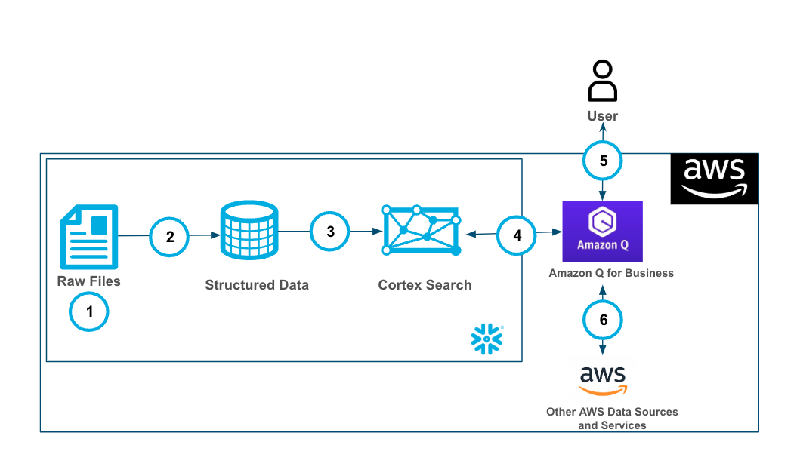
1. Ingest .pdf files into Snowflake Stage.
2. Using the PARSE_DOCUMENT() and the SPLIT_TEXT_RECURSIVE_CHARACTER() the raw pdf files are converted to a chunked field in a table.
3. The Cortex Search service is built on the chunked data.
4. Amazon Q Business is connected to the Cortex Search service with a plugin using oauth authentication.
5. Users can use Amazon Q Business with Cortex securely and seamlessly.
6. Along with the Cortex Plugin users can access other AWS data and services through Amazon Q Business

### Prerequisites
- Familiarity with [Snowflake](/en/developers/guides/getting-started-with-snowflake/) and a Snowflake account with Cortex Search.
- Familiarity with [AWS](https://aws.amazon.com/free) and an AWS account.

### What You'll Learn
- Using Cortex Search along with complimentary functions in Snowflake.
- Using Amazon Q to leverage generative AI to get quick answers from your data.
- Connect Amazon Q to Snowflake Cortex Search with a custom plugin.

### What You’ll Need 
- A free [Snowflake Account](https://signup.snowflake.com/?utm_source=snowflake-devrel&utm_medium=developer-guides&utm_cta=developer-guides)
- [AWS Account](https://aws.amazon.com/free) with access to Q
- For the sake of the lab it is best if both platforms have access to the public internet and are not in a virtual network


### What You’ll Build 
You will build an end-to-end copilot workflow on unstructured data in Snowflake
- to load data to Snowflake via Snowsight
- to extract unstructured data and create chunks in Snowflake
- to create a Snowflake Cortex Search Service on unstructured data
- to create a connection from Amazon Q to Cortex Search with Oauth authentication

<!-- ------------------------ -->
## Set Up Snowflake and Cortex

Download both of the files in [this repo](https://github.com/Snowflake-Labs/sfguide-getting-started-with-amazon-q-for-business-and-cortex) by clicking on each file and clicking the download button near the top right.

Once you have the files downloaded locally you will go to the Snowflake UI and open a new SQL worksheet and run the below code to create a database that we will be working out with. I'm using the ACCOUNTADMIN role here, but you can use whatever role you know gives you access to create objects (databases, tables, services) in Snowflake.

```sql
USE ACCOUNTADMIN;
CREATE OR REPLACE WAREHOUSE HOL_WH WITH WAREHOUSE_SIZE='X-SMALL';
CREATE OR REPLACE DATABASE PUMP_DB;
USE DATABASE PUMP_DB;
CREATE STAGE DOCS 
	DIRECTORY = ( ENABLE = true ) 
	ENCRYPTION = ( TYPE = 'SNOWFLAKE_SSE' );
```

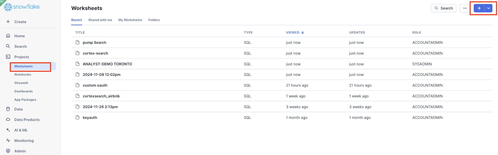

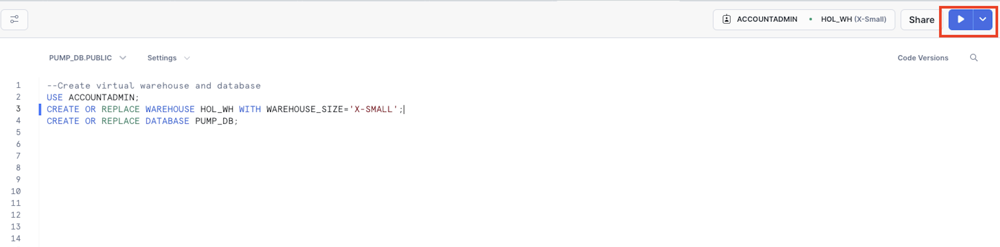

Now that you have the database created you can upload the 2 manuals to a stage in the PUMP_DB database in the DOCS stage by clicking on Data on the left side of the Snowflake UI, clicking through to find the DOCS stage in the PUBLIC schema then clicking "+ files" in the top right to upload the files from your local machine.

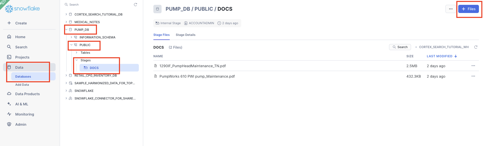


Now, you will run the below code that will parse the data out of the documents into a field in a table PUMP_TABLE, then chunk the fields into a new table PUMP_TABLE_CHUNK. 

```sql
--Create Table for text data
CREATE OR REPLACE TABLE PUMP_TABLE AS
SELECT 
    '1290IF_PumpHeadMaintenance_TN' as doc,
    SNOWFLAKE.CORTEX.PARSE_DOCUMENT(@PUMP_DB.PUBLIC.DOCS, '1290IF_PumpHeadMaintenance_TN.pdf', {'mode': 'LAYOUT'}) as pump_maint_text;

INSERT INTO PUMP_TABLE (doc, pump_maint_text)
SELECT 'PumpWorks 610', SNOWFLAKE.CORTEX.PARSE_DOCUMENT(@PUMP_DB.PUBLIC.DOCS, 'PumpWorks 610 PWI pump_Maintenance.pdf', {'mode': 'LAYOUT'});

-- Create table with chunked text
CREATE OR REPLACE TABLE PUMP_TABLE_CHUNK AS
SELECT
   TO_VARCHAR(c.value) as CHUNK_TEXT, DOC
FROM
   PUMP_TABLE,
   LATERAL FLATTEN( input => SNOWFLAKE.CORTEX.SPLIT_TEXT_RECURSIVE_CHARACTER (
      TO_VARCHAR(pump_maint_text:content),
      'none',
      700,
      100
   )) c;
SELECT * FROM PUMP_TABLE_CHUNK;
```

You can see that we're setting the chunks up to be up to 700 tokens with 100 tokens overlap. After the initial setup you can adjust these settings as you would like. Additionally, we are using'none' for the format rather than 'markdown'. You can see more information using the SPLIT_TEXT_RECURSIVE_CHARACTER() funciton [here.](https://docs.snowflake.com/en/sql-reference/functions/split_text_recursive_character-snowflake-cortex)

Next, we will run the code on the CHUNK_TEXT field to create a Cortex Search service.

```sql
-- Create Search Service
CREATE OR REPLACE CORTEX SEARCH SERVICE PUMP_SEARCH_SERVICE
  ON CHUNK_TEXT
  ATTRIBUTES DOC
  WAREHOUSE = HOL_WH
  TARGET_LAG = '30 day'
  AS (
    SELECT CHUNK_TEXT as CHUNK_TEXT, DOC FROM PUMP_TABLE_CHUNK);
```

Notice how we're setting up the Cortex Search service with a 30 day lag so that incremental updates to the service will be made ever 30 days. Additionally, we're setting up the service so that additional filters can be used on the attribute "DOC".

## Set Up Q Business

Head to you AWS console search "Amazon Q Business" then select the orange button "Create Application" then accept all of the default/recommended settings for creating your application, make sure that you have at least one user created for the app with a Q Business Pro subscription the select Create.

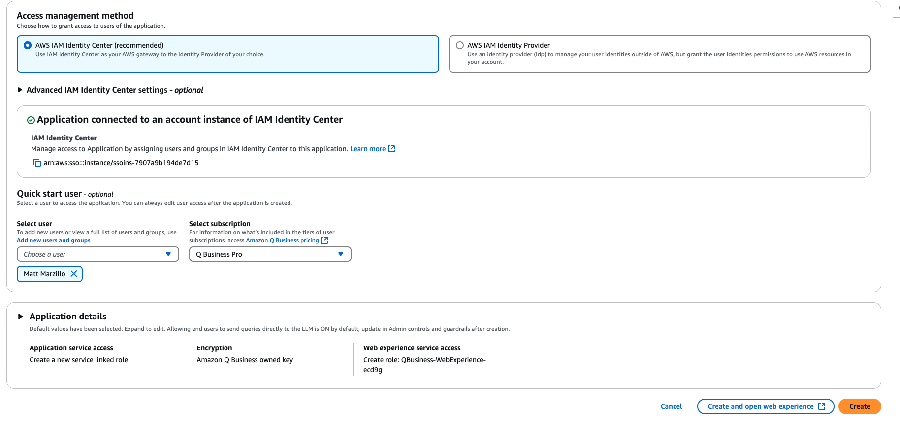

<!-- ------------------------ -->
## Setting up OAuth

From the Q Business Application Details screen copy the "Deployed URL" and save it to a notebook.

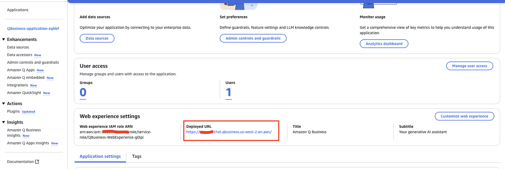

Next we will run the code which creates a security integration in Snowflake that we will use to authenticate with Q Business. The only change you will have to make to this code is replacing the value of the "Deployed URL" from the Q App in the value <Deployed URL> below to complete the OAUTH_REDIRECT_URI value.

```sql
--create custom oauth
CREATE OR REPLACE SECURITY INTEGRATION Q_AUTH_HOL
  TYPE = OAUTH
  ENABLED = TRUE
  OAUTH_ISSUE_REFRESH_TOKENS = TRUE
  OAUTH_REFRESH_TOKEN_VALIDITY = 3600
  OAUTH_CLIENT = CUSTOM
  OAUTH_CLIENT_TYPE = CONFIDENTIAL
  OAUTH_REDIRECT_URI = '<Deployed URL>/oauth/callback';

GRANT USAGE on database PUMP_DB to role PUBLIC;
GRANT USAGE on schema PUBLIC to role PUBLIC;
GRANT USAGE on CORTEX SEARCH SERVICE PUMP_SEARCH_SERVICE to role PUBLIC;

DESC INTEGRATION Q_AUTH_HOL;

SELECT SYSTEM$SHOW_OAUTH_CLIENT_SECRETS('Q_AUTH_HOL');
```

After the security integration is created we grant the PUBLIC roles usage on the database, schema and the Search service. 

Additionally, after the "SELECT SYSTEM$SHOW_OAUTH_CLIENT_SECRETS('Q_AUTH_HOL');" query copy the OAUTH_CLIENT_ID and the OAUTH_CLIENT_SECRET. You can learn more about using Snowflake for Oauth [here.](https://docs.snowflake.com/en/user-guide/oauth-custom)

Also, make note of your Snowflake url. You can do this by going to your alias in the bottom left of the Snowflake UI finding your account then selecting the "link" button that says "copy account url" when you hover over it.

<!-- ------------------------ -->
## Create Cortex Plugin

Head back to your Q Business application and select "Plugins" under "Actions" on the left side. Select the orange "Add Plugin" button then 
"Create Custom Plugin" in the top right.

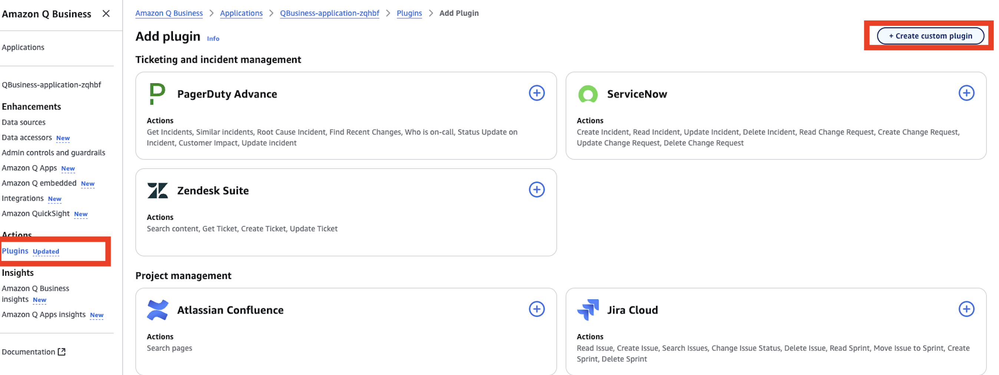

1. name the plugin "cortex-pump" and provide a description. 

2. Under "API Schema" select "Define with in-line OpenAPI schema editor" and make sure that "YAML" is selected and paste in the below openapi spec. Several notes:
    - you will have to copy in your <snowflake url> in 3 spots below where indicated.
    - the path defined in the openapi schema assumes that you set up you Cortex Search service in the pump_db database and in the int public schema with the the name PUMP_SEARCH_SERVICE. If you did not make any changes to the Snowflake code that you already ran in this quickstart you will be good and not have to change anything.
    - the 'description' value here is important as you will see Q uses this to know when to route questions to the plugin.

```yaml
openapi: 3.0.0
info:
  title: Cortex Search API
  version: 2.0.0
servers:
  - url: <snowflake url>
paths:
  /api/v2/databases/pump_db/schemas/public/cortex-search-services/PUMP_SEARCH_SERVICE:query:
    post:
      parameters:
      - in: header
        description: Customer Snowflake OAuth header
        name: X-Snowflake-Authorization-Token-Type
        schema:
          type: string
          enum: ["OAUTH"]
        required: true
      summary: Query the Cortex Search service
      description: Submit a query to the Cortex Search service in order to answer questions specifically about Pumps or other mechanical parts or repair or maintenance information
      requestBody:
        required: true
        content:
          application/json:
            schema:
              $ref: '#/components/schemas/QueryRequest'
      responses:
        '200':
          description: Successful response
          content:
            application/json:
              schema:
                $ref: '#/components/schemas/QueryResponse'
      security:
        - oauth2: []
components:
  schemas:
    QueryRequest:
      type: object
      required:
        - query
      properties:
        query:
          type: string
          description: The search query
        limit:
          type: integer
          description: The maximum number of results to return
          example: 5
    QueryResponse:
      type: object
      description: Search results.
      properties:
        results:
          type: array
          description: List of result rows.
          items:
            type: object
            additionalProperties: true
            description: Map of column names to bytes.
        request_id:
          type: string
          description: ID of the request.
      required:
      - results
      - request_id
  securitySchemes:
    oauth2:
      type: oauth2
      flows:
        authorizationCode:
          authorizationUrl: <snowflake url>/oauth/authorize
          tokenUrl: <snowflake url>/oauth/token-request
          scopes:
            refresh_token: Refresh the OAuth token
            session:role:PUBLIC: The Snowflake role for the integration

```

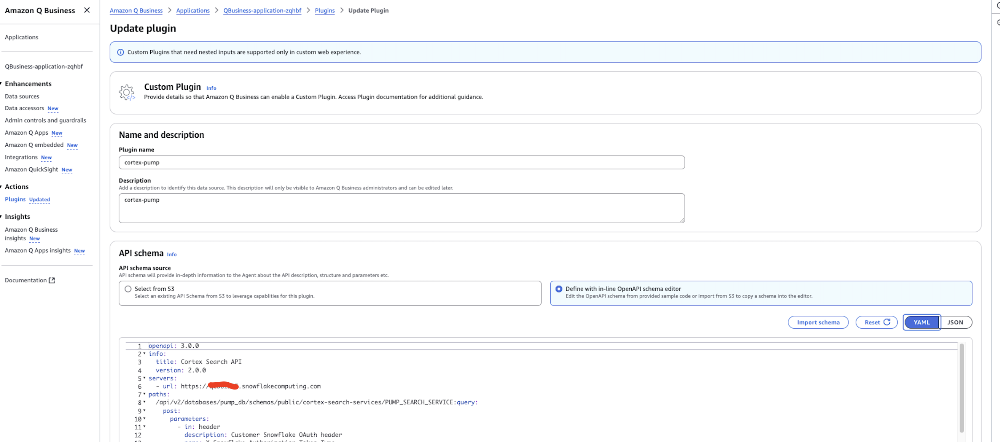

- Under "Authentication" select "Authentication required".
- Under "AWS Secrets Manager" select the dropdown menu and select "create an aws Secrets Manager secret".
    - Give the secret a name like "...-cortex-pump" then populate the "Client Secret" and the "Client ID" with the values from the last Snowflake query in the previous step. 
    - The "OAuth callback url" will be the same as the value for the OAUTH_REDIRECT_URI parameter that was used when creating the security integration object in Snowflake.
- Click "Create" when done.

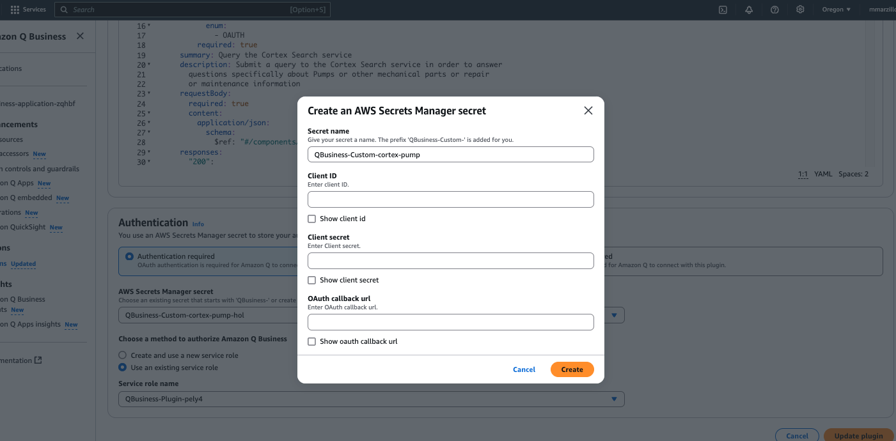

Last, select "Create and use a new service role" to quickly create and use a role that has permissions to use Q Business.

IF you elect to use an existing role you will have to add the below permission to that role.

```json
{
    "Version": "2012-10-17",
    "Statement": [
        {
            "Sid": "AllowQBusinessToGetSecretValue",
            "Effect": "Allow",
            "Action": [
                "secretsmanager:GetSecretValue"
            ],
            "Resource": [
                "<secrets ARN>"
            ]
        }
    ]
}
```

Finally, select "Add Plugin" and it will take 1-2 minutes to get the plugin created.

<!-- ------------------------ -->
## Connect Q and Cortex

Navigate into the "cortex-pump" plugin and select "Preview web experience" in the top right, a new window will open to edit the web experience, leave it as-is and select "View web experience" in the top right:

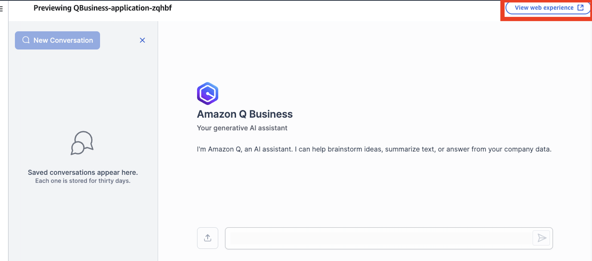

In the chat select "plugin" at the bottom and select the plugin we created for cortex-pump. When you select the plugin you are signaling to Q Business that you want to specifically invoke that action as opposed to using a different source. Ask the below question:

- What is the part description for part number G4204-68741?

Q Business will likely attempt to create query,  retype (or re-paste) the question in the query window and select "Submit".

You will be asked to authorize and use the browser to authorize one time.

Once complete Q will send the request to the plugin and you will get an answer!

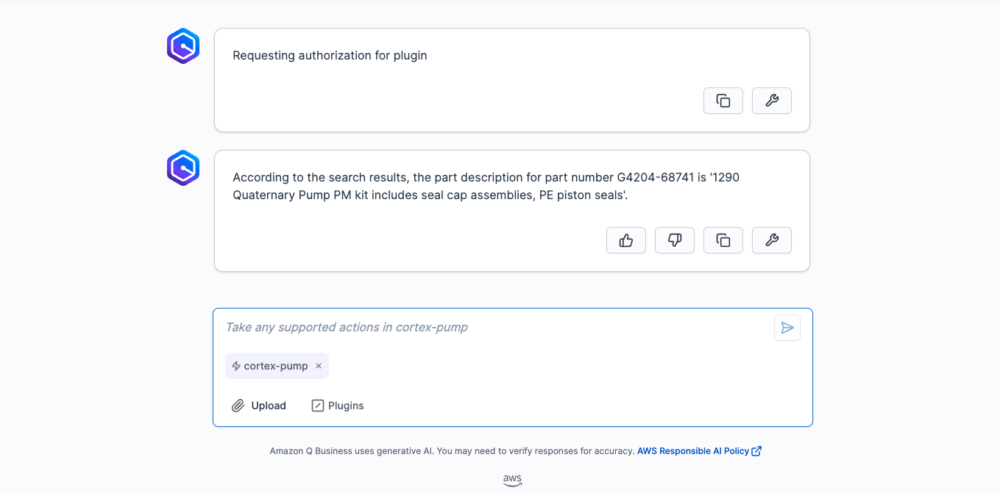

You can check the answer against the manuals, it should match! Test out other prompts including the examples below:
- What are the pump head assembly parts?
- Should I use a refurbished pump head for maintenance and repair OR disassemble a pump head?
- What are the high level steps for Replacing the Heat Exchanger?
- What are best ways to prevent the pump from damage?
- What are spare parts that are included with this pump?

<!-- ------------------------ -->
## Conclusion and Resources

This quickstart is just that, a quick way to get you started with using Amazon Q with Snowflake Cortex, though with this start you are now enabled to extend the quickstart in the below ways:
    - Scale the workflow to a use case with many documents and use a more robust Cortex Search Service.
    - Use a Cortex Q plugin alongside Quicksight to get next level answers on your data that's represented in your dashboards.
    - Use multiple plugins to Cortex from Q along with AWS service to create a robust web app for getting answers from your data with plain text.

### What You Learned
- Loading data to Snowflake via Snowsight
- Extracting unstructured data and creating chunks in Snowflake
- Creating a Snowflake Cortex Search Service on unstructured data
- Creating a connection from Amazon Q to Cortex Search with Oauth authentication using Q plugins

### Resources
There are some great blogs on Medium regarding Snowflake Cortex and Amazon Services work together:

- [Snowflake Cortex](/en/data-cloud/cortex/)

- [Amazon Q](https://aws.amazon.com/q/?trk=c570e8a2-ec3c-4968-baa4-f8537e37dd1d&sc_channel=ps&s_kwcid=AL!4422!10!71949557907688!71950102400240&ef_id=07cc246a6d4218358de8430ee23fc18e:G:s&msclkid=07cc246a6d4218358de8430ee23fc18e)

- [Amazon Bedrock and Snowflake Cortex](https://catalog.us-east-1.prod.workshops.aws/workshops/2d4e5ea4-78c8-496f-8246-50d8971414c9/en-US/01-overview)

- [Using Snowflake, Streamlit and External Access with amazon Bedrcok](/en/developers/guides/getting-started-with-bedrock-streamlit-and-snowflake/)
