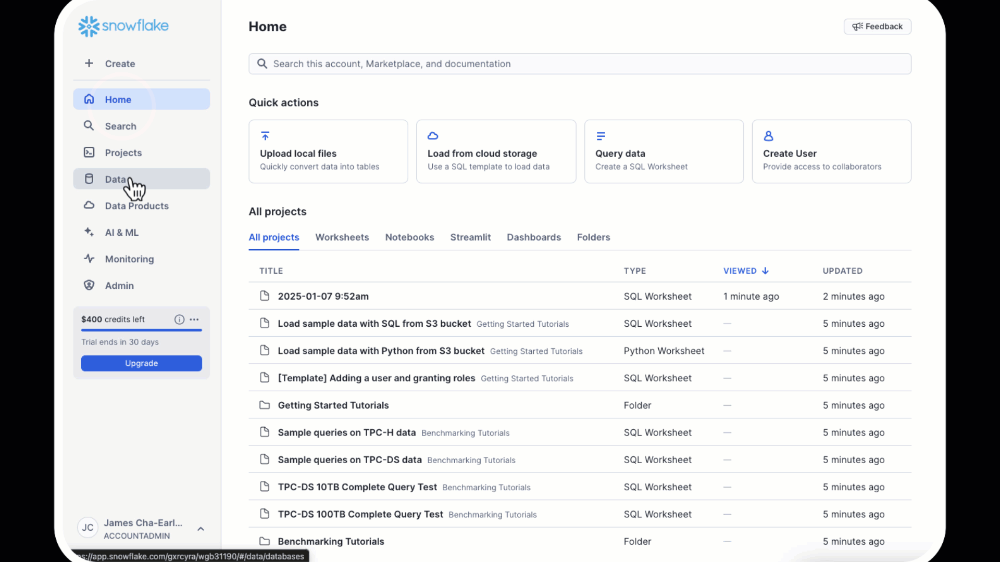
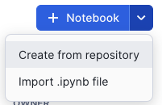

summary: Access Claude models via Snowflake Cortex for text generation, analysis, and enterprise AI applications.
id: getting-started-with-anthropic-on-snowflake-cortex
categories: snowflake-site:taxonomy/solution-center/certification/quickstart, snowflake-site:taxonomy/product/ai, snowflake-site:taxonomy/snowflake-feature/cortex-llm-functions
language: en
environments: web
status: Published
feedback link: https://github.com/Snowflake-Labs/sfguides/issues
author: James Cha-Earley

# Getting Started with Anthropic on Snowflake Cortex

## Overview


In this quickstart, you'll learn how to build an RAG-based (Retrieval Augmented Generation)  application that creates an intelligent assistant for documents and other text-based knowledge. The application uses Anthropic's Claude Large Language Model (LLM),  in [Snowflake's Cortex AI](/en/data-cloud/cortex/) alongside Cortex Search and Streamlit. The application addresses end-to-end RAG development to show how to do PDF processing, vector embeddings, retrieval and generation all inside Snowflake to enable natural language interactions with your documents through Claude's advanced language understanding capabilities all with unified governance across the application full-stack.

### What You'll Learn

- Data pipeline: Setting up PDF processing in Snowflake using Cortex Parse Document  
- Vector search/index: Utilizing Cortex Search Service for hybrid (semantic and keyword) search  
- Generation: Deliver answers to chat app with Anthropic's Claude  
- Front End: Developing an interactive chat interface using Streamlit

### What You'll Build

An end-to-end application that enables users to:

- Upload and process PDF documents  
- Search through documents using a hybrid search (vector and keyword) similarity  
- Engage in conversational Q\&A about document content  
- View source documents for responses  
- Maintain chat history for contextual conversations

### Prerequisites

- Snowflake account in [AWS US West 2 (Oregon)](https://docs.snowflake.com/en/user-guide/snowflake-cortex/llm-functions#label-cortex-llm-availability) . To use Anthropic from another region please enable [cross-region inference](https://docs.snowflake.com/en/user-guide/snowflake-cortex/cross-region-inference).  
- Account must have these features enabled:  
  - [Snowflake Notebooks](https://docs.snowflake.com/en/user-guide/ui-snowsight/notebooks)  
  - [Anaconda Packages](https://docs.snowflake.com/en/developer-guide/udf/python/udf-python-packages#using-third-party-packages-from-anaconda)  
  - [Cortex LLM Functions](https://docs.snowflake.com/en/sql-reference/functions/complete-snowflake-cortex)  
  - [Streamlit in Snowflake](https://docs.snowflake.com/en/developer-guide/streamlit/about-streamlit)

## Setup


> 
> NOTE: If you are new to Snowflake, you may be wondering why you need to think about database and schemas to get started. Because Snowflake was built with data as the foundational asset that powers projects, these two things are used to organize and manage access and governance to data in Snowflake. You can learn more about how you can use and manage these in our [documentation](https://docs.snowflake.com/en/sql-reference/ddl-database). 
> 
> For this app, let’s assume we will give users of the app access to all the documents that are stored in a stage (the location where a raw data file is stored). Let’s create a stage where documents are stored and then let’s create a database and schema, both with the same name, where we will store the AI-ready (parsed and chunked) documents.  

### Create Database and Schema

Create a new database and schema for your project:

```sql
CREATE DATABASE IF NOT EXISTS anthropic_rag;
CREATE SCHEMA IF NOT EXISTS anthropic_rag;
```

### Create Table for Text on the Documents

```sql
CREATE OR REPLACE TABLE DOCS_TEXT_TABLE (
   FILE_NAME STRING,
   TEXT STRING
);
```

### Create Document Storage Stage

Create a stage to store your PDF documents:

```sql
CREATE STAGE IF NOT EXISTS Documents
  ENCRYPTION = (TYPE = 'SNOWFLAKE_SSE')
  DIRECTORY = (ENABLE = true);
```

## Upload Documents

1. Download sample [PDFs](https://github.com/Snowflake-Labs/sfguides-getting-started-with-anthropic-on-snowflake-cortex/blob/main/data/docs.zip)
2. Navigate to Data \> Databases \> ANTHROPIC\_RAG \> DOCUMENTS \> Stages

3. Click "Upload Files" button in top right  
4. Select your PDF files


## Snowflake Notebook


1. Click on [Getting Started with Anthropic Notebook](https://github.com/Snowflake-Labs/sfguides-getting-started-with-anthropic-on-snowflake-cortex/blob/main/sfguides-getting-started-with-anthropic-on-snowflake-cortex.ipynb) to download the Notebook from GitHub. (NOTE: Do NOT right-click to download.)  
     
2. In your Snowflake account:  
     
   * On the left hand navigation menu, click on Projects » Notebooks  
   * On the top right, click on Notebook down arrow and select **Import .ipynb** file from the dropdown menu
     
   * Select the file you downloaded in step 1 above

3. In the Create Notebook popup:  
     
   * For Notebook location, select **anthropic\_rag** for your database and schema  
   * Select your **Warehouse**  
   * Click on Create button

## Environment Setup


- `snowflake-ml-python`: For Snowflake Cortex capabilities
- `snowflake`: For Snowflake capabilities

```py
# Import python packages
import pandas as pd
import json

from snowflake.snowpark.context import get_active_session
from snowflake.cortex import Complete, EmbedText768
from snowflake.snowpark.types import VectorType, FloatType
from snowflake.core.table import Table, TableColumn
from snowflake.core import CreateMode, Root
from snowflake.snowpark.functions import cast, col


session = get_active_session()
current_warehouse = session.get_current_warehouse()
database_name = session.get_current_database()
schema_name = session.get_current_schema()
role_name = session.get_current_role()
service_name = 'document_search_service'
root = Root(session)
database = root.databases[database_name]
schema = database.schemas[schema_name]
```

## Implement Document Processing


### Understanding Document Processing Flow

Before diving into the code, let's understand the key components of document processing:

The implementation uses Cortex Parse Document to extract text from PDFs and process them efficiently:

1. Document Parsing:
   - Uses Snowflake Cortex Parse Document
   - Handles PDF extraction automatically
   - Manages OCR when needed
   - Structures output consistently

2. Data Organization:
   - Stores raw text with file references
   - Prepares for search service creation
   - Maintains document traceability

### Code Implementation

```py
def process(file_name: str):
    query = """
        SELECT TO_VARCHAR(
            SNOWFLAKE.CORTEX.PARSE_DOCUMENT(
                ?,
                ?,
                {'mode': 'OCR'}):content
        ) AS OCR;
    """

    resp = session.sql(query, params=[stage_name, file_name]).collect()
    text = resp[0]['OCR']
    
    df = pd.DataFrame({
        'TEXT' : [text],
        'FILE_NAME': file_name
    })
    
    return df
```

## Process Documents


### Understanding the Process

While you could run your own embedding, index management and search using Snowflake Cortex embed function, vector data type support and vector similarity functions, we are going to build this using [Cortex Search](https://docs.snowflake.com/en/user-guide/snowflake-cortex/cortex-search/cortex-search-overview#cortex-search-for-rag) \- a RAG engine that automates the embedding/vector generation and management and provides a built-in hybrid search to enhance result accuracy vs. semantic search alone. 

The embedding process transforms text chunks into vector representations for semantic search. Here's what happens in each step:

Document Processing:
   - Extract text from documents
   - Structure data in DataFrame
   - Load into text table


### Code Implementation

```py
# Extract file names and process files
file_names = [file['name'].split('/')[1] for file in files]

# Download and process files into a DataFrame
final_dataframe = pd.concat([
    process(file_name)
    for file_name in file_names
], ignore_index=True)

snowpark_df = session.create_dataframe(final_dataframe).select(
    col("file_name"),
    col("text")
)

# Write the transformed data directly to the target table
snowpark_df.write.mode("overwrite").save_as_table("docs_text_table")
```
## Create Cortex Search Service 
### Understanding the Service
Search Service:
   - Creates hybrid search capability
   - Manages embeddings automatically
   - Enables both semantic and keyword search

### Key Components Explained 📚

#### Required Parameters

- `ON`: Specifies the column containing the text to be indexed  
- `ATTRIBUTES`: Additional columns to include in search results (e.g., file\_name)  
- `WAREHOUSE`: Compute warehouse for processing the embeddings  
- `TARGET_LAG`: Maximum allowed lag for index updates  
- `EMBEDDING_MODEL`: Model used to generate text embeddings  
- Source query: The SELECT statement defining the data to index

#### Configuration Options 🔧

1. Target Lag Settings:  
     
   - Shorter lag times mean more frequent updates  
   - Common values: '1 hour', '1 day', '1 week'  
   - Balance freshness needs with compute costs

   

2. Embedding Model Options:  
     
   - 'snowflake-arctic-embed-l-v2.0': Latest Snowflake embedding model  
   - Optimized for English language content  
   - 384-dimensional embeddings

   

3. Warehouse Considerations:  
     
   - Choose size based on data volume  
   - Consider compute costs vs update frequency  
   - Monitor warehouse utilization

```sql
CREATE OR REPLACE CORTEX SEARCH SERVICE {{service_name}}
  ON text
  ATTRIBUTES file_name
  WAREHOUSE = {{current_warehouse}}
  TARGET_LAG = '1 day'
  EMBEDDING_MODEL = 'snowflake-arctic-embed-l-v2.0'
  AS (
    SELECT
        text,
        file_name
    FROM docs_text_table
);
```

## Create Streamlit Application


### Understanding the Chat System Architecture

The chat interface integrates several sophisticated components:

1. Session Management:  
     
   - Maintains conversation state  
   - Handles message history  
   - Manages user context  
   - Enables conversation persistence

2. Context Retrieval System with Snowflake Cortex Search:  
     
   - Performs semantic and keyword search  
   - Ranks relevant chunks  
   - Combines multiple sources  
   - Optimizes context window

3. Prompt Engineering:  
     
   - Constructs dynamic prompts  
   - Incorporates chat history  
   - Maintains conversation coherence  
   - Optimizes Claude's responses

4. Response Generation:  
     
   - Processes Claude's output  
   - Formats responses  
   - Adds source attribution  
   - Handles error cases

### Setting Up the Streamlit App

1. Navigate to Streamlit in Snowflake:  
     
   * Click on the **Streamlit** tab in the left navigation pane  
   * Click on **\+ Streamlit App** button in the top right
   

2. Configure App Settings:  
     
   * Enter a name for your app (e.g., ANTHROPIC\_CHAT\_APP)  
   * Select a warehouse to run the app (Small warehouse is sufficient)  
   * Choose the **ANTHROPIC\_RAG** database and schema


3. Create the app file:  

Because the app front-end is running in Snowflake, all the interactions with the Anthropic model and Cortex Search service are done via the Python interface. If you want to integrate these services with an externally hosted UI, we recommend using the REST APIs for [Cortex LLM inference](https://docs.snowflake.com/en/user-guide/snowflake-cortex/cortex-llm-rest-api) and [Cortex Search](https://docs.snowflake.com/en/user-guide/snowflake-cortex/cortex-search/query-cortex-search-service#rest-api).


Here we add our packages that we will use for our project: 

- `snowflake-ml-python 1.7.1`: For Snowflake Cortex capabilities
- `snowflake`: For Snowflake capabilities
* In the code editor, paste the following code:

```py
import json
import streamlit as st
from snowflake.core import Root
from snowflake.snowpark.context import get_active_session
from snowflake.cortex import Complete

session = get_active_session()
root = Root(session)

database_name = session.get_current_database()
schema_name = session.get_current_schema()
service_name = 'document_search_service'

# Configuration
num_results = 3  # Number of results
model_name = "claude-4-sonnet"  # The model we are using
history_length = 5

def init_messages():
    """
    Initialize the session state for chat messages. If the session state indicates that the
    conversation should be cleared or if the "messages" key is not in the session state,
    initialize it as an empty list.
    """
    if st.session_state.clear_conversation or "messages" not in st.session_state:
        st.session_state.messages = []
        st.session_state.suggestions = []
        st.session_state.active_suggestion = None
        

def init_config_options():
    """
    Initialize the chat interface configuration and display existing chat history.
    Provides a button to clear conversation history and maintains chat state.
    """

    st.session_state.num_chat_messages = history_length
    st.button("Clear conversation", key="clear_conversation")
    
    if "messages" not in st.session_state:
        st.session_state.messages = []

    # Display chat messages from history on app rerun
    for message in st.session_state.messages:
        with st.chat_message(message["role"]):
            st.markdown(message["content"])

def get_chat_history():
    """
    Retrieve the chat history from the session state limited to the number of messages

    Returns:
        list: The list of chat messages from the session state.
    """
    start_index = max(
        0, len(st.session_state.messages) - st.session_state.num_chat_messages
    )
    return st.session_state.messages[start_index : len(st.session_state.messages) - 1]

def make_chat_history_summary(chat_history, question):
    """
    Generate a summary of the chat history combined with the current question to extend the query
    context. Use the language model to generate this summary.

    Args:
        chat_history (str): The chat history to include in the summary.
        question (str): The current user question to extend with the chat history.

    Returns:
        str: The generated summary of the chat history and question.
    """
    
    prompt = f"""
        Given the following conversation history and new question, generate a detailed query that incorporates relevant context from the chat history. The query should be written in natural, conversational language and include any important details, preferences, or constraints mentioned previously.

        <chat_history>
        {chat_history}
        </chat_history>
        
        <question>
        {question}
        </question>
        
        Please generate a single, comprehensive query that combines the above information. The query should be self-contained and allow for a complete response without requiring additional context.
    """

    summary = Complete(model_name, prompt)

    return summary

def cortex_search(my_question):
    search_service = (root
      .databases[database_name]
      .schemas[schema_name]
      .cortex_search_services[service_name]
    )

    resp = search_service.search(
      query=my_question,
      columns=["text", "file_name"],
      limit=num_results
    )

    results = json.loads(resp.to_json())["results"]
    prompt_context = ""

    # Building the context from the search results
    for result in results:
        prompt_context += result["text"]
    prompt_context = prompt_context.replace("'", "")

    file_name = results[0]['file_name']
        
    return prompt_context, file_name

def create_prompt(user_question):
    """
    Create a prompt for the language model by combining the user question with context retrieved
    from the cortex search service and chat history (if enabled). Format the prompt according to
    the expected input format of the model.

    Args:
        user_question (str): The user's question to generate a prompt for.

    Returns:
        str: The generated prompt for the language model.
    """

    chat_history = get_chat_history()
    if chat_history != []:
        question_summary = make_chat_history_summary(chat_history, user_question)
        prompt_context, file_name  = cortex_search(question_summary)
    else:
        prompt_context, file_name = cortex_search(user_question)
        question_summary = ''

    prompt = f"""You are a documentation specialist focused on providing precise answers based on provided documentation. 

        Input Context:
        Context: {prompt_context}
        Question: {question_summary}
        Chat History: {chat_history}
        
        Instructions:
        1. Analyze the provided context carefully
        2. Frame responses to build upon any relevant chat history
        3. Structure answers as follows:
           - Direct answer to the question
           - Required prerequisites or dependencies
           - Step-by-step implementation (if applicable)
           - Important limitations or warnings
        
        If information is not found in context:
        1. Explicitly state what information is missing
        2. Avoid assumptions or external references
        3. Specify what additional context would help answer the question
        
        Remember: Only reference information from the provided context.
        
        Response:"""
    return prompt, file_name

def complete(model_name, prompt):
    """
    Generate a completion for the given prompt using the specified model.

    Args:
        model_name (str): The name of the model to use for completion.
        prompt (str): The prompt to generate a completion for.

    Returns:
        str: The generated completion.
    """
    
    df_response = Complete(model_name, prompt)
    return df_response

def display_response(my_question):
    with st.status("In progress...") as status:
        # Get the response from the AI model
        response, name = complete(model_name, my_question)
        
        # Display the response from the model
        st.markdown(response)
        status.update(label="Done!", state="complete", expanded=True)
        
        # Display the source document name
        with st.container():
            display_name = f"This information came from {name}"
            st.markdown(f"This information came from {name}")

# Main code
def main():
    st.title(f":speech_balloon: Chatbot with Snowflake Cortex with Anthropic Claude")

    init_config_options()
    init_messages()

    icons = {"assistant": "❄️", "user": "👤"}
    
    if question := st.chat_input("Ask a question..."):
        # Add user message to chat history
        st.session_state.messages.append({"role": "user", "content": question})
        # Display user message in chat message container
        with st.chat_message("user", avatar=icons["user"]):
            st.markdown(question.replace("$", "\$"))

        # Display assistant response in chat message container
        with st.chat_message("assistant", avatar=icons["assistant"]):
            message_placeholder = st.empty()
            # question = question.replace("'", "")
            with st.spinner("Thinking..."):
                # Generate the response
                prompt, file_name = create_prompt(question)
                generated_response = complete(model_name, prompt)
                
                # Store the generated response directly in session state
                st.session_state.gen_response = generated_response
                
                # Display the generated response
                message_placeholder.markdown(generated_response)

        st.session_state.messages.append(
            {"role": "assistant", "content": generated_response}
        )
        

if __name__ == "__main__":
    session = get_active_session()
    main()

```

4. Run:  
   * Click the **Run** button to deploy your app

### Implementation Components

The chat system consists of several key functions:

1. Message Initialization:  
     
   - Purpose: Sets up chat session state  
   - Features:  
     * Conversation clearing  
     * State management  
     * Suggestion handling   

2. Cortex Search Service:  
     
   - Purpose: Finds relevant document context  
   - Features:  
     * Keyword and Vector Search
     * Context assembly

3. Prompt Creation:  
     
   - Purpose: Builds Claude-optimized prompts  
   - Features:  
     * History integration  
     * Context formatting  
     * Instruction clarity

## Performance Tips


To optimize your RAG system:

1. Document Processing:  
     
   - Use appropriate chunk sizes (default: 1500 characters)  
   - Adjust overlap for better context (default: 300 characters)  
   - Monitor processing times for large documents


2. Search Optimization:  
     
   - Tune number of context chunks (default: 3\)  
   - Consider similarity thresholds  
   - Monitor response times


3. Chat Experience:  
     
   - Adjust history length for context (default: 5 messages)  
   - Balance context window size  
   - Consider memory usage with long conversations

## Conclusion and Resources


Congratulations\! You've built a sophisticated document Q\&A system using Snowflake's Cortex capabilities and Anthropic's Claude. The system combines PDF processing, vector search, and conversational AI to create an intelligent document assistant.

### What You Learned

- How to process PDF documents in Snowflake  
- How to implement semantic search with vector embeddings  
- How to build a RAG system with chat history  
- How to create an interactive Streamlit interface

### Related Resources

* [Intelligent document field extraction and analytics with Document AI](/en/developers/guides/automating-document-processing-workflows-with-document-ai/)  
* [Build conversational analytics app (text-to-SQL) with Cortex Analyst](/en/developers/guides/getting-started-with-cortex-analyst/)
