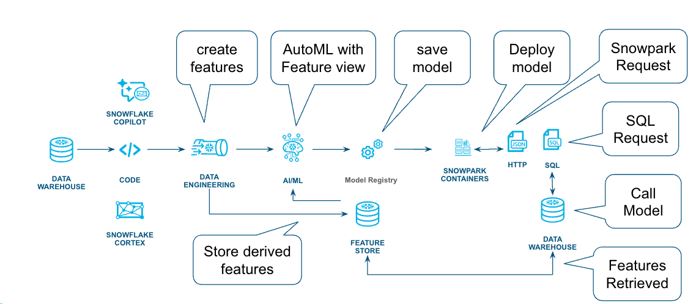
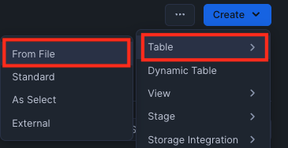
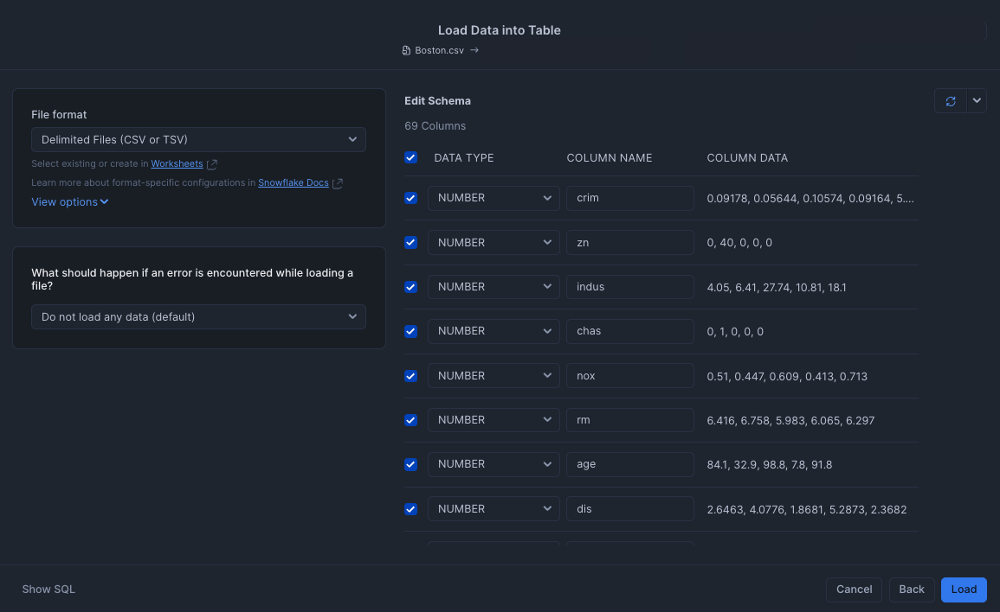
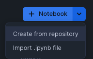
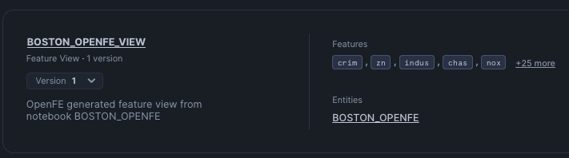
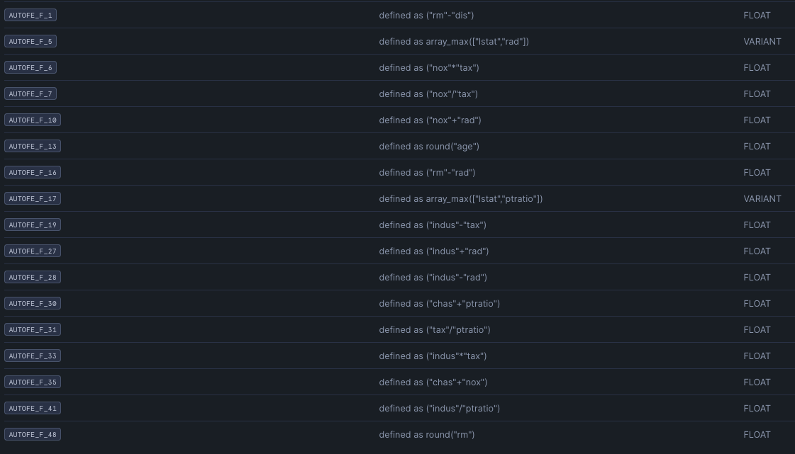
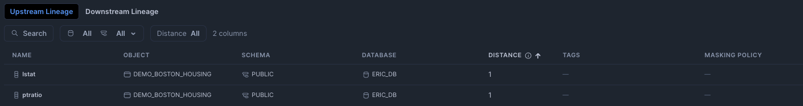
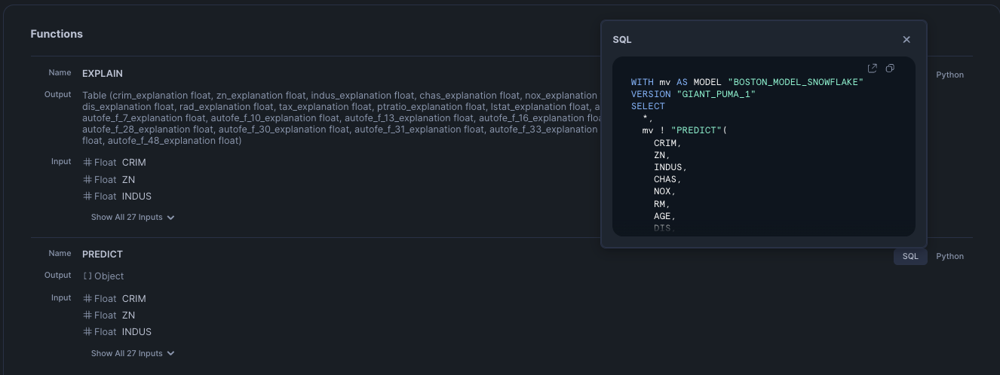

author: Eric Gudgion
id: getting-started-with-automl-openfe-and-autogluon
categories: snowflake-site:taxonomy/solution-center/certification/quickstart, snowflake-site:taxonomy/product/applications-and-collaboration
language: en
summary: Accelerate ML development with AutoML using OpenFE feature engineering and AutoGluon model training in Snowflake notebooks.
environments: web
status: Published 
feedback link: https://github.com/Snowflake-Labs/sfguides/issues
fork repo link: https://github.com/Snowflake-Labs/sfguide-getting-started-with-automl-openfe-and-autogluon


# Getting Started with AutoML, OpenFE and AutoGluon
<!-- ------------------------ -->
## Overview 

This guide demonstrates how to use [OpenFE](https://openfe-document.readthedocs.io/en/latest/), an open-source package, that can automatically generate features and save them into the Snowflake [Feature Store](https://docs.snowflake.com/en/developer-guide/snowflake-ml/feature-store/overview). These features can then be used to train a model, potentially improving its accuracy. This process can save data scientists valuable time compared to creating features manually.

The workflow for this tutorial is shown in the following diagram.



### Prerequisites
* Familiarity Snowpark Container Services
* General machine learning concepts

### What You’ll Learn
* How to create features based on data insights
* Techniques for training models using the Feature Store
* Deploying models built using open source or Snowflake.ML packages
* Different ways to call a model

### What You’ll Need
* Access to a [Snowflake account](https://signup.snowflake.com/?utm_source=snowflake-devrel&utm_medium=developer-guides&utm_cta=developer-guides)
* Basic familiarity with SQL and Python
* Access to download `.ipynb` files from [getting-started-with-automl-openfe-and-autogluon](https://github.com/Snowflake-Labs/sfguide-getting-started-with-automl-openfe-and-autogluon/tree/main/notebooks) Git Repo

### What You’ll Build 
* A set of features based on data insights
* Skills for training a model using derived features saved in Feature Store
* The basics of deploying the model as a service 
* Fundamental concepts for inference the model

<!-- ------------------------ -->
## Load Data

We will use the Boston Housing dataset, which was created from US Census data in the late 1970s to predict the median home value.  

This is a small dataset with only 506 rows and is used for demonstration purposes to show how features can be created. 

Download the [csv file](https://github.com/Snowflake-Labs/sfguide-getting-started-with-automl-openfe-and-autogluon/blob/main/data/Boston.csv) and save it locally, as we will use the Snowflake Snowsight UI to upload the file.

Navigate to the **Create** -> **Table** -> **From File** in the UI


Select the csv file for import, this is the recently released update to the Snowflake import, click the **load** button and the data will be loaded into the specified table.



My table is called DEMO_BOSTON_HOUSING and you can look at the imported data:
```SQL
select * from DEMO_BOSTON_HOUSING;
```
<!-- ------------------------ -->
## Download the OpenFE Notebook

Now that we have the data, we can use the example [OpenFE Notebook](https://github.com/Snowflake-Labs/sfguide-getting-started-with-automl-openfe-and-autogluon/blob/main/notebooks/BOSTON%20OPENFE%20FINAL.ipynb) to create features.

This notebook executes as a [Snowflake Container Notebook](https://docs.snowflake.com/en/user-guide/ui-snowsight/notebooks) so it is secure and has access to the data we just uploaded.
<!-- ------------------------ -->

## Running the Notebook

If you are not familiar with Snowflake Container Notebooks, [this](/en/developers/guides/notebook-container-runtime/) quickstart provides a great starting point.

Our notebook will need External Access Integration, and this does require AccountAdmin to set up, so that the OpenFE package can be downloaded.

Once running, we can import the Notebook, we shouldn't need to modify much of the code, the first few cells contain variables for this purpose.


Click in the Plus sign in the Notebooks panel in Snowsight to import.

Step through each cell and execute until you reach Cell 12 `Create the sql for feature store` this is where we start to save the features that OpenFE created into the Feature Store.

<!-- ------------------------ -->

## Examine the Results

In the Snowflake Feature Store, a feature view has now been created !

Navigate to the **AI & ML** -> **Features** within Snowsight, you will see the Feature View that the Notebook created.



Notice the name of the Notebook that created this view is in the description, this was set up in one of the first few cells, you can modify that to maybe include the user who executed the Notebook.

Click on the `Boston_OpenFE_View`, this will show the features created and the textual explanation of the feature.



We can use Lineage to see where this derived feature came from, by clicking **Lineage** -> **Upstream**


This shows (in a simple example) that it came from the `Demo_Boston_Housing` table we created earlier.

So we are able to quickly see that the feature came from a specific table and how it was created.

<!-- ------------------------ -->

## Decision Time

Now that the features have been saved into the Feature Store, any machine learning tools can be used, so we have a few options!

We could use an Open Source package to train a model and many packages are available to do this, an example Notebook using [AutoGluon](https://auto.gluon.ai/dev/index.html#) is [available](https://github.com/Snowflake-Labs/sfguide-getting-started-with-automl-openfe-and-autogluon/blob/main/notebooks/BOSTON%20AUTOGLUON.ipynb) from the Git Repo.

We could also use the [Snowflake.ML](https://docs.snowflake.com/en/developer-guide/snowflake-ml/modeling) package, which is integrated into the Snowflake environment and we provide an [example](https://github.com/Snowflake-Labs/sfguide-getting-started-with-automl-openfe-and-autogluon/blob/main/notebooks/BOSTON%20SNOWFLAKEML%20XGBoost.ipynb) notebook in the Git Repo.

Either option will result in a model being created and registered in the [Model Registry](https://docs.snowflake.com/en/developer-guide/snowflake-ml/model-registry/overview).

For this tutorial, I'm going to use the Snowflake.ML package to train the model.

<!-- ------------------------ -->

## Train a Model

Using the Git Repo links from the [Decision Time](#decision-time) section above, retrieve the Notebook you have chosen and upload into Snowflake Container Services. In a similar approach to the OpenFE notebook the first few cells have parameters for training that you might want to modify.

Execute each cell until you reach the `Model Registry` section in the notebook. Here we define the name of the model, we also have set 
**enable_monitoring** to **False**, as a timestamp is not one of the features, but if you would like to monitor the model, an excellent overview can be found [here](https://docs.snowflake.com/en/developer-guide/snowflake-ml/model-registry/model-observability).

Once the model is registered, it can be referenced using the version tag `LAST` and after you have created a few models, you will find this really helpful to be able to always get the latest model or reference a specific version.

<!-- ------------------------ -->

## Deploy the Model

Using the Snowsight UI **AI & ML** -> **Model**, click on the Model that was registered (Boston_Model_Snowflake) the functions to call the model will be shown:



When the log_model API was called, the [Predict](https://docs.snowflake.com/en/sql-reference/classes/classification/methods/predict) and [Explain](https://docs.snowflake.com/en/developer-guide/snowflake-ml/model-registry/model-explainability) functions were created. We can use these functions to get a prediction or explain the features that had the most impact on the prediction, refer to the links for details about the function calling arguments and background on the techniques used to explain the prediction.

The models and functions can also be shown using SQL:
```SQL
SELECT
    *
    FROM your-database.INFORMATION_SCHEMA.MODEL_VERSIONS
    where model_name like '%BOSTON_MODEL%'; 
```
If you would like to call the functions then jump ahead to the [Invoke the Model](#invoke-the-model-invoke_the_model) section, otherwise we can deploy the model using a [Snowpark Container Services](https://docs.snowflake.com/en/developer-guide/snowpark-container-services/overview) that would allow either a Snowflake.ML or Open Source model to be called as an endpoint or directly in SQL. 

Review the cell labeled `spcs deployment details`, this defines the instance family (number of cpu's / gpu's and memory) and the number of instances, the compute pool is then created and the service created. Notice on the create_service call, **ingress_enabled** is set to **True**, so this endpoint will be exposed to the internet, however a valid token will be required to access the endpoint. 

If you are not familiar with Snowflake OAuth, [here](https://docs.snowflake.com/en/user-guide/oauth-snowflake-overview) is an excellent overview.

Creating the compute pool and building the service is a one time operation and it will take several minutes (maybe 20) but the notebook output will keep you updated on progress.

Once the model is deployed as a service, the service endpoint will be shown.

<!-- ------------------------ -->
## Invoke the Model 

When the model was trained if an Open Source package was downloaded and installed, then you will need to deploy that model as a service (see [Deploy the Model](#deploy-the-model))

If you jumped ahead and want to call the function, you can use the [generated](#deploy-the-model) SQL or Python from earlier. 

The Notebook cell `make` predictions using model deployed to SPCS, shows how to invoke the function, but what about an external request (remember we set **ingress_enabled=True**) the Notebook [Remote_SPCS_Call](https://github.com/Snowflake-Labs/sfguide-getting-started-with-automl-openfe-and-autogluon/blob/main/notebooks/Remote_SPCS_CALL.ipynb)

Using an external call requires [authentication](https://docs.snowflake.com/en/developer-guide/snowflake-rest-api/authentication) to set up but once this is done calling the model is easy and secure.

The Notebook has two examples, one using the Python requests HTTP library and the other using the Snowpark package


<!-- ------------------------ -->
## Clean-up 

If the model was deployed as a service, then the compute pool and service will automatically suspend, but you can also issue a SQL call as well:
```SQL
alter compute pool INFERENCE_CP suspend;
alter service INFERENCE_SERVICE suspend;
```
Suspending the resources will enable them to be started again, but if you do not want them you can also drop them:

```SQL
drop service INFERENCE_SERVICE;
drop compute pool INFERENCE_CP;
```
The data that was imported at the beginning of the tutorial can also be deleted using a drop on the table, use this SQL to find the table names.
```SQL
show tables like '%DEMO_BOSTON_HOUSING%';
```
The model can be dropped from the model registry:
```SQL
drop model BOSTON_MODEL;
``` 
Features that we created in the beginning can also be dropped, clicking on the **action** button (3 dots) on the FeatureView in the Snowsight is the quickest way.

<!-- ------------------------ -->
## Conclusion And Resources

You have done it, **congratulations**!

This tutorial went through a workflow creating features from data, saving them into the Feature Store and then using the new features to train a open source and Snowflake.ML model.

Lastly the model was deployed within Snowflake and we showed how to call the model for inference.

All of these steps executed within Snowflake !

### What You Learned
- How to create features and save them into the Feature Store
- Using Open Source and Snowflake.ML packages to train a model
- How to deploy a model within Snowflake
- Invoking a model to get an inference

### Related Resources
- [Git Repository](https://github.com/Snowflake-Labs/sfguide-getting-started-with-automl-openfe-and-autogluon)
- [Feature Store](https://docs.snowflake.com/en/developer-guide/snowflake-ml/feature-store/overview)
- [Snowpark Container Services](https://docs.snowflake.com/en/developer-guide/snowpark-container-services/overview)
- [Model Registry](https://docs.snowflake.com/en/developer-guide/snowflake-ml/model-registry/overview)

<!-- We would love your feedback on this QuickStart Guide! Please submit your feedback using this [Feedback Form](https://). -->
