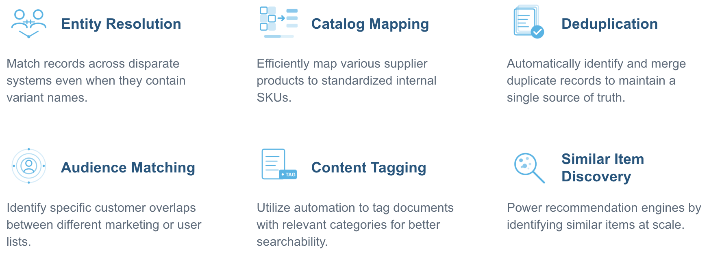
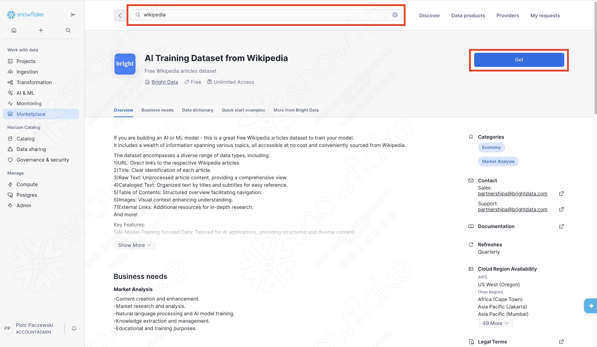
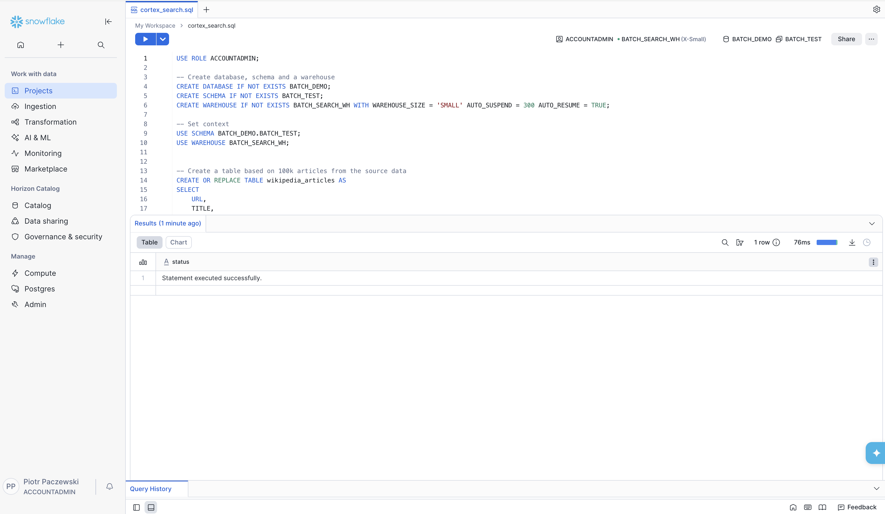
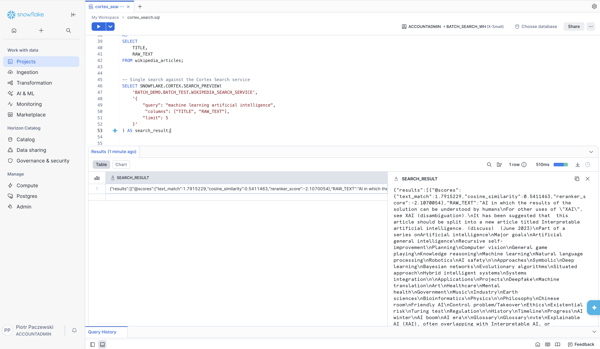
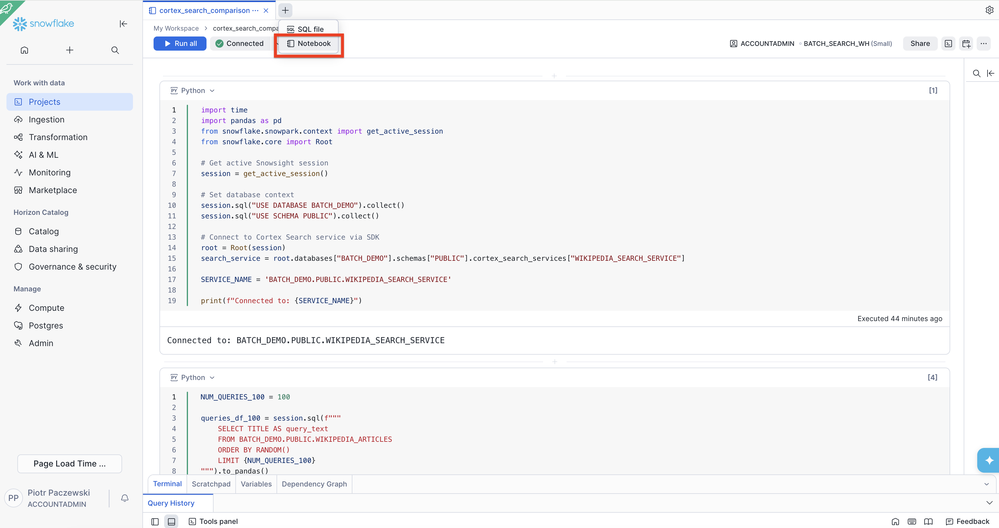
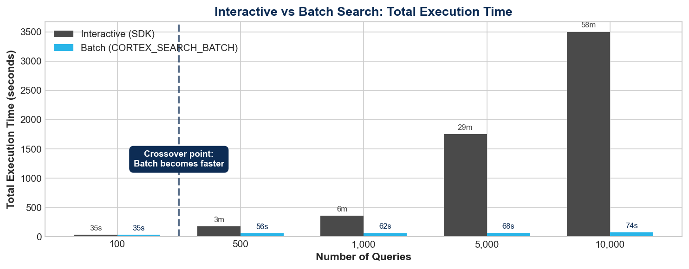
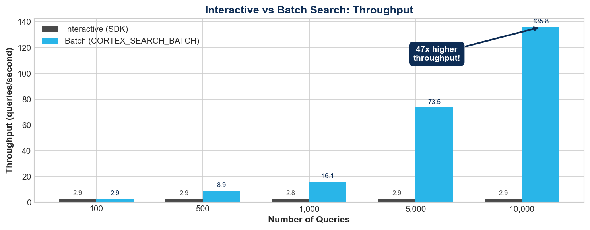
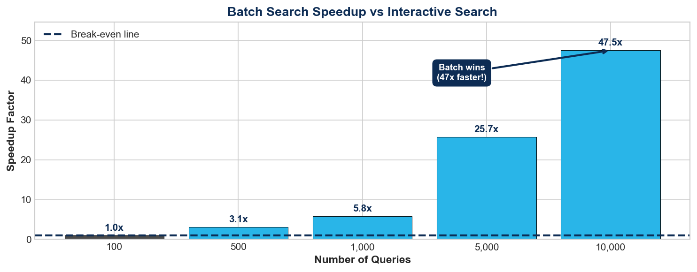

author: Lucas Galan, Piotr Paczewski
id: getting-started-with-batch-cortex-search
language: en
summary: Learn to use Batch Cortex Search over a Cortex Search Service for processing large batches of queries
categories: snowflake-site:taxonomy/solution-center/certification/quickstart, snowflake-site:taxonomy/product/ai, snowflake-site:taxonomy/snowflake-feature/unstructured-data-analysis , snowflake-site:taxonomy/snowflake-feature/cortex-search
environments: web
status: Published
feedback link: https://github.com/Snowflake-Labs/sfguides/issues

# Getting Started with Batch Cortex Search
<!-- ------------------------ -->
## Overview 

**Understand how and when to use Batch Cortex Search to tackle offline, high-throughput workloads over large sets of queries**

> **Download the code:**  
> - [SQL code](https://github.com/Snowflake-Labs/sfquickstarts/blob/master/site/sfguides/src/getting-started-with-batch-cortex-search/code/setup_wikipedia_search.sql)  
> - [Python Notebook](https://github.com/Snowflake-Labs/sfquickstarts/blob/master/site/sfguides/src/getting-started-with-batch-cortex-search/code/cortex_search_comparison.ipynb)

This guide walks you step-by-step through creating a **Cortex Search Service** and running queries against it. We show that for large numbers of queries, consecutive searches significantly increase the time taken. Finally, we use **Batch Cortex Search** to tackle the entire search in a matter of seconds. We also show how this solution can scale up to thousands of searches without significant impact on the time to process. 

At a high level:
-   Cortex Search is for interactive, low latency user-facing search (RAG chatbots, search bars)
-   Batch Cortex Search is for offline, high-throughput workloads over large sets of queries (entity resolution, catalog mapping)
-   Both use the same underlying Cortex Search service and index, no need to create separate objects to use batch.

### What You'll Need

-   A Snowflake account
-   An ACCOUNTADMIN role or a custom role with sufficient privileges
-   A dataset to search through (we provide a step-by-step guide to using a free dataset from Snowflake marketplace)

### What You'll Learn

-   How to set up a **Cortex Search Service** over a marketplace dataset
-   How to run linear queries using Cortex Search Service
-   The limitations of running multiple queries over a Cortex Search Service
-   How to use **Batch Cortex Search** to tackle queries at scale
-   How to use the **Python SDK** to compare interactive vs batch search performance

### What You'll Build

-   A marketplace integration to download Wikipedia entries
-   A **Cortex Search Service** over a table of 100K articles
-   Sample queries derived from existing data
-   A way to deploy **Batch Cortex Search** to quickly tackle large volumes of queries
-   A **Python notebook** benchmarking interactive vs batch performance at 100, 1,000, and 10,000 queries

<!-- ------------------------ -->
## What is Batch Cortex Search?

The Batch Cortex Search function is a table function that allows you to submit a batch of queries to a Cortex Search Service. It is intended for offline use cases with high throughput requirements, such as entity resolution, deduplication, or clustering tasks.

Jobs submitted to a Cortex Search Service with the CORTEX_SEARCH_BATCH function leverage additional compute resources to provide a significantly higher level of throughput (queries per second) than the interactive (Python, REST, SEARCH_PREVIEW) API search query surfaces.

> **_NOTE:_** The throughput of the batch search function may vary depending on the amount of data indexed in the queried Cortex Search Service and the complexity of the search queries. 

> The throughput of the batch search function (the number of search queries processed per second) is not influenced by the size of the warehouse used to query it and there is no limit to the number of concurrent batch queries that can be run at a given time on a given service.  

<!-- ------------------------ -->
## Use Cases

Batch Cortex Search excels at workloads where you need to match, resolve, or compare large sets of records against a searchable index. Here are the most common use cases:



### 1. Entity Resolution

**The Problem:**  
Your company has customer data spread across multiple systems — CRM, billing, support tickets, marketing automation. The same customer appears as "Acme Corporation", "Acme Corp", "ACME Inc.", and "Acme (US)". You need to link these records together, but fuzzy string matching alone isn't enough.

**How Batch Search Fixes It:**  
Load all your customer names into a query table. Batch search finds semantically similar matches across your master customer index — even when spellings differ. Process 50,000 records in minutes instead of hours, with relevance scores to set your match threshold.

---

### 2. Catalog Mapping

**The Problem:**  
Your suppliers send product feeds using their own naming conventions: "Samsung 65in QLED TV 4K" vs your internal "Samsung QN65Q80C 65-Inch Smart TV". Manual mapping is tedious and doesn't scale when you onboard new suppliers.

**How Batch Search Fixes It:**  
Index your internal product catalog, then batch search all supplier product descriptions against it. The semantic understanding matches products even when descriptions vary wildly. Map thousands of SKUs in a single query.

---

### 3. Deduplication

**The Problem:**  
Your CRM has grown organically and now contains duplicate leads and contacts. "John Smith at Snowflake" exists as three separate records with slight variations. Sales reps waste time on duplicates, and reporting is unreliable.

**How Batch Search Fixes It:**  
Search each record against your entire database to find potential duplicates. Batch search returns similarity scores so you can set thresholds — high confidence matches get auto-merged, medium confidence gets flagged for review.

---

### 4. Audience Matching

**The Problem:**  
You're partnering with another company and need to find customer overlap without sharing raw PII. Or you have two customer lists and need to identify which customers appear in both for a targeted campaign.

**How Batch Search Fixes It:**  
Use hashed or tokenized identifiers and search one list against the other. Batch search processes the entire comparison in one operation, returning match scores that indicate overlap confidence.

---

### 5. Content Tagging & Classification

**The Problem:**  
You have thousands of support tickets, documents, or articles that need categorization. Manual tagging is slow and inconsistent. Keyword rules miss context and create false matches.

**How Batch Search Fixes It:**  
Build a search index over your taxonomy or knowledge base articles. Batch search each piece of content against it to find the most relevant categories. Auto-assign tags based on the top matches.

---

### 6. Similar Item Discovery

**The Problem:**  
Users want "more like this" recommendations — similar products, related articles, comparable listings. Building a recommendation engine from scratch requires ML expertise and infrastructure.

**How Batch Search Fixes It:**  
Index your item descriptions and batch search each item against the index (excluding itself). The top results become your "similar items" list. Refresh recommendations by re-running the batch query whenever your catalog updates.

---

<!-- ------------------------ -->
## Getting Data
> **_NOTE:_** Skip this if you have your own data and prefer to use it for this demo instead of the marketplace data.  

For this tutorial, we will use a free dataset available on the **Snowflake Marketplace**. 

In your Snowsight account, navigate to the Marketplace and search for Wikipedia data. Click 'Get'.


You can also import the dataset programmatically. Please note the Wikipedia global listing name (GZT0Z4C8RF3FT) might be subject to change in the future.

```sql
USE ROLE ACCOUNTADMIN;

CALL SYSTEM$ACCEPT_LEGAL_TERMS('DATA_EXCHANGE_LISTING', 'GZT0Z4C8RF3FT');
CREATE DATABASE IF NOT EXISTS AI_TRAINING_DATASET_FROM_WIKIPEDIA
FROM LISTING 'GZT0Z4C8RF3FT';
```

Let's begin by opening a SQL file in Snowflake Workspace. Before we do anything else, let's set up our environment.


```sql
-- Set up environment
USE ROLE ACCOUNTADMIN;

-- Create database and warehouse
CREATE DATABASE IF NOT EXISTS BATCH_DEMO;
CREATE WAREHOUSE IF NOT EXISTS BATCH_SEARCH_WH WITH WAREHOUSE_SIZE = 'SMALL' AUTO_SUSPEND = 300 AUTO_RESUME = TRUE;

-- Set context
USE DATABASE BATCH_DEMO;
CREATE SCHEMA IF NOT EXISTS PUBLIC;
USE SCHEMA PUBLIC;
USE WAREHOUSE BATCH_SEARCH_WH;
```

Then, from the data we've downloaded, we want to build a smaller dataset, let's say 100K articles, to test the Batch Cortex Search against.

```sql
-- Create a table based on 100k articles from the source data
CREATE OR REPLACE TABLE wikipedia_articles AS
SELECT 
    URL,
    TITLE,
    RAW_TEXT,
    TABLE_OF_CONTENTS,
    SEE_ALSO
FROM AI_TRAINING_DATASET_FROM_WIKIPEDIA.PUBLIC.WIKIPEDIA
LIMIT 100000;
```
Feel free to take a look at the structure. You will see that there is a main column called RAW_TEXT which has the entire article in it.

```sql
-- Verify row count
SELECT COUNT(*) AS row_count FROM wikipedia_articles;

-- Preview sample data
SELECT TITLE, LEFT(RAW_TEXT, 200) AS text_preview 
FROM wikipedia_articles 
LIMIT 5;
```

<!-- ------------------------ -->
## Setting Up a Cortex Search Service
Now that we have data, we can set up a Cortex Search Service over the RAW_TEXT column. This will create a vector index over the column and allow for extremely fast retrieval over the unstructured text. The service takes a while to create the first time, but once it's been created, it is very fast to query.
> **_NOTE:_** This will take around 8 minutes. If you want something faster, simply reduce the table wikipedia_articles to a smaller amount of data, such as 50k. 

```sql
-- Create a Cortex Search Service
CREATE OR REPLACE CORTEX SEARCH SERVICE wikipedia_search_service
ON RAW_TEXT
ATTRIBUTES TITLE
WAREHOUSE = BATCH_SEARCH_WH
TARGET_LAG = '1 hour'
AS
SELECT 
    TITLE,
    RAW_TEXT
FROM wikipedia_articles;

-- Verify service creation
SHOW CORTEX SEARCH SERVICES;
```

Once the service has been created, we can test it. Run a quick search to verify it's working. We can now search for anything we'd like and return the pages (within our subset) that most closely match the results.


```sql
-- Single search against the Cortex Search service
SELECT SNOWFLAKE.CORTEX.SEARCH_PREVIEW(
    'BATCH_DEMO.PUBLIC.WIKIPEDIA_SEARCH_SERVICE',
    '{
        "query": "machine learning artificial intelligence",
        "columns": ["TITLE", "RAW_TEXT"],
        "limit": 3
    }'
) AS test_result;

-- A single result is a little hard to parse as JSON. We can wrap SEARCH_PREVIEW result into a table.
SELECT 
    r.value:TITLE::VARCHAR AS title,
    LEFT(r.value:RAW_TEXT::VARCHAR, 200) AS raw_text_preview
FROM TABLE(FLATTEN(
    input => PARSE_JSON(
        SNOWFLAKE.CORTEX.SEARCH_PREVIEW(
            'BATCH_DEMO.PUBLIC.WIKIPEDIA_SEARCH_SERVICE',
            '{
                "query": "machine learning artificial intelligence",
                "columns": ["TITLE", "RAW_TEXT"],
                "limit": 5
            }'
        )
    ):results
)) AS r;
```

This type of search is extremely efficient, and Cortex Search can quickly return results even for extremely large datasets. It is even faster when used directly via Snowflake Python API or REST API, but for now, let's look at the SQL for demonstration purposes. 

### The Problem: No Elegant Way to Do Multiple Searches

Function SEARCH_PREVIEW requires constant strings. To search 10 terms using SQL, you must either:
1. Write 10 separate SELECT statements
2. Use verbose UNION ALL with hardcoded queries  
3. Build a stored procedure with a loop

None of these scale to 100, 1000, or 10000 searches.

The following example demonstrates just how cumbersome this approach becomes — and this is only 10 searches. Imagine writing this for hundreds or thousands of queries:

```sql
-- Example: 10 searches using UNION ALL (verbose and doesn't scale)
SELECT 'quantum physics' AS query, PARSE_JSON(SNOWFLAKE.CORTEX.SEARCH_PREVIEW(
    'BATCH_DEMO.PUBLIC.WIKIPEDIA_SEARCH_SERVICE',
    '{"query": "quantum physics", "columns": ["TITLE"], "limit": 1}'
)):results[0]:TITLE::VARCHAR AS top_result
UNION ALL
SELECT 'world war history', PARSE_JSON(SNOWFLAKE.CORTEX.SEARCH_PREVIEW(
    'BATCH_DEMO.PUBLIC.WIKIPEDIA_SEARCH_SERVICE',
    '{"query": "world war history", "columns": ["TITLE"], "limit": 1}'
)):results[0]:TITLE::VARCHAR
UNION ALL
SELECT 'climate change', PARSE_JSON(SNOWFLAKE.CORTEX.SEARCH_PREVIEW(
    'BATCH_DEMO.PUBLIC.WIKIPEDIA_SEARCH_SERVICE',
    '{"query": "climate change", "columns": ["TITLE"], "limit": 1}'
)):results[0]:TITLE::VARCHAR
UNION ALL
SELECT 'solar system', PARSE_JSON(SNOWFLAKE.CORTEX.SEARCH_PREVIEW(
    'BATCH_DEMO.PUBLIC.WIKIPEDIA_SEARCH_SERVICE',
    '{"query": "solar system", "columns": ["TITLE"], "limit": 1}'
)):results[0]:TITLE::VARCHAR
UNION ALL
SELECT 'ancient rome', PARSE_JSON(SNOWFLAKE.CORTEX.SEARCH_PREVIEW(
    'BATCH_DEMO.PUBLIC.WIKIPEDIA_SEARCH_SERVICE',
    '{"query": "ancient rome", "columns": ["TITLE"], "limit": 1}'
)):results[0]:TITLE::VARCHAR
UNION ALL
SELECT 'machine learning', PARSE_JSON(SNOWFLAKE.CORTEX.SEARCH_PREVIEW(
    'BATCH_DEMO.PUBLIC.WIKIPEDIA_SEARCH_SERVICE',
    '{"query": "machine learning", "columns": ["TITLE"], "limit": 1}'
)):results[0]:TITLE::VARCHAR
UNION ALL
SELECT 'french revolution', PARSE_JSON(SNOWFLAKE.CORTEX.SEARCH_PREVIEW(
    'BATCH_DEMO.PUBLIC.WIKIPEDIA_SEARCH_SERVICE',
    '{"query": "french revolution", "columns": ["TITLE"], "limit": 1}'
)):results[0]:TITLE::VARCHAR
UNION ALL
SELECT 'deep ocean', PARSE_JSON(SNOWFLAKE.CORTEX.SEARCH_PREVIEW(
    'BATCH_DEMO.PUBLIC.WIKIPEDIA_SEARCH_SERVICE',
    '{"query": "deep ocean", "columns": ["TITLE"], "limit": 1}'
)):results[0]:TITLE::VARCHAR
UNION ALL
SELECT 'renewable energy', PARSE_JSON(SNOWFLAKE.CORTEX.SEARCH_PREVIEW(
    'BATCH_DEMO.PUBLIC.WIKIPEDIA_SEARCH_SERVICE',
    '{"query": "renewable energy", "columns": ["TITLE"], "limit": 1}'
)):results[0]:TITLE::VARCHAR
UNION ALL
SELECT 'human brain', PARSE_JSON(SNOWFLAKE.CORTEX.SEARCH_PREVIEW(
    'BATCH_DEMO.PUBLIC.WIKIPEDIA_SEARCH_SERVICE',
    '{"query": "human brain", "columns": ["TITLE"], "limit": 1}'
)):results[0]:TITLE::VARCHAR;
```

The query starts to take longer and longer. So how can we leverage the power of the Cortex Search Service over multiple search queries?

<!-- ------------------------ -->
## Batch Cortex Search to the Rescue
Batch Cortex Search allows us to do just this, it's clean, elegant and easy to deploy. It allows us to submit a larger number of searches and execute them as a batch. 

### Batch the Same 10 Searches

First, let's create a table with the previous searches in it and run Batch Cortex Search over it. You can see this is significantly simpler to execute — clean, elegant, reads from a table with no hardcoding!

> **_NOTE:_** Run all three statements together as one block.

```sql
CREATE OR REPLACE TEMPORARY TABLE ten_searches (query_text VARCHAR);

INSERT INTO ten_searches VALUES 
    ('quantum physics'),
    ('world war history'),
    ('climate change'),
    ('solar system'),
    ('ancient rome'),
    ('machine learning'),
    ('french revolution'),
    ('deep ocean'),
    ('renewable energy'),
    ('human brain');

SELECT 
    q.query_text, 
    s.* 
FROM ten_searches AS q,
LATERAL CORTEX_SEARCH_BATCH(
    service_name => 'BATCH_DEMO.PUBLIC.WIKIPEDIA_SEARCH_SERVICE', 
    query => q.query_text, 
    limit => 1
) AS s;
```

> **_TIP:_** The throughput of `CORTEX_SEARCH_BATCH` is not influenced by the size of the warehouse used to query it. A small warehouse works just as well as a large one for batch search operations.

### Scale to 1000 Searches

That's it! And this is just the tip of the iceberg — we can run 1000 searches with virtually no impact on the query execution time!
However, the real use case for Cortex Batch Search is when we increase the number of searches. Because of the *startup overhead*, Batch Cortex Search is actually SLOWER when processing a small number of queries. As soon as we need to process a lot of searches, that's when Batch Cortex Search really shines.  

> **_NOTE:_** Run these statements together as one block.

```sql
-- Create a table of 1000 diverse search queries from Wikipedia titles
CREATE OR REPLACE TABLE thousand_searches AS 
SELECT DISTINCT TITLE AS query_text 
FROM wikipedia_articles 
ORDER BY RANDOM() 
LIMIT 1000;

-- Verify
SELECT COUNT(*) AS total_queries FROM thousand_searches;

-- Run batch search on all 1000 queries (returns up to 5000 results: 1000 queries x 5 results each)
SELECT 
    q.query_text, 
    s.* 
FROM thousand_searches AS q,
LATERAL CORTEX_SEARCH_BATCH(
    service_name => 'BATCH_DEMO.PUBLIC.WIKIPEDIA_SEARCH_SERVICE', 
    query => q.query_text, 
    limit => 5
) AS s;
```

Batch Cortex Search is easy to implement, but extremely powerful. Running 1000 searches completes in just a few seconds — a fraction of the time it would take using sequential SEARCH_PREVIEW calls. 

> **_TIP:_** You can run interactive and batch queries concurrently on the same Cortex Search Service without any degradation to interactive query performance. Separate compute resources are used to serve each type.

<!-- ------------------------ -->
## Bonus: Python SDK Comparison

So far, this guide has focused on using SQL. You can also use the **Snowflake Python SDK** to compare Cortex Search (interactive) vs Batch Cortex Search performance. This section uses Python in a Snowflake Notebook within Workspaces to benchmark both approaches.



> **_NOTE:_** This section requires running in a Snowflake Notebook environment. Create a new notebook in Workspaces and copy cells below.

### Setup

First, set up the connection and imports:

```python
import time
import pandas as pd
from snowflake.snowpark.context import get_active_session
from snowflake.core import Root

# Get active Snowsight session
session = get_active_session()

# Set database context
session.sql("USE DATABASE BATCH_DEMO").collect()
session.sql("USE SCHEMA PUBLIC").collect()

# Connect to Cortex Search service via SDK
root = Root(session)
search_service = root.databases["BATCH_DEMO"].schemas["PUBLIC"].cortex_search_services["WIKIPEDIA_SEARCH_SERVICE"]

SERVICE_NAME = 'BATCH_DEMO.PUBLIC.WIKIPEDIA_SEARCH_SERVICE'

print(f"Connected to: {SERVICE_NAME}")
```

### Test 1: 100 Queries

Generate 100 random search queries from Wikipedia titles:

```python
NUM_QUERIES_100 = 100

queries_df_100 = session.sql(f"""
    SELECT TITLE AS query_text 
    FROM BATCH_DEMO.PUBLIC.WIKIPEDIA_ARTICLES 
    ORDER BY RANDOM() 
    LIMIT {NUM_QUERIES_100}
""").to_pandas()

search_queries_100 = queries_df_100['QUERY_TEXT'].tolist()
print(f"Generated {len(search_queries_100)} search queries")
print(f"Sample: {search_queries_100[:3]}")
```

**Interactive Search** — 100 individual SDK calls:

```python
print("Running 100 interactive searches...")

interactive_results_100 = []
test_start = time.time()

for i, query in enumerate(search_queries_100):
    try:
        user_start = time.time()
        resp = search_service.search(query=query, columns=["RAW_TEXT"], limit=5)
        _ = resp.to_json()
        user_latency = (time.time() - user_start) * 1000
        interactive_results_100.append({'query_num': i + 1, 'latency_ms': user_latency})
        if (i + 1) % 20 == 0:
            print(f"  Completed {i + 1}/100 queries...")
    except Exception as e:
        print(f"  Error on query {i + 1}: {str(e)[:50]}")

interactive_total_100 = time.time() - test_start
df_interactive_100 = pd.DataFrame(interactive_results_100)

print(f"\nINTERACTIVE (100 queries):")
print(f"  Total time: {interactive_total_100:.1f}s")
print(f"  Avg latency: {df_interactive_100['latency_ms'].mean():.0f}ms")
print(f"  Throughput: {NUM_QUERIES_100 / interactive_total_100:.1f} queries/sec")
```

**Batch Search** — 100 queries in ONE call:

```python
print("Running 100 batch searches in ONE call...")

session.sql("CREATE OR REPLACE TEMPORARY TABLE temp_100_queries (query_text VARCHAR)").collect()
values = ",".join([f"('{q.replace(chr(39), chr(39)+chr(39))}')" for q in search_queries_100])
session.sql(f"INSERT INTO temp_100_queries VALUES {values}").collect()

batch_start = time.time()
batch_sql = f"""
    SELECT q.query_text, s.* 
    FROM temp_100_queries AS q, 
    LATERAL CORTEX_SEARCH_BATCH(
        service_name => '{SERVICE_NAME}', 
        query => q.query_text, 
        limit => 5
    ) AS s
"""
batch_results_100 = session.sql(batch_sql).collect()
batch_total_100 = time.time() - batch_start

print(f"\nBATCH (100 queries):")
print(f"  Total time: {batch_total_100:.1f}s")
print(f"  Results returned: {len(batch_results_100)} rows")
print(f"  Throughput: {NUM_QUERIES_100 / batch_total_100:.1f} queries/sec")
```

### Test 2: 1,000 Queries

Generate 1,000 random search queries:

```python
NUM_QUERIES_1000 = 1000

queries_df_1000 = session.sql(f"""
    SELECT TITLE AS query_text 
    FROM BATCH_DEMO.PUBLIC.WIKIPEDIA_ARTICLES 
    ORDER BY RANDOM() 
    LIMIT {NUM_QUERIES_1000}
""").to_pandas()

search_queries_1000 = queries_df_1000['QUERY_TEXT'].tolist()
print(f"Generated {len(search_queries_1000)} search queries")
```

**Interactive Search** — 1,000 individual SDK calls:

```python
print("Running 1000 interactive searches...")

interactive_results_1000 = []
test_start = time.time()

for i, query in enumerate(search_queries_1000):
    try:
        user_start = time.time()
        resp = search_service.search(query=query, columns=["RAW_TEXT"], limit=5)
        _ = resp.to_json()
        user_latency = (time.time() - user_start) * 1000
        interactive_results_1000.append({'query_num': i + 1, 'latency_ms': user_latency})
        if (i + 1) % 200 == 0:
            print(f"  Completed {i + 1}/1000 queries...")
    except Exception as e:
        print(f"  Error on query {i + 1}: {str(e)[:50]}")

interactive_total_1000 = time.time() - test_start
df_interactive_1000 = pd.DataFrame(interactive_results_1000)

print(f"\nINTERACTIVE (1000 queries):")
print(f"  Total time: {interactive_total_1000:.1f}s")
print(f"  Avg latency: {df_interactive_1000['latency_ms'].mean():.0f}ms")
print(f"  Throughput: {NUM_QUERIES_1000 / interactive_total_1000:.1f} queries/sec")
```

**Batch Search** — 1,000 queries in ONE call:

```python
print("Running 1000 batch searches in ONE call...")

session.sql("CREATE OR REPLACE TEMPORARY TABLE temp_1000_queries (query_text VARCHAR)").collect()

# Insert in chunks to avoid SQL size limits
chunk_size = 500
for i in range(0, len(search_queries_1000), chunk_size):
    chunk = search_queries_1000[i:i+chunk_size]
    values = ",".join([f"('{q.replace(chr(39), chr(39)+chr(39))}')" for q in chunk])
    session.sql(f"INSERT INTO temp_1000_queries VALUES {values}").collect()

batch_start = time.time()
batch_sql = f"""
    SELECT q.query_text, s.* 
    FROM temp_1000_queries AS q, 
    LATERAL CORTEX_SEARCH_BATCH(
        service_name => '{SERVICE_NAME}', 
        query => q.query_text, 
        limit => 5
    ) AS s
"""
batch_results_1000 = session.sql(batch_sql).collect()
batch_total_1000 = time.time() - batch_start

print(f"\nBATCH (1000 queries):")
print(f"  Total time: {batch_total_1000:.1f}s")
print(f"  Results returned: {len(batch_results_1000)} rows")
print(f"  Throughput: {NUM_QUERIES_1000 / batch_total_1000:.1f} queries/sec")
```

### Test 3: 10,000 Queries

> **_WARNING:_** We do not recommend running interactive search tests for 5,000+ queries. Based on our benchmarks, interactive search runs at ~350ms per query, meaning:
> - 5,000 queries → ~29 minutes  
> - 10,000 queries → ~58 minutes  
> 
> The batch search results below complete in under 2 minutes total. Trust the benchmark data in the next section!

This test truly demonstrates the power of batch search at scale. Running 10,000 interactive searches would take nearly an hour, so we only run the batch version:

```python
NUM_QUERIES_10000 = 10000

print("Generating 10,000 search queries...")
queries_df_10000 = session.sql(f"""
    SELECT TITLE AS query_text 
    FROM BATCH_DEMO.PUBLIC.WIKIPEDIA_ARTICLES 
    ORDER BY RANDOM() 
    LIMIT {NUM_QUERIES_10000}
""").to_pandas()

search_queries_10000 = queries_df_10000['QUERY_TEXT'].tolist()
print(f"Generated {len(search_queries_10000)} search queries")
```

**Batch Search** — 10,000 queries in ONE call:

```python
print("Running 10,000 batch searches in ONE call...")

session.sql("CREATE OR REPLACE TEMPORARY TABLE temp_10000_queries (query_text VARCHAR)").collect()

# Insert in chunks to avoid SQL size limits
chunk_size = 500
for i in range(0, len(search_queries_10000), chunk_size):
    chunk = search_queries_10000[i:i+chunk_size]
    values = ",".join([f"('{q.replace(chr(39), chr(39)+chr(39))}')" for q in chunk])
    session.sql(f"INSERT INTO temp_10000_queries VALUES {values}").collect()
    if (i + chunk_size) % 2000 == 0:
        print(f"  Inserted {min(i + chunk_size, len(search_queries_10000))}/{len(search_queries_10000)} queries...")

batch_start = time.time()
batch_sql = f"""
    SELECT q.query_text, s.* 
    FROM temp_10000_queries AS q, 
    LATERAL CORTEX_SEARCH_BATCH(
        service_name => '{SERVICE_NAME}', 
        query => q.query_text, 
        limit => 5
    ) AS s
"""
batch_results_10000 = session.sql(batch_sql).collect()
batch_total_10000 = time.time() - batch_start

print(f"\nBATCH (10,000 queries):")
print(f"  Total time: {batch_total_10000:.1f}s")
print(f"  Results returned: {len(batch_results_10000)} rows")
print(f"  Throughput: {NUM_QUERIES_10000 / batch_total_10000:.1f} queries/sec")

# Estimate how long interactive would take
estimated_interactive = NUM_QUERIES_10000 * (df_interactive_1000['latency_ms'].mean() / 1000)
print(f"\n  Estimated interactive time: {estimated_interactive:.0f}s ({estimated_interactive/60:.1f} minutes)")
print(f"  Batch speedup: ~{estimated_interactive / batch_total_10000:.0f}x faster!")
```

### Final Summary

Compare all results:

```python
print("="*70)
print("FINAL SUMMARY: Interactive vs Batch")
print("="*70)

speedup_100 = interactive_total_100 / batch_total_100 if batch_total_100 > 0 else 0
speedup_1000 = interactive_total_1000 / batch_total_1000 if batch_total_1000 > 0 else 0

summary = pd.DataFrame({
    'Queries': [100, 1000, 10000],
    'Interactive (s)': [
        f"{interactive_total_100:.1f}", 
        f"{interactive_total_1000:.1f}", 
        f"~{estimated_interactive:.0f} (est)"
    ],
    'Batch (s)': [
        f"{batch_total_100:.1f}", 
        f"{batch_total_1000:.1f}", 
        f"{batch_total_10000:.1f}"
    ],
    'Speedup': [f"{speedup_100:.1f}x", f"{speedup_1000:.1f}x", f"~{estimated_interactive/batch_total_10000:.0f}x"]
})

print(summary.to_string(index=False))

print("\n" + "="*70)
print("RECOMMENDATION:")
print("="*70)
print("  - For real-time, user-facing search: Use Interactive SDK")
print("  - For batch processing (100+ queries): Use CORTEX_SEARCH_BATCH")
print("  - Batch has a small bootstrap cost - amortize it with larger batches!")
```

<!-- ------------------------ -->
## Benchmark Results

We ran the Python SDK comparison from the previous section to measure the real-world performance difference between Interactive and Batch Cortex Search. Here are the results:

| Queries | Interactive Time | Batch Time | Winner | Speedup |
|---------|-----------------|------------|--------|---------|
| 100 | 34.9s | 35.1s | Interactive | 1.0x |
| 500 | 2m 55s | 56.0s | **Batch** | 3.1x |
| 1,000 | 5m 59s | 62.0s | **Batch** | 5.8x |
| 5,000 | ~29 min | ~68s | **Batch** | 25.7x |
| 10,000 | ~58 min | 73.6s | **Batch** | 47.5x |

> **_NOTE:_** These results are provided for illustrative purposes only and should not be considered official performance figures.

The 5,000 and 10,000-queries interactive times are extrapolated based on Cortex Search performance for 100, 500 and 1,000 queries.

### The Crossover Point

At **100 queries**, both approaches perform similarly — batch has some startup overhead that makes it roughly equivalent to running individual searches.

But watch what happens as volume increases:



By **500 queries**, batch is already **3x faster**. By **10,000 queries**, batch completes in just over a minute while interactive would take nearly an hour.

### Throughput: The Real Story

The throughput comparison reveals why batch search scales so well:



- **Interactive search**: Stuck at ~2.9 queries/second (each query is an independent API call)
- **Batch search**: Scales from 2.9 qps at 100 queries to **136 qps at 10,000 queries**

That's a **47x improvement** in throughput for large batches!

### Speedup Factor

This chart shows the multiplicative speedup of batch over interactive:



The pattern is clear: **the more queries you have, the more batch search pays off**.

### When to Use Each Approach

| Use Case | Recommended Approach | Why |
|----------|---------------------|-----|
| Real-time search (chatbots, search bars) | Interactive SDK | Optimized for single-query latency |
| Small batch (<100 queries) | Either | Similar performance |
| Medium batch (100-1000 queries) | **Batch** | 3-10x faster |
| Large batch (1000+ queries) | **Always Batch** | 10-100x faster |

Interactive search has consistent per-query latency (~350ms), making it ideal for user-facing applications. Batch search has a small startup cost but achieves dramatically higher throughput by processing queries in parallel. For any workload over 100 queries, batch is the clear winner — and at 10,000+ queries for the tested dataset, it is **47x faster**.

> **_NOTE:_** You can run multiple batch queries on a given service in parallel, achieving higher throughput than with a single Batch Cortex Search call.

<!-- ------------------------ -->
## Cleanup
Now that you know how to use Batch Cortex Search, let's clean up the environment.

```sql
-- Set context
USE ROLE ACCOUNTADMIN;
USE DATABASE BATCH_DEMO;
USE SCHEMA PUBLIC;

-- Step 1: Drop the Cortex Search service
DROP CORTEX SEARCH SERVICE IF EXISTS WIKIPEDIA_SEARCH_SERVICE;

-- Step 2: Drop tables
DROP TABLE IF EXISTS wikipedia_articles;
DROP TABLE IF EXISTS thousand_searches;
DROP TABLE IF EXISTS ten_searches;

-- Step 3: Drop database (optional - only if you created it for this demo)
-- DROP DATABASE IF EXISTS BATCH_DEMO;

-- Step 4: Drop warehouse (optional - only if you created it for this demo)
-- DROP WAREHOUSE IF EXISTS BATCH_SEARCH_WH;

-- Step 5: Unsubscribe from the Wikipedia Marketplace listing
DROP DATABASE IF EXISTS AI_TRAINING_DATASET_FROM_WIKIPEDIA;
```

<!-- ------------------------ -->
## Conclusion And Resources

### What You Learned

- How to create a **Cortex Search Service** over a Snowflake Marketplace dataset
- How to use **Batch Cortex Search** (`CORTEX_SEARCH_BATCH`) to process large volumes of queries efficiently
- That batch search scales to thousands of queries with minimal impact on processing time

### Related Resources

- [Cortex Search Reference](https://docs.snowflake.com/en/user-guide/snowflake-cortex/cortex-search/cortex-search-overview)
- [Batch Cortex Search Reference](https://docs.snowflake.com/en/LIMITEDACCESS/cortex-search/batch-cortex-search)
- [Blog Post: Introducing Batch Cortex Search: Hybrid Search Engine for High-Throughput Workloads][https://medium.com/@piotrpaczewski/8ef961d64f5c]