author: marzillo-snow, quilpie
id: getting-started-with-bedrock-agentcore-gateways-and-cortex-agents
categories: snowflake-site:taxonomy/solution-center/certification/quickstart, snowflake-site:taxonomy/product/ai
language: en
summary: Build multi-cloud AI agents with Amazon Q and Snowflake Cortex for cross-platform access.
environments: web
status: Published
feedback link: https://github.com/Snowflake-Labs/sfguides/issues
fork repo link: https://github.com/Snowflake-Labs/sfguide-getting-started-with-bedrock-agentcore-gateways-and-cortex-agents


# Getting Started with Amazon Bedrock AgentCore Gateways and Cortex Agents
<!-- ------------------------ -->
## Overview


[Cortex Agents](https://docs.snowflake.com/en/user-guide/snowflake-cortex/cortex-agents) orchestrate across both structured and unstructured data sources to deliver insights. They plan tasks, use tools to execute these tasks, and generate responses. Agents use Cortex Analyst (structured) and Cortex Search (unstructured) as tools, along with LLMs, to analyze data. Cortex Search extracts insights from unstructured sources, while Cortex Analyst generates SQL to process structured data. A comprehensive support for tool identification and tool execution enables delivery of sophisticated applications grounded in enterprise data.


[Amazon Bedrock AgentCore Gateways](https://docs.aws.amazon.com/bedrock-agentcore/latest/devguide/gateway.html) provides a way to turn existing APIs into fully-managed MCP servers without needing to manage infrastructure or hosting. By bringing your OpenAPI specifications, Gateway converts your APIs into tools accessible through the standardized **Model Context Protocol (MCP)** interface.


### Use Case


Users will create an intelligent search system on structured and unstructured movie data using Snowflake Cortex AI and via an AgentCore Gateway. Snowflake Cortex AI will process and index the unstructured movie reviews and structured movie ratings, making them searchable through advanced text analysis. We will then include the Cortex Agent as a target from a Amazon Bedrock AgentCore Gateway that can be used alongside other targets as part of a broader Amazon Bedrock AgentCore Agent.

The end-to-end workflow will look like this:
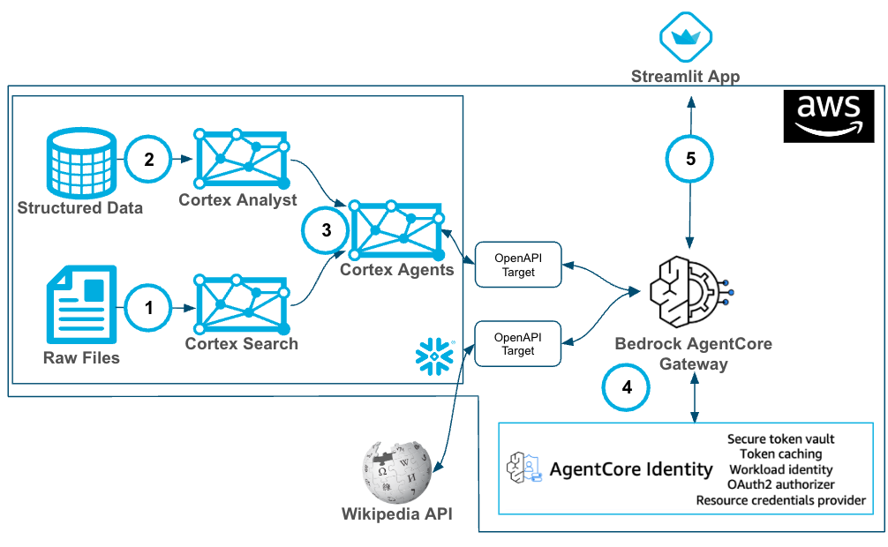

Ingest data into structured and unstructured data stores then:
1. Create a Cortex Analyst service with structured data with a Semantic View.
2. Using Snowflake functions prepare the data and create a Cortex Search service with unstructured data.
3. Create a Cortex Agent that brokers the decision on when to use each service (as well as other GenAI functions)
4. An Amazon Bedrock AgentCore Gateway Target is created using Secretes Manager to store the Snowflake PAT and connect to the Cortex Agent via OpenAPI.
5. Build a Streamlit App to pass request to Cortex via AgentCore Gateway


### Prerequisites
- Familiarity with [Snowflake](/en/developers/guides/getting-started-with-snowflake/) and a Snowflake account with Cortex Search.
- Familiarity with [AWS](https://aws.amazon.com/free) and an AWS account.


### What You'll Learn
- Using Cortex Search along with complimentary functions in Snowflake.
- Using Cortex Analyst and semantic models in Snowflake.
- Using Cortex Agents.
- Using Amazon Bedrock AgentCore Gateways with OpenAPI Targets.
- Using Streamlit to build a simple app to serve results of your AgentCore Gateway


### What You’ll Need
- A free [Snowflake Account](https://signup.snowflake.com/?utm_source=snowflake-devrel&utm_medium=developer-guides&utm_cta=developer-guides)
- [AWS Account](https://aws.amazon.com/free) with access to Amazon Bedrock AgentCore
- For the sake of the lab it is best if both platforms have access to the public internet and are not in a virtual network
- AWS CLI - [Install AWS CLI](https://docs.aws.amazon.com/cli/latest/userguide/getting-started-install.html)
- Python 3.11+ - [Download Python](https://www.python.org/downloads/)
- Streamlit (local) - [Download Stremlit](https://docs.streamlit.io/get-started/installation)


### What You’ll Build
You will build an end-to-end copilot workflow on unstructured data in Snowflake
- to load data to Snowflake via Snowsight
- to extract unstructured data and create chunks in Snowflake
- to create a Snowflake Cortex Search Service on unstructured data
- to create a semantic view with Cortex Analyst on structured data
- to create a Cortex Agent using the Search and Analyst services
- to create an Amazon Bedrock AgentCore Gateway with a Snowflake Cortex Target leveraging AgentCore Identity along with a second target to the Wikipedia API


<!-- ------------------------ -->
## Snowflake Environment


In this section, you will load 2 data sets, unstructured and structured, then create a Cortex Search service and a Cortex Analyst service. 

Replace the 3 areas below where YOUR_USERNAME is indicated and run the code, this will load the data, create the Cortex Search service and generate a PAT token that you will use to authenticate from AgentCore Gateway to Snowflake.

```sql
-- =============================================
-- Snowflake Setup for Cortex Agents
-- =============================================


USE ROLE ACCOUNTADMIN;

-- Create role for Cortex Agents
CREATE ROLE IF NOT EXISTS cortex_agent_role 
   COMMENT = 'Role for Cortex Agents demo';

--Grant role to your user (replace YOUR_USERNAME)
GRANT ROLE cortex_agent_role TO USER YOUR_USERNAME;

-- create database, schema and warehouse
CREATE WAREHOUSE IF NOT EXISTS WORKSHOPWH WITH
   WAREHOUSE_SIZE = 'XSMALL'
   AUTO_SUSPEND = 60
   AUTO_RESUME = TRUE
   COMMENT = 'Warehouse for Cortex demo';
   
CREATE DATABASE IF NOT EXISTS movies; 

GRANT OWNERSHIP ON DATABASE movies TO ROLE cortex_agent_role COPY CURRENT GRANTS;
GRANT OWNERSHIP ON SCHEMA movies.PUBLIC TO ROLE cortex_agent_role COPY CURRENT GRANTS;
GRANT OWNERSHIP ON WAREHOUSE workshopwh TO ROLE cortex_agent_role COPY CURRENT GRANTS;

-- ==============================================
-- PART 2: DATA SETUP (as cortex_agent_role)
-- ==============================================
USE ROLE cortex_agent_role;
USE DATABASE movies;

-- create demo table for our movie data, we will surface this in dashboard
CREATE TABLE movies_dashboard (
movie_id NUMBER,
    	movie_title VARCHAR,
   	movie_release_year INTEGER,
    	genre VARCHAR,
   	user_rating FLOAT,
   	rating_timestamp TIMESTAMP_NTZ,
    	user_id NUMBER,
    	user_firstname VARCHAR,
   	user_lastname VARCHAR,
    	user_city VARCHAR,
    	user_state VARCHAR,
    	user_country VARCHAR,
    	user_email VARCHAR,
    	user_phonenumber VARCHAR,
    	interaction_timestamp NUMBER ,
    	interaction_type VARCHAR
);

CREATE OR REPLACE STAGE MOVIEDASHBOARD
URL='s3://hol-qs-bucket/'
FILE_FORMAT = (TYPE = 'csv');

COPY INTO movies_dashboard FROM @MOVIEDASHBOARD/movies_dashboard.csv
  FILE_FORMAT=(TYPE = 'csv' FIELD_DELIMITER = ',' SKIP_HEADER = 1);

-- Create stage for docs 
CREATE STAGE DOCS
DIRECTORY = ( ENABLE = true )
ENCRYPTION = ( TYPE = 'SNOWFLAKE_SSE' );

-- Create stage for semantic models
CREATE STAGE IF NOT EXISTS MODELS
  DIRECTORY = (ENABLE = TRUE)
  COMMENT = 'Stage for semantic model files';


select distinct movie_title from movies_dashboard;

-- create demo table for our movie reviews
CREATE OR REPLACE TABLE movie_review_unstructured (
    review_user_id NUMBER NOT NULL,
    document_id STRING NOT NULL,
    review_type STRING DEFAULT 'web survey',
    document_content VARIANT,
    searchable_text TEXT,
    review_date TIMESTAMP DEFAULT CURRENT_TIMESTAMP()
);

/* insert Unstructured Reviews (30 reviews)
Toy Story (5 reviews) - Animation classic
Tom and Huck (5 reviews) - Family adventure
Jumanji (5 reviews) - Fantasy adventure
Money Train (5 reviews) - Action thriller
Heat(5 reviews) - Crime drama
Sudden Death (5 reviews) - Action film
Sabrina (5 reviews) - Romantic comedy */

INSERT INTO movie_review_unstructured (review_user_id, document_id, searchable_text, review_date) VALUES
(1001, 'REV_TOY_001', 'Absolutely love this movie! The animation was groundbreaking for its time and the story is timeless. Woody and Buzz have such great chemistry. My kids watch it over and over and I never get tired of it. The humor works for both children and adults. A true classic that started the Pixar revolution.',
 TIMESTAMPADD(day, -15, CURRENT_TIMESTAMP())),

(1002, 'REV_TOY_002', 'Great family movie with heart. The characters are memorable and the story teaches valuable lessons about friendship and acceptance. The animation still holds up well even after all these years. Tom Hanks and Tim Allen are perfect voice actors.',
 TIMESTAMPADD(day, -12, CURRENT_TIMESTAMP())),

(1003, 'REV_TOY_003', 'This movie brings back so many childhood memories. The concept of toys coming to life when humans aren''t around is brilliant. The writing is sharp and the emotional moments really hit home. One of the best animated films ever made.',
 TIMESTAMPADD(day, -8, CURRENT_TIMESTAMP())),

(1004, 'REV_TOY_004', 'It''s a good movie but I think it''s a bit overrated. The animation is dated now and the story is simple. Still entertaining though, especially for younger kids. I can see why it was revolutionary at the time.',
 TIMESTAMPADD(day, -5, CURRENT_TIMESTAMP())),

(1005, 'REV_TOY_005', 'Perfect in every way. The character development, the humor, the heart, the innovation - everything about this movie is exceptional. It changed animation forever and remains one of the most rewatchable films ever made.',
 TIMESTAMPADD(day, -3, CURRENT_TIMESTAMP()));

-- Insert unstructured reviews for Tom and Huck
INSERT INTO movie_review_unstructured (review_user_id, document_id, searchable_text, review_date) VALUES
(2001, 'REV_TOMH_001', 'Decent adaptation of the classic story. The young actors do a good job and the adventure scenes are fun. However, it feels a bit dated and some of the humor doesn''t land well. Good for family viewing but not memorable.',
 TIMESTAMPADD(day, -20, CURRENT_TIMESTAMP())),

(2002, 'REV_TOMH_002', 'A solid family adventure film. The Mississippi River setting is beautiful and the friendship between Tom and Huck is well portrayed. The movie captures the spirit of Mark Twain''s work while being accessible to modern audiences.',
 TIMESTAMPADD(day, -18, CURRENT_TIMESTAMP())),

(2003, 'REV_TOMH_003', 'This movie is pretty forgettable. The acting is wooden and the story feels rushed. It doesn''t do justice to the source material. The special effects are also quite dated. Not worth rewatching.',
 TIMESTAMPADD(day, -14, CURRENT_TIMESTAMP())),

(2004, 'REV_TOMH_004', 'Average family movie. The kids will probably enjoy it but adults might find it boring. The adventure elements are tame and the dialogue is simplistic. It''s harmless entertainment but nothing special.',
 TIMESTAMPADD(day, -10, CURRENT_TIMESTAMP())),

(2005, 'REV_TOMH_005', 'Better than I expected. The young actors have good chemistry and the story moves along nicely. The river scenes are well shot and the friendship theme is heartwarming. A good introduction to classic literature for kids.',
 TIMESTAMPADD(day, -7, CURRENT_TIMESTAMP()));

-- Insert unstructured reviews for Jumanji
INSERT INTO movie_review_unstructured (review_user_id, document_id, searchable_text, review_date) VALUES
(3001, 'REV_JUM_001', 'Classic adventure movie that still holds up! Robin Williams is perfect in this role and the special effects were groundbreaking for the time. The board game concept is unique and the jungle scenes are exciting. Great family entertainment.',
 TIMESTAMPADD(day, -25, CURRENT_TIMESTAMP())),

(3002, 'REV_JUM_002', 'One of my favorite childhood movies. The mix of fantasy and adventure is perfect, and Robin Williams brings so much heart to the character. The practical effects still look good and the story is engaging from start to finish.',
 TIMESTAMPADD(day, -22, CURRENT_TIMESTAMP())),

(3003, 'REV_JUM_003', 'Solid family adventure film. The concept is creative and the execution is well done. Robin Williams'' performance is the highlight. Some of the effects are dated now but the story and characters make up for it.',
 TIMESTAMPADD(day, -19, CURRENT_TIMESTAMP())),

(3004, 'REV_JUM_004', 'Really fun movie with a great premise. The board game coming to life is such a cool idea. Robin Williams is hilarious and the adventure sequences are thrilling. The ending is satisfying and the whole family can enjoy it.',
 TIMESTAMPADD(day, -16, CURRENT_TIMESTAMP())),

(3005, 'REV_JUM_005', 'Good entertainment value. The adventure elements work well and the cast is solid. Robin Williams adds his usual charm. The effects are showing their age but the story is engaging enough to overlook that.',
 TIMESTAMPADD(day, -13, CURRENT_TIMESTAMP()));

-- Insert unstructured reviews for Money Train
INSERT INTO movie_review_unstructured (review_user_id, document_id, searchable_text, review_date) VALUES
(4001, 'REV_MON_001', 'Not a great movie. The plot is thin and the action scenes are mediocre. Wesley Snipes and Woody Harrelson have some chemistry but the script doesn''t give them much to work with. Pretty forgettable overall.',
 TIMESTAMPADD(day, -30, CURRENT_TIMESTAMP())),

(4002, 'REV_MON_002', 'This movie is pretty bad. The story makes no sense and the characters are unlikeable. The subway setting is interesting but that''s about the only positive thing I can say. Waste of time.',
 TIMESTAMPADD(day, -27, CURRENT_TIMESTAMP())),

(4003, 'REV_MON_003', 'Mediocre action movie. Some of the subway scenes are exciting but the plot is weak and the dialogue is cheesy. Wesley Snipes tries his best but the material isn''t there. Not terrible but not good either.',
 TIMESTAMPADD(day, -24, CURRENT_TIMESTAMP())),

(4004, 'REV_MON_004', 'Poor excuse for an action movie. The plot holes are huge and the acting is wooden. The subway setting could have been interesting but it''s wasted on this script. Skip this one.',
 TIMESTAMPADD(day, -21, CURRENT_TIMESTAMP())),

(4005, 'REV_MON_005', 'Below average action flick. The concept had potential but the execution is poor. The characters are one-dimensional and the story is predictable. Some decent action scenes but not enough to save it.',
 TIMESTAMPADD(day, -17, CURRENT_TIMESTAMP()));

-- Insert unstructured reviews for Heat
INSERT INTO movie_review_unstructured (review_user_id, document_id, searchable_text, review_date) VALUES
(5001, 'REV_HEAT_001', 'Masterpiece of the crime genre. Michael Mann''s direction is flawless and the performances from Pacino and De Niro are legendary. The bank robbery scene is one of the most intense sequences ever filmed. A true classic.',
 TIMESTAMPADD(day, -35, CURRENT_TIMESTAMP())),

(5002, 'REV_HEAT_002', 'One of the greatest crime films ever made. The cat-and-mouse game between Pacino and De Niro is electrifying. The action sequences are realistic and intense, and the character development is superb. Masterful filmmaking.',
 TIMESTAMPADD(day, -32, CURRENT_TIMESTAMP())),

(5003, 'REV_HEAT_003', 'Excellent crime thriller with incredible performances. The bank robbery scene is absolutely thrilling and the final confrontation is perfect. The movie balances action with character development beautifully.',
 TIMESTAMPADD(day, -29, CURRENT_TIMESTAMP())),

(5004, 'REV_HEAT_004', 'A masterpiece of tension and character. Michael Mann creates an atmosphere of constant danger and the performances are all top-notch. The action is realistic and the story is compelling. One of the best films of the 90s.',
 TIMESTAMPADD(day, -26, CURRENT_TIMESTAMP())),

(5005, 'REV_HEAT_005', 'Great crime film with outstanding performances. The bank robbery sequence is one of the most realistic and intense action scenes ever filmed. The movie is long but never boring, with great character development.',
 TIMESTAMPADD(day, -23, CURRENT_TIMESTAMP()));

-- Insert unstructured reviews for Sudden Death
INSERT INTO movie_review_unstructured (review_user_id, document_id, searchable_text, review_date) VALUES
(6001, 'REV_SUD_001', 'Pretty bad action movie. The plot is ridiculous and Van Damme''s acting is wooden. The hockey stadium setting is unique but that''s about it. The action scenes are poorly choreographed and the story is forgettable.',
 TIMESTAMPADD(day, -40, CURRENT_TIMESTAMP())),

(6002, 'REV_SUD_002', 'Terrible movie. The acting is awful, the plot is nonsensical, and the action is boring. Van Damme should stick to martial arts movies. The hockey angle is wasted on this poor script.',
 TIMESTAMPADD(day, -37, CURRENT_TIMESTAMP())),

(6003, 'REV_SUD_003', 'Low quality action flick. The premise had potential but the execution is poor. Van Damme is miscast and the supporting actors are terrible. The hockey stadium setting is the only interesting thing about it.',
 TIMESTAMPADD(day, -34, CURRENT_TIMESTAMP())),

(6004, 'REV_SUD_004', 'One of the worst action movies I''ve seen. The plot is laughable and the acting is atrocious. Van Damme looks lost in this role. The action sequences are poorly filmed and the dialogue is cringe-worthy.',
 TIMESTAMPADD(day, -31, CURRENT_TIMESTAMP())),

(6005, 'REV_SUD_005', 'Poor excuse for an action movie. The hockey stadium setting is wasted on this terrible script. Van Damme is completely miscast and the villain is laughably bad. Skip this one entirely.',
 TIMESTAMPADD(day, -28, CURRENT_TIMESTAMP()));

-- Insert unstructured reviews for Sabrina
INSERT INTO movie_review_unstructured (review_user_id, document_id, searchable_text, review_date) VALUES
(7001, 'REV_SAB_001', 'Charming romantic comedy with great performances. Julia Ormond is lovely as Sabrina and Harrison Ford brings his usual charisma. The story is sweet and the Paris scenes are beautiful. A nice feel-good movie.',
 TIMESTAMPADD(day, -45, CURRENT_TIMESTAMP())),

(7002, 'REV_SAB_002', 'Decent remake of the classic. The chemistry between the leads is good and the story is engaging. The Paris setting adds charm and the fashion elements are fun. Not as good as the original but still enjoyable.',
 TIMESTAMPADD(day, -42, CURRENT_TIMESTAMP())),

(7003, 'REV_SAB_003', 'Really enjoyed this romantic comedy. Julia Ormond is perfect as the transformed Sabrina and Harrison Ford is charming as always. The Paris scenes are gorgeous and the story has heart. A solid romantic film.',
 TIMESTAMPADD(day, -39, CURRENT_TIMESTAMP())),

(7004, 'REV_SAB_004', 'Pleasant enough romantic comedy. The leads have good chemistry and the Paris setting is lovely. The story is predictable but that''s not necessarily bad for this genre. Good for a lazy Sunday afternoon.',
 TIMESTAMPADD(day, -36, CURRENT_TIMESTAMP())),

(7005, 'REV_SAB_005', 'Sweet romantic comedy with beautiful locations and good performances. Julia Ormond is delightful and Harrison Ford is charming. The transformation story is well done and the ending is satisfying. A nice escape.',
 TIMESTAMPADD(day, -33, CURRENT_TIMESTAMP()));

-- Verify the data was inserted
SELECT COUNT(*) as total_unstructured_reviews FROM movie_review_unstructured;

SELECT document_id, searchable_text, review_date 
FROM movie_review_unstructured 
ORDER BY review_date DESC;


-- Create Cortex Search service
CREATE CORTEX SEARCH SERVICE IF NOT EXISTS MOVIE_SEARCH
ON searchable_text
ATTRIBUTES review_type, document_id
WAREHOUSE = WORKSHOPWH
TARGET_LAG = '1 hour'
AS (
    SELECT 
        searchable_text,
        review_type,
        document_id
    FROM movie_review_unstructured
);


SELECT 
    document_id,
    LEFT(searchable_text, 100) || '...' as review_preview,
    review_date
FROM movie_review_unstructured 
ORDER BY review_date DESC 
LIMIT 5;

-- ==============================================
-- PART 3: PAT Token Creation
-- ==============================================

-- Create PAT for the integration (replace <YOUR_USERNAME>) AND COPY THE PAT Token for future use!
ALTER USER YOUR_USERNAME ADD PROGRAMMATIC ACCESS TOKEN cortex_demo_token DAYS_TO_EXPIRY = 30 ROLE_RESTRICTION = 'CORTEX_AGENT_ROLE';
ALTER USER YOUR_USERNAME REMOVE PROGRAMMATIC ACCESS TOKEN cortex_demo_token;


-- CROSS-TABLE VERIFICATION QUERIES
-- SELECT 
--     'movies_dashboard' as table_name,
--     COUNT(*) as total_records,
--     COUNT(DISTINCT user_id) as unique_users,
--     COUNT(DISTINCT movie_title) as unique_movies,
--     COUNT(DISTINCT user_country) as countries_represented,
--     MIN(rating_timestamp) as earliest_rating,
--     MAX(rating_timestamp) as latest_rating
-- FROM movies_dashboard
-- UNION ALL
-- SELECT 
--     'movie_review_unstructured' as table_name,
--     COUNT(*) as total_records,
--     COUNT(DISTINCT review_user_id) as unique_users,
--     COUNT(DISTINCT document_id) as unique_reviews,
--     COUNT(DISTINCT review_type) as review_types,
--     MIN(review_date) as earliest_review,
--     MAX(review_date) as latest_review
-- FROM movie_review_unstructured;

-- -- user activity pattern
-- SELECT 
--     'Dashboard User Activity' as analysis_type,
--     COUNT(*) as total_ratings,
--     COUNT(DISTINCT user_id) as active_users,
--     ROUND(AVG(user_rating), 2) as avg_rating,
--     ROUND(STDDEV(user_rating), 2) as rating_stddev
-- FROM movies_dashboard
-- UNION ALL
-- SELECT 
--     'Review User Activity' as analysis_type,
--     COUNT(*) as total_reviews,
--     COUNT(DISTINCT review_user_id) as active_users,
--     ROUND(AVG(LENGTH(searchable_text)), 0) as avg_review_length,
--     ROUND(STDDEV(LENGTH(searchable_text)), 0) as length_stddev
-- FROM movie_review_unstructured;


-- -- Geographic distribution comparison (mostly AUS & US)
--  SELECT 
--     'Dashboard Users by Country' as source,
--     user_country,
--     COUNT(DISTINCT user_id) as user_count,
--     COUNT(*) as total_ratings,
--     ROUND(AVG(user_rating), 2) as avg_rating
-- FROM movies_dashboard 
-- WHERE user_country IS NOT NULL
-- GROUP BY user_country
-- ORDER BY user_count DESC
-- LIMIT 10;


-- -- Movie analysis comparison (Toy story, Heat)
-- SELECT 
--     'Dashboard Movies' as source,
--     movie_title,
--     COUNT(DISTINCT user_id) as unique_raters,
--     COUNT(*) as total_ratings,
--     ROUND(AVG(user_rating), 2) as avg_rating
-- FROM movies_dashboard
-- GROUP BY movie_title
-- ORDER BY total_ratings DESC
-- LIMIT 10;


-- -- Review content analysis
-- SELECT 
--     'Review Content Analysis' as analysis_type,
--     COUNT(*) as total_reviews,
--     ROUND(AVG(LENGTH(searchable_text)), 0) as avg_review_length,
--     MIN(LENGTH(searchable_text)) as shortest_review,
--     MAX(LENGTH(searchable_text)) as longest_review,
--     COUNT(CASE WHEN searchable_text ILIKE '%love%' THEN 1 END) as mentions_love,
--     COUNT(CASE WHEN searchable_text ILIKE '%hate%' THEN 1 END) as mentions_hate,
--     COUNT(CASE WHEN searchable_text ILIKE '%great%' THEN 1 END) as mentions_great,
--     COUNT(CASE WHEN searchable_text ILIKE '%terrible%' THEN 1 END) as mentions_terrible
-- FROM movie_review_unstructured;

-- --Summary statistics for Cortex agent planning
-- SELECT 
--     'Cortex Agent Data Summary' as summary_type,
--     'movies_dashboard' as data_source,
--     COUNT(*) as record_count,
--     COUNT(DISTINCT user_id) as unique_users,
--     COUNT(DISTINCT movie_title) as unique_movies,
--     'Structured ratings and user metadata' as data_description
-- FROM movies_dashboard
-- UNION ALL
-- SELECT 
--     'Cortex Agent Data Summary' as summary_type,
--     'movie_review_unstructured' as data_source,
--     COUNT(*) as record_count,
--     COUNT(DISTINCT review_user_id) as unique_users,
--     COUNT(DISTINCT document_id) as unique_reviews,
--     'Unstructured review text for sentiment analysis' as data_description
-- FROM movie_review_unstructured;

```

#### Generate Semantic View

Snowflake's Cortex Analyst is a differentiator in the market and allows Cortex to generate highly accurate SQL and execute it from plain text questions. Let's use the Snowflake UI to quickly generate a Semantic View on the MOVIES_DASHBOARD table.

On the left panel of Snowsight:
- Select **AI & ML > Cortex Analyst**
 Make sure that you are in the role that you are just created so you can select **Create New** in the top right and select **Create New Semantic View**
 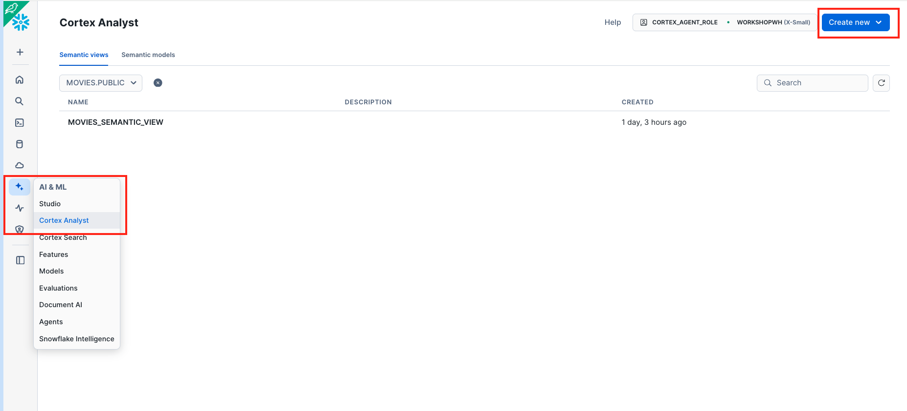

- Select **MOVIES.PUBLIC** location and name the Semantic View **MOVIES_SEMANTIC_VIEW** and click Next.
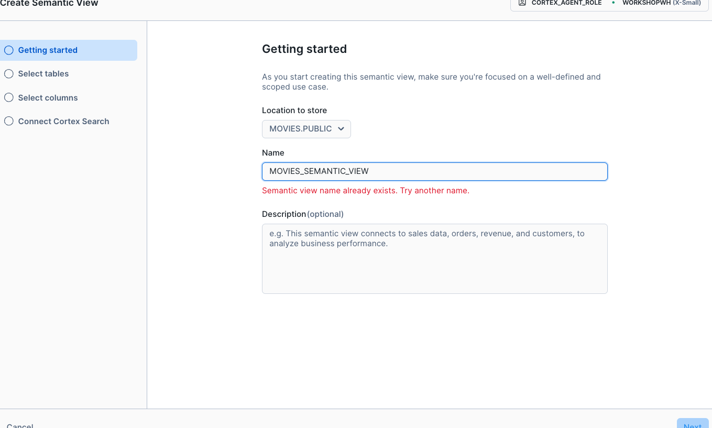

- Scroll to MOVIES.PUBLIC.MOVIES_DASHBOARD and select all of the columns and click Next.
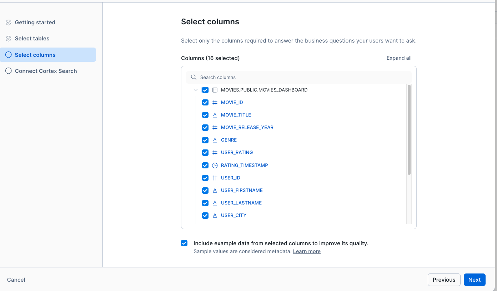

- In the **connect to Search** screen leave all of the prefilled options as-is and select Next.
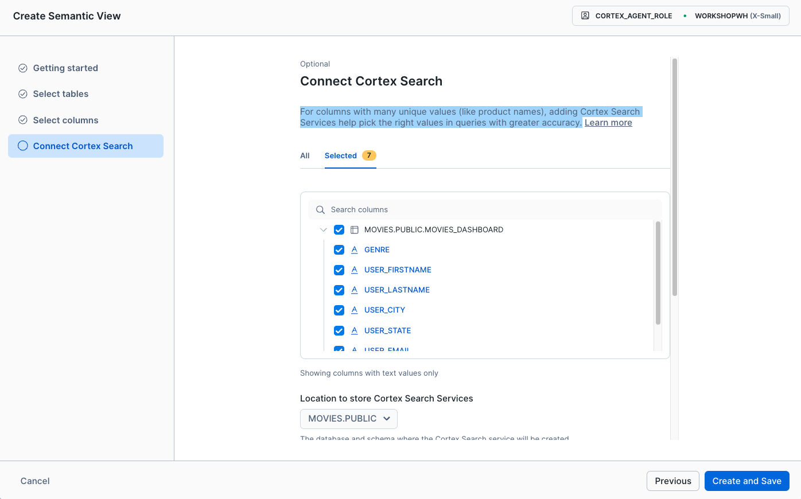

**Cortex Search is added to the Semantic View for columns with many unique values (like product names), adding Cortex Search Services help pick the right values in queries with greater accuracy.**

You can now look inside of the UI view of the Semantic View and see how the Cortex Analyst wizard used LLMs to generate synonyms and descriptions, users are encouraged to update this to improve the performance of Cortex Analyst. Additionally, for Semantic Views that include multiple tables (most will, but not for this demo :smile) users can define relationships and include certified queries.

**Semantic Synonyms and Descriptions**
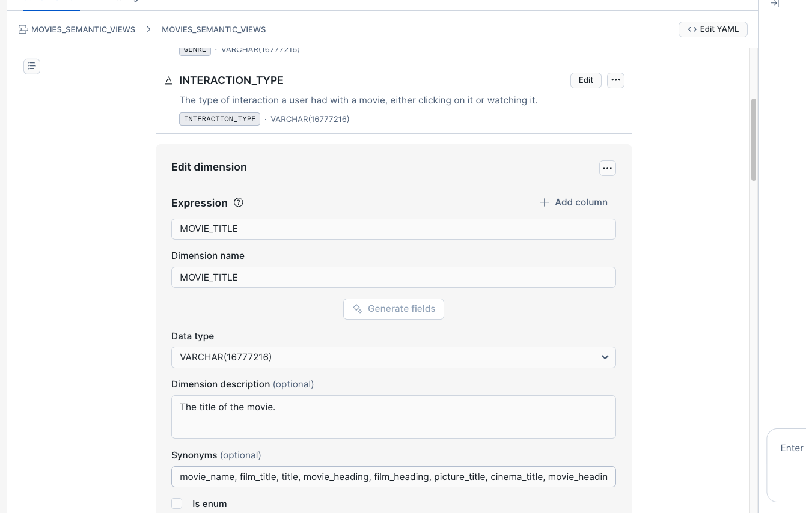

**Verified Queries**
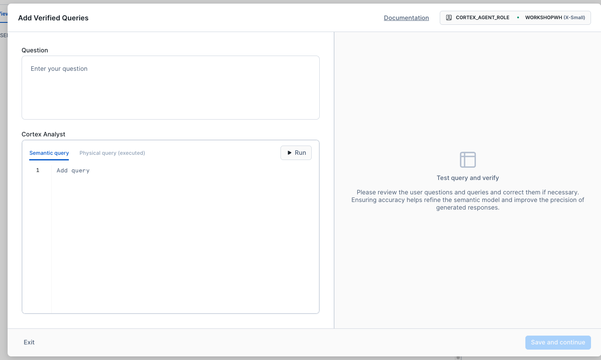

Underneath the UI Cortex Analyst is simply generating a yaml file, so users can build the Semantic View programmatically or with the UI. 
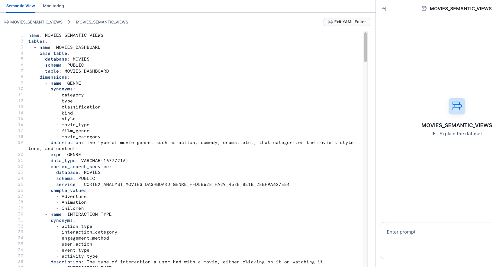


#### Build Cortex Agent

Snowflake Agents allow for many ways to build the Snowflake Agent Object which serves as a spec for the Cortex Agent API.

Ensure that you are in the CORTEX_AGENT_ROLE and select **AIML** then **Agents** on the left panel the select the MOVIES.PUBLIC database and schema.
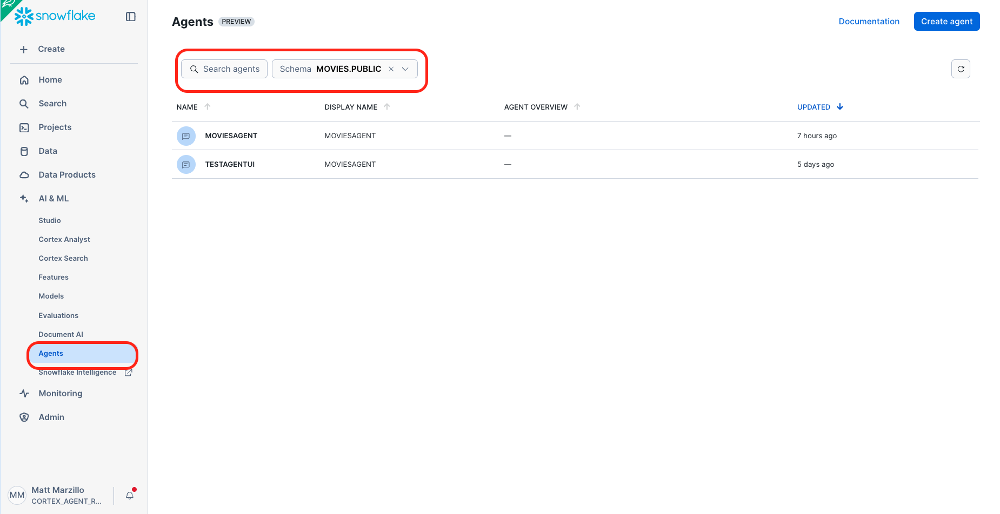


Select **Create Agent** in the top right. 
- Unselect **Create Agent in Snowflake Intelligence**
- Select the MOVIES.PUBLIC database and schema
- name the agent "MOVIESAGENT"

Select the MOVIES agent you just created and select **Edit**.
- In the **About > Description** section place this sentence, "This agent helps answer questions on a select set of movies."
- In the **Orchestration Instructions** please these instructions, "Return only the final answer for the user, in clean Markdown. No planning text, no status messages, no tool traces, no JSON, no code blocks. Use short sentences. Prefer ‘- ’ bullets (not numbered lists). Avoid headings unless asked. Keep lists ≤ 8 items. Don’t echo the question. If there are no results, say ‘No results.’
You are answering for an external app. Produce concise, well‑formatted Markdown. No preamble, no ‘thinking’, no meta‑commentary, no escaping. Final answer only."
- Select your favorite Claude model (running on Amazon Bedrock) and click Save
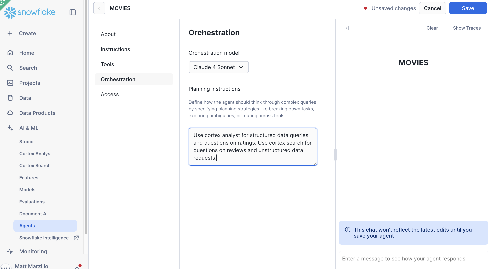

With Cortex Agents you can add number of [tools](https://docs.snowflake.com/en/user-guide/snowflake-cortex/cortex-agents#tools) including native AI services and custom tools. In this quickstart we are only using 1 Cortex Search service and 1 Cortex Analyst service, but Cortex Agents can scale to be much more complex.
- Select **+ Add** for Cortex Analyst.
- Select the MOVIES.PUBLIC Schema and the MOVIES_SEMANTIC_VIEW that we just created. 
- Provide the name MOVIES_SEMANTIC_VIEW.
- Select **Generate with Cortex**.
- Select **Add**.
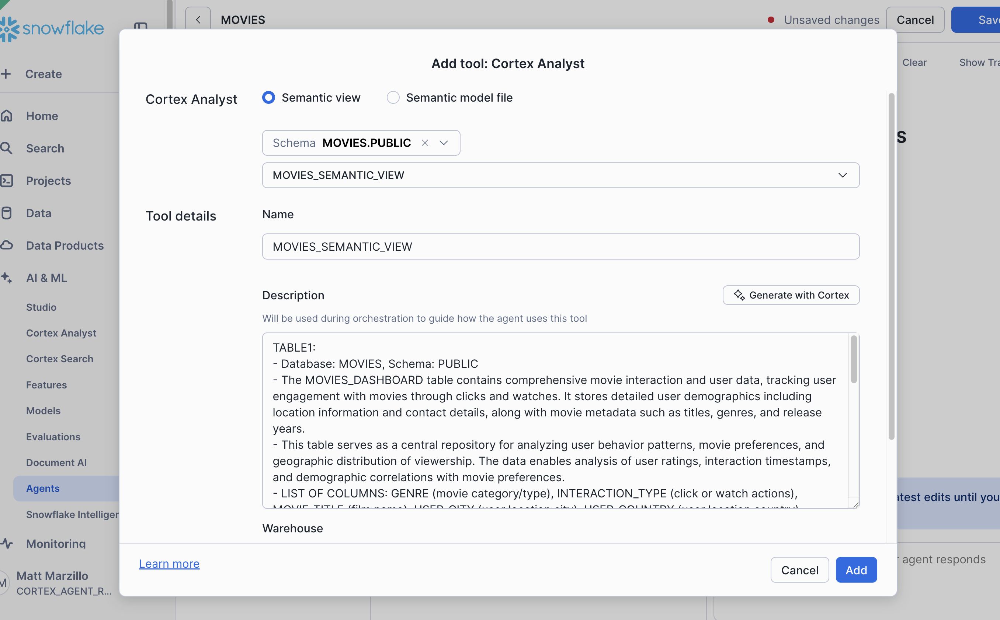


- Select **+ Add** for Cortex Search.
- Provide the name MOVIE_SEARCH.
- Provide MOVIES.PUBLIC for the Search service.
- Select DOCUMENT_ID for the ID Column and SEARCHABLE_TEXT for the Title column.
- Select **Add**.
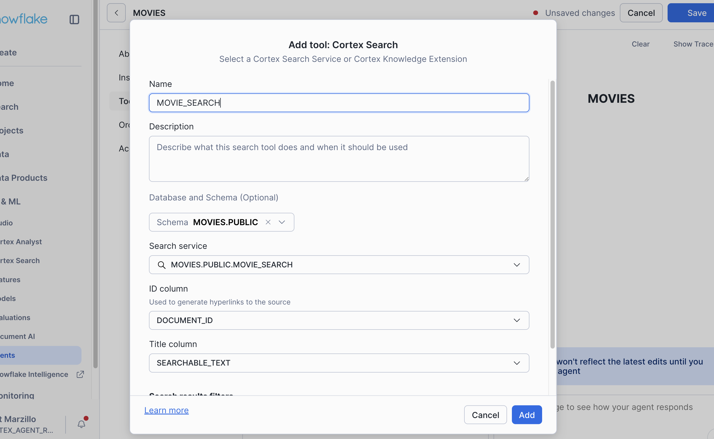

Click **Save** in the top right.

The Agent is ready, you can test it out right in the Snowflake UI with a few sample questions.

Now that Snowflake is ready let's work on setting up Snowflake Cortex as a target in an AgentCore Gateway.

<!-- ------------------------ -->
##  AgentCore Gateway

As a pre-requisite it is expected that users have the below available locally:
- IDE like VS Code (or one of its derivatives).
- AWS CLI and familiarity with it. 
- Installed Python 3.11 or greater.
- Streamlit library installed.

Open a terminal and clone the repo below.

```bash
git clone https://github.com/Snowflake-Labs/sfguide-getting-started-with-bedrock-agentcore-gateways-and-cortex-agents.git
```

Before we get started please make sure you are connected to your AWS account via the (AWS CLI)[https://docs.aws.amazon.com/cli/latest/userguide/getting-started-install.html]

### 1. Environment Setup

Create a virtual environment to avoid dependency conflicts:

```bash
cd agentcore-to-cortex

python -m venv venv
source venv/bin/activate  # On Windows: venv\Scripts\activate

pip install bedrock-agentcore-starter-toolkit requests

python -c "from bedrock_agentcore_starter_toolkit.operations.gateway.client import GatewayClient; print('✅ Installation successful')"
```

### 2. Create Gateway with OpenAPI Target

With the environment ready we are set to create the AgentCore Gateway. Update the below code with your PAT Token from Snowflake and run it. 


```bash
export SNOWFLAKE_PAT_TOKEN="<PAT TOKEN FROM SNOWFLAKE>"

python create_multitarget_gateway.py
```

You should see output affirming the creation of the AWS services like: Gateway, Role, Identity Service and others.

You can now head to your AWS Portal and see what was created.

- In Amazon Bedrock AgentCore select **Gateways > Find your Target** and you should see something like below.
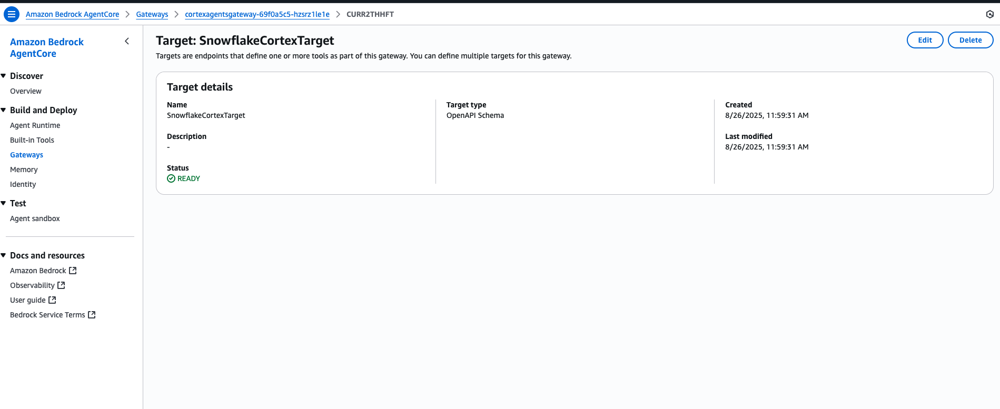


- Then you can go into **Identity** and see how AgentCore create a **Secrets Manager** service to store that PAT token as an API key.
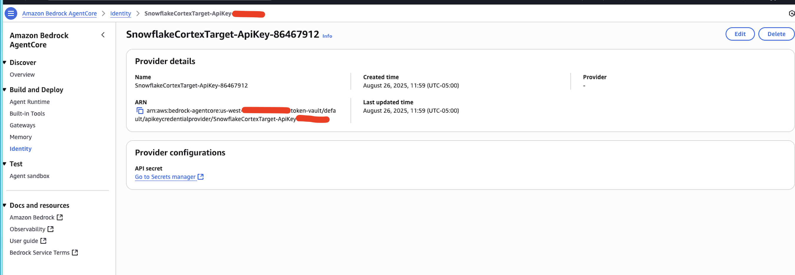


### Use the Gateway from a Streamlit App

Last, from the VS Code terminal execute the below code which will open a browser with a Streamlit App.

```bash
pip install streamlit

streamlit run app.py
```

Try clicking one the buttons like **Toy Story Analysis** to populate the request and submit


The app should look like this:
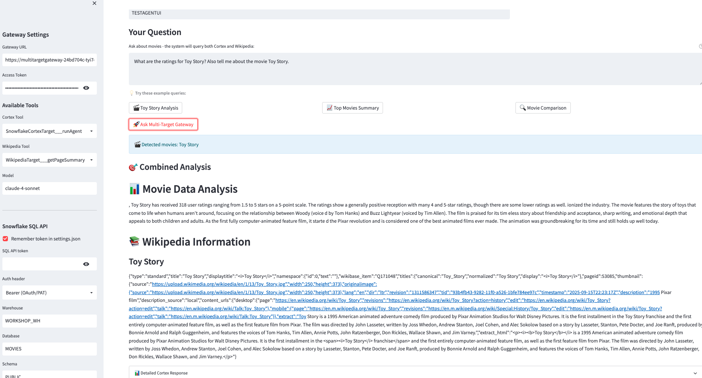

Feel free to make additional requests by using the buttons or asking questions that are relevant to the data.

### Cleanup

Run the below code to remove the underlying AWS resources.

```bash
python cleanup_aws_resources.py
```

<!-- ------------------------ -->
## Conclusion and Resources


This quickstart is just that, a quick way to get you started with using AgentCore Gateways you are encouraged to build upon this by adding more Cortex Tools to your Cortex Agents and more Targets to your AgentCore Gateway.
   - Scale the workflow to a use case with many documents and use a more robust Cortex Search Service.
   - Scale Agents to include more robust Analyst services and multiple tables and a broader Semantic View.
   - Use more targets in your AgentCore Gateway and leverage LLMs in Amazon Bedrock AgentCore to coalesce, send request and consolidate a response.


### What You Learned
- How to use Cortex Search along with complimentary functions in Snowflake.
- How to use Cortex Analyst and semantic models in Snowflake.
- How to use Cortex Agents.
- How to use Amazon Bedrock AgentCore Gateways with OpenAPI Targets.
- How to use Streamlit to build a simple app to serve results of your AgentCore Gateway


### Resources
There are some great blogs on Medium regarding Snowflake Cortex and Amazon Services work together:


- [Snowflake Cortex](/en/data-cloud/cortex/)


- [Amazon Bedrock AgentCore](https://docs.aws.amazon.com/bedrock-agentcore/)


- [AgentCore Gateway](https://docs.aws.amazon.com/bedrock-agentcore/latest/devguide/gateway-building.html)

<!-- ------------------------ -->
## Appendix

### Troubleshooting

#### Invalid Bearer Token Error

If you see this error or similar:
```json
{"jsonrpc": "2.0", "id": "list-tools", "error": {"code": -32001, "message": "Invalid Bearer token"}}
```
You will need to refresh your OAuth token from Amazon Cognito to use AgentCore Gateway.

#### Manual Token Refresh

You can create a file with the below contents to refresh the token:

```python
import json
from bedrock_agentcore_starter_toolkit.operations.gateway.client import GatewayClient

# Load settings
with open("settings.json") as f:
    settings = json.load(f)

# Refresh token
client = GatewayClient(region_name=settings["region"])
new_token = client.get_access_token_for_cognito(settings["client_info"])

# Update settings
settings["access_token"] = new_token
with open("settings.json", "w") as f:
    json.dump(settings, f, indent=2)

print("Token refreshed!")
```

#### AgentCore Gateway OpenAPI Target

The **OpenAPI schema** (`cortex_agents_openapi.json`) defines the **API contract** between AgentCore Gateway and Snowflake Cortex API:

```python
target_response = client.create_mcp_gateway_target(
    gateway=gateway_response,
    name="SnowflakeCortexTarget",
    target_type="openApiSchema",                    # Tells AgentCore this is an OpenAPI target
    target_payload={"inlinePayload": json.dumps(openapi_schema)}, # Inline schema definition
    credentials={...}
)
```

The OpenAPI schema defines the API endpoint, request and response format, and server variables for the dynamic Snowflake account URL. We provide the Snowflake account information in the test_client directly.

#### OpenAPI Schema Processing flow

1. AgentCore Gateway receives the MCP tool call request from the test_client.py with the provided Snowflake account.
2. AgentCore Gateway validates the request against the OpenAPI schema and processes OpenAPI server variables to construct the target URL.
3. AgentCore Gateway converts MCP format to Snowflake Cortex Agents API format.
4. AgentCore Gateway retrieves credentials from the configured AgentCore Credential Provider and adds authentication headers.
5. AgentCore Gateway makes the HTTP request to the Cortex Agents API. 
6. AgentCore Gateway returns the API response to test_client.py through MCP.


```json
{
  "servers": [
    {
      "url": "https://{account_url}/api/v2",  // Dynamic URL with variable
      "variables": {
        "account_url": {
          "description": "Your Snowflake account URL",
          "default": "myaccount.snowflakecomputing.com"
        }
      }
    }
  ],
  "paths": {
    "/cortex/agent:run": {  // Snowflake Cortex endpoint
      "post": {
        "parameters": [
          {
            "name": "Accept",
            "in": "header",
            "required": true,
            "schema": {"type": "string", "default": "application/json"}
          }
        ],
        "requestBody": {
          "required": true,
          "content": {
            "application/json": {
              "schema": {
                "required": ["model", "messages"],
                "properties": {
                  "model": {"type": "string", "enum": ["claude-4-sonnet", ...]},
                  "messages": {"type": "array", ...},
                  "tools": {"type": "array", ...},
                  "tool_resources": {"type": "object", ...}
                }
              }
            }
          }
        }
      }
    }
  }
}
```

