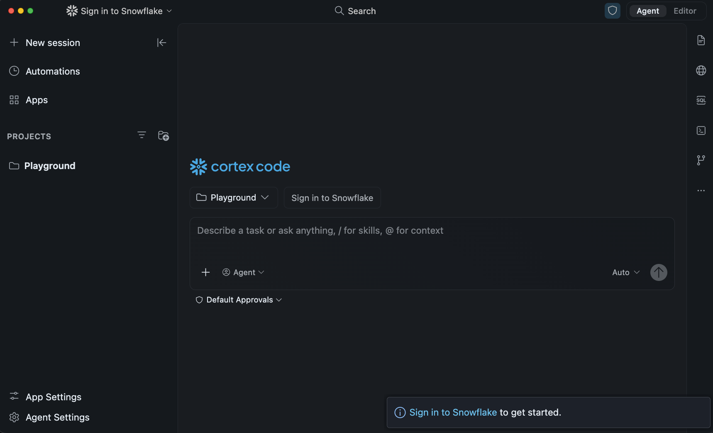
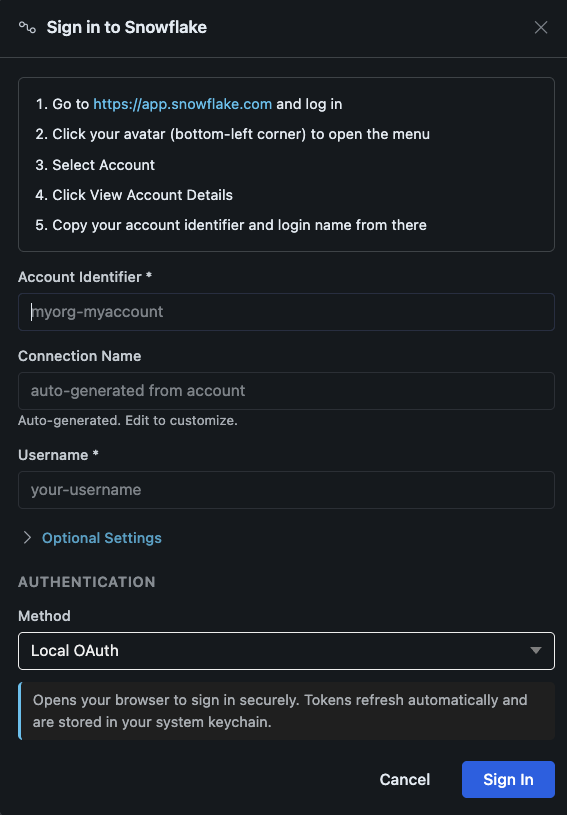
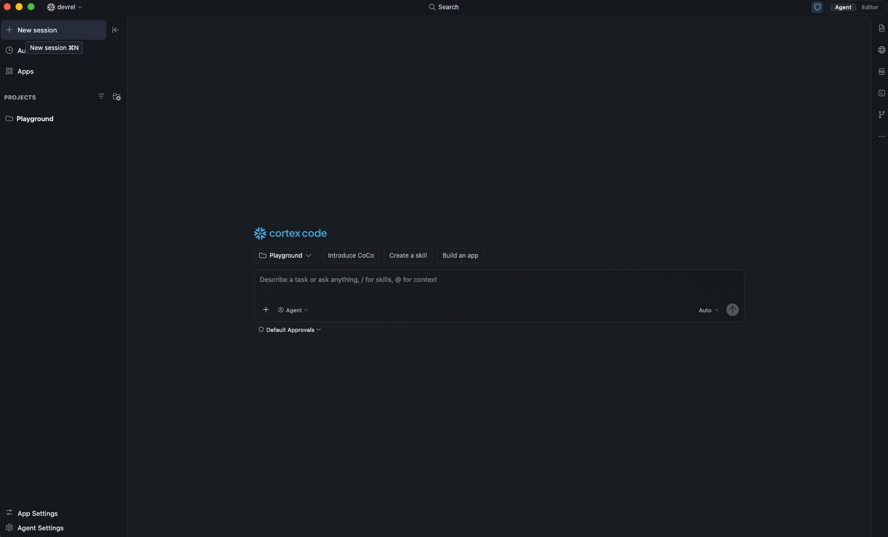
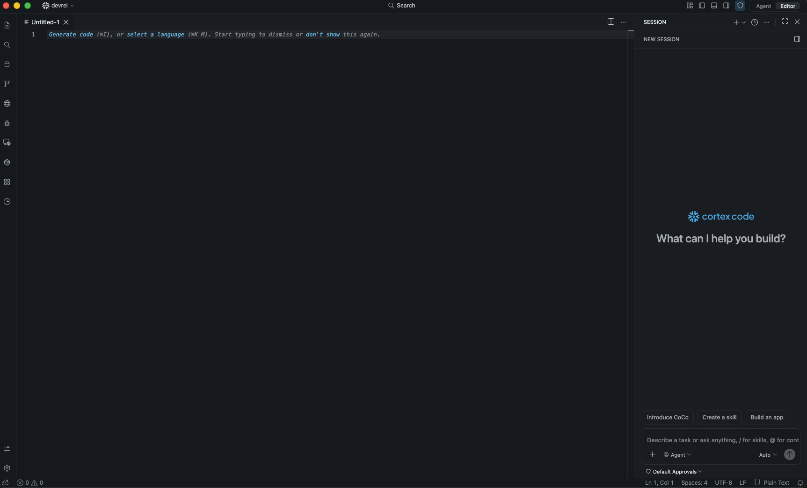
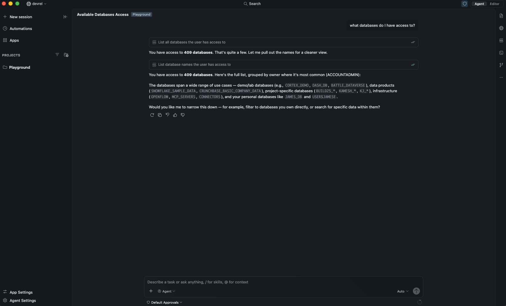

author: James Cha-Earley
id: getting-started-with-coco-desktop
categories: snowflake-site:taxonomy/solution-center/certification/quickstart, snowflake-site:taxonomy/product/ai, snowflake-site:taxonomy/product/platform
language: en
summary: Download Snowflake CoCo Desktop, connect to your Snowflake account, and run your first natural-language queries from a full AI-powered IDE in under 15 minutes.
environments: web
status: Draft
feedback link: https://github.com/Snowflake-Labs/sfguides/issues


# Get Started with Snowflake CoCo Desktop
<!-- ------------------------ -->
## Overview

Snowflake CoCo Desktop is a Snowflake-native desktop IDE that gives you one governed surface to build across your entire data stack. It runs natively on macOS and Windows, connects directly to your Snowflake account, and lets you query data, build pipelines, write Snowpark code, and deploy apps — all in plain English.

CoCo Desktop has two modes: **Agent Mode** puts the agent front and center so it can drive multi-step tasks across multiple projects, and **Editor Mode** gives you a full VS Code-style IDE with the agent in a side panel for when you're writing and reviewing code yourself.

In this guide you will download CoCo Desktop, connect it to your Snowflake account, learn the interface, and run your first queries.

### What You'll Learn
- How to download and install Snowflake CoCo Desktop on macOS or Windows
- How to connect to a Snowflake account using Local OAuth or SSO
- How to navigate Agent Mode and Editor Mode
- How to ask natural-language questions and get SQL-backed answers
- How to use `#` table references to give the agent schema context
- How to manage, resume, and rename sessions

### What You'll Build
A working Snowflake CoCo Desktop environment connected to your Snowflake account, ready for day-to-day development.

### Prerequisites
- A [Snowflake account](https://signup.snowflake.com/?utm_source=snowflake-devrel&utm_medium=developer-guides&utm_cta=developer-guides) — or [sign up for a free Snowflake CoCo trial](https://signup.snowflake.com/cortex-code) if you don't have one yet
- A machine running macOS 12+ or Windows 10/11
- A web browser (required for OAuth sign-in during setup)

<!-- ------------------------ -->
## Download and Install
Duration: 3

### Download

Go to the [Snowflake CoCo download page](https://www.snowflake.com/en/product/snowflake-coco/) and download the installer for your platform.

| Platform | Installer |
|----------|-----------|
| macOS (Apple silicon) | `.dmg` disk image |
| macOS (Intel) | `.dmg` disk image |
| Windows (Intel/AMD) | `.exe` installer |
| Windows (ARM) | `.exe` installer |

> **Not sure which to download?** On macOS: Apple menu → **About This Mac** → Chip (M-series = Apple silicon, Intel = Intel). On Windows: Start → Settings → System → About → Device specifications → System type.

### macOS

1. Open the downloaded `.dmg` file.
2. Drag **Snowflake CoCo** into your **Applications** folder.
3. Launch CoCo Desktop from Applications or Spotlight.

> **Note:** On first launch macOS may show a security prompt because the app was downloaded from the internet. Open **System Settings → Privacy & Security** and click **Open Anyway** if this appears. The macOS build is notarized by Apple.

### Windows

1. Run the downloaded `.exe` installer.
2. Follow the setup wizard — the default install location is fine for most users.
3. Launch CoCo Desktop from the Start menu or desktop shortcut.

### Verify the installation

CoCo Desktop launches directly to the onboarding screen. If you see the welcome screen you're ready for the next step.

<!-- ------------------------ -->
## Connect to Snowflake
Duration: 5

On first launch, CoCo Desktop walks you through a four-step setup flow: **welcome → connect → mode → theme**.

### Step 1 — Welcome

Click **Next** on the welcome screen to begin.



### Step 2 — Connect to Snowflake

If you already have a `~/.snowflake/connections.toml` file (for example from Snowflake CoCo CLI), your existing connections appear automatically. Select one and click **Next**.

To create a new connection, click **Add connection**. Choose your authentication method first, then fill in the form:

#### Authentication methods

| Method | When to use |
|--------|-------------|
| Local OAuth (recommended) | Interactive use; tokens cached in your OS keychain — no password stored |
| External Browser (SSO) | Accounts with Okta, Azure AD, or another Identity Provider |
| Password | Direct username/password; MFA-prompted if enabled |
| Key Pair (JWT) | Service accounts and automated workflows |

| Field | Example |
|-------|---------|
| Account identifier | `myorg-myaccount` |
| Connection name | Auto-generated; can be changed |
| Username | Your Snowflake login name |
| Authentication method | Local OAuth (recommended) |

Click **Sign in**. For OAuth or SSO, complete sign-in in your browser when prompted, then return to the app.



> **Tip:** To find your account identifier, sign in at [app.snowflake.com](https://app.snowflake.com), click your avatar in the bottom-left corner, and select **Connect a tool to Snowflake**. Your identifier is in `orgname-accountname` format. Older accounts may use a legacy format like `xy12345.us-east-1` — copy the exact value shown in Snowsight rather than typing it manually.

### Step 3 — Choose a mode

Pick your default startup layout:

- **Agent** — conversations front and center, best for driving and reviewing agent work across projects
- **Editor** — VS Code-style file editor with the agent in a side panel

You can switch between modes at any time with the toggle in the top-right corner (or **⌘E** / **Ctrl+E**).


### Step 4 — Choose a theme

Select **Light** or **Dark**, then click **Get Started** to launch the app.

### Verify the connection

Once in the app, your active connection name appears in the top navigation bar. A green status dot next to it confirms you're connected. If the connection failed, click the connection name, select **Manage Snowflake Connections**, and verify your account identifier and auth method.

<!-- ------------------------ -->
## Explore the Interface
Duration: 5

CoCo Desktop has two modes. Understanding them helps you get the most out of the app.

### Agent Mode

Agent Mode puts the conversation first. The window has three regions:

| Region | What it does |
|--------|-------------|
| **Navigation panel (left)** | Lists your projects and past sessions. Use **New session** (⌘N / Ctrl+N) to start fresh or click any session to reopen it. |
| **Main chat area (center)** | Your conversation with the agent — messages, tool calls, SQL results, file diffs, and charts all appear here. |
| **Tool bar (right)** | Icons for SQL Playground, Files, Files Changed, Terminal, Browser, Source Control, and more. |

Use the chat input at the bottom: type your message, use `/` to invoke skills (e.g. `/semantic-view`), and `@` to attach a file or paste its contents into context.



### Editor Mode

Editor Mode is a standard VS Code layout with the agent in a side panel:

| Region | What it does |
|--------|-------------|
| **Activity bar (left)** | Explorer, Search, Source Control, Run & Debug, Extensions, Snowflake Catalog, Skills, Apps, Agent Settings |
| **Main editor (center)** | File editing, notebooks, and quick-action cards |
| **Session panel (right)** | Your chat — same conversations as Agent Mode |

Switch to Editor Mode when you're writing code, debugging, or using editor extensions. Switch to Agent Mode when you want the agent driving the work.

> **Tip:** The active mode is shown in the top-right corner. Click **Agent** or **Editor** to switch. Your open files and conversation follow you across the toggle.



<!-- ------------------------ -->
## Run Your First Query
Duration: 5

With the session running, type a plain-English question in the chat input:

```
What databases do I have access to?
```

CoCo Desktop translates your request into SQL, runs it against Snowflake, and returns the results in the chat. You can see the SQL it generated and the reasoning steps as it works.



### More examples

Try a few more requests to get a feel for what is possible:

```
What is my current role and warehouse?
```

```
What schemas are in my default database?
```

```
Show me the warehouses available in my account
```

```
Create a simple table called test_greetings with a name column and insert a few rows
```

CoCo Desktop displays its reasoning steps as it works. If it needs more information it will ask a follow-up question.

> **Note:** Some queries (like browsing query history or metering data) require the ACCOUNTADMIN role or a specific grant. If you hit a permission error, try switching your role via the connection menu or ask CoCo: "What role do I need to query warehouse metering history?"

### Reference a table with #

Prefix a fully qualified table name with `#` to pull its schema and sample rows into the conversation. Use a table you already have access to, for example:

```
Tell me about #<YOUR_DATABASE>.INFORMATION_SCHEMA.TABLES
```

CoCo Desktop fetches the column definitions and a sample of rows so it can answer questions about the table without you having to describe the schema.

<!-- ------------------------ -->
## Manage Sessions
Duration: 3

Every conversation is saved automatically. You can pick up exactly where you left off.

### Resume a session

In Agent Mode, sessions are listed in the navigation panel under each project. Click any session to reopen it.

In Editor Mode, past sessions are listed in the **Session** panel on the right. Click **Recent sessions** to browse and reopen them.

### Start a new session

Click **New session** in the navigation panel, or press **⌘N** (macOS) / **Ctrl+N** (Windows).

### Rename a session

Right-click a session in the navigation panel and select **Rename**.

### Search and filter sessions

Use the filter icon in the top-right corner of the navigation panel to search sessions by name, or filter to show only unread sessions.

### Switch between projects

Each project in the navigation panel has its own set of sessions. Click a different project to switch context, or click the **+** button to add a new project folder.

### Private Mode

For sensitive work, enable **Private Mode** from the connection menu in the top navigation bar. Conversation history is stored locally on your machine; Private Mode turns off local persistence for that session so nothing is written to disk.

<!-- ------------------------ -->
## Conclusion And Resources
Duration: 2

Congratulations! You've successfully installed Snowflake CoCo Desktop, connected it to your Snowflake account, and run your first natural-language queries from a full AI-powered IDE.

From here you can explore [Plan Mode](https://docs.snowflake.com/en/user-guide/cortex-code/cortex-code-desktop/agent-mode-and-plan-mode) to have the agent show its approach before making changes, connect external tools via [MCP servers](https://docs.snowflake.com/en/user-guide/cortex-code/extensibility), and add [Skills](https://docs.snowflake.com/en/user-guide/cortex-code/cortex-code-desktop/skills) to give the agent reusable workflows for your team.

### What You Learned
- How to download and install Snowflake CoCo Desktop on macOS or Windows
- How to connect to Snowflake using Local OAuth or SSO
- How to navigate Agent Mode and Editor Mode
- How to ask natural-language questions and run SQL
- How to use `#` table references to give the agent schema context
- How to manage, resume, rename, and search sessions

### Related Resources

Documentation:
- [Snowflake CoCo Desktop](https://docs.snowflake.com/en/user-guide/cortex-code/cortex-code-desktop)
- [Agent Mode and Editor Mode](https://docs.snowflake.com/en/user-guide/cortex-code/cortex-code-desktop/agent-mode-and-editor-mode)
- [Onboarding and Authentication](https://docs.snowflake.com/en/user-guide/cortex-code/cortex-code-desktop/onboarding-and-authentication)
- [Skills in Snowflake CoCo Desktop](https://docs.snowflake.com/en/user-guide/cortex-code/cortex-code-desktop/skills)
- [Agent Mode and Plan Mode](https://docs.snowflake.com/en/user-guide/cortex-code/cortex-code-desktop/agent-mode-and-plan-mode)
- [Security](https://docs.snowflake.com/en/user-guide/cortex-code/cortex-code-desktop/security)

Other CoCo interfaces:
- [Snowflake CoCo CLI](https://docs.snowflake.com/en/user-guide/cortex-code/cortex-code-cli)
- [Snowflake CoCo in Snowsight](https://docs.snowflake.com/en/user-guide/cortex-code/cortex-code-snowsight)

Additional Reading:
- [Snowflake Developers Blog](https://developers.snowflake.com/blog/)
- [Snowflake Community](https://community.snowflake.com/s/)
