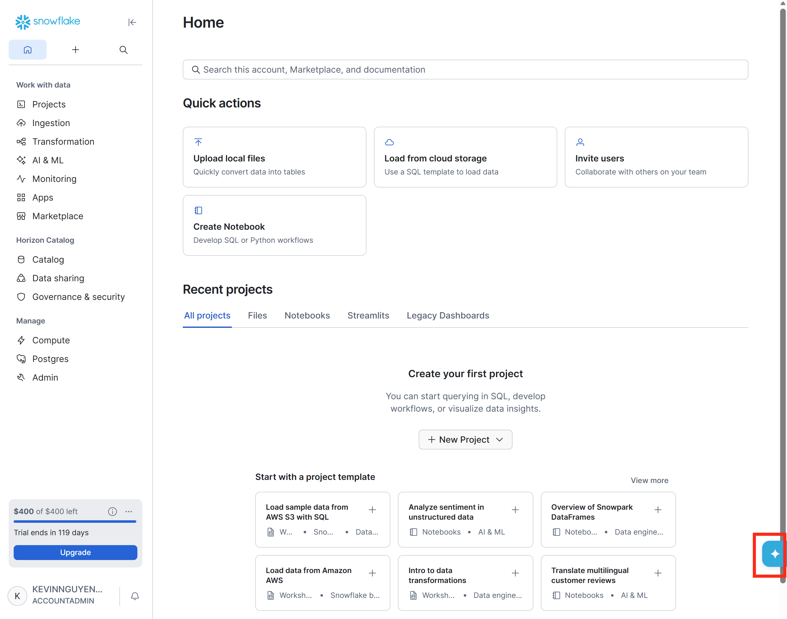
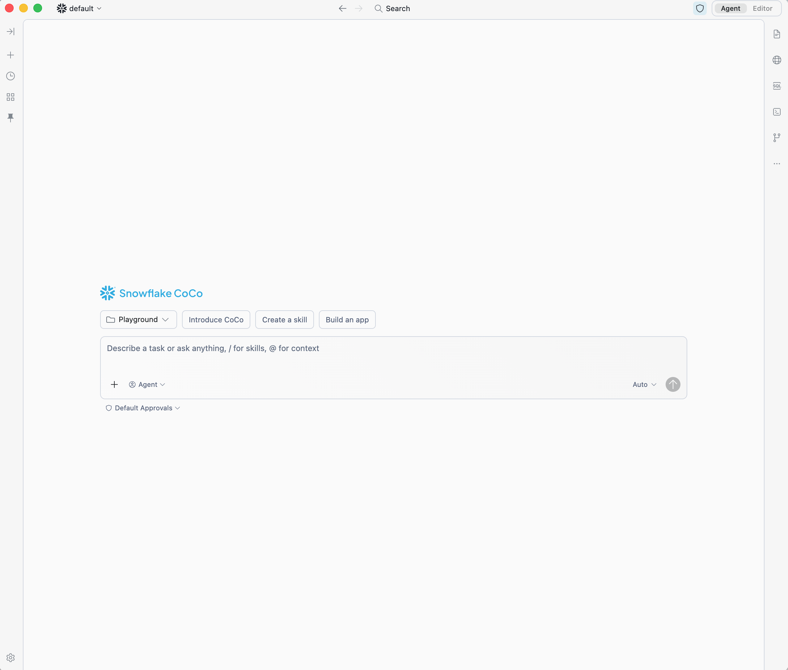
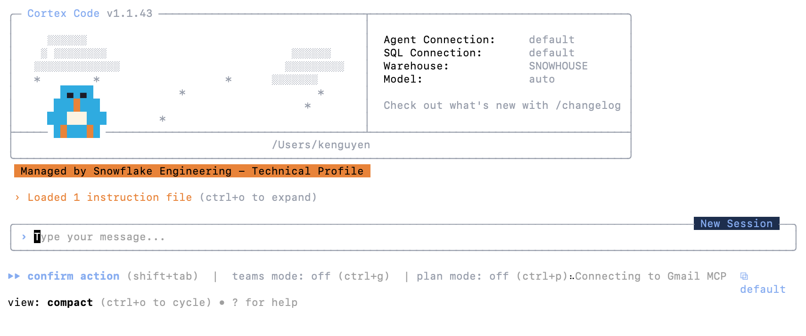
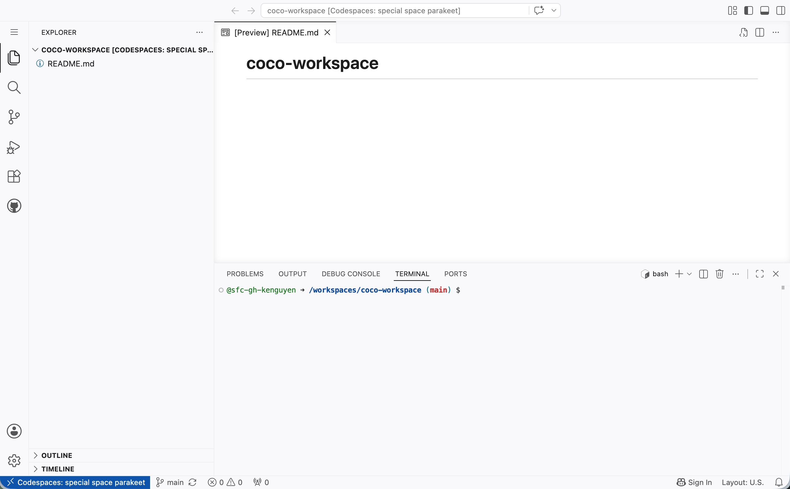

author: Kevin Nguyen
id: getting-started-with-coco
categories: snowflake-site:taxonomy/solution-center/certification/quickstart, snowflake-site:taxonomy/product/ai, snowflake-site:taxonomy/product/platform
language: en
summary: Choose how to access Snowflake CoCo — directly in Snowsight with no install, via the desktop IDE, the CLI, or GitHub Codespaces — and run your first natural-language queries in minutes.
environments: web
status: Draft
feedback link: https://github.com/Snowflake-Labs/sfguides/issues


# Getting Started with Snowflake CoCo: Desktop, CLI, Snowsight, and Codespaces
<!-- ------------------------ -->
## Overview

Snowflake CoCo is Snowflake's AI coding agent for data and AI workflows. It understands your data catalog, executes SQL as your identity, and works natively with SQL, Python, Streamlit, dbt, and more — all through natural language.

CoCo is available in four access modes. Pick the one that fits your setup and skip directly to that section.

| Access mode | Best for | Installation required |
|-------------|----------|-----------------------|
| [Snowsight](#access-via-snowsight) | Quick queries, zero setup | None |
| [CoCo Desktop](#coco-desktop) | Full IDE experience on macOS or Windows | Desktop app |
| [CoCo CLI](#coco-cli) | Terminal-based workflows on any platform | CLI binary |
| [GitHub Codespaces](#coco-in-codespaces) | Corporate laptops with install restrictions, workshops | GitHub account (free) |

All four modes share the same conversation model and Snowflake connection format — you can switch between them as your workflow evolves.

### What You'll Learn
- How to access CoCo in Snowsight with no installation
- How to install and connect CoCo Desktop on macOS or Windows
- How to install and configure the CoCo CLI on any platform
- How to run CoCo in a GitHub Codespace with no local installation
- How to run your first natural-language queries across any mode

### What You'll Build
A working Snowflake CoCo environment in the access mode of your choice, connected to your Snowflake account and ready for development.

### Prerequisites
- A [Snowflake account](https://signup.snowflake.com/?utm_source=snowflake-devrel&utm_medium=developer-guides&utm_cta=developer-guides) — or [sign up for a free CoCo trial](https://signup.snowflake.com/cortex-code) if you don't have one yet

If you encounter access errors when first using CoCo, see the access requirements in the section for your chosen mode.

<!-- ------------------------ -->
## Access via Snowsight
Duration: 3

Snowsight is the fastest path to CoCo — no installation needed. CoCo is built directly into the Snowsight interface as a panel you can open from any page.

### Open the CoCo Panel

1. Sign in to [Snowsight](https://app.snowflake.com).
2. Click the Cortex Code icon (blue star ✦) in the lower-right corner of any page.
3. The CoCo panel opens on the right side of Snowsight.
4. Type your question in the message box and press **Enter**.



> **Note:** CoCo always starts your session using your **default role**. If you need a different role, ask CoCo directly: `"Switch to the SYSADMIN role."`
>
> If CoCo is unavailable in Snowsight, ask your administrator to grant you the `SNOWFLAKE.COPILOT_USER` and `SNOWFLAKE.CORTEX_USER` database roles.

### Key Capabilities

- **`@`-mentions** — type `@` in the message box to search for catalog objects (tables, schemas, views) and add them as inline context
- **Inline code suggestions** — as you type SQL in a Workspace, CoCo suggests completions as gray text; accept with **Shift+Enter**
- **Skills** — type `/` to invoke built-in skills for specialized Snowflake tasks
- **Diff view** — for code changes, CoCo shows a before/after comparison before applying edits

For the full list of capabilities including Notebooks, dbt support, and Marketplace discovery, see [Cortex Code in Snowsight](https://docs.snowflake.com/en/user-guide/cortex-code/cortex-code-snowsight).

<!-- ------------------------ -->
## CoCo Desktop
Duration: 3

CoCo Desktop is a native desktop application for macOS and Windows. It gives you a full Snowflake-native IDE with two layouts: **Agent Mode** (conversation-first, agent drives the work) and **Editor Mode** (VS Code-style editor with the agent in a side panel).

### Download and Install

Go to the [Snowflake CoCo download page](https://www.snowflake.com/en/product/snowflake-coco/) and download the installer for your platform.

| Platform | Installer |
|----------|-----------|
| macOS (Apple silicon) | `.dmg` disk image |
| macOS (Intel) | `.dmg` disk image |
| Windows (Intel/AMD) | `.exe` installer |
| Windows (ARM) | `.exe` installer |

**macOS:** Open the `.dmg`, drag Snowflake CoCo to your Applications folder, and launch it. On first launch, macOS may show a security prompt — open **System Settings → Privacy & Security** and click **Open Anyway**.

**Windows:** Run the `.exe` installer and follow the setup wizard. Launch CoCo Desktop from the Start menu.

### Connect to Snowflake

On first launch, a setup wizard walks you through connecting to Snowflake. Choose your authentication method:

| Method | When to use |
|--------|-------------|
| Local OAuth (recommended) | Interactive use; tokens cached in your OS keychain |
| External Browser (SSO) | Accounts with Okta, Azure AD, or another Identity Provider |
| Password | Direct username/password |
| Key Pair (JWT) | Service accounts and automated workflows |

Enter your account identifier (e.g. `myorg-myaccount`) and set the connection name to `DEMO`. Complete sign-in in your browser if prompted, and you're connected.

> **Tip:** If you already have a `~/.snowflake/connections.toml` file from the CoCo CLI or Snowflake CLI, your existing connections appear automatically.



For a full interface walkthrough including session management and Plan Mode, see [Cortex Code Desktop](https://docs.snowflake.com/en/user-guide/cortex-code/cortex-code-desktop).

<!-- ------------------------ -->
## CoCo CLI
Duration: 3

The CoCo CLI (`cortex`) is a terminal-based interface for macOS, Linux, and Windows. It shares the same connection configuration as the Snowflake CLI (`snow`), so if you already have `connections.toml` set up, you can start using CoCo immediately.

### Install

**macOS and Linux (including WSL):**

```bash
curl -LsS https://ai.snowflake.com/static/cc-scripts/install.sh | sh
```

**Windows (PowerShell):**

```powershell
irm https://ai.snowflake.com/static/cc-scripts/install.ps1 | iex
```

When prompted to add `cortex` to your PATH, respond with `y`. Verify the installation:

```bash
cortex --version
```

### Configure Your Connection

CoCo CLI uses the same `connections.toml` file as the Snowflake CLI. If you already have connections configured there, skip to the next step.

To create a new connection file:

**macOS / Linux:**

```bash
mkdir -p ~/.snowflake
touch ~/.snowflake/connections.toml
chmod 600 ~/.snowflake/connections.toml
```

**Windows (PowerShell):**

```powershell
mkdir $env:USERPROFILE\.snowflake -Force
New-Item -ItemType File -Path "$env:USERPROFILE\.snowflake\connections.toml" -Force
```

Open the file and add a connection block:

```toml
default_connection_name = "DEMO"

[connections.DEMO]
account   = "<YOUR_ACCOUNT>"   # e.g. myorg-myaccount
user      = "<YOUR_USERNAME>"
password  = "<YOUR_PASSWORD>"
role      = "<YOUR_ROLE>"
```

### Launch CoCo CLI

Run `cortex` to start a session. On first run, a setup wizard guides you through choosing or creating a connection. To specify a connection directly:

```bash
cortex -c DEMO
```



For supported platforms, model selection, and advanced configuration, see [Cortex Code CLI](https://docs.snowflake.com/en/user-guide/cortex-code/cortex-code-cli).

<!-- ------------------------ -->
## CoCo in Codespaces
Duration: 4

GitHub Codespaces gives you a fully configured Linux environment in your browser with no local installation required. This is the best option when you're on a corporate laptop with installation restrictions, or running a workshop where participants need a consistent environment.

You need a free GitHub account — sign up at [github.com](https://github.com) if you don't have one.

### Create a Codespace

**Step 1 — Create a repository**

1. Go to [github.com](https://github.com) and click **+** in the top right → **New repository**.
2. Give it a name (e.g. `coco-workspace`) and check **Add a README file**.
3. Click **Create repository**.

**Step 2 — Launch the Codespace**

1. On your repository page, click the green **Code** button → **Codespaces** tab.
2. Click **Create codespace on main**.
3. GitHub builds the environment in about 1–2 minutes. Once ready, you see a VS Code interface in your browser with a terminal at the bottom.



### Install and Configure CoCo

In the Codespaces terminal, install the CoCo CLI:

```bash
curl -LsS https://ai.snowflake.com/static/cc-scripts/install.sh | sh
```

Respond with `y` when prompted to add `cortex` to your PATH. Then create your connection file:

```bash
mkdir -p ~/.snowflake
touch ~/.snowflake/config.toml
chmod 600 ~/.snowflake/config.toml
nano ~/.snowflake/config.toml
```

Add your connection details:

```toml
default_connection_name = "DEMO"

[connections.DEMO]
account   = "<YOUR_ACCOUNT>"   # e.g. myorg-myaccount
user      = "<YOUR_USERNAME>"
password  = "<YOUR_PASSWORD>"
role      = "<YOUR_ROLE>"
```

Save with **Ctrl+O**, **Enter**, then exit with **Ctrl+X**.

### Launch CoCo

```bash
cortex -c DEMO
```

> **Note:** Codespace sessions are ephemeral — your `config.toml` will be lost if the Codespace is deleted. To persist it across rebuilds, add your setup commands to a [dev container configuration](https://docs.github.com/en/codespaces/setting-up-your-project-for-codespaces/adding-a-dev-container-configuration).

<!-- ------------------------ -->
## Try Your First Prompts
Duration: 3

Once connected through any of the four access modes, the experience is the same — type natural-language requests and CoCo translates them into SQL, runs the queries against Snowflake, and returns results along with its reasoning steps.

Start with a simple request to confirm your connection:

```
What databases do I have access to?
```

Then try a few more to explore what CoCo can do:

```
What is my current role and warehouse?
```

```
What schemas are in my default database?
```

```
Explain what a Dynamic Table is and when I should use one
```

### Reference Tables in Your Prompts

You can pull a table's schema and sample data into the conversation to give CoCo context:

| Access mode | Syntax | Example |
|-------------|--------|---------|
| CoCo Desktop | `#table_name` | `Tell me about #MY_DB.MY_SCHEMA.ORDERS` |
| Snowsight | `@table_name` | `Tell me about @MY_DB.MY_SCHEMA.ORDERS` |
| CLI / Codespaces | Fully qualified name in prompt | `"Describe MY_DB.MY_SCHEMA.ORDERS and suggest useful queries"` |

> **Note:** Some queries (like warehouse metering history) require the ACCOUNTADMIN role. If you hit a permissions error, ask CoCo: `"What role do I need to run this query?"`

<!-- ------------------------ -->
## Conclusion And Resources
Duration: 2

Congratulations! You've successfully connected to Snowflake CoCo and run your first natural-language queries. Whether you chose Snowsight, CoCo Desktop, the CoCo CLI, or GitHub Codespaces, you now have a working CoCo environment connected to your Snowflake account.

From here, explore [Skills](https://docs.snowflake.com/en/user-guide/cortex-code/cortex-code-desktop/skills) to give CoCo reusable workflows, [Plan Mode](https://docs.snowflake.com/en/user-guide/cortex-code/cortex-code-desktop/agent-mode-and-plan-mode) to review multi-step actions before they run, and [MCP servers](https://docs.snowflake.com/en/user-guide/cortex-code/extensibility) to connect external tools.

### What You Learned
- How to access CoCo in Snowsight with no installation
- How to install and connect CoCo Desktop on macOS or Windows
- How to install and configure the CoCo CLI via terminal
- How to run CoCo in a browser-based GitHub Codespace
- How to run natural-language queries and reference tables across all CoCo modes

### Related Resources

Per-mode documentation:
- [Cortex Code in Snowsight](https://docs.snowflake.com/en/user-guide/cortex-code/cortex-code-snowsight)
- [Cortex Code Desktop](https://docs.snowflake.com/en/user-guide/cortex-code/cortex-code-desktop)
- [Cortex Code CLI](https://docs.snowflake.com/en/user-guide/cortex-code/cortex-code-cli)
- [Configuring Connections](https://docs.snowflake.com/developer-guide/snowflake-cli/connecting/configure-connections)

Going deeper:
- [CoCo Foundations Workshop](https://www.snowflake.com/en/developers/guides/coco-foundations/) — hands-on lab covering Dynamic Tables, custom skills, and Cortex Agents with the CoCo CLI
- [Skills and Extensibility](https://docs.snowflake.com/en/user-guide/cortex-code/extensibility)
- [Agent Mode and Plan Mode](https://docs.snowflake.com/en/user-guide/cortex-code/cortex-code-desktop/agent-mode-and-plan-mode)
- [Snowflake Documentation](https://docs.snowflake.com/)
- [Snowflake Community](https://community.snowflake.com/s/)
