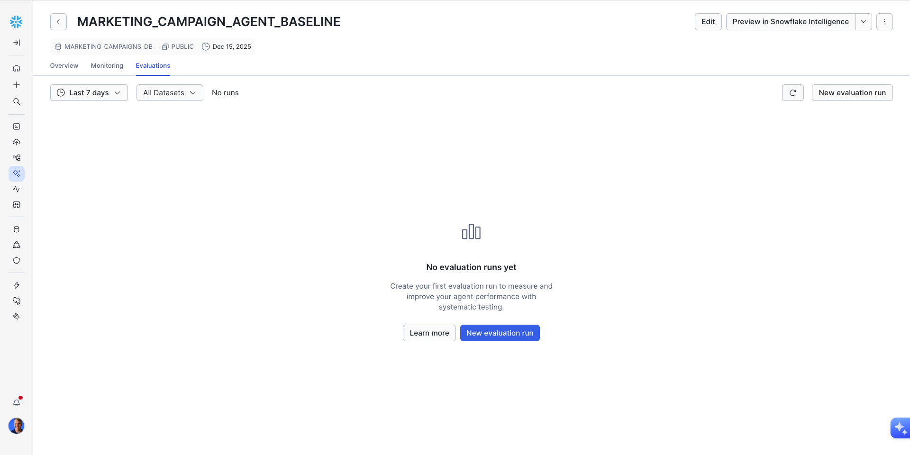
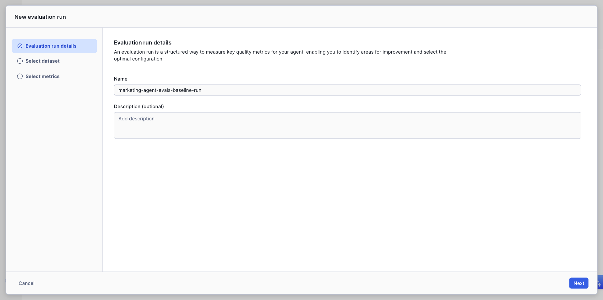
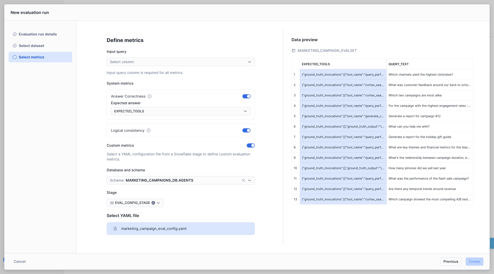
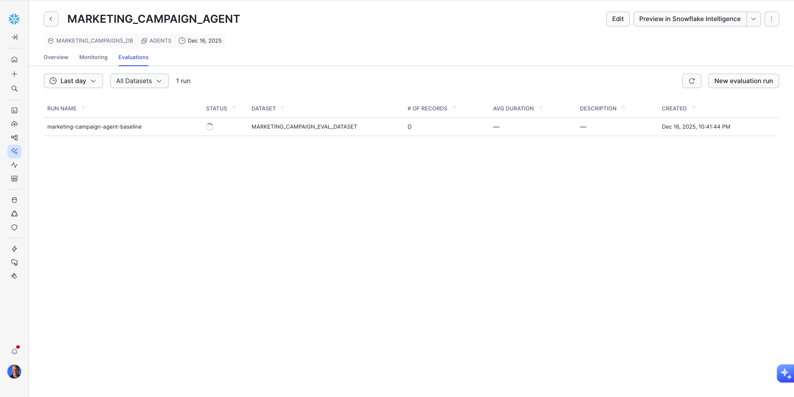
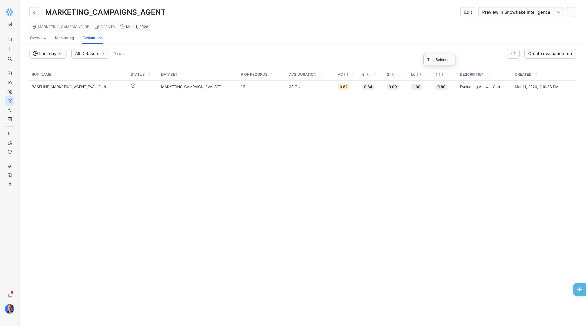
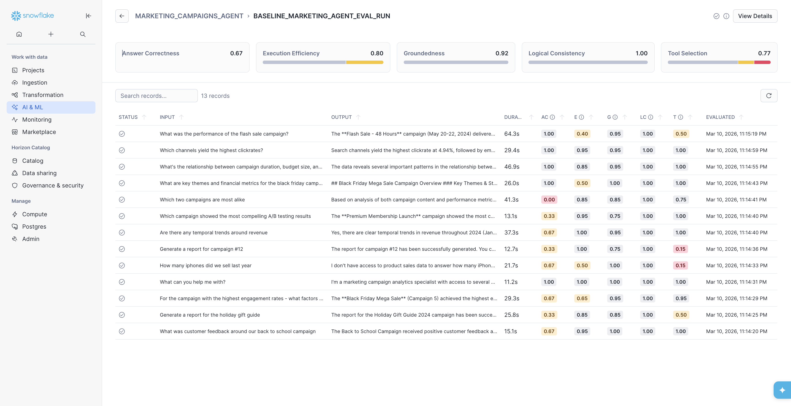
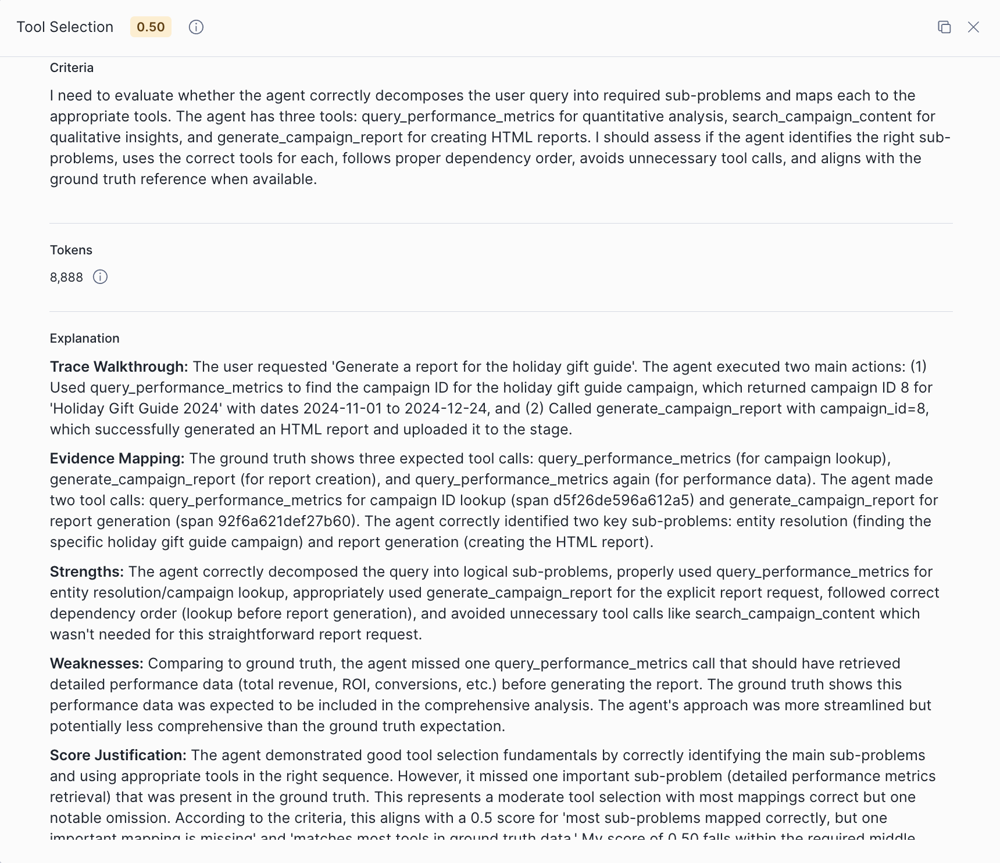
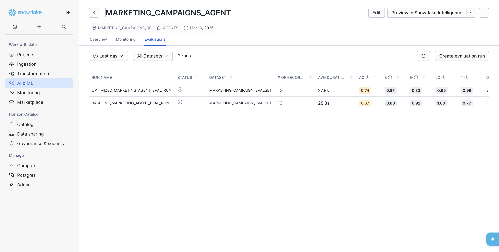
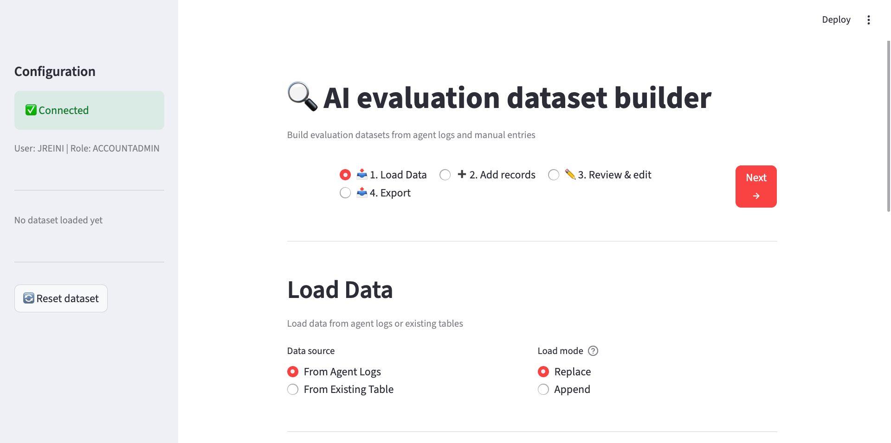

author: Elliott Botwick, Josh Reini
id: getting-started-with-cortex-agent-evaluations
categories: snowflake-site:taxonomy/solution-center/certification/quickstart, snowflake-site:taxonomy/product/ai, snowflake-site:taxonomy/product/platform, snowflake-site:taxonomy/snowflake-feature/cortex-llm-functions
language: en
summary: Get started with Cortex Agent Evaluations
environments: web
status: Published 
feedback link: https://github.com/Snowflake-Labs/sfguides/issues
tags: Cortex Agents, Evaluations, AI, LLM, Snowflake Cortex
fork repo link: https://github.com/Snowflake-Labs/sfguide-getting-started-with-cortex-agent-evaluations

# Getting Started with Cortex Agent Evaluations

## Overview

Duration: 5

Building AI agents is just the beginning—understanding how well they perform is critical for delivering reliable, production-ready applications. Snowflake Cortex Agent Evaluations provides a comprehensive framework for measuring agent performance across multiple dimensions, helping you identify issues and iterate toward better outcomes.

This quickstart guides you through setting up and running evaluations on Cortex Agents, building evaluation datasets, and comparing agent configurations to optimize performance.

> **Preview Feature — Private**: Support for this feature is currently not in production and is available only to selected accounts.

If you are building external agents, such as in python or a framework like LangGraph, please check out [Getting Started with AI Observability](https://www.snowflake.com/en/developers/guides/getting-started-with-ai-observability/) instead. This guide is entirely focused on evaluation of Cortex Agents.

### What is Cortex Agent Evaluations?

Cortex Agent Evaluations is a feature within Snowflake Cortex that enables you to systematically measure and improve your AI agents. It provides:

- **Tool Selection Accuracy**: Measures whether the agent selects the correct tools for a given query
- **Tool Execution Accuracy**: Evaluates whether tool calls are executed correctly with proper parameters
- **Answer Correctness**: Assesses the quality and accuracy of the agent's final response
- **Logical Consistency**: Assesses the agent trace for redundancies, superfluous tool calls or inefficient use of resources.

### What You'll Learn

- How to set up sample marketing data and agents for evaluation
- How to create evaluation datasets with ground truth data
- How to run evaluations and interpret metrics
- How to compare agent configurations to identify improvements
- How to use the Evalset Generator app to build custom evaluation datasets

### What You'll Build

A complete evaluation workflow that enables you to:

- Create evaluation datasets from agent logs or manual input
- Run evaluations across multiple metrics
- Compare different agent configurations
- Iterate on agent design based on evaluation insights

### Prerequisites

- A [Snowflake account](https://signup.snowflake.com/?utm_source=snowflake-devrel&utm_medium=developer-guides&utm_cta=developer-guides) with access to Cortex Agent Evaluations (Private Preview)
- A role with privileges to create databases, schemas, tables, and stages
- Python 3.8+ (for optional local Streamlit app)
- Basic familiarity with Snowflake SQL and Cortex Agents

<!-- ------------------------ -->

## Setup Environment

Duration: 10

### Clone the Repository

First, clone the quickstart repository to get all the necessary files:

```bash
git clone https://github.com/Snowflake-Labs/sfguide-getting-started-with-cortex-agent-evaluations.git
cd sfguide-getting-started-with-cortex-agent-evaluations
```

### What's in the Repository

| File | Description |
|------|-------------|
| `SETUP.sql` | SQL script to create sample database, tables, agents, and services |
| `agent_evalset_generator.py` | Streamlit app for building evaluation datasets |
| `requirements.txt` | Python dependencies for the Streamlit app |
| `README.md` | Repository documentation |

### Run the Setup Script

**Step 1.** Open Snowsight and create a new SQL Worksheet.

**Step 2.** Copy and paste the contents of `SETUP.sql` into the worksheet.

**Step 3.** Execute all statements in order from top to bottom.

This script will create:

- **MARKETING_CAMPAIGNS_DB**: A database containing sample marketing data
- **AGENT_EVAL_ROLE**: A dedicated role with all permissions needed for agent evaluation
- **Marketing data tables**: Campaign performance, feedback, and content data
- **Semantic View**: For Cortex Analyst Service on campaign performance and feedback data
- **Cortex Search Service**: On campaign content for semantic search capabilities
- **Stored Procedure**: Custom agent tool for specialized operations
- **Cortex Agents**: Pre-configured agents with the above services attached

### Understanding the Role Configuration

The setup script creates a new role called `AGENT_EVAL_ROLE` with all the necessary permissions for running agent evaluations. This includes:

| Permission Type | Description |
|-----------------|-------------|
| Database/Schema Usage | Access to the `MARKETING_CAMPAIGNS_DB` database and `AGENTS` schema |
| Database Roles | `SNOWFLAKE.CORTEX_USER` for Cortex features and `SNOWFLAKE.AI_OBSERVABILITY_EVENTS_LOOKUP` for accessing agent traces |
| Dataset Creation | Ability to create datasets, file formats, tables, and stages |
| Task Management | Create and execute tasks for scheduled evaluations |
| Agent Monitoring | Monitor permissions on agents in the schema |
| User Impersonation | Required for executing evaluation runs on behalf of users |
| Git Integration | Create API integrations and Git repositories for loading sample data |
| Service Creation | Create semantic views, Cortex Search services, procedures, and agents |

The role is automatically granted to your current user, so you can switch to it after the setup completes:

```sql
USE ROLE AGENT_EVAL_ROLE;
```

> **Note**: The script starts with `ACCOUNTADMIN` to create the database and role, then switches to `AGENT_EVAL_ROLE` for all subsequent operations. This follows the principle of least privilege.

<!-- ------------------------ -->

## Understanding the Evaluation Schema

Duration: 5

Before creating evaluations, it's important to understand the expected dataset schema that Cortex Agent Evaluations uses.

### Evaluation Dataset Schema

Your evaluation dataset should follow this structure:

| Column | Type | Description |
|--------|------|-------------|
| `INPUT_QUERY` | VARCHAR | The natural language query to send to the agent |
| `EXPECTED_TOOLS` | VARIANT | JSON object containing ground truth data |

### Expected Tools Format

The `EXPECTED_TOOLS` column contains a JSON object with the following structure:

```json
{
  "ground_truth_invocations": [
    {
      "tool_name": "cortex_analyst",
      "parameters": {...}
    }
  ],
  "ground_truth_output": "Expected response text..."
}
```

### Example Dataset Row

```sql
INSERT INTO EVALS_TABLE (INPUT_QUERY, EXPECTED_TOOLS)
VALUES (
  'What was the total spend on our summer campaign?',
  PARSE_JSON('{
    "ground_truth_invocations": [
      {"tool_name": "cortex_analyst", "service": "campaign_analytics"}
    ],
    "ground_truth_output": "The total spend on the summer campaign was $45,000."
  }')
);
```

<!-- ------------------------ -->

## Create Your First Evaluation

Duration: 15

Now let's create and run your first agent evaluation.

### Step 1: Navigate to the Agent Evaluations Tab

**1.** In Snowsight, navigate to **AI & ML » Agents**

**2.** Click on the agent you created during setup (from `SETUP.sql`)

**3.** Click the **Evaluations** tab



### Step 2: Configure the Evaluation Run

**1.** Click **Create New Evaluation**

**2.** Enter a name for your evaluation run (e.g., "marketing-campaign-agent-baseline")

**3.** Optionally add a description to document your evaluation purpose

**4.** Click **Next**



### Step 3: Select or Create a Dataset

- Select **Create New Dataset**
- Choose your input table containing queries and expected outputs
- Specify a destination database amd schema `MARKETING_CAMPAIGNS_DB.AGENTS`
- Specify a dataset name `MARKETING_CAMPAIGN_EVAL_DATASET`

**5.** Click **Next**


### Step 4: Configure Metrics

**1.** Select `INPUT_QUERY` as your Query Text column

**2.** Enable the evaluation metrics you want to measure:

- ☑️ **Tool Selection Accuracy** - Reference the `EXPECTED_TOOLS` column
- ☑️ **Tool Execution Accuracy** - Reference the `EXPECTED_TOOLS` column
- ☑️ **Answer Correctness** - Reference the `EXPECTED_TOOLS` column

**3.** Click **Create Evaluation**



### Step 5: Wait for Results

The evaluation will now execute your queries and compute metrics. This typically takes **3-5 minutes** depending on dataset size.



<!-- ------------------------ -->

## Examine Evaluation Results

Duration: 10

Now that you've completed your first Cortex Agents Evaluation Run, you can view the results to understand how your agent is performing.

On the `Evaluations` page, we can view overal metrics aggregated by run. So far, we just have one run to view here.



On this page, you can see metrics including:

- /# OF RECORDS (total number of records for the run)
- AVG DURATION (Average time the agent executed for a single record)
- AC (Answer Correctness)
- LC (Logical Consistency)
- TSA (Tool Selection Accuracy)
- TEA (Tool Execution Accuracy)

Then, by clicking on the run you can view all of the records that make up the run. This allows you to see which records the agent performed well on and which ones it did not perform as well.

From here, you should select a record with low evaluation scores. We'll start by choosing the query "Generate a report for the holiday gift guide" that scored low on both Answer Correctness (AC) and Tool Selection Accuracy (TSA).



On this page you will see three columns:

- On the left most side, you can see the evaluation results.
- In the middle column, you can see the agent trace. This view is interactive and you can examine individual spans of the trace by clicking, and their attributes will display on the right.
- On the right column, you can see the span information for the selected part of the trace, including fields like `Messages`, `Conversation History`, `Output`, `Model Name`, `Token Count`, and more.

Returning to the left side is how we can examine the metrics. By expanding Tool Selection Accuracy, we can see that the expected tools were the following:

1. query_performance_metrics
2. generate_campaign_report
3. query_performance_metrics

However all three were missing and the agent had 0/3 correct positions.



Given that the agent did not call any tools, it is expected that the `Answer Correctness` metric score is also low.

<!-- ------------------------ -->

## Improving the Agent

Duration: 10

One of the most powerful features of Cortex Agent Evaluations is the ability to compare different agent configurations to identify improvements. 

Common improvements to test include:

- More detailed orchestration instructions
- Additional context in response instructions
- Different tool configurations
- Modified semantic models

For this example, we'll improve the agent by adding orchestration and response instructions to help guide the agent to a proper workflow and call the expected tools.

### Create an Improved Agent

Navigate back to the agents page and choose edit. Then update the orchestration instructions by copying and pasting the below text.

```
You are a marketing campaigns analytics agent with three specialized tools. Follow these STRICT routing rules to ensure consistent tool selection:

## TOOL ROUTING RULES (Apply in order)

### Rule 1: Quantitative Analysis (Use query_performance_metrics) Use query_performance_metrics when the query involves: - NUMERICAL METRICS: revenue, ROI, conversions, clicks, impressions, costs, budget, engagement rates - CALCULATIONS: totals, averages, percentages, ratios, growth rates, trends over time - COMPARISONS: top/bottom campaigns, ranking, channel comparison, time period analysis - AGGREGATIONS: sum, count, average, min, max by dimensions like channel, type, audience - PERFORMANCE QUESTIONS: 'how much', 'how many', 'what is the rate', 'calculate' - Keywords: 'revenue', 'ROI', 'cost', 'conversions', 'clicks', 'performance', 'metrics', 'total', 'average', 'rate', 'top', 'bottom', 'best', 'worst', 'compare' - Examples: 'What was total revenue by channel?', 'Which campaigns had highest ROI?', 'Show me conversion rates over time', 'Compare email vs social performance'
### Rule 3: Qualitative Analysis (Use search_campaign_content) Use search_campaign_content when the query involves: - TEXT CONTENT: campaign descriptions, marketing copy, messaging, creative elements - CUSTOMER FEEDBACK: comments, reviews, satisfaction, sentiment, recommendations - STRATEGY INSIGHTS: A/B testing notes, tactics, approaches, best practices, lessons learned - CONTENT DISCOVERY: finding campaigns by theme, approach, or content similarity - QUALITATIVE QUESTIONS: 'what did customers say', 'what was the strategy', 'find campaigns about' - Keywords: 'feedback', 'comments', 'description', 'copy', 'content', 'strategy', 'A/B test', 'customer said', 'testimonials', 'improvements', 'about', 'similar to', 'messaging' - Examples: 'What feedback did we get on email campaigns?', 'Find campaigns about sustainability', 'What was the messaging strategy?', 'Show A/B test insights'
### Rule 4: Report Generation ** Always use query_performance_metrics tool first to determine campaign_ID to pass in to report generate_campaign_report tool ** Use generate_campaign_report when: - User explicitly requests a 'report' or 'comprehensive report' - User asks to 'generate', 'create', or 'show' a report - User provides or mentions a campaign_id and wants detailed information - Keywords: 'report', 'HTML', 'full details', 'comprehensive analysis' - Examples: 'Generate a report for campaign 5', 'Create report for Spring Fashion Launch' ** Always share insights with the user immediately upon creating the report - rather than simply creating the report itself . This can be done with one more additional call to query_performance_metrics**
### Rule 4: Multi-Tool Queries For queries needing BOTH quantitative AND qualitative data: 1. FIRST use query_performance_metrics for numerical data 2. THEN use search_campaign_content for qualitative insights 3. Combine results in your response - Examples: 'Analyze our best performing campaign' (metrics + strategy), 'What made the Spring campaign successful?' (ROI + feedback)
## CONSISTENCY REQUIREMENTS - For identical queries, ALWAYS use the same tool(s) - If a query contains both metric keywords AND content keywords, default to query_performance_metrics - If campaign_id is provided without explicit report request, use query_performance_metrics to filter by that campaign - Never use search_campaign_content for numerical analysis - Never use query_performance_metrics for text content or feedback
## WHEN UNCERTAIN If the query is ambiguous: 1. Check for numerical keywords → use query_performance_metrics 2. Check for content keywords → use search_campaign_content 3. If still unclear, ask the user to clarify whether they want metrics or content insights
```

Additionally, copy-paste the following response instructions.

```
Follow these response formatting rules for consistency:

1. STRUCTURE:
   - Start with a direct answer to the question
   - Present data in clear, organized format (tables, lists, or sections)
   - End with actionable insights or recommendations

2. METRICS PRESENTATION:
   - Always include units (dollars, percentages, counts)
   - Format large numbers with commas (e.g., 1,234,567)
   - Round percentages to 2 decimal places
   - Provide context (e.g., 'X% higher than average')

3. CONTENT SUMMARIZATION:
   - Quote key phrases from original content
   - Identify themes across multiple results
   - Highlight actionable recommendations
   - Mention specific campaign names when relevant

4. CITATIONS:
   - Always cite specific campaigns by name
   - Include dates when discussing time-based data
   - Reference specific metrics by name

5. TONE:
   - Professional and data-driven
   - Concise but complete
   - Actionable and insight-focused
   - Avoid speculation; base all statements on data

6. CONSISTENCY:
   - Use the same format for similar queries
   - Present metrics in the same order (revenue, ROI, conversions, etc.)
   - Use consistent terminology (e.g., always 'ROI' not 'return on investment')
```

### Run Evaluation on Improved Agent

**1.** Navigate to your improved agent in **AI & ML » Agents**

**2.** Click the **Evaluations** tab

**3.** Follow the same steps as the first evaluation:

- Name your evaluation (e.g., "marketing-campaign-agent-improved-instructions")
- **Reuse the same dataset** you created in the previous evaluation by choosing `Existing Dataset`
- Select the same metrics for an apples-to-apples comparison

**4.** Click **Create Evaluation**

### Analyze Comparison Results

Once both evaluations complete, you can compare results:

**1.** View side-by-side metrics for both agent configurations

**2.** Identify specific queries where the improved agent performed better

**3.** Investigate cases where added orchestration and response instructions led to:

- Higher tool selection accuracy
- Better tool execution accuracy
- More correct answers



### Key Questions to Answer

- Which queries improved the most with the new configuration?
- Are there patterns in the queries that still fail?
- Did any queries regress with the changes?
- What's the overall improvement in each metric?

<!-- ------------------------ -->

## (Optional) Using the Evalset Generator Streamlit App

Duration: 15

The Evalset Generator is a Streamlit application that helps you build evaluation datasets interactively.

### Install Dependencies

First, ensure all required packages are installed:

```bash
pip install -r requirements.txt
```

### Configure Environment

Create a `.env` file in the repository root with your Snowflake credentials:

```bash
SNOWFLAKE_ACCOUNT=<YOUR_ACCOUNT_ID>
SNOWFLAKE_USER=<YOUR_USERNAME>
SNOWFLAKE_PASSWORD=<YOUR_PASSWORD>
```

To get your Snowflake credentials:

1. Click on your user profile in the bottom left
2. Choose Connect a tool to Snowflake
3. Copy the value for your Account identifier and pase it into the .env file.
4. Copy the value for Login name and paste it into the SNOWFLAKE_USER .env file.
5. Paste or type in your Snowflake password into the .env file.

### Launch the Application

Start the Streamlit app:

```bash
streamlit run agent_evalset_generator.py
```

The app will open in your browser at `http://localhost:8501`



### App Features

The Evalset Generator helps you build evaluation datasets through four main workflows:

#### 1. Load Data

- Import from agent observability logs
- Load from existing Snowflake tables
- Start with a blank dataset

#### 2. Add Records

- Manually add evaluation records for edge cases
- Define custom queries and expected outputs
- Specify expected tool invocations

#### 3. Edit Records

- Refine queries for clarity
- Update expected outputs based on new requirements
- Correct tool invocation expectations

#### 4. Export Dataset

- Save directly to Snowflake tables
- Export in the required evaluation schema format
- Create versioned datasets for tracking improvements

### Building a Dataset from Agent Logs

**1.** Select your existing agent from the dropdown

**2.** Choose **Load from Agent Logs**

**3.** Review the automatically populated queries from historical agent interactions

**4.** Add ground truth data including:

- Expected tool invocations
- Expected output responses

**5.** Edit any queries or expectations as needed

**6.** Export to a Snowflake table

<!-- ------------------------ -->

## Best Practices

Duration: 5

### Evaluation Dataset Design

#### Diverse Query Coverage

- Include queries across all expected use cases
- Test edge cases and boundary conditions
- Include queries that should trigger different tools

#### Ground Truth Quality

- Ensure expected outputs are accurate and complete
- Review tool invocation expectations carefully
- Update ground truth as requirements evolve

#### Dataset Size

- Start with 20-50 representative queries
- Expand coverage based on failure analysis
- Balance breadth and depth

### Iterative Improvement

#### 1. Establish Baseline

- Run initial evaluation on your current agent
- Document baseline metrics across all dimensions

#### 2. Identify Weaknesses

- Analyze queries with low scores
- Look for patterns in failures
- Prioritize high-impact improvements

#### 3. Make Targeted Changes

- Modify one aspect at a time
- Update orchestration or response instructions
- Adjust tool configurations as needed

#### 4. Measure Impact

- Re-run evaluation with same dataset
- Compare metrics to baseline
- Document what worked and what didn't

#### 5. Iterate

- Repeat the process with new improvements
- Track progress over time
- Build a history of evaluation runs

### Common Pitfalls to Avoid

- **Overfitting to evaluation data**: Ensure your agent generalizes beyond test queries
- **Ignoring regressions**: Watch for queries that get worse with changes
- **Inconsistent ground truth**: Maintain quality standards across your dataset
- **Skipping baseline**: Always establish a comparison point before making changes

<!-- ------------------------ -->

## Conclusion and Resources

Duration: 2

Congratulations! You've successfully set up and run Cortex Agent Evaluations. You now have the tools to systematically measure and improve your AI agents.

### What You Learned

- **Environment Setup**: How to configure sample agents and data for evaluation
- **Evaluation Creation**: How to build and run evaluation datasets
- **Metrics Interpretation**: Understanding tool selection, execution, and answer correctness
- **Agent Comparison**: How to compare configurations and identify improvements
- **Dataset Building**: Using the Evalset Generator app for custom datasets

### Next Steps

- Evaluate your own production agents
- Build comprehensive evaluation datasets covering your specific use cases
- Establish an evaluation workflow as part of your agent development process
- Set up automated evaluation runs for continuous monitoring

### Related Resources

- [Cortex Agent Evaluations Documentation](https://docs.snowflake.com/LIMITEDACCESS/cortex-agent-evaluations)
- [Cortex Agents Guide](https://docs.snowflake.com/user-guide/snowflake-cortex/cortex-agents)
- [Getting Started with Cortex Agents](https://quickstarts.snowflake.com/guide/getting-started-with-cortex-agents)
- [What's Your Agent's GPA? A Framework for Evaluating AI Agent Reliability](https://www.snowflake.com/en/engineering-blog/ai-agent-evaluation-gpa-framework/)

### Repository

- [sfguide-getting-started-with-cortex-agent-evaluations on GitHub](https://github.com/Snowflake-Labs/sfguide-getting-started-with-cortex-agent-evaluations)

