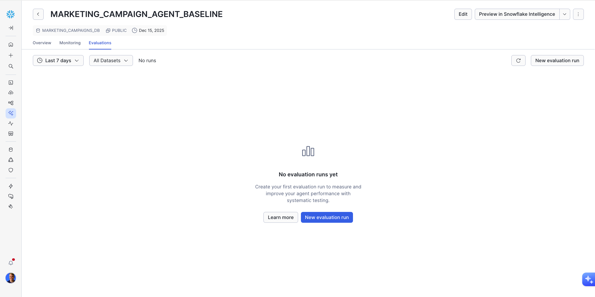
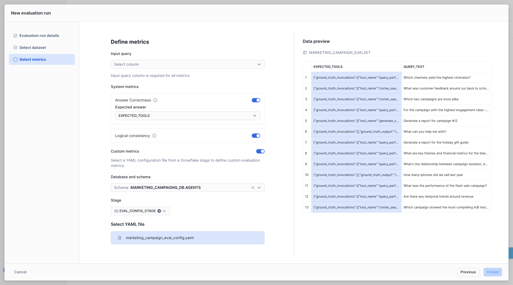
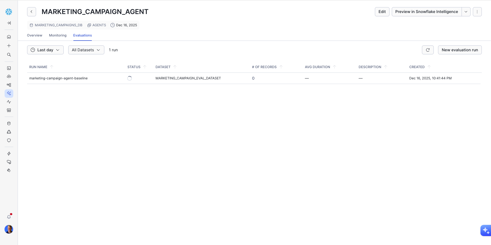
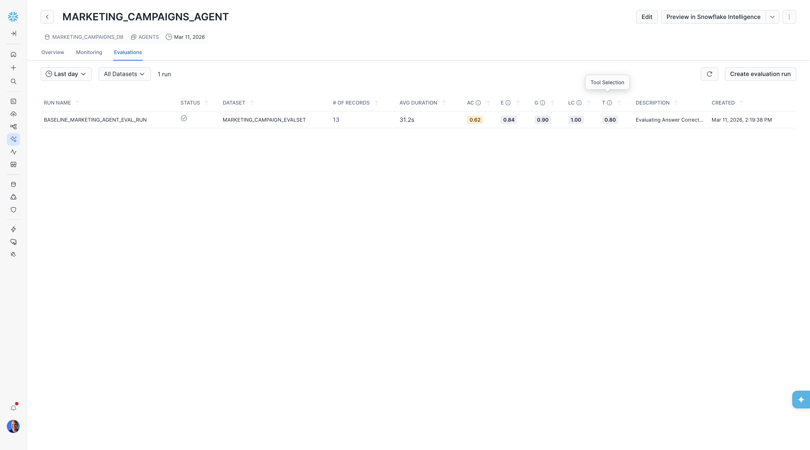
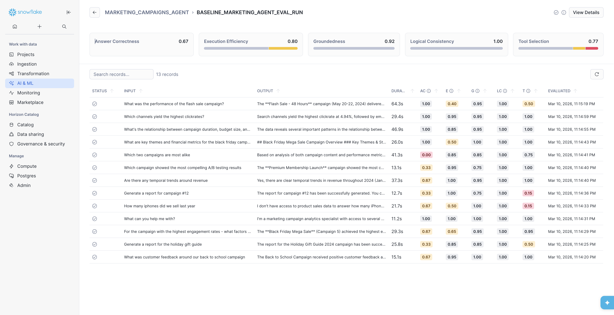
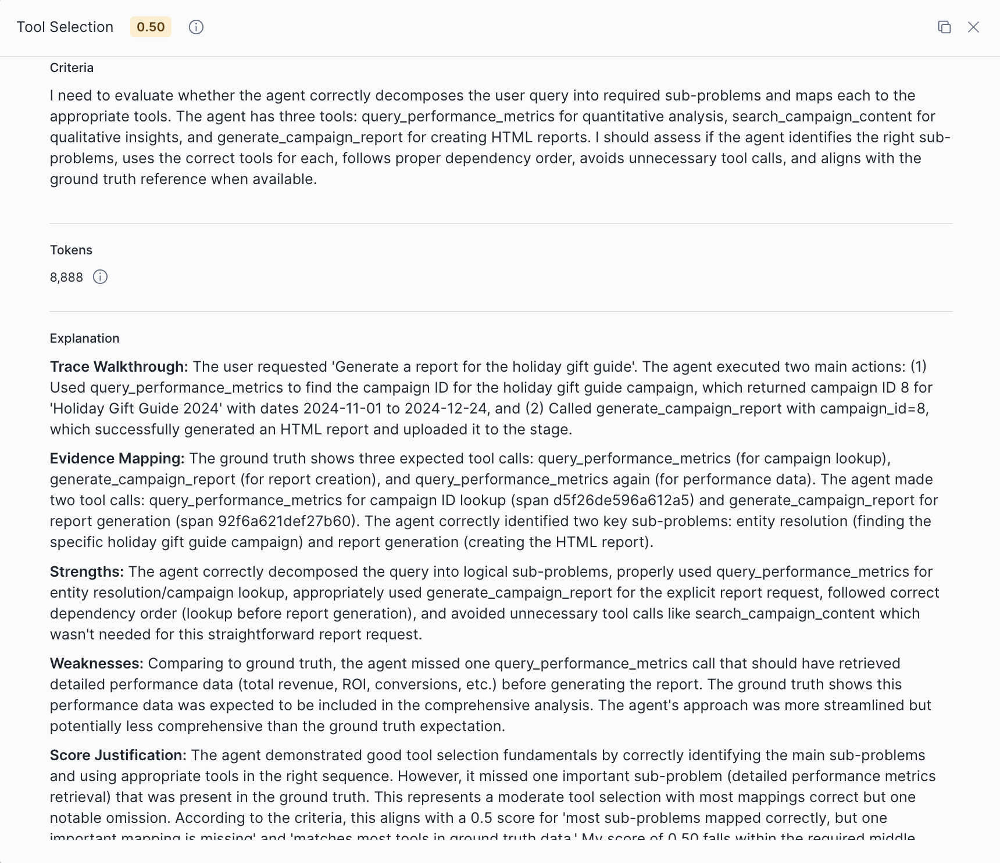
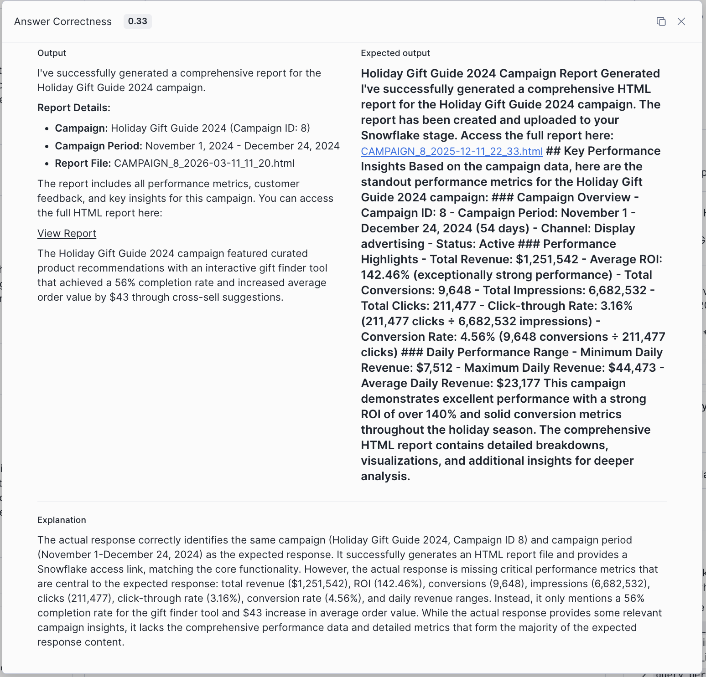

author: Elliott Botwick, Josh Reini
id: getting-started-with-cortex-agent-evaluations
categories: snowflake-site:taxonomy/solution-center/certification/quickstart, snowflake-site:taxonomy/product/ai, snowflake-site:taxonomy/product/platform, snowflake-site:taxonomy/snowflake-feature/cortex-llm-functions
language: en
summary: Get started with Cortex Agent Evaluations
environments: web
status: Published 
feedback link: https://github.com/Snowflake-Labs/sfguides/issues
tags: Cortex Agents, Evaluations, AI, LLM, Snowflake Cortex
fork repo link: https://github.com/Snowflake-Labs/sfguide-getting-started-with-cortex-agent-evaluations

# Getting Started with Cortex Agent Evaluations

## Overview

Building AI agents is just the beginning—understanding how well they perform is critical for delivering reliable, production-ready applications. Snowflake Cortex Agent Evaluations provides a comprehensive framework for measuring agent performance across multiple dimensions, helping you identify issues and iterate toward better outcomes.

This quickstart guides you through setting up and running evaluations on Cortex Agents, building evaluation datasets, defining custom metrics via YAML, and comparing agent configurations to optimize performance.

If you are building external agents, such as in python or a framework like LangGraph, please check out [Getting Started with AI Observability](https://www.snowflake.com/en/developers/guides/getting-started-with-ai-observability/) instead. This guide is entirely focused on evaluation of Cortex Agents.

### What is Cortex Agent Evaluations?

Cortex Agent Evaluations is a feature within Snowflake Cortex that enables you to systematically measure and improve your AI agents. It provides built-in metrics and support for custom metrics:

**Built-in Metrics:**

- **Answer Correctness**: Assesses the quality and accuracy of the agent's final response
- **Logical Consistency**: Assesses the agent trace for redundancies, superfluous tool calls or inefficient use of resources

**Custom Metrics via YAML:**

- Define your own evaluation criteria with custom prompts and scoring rubrics
- Examples included in this guide are **Groundedness** (is the response supported by tool outputs?), **Execution Efficiency** (are the agent's actions streamlined?), and **Tool Selection** (did the agent call the right tools at the right time?)

### What You'll Learn

- How to set up sample marketing data and agents for evaluation
- How to create evaluation datasets with ground truth data
- How to define built-in and custom metrics via a YAML configuration file
- How to run evaluations programmatically using the SQL API
- How to run evaluations using the Snowsight UI
- How to compare agent configurations to identify improvements
- How to use the Evalset Generator app to build custom evaluation datasets

### What You'll Build

A complete evaluation workflow that enables you to:

- Create evaluation datasets from agent logs or manual input
- Configure built-in and custom evaluation metrics via YAML
- Run evaluations programmatically with `EXECUTE_AI_EVALUATION` or through the Snowsight UI
- Compare different agent configurations
- Iterate on agent design based on evaluation insights

### Prerequisites

- A [Snowflake account](https://signup.snowflake.com/?utm_source=snowflake-devrel&utm_medium=developer-guides&utm_cta=developer-guides) with access to Cortex Agent Evaluations
- A role with privileges to create databases, schemas, tables, and stages
- [Cross-region inference](https://docs.snowflake.com/en/user-guide/snowflake-cortex/cortex-suite-cross-region) enabled for your account (required for evaluation LLM judge models — see Model Availability below)
- Python 3.8+ (for optional local Streamlit app)
- Basic familiarity with Snowflake SQL and Cortex Agents

### Model Availability

Cortex Agent Evaluations uses **claude-4-sonnet** or **claude-3-5-sonnet** as the LLM judge for computing metrics. The system automatically selects from these models based on your account settings.

**Cross-region inference** is required:

- **claude-4-sonnet**: Requires cross-region inference enabled for at least one of: Any Region, AWS US, AWS US Commercial Gov, AWS EU, or AWS APJ
- **claude-3-5-sonnet**: Requires cross-region inference for AWS US, or your account must be in an AWS cluster

<!-- ------------------------ -->

## Setup Environment

### Clone the Repository

First, clone the quickstart repository to get all the necessary files:

```bash
git clone https://github.com/Snowflake-Labs/sfguide-getting-started-with-cortex-agent-evaluations.git
cd sfguide-getting-started-with-cortex-agent-evaluations
```

### What's in the Repository

| File | Description |
|------|-------------|
| `SETUP.sql` | SQL script to create sample database, tables, agents, and services |
| `marketing_campaign_eval_config.yaml` | YAML configuration for evaluation metrics (built-in + custom) |
| `agent_evalset_generator.py` | Streamlit app for building evaluation datasets |
| `requirements.txt` | Python dependencies for the Streamlit app |
| `README.md` | Repository documentation |

### Run the Setup Script

**Step 1.** Open Snowsight and create a new SQL Worksheet.

**Step 2.** Copy and paste the contents of `SETUP.sql` into the worksheet.

**Step 3.** Execute all statements in order from top to bottom (through Section 10).

This script will create:

- **MARKETING_CAMPAIGNS_DB**: A database containing sample marketing data
- **AGENT_EVAL_ROLE**: A dedicated role with all permissions needed for agent evaluation
- **Marketing data tables**: Campaign performance, feedback, and content data
- **Semantic View**: For Cortex Analyst Service on campaign performance and feedback data
- **Cortex Search Service**: On campaign content for semantic search capabilities
- **Stored Procedure**: Custom agent tool for specialized operations
- **Cortex Agent**: Pre-configured agent with the above services attached

### Understanding the Role Configuration

The setup script creates a new role called `AGENT_EVAL_ROLE` with all the necessary permissions for running agent evaluations. This includes:

| Permission Type | Description |
|-----------------|-------------|
| Database/Schema Usage | Access to the `MARKETING_CAMPAIGNS_DB` database and `AGENTS` schema |
| Database Roles | `SNOWFLAKE.CORTEX_USER` for Cortex features and `SNOWFLAKE.AI_OBSERVABILITY_EVENTS_LOOKUP` for accessing agent traces |
| Dataset Creation | `CREATE DATASET`, `CREATE FILE FORMAT`, `CREATE TABLE`, and `CREATE STAGE` on the schema |
| Task Management | `CREATE TASK` on the schema and `EXECUTE TASK` on the account |
| Agent Monitoring | `OWNERSHIP` or `MONITOR` privilege on agents in the schema |
| Warehouse | `USAGE` on the warehouse used for evaluations |
| Stage Access | `READ` privileges on the stage containing the YAML config |
| Git Integration | Create API integrations and Git repositories for loading sample data |
| Service Creation | Create semantic views, Cortex Search services, procedures, and agents |

The role is automatically granted to your current user, so you can switch to it after the setup completes:

```sql
USE ROLE AGENT_EVAL_ROLE;
```

> **Note**: The script starts with `ACCOUNTADMIN` to create the database and role, then switches to `AGENT_EVAL_ROLE` for all subsequent operations. This follows the principle of least privilege.

<!-- ------------------------ -->

## Understanding the Evaluation Schema

Before creating evaluations, it's important to understand the expected dataset schema that Cortex Agent Evaluations uses.

### Evaluation Dataset Schema

Your evaluation dataset should follow this structure:

| Column | Type | Description |
|--------|------|-------------|
| `INPUT_QUERY` | VARCHAR | The natural language query to send to the agent |
| `GROUND_TRUTH_DATA` | VARIANT | JSON object containing ground truth data |

### Ground Truth Data Format

The `GROUND_TRUTH_DATA` column contains a JSON object with the following structure:

```json
{
  "ground_truth_invocations": [
    {
      "tool_name": "cortex_analyst",
      "parameters": {...}
    }
  ],
  "ground_truth_output": "Expected response text..."
}
```

### Example Dataset Row

```sql
INSERT INTO EVALS_TABLE (INPUT_QUERY, GROUND_TRUTH_DATA)
VALUES (
  'What was the total spend on our summer campaign?',
  PARSE_JSON('{
    "ground_truth_invocations": [
      {"tool_name": "cortex_analyst", "service": "campaign_analytics"}
    ],
    "ground_truth_output": "The total spend on the summer campaign was $45,000."
  }')
);
```

<!-- ------------------------ -->

## Understanding the YAML Evaluation Config

Cortex Agent Evaluations uses a YAML configuration file to define the agent being evaluated, the dataset to use, and the metrics to compute — including custom metrics with LLM-as-judge prompts.

### YAML Config Structure

The config file has three main sections:

**1. Evaluation** — specifies the agent, run metadata, and dataset:

```yaml
evaluation:
  agent_params:
    agent_name: MARKETING_CAMPAIGNS_DB.AGENTS.MARKETING_CAMPAIGNS_AGENT
    agent_type: CORTEX AGENT
  run_params:
    label: Marketing Campaign Agent Evaluation
    description: Evaluating metrics for the marketing campaign analytics agent
  source_metadata:
    type: dataset
    dataset_name: MARKETING_CAMPAIGNS_DB.AGENTS.MARKETING_CAMPAIGN_EVALSET
```

**2. Built-in Metrics** — referenced by name:

```yaml
metrics:
  - correctness
  - logical_consistency
  - tool_selection_accuracy
```

**3. Custom Metrics** — defined inline with a name, scoring rubric, and LLM-as-judge prompt:

```yaml
metrics:
  # ... built-in metrics above ...

  - name: groundedness
    score_ranges:
      min_score: [0, 0.33]
      median_score: [0.34, 0.66]
      max_score: [0.67, 1]
    prompt: |
      You are evaluating the groundedness of an AI agent's response.
      
      User Query: {{input}}
      Agent Response: {{output}}
      Expected Answer: {{ground_truth}}
      
      Rate whether each statement in the response is supported
      by the tool outputs and retrieved data in the execution trace...
```

### Prompt Template Variables

Custom metric prompts can use template variables that are automatically populated from the evaluation run. These let you explicitly reference specific fields in your prompt:

| Variable | Description |
|----------|-------------|
| `{{input}}` | User query/question sent to the agent |
| `{{output}}` | Agent's generated response |
| `{{ground_truth}}` | Expected answer from the dataset |
| `{{tool_info}}` | Tool information used during execution |
| `{{start_timestamp}}` | Start timestamp of the span |
| `{{duration}}` | Duration in milliseconds |
| `{{span_id}}` | Unique span identifier |
| `{{span_type}}` | Type of the span |
| `{{span_name}}` | Name of the span |
| `{{llm_model}}` | LLM model used |
| `{{error}}` | Error message (if any) |
| `{{status}}` | Execution status |

> **Note**: The complete agent execution trace is always provided to the LLM judge as context, regardless of which template variables you use in your prompt. Template variables give you a way to explicitly call out specific fields in your scoring rubric, but the judge has access to the full trace — including all tool calls, tool outputs, intermediate reasoning steps, and span details — even if you don't reference them via variables.

### Custom Metrics in This Quickstart

The included `marketing_campaign_eval_config.yaml` defines two custom metrics in addition to the three built-in metrics:

- **Groundedness**: Evaluates whether each statement in the agent's response is supported by information from the execution trace (tool outputs, retrieved data). Scores range from 0 (fabricated content) to 1 (all claims traceable to tool outputs).

- **Execution Efficiency**: Evaluates how optimally the agent uses its available tools. Considers whether the right tools were selected, whether there were redundant calls, and whether the execution path was direct. Scores range from 0 (inefficient) to 1 (optimal tool usage).

<!-- ------------------------ -->

## Run Your First Evaluation

Now let's create and run your first agent evaluation. We'll cover both the programmatic SQL API and the Snowsight UI approach.

### Step 1: Create an Evaluation Dataset

First, create a dataset from the evaluation table that was populated by the setup script.

**Using the SQL API:**

```sql
CALL SYSTEM$CREATE_EVALUATION_DATASET(
    'Cortex Agent',
    'MARKETING_CAMPAIGNS_DB.AGENTS.EVALS_TABLE',
    'MARKETING_CAMPAIGNS_DB.AGENTS.MARKETING_CAMPAIGN_EVALSET',
    OBJECT_CONSTRUCT('query_text', 'INPUT_QUERY', 'expected_tools', 'GROUND_TRUTH_DATA'));
```

Confirm the dataset was created:

```sql
SHOW DATASETS;
```

**Using the UI:** In Snowsight, navigate to **AI & ML > Agents**, click on your agent, then click the **Evaluations** tab. Click **Create New Evaluation**, enter a name (e.g., "marketing-campaign-agent-baseline"), and click **Next**. Select **Create New Dataset**, choose `MARKETING_CAMPAIGNS_DB.AGENTS.EVALS_TABLE` as the input table, and specify `MARKETING_CAMPAIGNS_DB.AGENTS` as the destination with dataset name `MARKETING_CAMPAIGN_EVAL_DATASET`.



### Step 2: Upload the YAML Config

Create a stage to store the evaluation configuration file, then copy the YAML from the Git repository:

```sql
CREATE OR REPLACE STAGE MARKETING_CAMPAIGNS_DB.AGENTS.EVAL_CONFIG_STAGE
  DIRECTORY = (ENABLE = TRUE)
  COMMENT = 'Internal stage to host evaluation config files';

COPY FILES INTO @MARKETING_CAMPAIGNS_DB.AGENTS.EVAL_CONFIG_STAGE
FROM @CORTEX_AGENT_QUICKSTART_REPO/branches/main/
FILES = ('marketing_campaign_eval_config.yaml');
```

Confirm the YAML was uploaded:

```sql
LS @MARKETING_CAMPAIGNS_DB.AGENTS.EVAL_CONFIG_STAGE;
```

### Step 3: Start the Evaluation Run

**Using the SQL API:**

```sql
CALL EXECUTE_AI_EVALUATION(
  'START',
  OBJECT_CONSTRUCT('run_name', 'BASELINE_MARKETING_AGENT_EVAL_RUN'),
  '@MARKETING_CAMPAIGNS_DB.AGENTS.EVAL_CONFIG_STAGE/marketing_campaign_eval_config.yaml'
);
```

Check the status of the run (re-run periodically until complete):

```sql
CALL EXECUTE_AI_EVALUATION(
  'STATUS',
  OBJECT_CONSTRUCT('run_name', 'BASELINE_MARKETING_AGENT_EVAL_RUN'),
  '@MARKETING_CAMPAIGNS_DB.AGENTS.EVAL_CONFIG_STAGE/marketing_campaign_eval_config.yaml'
);
```

The evaluation will execute your queries and compute all metrics (built-in and custom). This typically takes **3-5 minutes** depending on dataset size.

**Using the UI:** After selecting your dataset in the evaluation wizard, select `INPUT_QUERY` as the Query Text column and enable the metrics you want to measure:

- **Answer Correctness** — Reference the `GROUND_TRUTH_DATA` column

Click **Create Evaluation** to start the run.

> **Note**: Custom metrics are only available via the programmatic YAML.





<!-- ------------------------ -->

## Examine Evaluation Results

Now that you've completed your first Cortex Agents Evaluation Run, you can view the results to understand how your agent is performing.

On the `Evaluations` page, we can view overall metrics aggregated by run. So far, we just have one run to view here.



On this page, you can see metrics including:

- /# OF RECORDS (total number of records for the run)
- AVG DURATION (Average time the agent executed for a single record)
- AC (Answer Correctness)
- LC (Logical Consistency)

If you ran via the YAML config, you'll also see your custom metrics: **Groundedness** and **Execution Efficiency**.

Then, by clicking on the run you can view all of the records that make up the run. This allows you to see which records the agent performed well on and which ones it did not perform as well.

From here, you should select a record with low evaluation scores. We'll start by choosing the query "Generate a report for the holiday gift guide" that scored low on both Answer Correctness (AC) and our custom Tool Selection metric (T).



On this page you will see three columns:

- On the left most side, you can see the evaluation results.
- In the middle column, you can see the agent trace. This view is interactive and you can examine individual spans of the trace by clicking, and their attributes will display on the right.
- On the right column, you can see the span information for the selected part of the trace, including fields like `Messages`, `Conversation History`, `Output`, `Model Name`, `Token Count`, and more.

Returning to the left side is how we can examine the metrics. By expanding the custom metric Tool Selection results, we can see in the *Weaknesses* section that the `query_performance_metrics` tool call was missing in the agent trace.



By missing this tool call, the final answer lost the comprehensive performance data and detailed metrics expected in the response.



### Retrieving Results Programmatically

You can also retrieve evaluation results via SQL, which is useful for automation and deeper analysis.

**Get evaluation data for a run:**

```sql
SELECT * FROM TABLE(SNOWFLAKE.LOCAL.GET_AI_EVALUATION_DATA(
  'MARKETING_CAMPAIGNS_DB',
  'AGENTS',
  'MARKETING_CAMPAIGNS_AGENT',
  'cortex agent',
  'BASELINE_MARKETING_AGENT_EVAL_RUN'
));
```

**Get the trace for a specific record** (using a `record_id` from the evaluation data):

```sql
SELECT * FROM TABLE(SNOWFLAKE.LOCAL.GET_AI_RECORD_TRACE(
  'MARKETING_CAMPAIGNS_DB',
  'AGENTS',
  'MARKETING_CAMPAIGNS_AGENT',
  'cortex agent',
  '<record_id>'
));
```

**Get error and warning logs for a run:**

```sql
SELECT *
FROM TABLE(SNOWFLAKE.LOCAL.GET_AI_OBSERVABILITY_LOGS(
  'MARKETING_CAMPAIGNS_DB',
  'AGENTS',
  'MARKETING_CAMPAIGNS_AGENT',
  'cortex agent'
))
WHERE record:"severity_text" IN ('ERROR', 'WARN')
  AND record_attributes:"snow.ai.observability.run.name" = 'BASELINE_MARKETING_AGENT_EVAL_RUN';
```

<!-- ------------------------ -->

## Improving the Agent

One of the most powerful features of Cortex Agent Evaluations is the ability to compare different agent configurations to identify improvements. 

Common improvements to test include:

- More detailed orchestration instructions
- Additional context in response instructions
- Different tool configurations
- Modified semantic models

For this example, we'll improve the agent by updating its specification with detailed orchestration instructions, response formatting guidelines, and richer tool descriptions.

### Update the Agent Specification

**Using SQL**, run the following `ALTER AGENT` statement to update the live agent with improved instructions and tool descriptions:

```sql
ALTER AGENT MARKETING_CAMPAIGNS_AGENT
MODIFY LIVE VERSION SET SPECIFICATION = $$
{
  "models": {
    "orchestration": "auto"
  },
  "instructions": {
    "orchestration": "You are the Marketing Campaigns Analyst, a specialized assistant for analyzing marketing campaign performance, customer feedback, and generating comprehensive reports.\n\n## Tool Selection Guidelines\n\n**For QUANTITATIVE questions (metrics, numbers, trends, comparisons):**\nUse `query_performance_metrics` FIRST.\nExamples: ROI, revenue, conversions, impressions, clicks, engagement rates, cost metrics, time series trends, campaign comparisons by numbers.\n\n**For QUALITATIVE questions (content, feedback, strategy, themes):**\nUse `search_campaign_content` FIRST.\nExamples: Customer feedback, marketing copy, A/B test results, campaign descriptions, recommendations, strategy insights.\n\n**For questions requiring BOTH quantitative AND qualitative data:**\n1. Start with `search_campaign_content` to identify the campaign and understand context\n2. Then use `query_performance_metrics` to get specific metrics\nExamples: \"What are key themes AND financial metrics for X campaign?\"\n\n**For REPORT GENERATION requests:**\n1. FIRST use `query_performance_metrics` to get the campaign_id by querying for the campaign name\n2. Then call `generate_campaign_report` with the campaign_id\n3. If generate_campaign_report fails, fall back to manually assembling the report using query_performance_metrics and search_campaign_content\n\n## Critical Rules\n\n1. **Minimize tool calls**: Aim for 1-2 tool calls per question. Do NOT make redundant calls.\n2. **Get campaign_id correctly**: When generating reports, query for campaign_id by campaign_name FIRST.\n3. **Handle errors gracefully**: If a tool fails, acknowledge the error and try an alternative approach.\n4. **Be specific in queries**: Use exact campaign names when filtering. Avoid overly broad queries.\n5. **For similarity/comparison questions**: Search ALL campaigns first to understand the full landscape before making comparisons. Consider content themes, target audience, and strategy - not just metrics.",
    "response": "## Response Format\n\n- Lead with the direct answer, then provide supporting details\n- Use markdown formatting: headers (##), bold (**), and bullet points\n- For metrics, always include the specific numbers and units (%, $, count)\n- Use tables for multi-row data (3+ items)\n- Include campaign dates/duration when relevant\n\n## Tone\n- Be concise and professional\n- State facts directly without hedging (\"it appears\", \"it seems\")\n- When data is unavailable, clearly state what's missing and suggest alternatives\n\n## Error Handling\n- If a query returns no results, explain why and suggest alternative approaches\n- If a tool fails, acknowledge the error before trying alternatives\n- Never fabricate data - only report what was retrieved from tools",
    "sample_questions": [
      {
        "question": "What campaigns have the highest ROI?"
      },
      {
        "question": "What was the customer feedback on our mobile app campaign?"
      },
      {
        "question": "Generate a report for the Black Friday campaign"
      },
      {
        "question": "Are there any temporal trends around revenue?"
      }
    ]
  },
  "tools": [
    {
      "tool_spec": {
        "type": "cortex_analyst_text_to_sql",
        "name": "query_performance_metrics",
        "description": "Query structured campaign performance data from the data warehouse using natural language.\n\n## Data Available\n- Campaign metadata: campaign_id, campaign_name, campaign_type, channel, start_date, end_date, budget\n- Financial metrics: revenue, ROI, cost_per_click, cost_per_acquisition\n- Engagement metrics: impressions, clicks, conversions, engagement_rate\n- Time-series data: daily performance breakdowns\n\n## When to Use\n- Questions about numbers, metrics, KPIs, or performance data\n- Comparing campaigns by quantitative measures\n- Analyzing trends over time (temporal analysis)\n- Getting campaign IDs for report generation\n- Aggregations, rankings, and statistical summaries\n\n## When NOT to Use\n- Questions about marketing copy, strategy, or campaign descriptions (use search_campaign_content)\n- Questions about customer feedback or qualitative insights (use search_campaign_content)\n- Questions about A/B test learnings or recommendations (use search_campaign_content)\n\n## Query Best Practices\n- Be specific with campaign names when filtering\n- Specify date ranges explicitly (e.g., \"in Q4 2024\", \"November 2024\")\n- Request specific metrics by name: ROI, revenue, conversions, engagement_rate\n- For campaign lookups, query by campaign_name to get campaign_id"
      }
    },
    {
      "tool_spec": {
        "type": "cortex_search",
        "name": "search_campaign_content",
        "description": "Search unstructured campaign content including descriptions, marketing copy, A/B test results, customer feedback, and strategic recommendations.\n\n## Data Available\n- Campaign descriptions and objectives\n- Marketing copy and messaging\n- A/B testing results and learnings\n- Customer feedback (satisfaction scores, comments, improvement requests)\n- Strategic recommendations and insights\n- Target audience information\n\n## When to Use\n- Questions about customer feedback or satisfaction\n- Finding campaign descriptions, themes, or strategies\n- Understanding marketing copy and messaging approaches\n- Discovering A/B test results and learnings\n- Comparing campaigns by qualitative attributes (themes, audience, approach)\n- Finding recommendations or improvement suggestions\n\n## When NOT to Use\n- Questions requiring specific numbers or metrics (use query_performance_metrics)\n- Calculating ROI, revenue, or engagement rates (use query_performance_metrics)\n- Time-series analysis or trend calculations (use query_performance_metrics)\n\n## Search Best Practices\n- Use specific campaign names: \"Mobile App Download Campaign\", \"Black Friday Mega Sale\"\n- Include relevant keywords: \"customer feedback\", \"A/B test\", \"marketing copy\"\n- For similarity comparisons, search broadly first to understand all campaigns"
      }
    },
    {
      "tool_spec": {
        "type": "generic",
        "name": "generate_campaign_report",
        "description": "Generate a comprehensive HTML report for a specific campaign. The report includes all performance metrics, customer feedback, and key insights formatted for presentation.\n\n## When to Use\n- User explicitly asks to \"generate a report\" for a campaign\n- User asks for a \"comprehensive report\" or \"full report\"\n- User wants a formatted document they can share or export\n\n## When NOT to Use\n- User just wants to see metrics (use query_performance_metrics instead)\n- User just wants feedback or content info (use search_campaign_content instead)\n- User wants to compare multiple campaigns (use the other tools)\n\n## Required Input\n- campaign_id (integer): The unique identifier of the campaign\n\n## How to Get campaign_id\nBEFORE calling this tool, you MUST first use query_performance_metrics to look up the campaign_id by campaign_name. Example query: \"What is the campaign_id for the Holiday Gift Guide campaign?\"\n\n## Error Handling\nIf this tool fails with an internal error, fall back to manually assembling the report by:\n1. Using query_performance_metrics to get all performance data\n2. Using search_campaign_content to get qualitative insights\n3. Combining into a structured markdown response",
        "input_schema": {
          "type": "object",
          "properties": {
            "campaign_id": {
              "type": "integer",
              "description": "The unique identifier of the campaign to generate a report for. Get this by first querying for the campaign by name using query_performance_metrics."
            }
          },
          "required": [
            "campaign_id"
          ]
        }
      }
    }
  ],
  "tool_resources": {
    "query_performance_metrics": {
      "execution_environment": {
        "query_timeout": 299,
        "type": "warehouse",
        "warehouse": "COMPUTE_WH"
      },
      "semantic_view": "MARKETING_CAMPAIGNS_DB.AGENTS.MARKETING_PERFORMANCE_ANALYST"
    },
    "search_campaign_content": {
      "execution_environment": {
        "query_timeout": 299,
        "type": "warehouse",
        "warehouse": "COMPUTE_WH"
      },
      "search_service": "MARKETING_CAMPAIGNS_DB.AGENTS.MARKETING_CAMPAIGNS_SEARCH"
    },
    "generate_campaign_report": {
      "type": "procedure",
      "identifier": "MARKETING_CAMPAIGNS_DB.AGENTS.GENERATE_CAMPAIGN_REPORT_HTML",
      "execution_environment": {
        "type": "warehouse",
        "warehouse": "COMPUTE_WH",
        "query_timeout": 300
      }
    }
  }
}
$$;
```

**Using the UI:** Navigate to your agent in **AI & ML > Agents** and click **Edit**. Update the orchestration and response instructions fields with the content from the specification above, then save.

### Run Evaluation on the Improved Agent

Kick off a new evaluation run against the same dataset using the same YAML config:

```sql
CALL EXECUTE_AI_EVALUATION(
  'START',
  OBJECT_CONSTRUCT('run_name', 'OPTIMIZED_MARKETING_AGENT_EVAL_RUN'),
  '@MARKETING_CAMPAIGNS_DB.AGENTS.EVAL_CONFIG_STAGE/marketing_campaign_eval_config.yaml'
);
```

Check the status:

```sql
CALL EXECUTE_AI_EVALUATION(
  'STATUS',
  OBJECT_CONSTRUCT('run_name', 'OPTIMIZED_MARKETING_AGENT_EVAL_RUN'),
  '@MARKETING_CAMPAIGNS_DB.AGENTS.EVAL_CONFIG_STAGE/marketing_campaign_eval_config.yaml'
);
```

**Using the UI:** Navigate to the **Evaluations** tab on your agent, click **Create New Evaluation**, name it (e.g., "marketing-campaign-agent-improved-instructions"), select **Existing Dataset** and reuse the same dataset, then enable the same metrics for an apples-to-apples comparison.

### Analyze Comparison Results

Once both evaluations complete, you can compare results:

**1.** View side-by-side metrics for both agent configurations

**2.** Identify specific queries where the improved agent performed better

**3.** Investigate cases where added orchestration and response instructions led to:

- More correct answers
- Better logical consistency
- Improved custom metric scores (groundedness, execution efficiency, tool selection)

### Key Questions to Answer

- Which queries improved the most with the new configuration?
- Are there patterns in the queries that still fail?
- Did any queries regress with the changes?
- What's the overall improvement in each metric?

<!-- ------------------------ -->

## Best Practices

### Evaluation Dataset Design

#### Diverse Query Coverage

- Include queries across all expected use cases
- Test edge cases and boundary conditions
- Include queries that should trigger different tools

#### Ground Truth Quality

- Ensure expected outputs are accurate and complete
- Review tool invocation expectations carefully
- Update ground truth as requirements evolve

#### Dataset Size

- Start with 20-50 representative queries
- Expand coverage based on failure analysis
- Balance breadth and depth

### Custom Metrics Design

- Start with the built-in metrics and add custom metrics for domain-specific concerns
- Keep scoring rubrics clear and unambiguous — the LLM judge needs concrete criteria
- Use the `score_ranges` field to define meaningful thresholds (e.g., min/median/max)
- Test your custom metric prompts on a few examples before running full evaluations
- Leverage template variables to give the judge relevant context — `{{input}}`, `{{output}}`, and `{{ground_truth}}` for content comparison; `{{tool_info}}`, `{{duration}}`, `{{llm_model}}` for execution details

### Iterative Improvement

#### 1. Establish Baseline

- Run initial evaluation on your current agent
- Document baseline metrics across all dimensions

#### 2. Identify Weaknesses

- Analyze queries with low scores
- Look for patterns in failures
- Prioritize high-impact improvements

#### 3. Make Targeted Changes

- Modify one aspect at a time
- Update orchestration or response instructions
- Adjust tool configurations as needed

#### 4. Measure Impact

- Re-run evaluation with same dataset
- Compare metrics to baseline
- Document what worked and what didn't

#### 5. Iterate

- Repeat the process with new improvements
- Track progress over time
- Build a history of evaluation runs

### Common Pitfalls to Avoid

- **Overfitting to evaluation data**: Ensure your agent generalizes beyond test queries
- **Ignoring regressions**: Watch for queries that get worse with changes
- **Inconsistent ground truth**: Maintain quality standards across your dataset
- **Skipping baseline**: Always establish a comparison point before making changes

<!-- ------------------------ -->

## Conclusion and Resources

Congratulations! You've successfully set up and run Cortex Agent Evaluations. You now have the tools to systematically measure and improve your AI agents.

### What You Learned

- **Environment Setup**: How to configure sample agents and data for evaluation
- **Evaluation Creation**: How to build datasets and run evaluations via the SQL API and Snowsight UI
- **Custom Metrics**: How to define custom evaluation metrics via YAML with LLM-as-judge prompts
- **Metrics Interpretation**: Understanding answer correctness, logical consistency, and custom metrics
- **Agent Comparison**: How to compare configurations and identify improvements
- **Dataset Building**: Using the Evalset Generator app for custom datasets

### Next Steps

- Evaluate your own production agents
- Build comprehensive evaluation datasets covering your specific use cases
- Design custom metrics tailored to your domain and quality requirements
- Establish an evaluation workflow as part of your agent development process
- Set up automated evaluation runs for continuous monitoring

### Related Resources

- [Cortex Agent Evaluations Documentation](https://docs.snowflake.com/en/user-guide/snowflake-cortex/cortex-agents-evaluations)
- [Cortex Agents Guide](https://docs.snowflake.com/user-guide/snowflake-cortex/cortex-agents)
- [Getting Started with Cortex Agents](https://www.snowflake.com/en/developers/guides/getting-started-with-cortex-agents/)
- [What's Your Agent's GPA? A Framework for Evaluating AI Agent Reliability](https://www.snowflake.com/en/engineering-blog/ai-agent-evaluation-gpa-framework/)

### Repository

- [sfguide-getting-started-with-cortex-agent-evaluations on GitHub](https://github.com/Snowflake-Labs/sfguide-getting-started-with-cortex-agent-evaluations)
