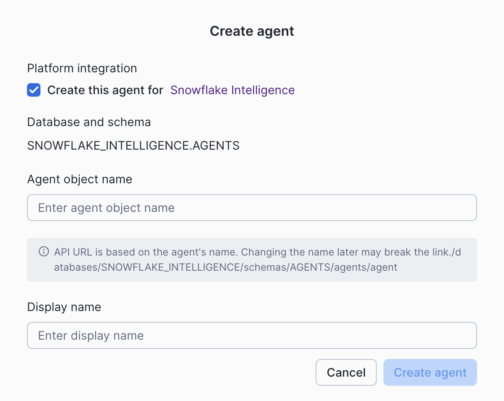
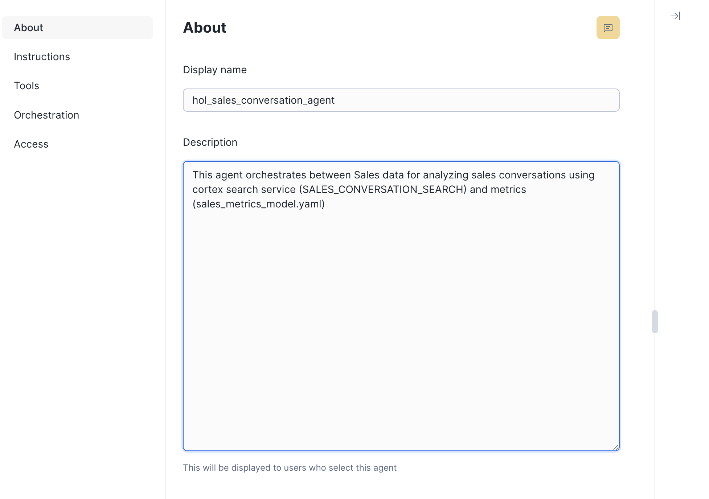
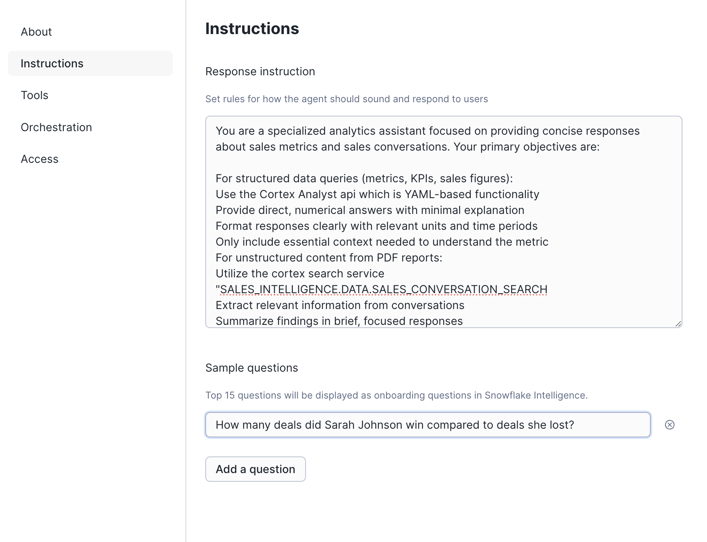
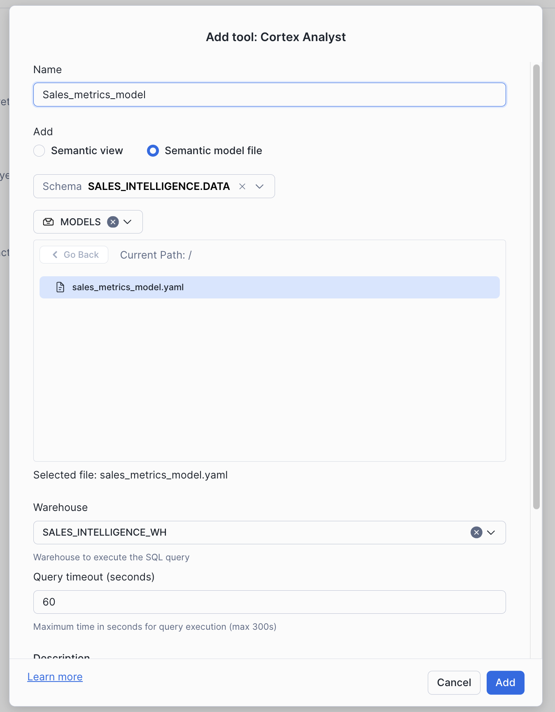
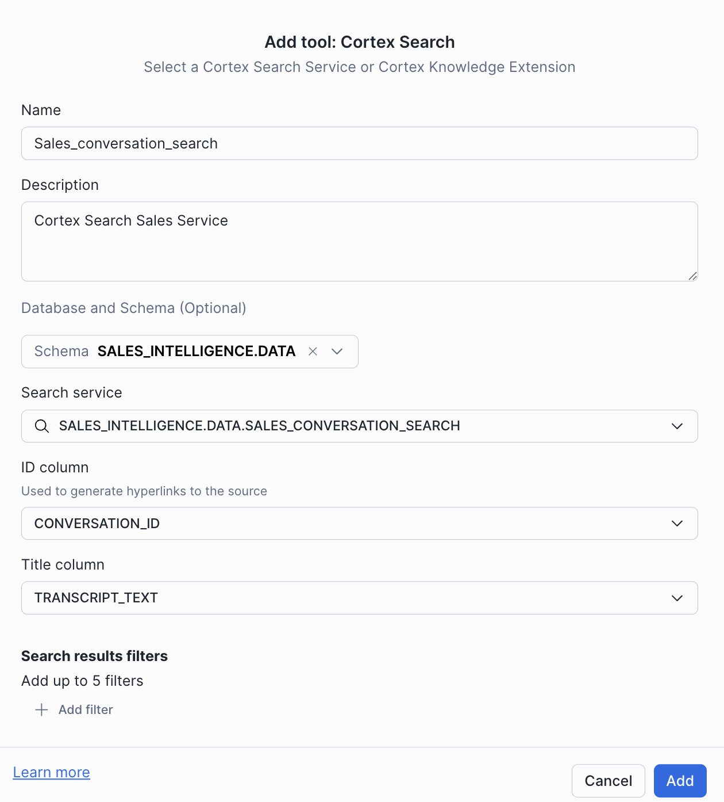
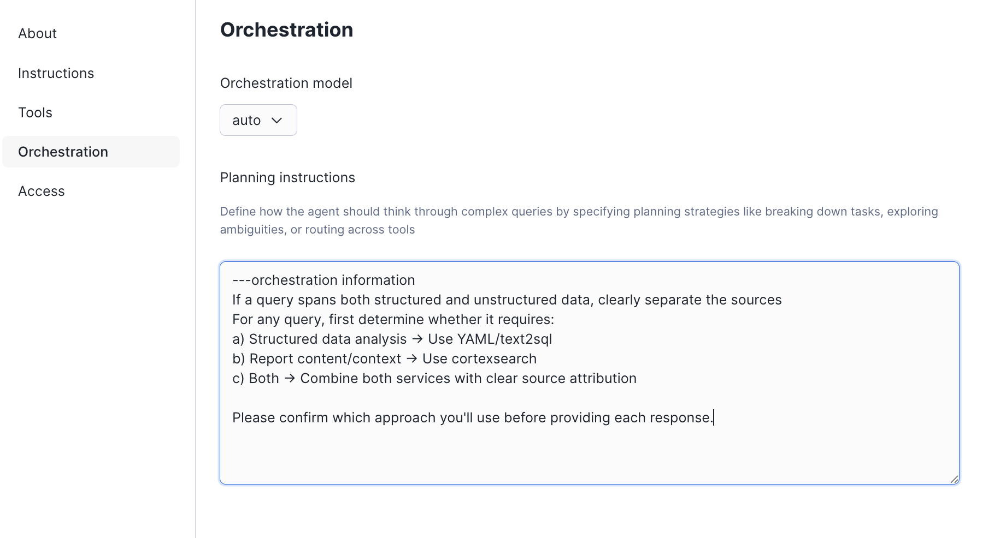
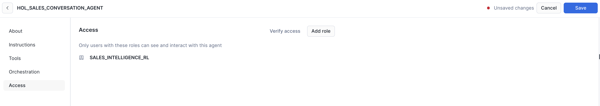
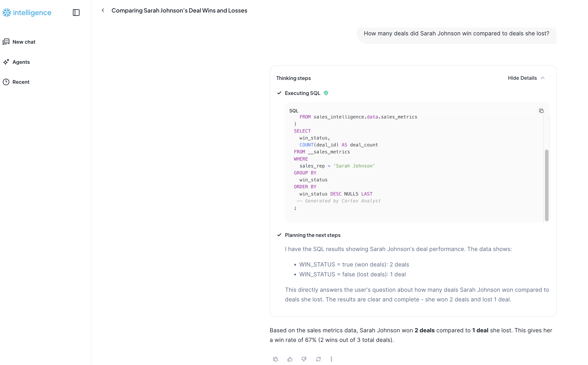
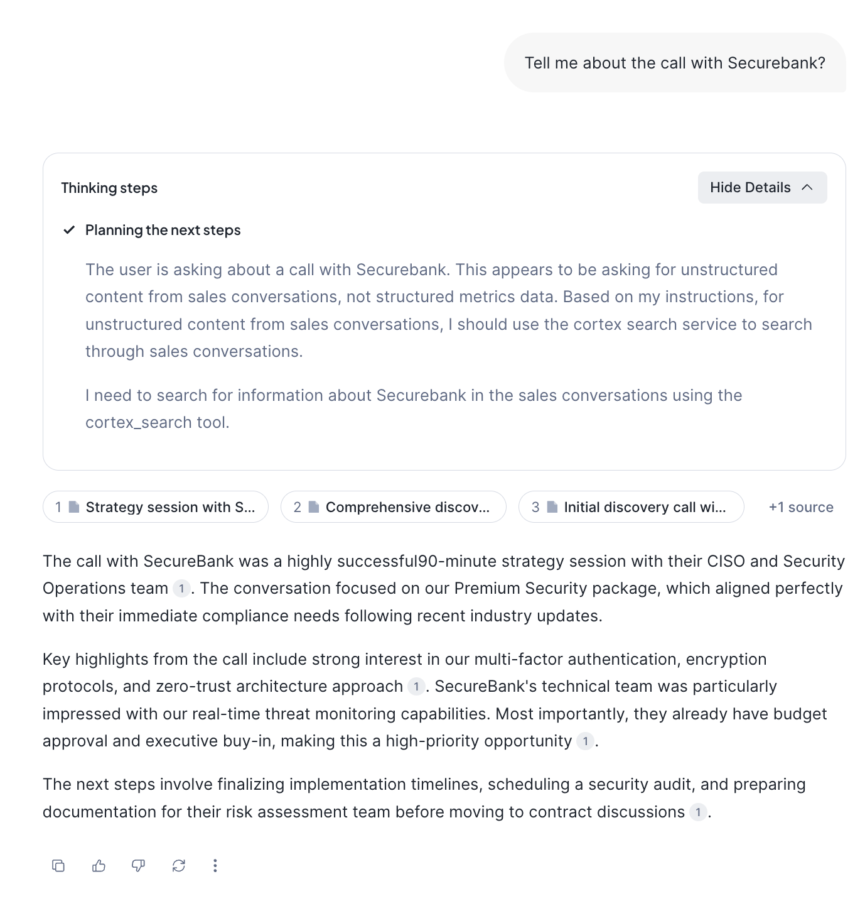

author: James Cha-Earley, Mubashir Masood, Daniel Silva
id: getting-started-with-cortex-agents
categories: snowflake-site:taxonomy/solution-center/certification/quickstart, snowflake-site:taxonomy/product/ai, snowflake-site:taxonomy/product/platform, snowflake-site:taxonomy/snowflake-feature/ingestion/conversational-assistants, snowflake-site:taxonomy/snowflake-feature/cortex-llm-functions
language: en
summary: Build an intelligent sales assistant using Snowflake Cortex Agents that combines Cortex Search and Analyst for both structured and unstructured data.
environments: web
status: Published 
feedback link: https://github.com/Snowflake-Labs/sfguides/issues
open in snowflake link: https://app.snowflake.com/templates?template=get_started_with_cortex_agents&utm_source=build&utm_medium=templates&utm_campaign=guides&utm_content=nov25


# Getting Started with Cortex Agents

## Overview

Modern organizations face the challenge of managing two types of data: 
- Structured Data: Fixed schema that fits neatly into rows and columns (like metrics and KPIs)
- Unstructured Data: No fixed schema that can have a more complex format (such as customer conversations, emails, and meeting transcripts)

The ability to analyze and derive insights from both types of data is crucial for understanding customer needs, improving processes, and driving business growth. 

In this quickstart, you'll learn how to build an Intelligent Sales Assistant that leverages Snowflake's capabilities for analyzing both sales conversations and metrics. Using Cortex Agents and Streamlit, we'll create an interactive and intuitive assistant that eliminates this data gap.

### What is Snowflake Cortex AI?
Snowflake Cortex AI allows you to turn your conversations, documents and images into intelligent insights with AI next to your data. You can access industry-leading LLMs at scale directly in SQL or via APIs, analyze multimodal data and build agents — all within Snowflake’s secure perimeter. The platform leverages powerful capabilities:

#### Cortex Analyst
Use AI to accurately convert natural language to SQL; Simple to use, cost-efficient to scale.
- Converts natural language questions into SQL queries
- Understands semantic models defined in YAML files
- Enables querying data without writing SQL manually
- Handles complex analytical questions about sales metrics
- Achieves over 90% accuracy through user-generated semantic models that capture domain knowledge and business context

#### Cortex Search
Find information by asking questions within a given set of documents with fully managed text embedding, hybrid search (semantic + keyword) and retrieval.
- Delivers best-in-class search performance through a hybrid approach combining semantic and keyword search
- Leverages an advanced embedding model (E5) to understand complex semantic relationships
- Enables searching across unstructured data with exceptional accuracy and speed
- Supports real-time indexing and querying of large-scale text data
- Returns contextually relevant results ranked by relevance scores

#### Cortex Agents
Orchestrate across both structured and unstructured data to retrieve and synthesize high-quality data insights. The Cortex Agents is a stateless REST API endpoint that:
- Seamlessly combines Cortex Search's hybrid search capabilities with Cortex Analyst's 90%+ accurate SQL generation
- Streamlines complex workflows by handling:
  - Context retrieval through semantic and keyword search
  - Natural language to SQL conversion via semantic models
  - LLM orchestration and prompt management
- Enhances response quality through:
  - In-line citations to source documents
  - Built-in answer abstaining for irrelevant questions
  - Multi-message conversation context management
- Optimizes application development with:
  - Single API call integration
  - Streamed responses for real-time interactions
  - Reduced latency through efficient orchestration

#### Snowflake Intelligence
All your knowledge, one trusted enterprise intelligence agent, delivering trusted answers, deep analysis, and confident action at scale. Snowflake Intelligence uses agents, which are AI models that are connected to one or more semantic views, semantic models, Cortex search services, and tools. Agents can answer questions, provide insights, and show visualizations. Snowflake Intelligence is powered by Cortex AISQL, Cortex Analyst, and Cortex Search.

These capabilities work together to:
1. Search through sales conversations for relevant context
2. Go from Text to SQL to answer analytical questions
3. Combine structured and unstructured data analysis
4. Provide natural language interactions with your data

### What You'll Learn
- How to set up a sales intelligence database in Snowflake
- How to create and configure Cortex Search services
- How to build a Streamlit interface for sales analytics
- How to implement semantic search for sales conversations
- How to create a question-answering system using LLMs
- How to use the Snowflake Intelligence capability with the agent created

### What You'll Build
A full-stack application that enables users to:
- Search through sales conversations using semantic similarity
- Analyze sales metrics and patterns
- Ask questions about sales data and get AI-powered responses

### Prerequisites
- [Git](https://git-scm.com/book/en/v2/Getting-Started-Installing-Git) installed
  
    >
    >Download the [Git repository](https://github.com/Snowflake-Labs/sfguide-getting-started-with-cortex-agents)
- A [Snowflake account login](https://signup.snowflake.com/?utm_source=snowflake-devrel&utm_medium=developer-guides&utm_cta=developer-guides) with a role with sufficient privileges to create databases, schemas, tables, and upload files. If not, you will need to register for a free trial account from any of the supported cloud regions or use a different role.
- **Cortex Agents Access**: You will need access to Snowflake Cortex AI, including [**Cortex Agents**](https://app.snowflake.com/_deeplink/#/agents?utm_source=quickstart&utm_medium=quickstart&utm_campaign=-us-en-all&utm_content=app-getting-started-with-cortex-agents), [**Cortex Search**](https://app.snowflake.com/_deeplink/#/cortex/search?utm_source=quickstart&utm_medium=quickstart&utm_campaign=-us-en-all&utm_content=app-getting-started-with-cortex-agents), and [**Cortex Analyst**](https://app.snowflake.com/_deeplink/#/cortex/analyst?utm_source=quickstart&utm_medium=quickstart&utm_campaign=-us-en-all&utm_content=app-getting-started-with-cortex-agents) features.

## Setup Data

**Step 1.** In Snowsight, create a SQL Worksheet. Open [setup.sql](https://github.com/Snowflake-Labs/sfguide-getting-started-with-cortex-agents/blob/main/setup.sql) and execute all statements in order from top to bottom.

This script will:
- Create the database, schema, and warehouse
- Create tables for sales conversations and metrics
- Load sample sales data
- Enable change tracking for real-time updates
- Configure Cortex Search service
- Create a stage for semantic models
- Grant the necessary permissions needed

**Step 2.** The Agent needs rules to interpret your structured data. This is found in the Semantic Model, which defines key business terms to ensure the Agent generates highly accurate SQL. Upload the semantic model:

- Download [sales_metrics_model.yaml](https://github.com/Snowflake-Labs/sfguide-getting-started-with-cortex-agents/blob/main/sales_metrics_model.yaml) from the Git repository (NOTE: Do NOT right-click to download.)
- Navigate to Data (Or Catalog » Database Explorer) » Databases » SALES_INTELLIGENCE » DATA » Stages » MODELS
- Click "+ Files" in the top right
- Browse and select sales_metrics_model.yaml file
- Click "Upload"

## Create Agent

**Step 1.** In Snowsight, Click on AI & ML » Agents or [click here](https://app.snowflake.com/_deeplink/#/agents?utm_source=quickstart&utm_medium=quickstart&utm_campaign=-us-en-all&utm_content=app-getting-started-with-cortex-agents)
**Step 2.** Click on Create Agents.
* Select `Create this agent for Snowflake Intelligence`
* Set the Agent Object Name to `SALES_INTELLIGENCE_AGENT`
* Set the Display Name to `SALES_INTELLIGENCE_AGENT`
* Click Create agent

**Step 3.** Click on `SALES_CONVERSATION_AGENT` - this is where we will update the agent and how it should orchestrate. 
* Click `Edit` on the top right corner. In the **Description** field, clearly define the Agent's primary function. We will add the following:

```This agent orchestrates between Sales data for analyzing sales conversations using cortex search service (SALES_CONVERSATION_SEARCH) and metrics (sales_metrics_model.yaml)```  


You can also add a **Example Question**: 
* How many deals did Sarah Johnson win compared to deals she lost?

**Step 4.** Click on the left pane for Orchestration. We will set the Agent’s response instructions, which will set its persona, output format, and rules of engagement. Enter the following response instructions:
```You are a specialized analytics assistant focused on providing concise responses about sales metrics and sales conversations. Your primary objectives are For structured data queries (metrics, KPIs, sales figures) Use the Cortex Analyst api which is YAML-based functionality. Provide direct, numerical answers with minimal explanation. Format responses clearly with relevant units and time periods. Only include essential context needed to understand the metric. For unstructured content from PDF reports. Utilize the cortex search service "SALES_INTELLIGENCE.DATA.SALES_CONVERSATION_SEARCH. Extract relevant information from conversations. Summarize findings in brief, focused responses. Maintain context from the original sales conversations. Operating guidelines - Always identify whether you're using cortex analyst or cortexsearch for each response. Keep responses under 3-4 sentences when possible. Present numerical data in a structured formatDon't speculate beyond available data```



**Step 5.** Click on the left pane for **Tools** to add. This is where you can add the Cortex Analyst semantic yaml file that was uploaded to the stage or the semantic view. 
* We will add the semantic yaml file to Cortex Analyst by clicking on the `+Add` 
* Give it a name `Sales_metrics_model`, click on the `Semantic model file` radio button, click on the Database dropdown and choose `SALES_INTELLIGENCE.DATA` and `MODELS` for Stage 
* Click on the sales_metrics_model.yaml to highlight it blue. Click on the Custom radio button and select `SALES_INTELLIGENCE_WH` as the warehouse. Choose Query Timeout (seconds) as `60` and write in a description or generate it. Once the Add button is highlighted blue - click add as shown below:



**Step 6.** Click on Cortex Search Services - this is the unstructured data retrieval of the sales conversations.
* Click on the `+Add`. Give it a name `Sales_conversation_search`
* Give it a description `Cortex Search Sales Service` 
* Click on the Database dropdown and choose `SALES_INTELLIGENCE.DATA` and choose the search service from the drop down `SALES_CONVERSATION_SEARCH` 
* For the ID Column we will pick the `Conversation_id` which will be used to generate the hyperlink to the source. If we had pdfs or powerpoints we would use the location of the unstructured data in the stage. For the Title Column we will pick `TRANSCRIPT_TEXT` which will be the search field on what we need to search for
* Once the Add button is highlighted blue - click add

 

**Step 7.** Click Save on top right to save any changes. Now click on Orchestration in the left pane and leave the Orchestration model to auto. This is where we can use other models to choose the orchestration from but for this we will leave it as auto. 
* In the Orchestration instructions, we will add the following text: 
```If a query spans both structured and unstructured data, clearly separate the sources. For any query, first determine whether it requires (a) Structured data analysis → Use YAML/Cortex Analyst (b) Report content/context → Use cortexsearch (c) Both Combine both services with clear source attribution. Please confirm which approach you'll use before providing each response.```



**Step 8.** Click on the Access tab to control which role can run this agent. Ensure `SALES_INTELLIGENCE_ROLE` has access. Click on Save.



## Snowflake Intelligence

Now that your Agent is fully configured, we can now chat directly with it via Snowflake Intelligence. In Snowsight, click on AI & ML » Snowflake Intelligence. 

Let's ask these questions to test its knowledge on both structured and unstructured data:
* How many deals did Sarah Johnson win compared to deals she lost?

This question requires the Agent to run a SQL query against the sales metrics table using Cortex Analyst.


* Tell me about the call with Securebank?

This question requires the Agent to look up contextual information within the long text transcripts in the sales conversations table using Cortex Search.


## Agent REST API

In addition to using Snowflake Intelligence, you can also integrate your Agent into custom applications. You can interact with the Agent by calling the Snowflake REST API at `/api/v2/databases/{DATABASE}/schemas/{SCHEMA}/agents/{AGENT}:run`.
We've created a simple Streamlit application that interacts with the REST API [here](https://github.com/Snowflake-Labs/sfguide-getting-started-with-cortex-agents/blob/main/data_agent_demo.py).
You can use it as a building block to build your own applications. 

Since this API call is made outside of Snowsight, we need a secure key to authenticate your identity and grant the application permission to run the Agent. This key is a Programmatic Access Token (PAT).

Let's run the Streamlit and call the API locally:

**Step 1.** To authenticate to the API, let's create a [Programmatic Access Token](https://docs.snowflake.com/en/user-guide/programmatic-access-tokens). 
* In Snowsight, click on your profile (bottom left corner) » Settings » Authentication
* Under `Programmatic access tokens`, click `Generate new token`
* Select `Single Role` and select `sales_intelligence_role`
* Copy and save the token for later (you will not be able to see it again)

**Step 2.** Set up the local environment in your terminal. Reminder to clone the Git repository in your terminal: `git clone git@github.com:Snowflake-Labs/sfguide-getting-started-with-cortex-agents.git`.

**Step 3.** Find your account URL in Snowsight: Click on your profile (bottom left corner) » Account » View account details.

**Step 4.** In the cloned repository, run the following commands to set up the Python environment (replace the Programmatic Access Token (PAT) and ACCOUNT_URL placeholders with your unique values). These commands will launch a local web application that uses the variables to authenticate and call your deployed Agent via the REST API:
```python
python3 -m venv venv
source venv/bin/activate
pip3 install -r requirements.txt

CORTEX_AGENT_DEMO_PAT=<PAT> \
CORTEX_AGENT_DEMO_HOST=<ACCOUNT_URL> \
CORTEX_AGENT_DEMO_DATABASE="SNOWFLAKE_INTELLIGENCE" \
CORTEX_AGENT_DEMO_SCHEMA="AGENTS" \
CORTEX_AGENT_DEMO_AGENT="SALES_INTELLIGENCE_AGENT" \
streamlit run data_agent_demo.py
```
When you’re done using the application, press the Ctrl key and the C key simultaneously in the active terminal window. This sends an interrupt signal to the running Streamlit server process to shut it down.

## Conclusion And Resources

Congratulations! You've successfully built an Intelligent Sales Assistant using Snowflake Cortex capabilities. This application demonstrates the power of combining structured and unstructured data analysis through:
- Natural language interactions with your sales data
- Semantic search across sales conversations
- Automated SQL generation for analytics
- Real-time streaming responses
- Interactive chat interface with Streamlit or Snowflake Intelligence! 

### What You Learned
- **Cortex Agents**: How to integrate and use the stateless REST API for combining search and analysis capabilities
- **Cortex Search**: How to leverage hybrid search combining semantic and keyword approaches for more accurate results
- **Cortex Analyst**: How to convert natural language to SQL using semantic models for high-accuracy analytics
- **Integration**: How to combine these capabilities into a cohesive application using Streamlit
- **Snowflake Intelligence**: Integrate the agent with Snowflake Intelligence and have the orchestration and UI built by Snowflake for you. 

### Related Resources
- [Snowflake Intelligence Documentation](hhttps://docs.snowflake.com/en/user-guide/snowflake-cortex/snowflake-intelligence)
- [Cortex Agents Guide](https://docs.snowflake.com/user-guide/snowflake-cortex/cortex-agents)
- [Cortex Search Overview](https://docs.snowflake.com/en/user-guide/snowflake-cortex/cortex-search/cortex-search-overview)
- [Cortex Analyst Overview](https://docs.snowflake.com/en/user-guide/snowflake-cortex/cortex-analyst)
- [Snowflake Cortex Documentation](https://docs.snowflake.com/en/user-guide/snowflake-cortex/llm-functions)
- [Cortex Search Tutorial](https://docs.snowflake.com/en/user-guide/snowflake-cortex/cortex-search/tutorials/cortex-search-tutorial-1-search)
