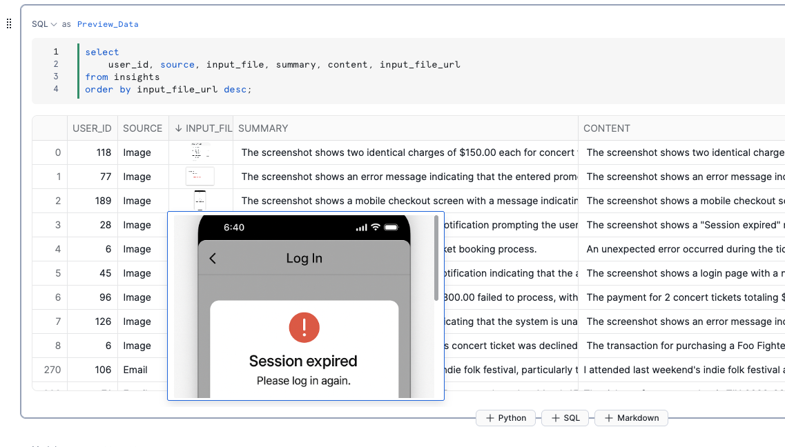

id: getting-started-with-cortex-aisql-ja
categories: snowflake-site:taxonomy/solution-center/certification/quickstart, snowflake-site:taxonomy/solution-center/certification/certified-solution, snowflake-site:taxonomy/solution-center/includes/architecture, snowflake-site:taxonomy/product/ai, snowflake-site:taxonomy/snowflake-feature/cortex-llm-functions
language: ja
summary: このガイドは Cortex AI 関数をはじめるうえでのガイドラインを提供します。
environments: web
status: Published
feedback link: <https://github.com/Snowflake-Labs/sfguides/issues>
authors: Sho Tanaka, Dash Desai


# はじめての Cortex AI 関数（日本語版）
<!-- ------------------------ -->

## 概要


Cortex AI 関数は、SQL をマルチモーダルデータ向けの AI クエリ言語として再定義し、強力な AI 機能を Snowflake の SQL エンジンに直接組み込みます。Google、OpenAI、Anthropic、Meta などの業界をリードする LLM を使用して、使い慣れた SQL コマンドでテキスト、画像、音声にわたるスケーラブルな AI パイプラインを構築できます。
新しい FILE データ型によるマルチモーダルデータのネイティブサポートにより、Cortex AI 関数は AI_FILTER やAI_AGGREGATE などの AI オペレーターと従来の SQL をシームレスに統合し、アナリストがエンタープライズグレードのセキュリティとガバナンスを維持しながら、多様なデータタイプをより効率的かつコスト効率よく処理できるようにします。

### Cortex AI 関数とは？

Cortex AI 関数は、構造化データと非構造化データ分析の間の従来の壁を取り払い、別々のツールや専門的なスキルの必要性を排除します。

主な3つのメリット：

* 使い慣れた SQL 構文によるシンプルさ - 複雑なコーディングなしで、あらゆるアナリストを AI エンジニアに変革
* Snowflake のクエリエンジンとの統合による高性能処理 - 30 %以上高速なクエリランタイムを実現
* 従来の AI 実装と比較して最大60%のコスト削減

セットアップ不要で単一プラットフォームにすべてのデータタイプを統合することで、Cortex AI 関数は企業全体で AI を活用した分析を民主化します。


### ユースケース

Cortex AI 関数は、多様なデータタイプを扱うあらゆる業界の組織に恩恵をもたらします：

* 金融サービス：ニュースフィードをフィルタリングし、社内の保有銘柄と結合することで、コーポレートアクション処理を自動化
* 小売・ EC：顧客レビューを分析し、懸念されるパターンを特定することで、製品品質の問題を検出
* ヘルスケア：非構造化の臨床ノート、トランスクリプト、画像と構造化された患者記録を橋渡しすることで、医学研究を加速
* 法務：契約分析とコンプライアンス監視を効率化
* メディア：マルチモーダルデータ分析によるコンテンツの最適化と広告のターゲティング

ビジネスアナリストは AI の専門知識なしでインサイトを抽出でき、データエンジニアはよりシンプルなパイプラインを構築でき、データサイエンティストはより豊富な特徴量セットを作成できます - すべて使い慣れた SQL を使用して。

### 前提条件

* [対応リージョン](https://docs.snowflake.com/ja/user-guide/snowflake-cortex/aisql?lang=ja%2F)のいずれかでACCOUNTADMINロールを持つSnowflakeアカウントへのアクセス。アカウントをお持ちでない場合は、[Snowflake 無料トライアルアカウント](https://signup.snowflake.com/?utm_source=snowflake-devrel&utm_medium=developer-guides&utm_cta=developer-guides)を作成してください。

### 学習内容

Cortex AI 関数の強力なオペレーターを使用して、自然言語で Snowflake 内のマルチモーダルデータを分析する方法を学びます。

* AI_COMPLETE：テキストや画像を含むさまざまな入力に対して、AIによるテキスト補完や説明を生成
* AI_TRANSCRIBE：音声ファイルの文字起こし
* AI_FILTER：セマンティックフィルタリング
* AI_AGG：複数行にわたるインサイトの集約
* AI_CLASSIFY：テキストと画像の分類

### 作成するもの

テキスト、画像、音声ファイルにわたるマルチモーダルデータで Cortex AI 関数を使い始めるための Snowflake Notebook

<!-- ------------------------ -->
## セットアップ


**ステップ 1.** Snowsight で[SQLワークシートを作成](https://docs.snowflake.com/ja/user-guide/ui-snowsight-worksheets-gs?_fsi=THrZMtDg%2C+THrZMtDg&_fsi=THrZMtDg%2C+THrZMtDg#create-worksheets-from-a-sql-file)し、[setup.sql](https://github.com/Snowflake-Labs/sfguide-getting-started-with-cortex-aisql/blob/main/setup.sql)を開いて、すべてのステートメントを上から順に実行します。

**ステップ 2.** サンプルの[画像ファイル](https://github.com/Snowflake-Labs/sfguide-getting-started-with-cortex-aisql/tree/main/data/images)をダウンロードし、**Snowsight >> Data >> Add Data >> Load files into a Stage**を使用して、ステップ1で作成した`DASH_DB.DASH_SCHEMA.DASH_IMAGE_FILES`ステージにアップロードします。

**ステップ 3.** サンプルの[音声ファイル](https://github.com/Snowflake-Labs/sfguide-getting-started-with-cortex-aisql/tree/main/data/audio)をダウンロードし、**Snowsight >> Data >> Add Data >> Load files into a Stage**を使用して、ステップ1で作成した`DASH_DB.DASH_SCHEMA.DASH_AUDIO_FILES`ステージにアップロードします。

**ステップ 4.** Snowsight で[SQLワークシートを作成](https://docs.snowflake.com/en/user-guide/ui-snowsight-worksheets-gs?_fsi=THrZMtDg,%20THrZMtDg&_fsi=THrZMtDg,%20THrZMtDg#create-worksheets-from-a-sql-file)し、[images.sql](https://github.com/Snowflake-Labs/sfguide-getting-started-with-cortex-aisql/blob/main/images.sql)を開いて、すべてのステートメントを上から順に実行してIMAGESテーブルを作成します。

**ステップ 5.** Snowsight で[SQLワークシートを作成](https://docs.snowflake.com/en/user-guide/ui-snowsight-worksheets-gs?_fsi=THrZMtDg,%20THrZMtDg&_fsi=THrZMtDg,%20THrZMtDg#create-worksheets-from-a-sql-file)し、[audio.sql](https://github.com/Snowflake-Labs/sfguide-getting-started-with-cortex-aisql/blob/main/audio.sql)を開いて、すべてのステートメントを上から順に実行してVOICEMAILSテーブルを作成します。

**ステップ 6.** [cortex_ai_functions.ipynb](https://github.com/Snowflake-Labs/sfguide-getting-started-with-cortex-ai-functions/blob/dd715f1e87644f41ca0a0fa8a8621f2b66a926ba/CORTEX_AI_FUNCTIONS.ipynb)をクリックして、GitHubからNotebookをダウンロードします。（注意：右クリックでダウンロードしないでください。）

**ステップ 7.** Snowsightで：

* 左側のナビゲーションメニューで、**Projects** » **Notebooks**をクリック
* 右上の**Notebook**の下矢印をクリックし、ドロップダウンメニューから**Import .ipynb file**を選択
* 上のステップでダウンロードした**cortex_ai_functions.ipynb**ファイルを選択
* Create Notebookポップアップで
    * Notebook locationには`DASH_DB`と`DASH_SCHEMA`を選択
    * Python environmentには`Run on warehouse`を選択
    * Query warehouseには`DASH_WH_S`を選択
    * Notebook warehouseにはデフォルトの`SYSTEM$STREAMLIT_NOTEBOOK_WH`を選択
    * **Create**ボタンをクリック

**ステップ 8.** Notebookを開く

* 右上の**Start**ボタンをクリック


> 注意：この時点で、セッションの開始に数分かかる場合があります。ステータスが**Starting**から**Active**に変わるまで、先に進むことはできません。

<!-- ------------------------ -->
## Notebookの実行


> 前提条件：**セットアップ**に記載されているステップが正常に完了していること。

以下は、ダウンロードしてSnowflakeアカウントにインポートした[cortex_ai_functions.ipynb](https://github.com/Snowflake-Labs/sfguide-getting-started-with-cortex-ai-functions/blob/dd715f1e87644f41ca0a0fa8a8621f2b66a926ba/CORTEX_AI_FUNCTIONS.ipynb) Notebookのコードウォークスルーです。

ステータスが**Starting**から**Active**に変わったら、すべてのセルを上から順に実行します。

### セル **Import_Libraries**

Notebookのセルを実行するために必要なライブラリをインポートします。

### セル **Multimodal**

[AI_COMPLETE()](https://docs.snowflake.com/en/sql-reference/functions/ai_complete)と[AI_TRANSCRIBE()](https://docs.snowflake.com/en/sql-reference/functions/ai_transcribe)を使用して、テキスト、画像、音声データにわたる顧客の問題を特定し、SQLオペレーターがすべてのモダリティでシームレスに機能する様子を確認します。

* テキスト：メール
* 画像：スクリーンショット
* 音声：ボイスメール

### セル **Preview_Data**

ネイティブ FILE データ型により、すべてのデータ形式を1つのテーブルに統合できることに注目してください。

### セル AI_FILTER

JOIN ... ON [AI_FILTER()](https://docs.snowflake.com/en/sql-reference/functions/ai_filter)を使用して、顧客の問題と既存のソリューションをセマンティックに「結合」します。

### セル AI_AGG

[AI_AGG()](https://docs.snowflake.com/en/sql-reference/functions/ai_agg)を使用して、複数行にわたる集約されたインサイトを取得します。

### セル AI_CLASSIFY

[AI_CLASSIFY()](https://docs.snowflake.com/en/sql-reference/functions/ai_classify)を使用して、下流のアプリケーションで使用できるラベルを分類します。例えば、MLモデルのトレーニングに使用できます。

==================================================================================================

### オプション：セル結果に画像を表示する

**Preview_Data**セルの統合データの一部として Notebook 内に画像を表示したい場合は、以下の手順に従ってください。

**ステップ 1.** SQL ワークシートで、以下のステートメントを実行して、サンプル Python ファイルを保存するためのSnowflake マネージド内部ステージを作成します。

```sql
 create or replace stage DASH_DB.DASH_SCHEMA.DASH_PY_FILES 
    encryption = (TYPE = 'SNOWFLAKE_SSE') 
    directory = ( ENABLE = true );
```

**ステップ 2.** [Snowsight](https://docs.snowflake.com/en/user-guide/data-load-local-file-system-stage-ui#upload-files-onto-a-named-internal-stage)を使用して、[snowbooks_extras.py](https://github.com/Snowflake-Labs/sfguide-getting-started-with-cortex-aisql/blob/main/snowbooks_extras.py)を**DASH_DB.DASH_SCHEMA.DASH_PY_FILES**ステージにアップロードします。

**ステップ 3.** 既存の**cortex_ai_functions.ipynb** Notebook を再度開き、右上の**Packages** >> **State Packages**をクリックして、**@DASH_DB.DASH_SCHEMA.DASH_PY_FILES/snowbooks_extras.py**を入力し、**Import**をクリックします。


**ステップ 4.** セッションが**Active**の場合は、クリックして現在のセッションを終了します。それ以外の場合は、**Start**をクリックして新しいセッションを開始します。これにより、パッケージリストも更新され、カスタムパッケージ**snowbooks_extras**が含まれます。


> 注意：この時点で、セッションの開始に数分かかる場合があります。ステータスが**Starting**から**Active**に変わるまで、先に進むことはできません。

**ステップ 5.** **Import_Libraries**のライブラリリストに`import snowbooks_extras`を追加し、セルを実行します。

**ステップ 6.** **Preview_Data**セルを実行すると、以下のように**INPUT_FILE**列に画像が表示されます。


> `snowbooks_extras`をインポートする前


 
> `snowbooks_extras`をインポートした後 -- 以下のように拡大画像を表示するには、2回クリックする必要があります（正確にはダブルクリックではありません :)）。



<!-- ------------------------ -->
## まとめとリソース


おめでとうございます！マルチモーダルデータでCortex AI 関数を使い始めるための Snowflake Notebook を正常に作成しました。

### 学んだこと

Cortex AI 関数の強力なオペレーターを使用して、自然言語で Snowflake 内のマルチモーダルデータを分析する方法を学びました。

* AI_COMPLETE：テキストや画像を含むさまざまな入力に対して、AIによるテキスト補完や説明を生成
* AI_FILTER：セマンティックフィルタリング
* AI_TRANSCRIBE：音声ファイルの文字起こし
* AI_AGG：複数行にわたるインサイトの集約
* AI_CLASSIFY：テキストと画像の分類

### 関連リソース

- [GitHubリポジトリ](https://github.com/Snowflake-Labs/sfguide-getting-started-with-cortex-ai-functions)
- [Cortex AI 関数ドキュメント](https://docs.snowflake.com/user-guide/snowflake-cortex/aisql)
- [リファレンスアーキテクチャをダウンロード](https://quickstarts.snowflake.com/guide/getting-started-with-cortex-aisql/img/f65e99c9c8dbf752.png?_ga=2.50488033.970314110.1758562613-1806211272.1741193538&_gac=1.112796406.1758675992.CjwKCAjwisnGBhAXEiwA0zEOR1sIXOVV_EsVJWwLfve5dvv0oNT7nVRSlx19ZM16B3Kj1k4neCKwLxoCf70QAvD_BwE)
- [ブログを読む](/en/blog/ai-sql-query-language/)
