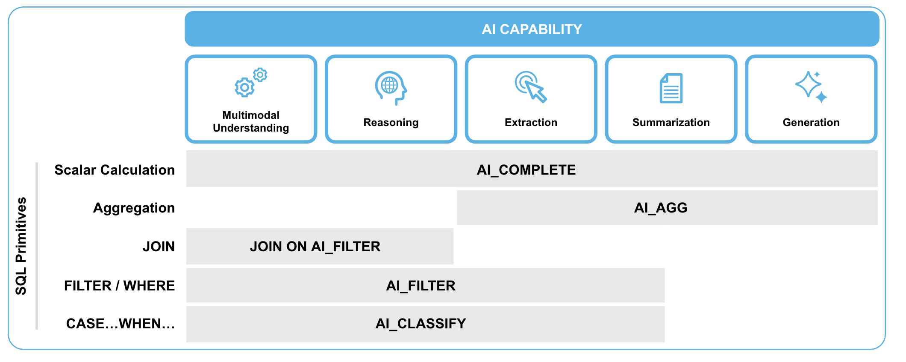
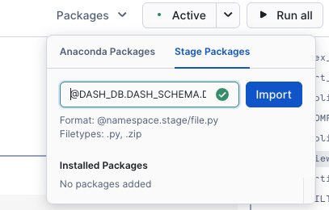
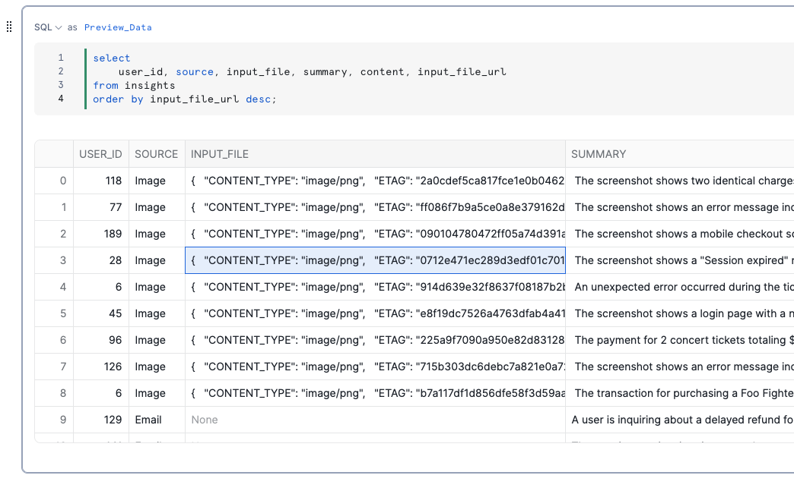
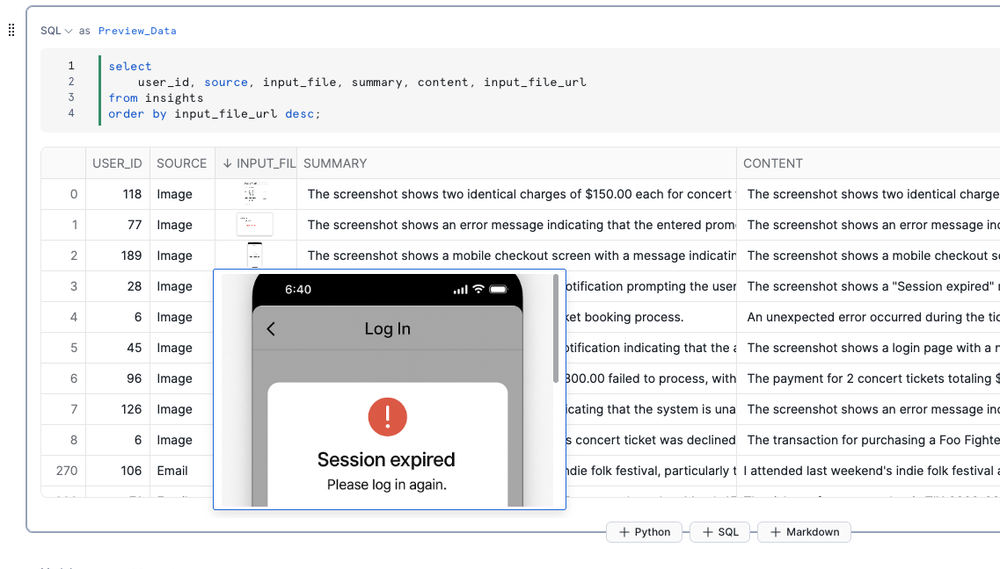

id: getting-started-with-cortex-aisql
categories: snowflake-site:taxonomy/solution-center/certification/quickstart, snowflake-site:taxonomy/solution-center/certification/certified-solution, snowflake-site:taxonomy/solution-center/includes/architecture, snowflake-site:taxonomy/product/ai, snowflake-site:taxonomy/snowflake-feature/cortex-llm-functions
language: en
summary: This guide outlines the process for getting started with Cortex AI Functions. 
environments: web
status: Published
feedback link: <https://github.com/Snowflake-Labs/sfguides/issues>
authors: Dash Desai


# Getting Started with Cortex AI Functions
<!-- ------------------------ -->

## Overview


Cortex AI Functions reimagines SQL into an AI query language for multimodal data, bringing powerful AI capabilities directly into Snowflake's SQL engine. It enables users to build scalable AI pipelines across text, images, and audio using familiar SQL commands and with industry-leading LLMs from Google, Open AI, Anthropic, Meta, and more. 
With native support for multimodal data through a new FILE datatype, Cortex AI Functions seamlessly integrates AI operators with traditional SQL primitives like AI_FILTER and AI_AGGREGATE, allowing analysts to process diverse data types more efficiently and cost-effectively while maintaining enterprise-grade security and governance.

### What are Cortex AI Functions? 

Cortex AI Functions bridges the traditional divide between structured and unstructured data analysis, eliminating the need for separate tools and specialized skills. 

It delivers three key benefits:

* Simplicity through familiar SQL syntax that transforms any analyst into an AI engineer without complex coding
* High-performance processing through deep integration with Snowflake's query engine, offering 30%+ faster query runtime
* Cost efficiency with up to 60% savings compared to traditional AI implementations

By unifying all data types in a single platform with zero setup required, Cortex AI Functions democratizes AI-powered analytics across the enterprise.



### Use Cases

Cortex AI Functions benefits organizations across industries dealing with diverse data types including:

* Financial services: Automate corporate action processing by filtering news feeds and joining with internal holdings
* Retail and e-commerce: Detect product quality issues by analyzing customer reviews and identifying concerning patterns
* Healthcare: Accelerate medical research by bridging unstructured clinical notes, transcripts and images with structured patient records
* Legal: Streamline contract analysis and compliance monitoring
* Media: Optimize content and target advertising through multimodal data analysis

Business analysts can extract insights without AI expertise, data engineers can build simpler pipelines, and data scientists can create richer feature sets, all using familiar SQL.

### Gemini 3 Pro and Gemini Flash 2.5 Support

Snowflake Cortex AI natively supports Gemini 3 Pro and Gemini Flash 2.5 through Cortex AI Functions, running directly within your Snowflake environment. This means faster access to industry-leading AI, without moving or copying sensitive enterprise data. You can build generative and agentic AI applications directly where your governed data already lives. The result is a simpler architecture, lower cost, and higher trust in agentic AI applications. 

The Gemini models are extensible to a variety of use cases, depending on your need:

* **Gemini 3** excels at multi-modal reasoning, long-context analysis, advanced tool use and complex agentic workflows. It’s a powerful fit for Snowflake customers building production-grade AI agents that operate securely across structured, unstructured, and multimodal enterprise data. This makes it ideal for customers building enterprise-grade AI agents that must reason deeply over financial records, logs, product data, documents and more, securely at scale. Built on Google’s most intelligent Gemini generation to date, Gemini 3 Pro delivers state-of-the-art reasoning with unprecedented depth and nuance, significantly outperforming previous generations across major reasoning, math, multimodal and factual accuracy benchmarks, giving enterprises higher confidence in their most complex, business-critical use cases.   
* **Gemini Flash 2.5** is optimized for speed and cost efficiency. It delivers high-quality results across tasks such as summarization, chat, data extraction and captioning, making it ideal for high-volume workloads that demand both performance and value.  Perfect for high-volume scenarios such as call summarization, invoice processing and rapid customer service interactions, without slowing down the service. 

Cortex AI Functions make it easy to build cost-efficient, scalable AI pipelines across multimodal enterprise data using familiar SQL. This eliminates complex orchestration and reduces operational overhead, enabling analysts and developers to apply natural language instructions directly to governed datasets. When combined with Gemini 3’s advanced reasoning, customers can move beyond basic Q&A to nuanced analysis, planning and decision support that better captures the real-world complexity of their businesses. For example, using AI_COMPLETE function, users can leverage state-of-the-art models like Gemini 3 Pro:

```sql
select AI_COMPLETE('gemini-3-pro', prompt('Summarize this issue shown in this screenshot in one concise sentence: {0}', img_file)) as summary from images;
```

### Prerequisites

* Access to a Snowflake account in one of [these regions](https://docs.snowflake.com/user-guide/snowflake-cortex/aisql?lang=de%2F) with the ACCOUNTADMIN role. If you do not have access to an account, create a [free Snowflake trial account](https://signup.snowflake.com/?utm_source=snowflake-devrel&utm_medium=developer-guides&utm_cta=developer-guides).

### What You Will Learn

You'll learn how to use powerful operators of Cortex AI Functions to analyze multimodal data within Snowflake using natural language.

* AI_COMPLETE: Generate AI-powered text completions or descriptions for various inputs including text and images
* AI_TRANSCRIBE: Transcribe audio files
* AI_FILTER: Semantic filtering
* AI_AGG: Aggregate insights across multiple rows
* AI_CLASSIFY: Text and image classification

### What You Will Build

Snowflake Notebook that helps you get started with using Cortex AI Functions with multimodal data across test, images, and audio files.

<!-- ------------------------ -->
## Setup


**Step 1.** In Snowsight, [create a SQL Worksheet](https://docs.snowflake.com/en/user-guide/ui-snowsight-worksheets-gs?_fsi=THrZMtDg,%20THrZMtDg&_fsi=THrZMtDg,%20THrZMtDg#create-worksheets-from-a-sql-file) and open [setup.sql](https://github.com/Snowflake-Labs/sfguide-getting-started-with-cortex-aisql/blob/main/setup.sql) to execute all statements in order from top to bottom.

**Step 2.** Download sample [images files](https://github.com/Snowflake-Labs/sfguide-getting-started-with-cortex-aisql/tree/main/data/images) and use **Snowsight >> Data >> Add Data >> Load files into a Stage** to upload them to `DASH_DB.DASH_SCHEMA.DASH_IMAGE_FILES` stage created in step 1.

**Step 3.** Download sample [audio files](https://github.com/Snowflake-Labs/sfguide-getting-started-with-cortex-aisql/tree/main/data/audio) and use **Snowsight >> Data >> Add Data >> Load files into a Stage** to upload them to `DASH_DB.DASH_SCHEMA.DASH_AUDIO_FILES` stage created in step 1.

**Step 4.** In Snowsight, [create a SQL Worksheet](https://docs.snowflake.com/en/user-guide/ui-snowsight-worksheets-gs?_fsi=THrZMtDg,%20THrZMtDg&_fsi=THrZMtDg,%20THrZMtDg#create-worksheets-from-a-sql-file) and open [images.sql](https://github.com/Snowflake-Labs/sfguide-getting-started-with-cortex-aisql/blob/main/images.sql) to execute all statements in order from top to bottom to create IMAGES table.

**Step 5.** In Snowsight, [create a SQL Worksheet](https://docs.snowflake.com/en/user-guide/ui-snowsight-worksheets-gs?_fsi=THrZMtDg,%20THrZMtDg&_fsi=THrZMtDg,%20THrZMtDg#create-worksheets-from-a-sql-file) and open [audio.sql](https://github.com/Snowflake-Labs/sfguide-getting-started-with-cortex-aisql/blob/main/audio.sql) to execute all statements in order from top to bottom to create VOICEMAILS table.

**Step 6.** Click on [cortex_ai_functions.ipynb](https://github.com/Snowflake-Labs/sfguide-getting-started-with-cortex-ai-functions/blob/dd715f1e87644f41ca0a0fa8a8621f2b66a926ba/CORTEX_AI_FUNCTIONS.ipynb) to download the Notebook from GitHub. (NOTE: Do NOT right-click to download.)

**Step 7.** In Snowsight:

* On the left hand navigation menu, click on **Projects** » **Notebooks**
* On the top right, click on **Notebook** down arrow and select **Import .ipynb file** from the dropdown menu
* Select **cortex_ai_functions.ipynb** file you downloaded in the step above
* In the Create Notebook popup
    * For Notebook location, select `DASH_DB` and `DASH_SCHEMA`
    * For Python environment, select `Run on warehouse`
    * For Query warehouse, select `DASH_WH_S`
    * For Notebook warehouse, select default `SYSTEM$STREAMLIT_NOTEBOOK_WH`
    * Click on **Create** button

**Step 8.** Open Notebook

* Click on **Start** button on top right


> NOTE: At this point, it may take a couple of minutes for the session to start. You will not be able to proceed unless the status changes from **Starting** to **Active**.

<!-- ------------------------ -->
## Run Notebook


> PREREQUISITE: Successful completion of steps outlined under **Setup**.

Here's the code walkthrough of the [cortex_ai_functions.ipynb](https://github.com/Snowflake-Labs/sfguide-getting-started-with-cortex-ai-functions/blob/dd715f1e87644f41ca0a0fa8a8621f2b66a926ba/CORTEX_AI_FUNCTIONS.ipynb) notebook that you downloaded and imported into your Snowflake account. 

Once the status changes from **Starting** to **Active**, run through all the cells from top to bottom.

### Cell **Import_Libraries** 

Import libraries required for running cells in the Notebook.

### Cell **Multimodal**

Identify customer issues across text, image, and audio data using [AI_COMPLETE()](https://docs.snowflake.com/en/sql-reference/functions/ai_complete) and [AI_TRANSCRIBE()](https://docs.snowflake.com/en/sql-reference/functions/ai_transcribe) to see how the SQL operators work seamlessly across all modalities.

* Text: Emails 
* Images: Screenshots
* Audio: Voicemails

### Cell **Preview_Data** 

Notice that native FILE datatype allows for consolidating all data formats into one table. 

### Cell AI_FILTER

Semantically "JOIN" customer issues with existing solutions using JOIN ... ON [AI_FILTER()](https://docs.snowflake.com/en/sql-reference/functions/ai_filter).

### Cell AI_AGG

Get aggregated insights across multiple rows using [AI_AGG()](https://docs.snowflake.com/en/sql-reference/functions/ai_agg).

### Cell AI_CLASSIFY

Classification of labels that can be used in downstream applications using [AI_CLASSIFY()](https://docs.snowflake.com/en/sql-reference/functions/ai_classify). For example, to train ML models.

==================================================================================================

### OPTIONAL: Display images in cell results

If you'd like to see images displayed in the Notebook as part of the consolidated data in **Preview_Data** cell, follow these instructions.

**Step 1**. In a SQL worksheet, execute the following statement to create a Snowflake managed internal stage to store the sample python files.

```sql
 create or replace stage DASH_DB.DASH_SCHEMA.DASH_PY_FILES 
    encryption = (TYPE = 'SNOWFLAKE_SSE') 
    directory = ( ENABLE = true );
```

**Step 2.** Use [Snowsight]((https://docs.snowflake.com/en/user-guide/data-load-local-file-system-stage-ui#upload-files-onto-a-named-internal-stage)) to upload [snowbooks_extras.py](https://github.com/Snowflake-Labs/sfguide-getting-started-with-cortex-aisql/blob/main/snowbooks_extras.py) on stage **DASH_DB.DASH_SCHEMA.DASH_PY_FILES**.

**Step 3.** Reopen existing **cortex_ai_functions.ipynb** Notebook, and on the top right click on **Packages** >> **State Packages** and enter **@DASH_DB.DASH_SCHEMA.DASH_PY_FILES/snowbooks_extras.py** and then click on **Import**. 



**Step 4.** If the session is **Active**, click on it to end the current session. Otherwise, click on **Start** to start a new session which will also update the packages list and include our custom package **snowbooks_extras**.


> NOTE: At this point, it may take a couple of minutes for the session to start. You will not be able to proceed unless the status changes from **Starting** to **Active**.

**Step 5.** Add `import snowbooks_extras` to the libraries list under **Import_Libraries** and run the cell.

**Step 6.** Now if you run **Preview_Data** cell, you will see images displayed in **INPUT_FILE** column as shown below.


> Before importing `snowbooks_extras` 



 
> After importing `snowbooks_extras` -- you will need to click twice (not exactly a double-click though :)) to see the enlarged image as shown.



<!-- ------------------------ -->
## Conclusion And Resources


Congratulations! You've successfully created a Snowflake Notebook that helps you get started with using Cortex AI Functions with multimodal data.

### What You Learned

You've learned how to use powerful operators of Cortex AI Functions to analyze multimodal data within Snowflake using natural language.

* AI_COMPLETE: Generate AI-powered text completions or descriptions for various inputs including text and images
* AI_FILTER: Semantic filtering
* AI_TRANSCRIBE: Transcribe audio files
* AI_AGG: Aggregate insights across multiple rows
* AI_CLASSIFY: Text and image classification

### Related Resources

- [GitHub Repository](https://github.com/Snowflake-Labs/sfguide-getting-started-with-cortex-ai-functions)
- [Cortex AI Functions Documentation](https://docs.snowflake.com/user-guide/snowflake-cortex/aisql)
- [Download Reference Architecture](https://quickstarts.snowflake.com/guide/getting-started-with-cortex-aisql/img/f65e99c9c8dbf752.png?_ga=2.50488033.970314110.1758562613-1806211272.1741193538&_gac=1.112796406.1758675992.CjwKCAjwisnGBhAXEiwA0zEOR1sIXOVV_EsVJWwLfve5dvv0oNT7nVRSlx19ZM16B3Kj1k4neCKwLxoCf70QAvD_BwE)
- [Read the Blog](/en/blog/ai-sql-query-language/)

