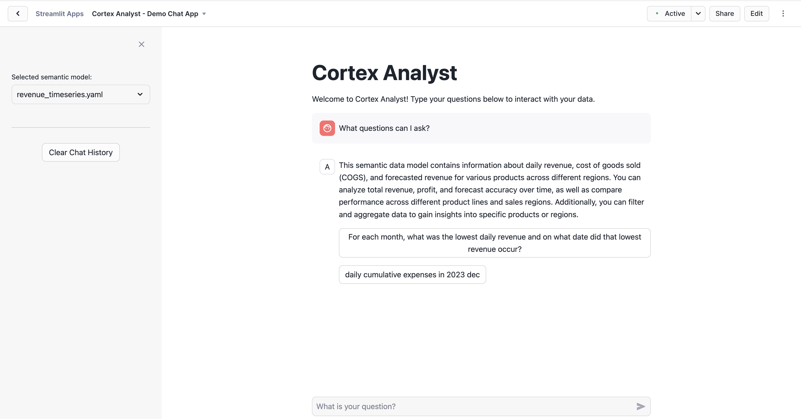
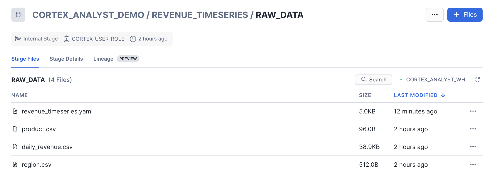
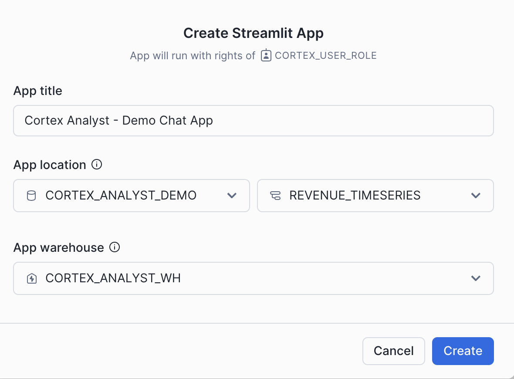
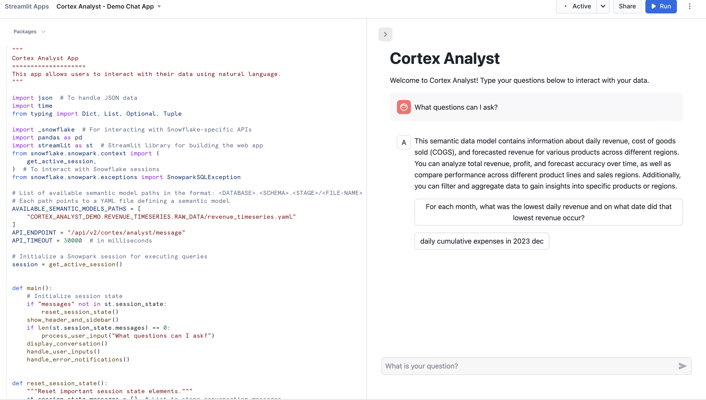

author: caleb-baechtold
id: getting-started-with-cortex-analyst
categories: snowflake-site:taxonomy/solution-center/certification/quickstart, snowflake-site:taxonomy/solution-center/certification/certified-solution, snowflake-site:taxonomy/product/ai, snowflake-site:taxonomy/snowflake-feature/cortex-analyst
language: en
summary: Through this quickstart guide, you will learn how to use Cortex Analyst to provide natural-language query interfaces to structured data in Snowflake using GenAI 
environments: web
status: Published 
feedback link: https://github.com/Snowflake-Labs/sfguides/issues
fork repo link: https://github.com/Snowflake-Labs/sfguide-getting-started-with-cortex-analyst


# Getting Started with Cortex Analyst: Augment BI with AI
<!-- ------------------------ -->
## Overview 

Through this quickstart guide, you will explore how to get started with [Cortex Analyst](https://docs.snowflake.com/user-guide/snowflake-cortex/cortex-analyst). Any Snowflake user can analyze structured data and get reliable answers to their questions just by asking natural-language questions through a conversational interface.

### What is Cortex Analyst?

Cortex Analyst is a fully-managed feature within [Snowflake Cortex AI](/en/data-cloud/cortex) that acts as a secure, dedicated translator between natural language and the complex code needed to analyze your structured data. It uses an agentic AI setup powered by state-of-the-art large language models (LLMs) to understand natural language questions—like “What were the top 10 locations in terms of sales?”—and accurately turn them into the correct queries. This streamlines the development of intuitive, self-service analytics applications for users, while providing industry-leading text-to-SQL accuracy. It’s ready to use and easy to integrate into any application via the [REST API](https://docs.snowflake.com/en/developer-guide/snowflake-rest-api/snowflake-rest-api), empowering developers to customize how and where users interact with results. This is all while staying compliant with Snowflake’s security and governance features, including [role-based access control](https://www.snowflake.com/en/fundamentals/rbac/) (RBAC) to keep your valuable data safe.


### Why use Cortex Analyst?
Historically, business users have primarily relied on BI dashboards and reports from dedicated teams to answer their data questions. However, these resources often lack the flexibility needed, leaving users dependent on overburdened data analysts for updates or answers, which can take days. This inefficiency means lost time and missed opportunities. Cortex Analyst disrupts this cycle by providing a natural language interface with high text-to-SQL accuracy. With Cortex Analyst, business users are empowered to be self-sufficient. Organizations can streamline the development of intuitive, conversational applications that can enable business users to ask questions using natural language and receive more accurate answers in near real time

This quickstart will focus on getting started with Cortex Analyst, teaching the mechanics of how to interact with the Cortex Analyst service and how to set up the Semantic Model definitions that enhance the precision of results from this conversational interface over your Snowflake data.

### What You'll Learn 
- How to construct and configure a Semantic Model for your specific data
- How to call the Cortex Analyst REST API to use your Semantic Model to enable natural-language question-asking on top of your structured data in Snowflake via Streamlit in Snowflake (SiS) application
- How to integrate Cortex Analyst with Cortex Search to provide more context and generate enhanced SQL queries
- How to enable Join support for Star Schemas that will connect data across a complex data structure
- How to enable multi-turn conversations that will remember the context of previous questions

### Prerequisites
- [Git](https://git-scm.com/book/en/v2/Getting-Started-Installing-Git) installed
  
    >
    >Download the [Git repository](https://github.com/Snowflake-Labs/sfguide-getting-started-with-cortex-analyst)
- (Optional) [Python >= 3.9, <= 3.11 installed](https://www.python.org/downloads/) to run the OSS Semantic Model Generator
- A [Snowflake account login](https://signup.snowflake.com/?utm_source=snowflake-devrel&utm_medium=developer-guides&utm_cta=developer-guides) with a role that has the ability to create database, schema, tables, stages, user-defined functions, and stored procedures. If not, you will need to register for a free trial account from any of the supported cloud regions or use a different role.

### What You’ll Build 
- A Semantic Model over sample financial data
- A Streamlit in Snowflake (SiS) app with a conversational interface to Cortex Analyst



<!-- ------------------------ -->
## Set Up the Snowflake Environment


>
> Make sure you've downloaded the [Git repository](https://github.com/Snowflake-Labs/sfguide-getting-started-with-cortex-analyst) for this quickstart.

Open up the [create_snowflake_objects.sql](https://github.com/Snowflake-Labs/sfguide-getting-started-with-cortex-analyst/blob/main/create_snowflake_objects.sql) file or copy over the commands in a SQL worksheet in Snowsight.

This script creates a secure setup with the correct permissions and builds the main infrastructure. It defines the structure of the data that will be analyzed. Run the following SQL commands in a SQL worksheet to create the [warehouse](https://docs.snowflake.com/en/sql-reference/sql/create-warehouse.html), [database](https://docs.snowflake.com/en/sql-reference/sql/create-database.html) and [schema](https://docs.snowflake.com/en/sql-reference/sql/create-schema.html).

>
> NOTE: Make sure to input your specific user where it says `<user>`.

```SQL
/*--
• Database, schema, warehouse, and stage creation
--*/

USE ROLE SECURITYADMIN;

CREATE ROLE cortex_user_role;
GRANT DATABASE ROLE SNOWFLAKE.CORTEX_USER TO ROLE cortex_user_role;

GRANT ROLE cortex_user_role TO USER <user>;

USE ROLE sysadmin;

-- Create demo database
CREATE OR REPLACE DATABASE cortex_analyst_demo;

-- Create schema
CREATE OR REPLACE SCHEMA cortex_analyst_demo.revenue_timeseries;

-- Create warehouse
CREATE OR REPLACE WAREHOUSE cortex_analyst_wh
    WAREHOUSE_SIZE = 'large'
    WAREHOUSE_TYPE = 'standard'
    AUTO_SUSPEND = 60
    AUTO_RESUME = TRUE
    INITIALLY_SUSPENDED = TRUE
COMMENT = 'Warehouse for Cortex Analyst demo';

GRANT USAGE ON WAREHOUSE cortex_analyst_wh TO ROLE cortex_user_role;
GRANT OPERATE ON WAREHOUSE cortex_analyst_wh TO ROLE cortex_user_role;

GRANT OWNERSHIP ON SCHEMA cortex_analyst_demo.revenue_timeseries TO ROLE cortex_user_role;
GRANT OWNERSHIP ON DATABASE cortex_analyst_demo TO ROLE cortex_user_role;


USE ROLE cortex_user_role;

-- Use the created warehouse
USE WAREHOUSE cortex_analyst_wh;

USE DATABASE cortex_analyst_demo;
USE SCHEMA cortex_analyst_demo.revenue_timeseries;

-- Create stage for raw data
CREATE OR REPLACE STAGE raw_data DIRECTORY = (ENABLE = TRUE);

/*--
• Fact and Dimension Table Creation
--*/

-- Fact table: daily_revenue
CREATE OR REPLACE TABLE cortex_analyst_demo.revenue_timeseries.daily_revenue (
    date DATE,
    revenue FLOAT,
    cogs FLOAT,
    forecasted_revenue FLOAT,
    product_id INT,
    region_id INT
);

-- Dimension table: product_dim
CREATE OR REPLACE TABLE cortex_analyst_demo.revenue_timeseries.product_dim (
    product_id INT,
    product_line VARCHAR(16777216)
);

-- Dimension table: region_dim
CREATE OR REPLACE TABLE cortex_analyst_demo.revenue_timeseries.region_dim (
    region_id INT,
    sales_region VARCHAR(16777216),
    state VARCHAR(16777216)
);
```

You have now successfully built the Snowflake environment for Cortex Analyst. The SQL commands above should have all been run in your worksheet. The same code can be found in the [**create_snowflake_objects.sql**](https://github.com/Snowflake-Labs/sfguide-getting-started-with-cortex-analyst/blob/main/create_snowflake_objects.sql) file.

<!-- ------------------------ -->
## Ingest the Revenue Data and Semantic Model YAML


>
> Make sure you've downloaded the [Git repository](https://github.com/Snowflake-Labs/sfguide-getting-started-with-cortex-analyst) for this quickstart.

You should have four key files cloned from the [Git repository](https://github.com/Snowflake-Labs/sfguide-getting-started-with-cortex-analyst). Three of them are the actual data (CSV files) and the last one is the YAML file, which is the Semantic Model definition that enables Cortex Analyst to interpret your data.
- [daily_revenue.csv](https://github.com/Snowflake-Labs/sfguide-getting-started-with-cortex-analyst/blob/main/data/daily_revenue.csv)
- [region.csv](https://github.com/Snowflake-Labs/sfguide-getting-started-with-cortex-analyst/blob/main/data/region.csv)
- [product.csv](https://github.com/Snowflake-Labs/sfguide-getting-started-with-cortex-analyst/blob/main/data/product.csv)
- [revenue_timeseries.yaml](https://github.com/Snowflake-Labs/sfguide-getting-started-with-cortex-analyst/blob/main/revenue_timeseries.yaml)

You will now upload these files to your Snowflake account and ingest the data files into the tables created in the previous step.

To upload the data files:
- Navigate to the Ingestion tab in Snowsight, and select **Add data**
- On the Add data page, select **Load files into a Stage**
- Select the four files listed above from your cloned Git repository to upload
- Select **CORTEX_ANALYST_DEMO** as Database, **REVENUE_TIMESERIES** as Schema, and **RAW_DATA** as Stage
- Click Upload

The Stage (RAW_DATA) acts as a secure drop-off point where all four files will sit before the data is loaded into the tables and the instructions are registered with Cortex Analyst. Let's go check that the files were successfully uploaded to the stage. In the Snowsight UI:
- Select **Catalog >> Database Explorer**
- Select the **CORTEX_ANALYST_DEMO** database and **REVENUE_TIMESERIES** Schema that contain the stage
- Select Stages and select the **RAW_DATA** stage
- If prompted, select **Enable Directory Table** and the CORTEX_ANALYST_WH to refresh the directory table

You should see the four files listed in the stage:


Now that the CSV files are in the Stage, we use the COPY INTO command in our SQL worksheet to load the raw CSV data into the tables. Go back to your Snowflake SQL worksheet and run the following [load_data.sql](https://github.com/Snowflake-Labs/sfguide-getting-started-with-cortex-analyst/blob/main/load_data.sql) code to load data into the tables:

```sql
/*--
• load data into tables
--*/

USE ROLE CORTEX_USER_ROLE;
USE DATABASE CORTEX_ANALYST_DEMO;
USE SCHEMA CORTEX_ANALYST_DEMO.REVENUE_TIMESERIES;
USE WAREHOUSE CORTEX_ANALYST_WH;

COPY INTO CORTEX_ANALYST_DEMO.REVENUE_TIMESERIES.DAILY_REVENUE
FROM @raw_data
FILES = ('daily_revenue.csv')
FILE_FORMAT = (
    TYPE=CSV,
    SKIP_HEADER=1,
    FIELD_DELIMITER=',',
    TRIM_SPACE=FALSE,
    FIELD_OPTIONALLY_ENCLOSED_BY=NONE,
    REPLACE_INVALID_CHARACTERS=TRUE,
    DATE_FORMAT=AUTO,
    TIME_FORMAT=AUTO,
    TIMESTAMP_FORMAT=AUTO
    EMPTY_FIELD_AS_NULL = FALSE
    error_on_column_count_mismatch=false
)

ON_ERROR=CONTINUE
FORCE = TRUE ;


COPY INTO CORTEX_ANALYST_DEMO.REVENUE_TIMESERIES.PRODUCT_DIM
FROM @raw_data
FILES = ('product.csv')
FILE_FORMAT = (
    TYPE=CSV,
    SKIP_HEADER=1,
    FIELD_DELIMITER=',',
    TRIM_SPACE=FALSE,
    FIELD_OPTIONALLY_ENCLOSED_BY=NONE,
    REPLACE_INVALID_CHARACTERS=TRUE,
    DATE_FORMAT=AUTO,
    TIME_FORMAT=AUTO,
    TIMESTAMP_FORMAT=AUTO
    EMPTY_FIELD_AS_NULL = FALSE
    error_on_column_count_mismatch=false
)

ON_ERROR=CONTINUE
FORCE = TRUE ;


COPY INTO CORTEX_ANALYST_DEMO.REVENUE_TIMESERIES.REGION_DIM
FROM @raw_data
FILES = ('region.csv')
FILE_FORMAT = (
    TYPE=CSV,
    SKIP_HEADER=1,
    FIELD_DELIMITER=',',
    TRIM_SPACE=FALSE,
    FIELD_OPTIONALLY_ENCLOSED_BY=NONE,
    REPLACE_INVALID_CHARACTERS=TRUE,
    DATE_FORMAT=AUTO,
    TIME_FORMAT=AUTO,
    TIMESTAMP_FORMAT=AUTO
    EMPTY_FIELD_AS_NULL = FALSE
    error_on_column_count_mismatch=false
)

ON_ERROR=CONTINUE
FORCE = TRUE ;
```
<!-- ------------------------ -->
## Integrate Cortex Search

Now, you will integrate [Cortex Search](https://docs.snowflake.com/en/user-guide/snowflake-cortex/cortex-search/cortex-search-overview) as a way to improve literal string searches to help Cortex Analyst generate more accurate SQL queries. Cortex Search uses a hybrid (keyword and vector) search engine to manage and query large amounts of unstructured text data. This allows it to find relevant documents even with imperfect matches, like typos or related phrases. Writing the correct SQL query to answer a question sometimes requires knowing exact literal values to filter on. Since those values can’t always be extracted directly from the question, a search of some kind may be needed.

Go back to your Snowflake SQL worksheet and run the following code from [cortex_search_create.sql](https://github.com/Snowflake-Labs/sfguide-getting-started-with-cortex-analyst/blob/main/cortex_search_create.sql) to load data into the tables:

```sql
USE DATABASE cortex_analyst_demo;
USE SCHEMA revenue_timeseries;
USE ROLE cortex_user_role;

  CREATE OR REPLACE CORTEX SEARCH SERVICE product_line_search_service
  ON product_dimension
  WAREHOUSE = cortex_analyst_wh
  TARGET_LAG = '1 hour'
  AS (
      SELECT DISTINCT product_line AS product_dimension FROM product_dim
  );
```

With this created, Snowflake's Cortex Analyst and Cortex Search work together to improve SQL accuracy. 

<!-- ------------------------ -->
## Create a Streamlit Conversational App

Now, you will create a demo chat application to call the Cortex Analyst API that will allow users to ask natural-language questions over our structured revenue datasets. To create the Streamlit in Snowflake (SiS) application:

- Make sure your role is set as CORTEX_USER_ROLE
- Select Projects » Streamlit and click `+ Streamlit App`. Fill it in with the below details and then click create:

- The Streamlit editor will open. Open up the [cortex_analyst_sis_demo_app.py](https://github.com/Snowflake-Labs/sfguide-getting-started-with-cortex-analyst/blob/main/cortex_analyst_sis_demo_app.py) file in your preferred local code editor
- Copy and paste the Streamlit in Snowflake (SiS) application code from the Python file directly into the Streamlit editor. This code handles the chat history, connects to the Cortex Analyst API, and displays the responses.

Take note of the `get_analyst_response` function that is defined in this Python code. This is the function that takes our chat input prompt and history, packages it up as a JSON object, and sends it to the Cortex Analyst API (with the specified `revenue_timeseries.yaml` Semantic Model). 

```python
def get_analyst_response(messages: List[Dict]) -> Tuple[Dict, Optional[str]]:
    """
    Send chat history to the Cortex Analyst API and return the response.

    Args:
        messages (List[Dict]): The conversation history.

    Returns:
        Optional[Dict]: The response from the Cortex Analyst API.
    """
    # Prepare the request body with the user's prompt
    request_body = {
        "messages": messages,
        "semantic_model_file": f"@{st.session_state.selected_semantic_model_path}",
    }

    # Send a POST request to the Cortex Analyst API endpoint
    # Adjusted to use positional arguments as per the API's requirement
    resp = _snowflake.send_snow_api_request(
        "POST",  # method
        API_ENDPOINT,  # path
        {},  # headers
        {},  # params
        request_body,  # body
        None,  # request_guid
        API_TIMEOUT,  # timeout in milliseconds
    )

    # Content is a string with serialized JSON object
    parsed_content = json.loads(resp["content"])

    # Check if the response is successful
    if resp["status"] < 400:
        # Return the content of the response as a JSON object
        return parsed_content, None
    else:
        # Craft readable error message
        error_msg = f"""
🚨 An Analyst API error has occurred 🚨

* response code: `{resp['status']}`
* request-id: `{parsed_content['request_id']}`
* error code: `{parsed_content['error_code']}`

Message: ```{parsed_content['message']}```
        """
        return parsed_content, error_msg
```


Click `Run` in the Streamlit editor. The application will start and initialize the chat interface. You can now begin asking natural language questions about the revenue data in the chat interface (e.g. "What questions can I ask?")

Try asking questions like the ones below:
- For each month, what was the lowest daily revenue and on what date did that lowest revenue occur?
- What were the daily cumulative expenses in December 2023?

<!-- ------------------------ -->
## Semantic Model Details

The semantic model file [`revenue_timeseries.yaml`](https://github.com/Snowflake-Labs/sfguide-getting-started-with-cortex-analyst/blob/main/revenue_timeseries.yaml) is the key that unlocks Cortex Analyst's power. This YAML file dictates the tables, columns, etc. that Cortex Analyst can use in order to run SQL queries that answer natural-language questions Let's talk a little about the details of this file:

The [Semantic Model](https://docs.snowflake.com/en/user-guide/snowflake-cortex/cortex-analyst/semantic-model-spec) is composed of a number of different fields that help Cortex Analyst understand the specifics of your data:
- Logical Tables which are composed of Logical Columns
- Logical Columns which are one of `dimensions`, `time_dimensions`, or `measures`
- Relationships that exist between tables to allow for JOINS

Logical Tables are relatively straightforward- these are tables or views within a database. That's it! Pretty simple

Logical Columns get a bit more complicated; a logical column can reference an underlying physical column in a table, or it can be an expression containing one or more physical columns. So, for example, in the [`revenue_timeseries.yaml`](https://github.com/Snowflake-Labs/sfguide-getting-started-with-cortex-analyst/blob/main/revenue_timeseries.yaml), we have a simple logical column `daily_revenue` that is a physical column. In the `daily_revenue` measure definition, you'll notice that we provide a description, as well as synonyms, data_type, and a default_aggregation, but no `expr` parameter. This is because `revenue` is simply a physical column in the `daily_revenue` table:

```yaml
measures:
    - name: daily_revenue
        expr: revenue
        description: total revenue for the given day
        synonyms: ["sales", "income"]
        default_aggregation: sum
        data_type: number
```

In contrast, we define a different measure `daily_profit` which is not in fact a physical column, but rather an expression of the difference between the `revenue` and `cogs` physical columns:

```yaml
- name: daily_profit
    description: profit is the difference between revenue and expenses.
    expr: revenue - cogs
    data_type: number
``` 
In the semantic model, `time_dimensions` specifically capture temporal features of the data, and `dimensions` are not quantitative fields (e.g. quantitative fields are `measures`, while categorical fields are `dimensions`).

An example `time_dimension`:
```yaml
time_dimensions:
    - name: date
    expr: date
    description: date with measures of revenue, COGS, and forecasted revenue for each product line
    unique: false
    data_type: date
```

An example `dimension`:
```yaml
dimensions:
    - name: product_line
    expr: product_line
    description: product line associated with it's own slice of revenue
    unique: false
    data_type: varchar
    sample_values:
        - Electronics
        - Clothing
        - Home Appliances
        - Toys
        - Books
```

An example `relationship`:
```yaml
relationships:
  - name: revenue_to_product
    left_table: daily_revenue
    right_table: product
    relationship_columns:
      - left_column: product_id
        right_column: product_id
    join_type: left_outer
    relationship_type: many_to_one
```

Here are some tips on building your own semantic model to use with Cortex Analyst:

When generating the semantic model, think from the end user perspective:
- For business user, accuracy and trust is the paramount
- Organize your YAML file in the unit of business domain/topic
- If you are trying to pull a snippet of this data into Microsoft Excel for your business stakeholder, what are the tabs and columns you’d keep? What are the column namings you’d use?
- Use above to guide your selection of tables and columns. Err on the side of only including necessary columns.
- We recommend not exceeding 3-5 tables and 10-20 columns each table to start.

Some additional items that’ll significantly improve model performance:
- Capture more difficult or more business-specific queries into expressions and verified queries (please use the Chat tab within the Streamlit admin application to add verified queries)
  - Verified queries will be provided as few-shot example for model to draw inspiration from, hence significantly improve performance
  - If any organization specific logic cannot be captured via other spec items, we recommend you to add to verified queries.
- Start with a simple and small scope, gradually expanding. YAML building is an iterative process.

For more information about the semantic model, please refer to the [documentation](https://docs.snowflake.com/en/user-guide/snowflake-cortex/cortex-analyst/semantic-model-spec).

<!-- ------------------------ -->
## Using the Verified Query Repository (VQR)

In addition to the previously discussed Semantic Model information, the [Cortex Analyst Verified Query Repository (VQR)](https://docs.snowflake.com/user-guide/snowflake-cortex/cortex-analyst/verified-query-repository) can help improve accuracy and trustworthiness of results by providing a collection of pre-approved questions and their corresponding SQL queries to answer them. Cortex Analyst will then use these verified queries when answering similar types of questions in the future.

### Adding Verified Queries
Verified queries ultimately are specified in the `verified_queries` section of the semantic model, e.g.:
```yaml
verified_queries:
name: "lowest revenue each month"
    question: "For each month, what was the lowest daily revenue and on what date did that lowest revenue occur?"
    sql: "WITH monthly_min_revenue AS (
        SELECT
          DATE_TRUNC('MONTH', date) AS month,
          MIN(daily_revenue) AS min_revenue
        FROM daily_revenue
          GROUP BY
            DATE_TRUNC('MONTH', date)
        )
        SELECT
          mmr.month,
          mmr.min_revenue,
          dr.date AS min_revenue_date
        FROM monthly_min_revenue AS mmr JOIN daily_revenue AS dr
          ON mmr.month = DATE_TRUNC('MONTH', dr.date) AND mmr.min_revenue = dr.daily_revenue
        ORDER BY mmr.month DESC NULLS LAST"
    verified_at: 1715187400
    verified_by: Jane
```

While verified queries can be added directly to the Semantic Model, Snowflake also provides an Open-Source Software (OSS) Streamlit application to help add verified queries to your model. 


To install and use this app:
1. Clone the [semantic-model-generator repository](https://github.com/Snowflake-Labs/semantic-model-generator). Follow the setup instructions in the [repository’s README](https://github.com/Snowflake-Labs/semantic-model-generator/blob/main/README.md) to provide your credentials. Then follow the instructions in the [admin_app README](https://github.com/Snowflake-Labs/semantic-model-generator/blob/main/admin_apps/README.md) to install dependencies and start the application.
2. Once the app is running, enter the database, schema, and stage location of your semantic model YAML file in the empty fields. The YAML appears in an interactive editor on the left side of the window.
3. On the right side of the window, ask a question in the chat interface to generate a SQL query.
4. Inspect the generated query and the results it produces. If it worked as you expected, select the **Save as verified query** button below the assistant answer to add the query to your semantic model.
5. If the generated query is incorrect, select the **Edit** button and modify the query, then run the modified query and see if it produces the intended results. Continue modifying and testing the query until it works the way you want it to. Finally, select **Save as verified query** to save the query to your semantic model.
6. Select the **Save** button in the bottom left of the window to update the semantic model, then go back to step 2 if you want to add more queries.
7. When you’re satisfied with the queries you’ve added, select the **Upload** button and enter a file name for your new YAML file, then select **Submit Upload**.

Modify your Streamlit in Snowflake (SiS) application code to point at the new Semantic Model YAML file location, and use Cortex Analyst as before!

<!-- ------------------------ -->
## Conclusion and Resources
Congratulations, you have successfully completed this quickstart! Through this quickstart, we were able to showcase how Cortex Analyst allows business users to ask natural-language questions over their structured data to perform analysis and receive trusted answers to business questions.

### What you learned
- How to create a semantic model YAML file
- How to interact with the Cortex Analyst REST API via a Streamlit in Snowflake (SiS) chat interface
- How to integrate Cortex Search with Cortex Analyst
- How to use the Verified Query Repository (VQR)

For more information, check out the resources below:

### Related Resources
- [Source Code on GitHub](https://github.com/Snowflake-Labs/sfguide-getting-started-with-cortex-analyst)
- [Cortex Analyst Documentation](https://docs.snowflake.com/user-guide/snowflake-cortex/cortex-analyst)
- [Cortex Analyst Examples](https://github.com/Snowflake-Labs/sf-samples/tree/main/samples/cortex-analyst)
- [Semantic Model Generator](https://github.com/Snowflake-Labs/semantic-model-generator)
- [Demo Video](https://youtu.be/eat-J-roEU8?list=TLGGeG7BOVuJNYUyMjA5MjAyNQ)

<!-- ------------------------ -->
