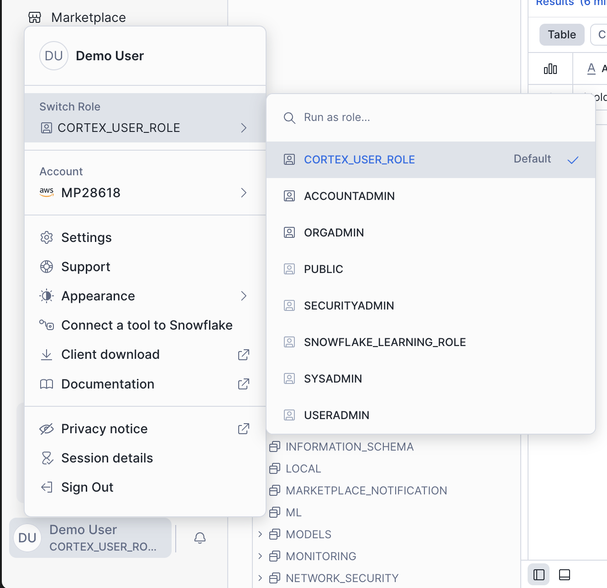
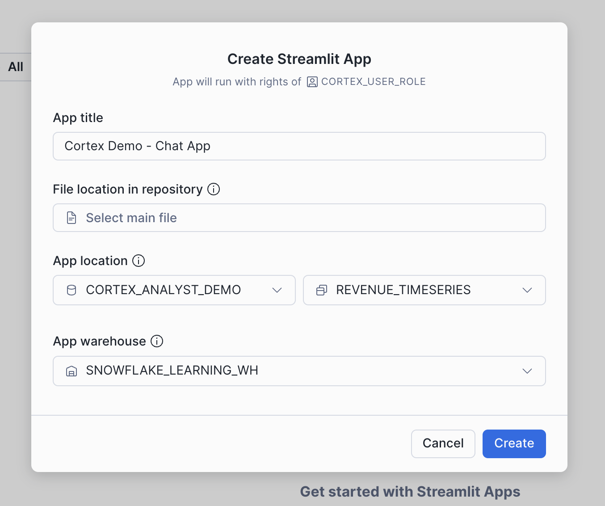
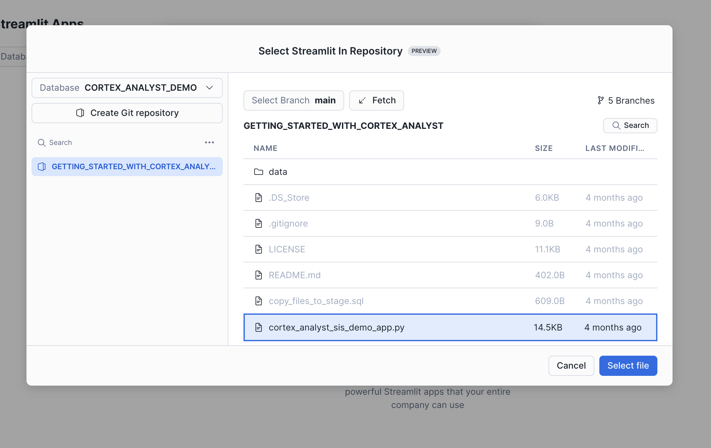

author: caleb-baechtold
id: getting-started-with-cortex-analyst
categories: snowflake-site:taxonomy/solution-center/certification/quickstart, snowflake-site:taxonomy/solution-center/certification/certified-solution, snowflake-site:taxonomy/product/ai, snowflake-site:taxonomy/snowflake-feature/cortex-analyst
language: en
summary: Through this quickstart guide, you will learn how to use Cortex Analyst to provide natural-language query interfaces to structured data in Snowflake using GenAI
environments: web
status: Published
feedback link: https://github.com/Snowflake-Labs/sfguides/issues

# Getting Started with Cortex Analyst: Augment BI with AI
<!-- ------------------------ -->
## Overview

Through this quickstart guide, you will explore how to get started with [Cortex Analyst](https://docs.snowflake.com/user-guide/snowflake-cortex/cortex-analyst), which is a fully managed service in Snowflake that provides a conversational interface to interact with structured data in Snowflake.

### What is Cortex Analyst?

Cortex Analyst is a fully managed service in [Cortex AI](/en/data-cloud/cortex) that provides a conversational interface to interact with structured data in Snowflake. It streamlines the development of intuitive, self-service analytics applications for business users, while providing industry-leading accuracy. To deliver high text-to-SQL accuracy, Cortex Analyst uses an agentic AI setup powered by state-of-the-art LLMs. Available as a convenient REST API, Cortex Analyst can seamlessly integrate into any application. This empowers developers to customize how and where business users interact with results, while still benefiting from Snowflake's integrated security and governance features, including role-based access controls (RBAC), to protect valuable data.


### Why use Cortex Analyst?
Historically, business users have primarily relied on BI dashboards and reports to answer their data questions. However, these resources often lack the flexibility needed, leaving users dependent on overburdened data analysts for updates or answers, which can take days. Cortex Analyst disrupts this cycle by providing a natural language interface with high text-to-SQL accuracy. With Cortex Analyst organizations can streamline the development of intuitive, conversational applications that can enable business users to ask questions using natural language and receive more accurate answers in near real time.

This quickstart will focus on getting started with Cortex Analyst, teaching the mechanics of how to interact with the Cortex Analyst service and how to define the Semantic Model definitions that enhance the precision of results from this conversational interface over your Snowflake data.

### What you will learn
- How to construct and configure a Semantic Model for your data
- How to call the Cortex Analyst REST API to use your Semantic Model to enable natural-language question-asking on top of your structured data in Snowflake via Streamlit in Snowflake (SiS) application
- How to integrate Cortex Analyst with Cortex Search to enhance SQL queries generated
- How to enable Join support for Star Schemas
- How to enable multi-turn conversations

### Prerequisites

- A [Snowflake account login](https://signup.snowflake.com/) with a role that has the ability to create database, schema, tables, stages, user-defined functions, and stored procedures. If not, you will need to register for a free trial account from any of the supported cloud regions or use a different role.

### What You’ll Build
- A Semantic Model over sample financial data
- A Streamlit in Snowflake (SiS) app with a conversational interface to Cortex Analyst


<!-- ------------------------ -->
## Set up the Snowflake environment

Create a blank SQL worksheet by navigating to *Projects -> Workspaces -> + Add New -> SQL File*. Call it `create_snowflake_objects.sql`. Copy the contents of [**create_snowflake_objects.sql**](https://github.com/Snowflake-Labs/sfguide-getting-started-with-cortex-analyst/blob/main/create_snowflake_objects.sql) into your new file. Then click *Run All*.

When the script has finished running, you should see:

|TYPE|CREATED_OBJECT|
|---|---|
|Git Repository|GETTING_STARTED_WITH_CORTEX_ANALYST|
|Search Service|PRODUCT_LINE_SEARCH_SERVICE|
|Table|DAILY_REVENUE|
|Table|PRODUCT_DIM|
|Table|REGION_DIM|
|Table rows: Products|5|
|Table rows: Regions|25|
|Table rows: Revenue days|730|


<aside class="negative">
<strong>NOTE:</strong><br> If you see `SQL compilation error: Database 'CORTEX_ANALYST_DEMO' does not exist or not authorized.`, then you probably clicked *Run* instead of *Run All*. *Run* just runs one statement, but we need to run the whole script.

Look for the dropdown next to the *Run* button, click it, then click *Run All*.
<aside>

<!-- ------------------------ -->
## Switch Role

The setup script has created a new role called `CORTEX_USER_ROLE`. You'll need to switch from `ACCOUNTADMIN` to `CORTEX_USER_ROLE` by clicking on your user icon in the bottom-right, selecting *Switch Role* and choosing `CORTEX_USER_ROLE`.



The setup script creates:

- The database, schema and role you'll need
- A connection to the demo GitHub repo, giving you access to the source code in Snowsight
- Some demo data tables and copies rows in from our sample CSV files
- A Cortex search service, that allows you and the chatbot to search product names intelligently

Feel free to explore the setup script and learn from it in your own time. For now, let's keep building.

<!-- ------------------------ -->
## Create a Streamlit Conversational App

Now, you will create a demo chat application to call the Cortex Analyst API and
ask natural-language questions over our structured revenue datasets. You
already have the source code available, because the setup script created a
connection to GitHub. To turn it into a running app:

- Go to *Projects -> Streamlit*

- Find the *+Streamlit App* button, click the dropdown and select *Create from Repository*

- Enter the *App Title*, *App Location* and *App Warehouse* as shown:



- Find *File location in repository* and click *Select main file*.

- Click *Select Database -> CORTEX_ANALYST_DEMO -> GETTING_STARTED_WITH_CORTEX_ANALYST -> cortex_analyst_sis_demo_app.py*:




After a few moments you should see the running app. You're ready to start asking questions!

Once you've explored the chat interface, take a look at the python code. In particular, take note of the `get_analyst_response` function. This is the function that takes our chat input prompt and history, packages it up as a JSON object, and sends it to the Cortex Analyst API (with the specified `revenue_timeseries.yaml` Semantic Model).

```python
def get_analyst_response(messages: List[Dict]) -> Tuple[Dict, Optional[str]]:
    """
    Send chat history to the Cortex Analyst API and return the response.

    Args:
        messages (List[Dict]): The conversation history.

    Returns:
        Optional[Dict]: The response from the Cortex Analyst API.
    """
    # Prepare the request body with the user's prompt
    request_body = {
        "messages": messages,
        "semantic_model_file": f"@{st.session_state.selected_semantic_model_path}",
    }

    # Send a POST request to the Cortex Analyst API endpoint
    # Adjusted to use positional arguments as per the API's requirement
    resp = _snowflake.send_snow_api_request(
        "POST",  # method
        API_ENDPOINT,  # path
        {},  # headers
        {},  # params
        request_body,  # body
        None,  # request_guid
        API_TIMEOUT,  # timeout in milliseconds
    )

    # Content is a string with serialized JSON object
    parsed_content = json.loads(resp["content"])

    # Check if the response is successful
    if resp["status"] < 400:
        # Return the content of the response as a JSON object
        return parsed_content, None
    else:
        # Craft readable error message
        error_msg = f"""
🚨 An Analyst API error has occurred 🚨

* response code: `{resp['status']}`
* request-id: `{parsed_content['request_id']}`
* error code: `{parsed_content['error_code']}`

Message: ```{parsed_content['message']}```
        """
        return parsed_content, error_msg
```

<!-- ------------------------ -->
## Semantic Model Details

The semantic model file [`revenue_timeseries.yaml`](https://github.com/Snowflake-Labs/sfguide-getting-started-with-cortex-analyst/blob/main/revenue_timeseries.yaml) is the key that unlocks Cortex Analyst's power. This YAML file dictates the tables, columns, etc. that Analyst can use in order to run queries that answer natural-language questions Let's talk a little about the details of this file:

The [Semantic Model](https://docs.snowflake.com/en/user-guide/snowflake-cortex/cortex-analyst/semantic-model-spec) is composed of a number of different fields that help Cortex Analyst understand the specifics of your data:
- Logical Tables which are composed of Logical Columns
- Logical Columns which are one of `dimensions`, `time_dimensions`, or `measures`
- Relationships that exist between tables to allow for JOINS

Logical Tables are relatively straightforward - these are tables or views within a database. That's it! Pretty simple

Logical Columns get a bit more complicated; a logical column can reference an underlying physical column in a table, or it can be a expression containing one or more physical columns. So, for example, in the [`revenue_timeseries.yaml`](https://github.com/Snowflake-Labs/sfguide-getting-started-with-cortex-analyst/blob/main/revenue_timeseries.yaml), we have a simple logical column `daily_revenue` that is a physical column. In the `daily_revenue` measure definition, you'll notice that we provide a description, as well as synonyms, data_type, and a default_aggregation, but no `expr` parameter. This is because `revenue` is simply a physical column in the `daily_revenue` table:

```yaml
measures:
  - name: daily_revenue
    expr: revenue
    description: total revenue for the given day
    synonyms: ["sales", "income"]
    default_aggregation: sum
    data_type: number
```

In contrast, we define a different measure `daily_profit` which is not in fact a physical column, but rather an expression of the difference between the `revenue` and `cogs` physical columns:

```yaml
  - name: daily_profit
    description: profit is the difference between revenue and expenses.
    expr: revenue - cogs
    data_type: number
```
In the semantic model, `time_dimensions` specifically capture temporal features of the data, and `dimensions` are not quantitative fields (e.g. quantitative fields are `measures`, while categorical fields are `dimensions`).

An example `time_dimension`:
```yaml
time_dimensions:
  - name: date
    expr: date
    description: date with measures of revenue, COGS, and forecasted revenue for each product line
    unique: false
    data_type: date
```

An example `dimension`:
```yaml
dimensions:
  - name: product_line
    expr: product_line
    description: product line associated with its own slice of revenue
    unique: false
    data_type: varchar
    sample_values:
      - Electronics
      - Clothing
      - Home Appliances
      - Toys
      - Books
```

An example `relationship`:
```yaml
relationships:
  - name: revenue_to_product
    left_table: daily_revenue
    right_table: product
    relationship_columns:
      - left_column: product_id
        right_column: product_id
    join_type: left_outer
    relationship_type: many_to_one
```

Here are some tips on building your own semantic model to use with Cortex Analyst:

When generating the semantic model, think from the end user perspective:
- For business user, accuracy and trust is the paramount
- Organize your YAML file in the unit of business domain/topic
- If you are trying to pull a snippet of this data into excel for your business stakeholder, what are the tabs and columns you’d keep? What are the column namings you’d use?
- Use above to guide your selection of tables and columns. Err on the side of only including necessary columns.
- We recommend not exceeding 3-5 tables, 10-20 columns each table to start.

Some additional items that’ll significantly improve model performance:
- Capture more difficult or more business-specific queries into expressions and verified queries (please use the Chat tab within Streamlit admin app to add verified queries)
  - Verified queries will be provided as few-shot example for model to draw inspiration from, hence significantly improve performance
  - If any organization specific logic cannot be captured via other spec items, we recommend you to add to verified queries.
- Start with a simple and small scope, gradually expanding. YAML building is an iterative process.

For more information about the semantic model, please refer to the [documentation](https://docs.snowflake.com/en/user-guide/snowflake-cortex/cortex-analyst/semantic-model-spec).

<!-- ------------------------ -->
## Using the Verified Query Repository (VQR)

In addition to the previously discussed Semantic Model information, the [Cortex Analyst Verified Query Repository (VQR)](https://docs.snowflake.com/user-guide/snowflake-cortex/cortex-analyst/verified-query-repository) can help improve accuracy and trustworthiness of results by providing a collection of questions and corresponding SQL queries to answer them. Cortex Analyst will then use these verified queries when answering similar types of questions in the future.

### Adding Verified Queries
Verified queries ultimately are specified in the `verified_queries` section of the semantic model, e.g.:
```yaml
verified_queries:
  - name: "lowest revenue each month"
    question: "For each month, what was the lowest daily revenue and on what date did that lowest revenue occur?"
    sql: |
        WITH monthly_min_revenue AS (
        SELECT
          DATE_TRUNC('MONTH', date) AS month,
          MIN(daily_revenue) AS min_revenue
        FROM daily_revenue
          GROUP BY
            DATE_TRUNC('MONTH', date)
        )
        SELECT
          mmr.month,
          mmr.min_revenue,
          dr.date AS min_revenue_date
        FROM monthly_min_revenue AS mmr JOIN daily_revenue AS dr
          ON mmr.month = DATE_TRUNC('MONTH', dr.date) AND mmr.min_revenue = dr.daily_revenue
        ORDER BY mmr.month DESC NULLS LAST
    verified_at: 1715187400
    verified_by: Jane
```

<aside class="positive">
<strong>NOTE:</strong><br> Eventually you'll want to create a semantic view for your own data. Snowsight has a number of tools to help you, and you can [get started here](https://docs.snowflake.com/en/user-guide/views-semantic/ui).
<aside>

<!-- ------------------------ -->
## Conclusion and Resources
Congratulations, you have successfully completed this quickstart! Through this quickstart, we were able to showcase how Cortex Analyst allows business users to ask natural-language questions over their structured data to perform analysis and receive trusted answers to business questions.

### What you learned
- How to create a semantic model YAML file
- How to interact with the Cortex Analyst REST API via a Streamlit in Snowflake (SiS) chat interface
- How to integrate Cortex Search with Cortex Analyst

For more information, check out the resources below:

### Related Resources
- [Source Code on GitHub](https://github.com/Snowflake-Labs/sfguide-getting-started-with-cortex-analyst)
- [Cortex Analyst docs](https://docs.snowflake.com/user-guide/snowflake-cortex/cortex-analyst)
- [Cortex Analyst examples](https://github.com/Snowflake-Labs/sf-samples/tree/main/samples/cortex-analyst)
- [Watch the Demo](https://youtu.be/eat-J-roEU8?list=TLGGeG7BOVuJNYUyMjA5MjAyNQ)

<!-- ------------------------ -->
