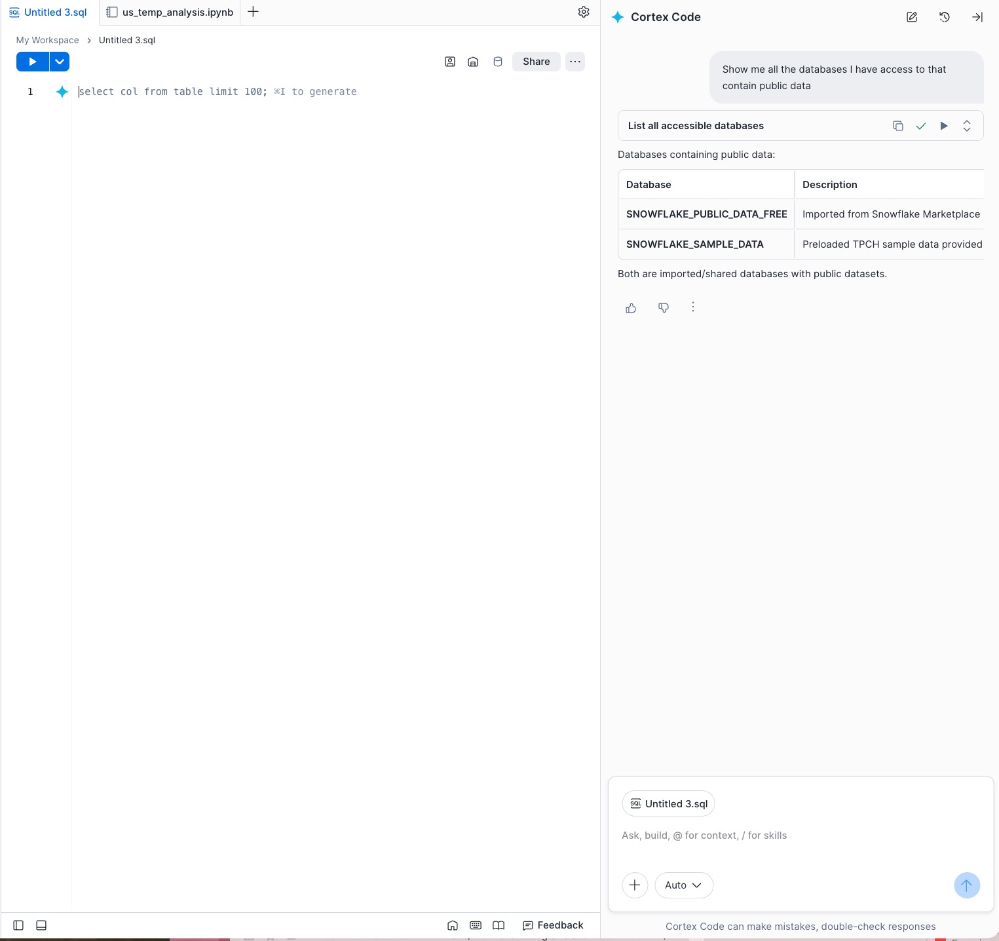
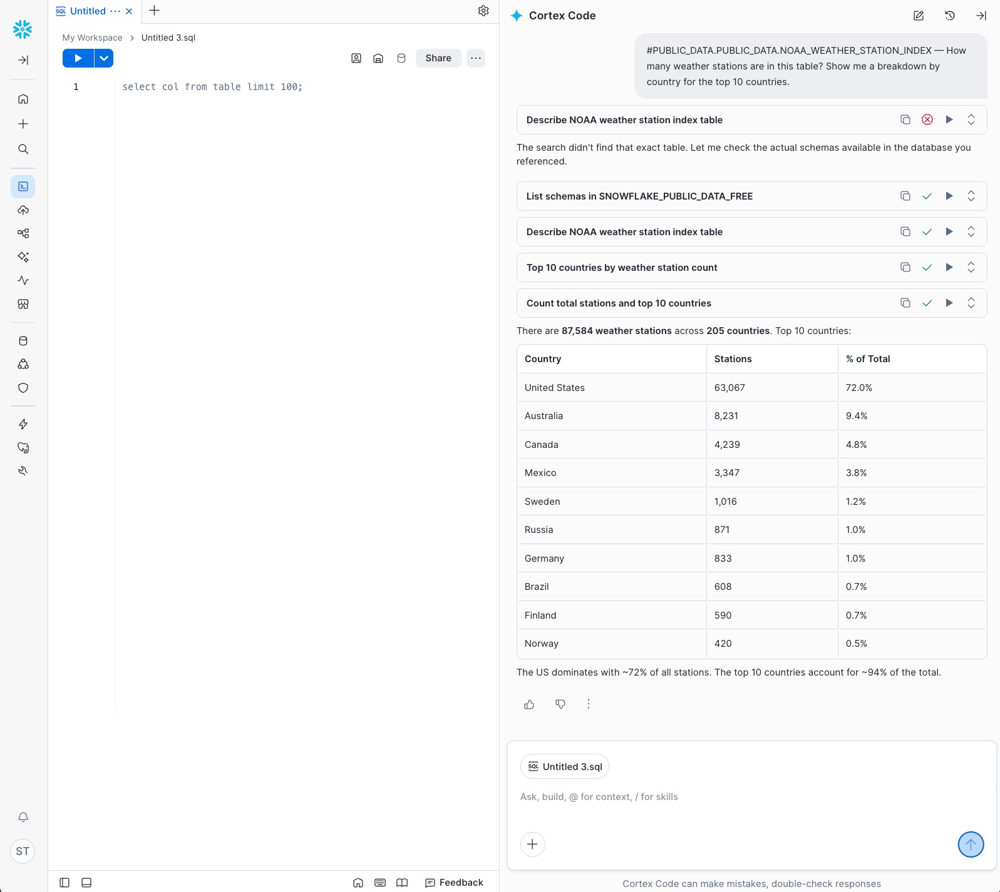
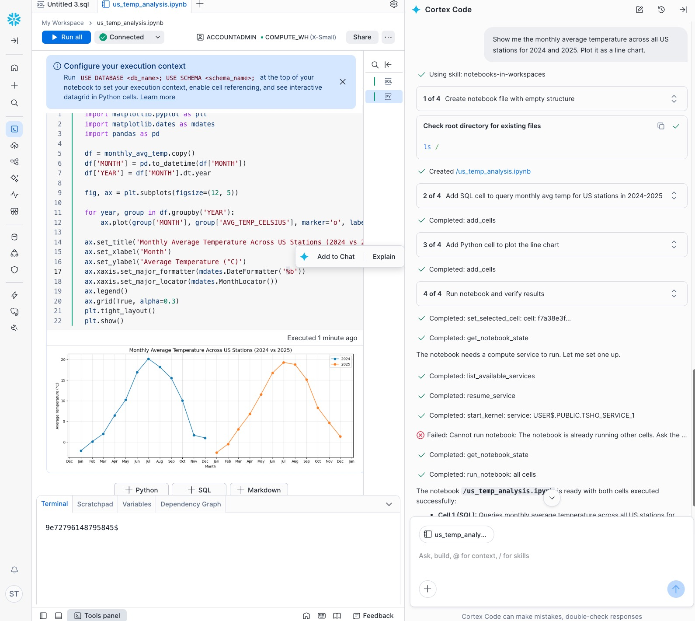
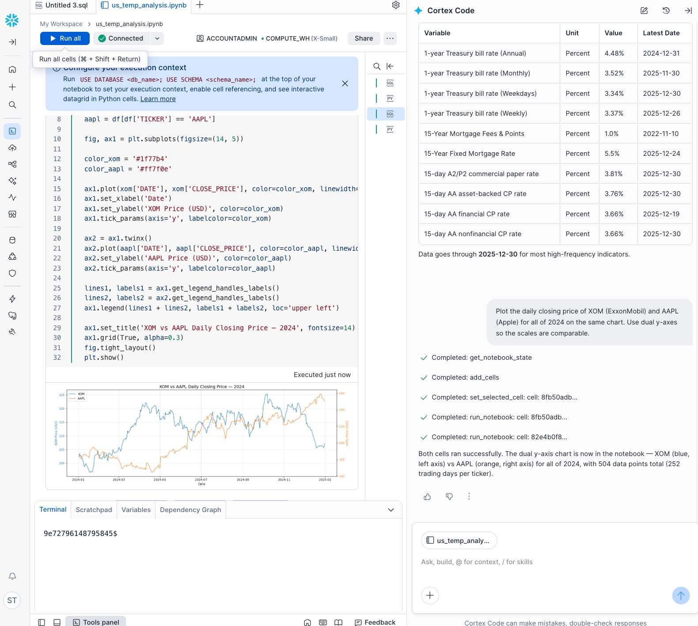
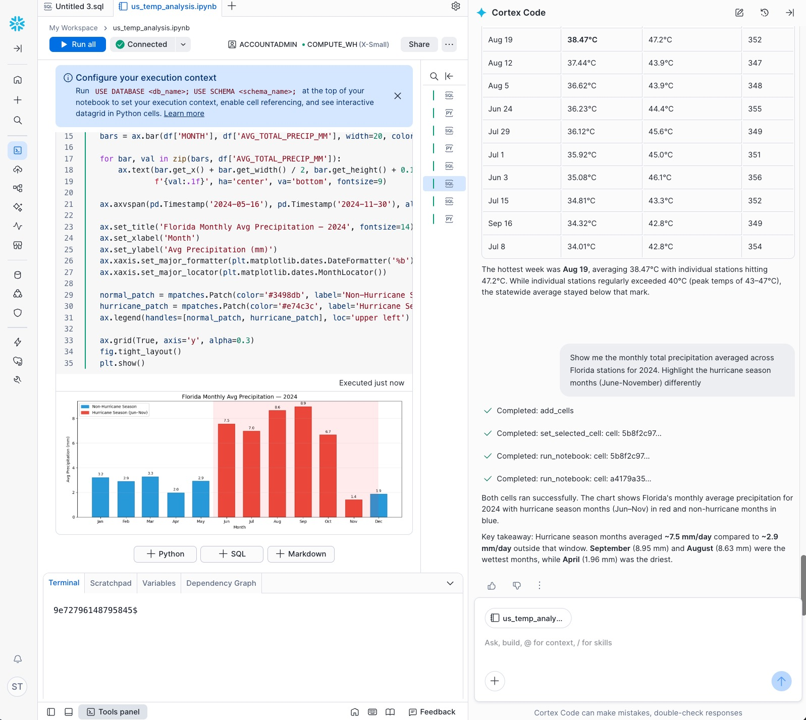
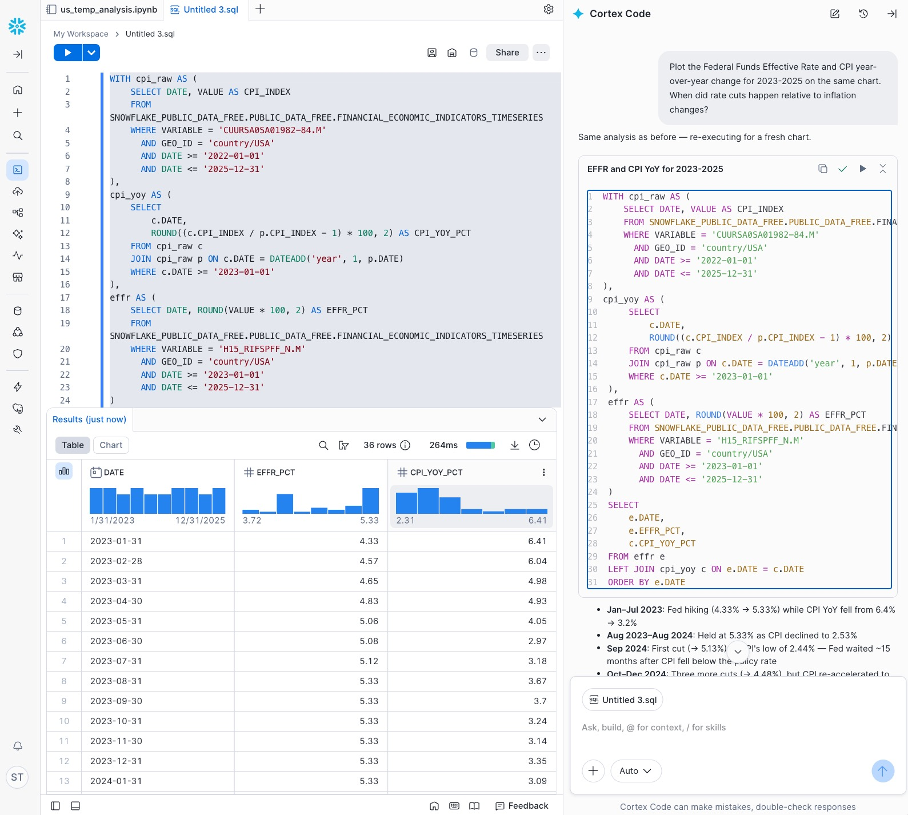
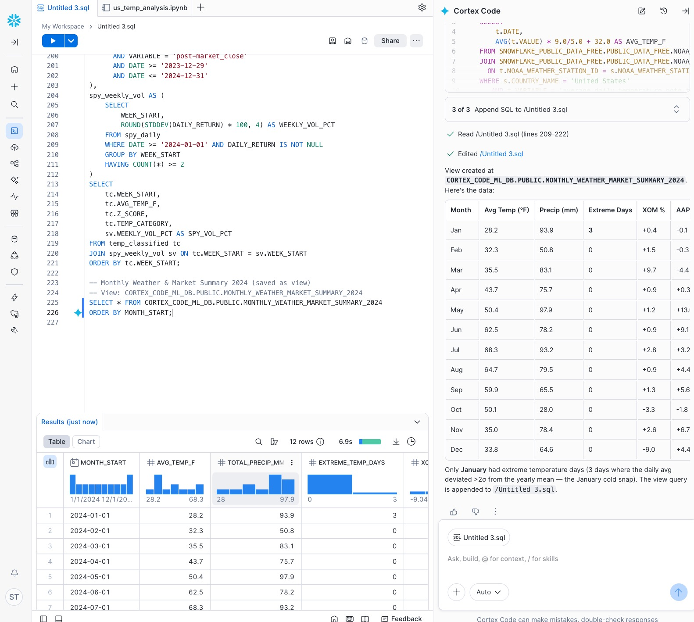

author: Sho Tanaka
id: getting-started-with-cortex-code-for-data-analysis
categories: snowflake-site:taxonomy/solution-center/certification/quickstart, snowflake-site:taxonomy/product/ai
language: en
summary: Use Cortex Code in Snowsight to explore, analyze, and correlate free Snowflake Marketplace weather and financial data with built-in visualizations.
environments: web
status: Published
feedback link: https://github.com/Snowflake-Labs/sfguides/issues


# Getting Started with Cortex Code for Data Analysis
<!-- ------------------------ -->
## Overview

Cortex Code is an AI-powered coding agent that helps you explore, analyze, and visualize data in Snowflake through natural language conversations. In this quickstart, you will use **Cortex Code in Snowsight** to work with real-world public datasets — weather observations from NOAA and financial market data from Nasdaq. Snowsight provides the most interactive experience with built-in chart rendering, Notebook cell creation, and a curated Python environment.

> **Note:** Cortex Code uses large language models (LLMs), so your generated SQL and results may differ from the screenshots in this guide. If you don’t get a result (or the answer looks incomplete), try sending the same prompt again.

You will start by getting free public data from the Snowflake Marketplace with zero-copy data sharing, then progressively build up from basic exploration to cross-domain correlation analysis and AI-powered summarization.

### What You Will Learn

- How to explore unfamiliar datasets using Cortex Code's `#table` syntax
- How to perform exploratory data analysis with natural language prompts
- How to join and correlate data across different domains (weather + finance)

### What You Will Build

An end-to-end data analysis workflow including:
- Weather pattern analysis across US states (temperature, precipitation, extreme events)
- Financial market analysis (stock price trends, volatility, economic indicators)
- Cross-domain correlation analysis (weather vs. energy stocks, weather vs. retail sales)

### Prerequisites

- Basic familiarity with SQL concepts (no advanced knowledge required)
- A [Snowflake account](https://signup.snowflake.com/?utm_source=snowflake-devrel&utm_medium=developer-guides&utm_cta=developer-guides) with a role that has the ability to create databases, schemas, tables, and stages. If not, you will need to register for a free trial account from any of the supported cloud regions or use a different role.
<!-- ------------------------ -->
## 1. Setup

### Open Cortex Code in Snowsight

1. Sign in to [Snowsight](https://app.snowflake.com).
2. Create or open a **Workspace** from the left navigation.
3. Open **Cortex Code** from the right-hand side panel.

For detailed instructions, refer to the [Cortex Code in Snowsight documentation](https://docs.snowflake.com/en/user-guide/cortex-code/cortex-code-snowsight).

### Get Snowflake Public Data (Free) from the Marketplace

This quickstart uses the **Snowflake Public Data (Free)** listing, which provides 90+ sources of public domain data in a single, zero-copy data share. No ETL, no pipelines — the data is live in your account the moment you click **Get**.

1. Go to the [Snowflake Public Data (Free)](https://app.snowflake.com/marketplace/listing/GZTSZ290BV255/) listing in the Marketplace.
2. Click **Get** and follow the prompts.
3. The data is now available as a shared database in your account (typically named `PUBLIC_DATA`).

> **Note:** The free tier has a ~3-month data lag. As of this writing, data covers through approximately Q4 2025 — perfect for historical analysis.

The datasets we will use:

| Source | Tables | What's Inside |
|--------|--------|---------------|
| **NOAA** | `noaa_weather_metrics_timeseries`, `noaa_weather_station_index` | Daily temperature, precipitation, snow, wind for 100K+ stations globally |
| **Nasdaq** | `stock_price_timeseries` | Daily open/close/high/low/volume for all US equities & ETFs |
| **Financial Indicators** | `financial_economic_indicators_timeseries`, `financial_economic_indicators_attributes` | CPI, GDP, interest rates, retail sales, natural gas prices |

### Verify Access

In the Cortex Code panel, try this prompt:

```
Show me all the databases I have access to that contain public data
```



Cortex Code will run a query and list your available databases, including the Marketplace share.

<!-- ------------------------ -->
## 2. Explore Weather Data

Let's start by understanding what weather data we have. Use the `#table` syntax to point Cortex Code at the NOAA tables — this tells it to inspect the schema and sample rows before answering.

### Explore the Weather Station Index

You can point Cortex Code at a table in two ways:
- Use the `#DATABASE.SCHEMA.TABLE` syntax in your prompt (recommended for clarity)
- Or click the **+** button in the Cortex Code panel to add a table as context

```
#PUBLIC_DATA.PUBLIC_DATA.NOAA_WEATHER_STATION_INDEX — How many weather stations are in this table? Show me a breakdown by country for the top 10 countries.
```



Cortex Code will query the table and show you the distribution of weather stations globally.

### Explore the Weather Timeseries

```
#PUBLIC_DATA.PUBLIC_DATA.NOAA_WEATHER_METRICS_TIMESERIES — What variables are available in this table? Show me the distinct variable names and a count of records for each.
```

This reveals the available weather metrics: temperature (avg, min, max), precipitation, snowfall, snow depth, wind speed, and more.

### Visualize US Temperature Trends

```
Show me the monthly average temperature across all US stations for 2024 and 2025. Plot it as a line chart.
```



Cortex Code generates the SQL, runs it, and produces a chart showing seasonal temperature patterns across the US.

<!-- ------------------------ -->
## 3. Explore Financial Data

Now let's get familiar with the financial datasets.

### Explore Stock Prices

```
#PUBLIC_DATA.PUBLIC_DATA.STOCK_PRICE_TIMESERIES — What columns and tickers are available? Show me the top 20 tickers by trading volume in the last available month.
```

### Explore Economic Indicators

```
#PUBLIC_DATA.PUBLIC_DATA.FINANCIAL_ECONOMIC_INDICATORS_TIMESERIES — What types of economic indicators are in this table? Show me 10 example variable names and their latest values.
```

### Chart Energy Stocks vs. Tech Stocks

Let's compare two sectors that might react differently to weather:

```
Plot the daily closing price of XOM (ExxonMobil) and AAPL (Apple) for all of 2024 on the same chart. Use dual y-axes so the scales are comparable.
```



This gives you a visual baseline for how these two sectors moved throughout the year.

<!-- ------------------------ -->
## 4. Analyze Weather Patterns
Duration: 5

Now let's dig into the weather data to find interesting patterns and extreme events.

### Find Extreme Cold Snaps

```
Find the top 10 coldest weeks in the US in 2024 by average minimum temperature. Show the week, the average min temp, and which states had the most stations reporting extreme cold (below -15°C).
```

### Identify Heat Waves

```
Find weeks in 2024 where the average maximum temperature across Texas stations exceeded 35°C. How many such weeks were there, and when did they occur?
```

### Seasonal Precipitation Patterns

```
Show me the monthly total precipitation averaged across Florida stations for 2024. Highlight the hurricane season months (June-November) differently.
```



These analyses reveal the weather events that might have impacted markets — cold snaps affecting energy demand, heat waves stressing power grids, and hurricane season disruptions.

<!-- ------------------------ -->
## 5. Analyze Financial Trends

Let's analyze the financial data to understand market behavior during the same period.

### Energy Sector Volatility

```
Calculate the weekly price volatility (standard deviation of daily returns) for XOM, CVX, and NEE for all of 2024. Plot them together as a line chart.
```

### Retail Sales Seasonality

```
Using the financial economic indicators table, show me monthly US retail sales for 2023 and 2024. Are there seasonal patterns? Highlight December and the summer months.
```

### Interest Rate and CPI Trends

```
Plot the Federal Funds Effective Rate and CPI year-over-year change for 2023-2025 on the same chart. When did rate cuts happen relative to inflation changes?
```



These financial analyses give us the "other side" of the correlation story — now we need to connect them.

<!-- ------------------------ -->
## 6. Correlate Weather and Finance

This is where it gets interesting. We will join weather and financial data to look for relationships.

### Temperature vs. Energy Stock Prices

```
Join weekly average temperature across all US stations with the weekly average closing price of XOM (ExxonMobil) for 2024. Calculate the Pearson correlation coefficient and plot both series on a dual-axis chart.
```

The hypothesis: extreme cold increases heating demand → higher energy prices → energy stocks rise.

### Precipitation vs. Retail Sales

```
Join monthly total precipitation averaged across US stations with monthly US retail sales from the economic indicators table for 2023-2024. Is there a correlation between rainy months and retail spending?
```

### Extreme Weather Events and Stock Volatility

```
Identify weeks in 2024 where the US average temperature deviated more than 2 standard deviations from the yearly mean. For those same weeks, calculate the average daily return volatility of the S&P 500 ETF (SPY). Compare to non-extreme weeks.
```

This analysis tests whether extreme weather events coincide with higher market volatility.

### Build a Weather Summary Table

```
Create a summary table that shows for each month in 2024: the average US temperature, total precipitation, number of extreme weather days (temp > 2 std dev from mean), and the monthly return of XOM, AAPL, and SPY. Save it as a view in my database.
```



<!-- ------------------------ -->
## 7. Conclusion and Resources

You have used Cortex Code in Snowsight to go from raw Marketplace data to cross-domain correlation analysis — all through natural language conversations with built-in visualizations.

### What You Learned

- How to get free public data from the Snowflake Marketplace with zero-copy data sharing
- How to explore unfamiliar datasets using Cortex Code's `#table` syntax
- How to perform weather and financial analysis using natural language prompts
- How to join and correlate data across different domains

### Key Takeaways

- **Zero-copy data sharing** means you can start analyzing Marketplace data in seconds — no ETL, no pipelines
- **Cortex Code in Snowsight** lets data analysts work iteratively with built-in charts: explore → hypothesize → test → summarize
- **Cross-domain analysis** is where the most interesting insights live — and Snowflake makes it easy to join data from different providers

### Related Resources

- [Cortex Code in Snowsight Documentation](https://docs.snowflake.com/en/user-guide/cortex-code/cortex-code-snowsight)
- [Cortex Code CLI Documentation](https://docs.snowflake.com/en/user-guide/cortex-code/cortex-code-cli)
- [Snowflake Public Data Documentation](https://data-docs.snowflake.com/)
- [Snowflake Public Data (Free) Marketplace Listing](https://app.snowflake.com/marketplace/listing/GZTSZ290BV255/)
