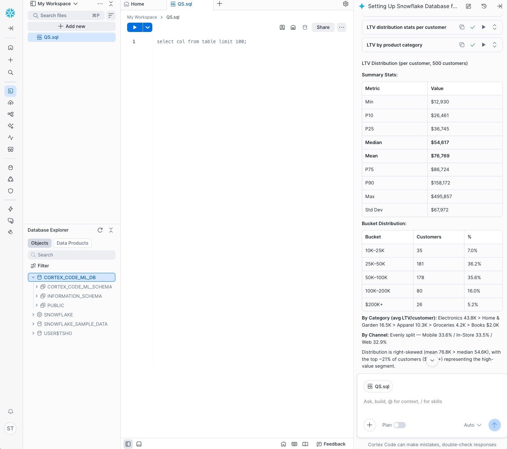
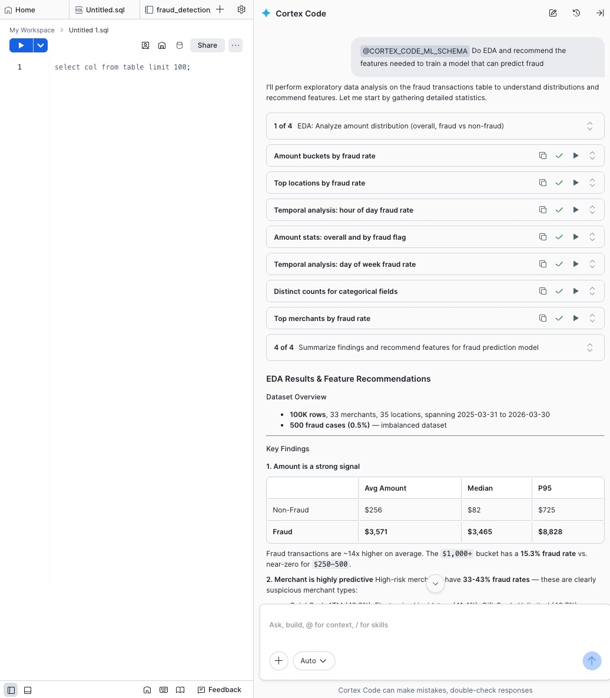
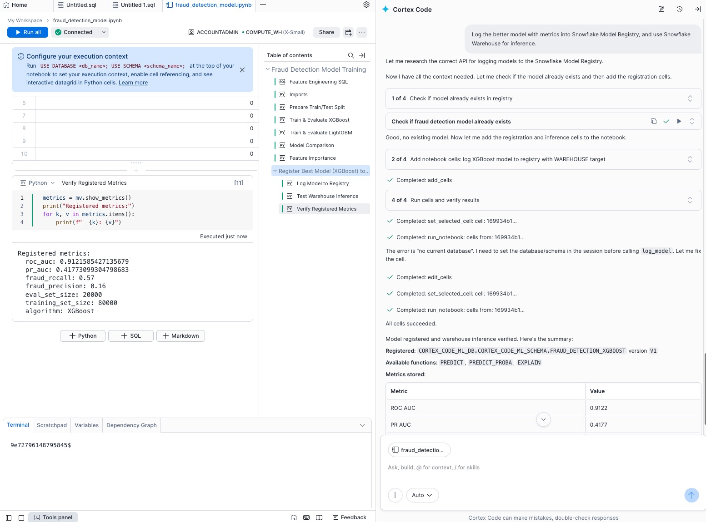
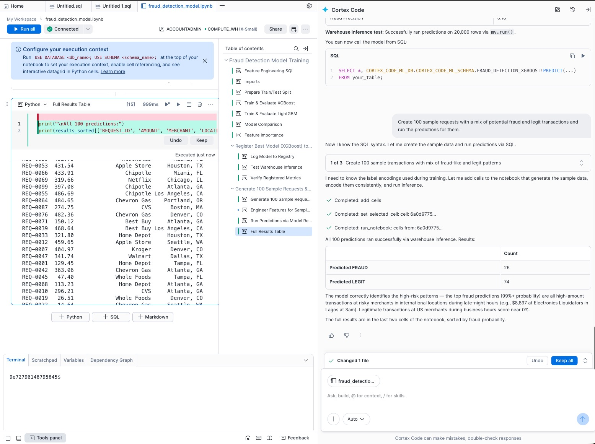

author: Pavan Pothukuchi, Caleb Baechtold, Lucy Zhu, Sho Tanaka
id: getting-started-with-cortex-code-in-snowsight-for-data-science-ml
summary: Learn how to build an end-to-end customer LTV prediction model — from EDA to batch or real-time inference — using Cortex Code and natural language prompts in Snowflake ML
categories: snowflake-site:taxonomy/solution-center/certification/quickstart, snowflake-site:taxonomy/product/ai
language: en
environments: web
status: Draft
feedback link: https://github.com/Snowflake-Labs/sfguides/issues
tags: Getting Started, Data Science, Machine Learning, Snowflake ML, Model Registry, SPCS, Cortex Code, LTV, Regression

# Getting Started with Cortex Code for Data Science ML
<!-- ------------------------ -->
## 1. Overview

[Snowflake ML](http://www.snowflake.com/ml) is changing how teams work with agentic ML, an autonomous, reasoning-based system that enables developers to use agents to plan and execute tasks across the entire ML pipeline. In this quickstart, learn how to build and run a customer lifetime value (LTV) prediction model with only a handful of prompts so that you can go from raw data to production predictions in minutes, not weeks, with [Cortex Code](https://www.snowflake.com/en/product/features/cortex-code/), Snowflake's AI native coding agent. Cortex Code is available both as a CLI and directly in Snowsight, Snowflake's web interface.

> **Important:** Cortex Code is powered by LLMs and is non-deterministic. The code it generates may differ from what is shown in this guide. Always review the output and verify that the results match your expectations before proceeding to the next step.

### What You'll Learn
- Generate realistic synthetic e-commerce data with natural language prompts
- Perform exploratory data analysis and feature engineering conversationally
- Train and compare multiple regression models inside Snowflake
- Log models with metrics to the Snowflake Model Registry
- Run batch inference on a Snowflake Warehouse
- (Optional) Deploy a model as a REST API on Snowpark Container Services (SPCS) for real-time inference

### What You'll Build
A complete customer LTV prediction pipeline featuring:
- Synthetic e-commerce transactions dataset (~500 customers, ~100,000 transactions over 18 months)
- Trained regression model predicting a customer's total spend in the next 90 days
- Registered model in the Snowflake Model Registry with evaluation metrics
- Batch inference predictions via Snowflake Warehouse
- (Optional) A real-time inference REST endpoint on SPCS with latency profiling

### Prerequisites
- Sign up for the 30-day [free trial](https://signup.snowflake.com/?utm_source=snowflake-devrel&utm_medium=developer-guides&utm_cta=developer-guides) of Snowflake. Have `ACCOUNTADMIN` role or a role with permissions to create databases, schemas, tables, and models
- [Cortex Code in Snowsight](https://docs.snowflake.com/en/user-guide/cortex-code/cortex-code-snowsight) (no local installation required) OR [Cortex Code CLI](https://docs.snowflake.com/en/user-guide/cortex-code/cortex-code-cli) installed and configured
- A dedicated Snowflake warehouse
- (Optional for SPCS) A compute pool configured for Snowpark Container Services
- Familiarity with basic ML concepts (training, evaluation, inference)

<!-- ------------------------ -->
## 2. Setup

### Cortex Code

[Cortex Code](https://docs.snowflake.com/en/user-guide/cortex-code/cortex-code) is an AI agent built into Snowflake, designed for data engineering, analytics, ML, and agent-building tasks. It operates autonomously within your Snowflake environment, leveraging deep knowledge of RBAC, schemas, and platform best practices.

It is available in two forms: within Snowsight and as a local CLI, bringing AI-assisted capabilities to wherever you work. Choose one (or both) below.

#### Option A — Cortex Code in Snowsight

1. Open a Workspace Notebook by going to the sidebar and clicking on Projects > Workspaces; then in the "My Workspace" panel, click on "+ Add new" > Notebook.

2. Once the notebook loads, look for Cortex Code in the lower-right corner of Snowsight.

> Note: Cortex Code is environment aware so using it in a Workspace Notebook will give the best results as it will have access to all the tools provided by the notebook. When relevant, generated code will be inserted into the notebook and run on your behalf.

#### Option B — Cortex Code CLI

Install the CLI:

```bash
curl -LsS https://ai.snowflake.com/static/cc-scripts/install.sh | sh
```

After installing, run `cortex` and follow the setup wizard to connect to your Snowflake account. For detailed instructions, refer to the [Cortex Code CLI documentation](https://docs.snowflake.com/en/user-guide/cortex-code/cortex-code-cli).

Verify your connection:

```
What role am I using and what databases can I access?
```

> **Tip**: Run Cortex Code CLI inside a VS Code or Cursor terminal to view generated Notebook files side-by-side.

### Optional - Select the Schema in Cortex Code

**Snowsight:** In your Workspace, open the **Cortex Code** panel on the right. Click **+** and select **CORTEX_CODE_ML_SCHEMA** (in `CORTEX_CODE_ML_DB`).

**CLI:** Use the `#` prefix to reference objects directly (e.g., `CORTEX_CODE_ML_DB.CORTEX_CODE_ML_SCHEMA.ML_LTV_TRANSACTIONS`). This grounds Cortex Code to the correct schema.

You are now ready to start prompting Cortex Code to build your ML pipeline.

<!-- ------------------------ -->
## 3. Generate Synthetic Data

First, let's create the database objects and generate synthetic e-commerce transaction data using Cortex Code.

### Prompt

```
Create a database CORTEX_CODE_ML_DB with schema CORTEX_CODE_ML_SCHEMA and
an XSMALL warehouse CORTEX_CODE_ML_WH. Then generate realistic looking
synthetic e-commerce transaction data. Create a table ML_LTV_TRANSACTIONS
with ~100000 transactions from ~500 customers over an 18-month period. Include
CUSTOMER_ID, TRANSACTION_TIME, AMOUNT, PRODUCT_CATEGORY, and CHANNEL. Make the
data realistic: customers should have varying purchase frequencies (some buy
weekly, others monthly), amounts should vary by category (electronics $50-$2000,
groceries $10-$200, apparel $20-$500), and channels should be web, mobile, or
in-store. About 10% of customers should be high-value (frequent buyers with
higher average spend).
```

> Replace `CORTEX_CODE_ML_DB.CORTEX_CODE_ML_SCHEMA` with your target database and schema if you have one.

If running Cortex Code CLI, paste the prompt directly into the terminal session. Cortex Code will analyze the request, generate a multi-step plan, and execute each step automatically.

If running Cortex Code on Snowsight, go ahead and enter the prompt in the chat panel on the right. Cortex Code analyzes the request and breaks it into a multi-step plan:


### What Gets Generated

Cortex Code generates the SQL or Python code to create the database objects and populate the table, then executes it automatically. In Snowsight, you will see the code and results appear in a new Notebook cell. In CLI, the output appears directly in the terminal.

Here's the generated output from Cortex Code on Snowsight:


The Cortex Code CLI output shows:

```
  Summary Statistics

  ┌───────────┬──────────┐
  │ Metric    │ Value    │
  ├───────────┼──────────┤
  │ Customers │ 500      │
  ├───────────┼──────────┤
  │ Min LTV   │ $12,930  │
  ├───────────┼──────────┤
  │ P25       │ $36,745  │
  ├───────────┼──────────┤
  │ Median    │ $54,617  │
  ├───────────┼──────────┤
  │ Mean      │ $76,769  │
  ├───────────┼──────────┤
  │ P75       │ $86,724  │
  ├───────────┼──────────┤
  │ Max       │ $495,857 │
  ├───────────┼──────────┤
  │ Std Dev   │ $67,972  │
  └───────────┴──────────┘

  Distribution (Histogram)

    LTV Range           Customers
    $12,930 - $36,868   126  █████████████████████████████████████
    $37,086 - $61,126   170  ██████████████████████████████████████████████████
    $61,382 - $84,439    74  ██████████████████████
    $85,925 - $109,095   35  ██████████
    $110,606 - $133,179  26  ████████
    $134,850 - $157,594  18  █████
    $158,039 - $181,760  19  ██████
    $182,181 - $206,059   7  ██
    $209,265 - $241,987  10  ███
    $257,600 - $283,419   5  █
    $345,815 - $387,939   7  ██
    $410,296 - $495,857   3  █
```

> Note: Due to the inherent randomness in how LLMs generate text, your results may vary slightly from what is shown in this tutorial.

> **Alternative:** If you prefer to load a pre-built dataset instead of generating data, see [Appendix A — Load Pre-Built Dataset from S3](#appendix-a-load-pre-built-dataset-from-s3) at the end of this guide.

<!-- ------------------------ -->
## 4. Explore the Data (EDA)

Before training a model, analyze patterns to identify the right features for predicting customer lifetime value.

### Prompt

```
Do exploratory data analysis and recommend the features needed to train a regression model that can predict each customer's total spend in the next 90 days.
```

> **CLI Tip:** Prefix the table with `#` (e.g., `#CORTEX_CODE_ML_DB.CORTEX_CODE_ML_SCHEMA.ML_LTV_TRANSACTIONS`) to ground the conversation to that specific object.

### What Gets Generated

Cortex Code first verifies the table and shows a summary (row count, customer count, date range, and category breakdown), then performs deeper analysis across multiple steps — purchase frequency, spending distributions, recency patterns, and category preferences — and summarizes key findings with recommended features.

If the table is empty (or missing), see [Appendix A](#appendix-a-load-pre-built-dataset-from-s3) to load the pre-built dataset and retry.


Cortex Code reads its built-in ML skill, detects the local Python environment, and runs the EDA in incremental steps:

```
> Do exploratory data analysis and recommend the features needed to train a regression model that can predict each customer's total spend in the next 90 days.

✓  SKILL  machine-learning
  **[REQUIRED]** For **ALL** data science and machine learning tasks. This skil...

✓  READ  /Users/shtanaka/.local/share/cortex/1.0.50+181048.6ef165b94127/bundled_skills/machine-learning/guides/cli-environment.md 194 lines

✓  READ  /Users/shtanaka/.local/share/cortex/1.0.50+181048.6ef165b94127/bundled_skills/machine-learning/ml-development/SKILL.md 279 lines

* Let me set up the environment and build a comprehensive EDA script. First, let me detect the Python environment and prepare the session helper.

✓  BASH  which uv
  └─ /Users/shtanaka/.local/bin/uv

✓  BASH  cortex env detect
  ├─ {
  ├─ "directory": "/Users/shtanaka/project/sfquickstarts",
  └─ ... (2 more lines)
```

Create a virtual env and setup the helper:
```
* I need to create a virtual environment and set up the session helper. Let me copy the session helper and create the venv.

✓  BASH  cp /Users/shtanaka/.local/share/cortex/1.0.50+181048.6ef165b94127/bundled_skills/machine-learning...
  └─ Command completed with exit code 0

✓  BASH  uv venv /Users/shtanaka/project/sfquickstarts/.venv --python 3.10 2>&1
  ├─ Using CPython 3.10.11 interpreter at: /usr/local/bin/python3.10
  ├─ Creating virtual environment at: .venv
  └─ ... (1 more line)

✓  BASH  uv pip install --python /Users/shtanaka/project/sfquickstarts/.venv/bin/python snowflake-ml-pytho...
  ├─ + urllib3==2.6.3
  ├─ + wheel==0.46.3
  └─ ... (3 more lines)

* Good, environment is set up. Let me verify connectivity and mark step 1 done.

✓  BASH  SNOWFLAKE_CONNECTION_NAME=GJGSBEE-FQ24733 /Users/shtanaka/project/sfquickstarts/.venv/bin/python ...
  ├─ Creating Snowpark session...
  ├─ ✅ Connected successfully!
  └─ ... (8 more lines)

```

In virtual env, Python script will be excuted.
```
Connection works. Let me mark step 1 done and write the EDA script.

* Now let me write a comprehensive EDA script. I already have the basic stats from earlier SQL queries, so the Python script will focus on deeper analysis: distributions, correlations, temporal patterns, and customer-level
  behavioral segmentation — all aimed at informing features for a 90-day spend regression model.

✓  WRITE  /Users/shtanaka/project/sfquickstarts/eda_ltv.py +330

* I've written the EDA script. Here's what it does:

  1. Loads all 96K rows from ML_LTV_TRANSACTIONS
  2. Splits into a feature window and a 90-day label window (target = total spend in last 90 days)
  3. Engineers 25+ customer-level features: RFM, tempo, category/channel shares, trends
  4. Generates 9 plots: target distribution, category boxplots, monthly trends, correlation bars, heatmap, scatter plots, LTV distribution, share distributions, and RF feature importance
  5. Fits a quick Random Forest to rank feature importance and report 5-fold CV R²

  All plots saved to eda_output/. Ready to execute?

✓  ASK_USER_QUESTION 

✓  BASH  SNOWFLAKE_CONNECTION_NAME=GJGSBEE-FQ24733 /Users/shtanaka/project/sfquickstarts/.venv/bin/python ...
  ├─ Connecting to Snowflake...
  ├─ Loading ML_LTV_TRANSACTIONS...
  └─ ... (99 more lines)


* EDA ran successfully. Let me view the key plots and then compile the findings.

* Let me view the key plots to incorporate into the final analysis.

✓  READ  /Users/shtanaka/project/sfquickstarts/eda_output/09_feature_importance_rf.png

✓  READ  /Users/shtanaka/project/sfquickstarts/eda_output/04_correlation_with_target.png

✓  READ  /Users/shtanaka/project/sfquickstarts/eda_output/01_target_distribution.png

✓  READ  /Users/shtanaka/project/sfquickstarts/eda_output/03_monthly_trends.png

✓  READ  /Users/shtanaka/project/sfquickstarts/eda_output/06_scatter_vs_target.png

✓  READ  /Users/shtanaka/project/sfquickstarts/eda_output/05_top_feature_heatmap.png

* Now I have all the data to compile the final recommendations. Let me mark the remaining steps done.

✓  TODO  task done

* ────────────────────────────────────────
```

Show dataset overview

```
* ────────────────────────────────────────

  EDA Results and Feature Recommendations

  Dataset Overview

  • 96,264 transactions, 500 customers, 18 months (2024-07-01 to 2025-12-30)
  • Zero nulls across all 5 columns
  • Feature/label split: 80,491 rows for features (before Oct 1, 2025), 15,773 rows for the 90-day target window

  Key EDA Findings

  Target variable (90-day spend):

  • Right-skewed: median $8,767 vs mean $12,595 — a log transform produces a more normal shape
  • Range: $1,265 to $85,492
  • Consider training on log(target) and exponentiating predictions

  Monthly trends:

  • Remarkably stable ~$2.1M/month with no clear seasonality or drift
  • All 500 customers active every month — no churn signal in this dataset

  Correlation analysis reveals two dominant signal families:

  1. Monetary features (r = 0.73–0.93): TOTAL_SPEND, SPEND_90D, STDDEV_TXN_AMOUNT, AVG_TXN_AMOUNT
  2. Frequency features (r = 0.58–0.72): TXN_COUNT, TXN_COUNT_90D, TXN_COUNT_30D

  Negative correlations also informative:

  • AVG_INTER_PURCHASE_DAYS (r = -0.56): slower buyers spend less
  • SHARE_BOOKS_AND_MEDIA (r = -0.26), SHARE_GROCERIES (r = -0.22): low-AOV categories dilute spend

  Multicollinearity warning (from heatmap):

  • TOTAL_SPEND ↔ SPEND_90D (0.95), AVG_TXN_AMOUNT ↔ STDDEV_TXN_AMOUNT (0.92), TXN_COUNT ↔ TXN_COUNT_90D (0.93)
  • Tree models handle this well, but linear models will need feature selection or regularization

  Random Forest baseline: 5-fold CV R² = 0.646 — decent signal with room to improve via better feature engineering and model tuning.

  ────────────────────────────────────────

  Recommended Features for 90-Day Spend Regression

  Based on correlation analysis, RF importance, and multicollinearity patterns, here are the features organized by priority:

  Tier 1 — Strongest Predictors (include all)

  ┌───────────────────┬─────────────┬───────────────┬────────────────────────────────────────────────────┐
  │ Feature           │ Correlation │ RF Importance │ Rationale                                          │
  ├───────────────────┼─────────────┼───────────────┼────────────────────────────────────────────────────┤
  │ TOTAL_SPEND       │ 0.93        │ 0.741         │ Dominant predictor — lifetime monetary value       │
  ├───────────────────┼─────────────┼───────────────┼────────────────────────────────────────────────────┤
  │ SPEND_90D         │ 0.88        │ 0.041         │ Recent spending momentum                           │
  ├───────────────────┼─────────────┼───────────────┼────────────────────────────────────────────────────┤
  │ STDDEV_TXN_AMOUNT │ 0.81        │ 0.054         │ Spend volatility — distinguishes big-ticket buyers │
  ├───────────────────┼─────────────┼───────────────┼────────────────────────────────────────────────────┤
  │ AVG_TXN_AMOUNT    │ 0.79        │ 0.021         │ Average basket size                                │
  ├───────────────────┼─────────────┼───────────────┼────────────────────────────────────────────────────┤
  │ SPEND_30D         │ 0.78        │ 0.004         │ Very recent spending signal                        │
  └───────────────────┴─────────────┴───────────────┴────────────────────────────────────────────────────┘

  Tier 2 — Strong Secondary Signals

  ┌─────────────────────────┬─────────────┬────────────────────────────────────────────────────────────┐
  │ Feature                 │ Correlation │ Rationale                                                  │
  ├─────────────────────────┼─────────────┼────────────────────────────────────────────────────────────┤
  │ MAX_TXN_AMOUNT          │ 0.74        │ Captures high-value purchase potential                     │
  ├─────────────────────────┼─────────────┼────────────────────────────────────────────────────────────┤
  │ MEDIAN_TXN_AMOUNT       │ 0.73        │ Robust central tendency (less outlier-sensitive than mean) │
  ├─────────────────────────┼─────────────┼────────────────────────────────────────────────────────────┤
  │ TXN_COUNT               │ 0.72        │ Overall engagement level                                   │
  ├─────────────────────────┼─────────────┼────────────────────────────────────────────────────────────┤
  │ TXN_COUNT_90D           │ 0.68        │ Recent frequency                                           │
  ├─────────────────────────┼─────────────┼────────────────────────────────────────────────────────────┤
  │ TXN_COUNT_30D           │ 0.58        │ Very recent frequency                                      │
  ├─────────────────────────┼─────────────┼────────────────────────────────────────────────────────────┤
  │ AVG_INTER_PURCHASE_DAYS │ -0.56       │ Purchase cadence (lower = more frequent = higher spend)    │
  ├─────────────────────────┼─────────────┼────────────────────────────────────────────────────────────┤
  │ RECENCY_DAYS            │ -0.16       │ Days since last purchase                                   │
  └─────────────────────────┴─────────────┴────────────────────────────────────────────────────────────┘

  Tier 3 — Category & Channel Mix

  ┌────────────────────────┬─────────────┬─────────────────────────────────────────────────────────────┐
  │ Feature                │ Correlation │ Rationale                                                   │
  ├────────────────────────┼─────────────┼─────────────────────────────────────────────────────────────┤
  │ SHARE_ELECTRONICS      │ 0.35        │ Electronics has 10x the AOV of Books — category mix matters │
  ├────────────────────────┼─────────────┼─────────────────────────────────────────────────────────────┤
  │ DOMINANT_CAT_SHARE     │ 0.41        │ Category concentration signals high-AOV specialization      │
  ├────────────────────────┼─────────────┼─────────────────────────────────────────────────────────────┤
  │ SHARE_BOOKS_AND_MEDIA  │ -0.26       │ Negative signal — low-AOV category                          │
  ├────────────────────────┼─────────────┼─────────────────────────────────────────────────────────────┤
  │ SHARE_GROCERIES        │ -0.22       │ Negative signal — low-AOV category                          │
  ├────────────────────────┼─────────────┼─────────────────────────────────────────────────────────────┤
  │ SHARE_APPAREL          │ -0.16       │ Mild negative                                               │
  ├────────────────────────┼─────────────┼─────────────────────────────────────────────────────────────┤
  │ DOMINANT_CHANNEL_SHARE │ ~0          │ Keep for tree models — captures channel preference strength │
  └────────────────────────┴─────────────┴─────────────────────────────────────────────────────────────┘

  Tier 4 — Trend & Tempo

  ┌────────────────────────────────────────────┬───────────────────────────────────────┐
  │ Feature                                    │ Rationale                             │
  ├────────────────────────────────────────────┼───────────────────────────────────────┤
  │ SPEND_TREND (spend_30d / spend_90d)        │ Acceleration/deceleration of spending │
  ├────────────────────────────────────────────┼───────────────────────────────────────┤
  │ FREQ_TREND (txn_count_30d / txn_count_90d) │ Frequency acceleration                │
  ├────────────────────────────────────────────┼───────────────────────────────────────┤
  │ TENURE_DAYS                                │ Customer maturity                     │
  ├────────────────────────────────────────────┼───────────────────────────────────────┤
  │ ACTIVE_MONTHS                              │ Engagement breadth                    │
  └────────────────────────────────────────────┴───────────────────────────────────────┘

```




In this example, Cortex Code identifies signals such as purchase frequency trends, average order value by customer segment, recency of last purchase, and preferred product categories. These insights translate into features like total_transactions, avg_amount, days_since_last_purchase, favorite_category, and channel_distribution.

The EDA step typically reveals patterns such as:
- High-value customers purchase more frequently and have higher average order values
- Recency of last purchase is a strong predictor of future spend
- Certain product categories correlate with higher lifetime value
- Channel preferences (web vs. mobile vs. in-store) vary across customer segments

Cortex Code will recommend features to use in the model based on these findings.

<!-- ------------------------ -->
## 5. Train the Model

With our features identified, we can now train a regression model. XGBoost and Random Forest are excellent choices for this kind of tabular prediction task.

### Prompt

```
Build those features and train a regression model to predict each customer's total spend in the next 90 days. Use two different algorithms, XGBoost and Random Forest, and evaluate the best one. Use 20% of the data as the eval set.
```

### What Gets Generated

Cortex Code typically creates a Notebook, generates feature engineering steps, trains two models, and reports evaluation metrics so you can choose the best performer.

Cortex Code CLI shows:

```

> Build those features and train a regression model to predict each customer's total spend in the next 90 days. Use two different algorithms and evaluate the best one. Use 20% of the data as the eval set.

✓  ASK_USER_QUESTION 

✓  ASK_USER_QUESTION 

✓  READ  /Users/shtanaka/.local/share/cortex/1.0.50+181048.6ef165b94127/bundled_skills/machine-learning/experiment-tracking/SKILL.md 456 lines

* Good, I have all the context I need. Let me write the training script with XGBoost (autologging) and Random Forest (manual logging), experiment tracking, and model serialization.

✓  WRITE  /Users/shtanaka/project/sfquickstarts/train_ltv_model.py +358


* I've written the training script to train_ltv_model.py. Here's what it does:

  • Features: Builds all 28 features from the EDA (RFM, spend windows, tempo, category/channel shares, trends)
  • Split: 80% train / 20% eval (random_state=42)
  • Model 1 — XGBoost: 500 trees, lr=0.05, early stopping at 30 rounds, autologging via SnowflakeXgboostCallback
  • Model 2 — Random Forest: 500 trees, max_depth=15, manual logging
  • Experiment tracking: Both runs logged to LTV_90D_SPEND_PREDICTION in CORTEX_CODE_ML_DB.CORTEX_CODE_ML_SCHEMA
  • Output: Best model saved as best_ltv_model.pkl, plus 3 diagnostic plots (actual vs predicted, residuals, feature importance comparison)
```

Download library if your local env didn't installed esseintial library.
```
 Running now.

×  BASH  SNOWFLAKE_CONNECTION_NAME=GJGSBEE-FQ24733 /Users/shtanaka/project/sfquickstarts/.venv/bin/python ...
  ├─ File "/Users/shtanaka/project/sfquickstarts/train_ltv_model.py", line 27, in ...
  ├─ from xgboost import XGBRegressor
  └─ ... (18 more lines)

* XGBoost needs the OpenMP runtime library. Let me install it.

✓  BASH  brew install libomp 2>&1
  ├─ ✔︎ JSON API cask.jws.json
  ├─ ✔︎ JSON API formula.jws.json
  └─ ... (107 more lines)

* OpenMP installed. Let me re-run the training script.

✓  BASH  SNOWFLAKE_CONNECTION_NAME=GJGSBEE-FQ24733 /Users/shtanaka/project/sfquickstarts/.venv/bin/python ...
  ├─ Connecting to Snowflake...
  ├─ Loading ML_LTV_TRANSACTIONS...
  └─ ... (44 more lines)


* Training complete. Let me mark the step done and view the diagnostic plots.

✓  READ  /Users/shtanaka/project/sfquickstarts/eda_output/12_feature_importance_comparison.png

✓  READ  /Users/shtanaka/project/sfquickstarts/eda_output/10_actual_vs_predicted.png

✓  READ  /Users/shtanaka/project/sfquickstarts/eda_output/11_residual_distributions.png
```

Model comparison between XGBoost and Random Forest results.

```
* Results

  Model Comparison (20% Eval Set — 100 customers)

  ┌────────┬─────────┬───────────────┬──────────────────────────┐
  │ Metric │ XGBoost │ Random Forest │ Winner                   │
  ├────────┼─────────┼───────────────┼──────────────────────────┤
  │ R²     │ 0.8088  │ 0.7872        │ XGBoost                  │
  ├────────┼─────────┼───────────────┼──────────────────────────┤
  │ RMSE   │ $3,782  │ $3,989        │ XGBoost                  │
  ├────────┼─────────┼───────────────┼──────────────────────────┤
  │ MAE    │ $2,791  │ $2,787        │ Random Forest (marginal) │
  ├────────┼─────────┼───────────────┼──────────────────────────┤
  │ MAPE   │ 37.86%  │ 32.86%        │ Random Forest            │
  └────────┴─────────┴───────────────┴──────────────────────────┘

  Best Model: XGBoost (by R²)

  XGBoost wins on R² and RMSE (variance explained and overall error magnitude). Random Forest has a slight edge on MAE and MAPE, meaning it's more accurate in percentage terms on typical customers — but XGBoost handles the
  high-spend outliers better.

  Feature Importance (Both Models Agree)

  Both models rank the same top 3 features:

  1. TOTAL_SPEND — dominant predictor in both (0.28 XGB, 0.53 RF)
  2. SPEND_90D — recent 90-day spend
  3. MAX_TXN_AMOUNT — high-value purchase potential

  XGBoost distributes importance more evenly across features, while Random Forest concentrates heavily on TOTAL_SPEND.

  Diagnostics

  • Actual vs Predicted: Both models track the diagonal well for low-to-mid spenders. XGBoost handles the upper range better.
  • Residuals: Both are roughly centered at zero with slight left skew — the models tend to underpredict for high spenders. MAE of ~$2,800 on a median target of $8,767 is reasonable.
```


In this example, Cortex Code generates Python for feature engineering (aggregating per-customer metrics from the transaction history), runs training/evaluation steps, and produces a comparison section (metrics like RMSE, MAE, and R-squared) to help you pick the best model.

Cortex Code will:
1. Engineer the features based on the EDA recommendations (per-customer aggregations over the training window)
2. Split the data into training (80%) and evaluation (20%) sets
3. Train two different regression algorithms (e.g., XGBoost and LightGBM)
4. Compare their performance using metrics such as RMSE, MAE, and R-squared
5. Recommend the better-performing model

Review the evaluation metrics to confirm the model meets your requirements before proceeding.

<!-- ------------------------ -->
## 6. Log to Model Registry and Run Inference

Now register the better model to the Snowflake Model Registry and run batch inference.

### Prompt

```
Log the better model with metrics into Snowflake Model Registry, and use Snowflake Warehouse for inference.
```

Cortex Code handles the `log_model()` call with appropriate parameters including model metrics, sample input for schema inference, and the target platform set to `WAREHOUSE`.



Then generate predictions:

### Prompt

```
Create feature profiles for 50 customers and run LTV predictions for them. Show the top 10 highest predicted LTV customers.
```

Cortex Code generates the customer feature profiles, runs inference via your Snowflake Warehouse, and displays the predicted 90-day spend for each customer (sorted by highest predicted LTV).



> **Optional:** To deploy the model as a real-time REST endpoint on SPCS instead, see [Appendix B — Real-Time Inference on SPCS](#appendix-b-real-time-inference-on-spcs) at the end of this guide.


## 7. Real-Time Inference on SPCS
If you are using Cortex Code CLI, as an alternative to batch inference on a Snowflake Warehouse, you can deploy the model as a REST endpoint on Snowpark Container Services (SPCS) for real-time inference.

> **Prerequisite:** A compute pool configured for Snowpark Container Services.

### Prompt

```
Log the better model with metrics into Snowflake Model Registry, and use SPCS to create a REST endpoint for online inference.
```

Cortex Code handles the `log_model()` call with the target platform set to `SNOWPARK_CONTAINER_SERVICES`, then creates the SPCS service and endpoint for real-time inference.

Then test the endpoint with latency profiling:

### Prompt

```
Create feature profiles for 50 customers and run LTV predictions using the REST API for online inference running on SPCS. Show the top 10 highest predicted LTV customers and a latency profile (p50, p95, p99).
```

Cortex Code sends HTTP requests to the SPCS REST endpoint and displays results including:
- Predicted 90-day spend for each customer profile
- Per-request latency measurements
- A latency profile summary (p50, p95, p99) to help you understand the real-time performance characteristics of your deployment


<!-- ------------------------ -->
## 8. Debug and Recover from Errors

During any natural language coding session, errors are inevitable. The great thing about Cortex Code is its ability to self-correct by assessing the situation, environment, and error to fix issues automatically.

### Common Scenarios

**Model Registration Errors**

When `log_model()` fails due to parameter issues (e.g., target platform mismatch), Cortex Code diagnoses the error and re-registers the model with corrected parameters automatically.

**Notebook Execution Issues**

When a cell fails due to missing imports or data type mismatches, Cortex Code detects the issue, adjusts the code, and re-executes the cell.

**Feature Engineering Errors**

If a feature column is missing or a SQL view fails, Cortex Code investigates the schema, identifies the root cause, and regenerates the feature engineering step.

**Missing Python Binary (CLI)**

When `python` isn't found on the system, Cortex Code locates `python3` and retries automatically.

### Best Practices

1. Start with `ACCOUNTADMIN` for initial setup, then create dedicated roles
2. Monitor compute pool resources during SPCS deployment
3. Review Cortex Code's explanations when it makes corrections
4. Use the Snowsight Notebook environment for the best interactive experience with visualizations


<!-- ------------------------ -->
## 9. Conclusion And Resources

Congratulations! You've successfully built a complete customer LTV prediction model using only a handful of natural language prompts in [Snowflake ML](http://www.snowflake.com/ml).

### What You Learned
- Generate realistic synthetic e-commerce data with natural language prompts
- Perform comprehensive exploratory data analysis with automated feature recommendations
- Train and compare multiple regression models for LTV prediction
- Log models with metrics to the Snowflake Model Registry
- Run batch inference on a Snowflake Warehouse
- Deploy a model as a REST API on SPCS for real-time inference

### Related Resources

Web pages:
- [Snowflake ML](http://www.snowflake.com/ml) - Integrated set of capabilities for development, MLOps and inference leading with agentic ML
- [Snowflake Notebooks](https://www.snowflake.com/en/product/features/notebooks/) - Jupyter-based notebooks in Snowflake Workspaces
- [Cortex Code](https://www.snowflake.com/en/product/features/cortex-code/) - Snowflake's AI native coding agent that boosts ML productivity

Technical Documentation:
- [Snowflake ML Documentation](https://docs.snowflake.com/en/developer-guide/snowflake-ml/overview) - Official Snowflake ML developer guide
- [Cortex Code Documentation](https://docs.snowflake.com/en/user-guide/cortex-code/cortex-code) - Getting started with Cortex Code
- [Cortex Code in Snowsight](https://docs.snowflake.com/en/user-guide/cortex-code/cortex-code-snowsight) - Browser-based experience
- [Cortex Code CLI](https://docs.snowflake.com/en/user-guide/cortex-code/cortex-code-cli) - Command-line experience
- [Snowflake Model Registry](https://docs.snowflake.com/en/developer-guide/snowflake-ml/model-registry/overview) - Register, version, and deploy ML models
- [Snowpark Container Services](https://docs.snowflake.com/en/developer-guide/snowpark-container-services/overview) - Deploy and manage containerized workloads

<!-- ------------------------ -->
## Appendix A — Load Pre-Built Dataset from S3

If you prefer to load a pre-built dataset instead of generating synthetic data with Cortex Code, run the following SQL in a [Snowsight SQL Worksheet](https://docs.snowflake.com/en/user-guide/ui-snowsight-worksheets-gs#create-worksheets-from-a-sql-file) or paste it as a prompt in Cortex Code CLI. You can also download [setup.sql](https://github.com/Snowflake-Labs/cortex-code-samples/blob/main/data-science-ml/setup.sql).

```sql
USE ROLE ACCOUNTADMIN;

CREATE DATABASE IF NOT EXISTS CORTEX_CODE_ML_DB;
CREATE SCHEMA IF NOT EXISTS CORTEX_CODE_ML_DB.CORTEX_CODE_ML_SCHEMA;
CREATE WAREHOUSE IF NOT EXISTS CORTEX_CODE_ML_WH
  WAREHOUSE_SIZE = 'XSMALL'
  AUTO_SUSPEND = 60
  AUTO_RESUME = TRUE;

USE DATABASE CORTEX_CODE_ML_DB;
USE SCHEMA CORTEX_CODE_ML_SCHEMA;
USE WAREHOUSE CORTEX_CODE_ML_WH;

CREATE OR REPLACE FILE FORMAT ml_csvformat
  SKIP_HEADER = 1
  FIELD_OPTIONALLY_ENCLOSED_BY = '"'
  TYPE = 'CSV';

CREATE OR REPLACE STAGE ml_ltv_data_stage
  FILE_FORMAT = ml_csvformat
  URL = 's3://sfquickstarts/sfguide_getting_started_with_cortex_code_for_ds_ml/ltv_transactions/';

CREATE OR REPLACE TABLE ML_LTV_TRANSACTIONS (
	CUSTOMER_ID VARCHAR(16777216),
	TRANSACTION_TIME TIMESTAMP_NTZ(9),
	AMOUNT NUMBER(12,2),
	PRODUCT_CATEGORY VARCHAR(15),
	CHANNEL VARCHAR(8)
);

COPY INTO ML_LTV_TRANSACTIONS
  FROM @ml_ltv_data_stage;

SELECT 'Setup complete — ML_LTV_TRANSACTIONS loaded.' AS STATUS;
```

After running the SQL, return to the [Explore the Data](#explore-the-data) step.

<!-- ------------------------ -->
