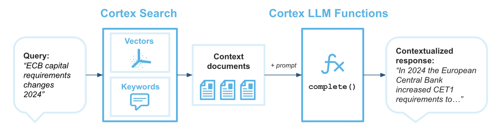
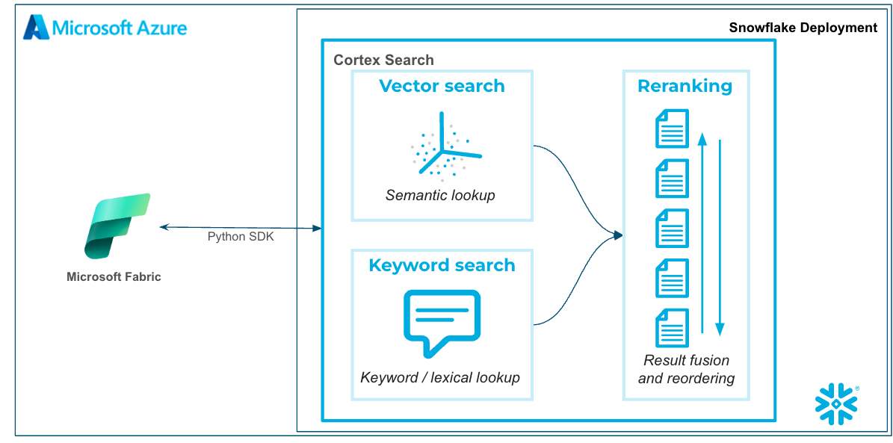
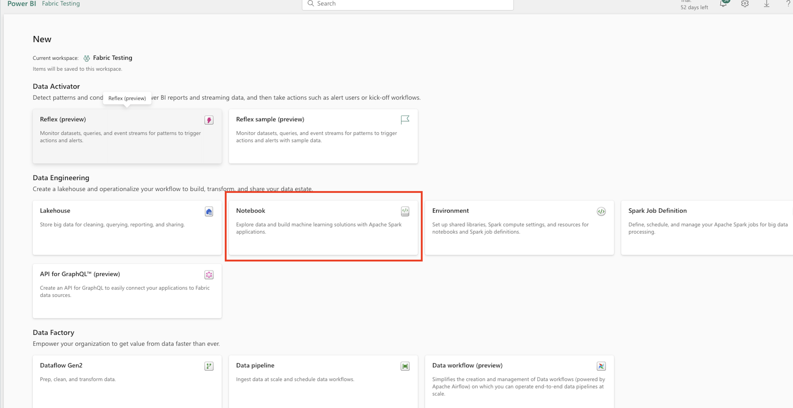
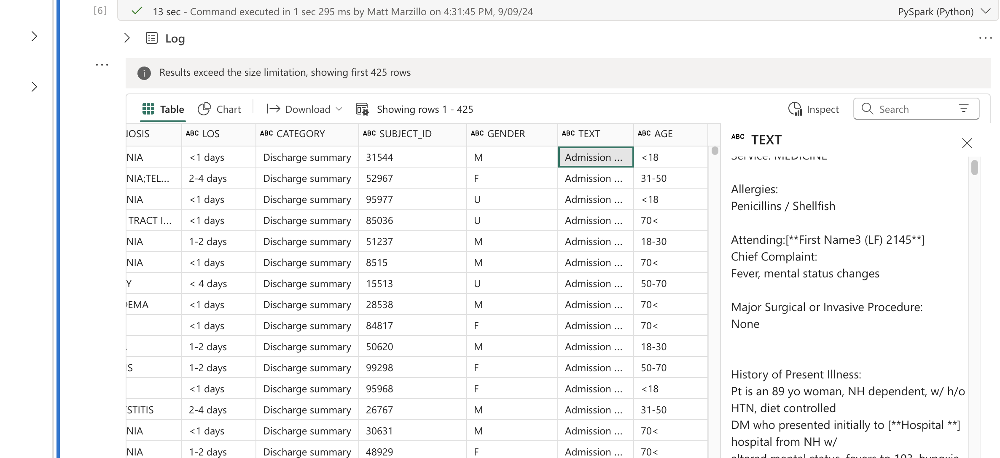
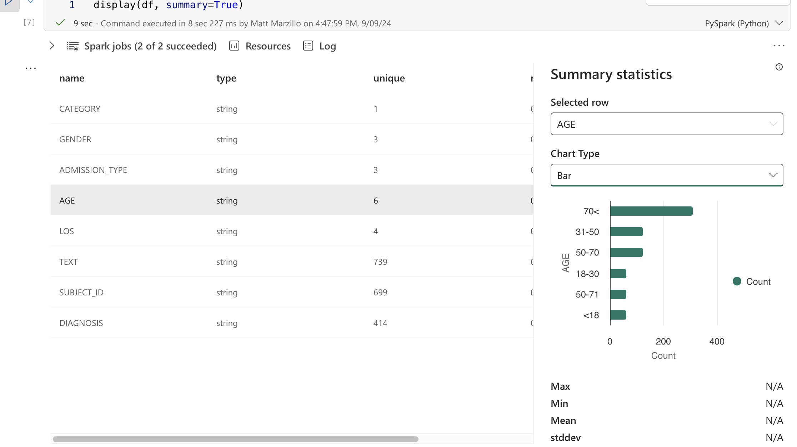
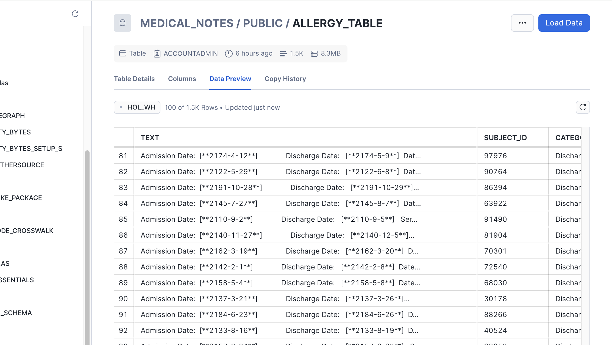

author: marzillo-snow
id: getting-started-with-cortex-search-and-microsoft-fabric
categories: snowflake-site:taxonomy/solution-center/certification/quickstart, snowflake-site:taxonomy/product/applications-and-collaboration
language: en
summary: This is a quickstart for using Cortex Search with Microsoft Fabric 
environments: web
status: Published 
feedback link: https://github.com/Snowflake-Labs/sfguides/issues


# Getting Started with Cortex Search and Microsoft Fabric
<!-- ------------------------ -->
## Overview 

Cortex Search enables low-latency, high-quality “fuzzy” search over your Snowflake data. Cortex Search powers a broad array of search experiences for Snowflake users including Retrieval Augmented Generation (RAG) applications leveraging Large Language Models (LLMs).

Cortex Search gets you up and running with a hybrid (vector and keyword) search engine on your text data in minutes, without having to worry about embedding, infrastructure maintenance, search quality parameter tuning, or ongoing index refreshes. This means you can spend less time on infrastructure and search quality tuning, and more time developing high-quality chat and search experiences using your data. Check out the Cortex Search tutorials for step-by-step instructions on using Cortex Search to power AI chat and search applications.



Microsoft Fabric is a unified analytics platform that integrates various data services like data engineering, data science, real-time analytics, and business intelligence into a single environment. It allows users to work across the entire analytics lifecycle, from data ingestion and transformation to advanced analytics and reporting. Fabric brings together key technologies like Power BI, Azure Synapse, and Data Factory under one umbrella for seamless data collaboration and processing. Its low-code/no-code tools, along with cloud-scale capabilities, make it accessible for both technical and non-technical users to build, analyze, and share insights. In this quickstart we will bbe using Fabric Notebooks to work with Cortex Search in Snowflake.

[GitHub](https://github.com/Snowflake-Labs/sfguide-getting-started-with-cortex-search-and-microsoft-fabric)

### Prerequisites
- Familiarity with [Snowflake](/en/developers/guides/getting-started-with-snowflake/) and a Snowflake account
- Familiarity with [Microsoft](https://learn.microsoft.com/en-us/fabric/get-started/microsoft-fabric-overview) Fabric and a Fabric workspace.
- Familiarity with [Python](https://www.udemy.com/course/draft/579706/)

### You'll Learn
- Using Fabric Notebooks with Snowflake Cortex Search
- Creating a Cortex Search Service in Snowflake on unstructured data
- Using Fabric Notebooks to explore data

### What You’ll Need 
- A free [Snowflake Account](https://signup.snowflake.com/?utm_source=snowflake-devrel&utm_medium=developer-guides&utm_cta=developer-guides)
- [Fabric Capacity](https://learn.microsoft.com/en-us/fabric/get-started/fabric-trial)
- For the sake of the lab it is best if both platforms have access to the public internet and are not in a virtual network


### What You’ll Build 
You will build an end-to-end data science workflow leveraging Snowpark for Python
- to load data to Snowflake via Snowsight
- to create a Snowflake Cortex Search Services on unstructured data
- to query the Snowflake Cortex Search Service from Fabric Notebooks

The end-to-end workflow will look like this:



<!-- ------------------------ -->
## Use Case

In this use case you will build a Cortex SEarch service on the free text data healthcare that represents discharge notes from a medical provider. The data is largely from this dataset on [Kaggle](https://www.kaggle.com/datasets/bpkapkar/health-prescription-data). 

There are many additional use cases that can be built on this dataset, but specifically we will be using Cortex Search to identify patients that were discharged and are allergic to Penicillin so that we can notify their treating physicians of outages of other antibiotics so that the doctors can be prepared to prescribe other antibiotics as alternatives.

<!-- ------------------------ -->
## Set Up Snowflake Environment and Cortex Search

The first thing we will do is create a database and warehouse in your Snowflake environment. Copy and paste the below code to a SQL Worksheet in Snowflake an Snowsight and run through it.

You will see that after creating the stage and table you will have to navigate to the database tab and load the data via the UI in Snowflake. The simple instruction are comments in the SQL worksheet. 

The final block of code in this SQL will create the Cortex Search service using SQL. The TARGET_LAG parameter is set to "30 day" that will check for updates to the base table every 30 days. While the data size in this datasets isn't that large notice how quickly the service is created. 

For practice of this quickstart we are creating the Cortex Search service quickly, but there are additional items you may want to consider additional items like token limits and [text splitting](https://docs.snowflake.com/en/user-guide/snowflake-cortex/cortex-search/cortex-search-overview#token-limits-and-text-splitting). Additionally, there are several [Cortex Search Tutorials](https://docs.snowflake.com/en/user-guide/snowflake-cortex/cortex-search/overview-tutorials) to get customers more familiar with the nuances of building and querying Cortex Search. 

```sql
--create database and warehouse
use role accountadmin;
CREATE OR REPLACE WAREHOUSE HOL_WH WITH WAREHOUSE_SIZE='X-SMALL';
CREATE OR REPLACE DATABASE MEDICAL_NOTES;

--create stage
USE DATABASE MEDICAL_NOTES;
CREATE OR REPLACE STAGE NOTES_STAGE
URL='s3://hol-qs-bucket/mednotes/'
FILE_FORMAT = (TYPE = 'csv');
list @notes_stage;

--create customer_wrapped table
CREATE OR REPLACE TABLE MEDICAL_NOTES
  (SUBJECT_ID STRING,
   ROW_ID STRING,
   HADM_ID STRING,
   CATEGORY STRING,
   ADMISSION_TYPE STRING,
   DIAGNOSIS STRING,
   TEXT STRING,
   AGE STRING,
   GENDER STRING,
   LOS STRING);

--create allergy_table
CREATE OR REPLACE TABLE ALLERGY_TABLE
  (TEXT STRING,
  SUBJECT_ID STRING,
  CATEGORY STRING,
  ADMISSION_TYPE STRING,
  DIAGNOSIS STRING,
  AGE STRING,
  GENDER STRING,
  LOS STRING);

-- Load the data using the Snowflake wizard
-- 1. Go to databases on the left of this screen then select the MEDICAL_NOTES database > PUBLIC schema > MEDICAL_NOTES table
-- 2. Select 'Load Data' in the top right, select the warehouse you just created then select 'Add from Stage'. Select the MEDICAL_NOTES.PUBLIC databse and schema then select the NOTES_STAGE stage.
-- 3. Select 'enable directory table' then select the prescriptiondata.csv and click add.
-- 4. Click 'Next' then click 'Load'
-- 5. Once complete come back to this worksheet to verify the data has been loaded

select top 10 * from MEDICAL_NOTES;

-- Create Search Service
CREATE OR REPLACE CORTEX SEARCH SERVICE MEDNOTES_SEARCH_SERVICE
  ON TEXT
  ATTRIBUTES ADMISSION_TYPE, DIAGNOSIS
  WAREHOUSE = HOL_WH
  TARGET_LAG = '30 day'
  AS (
    SELECT
        SUBJECT_ID,
        ROW_ID,
        HADM_ID,
        CATEGORY,
        ADMISSION_TYPE,
        DIAGNOSIS,
        TEXT,
        AGE,
        GENDER,
        LOS
    FROM MEDICAL_NOTES
);
```

Notice how we're setting up the Cortex Search service with a 30 day lag so that incremental updates to the service will be made ever 30 days. Additionally, we're setting up the service so that additional filters can be used on the attribute "ADMISSION_TYPE".

## Set Up Fabric Environment

Head to your Fabric workspace, click "New" in the top left then "More Options" and select the "Notebook" widget.




<!-- ------------------------ -->
## Querying Cortex Search from Fabric

Now let's copy and paste several blocks of code to the Fabric notebook and work through connecting to the Cortex Search service from Fabric.

First, let's install two packages that we need to use the API to connect.

```python
!pip install snowflake
%pip install --upgrade pydantic
```

Next, let's set up the connection request. For this quickstart you will have to populate the account identifier, your user name and password. For interactive work using username and password, but additional authentication methods are supported via the [Snowflake Python Package](https://docs.snowflake.com/en/developer-guide/python-connector/python-connector-connect).

```python
import os
import json

from snowflake.core import Root
from snowflake.connector import connect

# replace with hardcoded values if you wish; otherwise, ensure all values are in your environment.
CONNECTION_PARAMETERS = {
    "account": "<snowflake account>",
    "user": "<user name>",
    "password": "<password>",
    "role": "ACCOUNTADMIN",
    "warehouse": "HOL_WH",
    "database": "MEDICAL_NOTES",
    "schema": "PUBLIC"
    }
```

Now, let's connect to the service. You will likely need to approve the connection via MFA.

```python
# create a SnowflakeConnection instance
connection = connect(**CONNECTION_PARAMETERS,insecure_mode=True)
```

Next, we will build a function to query the Search service and return results. You can review and (if you would like) edit the query that we're sending to Cortex Search. Additionally, we're setting a high limit so that we return all relevant results and return all of the fields in the table with the free text field "TEXT". Take time as you would like to review the code that we're using to build the request.

```python
# Replace with your search parameters
# Replace with your search parameters
query = "you are a helpful assistant. Take your time to and be selective and only retrieve records that clearly show that the patient has an allergy to Penicillin and the diagnosis is related to Pneumonia. Exclude records where there is negation, for example there is mention of no pneumonia "
columns = ["TEXT","SUBJECT_ID","CATEGORY","ADMISSION_TYPE","DIAGNOSIS","AGE","GENDER","LOS"]
svc = "MEDNOTES_SEARCH_SERVICE"
filter_type={"@eq": {"ADMISSION_TYPE": "EMERGENCY"} }
limit = 1000


def search_records(connection, query, columns, svc, filter_type, limit):
    """
    Args:
        connection: The connection object to the database.
        query (str): The search query string.
        columns (list): The list of columns to retrieve.
        svc (str): The service name to perform the search.
        limit (int): The maximum number of results to return.

    Returns:
        dict: The search results in JSON format.
    """
    try:
        # create a root as the entry point for all objects
        root = Root(connection)
        
        # perform the search
        response = (
            root.databases[CONNECTION_PARAMETERS["database"]]
            .schemas[CONNECTION_PARAMETERS["schema"]]
            .cortex_search_services[svc]
            .search(
                query,
                columns,
                filter_type,
                limit=limit
            )
        )

        print(f"Received response with `request_id`: {response.request_id}")
        results = json.dumps(response.results, indent=5)
        print(results)
        return results
    except Exception as e:
        print(f"An error occurred: {e}")
```

Let's now run the function and place the results into a pandas dataframe.

```python
import pandas as pd
results = search_records(connection, query, columns, svc, filter_type, limit)
l = json.loads(results)
df = pd.DataFrame(l)
```
We have created a function that calls the service filtering only on Emergency admissions and using plain text to query the service and return records in which the discharge notes indicate an allergy to Penicillin. Then created a data frame with those records.

Now, let's take some time to review the results with some of Fabric Notebooks interactive EDA capabilities. Run the below code and click through the data to view the results. If you click through records on the "TEXT" field you can check to see if we're actually returning records where patients are allergic to Penicillin.

```python
display(df)
```



Click through additional fields to view the values in the table.

Now let's experiment with some more EDA in the results. Execute the below code in your Fabric Notebook.

```python
display(df, summary=True)
```

You can click through the different fields to see how patients allergic to Penicillin are separated across different categories.



To learn more about Fabric Notebook functionality check out the documentation [here](https://learn.microsoft.com/en-us/fabric/data-engineering/author-execute-notebook).

Finally, we can write the results of the Search query back to a table in Snowflake.

```python
from snowflake.connector.pandas_tools import write_pandas

# Write the DataFrame to Snowflake
success, nchunks, nrows, _ = write_pandas(connection, df, 'ALLERGY_TABLE')
```

You can head back to Snowflake to verify the table was created. And you can do with this whatever you would like...analyze the results in Snowflake, connect Power BI to it or build models with Cortex, SnowflakeML, Azure Openai and AzureML!




<!-- ------------------------ -->
## Conclusion and Resources

This quickstart is just that, a quick way to get you started with using Fabric and Snowflake Cortex Search. There are plenty of different directions and enhancements you can make to this. The key thing is knowing that when you deploy Snowflake on Azure you have plenty of secure options for using Generative AI services regardless of where your data is and where you are orchestrating from!


### What You Learned
- Using Fabric Notebooks with Snowflake Cortex Search
- Creating a Cortex Search Service in Snowflake on unstructured data
- Using Fabric Notebooks to explore data
- Writing dataframes back to Snowflake

### Resources
- There are some great blogs on Medium regarding Snowflake Cortex, Microsoft Fabric and how Snowflake and Fabric work together

- [Snowflake Cortex](/en/data-cloud/cortex/)

- [Microsoft Fabric and Power BI](https://learn.microsoft.com/en-us/power-bi/fundamentals/fabric-get-started)

- [Fabric and Snowflake together](https://www.microsoft.com/en-us/microsoft-fabric/blog/2024/05/22/snowflake-and-microsoft-announce-expansion-of-their-partnership/)

If you have any questions, reach out to your Snowflake account team!


