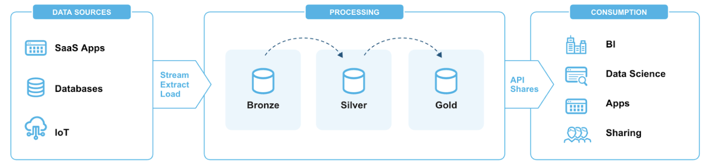
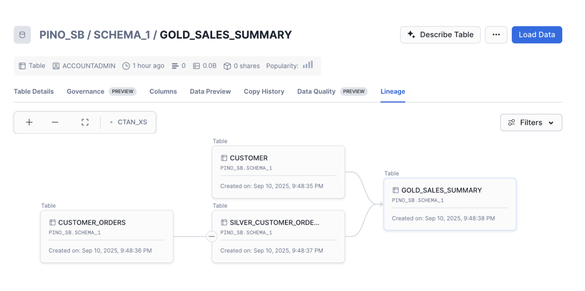
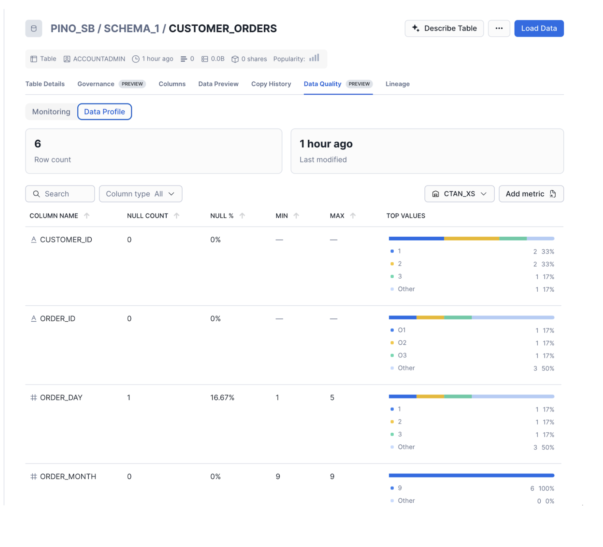
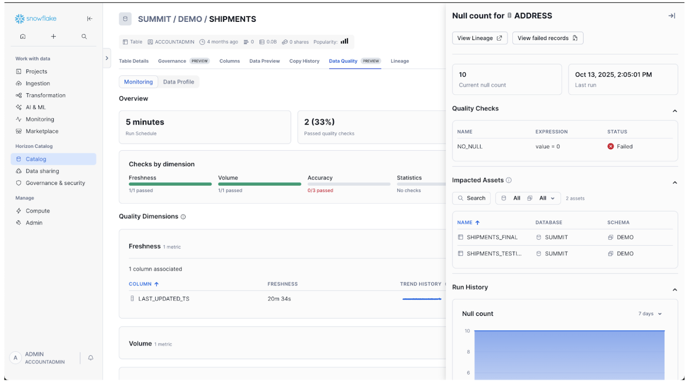

summary: Learn how to get started with Data Quality Monitoring Framework in Snowflake 
id: getting-started-with-data-quality-in-snowflake
categories: getting-started
environments: web
status: Published
feedback link: https://github.com/Snowflake-Labs/sfguides/issues
tags: Getting Started, Data Engineering
authors: Vino Duraisamy, Pino Suliman

# Getting Started with Data Quality Monitoring in Snowflake

<!-- ------------------------ -->
## Overview

Trusted data is essential for confident decision-making, analytics, and AI. Snowflake’s Data Quality Framework provides a native, end-to-end approach for ensuring that data is accurate, complete, and reliable throughout its lifecycle.

This framework combines proactive monitoring with interactive UI for root cause analysis and impact assessment into a single experience. Built directly on Snowflake, it enables scalable, automated data quality without requiring external tools or data movement. This quickstars will introduce a concepts such as:

* Data Profiling
* System and Custom Data Metric Functions
* Expectations
* Data Quality Monitoring in Snowsight
* Data Metric Scan function
* Data Lineage

### What You Will Learn

By the end of this guide, you will learn to work with:

* Analyzing profiling statistics for Snowflake assets.
* Set up data quality monitoring rules using Data Metric Functions (DMF) and Expectations.
* Create and apply custom DMFs.. 
* Monitor and investigate data quality issues using the Monitoring dashboard and the Data Lineage graph.
* Best practices for monitoring data quality in Snowflake.

### What You'll Build

By the end of this quickstart guide, you will learn how to build a basic data quality framework to monitor a data pipeline with three distinct layers following the medallion architecture.

### Prerequisites
A Snowflake account with Enterprise edition or higher. 

> Note
> Please note that Data Quality Monitoring is not available on Snowflake's free trial account. 

<!-- ------------------------ -->

## Setup


### Environment Setup

To begin, you'll need a sample dataset to work with. This section will walk you through the process of setting up sample data for your Snowflake environment.

#### Define source tables

```sql

USE ROLE ACCOUNTADMIN;
CREATE ROLE IF NOT EXISTS dq_tutorial_role;

CREATE DATABASE IF NOT EXISTS dq_tutorial_db;
CREATE SCHEMA IF NOT EXISTS sch;

grant usage on database dq_tutorial_db to role dq_tutorial_role;
grant usage on schema dq_tutorial_db.sch to role dq_tutorial_role;
use dq_tutorial_db.sch;

CREATE OR REPLACE TABLE CUSTOMER (
    ID FLOAT,                       
    FIRST_NAME VARCHAR,             
    LAST_NAME VARCHAR,              
    STREET_ADDRESS VARCHAR,         
    STATE VARCHAR,                  
    CITY VARCHAR,                   
    ZIP VARCHAR,                    
    PHONE_NUMBER VARCHAR,           
    EMAIL VARCHAR,                  
    SSN VARCHAR,                    
    BIRTHDATE VARCHAR,              
    JOB VARCHAR,                    
    CREDITCARD VARCHAR,             
    COMPANY VARCHAR,                
    OPTIN VARCHAR                   
);


-- Customer Orders in Bronze with day/month/year columns + PAYMENT_TYPE
CREATE OR REPLACE TABLE CUSTOMER_ORDERS (
    CUSTOMER_ID VARCHAR,            
    ORDER_ID VARCHAR,               
    ORDER_DAY INT,                 
    ORDER_MONTH INT,               
    ORDER_YEAR INT,                
    ORDER_AMOUNT FLOAT,             
    ORDER_TAX FLOAT,                
    ORDER_TOTAL FLOAT,              
    PAYMENT_TYPE VARCHAR             -- e.g., 'CREDIT_CARD', 'PAYPAL', 'BANK_TRANSFER'
);

```

#### Create sample dataset with quality issues

Consider a data pipeline following a modern data architecture pattern with three distinct layers following the medallion architecture.



**Bronze Layer**: Raw data from multiple sources (databases, JSON, XML files)
**Silver Layer**: Cleaned and enriched data with AI-powered insights
**Gold Layer**: Analytics-ready data stored in managed Iceberg tables and regular Snowflake tables.

#### Bronze Layer (ingestion)

```sql

INSERT INTO CUSTOMER VALUES
    (1, 'John', 'Doe', '123 Elm St', 'CA', 'San Francisco', '94105', '123-456-7890', 'john.doe@email.com', '111-22-3333', '1985-04-12', 'Engineer', '4111111111111111', 'Acme Inc.', 'Y'),
    (2, 'Jane', 'Smith', NULL, 'CA', 'Los Angeles', '90001', NULL, 'jane.smith@email.com', NULL, '1990/07/25', 'Manager', '5500000000000004', 'Globex', 'N'),
    (3, 'Mike', 'Brown', '456 Oak St', 'NV', 'Las Vegas', '89101', '9999999999', 'mike.brown.com', '123-45-6789', 'bad-date', 'Analyst', '4000000000000002', NULL, 'Y'),
    (4, 'Anna', 'Lee', '789 Pine St', 'WA', 'Seattle', '98101', '206-555-1234', 'anna.lee@email.com', '222-33-4444', '1988-11-05', 'Designer', '340000000000009', 'Innotech', 'Y');

INSERT INTO CUSTOMER_ORDERS VALUES
    ('1', 'O1', 1, 9, 2025, 100, 8.25, 108.25, 'CREDIT_CARD'),
    ('2', 'O2', 2, 9, 2025, 200, NULL, 200, 'PAYPAL'),
    ('2', 'O3', 3, 9, 2025, 300, 60, 360, 'BANK_TRANSFER'),
    ('3', 'O4', NULL, 9, 2025, -50, 5, -45, 'CREDIT_CARD'),
    ('4', 'O5', 4, 9, 2025, 150, 12, 162, 'PAYPAL'),
    ('1', 'O6', 5, 9, 2025, 250, 20, 270, 'CREDIT_CARD');
    ('5', NULL, 5, 9, 2025, 250, 20, 270, 'VENMO');

```

#### Silver Layer (clean orders only)

```sql
CREATE OR REPLACE TABLE SILVER_CUSTOMER_ORDERS AS
SELECT
    CUSTOMER_ID,
    ORDER_ID,
    TRY_TO_DATE(ORDER_YEAR || '-' || ORDER_MONTH || '-' || ORDER_DAY, 'YYYY-MM-DD') AS ORDER_TS,
    ORDER_AMOUNT,
    ORDER_TAX,  
    ORDER_TOTAL,  
    PAYMENT_TYPE
FROM CUSTOMER_ORDERS;
```

#### Gold Layer (Aggregated by Customer State and Payment Type)

```sql
CREATE OR REPLACE TABLE GOLD_SALES_SUMMARY AS
SELECT
    c.STATE,
    o.PAYMENT_TYPE,
    COUNT(DISTINCT o.ORDER_ID) AS TOTAL_ORDERS,
    SUM(o.ORDER_AMOUNT) AS TOTAL_AMOUNT,
    SUM(o.ORDER_TAX) AS TOTAL_TAX,
    SUM(o.ORDER_TOTAL) AS TOTAL_REVENUE
FROM SILVER_CUSTOMER_ORDERS o
JOIN CUSTOMER c
    ON c.ID = TO_NUMBER(o.CUSTOMER_ID)
WHERE o.ORDER_AMOUNT IS NOT NULL
GROUP BY c.STATE, o.PAYMENT_TYPE;

```

Let’s take a look at the Lineage tab to review our setup. 



In the next section, we will learn how to use data profiling statistics to analyze a dataset. 

<!-- ------------------------ -->

## Analyze


### Analyze dataset with profiling statistics

The first step in the data quality lifecycle is data profiling. Data profiling is the process of analyzing a dataset to understand its structure, content, and quality. It typically includes gathering statistics such as data types, value distributions, null counts, and uniqueness to identify patterns and potential data quality issues.
Using Snowsight, you can easily profile a dataset by accessing the Data Quality Tab. This is an important role in helping you get started with continuous data quality monitoring by laying the groundwork for identifying data quality rules.



<!-- ------------------------ -->

## Best Practices


### Best practices for monitoring data quality with DMFs and Expectations

This section presents best practices and considerations for data quality strategy.

At each layer of our pipeline we are interested in monitoring different aspects. 

Bronze: test source data 
Silver: validate transformations
Gold: test business logic 

Organizations typically take different approaches to monitoring and enforcing data quality. Some focus on the Bronze layer to catch issues as early as possible, ensuring that all ingested data meets baseline expectations. Yet, bad data might emerge later in the pipeline. Others monitor at the Gold layer, prioritizing end-user experience by ensuring that curated datasets remain accurate and reliable. However, this makes root-cause analysis more complex. A third approach targets the Silver layer, validating transformations and business logic. But this requires ongoing maintenance as transformation evolves.

While each strategy has merit, the most effective approach is hybrid monitoring across all three layers. This ensures comprehensive coverage, early detection of raw data issues, validation of transformations, and protection of business-critical outputs.

#### Snowflake Data Metric Functions

You can measure the quality of your data in Snowflake by using DMFs. Snowflake provides built-in [system DMFs](https://docs.snowflake.com/en/user-guide/data-quality-system-dmfs#system-dmfs) to measure common metrics without having to define them. You can also define your own custom DMFs to meet business specific requirements.

All DMFs that are set on the table follow a [schedule](https://docs.snowflake.com/en/user-guide/data-quality-working#schedule-the-dmf-to-run) to automate the data quality measurement, and you can define a schedule to trigger DMFs based on time or based on DML events. After you schedule the DMFs to run, Snowflake records the results of the DMF in a [dedicated event table](https://docs.snowflake.com/en/user-guide/data-quality-results) for data metric functions.

#### DMF Privilege Setup

```sql
grant execute data metric function on account to role dq_tutorial_role;
grant database role snowflake.data_metric_user to role dq_tutorial_role;
grant application role snowflake.data_quality_monitoring_viewer to role dq_tutorial_role;

```

#### Monitoring Bronze Layer

The bronze layer is the raw, unprocessed storage zone where ingested data is captured in its original format before any cleaning, transformation, or enrichment. It is important to monitor this layer for data quality to ensure the integrity of source data before downstream transformation and analytics.

The following example associates volume, freshness, and null checks using DMFs and Expectations.

```sql

ALTER TABLE CUSTOMER_ORDERS SET DATA_METRIC_SCHEDULE = '5 minutes';

ALTER TABLE CUSTOMER_ORDERS ADD DATA METRIC FUNCTION 
SNOWFLAKE.CORE.ROW_COUNT ON () Expectation Volume_Check (value > 1),   -- Row count (Volume)
SNOWFLAKE.CORE.FRESHNESS ON () Expectation Freshness_Check (value < 1800), 	-- Freshness
SNOWFLAKE.CORE.NULL_COUNT ON (ORDER_ID) Expectation Null_Check (value = 0);   -- Null count

```

#### Monitoring Silver Layer

The Silver layer is the transformation and enrichment zone where raw data from the Bronze layer is cleaned, joined, and reshaped to create intermediate datasets. Monitoring this layer is important to validate that transformations are applied correctly, business rules are enforced, and data anomalies are caught before reaching business-facing datasets. Ensuring quality at this stage helps prevent errors from propagating downstream and supports reliable analytics and reporting.

Create a custom DMF for referential integrity check

```sql
CREATE OR REPLACE DATA METRIC FUNCTION referential_check(
  arg_t1 TABLE (arg_c1 VARCHAR), arg_t2 TABLE (arg_c2 VARCHAR))
RETURNS NUMBER AS
 'SELECT COUNT(*) FROM arg_t1
  WHERE arg_c1 NOT IN (SELECT arg_c2 FROM arg_t2)';

```

Create a custom DMF that compares row counts between two tables

```sql
CREATE OR REPLACE DATA METRIC FUNCTION volume_check(
  arg_t1 TABLE (arg_c1 VARCHAR), arg_t2 TABLE (arg_c2 VARCHAR))
RETURNS NUMBER AS
  'SELECT ABS(
      (SELECT COUNT(*) FROM arg_t1) - (SELECT COUNT(*) FROM arg_t2)
    )';

```

Associate checks

```sql
ALTER TABLE SILVER_CUSTOMER_ORDERS SET DATA_METRIC_SCHEDULE = '5 minutes';

ALTER TABLE SILVER_CUSTOMER_ORDERS ADD DATA METRIC FUNCTION referential_check ON (CUSTOMER_ID, TABLE (dq_tutorial_db.sch.CUSTOMER(ID))) Expectation FK_Check (value=0);

ALTER TABLE SILVER_CUSTOMER_ORDERS ADD DATA METRIC FUNCTION volume_check
    ON (CUSTOMER_ID, TABLE (dq_tutorial_db.sch.CUSTOMER_ORDERS(CUSTOMER_ID))) Expectation NoDiff (value=0);

```

#### Monitoring Gold Layer

The Gold layer is the curated, consumption-ready zone where trusted datasets are delivered to dashboards, reports, and machine learning models. Monitoring this layer is critical to protect the end-user experience and ensure that business decisions are made using accurate and complete data. Quality checks at this stage catch any remaining issues before they impact stakeholders, providing confidence in the datasets that drive critical business outcomes.

A common type of check for this layer is Accepted Values. This type of check ensures data consistency, enforces business rules, and prevents invalid values from propagating downstream into analytics, reporting, or machine learning models. It validates that a column contains only a predefined set of allowed values and compares each value in the column against a reference list of valid values. This is particularly useful for categorical columns, such as product items, payment types, order statuses, or region codes. 

For example, in a payment_type column, the accepted values might be ('CREDIT_CARD', 'PAYPAL', 'WIRE_TRANSFER'). The check will flag any rows containing values outside this set, such as CHECK or BITCOIN.

```sql

ALTER TABLE GOLD_SALES_SUMMARY SET DATA_METRIC_SCHEDULE = '5 minutes';

ALTER TABLE GOLD_SALES_SUMMARY
  ADD DATA METRIC FUNCTION SNOWFLAKE.CORE.ACCEPTED_VALUES
    ON (
      payment_type,
      payment_type -> payment_type IN ('CREDIT_CARD', 'PAYPAL', 'BANK_TRANSFER')
    ) Expectation Payment_Type_Check (value=0);
```

Now that we’ve set up DMFs and Expectations to monitor our pipeline, let’s explore the Data Quality Tab in Snowsight to review the Monitoring Dashboard.

<!-- ------------------------ -->

## Review


### Review Data Quality Monitoring Dashboard in Snowsight

Once the DMF setup is completed, you can review the DMF results by accessing the Quality Tab on Snowsight. Note that the first DMF run has to be completed before results start showing up in the dashboard.

The interactive interface displays DQ metric results, trends, and incidents. You can drill down into failed quality checks, view impacted assets, and investigate specific records that violate a data quality check.

#### Investigate failed quality checks

Using the Monitoring Dashboard, you can drill down to DMF results and identify which records violated the quality check. 

* Select a particular DMF to open the sidebar.
* With the side panel open, select View Failed Records.
* Execute the prepopulated query to see the records that failed the quality check. This query calls the SYSTEM$DATA_METRIC_SCAN function.

For information about using the SYSTEM$DATA_METRIC_SCAN function to remediate the data quality issues, see Using [SYSTEM$DATA_METRIC_SCAN to fix data](https://docs.snowflake.com/en/user-guide/data-quality-fixing.html#label-data-quality-remediate).

Note: This function applies to [system DMFs](https://docs.snowflake.com/en/user-guide/data-quality-fixing.html#label-data-quality-remediation-supported-dmfs) only.

#### Identify Impacted Assets 

The DMF side panel automatically displays the objects that are [downstream](https://docs.snowflake.com/en/user-guide/ui-snowsight-lineage.html#label-lineage-upstream-downstream) in the lineage of the object with which the DMF is associated. If there is a data quality issue, you can determine what other objects are possibly affected.



<!-- ------------------------ -->

## Conclusion and Resources


You've successfully implemented data quality monitoring for your pipeline. By combining proactive monitoring with an interactive UI for root cause analysis, it simplifies data quality management directly within Snowflake. 

#### What You Learned
* Analyzing profiling statistics for Snowflake assets.
* Set up data quality monitoring rules using Data Metric Functions (DMF) and Expectations.
* Create and apply custom DMFs.. 
* Monitor and investigate data quality issues using the Monitoring dashboard and the Data Lineage graph.
* Best practices for monitoring data quality in Snowflake.

#### Additional Resources
* [Intro to Data Quality Monitoring](https://docs.snowflake.com/en/user-guide/data-quality-intro) in Snowflake
* Data Quality Monitoring Demo Video: [Enabling Reliable, High-Integrity Data](https://www.youtube.com/watch?v=FZtyCFyQn0w)
