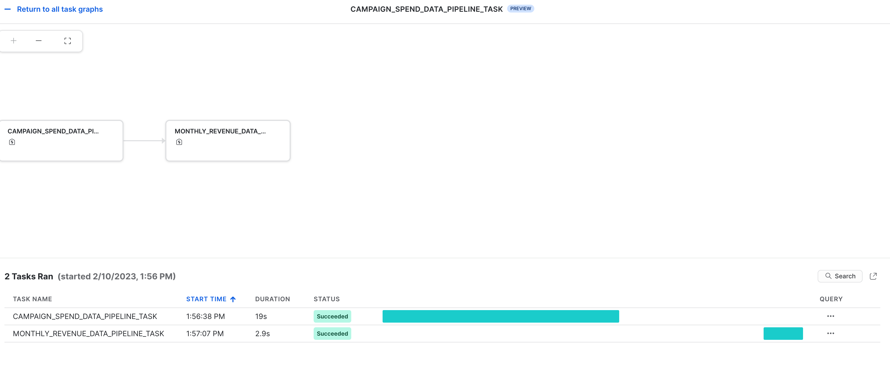

id: getting-started-with-dataengineering-ml-using-snowpark-python-fr
categories: snowflake-site:taxonomy/solution-center/certification/quickstart, snowflake-site:taxonomy/product/ai, snowflake-site:taxonomy/snowflake-feature/ml-functions
language: en
summary: Premiers pas avec le Data Engineering et le Machine Learning à l’aide de Snowpark for Python
environments: web
status: Published
feedback link: https://github.com/Snowflake-Labs/sfguides/issues
authors: Dash Desai


# Premiers pas avec le Data Engineering et le Machine Learning à l’aide de Snowpark for Python
<!-- ------------------------ -->
## Présentation


Ce guide va vous permettre de passer de données brutes à une application interactive capable d’aider une organisation à optimiser l’allocation de son budget publicitaire.

Voici un résumé de ce que vous allez apprendre dans chacune des étapes de ce guide Quickstart :

- **Configuration de l’environnement** : utiliser des zones de préparation et des tables pour intégrer et organiser des données brutes issues de S3 dans Snowflake
- **Data Engineering** : utiliser des DataFrames Snowpark for Python pour transformer des données (par exemple avec des méthodes de type grouper par, agréger, faire pivoter et associer) afin de les préparer pour les applications en aval
- **Pipelines de données** : utiliser Snowflake Tasks pour convertir un code de pipeline de données en pipelines opérationnels, avec surveillance intégrée  
- **Machine Learning** : préparer des données et entraîner un modèle de ML dans Snowflake à l’aide de Snowpark ML, et déployer le modèle en tant que fonction définie par l’utilisateur (UDF) Snowpark
- **Application Streamlit** : créer une application interactive à l’aide de Python (aucune expérience en développement Web requise) pour aider à visualiser le retour sur investissement des différents budgets de dépenses publicitaires

Si vous ne connaissez pas certaines technologies mentionnées ci-dessus, en voici un rapide résumé, accompagné de liens vers la documentation correspondante.

### Qu’est-ce que Snowpark ?

Il s’agit d’un ensemble de bibliothèques et d’environnements d’exécution dans Snowflake qui garantit un déploiement et un traitement sécurisé de tout code non-SQL (Python, Java et Scala, par exemple).

**Bibliothèques familières côté client** : Snowpark apporte une programmation de type DataFrame profondément intégrée et des API compatibles OSS aux langages privilégiés par les professionnels des données. Snowpark prend également en charge des API ML, dont ML Modeling (public preview) et ML Operations (private preview), qui garantissent un développement et un déploiement plus efficaces des modèles.

**Constructions d’exécution flexibles** : Snowpark fournit des constructions d’exécution flexibles qui permettent aux utilisateurs d’ajouter et d’exécuter une logique personnalisée. Les développeurs peuvent créer facilement des pipelines de données, des modèles de ML et des applications de données avec des fonctions définies par l’utilisateur et des procédures stockées.

Pour en savoir plus sur Snowpark, cliquez [ici](/fr/data-cloud/snowpark/).


### Qu’est-ce que Snowpark ML ?

Snowpark ML est une nouvelle bibliothèque qui assure un développement de bout en bout plus rapide et plus intuitif du ML dans Snowflake. Snowpark ML compte 2 API : ML Modeling Snowpark (en public preview) et ML Operations Snowpark (en private preview), respectivement, pour le développement et le déploiement de modèles.

Ce guide Quickstart porte sur l’API ML Modeling Snowpark, qui dimensionne le feature engineering et simplifie l’entraînement de modèles de ML dans Snowflake.

### Qu’est-ce que Streamlit ?

Streamlit est un framework d’application [open source](https://github.com/streamlit/streamlit) Python qui permet aux développeurs de créer, de partager et de déployer rapidement et facilement des applications de données. Pour en savoir plus sur Streamlit, cliquez [ici](https://streamlit.io/).

### Vous allez apprendre :

- Comment analyser des données et réaliser des tâches de Data Engineering à l’aide d’API et de classes DataFrame Snowpark
- Comment utiliser des bibliothèques Python open source depuis un canal Anaconda Snowflake soigneusement sélectionné
- Comment entraîner un modèle de ML à l’aide de Snowpark ML dans Snowflake
- Comment créer des fonctions définies par l’utilisateur (UDF) Snowpark Python scalaires et vectorisées, respectivement, pour l’inférence en ligne et hors ligne
- Comment créer des tâches Snowflake Tasks pour automatiser des pipelines de données
- Comment créer une application Web Streamlit qui utilise des UDF scalaires pour l’inférence basée sur les entrées des utilisateurs

### Conditions préalables

- [Git](https://git-scm.com/book/en/v2/Getting-Started-Installing-Git) doit être installé.
- [Python 3.9](https://www.python.org/downloads/) doit être installé.
  - Remarque : vous allez créer un environnement Python avec la version 3.9 lors de l’étape **Premiers pas**.
- Vous devez posséder un compte Snowflake comprenant des [packages Anaconda activés par ORGADMIN](https://docs.snowflake.com/fr/developer-guide/udf/python/udf-python-packages.html#using-third-party-packages-from-anaconda). Si vous n’avez pas de compte Snowflake, vous pouvez créer un [compte d’essai gratuit](https://signup.snowflake.com/?utm_source=snowflake-devrel&utm_medium=developer-guides&utm_cta=developer-guides).
- Vous devez vous connecter à un compte Snowflake avec le rôle ACCOUNTADMIN. Si ce rôle est disponible dans votre environnement, vous pouvez choisir de l’utiliser. Sinon, vous devrez 1) créer un compte d’essai gratuit, 2) utiliser un autre rôle capable de créer une base de données, un schéma, des tables, des zones de préparation, des tâches, des fonctions définies par l’utilisateur et des procédures stockées OU 3) utiliser une base de données et un schéma existants dans lesquels vous pouvez créer les objets mentionnés.

> 

<!-- ------------------------ -->
## Configuration de l’environnement


### Créer des tables, charger des données et configurer des zones de préparation

Connectez-vous à [Snowsight](https://docs.snowflake.com/fr/user-guide/ui-snowsight.html) à l’aide de vos identifiants pour créer des tables, charger des données depuis Amazon S3 et configurer des zones de préparation internes Snowflake.

> 
>
> - Si vous utilisez des noms différents pour les objets créés dans cette section, assurez-vous de mettre à jour les scripts et le code dans les sections suivantes en conséquence.
>
> - Pour chaque bloc de script SQL ci-dessous, sélectionnez toutes les instructions du bloc et exécutez-les de haut en bas.

Exécutez les commandes SQL suivantes pour créer un [entrepôt](https://docs.snowflake.com/fr/sql-reference/sql/create-warehouse.html), une [base de données](https://docs.snowflake.com/fr/sql-reference/sql/create-database.html) et un [schéma](https://docs.snowflake.com/fr/sql-reference/sql/create-schema.html).

```sql 
USE ROLE ACCOUNTADMIN;

CREATE OR REPLACE WAREHOUSE DASH_L; 
CREATE OR REPLACE DATABASE DASH_DB; 
CREATE OR REPLACE SCHEMA DASH_SCHEMA;

USE DASH_DB.DASH_SCHEMA; 
```

Exécutez les commandes SQL suivantes pour créer une table **CAMPAIGN_SPEND** à partir de données hébergées sur un compartiment S3 accessible au public.

```sql 
CREATE or REPLACE file format csvformat 
  skip_header = 1 
  type = 'CSV';

CREATE or REPLACE stage campaign_data_stage 
  file_format = csvformat 
  url = 's3://sfquickstarts/ad-spend-roi-snowpark-python-scikit-learn-streamlit/campaign_spend/';

CREATE or REPLACE TABLE CAMPAIGN_SPEND ( 
  CAMPAIGN VARCHAR(60), 
  CHANNEL VARCHAR(60), 
  DATE DATE, 
  TOTAL_CLICKS NUMBER(38,0), 
  TOTAL_COST NUMBER(38,0), 
  ADS_SERVED NUMBER(38,0) 
);

COPY into CAMPAIGN_SPEND 
  from @campaign_data_stage; 
```

Exécutez les commandes SQL suivantes pour créer une table **MONTHLY_REVENUE** à partir de données hébergées sur un compartiment S3 accessible au public.

```sql 
CREATE or REPLACE stage monthly_revenue_data_stage 
  file_format = csvformat 
  url = 's3://sfquickstarts/ad-spend-roi-snowpark-python-scikit-learn-streamlit/monthly_revenue/';

CREATE or REPLACE TABLE MONTHLY_REVENUE ( 
  YEAR NUMBER(38,0), 
  MONTH NUMBER(38,0), 
  REVENUE FLOAT 
);

COPY into MONTHLY_REVENUE 
  from @monthly_revenue_data_stage; 
```

Exécutez les commandes SQL suivantes pour créer une table **BUDGET_ALLOCATIONS_AND_ROI** qui contient les six derniers mois d’allocations budgétaires et de retour sur investissement.

```sql 
CREATE or REPLACE TABLE BUDGET_ALLOCATIONS_AND_ROI ( 
  MONTH varchar(30), 
  SEARCHENGINE integer, 
  SOCIALMEDIA integer, 
  VIDEO integer, 
  EMAIL integer, 
  ROI float 
)
COMMENT = '{"origin":"sf_sit-is", "name":"aiml_notebooks_ad_spend_roi", "version":{"major":1, "minor":0}, "attributes":{"is_quickstart":1, "source":"streamlit"}}';

INSERT INTO BUDGET_ALLOCATIONS_AND_ROI (MONTH, SEARCHENGINE, SOCIALMEDIA, VIDEO, EMAIL, ROI) 
VALUES 
('January',35,50,35,85,8.22), 
('February',75,50,35,85,13.90), 
('March',15,50,35,15,7.34), 
('April',25,80,40,90,13.23), 
('May',95,95,10,95,6.246), 
('June',35,50,35,85,8.22); 
```

Exécutez les commandes suivantes afin de créer des [zones de préparation internes](https://docs.snowflake.com/fr/user-guide/data-load-local-file-system-create-stage) Snowflake pour stocker des procédures stockées, des UDF et des fichiers de modèles de ML.

```sql
CREATE OR REPLACE STAGE dash_sprocs;
CREATE OR REPLACE STAGE dash_models;
CREATE OR REPLACE STAGE dash_udfs;
```

Vous pouvez également ouvrir le fichier [setup.sql](https://github.com/Snowflake-Labs/sfguide-ad-spend-roi-snowpark-python-streamlit-scikit-learn/blob/main/setup.sql) dans Snowsight et exécuter toutes les instructions SQL pour créer les objets et charger les données depuis AWS S3.

> 

<!-- ------------------------ -->
## Premiers pas


Cette section explique comment cloner le référentiel GitHub et configurer votre environnement Snowpark for Python.

### Cloner le référentiel GitHub

La première étape consiste à cloner le [référentiel GitHub](https://github.com/Snowflake-Labs/sfguide-ad-spend-roi-snowpark-python-streamlit-scikit-learn). Le référentiel contient tout le code dont vous aurez besoin pour terminer ce guide Quickstart.

Avec HTTPS :

```shell
git clone https://github.com/Snowflake-Labs/sfguide-getting-started-dataengineering-ml-snowpark-python.git
```

OU avec SSH :

```shell
git clone git@github.com:Snowflake-Labs/sfguide-getting-started-dataengineering-ml-snowpark-python.git
```

### Snowpark for Python

Pour réaliser les étapes **Data Engineering** et **Machine Learning**, vous pouvez installer tous les éléments localement (option 1) ou utiliser Hex (option 2) comme décrit ci-dessous.

> 

#### Option 1 – Installation locale

Cette option va vous permettre de réaliser toutes les étapes de ce guide Quickstart.

**Étape 1 :** téléchargez et installez le programme d’installation miniconda depuis le lien [https://conda.io/miniconda.html](https://conda.io/miniconda.html). *(Avec Python 3.9, vous pouvez également utiliser un autre environnement Python, par exemple, [virtualenv](https://virtualenv.pypa.io/en/latest/).)*

**Étape 2 :** ouvrez une nouvelle fenêtre de terminal et exécutez-y les commandes suivantes.

**Étape 3 :** créez un environnement conda Python 3.9 appelé **snowpark-de-ml** en exécutant la commande suivante dans la même fenêtre de terminal.

```python
conda create --name snowpark-de-ml -c https://repo.anaconda.com/pkgs/snowflake python=3.9
```

**Étape 4 :** activez l’environnement conda **snowpark-de-ml** en exécutant la commande suivante dans la même fenêtre de terminal.

```python
conda activate snowpark-de-ml
```

**Étape 5 :** installez Snowpark Python et d’autres bibliothèques dans l’environnement conda **snowpark-de-ml** depuis le [canal Anaconda Snowflake](https://repo.anaconda.com/pkgs/snowflake/) en exécutant la commande suivante dans la même fenêtre de terminal.

```python
conda install -c https://repo.anaconda.com/pkgs/snowflake snowflake-snowpark-python pandas notebook scikit-learn cachetools
```

**Étape 6 :** installez une bibliothèque Streamlit dans l’environnement conda **snowpark-de-ml** en exécutant la commande suivante dans la même fenêtre de terminal.

```python
pip install streamlit
```

**Étape 7 :** installez une bibliothèque Snowpark ML dans l’environnement conda **snowpark-de-ml** en exécutant la commande suivante dans la même fenêtre de terminal.

```python
pip install snowflake-ml-python
```

**Étape 9 :** mettez à jour le fichier [connection.json](https://github.com/Snowflake-Labs/sfguide-ml-model-snowpark-python-scikit-learn-streamlit/blob/main/connection.json) avec les détails et identifiants de votre compte Snowflake.

Voici un exemple de fichier ***connection.json*** basé sur les noms d’objets mentionnés à l’étape **Configuration de l’environnement**.

```json
{
  "account"   : "<your_account_identifier_goes_here>",
  "user"      : "<your_username_goes_here>",
  "password"  : "<your_password_goes_here>",
  "role"      : "ACCOUNTADMIN",
  "warehouse" : "DASH_L",
  "database"  : "DASH_DB",
  "schema"    : "DASH_SCHEMA"
}
```

> 

#### Option 2 – Utilisation de Hex

Si vous choisissez d’utiliser votre compte [Hex](https://app.hex.tech/login) existant ou de [créer un compte d’essai gratuit de 30 jours](https://app.hex.tech/signup/quickstart-30), Snowpark for Python est intégré. Vous n’avez donc pas à créer d’environnement Python, ni à installer Snowpark for Python et d’autres bibliothèques localement sur votre ordinateur. Vous pourrez ainsi réaliser les étapes **Data Engineering** et **Machine Learning** de ce guide Quickstart directement dans Hex. (Pour en savoir plus sur le chargement des notebooks de Data Engineering et de Machine Learning dans Hex, consultez les sections correspondantes.)

> 

<!-- ------------------------ -->
## Data Engineering


Le notebook dont le lien est fourni ci-dessous traite des tâches de Data Engineering suivantes.

1) Établir une connexion sécurisée entre Snowpark Python et Snowflake 
2) Charger des données depuis des tables Snowflake dans des DataFrames Snowpark 
3) Effectuer une analyse exploratoire des données sur les DataFrames Snowpark 
4) Faire pivoter et associer des données de plusieurs tables à l’aide de DataFrames Snowpark 
5) Automatiser des tâches de pipeline de données à l’aide de tâches Snowflake Tasks

### Notebook de Data Engineering dans Jupyter ou Visual Studio Code

Pour commencer, suivez les étapes suivantes :

1) Dans une fenêtre de terminal, accédez à ce dossier et exécutez `jupyter notebook` sur la ligne de commande. (Vous pouvez également utiliser d’autres outils et EDI, comme Visual Studio Code.)

2) Ouvrez et parcourez les cellules du fichier [Snowpark_For_Python_DE.ipynb](https://github.com/Snowflake-Labs/sfguide-ad-spend-roi-snowpark-python-streamlit-scikit-learn/blob/main/Snowpark_For_Python_DE.ipynb).

> 

### Notebook de Data Engineering dans Hex

Si vous choisissez d’utiliser votre compte [Hex](https://app.hex.tech/login) existant ou de [créer un compte d’essai gratuit de 30 jours](https://app.hex.tech/signup/quickstart-30), suivez les étapes suivantes pour charger le notebook et créer une connexion de données entre Snowflake et Hex.

1) Importez le fichier [Snowpark_For_Python_DE.ipynb](https://github.com/Snowflake-Labs/sfguide-ad-spend-roi-snowpark-python-streamlit-scikit-learn/blob/main/Snowpark_For_Python_DE.ipynb) en tant que projet dans votre compte. Pour plus d’informations sur le processus d’importation, consultez la [documentation correspondante](https://learn.hex.tech/docs/versioning/import-export).

2) Ensuite, au lieu d’utiliser le fichier [connection.json](https://github.com/Snowflake-Labs/sfguide-ml-model-snowpark-python-scikit-learn-streamlit/blob/main/connection.json) pour vous connecter à Snowflake, créez une [connexion de données](https://learn.hex.tech/tutorials/connect-to-data/get-your-data#set-up-a-data-connection-to-your-database) et utilisez-la dans le notebook de Data Engineering comme illustré ci-dessous.


> 

3) Dans le notebook, remplacez l’extrait de code suivant :

```python
connection_parameters = json.load(open('connection.json'))
session = Session.builder.configs(connection_parameters).create()
```

**par...**

```python
import hextoolkit
hex_snowflake_conn = hextoolkit.get_data_connection('YOUR_DATA_CONNECTION_NAME')
session = hex_snowflake_conn.get_snowpark_session()
session.sql('USE SCHEMA DASH_SCHEMA').collect()
```

<!-- ------------------------ -->
## Pipelines de données

Vous pouvez également exploiter les transformations de données sous forme de pipelines de données automatisés qui s’exécutent dans Snowflake.

Dans le [notebook de Data Engineering](https://github.com/Snowflake-Labs/sfguide-ad-spend-roi-snowpark-python-streamlit-scikit-learn/blob/main/Snowpark_For_Python_DE.ipynb), une section montre comment créer et exécuter les transformations de données en tant que [tâches Snowflake Tasks](https://docs.snowflake.com/fr/user-guide/tasks-intro).

À des fins de référence, voici les extraits de code.

### **Tâche racine/parent**

Cette tâche automatise le chargement des données relatives aux dépenses de campagne et l’exécution de plusieurs transformations.

```python 
def campaign_spend_data_pipeline(session: Session) -> str:
  # TRANSFORMATIONS DE DONNÉES 
  # Effectuez les actions suivantes pour transformer les données

  # Chargez les données sur les dépenses de campagnes 
  snow_df_spend_t = session.table('campaign_spend')

  # Transformez les données afin de dégager le coût total annuel/mensuel par canal à l’aide des fonctions DataFrame Snowpark group_by() et agg() 
  snow_df_spend_per_channel_t = snow_df_spend_t.group_by(year('DATE'), month('DATE'),'CHANNEL').agg(sum('TOTAL_COST').as_('TOTAL_COST')).\
      with_column_renamed('"YEAR(DATE)"',"YEAR").with_column_renamed('"MONTH(DATE)"',"MONTH").sort('YEAR','MONTH')

  # Transformez les données afin que chaque ligne représente le coût total annuel/mensuel tous canaux confondus à l’aide des fonctions DataFrame Snowpark pivot() et sum() 
  snow_df_spend_per_month_t = snow_df_spend_per_channel_t.pivot('CHANNEL',['search_engine','social_media','video','email']).sum('TOTAL_COST').sort('YEAR','MONTH') 
  snow_df_spend_per_month_t = snow_df_spend_per_month_t.select( 
      col("YEAR"), 
      col("MONTH"), 
      col("'search_engine'").as_("SEARCH_ENGINE"), 
      col("'social_media'").as_("SOCIAL_MEDIA"), 
      col("'video'").as_("VIDEO"), 
      col("'email'").as_("EMAIL") 
  )

  # Enregistrez les données transformées 
  snow_df_spend_per_month_t.write.mode('overwrite').save_as_table('SPEND_PER_MONTH')

# Enregistrez la fonction de création de pipelines de données en tant que procédure stockée afin de pouvoir l’exécuter en tant que tâche.
session.sproc.register( 
  func=campaign_spend_data_pipeline, 
  name="campaign_spend_data_pipeline", 
  packages=['snowflake-snowpark-python'], 
  is_permanent=True, 
  stage_location="@dash_sprocs", 
  replace=True)

campaign_spend_data_pipeline_task = """ 
CREATE OR REPLACE TASK campaign_spend_data_pipeline_task 
    WAREHOUSE = 'DASH_L' 
    SCHEDULE = '3 MINUTE' 
AS 
    CALL campaign_spend_data_pipeline() 
""" 
session.sql(campaign_spend_data_pipeline_task).collect() 
```

### **Tâche enfant/dépendante**

Cette tâche automatise le chargement des données relatives aux revenus mensuels, l’exécution de plusieurs transformations et leur association avec les données transformées relatives aux dépenses de campagne.

```python 
def monthly_revenue_data_pipeline(session: Session) -> str: 
  # Chargez la table des revenus et transformez les données afin de dégager les revenus annuels/mensuels à l’aide des fonctions group_by et agg() 
  snow_df_spend_per_month_t = session.table('spend_per_month') 
  snow_df_revenue_t = session.table('monthly_revenue') s
  now_df_revenue_per_month_t = snow_df_revenue_t.group_by('YEAR','MONTH').agg(sum('REVENUE')).sort('YEAR','MONTH').with_column_renamed('SUM(REVENUE)','REVENUE')

  # Associez les données relatives aux revenus aux données transformées des dépenses de campagne pour pouvoir charger nos fonctionnalités d’entrée (coût par canal, par exemple) et notre variable cible (revenus, par exemple) dans une seule et même table à des fins d’entraînement de modèle 
  snow_df_spend_and_revenue_per_month_t = snow_df_spend_per_month_t.join(snow_df_revenue_per_month_t, ["YEAR","MONTH"])

  # Enregistrez dans une nouvelle table pour la tâche suivante 
  snow_df_spend_and_revenue_per_month_t.write.mode('overwrite').save_as_table('SPEND_AND_REVENUE_PER_MONTH')

# Enregistrez la fonction de création de pipelines de données en tant que procédure stockée afin de pouvoir l’exécuter en tant que tâche.
session.sproc.register( 
  func=monthly_revenue_data_pipeline, 
  name="monthly_revenue_data_pipeline", 
  packages=['snowflake-snowpark-python'], 
  is_permanent=True, 
  stage_location="@dash_sprocs", 
  replace=True)

monthly_revenue_data_pipeline_task = """ 
  CREATE OR REPLACE TASK monthly_revenue_data_pipeline_task 
      WAREHOUSE = 'DASH_L' 
      AFTER campaign_spend_data_pipeline_task 
  AS 
      CALL monthly_revenue_data_pipeline() 
  """ 
session.sql(monthly_revenue_data_pipeline_task).collect() 
```

> 

#### Lancer des tâches

Les tâches Snowflake Tasks ne se lancent pas automatiquement. Vous devez donc exécuter les instructions suivantes pour les lancer/reprendre.

```sql
session.sql("alter task monthly_revenue_data_pipeline_task resume").collect()
session.sql("alter task campaign_spend_data_pipeline_task resume").collect()
```

#### Suspendre des tâches

Si vous reprenez les tâches ci-dessus, suspendez-les pour éviter toute utilisation inutile des ressources en exécutant les commandes suivantes :

```sql
session.sql("alter task campaign_spend_data_pipeline_task suspend").collect()
session.sql("alter task monthly_revenue_data_pipeline_task suspend").collect()
```

### Observabilité des tâches

Il est possible d’afficher ces tâches et leurs [DAG](https://docs.snowflake.com/fr/user-guide/tasks-intro#label-task-dag) dans [Snowsight](https://docs.snowflake.com/fr/user-guide/ui-snowsight-tasks#viewing-individual-task-graphs) comme illustré ci-dessous.

---



---

### Notifications d’erreurs pour les tâches

Vous pouvez également activer les notifications push sur un service de messagerie cloud quand des erreurs se produisent lors de l’exécution de tâches. Pour plus d’informations, consultez la [documentation correspondante](https://docs.snowflake.com/fr/user-guide/tasks-errors).

<!-- ------------------------ -->
## Machine Learning


> 

Le notebook associé ci-dessous traite des tâches de Machine Learning suivantes.

1) Établir une connexion sécurisée entre Snowpark Python et Snowflake 
2) Charger des fonctionnalités et une cible depuis une table Snowflake dans un DataFrame Snowpark 
3) Préparer des fonctionnalités pour l’entraînement de modèles 
4) Entraîner un modèle de ML à l’aide de Snowpark ML sur Snowflake 
5) Créer des [fonctions définies par l’utilisateur (UDF) Python](https://docs.snowflake.com/fr/developer-guide/snowpark/python/creating-udfs) scalaires et vectorisées (aussi appelées « batchs ») pour toute inférence sur des nouveaux points de données, en ligne et hors ligne, respectivement

---


---

### Notebook de Machine Learning dans Jupyter ou Visual Studio Code

Pour commencer, suivez les étapes suivantes :

1) Dans une fenêtre de terminal, accédez à ce dossier et exécutez `jupyter notebook` sur la ligne de commande. (Vous pouvez également utiliser d’autres outils et EDI, comme Visual Studio Code.)

2) Ouvrez et exécutez le fichier [Snowpark_For_Python_ML.ipynb](https://github.com/Snowflake-Labs/sfguide-ad-spend-roi-snowpark-python-streamlit-scikit-learn/blob/main/Snowpark_For_Python_ML.ipynb).

> 

### Notebook de Machine Learning dans Hex

Si vous choisissez d’utiliser votre compte [Hex](https://app.hex.tech/login) existant ou de [créer un compte d’essai gratuit de 30 jours](https://app.hex.tech/signup/quickstart-30), suivez les étapes suivantes pour charger le notebook et créer une connexion de données entre Snowflake et Hex.

1) Importez le fichier [Snowpark_For_Python_ML.ipynb](https://github.com/Snowflake-Labs/sfguide-ad-spend-roi-snowpark-python-streamlit-scikit-learn/blob/main/Snowpark_For_Python_ML.ipynb) en tant que projet dans votre compte. Pour plus d’informations sur le processus d’importation, consultez la [documentation correspondante](https://learn.hex.tech/docs/versioning/import-export).

2) Ensuite, au lieu d’utiliser le fichier [connection.json](https://github.com/Snowflake-Labs/sfguide-ml-model-snowpark-python-scikit-learn-streamlit/blob/main/connection.json) pour vous connecter à Snowflake, créez une [connexion de données](https://learn.hex.tech/tutorials/connect-to-data/get-your-data#set-up-a-data-connection-to-your-database) et utilisez-la dans le notebook de Machine Learning comme illustré ci-dessous.


> 

3) Dans le notebook, remplacez l’extrait de code suivant :

```python
connection_parameters = json.load(open('connection.json'))
session = Session.builder.configs(connection_parameters).create()
```

**par...**

```python
import hextoolkit
hex_snowflake_conn = hextoolkit.get_data_connection('YOUR_DATA_CONNECTION_NAME')
session = hex_snowflake_conn.get_snowpark_session()
session.sql('USE SCHEMA DASH_SCHEMA').collect()
```

<!-- ------------------------ -->
## Application Streamlit


### Exécuter localement l’application Streamlit

Dans une fenêtre de terminal, accédez à ce dossier et exécutez la commande suivante pour exécuter l’application Streamlit [Snowpark_Streamlit_Revenue_Prediction.py](https://github.com/Snowflake-Labs/sfguide-ad-spend-roi-snowpark-python-streamlit-scikit-learn/blob/main/Snowpark_Streamlit_Revenue_Prediction.py) localement sur votre machine.

```shell
streamlit run Snowpark_Streamlit_Revenue_Prediction.py
```

Si tout se passe bien, une fenêtre de navigateur doit s’ouvrir et l’application doit y être chargée, comme illustré ci-dessous.

---


---

### Exécuter l’application Streamlit dans Snowflake – Streamlit-in-Snowflake (SiS)

Si l’application SiS est activée dans votre compte, suivez les étapes suivantes pour l’exécuter dans Snowsight, et non localement sur votre machine.

> 

  1) Cliquez sur **Streamlit Apps** (Applications Streamlit) dans le menu de navigation de gauche. 
  2) Cliquez sur **+ Streamlit App** (+ Application Streamlit) dans le coin supérieur droit. 
  3) Saisissez le **nom de l’application**. 
  4) Sélectionnez l’**entrepôt** et l’**emplacement de l’application** (Base de données et Schéma) où vous voulez créer l’application Streamlit. 
  5) Cliquez sur **Create** (Créer). 
  6) Vous recevrez alors un code pour un exemple d’application Streamlit. Ouvrez le fichier [Snowpark_Streamlit_Revenue_Prediction_SiS.py](https://github.com/Snowflake-Labs/sfguide-ad-spend-roi-snowpark-python-streamlit-scikit-learn/blob/main/Snowpark_Streamlit_Revenue_Prediction_SiS.py) et copiez-collez le code dans l’exemple d’application Streamlit. 
  7) Cliquez sur **Run** (Exécuter) dans le coin supérieur droit.

Si tout se passe bien, l’application suivante doit apparaître dans Snowsight, comme illustré ci-dessous.

---


---

### Enregistrer des données dans Snowflake

Dans les deux applications, modifiez les curseurs du budget publicitaire pour voir le retour sur investissement prévu pour ces allocations. Vous pouvez également cliquer sur le bouton **Save to Snowflake** (Enregistrer dans Snowflake) pour enregistrer les allocations actuelles et le retour sur investissement prévu dans la table Snowflake BUDGET_ALLOCATIONS_AND_ROI.

### Différences entre les deux applications Streamlit

La principale différence entre le fait d’exécuter l’application Streamlit localement ou dans Snowflake (SiS) est la façon dont vous créez l’objet de session et dont vous y accédez.

Lorsque vous l’exécutez localement, vous créez le nouvel objet de session et vous y accédez comme suit :

```python
# Fonction pour créer une session Snowflake à connecter à Snowflake
def create_session(): 
    if "snowpark_session" not in st.session_state: 
        session = Session.builder.configs(json.load(open("connection.json"))).create() 
        st.session_state['snowpark_session'] = session 
    else: 
        session = st.session_state['snowpark_session'] 
    return session 
```

Lorsque vous l’exécutez dans Snowflake (SiS), vous accédez à l’objet de session actuel comme suit :

```python
session = snowpark.session._get_active_session()
```

<!-- ------------------------ -->
## Nettoyage

Si vous avez lancé/repris les deux tâches `monthly_revenue_data_pipeline_task` et `campaign_spend_data_pipeline_task` dans le cadre des sections **Data Engineering** ou **Pipelines de données**, il est important que vous exécutiez les commandes suivantes pour suspendre ces tâches afin d’éviter toute utilisation inutile des ressources.

Dans le notebook, à l’aide de l’API Snowpark Python

```sql
session.sql("alter task campaign_spend_data_pipeline_task suspend").collect()
session.sql("alter task monthly_revenue_data_pipeline_task suspend").collect()
```

Dans Snowsight

```sql
alter task campaign_spend_data_pipeline_task suspend;
alter task monthly_revenue_data_pipeline_task suspend;
```

<!-- ------------------------ -->
## Conclusion et ressources


Félicitations ! Vous avez réalisé les tâches de Data Engineering et entraîné un modèle de régression linéaire pour prévoir le futur RSI (retour sur investissement) des budgets variables de dépenses publicitaires sur plusieurs canaux (moteurs de recherche, vidéos, réseaux sociaux et e-mails, par exemple) à l’aide de Snowpark for Python et de scikit-learn. Vous avez ensuite créé une application Streamlit qui utilise ce modèle pour générer des prévisions sur les nouvelles allocations budgétaires sur la base des entrées des utilisateurs.

N’hésitez pas à nous faire part de vos commentaires sur ce guide Quickstart ! Envoyez-nous vos commentaires à l’aide de ce [formulaire de commentaires](https://forms.gle/XKd8rXPUNs2G1yM28).

### Vous avez appris :

- Comment analyser des données et réaliser des tâches de Data Engineering à l’aide d’API et de classes DataFrame Snowpark
- Comment utiliser des bibliothèques Python open source depuis un canal Anaconda Snowflake soigneusement sélectionné
- Comment entraîner un modèle de ML à l’aide de Snowpark ML dans Snowflake
- Comment créer des fonctions définies par l’utilisateur (UDF) Snowpark Python scalaires et vectorisées, respectivement, pour l’inférence en ligne et hors ligne
- Comment créer des tâches Snowflake Tasks pour automatiser la création de pipelines de données et l’entraînement (nouveau ou non) du modèle
- Comment créer une application Web Streamlit qui utilise les UDF scalaires pour l’inférence

### Ressources connexes

- [Code source sur GitHub](https://github.com/Snowflake-Labs/sfguide-ad-spend-roi-snowpark-python-streamlit-scikit-learn)
- [Avancé : Guide de Data Engineering avec Snowpark for Python ](/en/developers/guides/data-engineering-pipelines-with-snowpark-python/)
- [Avancé : Guide de Machine Learning avec Snowpark for Python ](/en/developers/guides/getting-started-snowpark-machine-learning/)
- [Démos de Snowpark for Python](https://github.com/Snowflake-Labs/snowpark-python-demos/blob/main/README.md)
- [Guide du développeur Snowpark for Python](https://docs.snowflake.com/fr/developer-guide/snowpark/python/index.html)
- [Documents Streamlit](https://docs.streamlit.io/)
