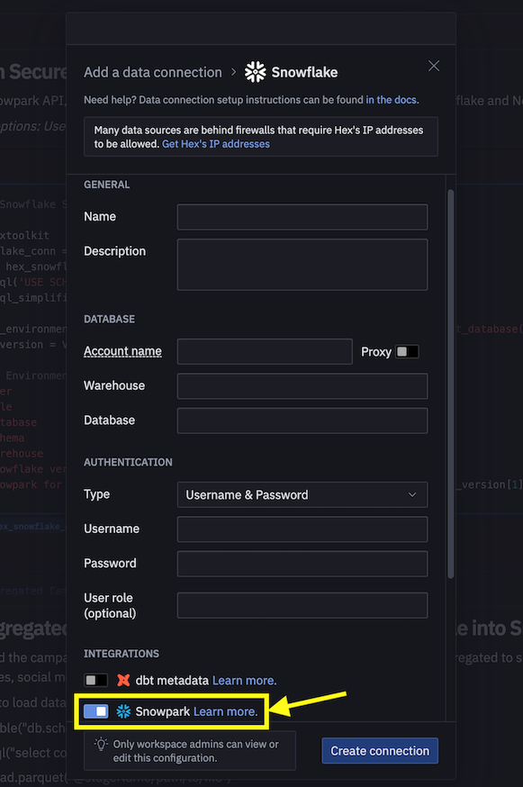

id: getting-started-with-dataengineering-ml-using-snowpark-python-ptr
categories: snowflake-site:taxonomy/solution-center/certification/quickstart, snowflake-site:taxonomy/product/ai, snowflake-site:taxonomy/snowflake-feature/ml-functions
language: en
summary: Introdução à engenharia de dados e ML com Snowpark para Python
environments: web
status: Published
feedback link: https://github.com/Snowflake-Labs/sfguides/issues
authors: Dash Desai


# Introdução à engenharia de dados e ML com Snowpark para Python
<!-- ------------------------ -->
## Visão geral


Ao completar este guia, você poderá criar uma aplicação interativa a partir de dados brutos para ajudar uma organização a otimizar a alocação de recursos para publicidade.

Confira aqui um resumo do que você vai aprender em cada etapa do quickstart:

- **Configuração do ambiente**: usar estágios e tabelas para ingerir e organizar dados brutos do S3 dentro do Snowflake.
- **Engenharia de dados**: usar os DataFrames do Snowpark para Python para executar transformações de dados, como agrupar, agregar, dinamizar e combinar, para preparar os dados para aplicações mais adiante no processo.
- **Pipelines de dados**: usar o Snowflake Tasks para transformar o código do seu pipeline de dados em pipelines operacionais com monitoramento integrado.  
- **Aprendizado de máquina**: preparar dados e executar treinamento de aprendizado de máquina (machine learning, ML) no Snowflake com o Snowpark ML e implementar o modelo como uma função definida por usuário (user-defined-function, UDF) do Snowpark.
- **Aplicação Streamlit**: desenvolver uma aplicação interativa usando Python (sem precisar de experiência com desenvolvimento web) para ajudar a visualizar o retorno do investimento (ROI) em diferentes orçamentos de publicidade.

Caso você não conheça algumas tecnologias mencionadas acima, confira a seguir um breve resumo com links para documentação.

### O que é o Snowpark?

Trata-se do conjunto de bibliotecas e sistemas de runtime (tempo de execução) do Snowflake que implementam e processam códigos não SQL de forma segura, incluindo Python, Java e Scala.

**Bibliotecas conhecidas dos clientes**: o Snowpark oferece interfaces de programação de aplicativos (application programming interface, APIs) totalmente integradas, com programação no estilo DataFrame e compatíveis com sistemas de suporte operacional (operational support system, OSS) nas linguagens que os operadores de dados gostam de usar. Ele também conta com a API Snowpark ML, para uma modelagem de aprendizado de máquina (machine learning, ML) (em versão preliminar pública) e operações de ML (em versão preliminar privada) mais eficientes.

**Estrutura de runtime flexível**: o Snowpark oferece estruturas de runtime flexíveis que permitem aos usuários inserir e executar uma lógica personalizada. Os desenvolvedores podem criar pipelines de dados, modelos de ML e aplicações de dados com facilidade, utilizando funções definidas pelo usuário e procedimentos armazenados.

Saiba mais sobre o [Snowpark](/snowpark/).


### O que é o Snowpark ML?

O Snowpark ML é uma nova biblioteca que permite um desenvolvimento de ML completo, mais ágil e intuitivo no Snowflake. Ele conta com duas APIs: Snowpark ML Modeling (em versão preliminar pública) para desenvolvimento de modelos e Snowpark ML Operations (em versão preliminar privada) para implementação de modelos.

Este quickstart é voltado para a API Snowpark ML Modeling, que expande a engenharia de recursos e simplifica a execução do treinamento de ML no Snowflake.

### O que é o Streamlit?

É uma estrutura de aplicação de [código aberto](https://github.com/streamlit/streamlit) em Python que permite aos desenvolvedores criar, compartilhar e implementar aplicações de dados de forma rápida e simples. Saiba mais sobre o [Streamlit](https://streamlit.io/).

### Você vai aprender como

- Analisar dados e executar tarefas de engenharia de dados usando DataFrames e APIs do Snowpark.
- Usar bibliotecas de código aberto em Python de um canal Anaconda selecionado do Snowflake.
- Treinar um modelo de ML usando o Snowpark ML no Snowflake.
- Criar funções definidas pelo usuário (user-defined functions, UDFs) em Python do tipo escalar e vetorizada no Snowpark, para inferência online e offline respectivamente.
- Criar Snowflake Tasks para automatizar pipelines de dados.
- Criar uma aplicação web Streamlit que usa UDF escalar para inferência baseada nos dados inseridos pelo usuário.

### Pré-requisitos

- Ter o [Git](https://git-scm.com/book/en/v2/Getting-Started-Installing-Git) instalado.
- Ter o [Python 3.9](https://www.python.org/downloads/) instalado.
  - Você vai criar um ambiente Python com a versão 3.9 na etapa **Introdução**.
- Uma conta Snowflake com [pacotes Anaconda habilitados pelo ORGADMIN](https://docs.snowflake.com/pt/developer-guide/udf/python/udf-python-packages#using-third-party-packages-from-anaconda). Caso você não possua uma conta Snowflake, inscreva-se em uma [conta de avaliação gratuita](https://signup.snowflake.com/?utm_source=snowflake-devrel&utm_medium=developer-guides&lang=pt-br&utm_cta=developer-guides).
- Um login da conta Snowflake com a função ACCOUNTADMIN. Se você tiver essa função no seu ambiente, pode optar por usá-la. Caso contrário, será necessário: 
1) Inscrever-se em uma avaliação gratuita; 
2) Usar uma função diferente capaz de criar banco de dados, esquema, tabelas, estágios, tarefas, funções definidas pelo usuário e procedimentos armazenados; OU 
3) Usar um banco de dados e esquema existentes onde você possa criar os objetos mencionados.

> 

<!-- ------------------------ -->
## Configuração do ambiente


### Criação de tabelas, carregamento de dados e configuração de estágios

Acesse o [Snowsight](https://docs.snowflake.com/pt/user-guide/ui-snowsight.html#) com suas credenciais para criar tabelas, carregar dados do Amazon S3 e configurar estágios internos do Snowflake.

> 
>
> - Se você usar nomes diferentes para os objetos criados nesta seção, atualize os scripts e o código nas seções a seguir conforme necessário.
>
> - Para cada bloco de script SQL abaixo, escolha as instruções no bloco e execute-as do início ao fim.

Execute os comandos SQL a seguir para criar um [armazenamento](https://docs.snowflake.com/pt/sql-reference/sql/create-warehouse), um [banco de dados](https://docs.snowflake.com/pt/sql-reference/sql/create-database) e um [esquema](https://docs.snowflake.com/pt/sql-reference/sql/create-schema).

```sql 
USE ROLE ACCOUNTADMIN;

CREATE OR REPLACE WAREHOUSE DASH_L; 
CREATE OR REPLACE DATABASE DASH_DB; 
CREATE OR REPLACE SCHEMA DASH_SCHEMA;

USE DASH_DB.DASH_SCHEMA; 
```

Execute os comandos SQL a seguir para criar a tabela **CAMPAIGN_SPEND** a partir dos dados hospedados no compartimento do S3 acessível ao público.

```sql 
CREATE or REPLACE file format csvformat 
  skip_header = 1 
  type = 'CSV';

CREATE or REPLACE stage campaign_data_stage 
  file_format = csvformat 
  url = 's3://sfquickstarts/ad-spend-roi-snowpark-python-scikit-learn-streamlit/campaign_spend/';

CREATE or REPLACE TABLE CAMPAIGN_SPEND (
  CAMPAIGN VARCHAR(60), 
  CHANNEL VARCHAR(60), 
  DATE DATE, 
  TOTAL_CLICKS NUMBER(38,0), 
  TOTAL_COST NUMBER(38,0), 
  ADS_SERVED NUMBER(38,0) 
);

COPY into CAMPAIGN_SPEND 
  from @campaign_data_stage; 
```

Execute os comandos SQL a seguir para criar a tabela **MONTHLY_REVENUE** a partir dos dados no hospedados no compartimento do S3 acessível ao público.

```sql 
CREATE or REPLACE stage monthly_revenue_data_stage 
  file_format = csvformat 
  url = 's3://sfquickstarts/ad-spend-roi-snowpark-python-scikit-learn-streamlit/monthly_revenue/';

CREATE or REPLACE TABLE MONTHLY_REVENUE ( 
  YEAR NUMBER(38,0), 
  MONTH NUMBER(38,0), 
  REVENUE FLOAT 
);

COPY into MONTHLY_REVENUE 
  from @monthly_revenue_data_stage; 
```

Execute os comandos SQL a seguir para criar a tabela **BUDGET_ALLOCATIONS_AND_ROI** que contém os orçamentos alocados e o retorno do investimento (ROI) dos últimos seis meses.

```sql 
CREATE or REPLACE TABLE BUDGET_ALLOCATIONS_AND_ROI ( 
  MONTH varchar(30), 
  SEARCHENGINE integer, 
  SOCIALMEDIA integer, 
  VIDEO integer, 
  EMAIL integer, 
  ROI float 
)
COMMENT = '{"origin":"sf_sit-is", "name":"aiml_notebooks_ad_spend_roi", "version":{"major":1, "minor":0}, "attributes":{"is_quickstart":1, "source":"streamlit"}}';

INSERT INTO BUDGET_ALLOCATIONS_AND_ROI (MONTH, SEARCHENGINE, SOCIALMEDIA, VIDEO, EMAIL, ROI)
VALUES 
('January',35,50,35,85,8.22), 
('February',75,50,35,85,13.90), 
('March',15,50,35,15,7.34), 
('April',25,80,40,90,13.23), 
('May',95,95,10,95,6.246), 
('June',35,50,35,85,8.22); 
```

Execute os comandos a seguir para criar os [estágios internos](https://docs.snowflake.com/pt/user-guide/data-load-local-file-system-create-stage) do Snowflake para armazenar os procedimentos armazenados, as UDFs e os arquivos de modelo de ML.

```sql
CREATE OR REPLACE STAGE dash_sprocs;
CREATE OR REPLACE STAGE dash_models;
CREATE OR REPLACE STAGE dash_udfs;
```

Se preferir, você pode abrir o [setup.sql](https://github.com/Snowflake-Labs/sfguide-ad-spend-roi-snowpark-python-streamlit-scikit-learn/blob/main/setup.sql) no Snowsight e executar todas as instruções SQL para criar os objetos e carregar os dados do AWS S3.

> 

<!-- ------------------------ -->
## Introdução


Esta seção aborda a clonagem do repositório do GitHub e a configuração do ambiente Snowpark para Python.

### Clonagem do repositório do GitHub

O primeiro passo é clonar o [repositório do GitHub](https://github.com/Snowflake-Labs/sfguide-ad-spend-roi-snowpark-python-streamlit-scikit-learn). Esse repositório contém todo o código necessário para completar este quickstart guide com sucesso.

Usando HTTPS:

```shell
git clone https://github.com/Snowflake-Labs/sfguide-getting-started-dataengineering-ml-snowpark-python.git
```

OU usando SSH:

```shell
git clone git@github.com:Snowflake-Labs/sfguide-getting-started-dataengineering-ml-snowpark-python.git
```

### Snowpark para Python

Para concluir as etapas de **Engenharia de dados** e **Aprendizado de máquina**, você pode instalar tudo localmente (opção 1) ou usar o Hex (opção 2) como descrito a seguir.

> 

#### Opção 1 – Instalação local

Esta opção permite completar todas as etapas deste quickstart guide.

**Etapa 1:** fazer download e executar o programa de instalação miniconda de [https://conda.io/miniconda.html](https://conda.io/miniconda.html). *(Se preferir, utilize qualquer outro ambiente Python com Python 3.9, por exemplo, [virtualenv](https://virtualenv.pypa.io/en/latest/))*.

**Etapa 2:** abrir uma nova janela do terminal e executar os seguintes comandos nela.

**Etapa 3:** criar um ambiente conda em Python 3.9 chamado **snowpark-de-ml**, executando o seguinte comando na janela do terminal.

```python
conda create --name snowpark-de-ml -c https://repo.anaconda.com/pkgs/snowflake python=3.9
```

**Etapa 4:** ativar o ambiente conda **snowpark-de-ml** executando o seguinte comando na janela do terminal.

```python
conda activate snowpark-de-ml
```

**Etapa 5:** instalar o Snowpark Python e as demais bibliotecas no ambiente conda **snowpark-de-ml** a partir do [canal Snowflake Anaconda](https://repo.anaconda.com/pkgs/snowflake/), executando o seguinte comando na janela do terminal.

```python
conda install -c https://repo.anaconda.com/pkgs/snowflake snowflake-snowpark-python pandas notebook scikit-learn cachetools
```

**Etapa 6:** instalar a biblioteca Streamlit no ambiente conda **snowpark-de-ml** executando o seguinte comando na janela do terminal.

```python
pip install streamlit
```

**Etapa 7:** instalar a biblioteca Snowpark ML no ambiente conda **snowpark-de-ml** executando o seguinte comando na janela do terminal.

```python
pip install snowflake-ml-python
```

**Etapa 9:** atualizar o [connection.json](https://github.com/Snowflake-Labs/sfguide-ml-model-snowpark-python-scikit-learn-streamlit/blob/main/connection.json) com as informações e as credenciais da sua conta Snowflake.

Aqui temos um ***connection.json*** de amostra baseado nos nomes de objeto mencionados na etapa **Configuração do ambiente**.

```json
{
  "account"   : "<your_account_identifier_goes_here>",
  "user"      : "<your_username_goes_here>",
  "password"  : "<your_password_goes_here>",
  "role"      : "ACCOUNTADMIN",
  "warehouse" : "DASH_L",
  "database"  : "DASH_DB",
  "schema"    : "DASH_SCHEMA"
}
```

> 

#### Opção 2 – Utilização do Hex

Caso opte por usar sua conta [Hex](https://app.hex.tech/login) ou [criar uma conta de avaliação gratuita de 30 dias](https://app.hex.tech/signup/quickstart-30), então o Snowpark para Python já estará integrado, eliminando a necessidade de criar um ambiente Python e instalar o Snowpark para Python junto das demais bibliotecas no seu notebook. Com isso, você poderá concluir as etapas de **Engenharia de dados** e **Aprendizado de máquina** deste quickstart guide direto no Hex. Consulte as respectivas etapas para obter mais detalhes sobre o carregamento de notebooks de engenharia de dados e aprendizado de máquina no Hex.

> 

<!-- ------------------------ -->
## Engenharia de dados


O notebook do link abaixo aborda as seguintes tarefas de engenharia de dados.

1) Estabelecer uma conexão segura entre o Snowpark Python e o Snowflake. 
2) Carregar dados de tabelas do Snowflake nos DataFrames do Snowpark. 
3) Executar uma análise de dados exploratória nos DataFrames do Snowpark. 
4) Dinamizar e combinar dados de várias tabelas usando os DataFrames do Snowpark. 
5) Automatizar as tarefas de pipeline de dados com o Snowflake Tasks.

### Notebook de engenharia de dados no Jupyter ou Visual Studio Code

Para começar, siga estas etapas:

1) Em uma janela do terminal, acesse a seguinte pasta e execute `jupyter notebook` na linha de comando. (Também é possível usar outras ferramentas e ambientes de desenvolvimento integrado \[integrated development environment, IDEs], como o Visual Studio Code.)

2) Abra e execute as células em [Snowpark_For_Python_DE.ipynb](https://github.com/Snowflake-Labs/sfguide-ad-spend-roi-snowpark-python-streamlit-scikit-learn/blob/main/Snowpark_For_Python_DE.ipynb).

> 

### Notebook de engenharia de dados no Hex

Caso opte por usar sua conta do [Hex](https://app.hex.tech/login) ou [criar uma conta de avaliação gratuita de 30 dias](https://app.hex.tech/signup/quickstart-30), siga estas etapas para carregar o notebook e criar uma conexão de dados com o Snowflake a partir do Hex.

1) Importe [Snowpark_For_Python_DE.ipynb](https://github.com/Snowflake-Labs/sfguide-ad-spend-roi-snowpark-python-streamlit-scikit-learn/blob/main/Snowpark_For_Python_DE.ipynb) como um projeto na sua conta. Para obter mais informações sobre importação, consulte a [documentação](https://learn.hex.tech/docs/versioning/import-export).

2) A seguir, em vez de usar [connection.json](https://github.com/Snowflake-Labs/sfguide-ml-model-snowpark-python-scikit-learn-streamlit/blob/main/connection.json) para se conectar ao Snowflake, crie uma [conexão de dados](https://learn.hex.tech/tutorials/connect-to-data/get-your-data#set-up-a-data-connection-to-your-database) e use-a no notebook de engenharia de dados conforme demonstrado abaixo.



> 

3) Substitua o próximo snippet de código no notebook.

```python
connection_parameters = json.load(open('connection.json'))
session = Session.builder.configs(connection_parameters).create()
```

**por...**

```python
import hextoolkit
hex_snowflake_conn = hextoolkit.get_data_connection('YOUR_DATA_CONNECTION_NAME')
session = hex_snowflake_conn.get_snowpark_session()
session.sql('USE SCHEMA DASH_SCHEMA').collect()
```

<!-- ------------------------ -->
## Pipelines de dados

Também é possível operacionalizar as transformações de dados na forma de pipelines de dados automatizados executados no Snowflake.

Em particular, no [notebook de engenharia de dados](https://github.com/Snowflake-Labs/sfguide-ad-spend-roi-snowpark-python-streamlit-scikit-learn/blob/main/Snowpark_For_Python_DE.ipynb), há uma seção que mostra como criar e executar transformações de dados de modo opcional como [Snowflake Tasks](https://docs.snowflake.com/en/user-guide/tasks-intro).

Para fins de referência, aqui estão os snippets de código.

### **Tarefa raiz / pai (primária)**

Automatiza o carregamento de dados de despesas da campanha e a execução de diversas transformações.

```python 
def campaign_spend_data_pipeline(session: Session) -> str: 
  # DATA TRANSFORMATIONS 
  # Perform the following actions to transform the data

  # Load the campaign spend data 
  snow_df_spend_t = session.table('campaign_spend')

  # Transform the data so we can see total cost per year/month per channel using group_by() and agg() Snowpark DataFrame functions 
  snow_df_spend_per_channel_t = snow_df_spend_t.group_by(year('DATE'), month('DATE'),'CHANNEL').agg(sum('TOTAL_COST').as_('TOTAL_COST')).\
      with_column_renamed('"YEAR(DATE)"',"YEAR").with_column_renamed('"MONTH(DATE)"',"MONTH").sort('YEAR','MONTH')

  # Transform the data so that each row will represent total cost across all channels per year/month using pivot() and sum() Snowpark DataFrame functions 
  snow_df_spend_per_month_t = snow_df_spend_per_channel_t.pivot('CHANNEL',['search_engine','social_media','video','email']).sum('TOTAL_COST').sort('YEAR','MONTH') 
  snow_df_spend_per_month_t = snow_df_spend_per_month_t.select( 
      col("YEAR"), 
      col("MONTH"), 
      col("'search_engine'").as_("SEARCH_ENGINE"), 
      col("'social_media'").as_("SOCIAL_MEDIA"), 
      col("'video'").as_("VIDEO"), 
      col("'email'").as_("EMAIL") 
  )

  # Save transformed data 
  snow_df_spend_per_month_t.write.mode('overwrite').save_as_table('SPEND_PER_MONTH')

# Register data pipelining function as a Stored Procedure so it can be run as a task
session.sproc.register( 
  func=campaign_spend_data_pipeline, 
  name="campaign_spend_data_pipeline", 
  packages=['snowflake-snowpark-python'],
  is_permanent=True, 
  stage_location="@dash_sprocs", 
    replace=True)

campaign_spend_data_pipeline_task = """ 
CREATE OR REPLACE TASK campaign_spend_data_pipeline_task 
    WAREHOUSE = 'DASH_L' 
    SCHEDULE = '3 MINUTE' 
AS 
    CALL campaign_spend_data_pipeline() 
""" 
session.sql(campaign_spend_data_pipeline_task).collect() 
```

### **Tarefa filho (secundária) / dependente**

Automatiza o carregamento de dados de receita mensal, a execução de diversas transformações e a combinação com dados transformados de despesas da campanha.

```python 
def monthly_revenue_data_pipeline(session: Session) -> str: 
  # Load revenue table and transform the data into revenue per year/month using group_by and agg() functions 
  snow_df_spend_per_month_t = session.table('spend_per_month') 
  snow_df_revenue_t = session.table('monthly_revenue') 
  snow_df_revenue_per_month_t = snow_df_revenue_t.group_by('YEAR','MONTH').agg(sum('REVENUE')).sort('YEAR','MONTH').with_column_renamed('SUM(REVENUE)','REVENUE')

  # Join revenue data with the transformed campaign spend data so that our input features (i.e. cost per channel) and target variable (i.e. revenue) can be loaded into a single table for model training 
  snow_df_spend_and_revenue_per_month_t = snow_df_spend_per_month_t.join(snow_df_revenue_per_month_t, ["YEAR","MONTH"])

  # SAVE in a new table for the next task 
  snow_df_spend_and_revenue_per_month_t.write.mode('overwrite').save_as_table('SPEND_AND_REVENUE_PER_MONTH')

# Register data pipelining function as a Stored Procedure so it can be run as a task
session.sproc.register( 
  func=monthly_revenue_data_pipeline, 
  name="monthly_revenue_data_pipeline", 
  packages=['snowflake-snowpark-python'], 
  is_permanent=True, 
  stage_location="@dash_sprocs", 
  replace=True)

monthly_revenue_data_pipeline_task = """ 
  CREATE OR REPLACE TASK monthly_revenue_data_pipeline_task 
      WAREHOUSE = 'DASH_L' 
      AFTER campaign_spend_data_pipeline_task 
  AS 
      CALL monthly_revenue_data_pipeline() 
  """ 
session.sql(monthly_revenue_data_pipeline_task).collect() 
```

> 

#### Iniciar tarefas

O Snowflake Tasks não é iniciado por padrão, então é preciso executar as seguintes instruções para iniciá-lo/retomá-lo.

```sql
session.sql("alter task monthly_revenue_data_pipeline_task resume").collect()
session.sql("alter task campaign_spend_data_pipeline_task resume").collect()
```

#### Suspender tarefas

Se você retomar as tarefas acima, suspenda-as para evitar o uso desnecessário de recursos, executando os seguintes comandos.

```sql
session.sql("alter task campaign_spend_data_pipeline_task suspend").collect()
session.sql("alter task monthly_revenue_data_pipeline_task suspend").collect()
```

### Observabilidade das tarefas

As tarefas e seus [gráficos acíclicos dirigidos (directed acyclic graphs, DAGs)](https://docs.snowflake.com/pt/user-guide/tasks-intro#dag-of-tasks) podem ser visualizados no [Snowsight](https://docs.snowflake.com/en/user-guide/ui-snowsight-tasks#viewing-individual-task-graphs), conforme mostrado abaixo.

---


---

### Notificações de erros para as tarefas

Também é possível habilitar notificações por push para um serviço de mensagens na nuvem em caso de erros durante a execução das tarefas. Para obter mais informações, consulte a [documentação](https://docs.snowflake.com/pt/user-guide/tasks-errors).

<!-- ------------------------ -->
## Aprendizado de máquina


> 

O notebook do link abaixo aborda as seguintes tarefas de aprendizado de máquina.

1) Estabelecer uma conexão segura entre o Snowpark Python e o Snowflake. 
2) Carregar recursos e destinos da tabela do Snowflake no DataFrame do Snowpark. 
3) Preparar os recursos para treinamento de modelos. 
4) Treinar o modelo de ML com Snowpark ML no Snowflake. 
5) Criar [funções definidas pelo usuário (UDFs)](https://docs.snowflake.com/pt/developer-guide/snowpark/python/creating-udfs) escalares e vetorizadas (também conhecidas como “em lote”) para inferência de novos pontos de dados e inferência online e offline, respectivamente.

---


---

### Notebook de aprendizado de máquina no Jupyter ou Visual Studio Code

Para começar, siga estas etapas:

1) Em uma janela do terminal, acesse a seguinte pasta e execute `jupyter notebook` na linha de comando. (Também é possível usar outras ferramentas e ambientes de desenvolvimento integrado \[integrated development environment, IDEs], como o Visual Studio Code.)

2) Abra e execute o [Snowpark_For_Python_ML.ipynb](https://github.com/Snowflake-Labs/sfguide-ad-spend-roi-snowpark-python-streamlit-scikit-learn/blob/main/Snowpark_For_Python_ML.ipynb)

> 

### Notebook de aprendizado de máquina no Hex

Caso opte por usar sua conta do [Hex](https://app.hex.tech/login) ou [criar uma conta de avaliação gratuita de 30 dias](https://app.hex.tech/signup/quickstart-30), siga estas etapas para carregar o notebook e criar uma conexão de dados com o Snowflake a partir do Hex.

1) Importe [Snowpark_For_Python_ML.ipynb](https://github.com/Snowflake-Labs/sfguide-ad-spend-roi-snowpark-python-streamlit-scikit-learn/blob/main/Snowpark_For_Python_ML.ipynb) como um projeto na sua conta. Para obter mais informações sobre importação, consulte a [documentação](https://learn.hex.tech/docs/versioning/import-export).

2) A seguir, em vez de usar [connection.json](https://github.com/Snowflake-Labs/sfguide-ml-model-snowpark-python-scikit-learn-streamlit/blob/main/connection.json) para se conectar ao Snowflake, crie uma [conexão de dados](https://learn.hex.tech/tutorials/connect-to-data/get-your-data#set-up-a-data-connection-to-your-database) e use-a no notebook de aprendizado de máquina, como demonstrado abaixo.


> 

3) Substitua o próximo snippet de código no notebook.

```python
connection_parameters = json.load(open('connection.json'))
session = Session.builder.configs(connection_parameters).create()
```

**por...**

```python
import hextoolkit
hex_snowflake_conn = hextoolkit.get_data_connection('YOUR_DATA_CONNECTION_NAME')
session = hex_snowflake_conn.get_snowpark_session()
session.sql('USE SCHEMA DASH_SCHEMA').collect()
```

<!-- ------------------------ -->
## Aplicação Streamlit


### Execução local da aplicação Streamlit

Em uma janela do terminal, acesse esta pasta e use o próximo comando para executar a aplicação Streamlit [Snowpark_Streamlit_Revenue_Prediction.py](https://github.com/Snowflake-Labs/sfguide-ad-spend-roi-snowpark-python-streamlit-scikit-learn/blob/main/Snowpark_Streamlit_Revenue_Prediction.py) localmente em sua máquina.

```shell
streamlit run Snowpark_Streamlit_Revenue_Prediction.py
```

Se tudo correr bem, deve surgir uma janela de navegador com a aplicação carregada, conforme abaixo.

---


---

### Execução da aplicação Streamlit no Snowflake – Streamlit-in-Snowflake (SiS)

Caso você tenha o SiS habilitado em sua conta, siga estas etapas para executar a aplicação no Snowsight, em vez de localmente em sua máquina.

> 

  1) Clique em **Streamlit Apps** no menu de navegação à esquerda. 
2) Clique em **\+ Streamlit App** no canto superior direito. 
3) Insira o **nome da aplicação**. 
4) Selecione **Warehouse** e o **local da aplicação** (banco de dados e esquema) onde você quer criar a aplicação Streamlit. 
5) Clique em **Create**. 
6) Você receberá um código de uma aplicação Streamlit de exemplo. Agora, abra [Snowpark_Streamlit_Revenue_Prediction_SiS.py](https://github.com/Snowflake-Labs/sfguide-ad-spend-roi-snowpark-python-streamlit-scikit-learn/blob/main/Snowpark_Streamlit_Revenue_Prediction_SiS.py) e copie e cole o código na aplicação Streamlit de exemplo.
 7) Clique em **Run** no canto superior direito.

Se tudo correr bem, você deverá ver a aplicação no Snowsight conforme abaixo.

---


---

### Salvar dados no Snowflake

Em ambas as aplicações, ajuste os controles deslizantes de orçamento de publicidade para ver o retorno do investimento (ROI) previsto para essas alocações. Também é possível clicar no botão **Save to Snowflake** para salvar as alocações atuais e o retorno do investimento previsto na tabela BUDGET_ALLOCATIONS_AND_ROI do Snowflake.

### Diferenças entre as duas aplicações Streamlit

A principal diferença entre executar a aplicação Streamlit localmente e no Snowflake (SiS) é a forma como você cria e acessa o objeto da sessão.

Na execução local, você cria e acessa o novo objeto da sessão da seguinte forma:

```python
# Função para criar uma sessão Snowflake para conectar ao Snowflake
def create_session(): 
    if "snowpark_session" not in st.session_state: 
        session = Session.builder.configs(json.load(open("connection.json"))).create() 
        st.session_state['snowpark_session'] = session 
    else: 
        session = st.session_state['snowpark_session'] 
    return session 
```

Ao executar no Snowflake (SiS), você acessa o objeto da sessão atual da seguinte forma:

```python
session = snowpark.session._get_active_session()
```

<!-- ------------------------ -->
## Limpeza

Caso você tenha iniciado/retomado as duas tarefas `monthly_revenue_data_pipeline_task` e `campaign_spend_data_pipeline_task` durante as seções **Engenharia de dados** ou **Pipelines de dados**, é importante executar os seguintes comandos para suspender essas tarefas e evitar o uso desnecessário de recursos.

No notebook que usa a API Snowpark Python:

```sql
session.sql("alter task campaign_spend_data_pipeline_task suspend").collect()
session.sql("alter task monthly_revenue_data_pipeline_task suspend").collect()
```

No Snowsight:

```sql
alter task campaign_spend_data_pipeline_task suspend;
alter task monthly_revenue_data_pipeline_task suspend;
```

<!-- ------------------------ -->
## Conclusão e recursos


Parabéns! Você executou com sucesso tarefas de engenharia de dados e treinou um modelo de regressão linear para prever o retorno do investimento (ROI) futuro de diversos orçamentos de publicidade em diferentes canais, incluindo pesquisa, vídeo, redes sociais e email usando o Snowpark para Python e scikit-learn. Depois, você criou uma aplicação Streamlit que usa esse modelo para gerar previsões de novas alocações de orçamento com base nos dados inseridos pelo usuário.

Adoraríamos saber sua opinião sobre este quickstart guide! Preencha este [formulário de feedback](https://forms.gle/XKd8rXPUNs2G1yM28).

### Você aprendeu a

- Analisar dados e executar tarefas de engenharia de dados usando DataFrames e APIs do Snowpark.
- Usar bibliotecas de código aberto em Python de um canal Anaconda selecionado do Snowflake.
- Treinar um modelo de ML usando o Snowpark ML no Snowflake.
- Criar funções definidas pelo usuário (UDFs) em Python do tipo escalar e vetorizada no Snowpark, para inferência online e offline respectivamente.
- Criar Snowflake Tasks para automatizar pipelines de dados e (re)treinar modelos.
- Criar uma aplicação web Streamlit que usa a UDF escalar para inferência.

### Recursos relacionados

- [Código fonte no GitHub](https://github.com/Snowflake-Labs/sfguide-ad-spend-roi-snowpark-python-streamlit-scikit-learn)
- [Avançado: guia de engenharia de dados com Snowpark para Python](/en/developers/guides/data-engineering-pipelines-with-snowpark-python/)
- [Avançado: guia de aprendizado de máquina com Snowpark para Python](/en/developers/guides/getting-started-snowpark-machine-learning/)
- [Demonstrações do Snowpark para Python](https://github.com/Snowflake-Labs/snowpark-python-demos/blob/main/README.md)
- [Guia do desenvolvedor de Snowpark para Python](https://docs.snowflake.com/pt/developer-guide/snowpark/python/index)
- [Documentação Streamlit](https://docs.streamlit.io/)
