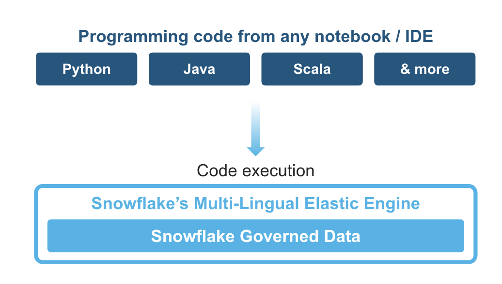
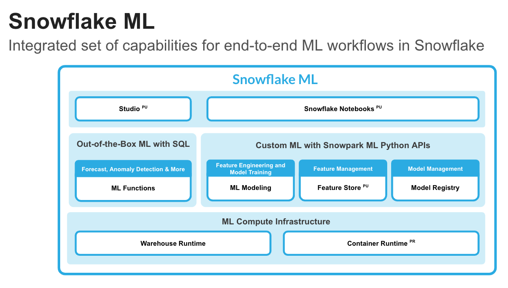
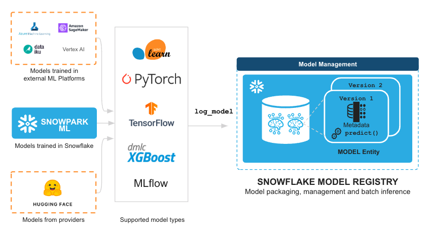
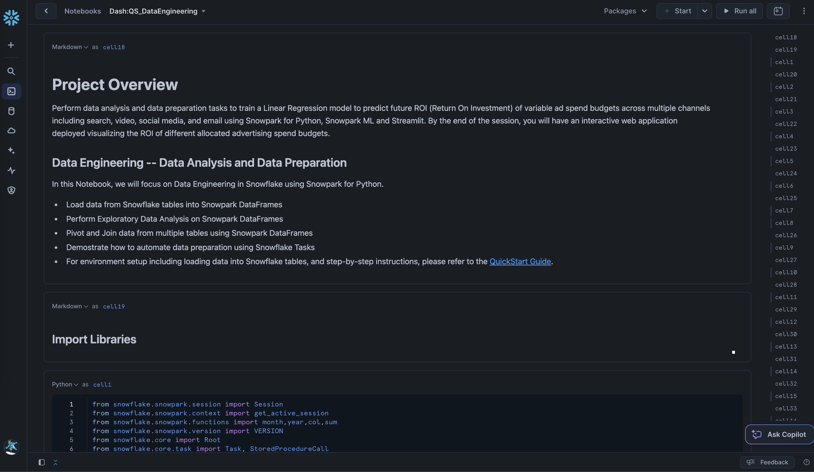
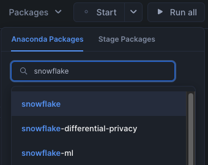
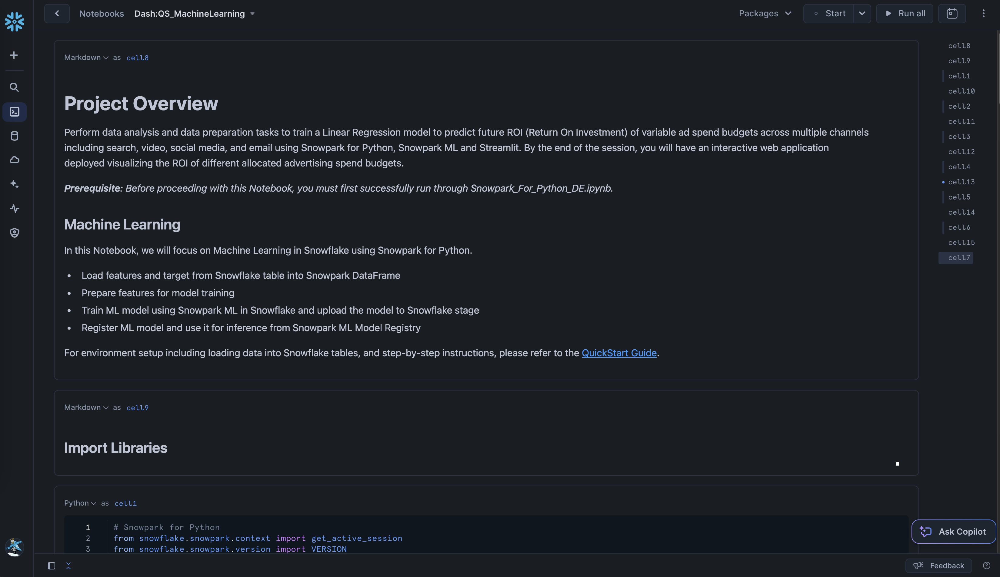

id: getting-started-with-dataengineering-ml-using-snowpark-python
categories: snowflake-site:taxonomy/solution-center/certification/quickstart, snowflake-site:taxonomy/solution-center/certification/community-sourced, snowflake-site:taxonomy/solution-center/includes/architecture, snowflake-site:taxonomy/product/ai, snowflake-site:taxonomy/snowflake-feature/ml-functions
language: en
summary: Getting Started with Data Engineering and ML using Snowpark for Python and Snowflake Notebooks 
environments: web
status: Published
feedback link: <https://github.com/Snowflake-Labs/sfguides/issues>
authors: Dash Desai


# Getting Started with Data Engineering and ML using Snowpark for Python and Snowflake Notebooks
<!-- ------------------------ -->
## Overview


By completing this guide, you will be able to go from raw data to an interactive application that can help organization optimize their advertising budget allocation.

Here is a summary of what you will be able to learn in each step by following this quickstart:

- **Setup Environment**: Use stages and tables to ingest and organize raw data from S3 into Snowflake
- **Data Engineering**: Leverage Snowpark for Python DataFrames in Snowflake Notebook to perform data transformations such as group by, aggregate, pivot, and join to prep the data for downstream applications
- **Data Pipelines**: Use Snowflake Tasks to turn your data pipeline code into operational pipelines with integrated monitoring
- **Machine Learning**: Process data and run training job in Snowflake Notebook using the Snowpark ML library, and register ML model and use it for inference from Snowflake Model Registry
- **Streamlit**: Build an interactive Streamlit application using Python (no web development experience required) to help visualize the ROI of different advertising spend budgets

### What is Snowpark?

Snowpark is the set of libraries and code execution environments that run Python and other programming languages next to your data in Snowflake. Snowpark can be used to build data pipelines, ML models, apps, and other data processing tasks.



**Client Side Libraries** - Snowpark libraries can be installed and downloaded from any client-side notebook or IDE and are used for code development and deployment. Libraries include the Snowpark API for data pipelines and apps and the Snowpark ML API for end to end machine learning.

**Elastic Compute Runtimes** - Snowpark provides elastic compute runtimes for secure execution of your code in Snowflake. Runtime options include: Python, Java, and Scala in warehouses, container runtimes for out-of-the-box distributed processing with CPUs or GPUs using any Python framework, or custom runtimes brought in from Snowpark Container Services to execute any language of choice with CPU or GPU compute.

Learn more about [Snowpark](/snowpark/).

### What is Snowflake ML?

Snowflake ML is the integrated set of capabilities for end-to-end machine learning in a single platform on top of your governed data. Snowflake ML can be used for fully custom and out-of-the-box workflows. For ready-to-use ML, analysts can use ML Functions to shorten development time or democratize ML across your organization with SQL from Studio, our no-code user interface. For custom ML, data scientists and ML engineers can easily and securely develop and productionize scalable features and models without any data movement, silos or governance tradeoffs.

To get started with Snowflake ML, developers can use the Python APIs from the [Snowpark ML library](https://docs.snowflake.com/en/developer-guide/snowpark-ml/index), directly from Snowflake Notebooks (public preview) or downloaded and installed into any IDE of choice, including Jupyter or Hex.



This quickstart will focus on

- Snowpark ML Modeling API, which enables the use of popular Python ML frameworks, such as scikit-learn and XGBoost, for feature engineering and model training without the need to move data out of Snowflake.

- Snowflake Model Registry, which provides scalable and secure model management of ML models in Snowflake, regardless of origin.
Using these features, you can build and operationalize a complete ML workflow, taking advantage of Snowflake's scale and security features.

**Feature Engineering and Preprocessing** - Improve performance and scalability with distributed execution for common scikit-learn preprocessing functions.

**Model Training** - Accelerate model training for scikit-learn, XGBoost and LightGBM models without the need to manually create stored procedures or user-defined functions (UDFs), and leverage distributed hyperparameter optimization.


**Model Management and Batch Inference** - Manage several types of ML models created both within and outside Snowflake and execute batch inference.



### What is Streamlit?

Streamlit enables data scientists and Python developers to combine Streamlit's component-rich, open-source Python library with the scale, performance, and security of the Snowflake platform.

Learn more about [Streamlit](/en/data-cloud/overview/streamlit-in-snowflake/).

### What You Will Learn

- How to analyze data and perform data engineering tasks using Snowpark DataFrames and APIs
- How to use open-source Python libraries from curated Snowflake Anaconda channel
- How to create Snowflake Tasks to automate data pipelines
- How to train ML model using Snowpark ML in Snowflake
- How to register ML model and use it for inference from Snowpark ML Model Registry
- How to create Streamlit application that uses the ML Model for inference based on user input

### What You Will Build

- A data engineering pipeline
- A machine learning model
- A Streamlit application

### Prerequisites

- A Snowflake account with [Anaconda Packages enabled by ORGADMIN](https://docs.snowflake.com/en/developer-guide/udf/python/udf-python-packages.html#using-third-party-packages-from-anaconda). If you do not have a Snowflake account, you can register for a [free trial account](https://signup.snowflake.com/?utm_source=snowflake-devrel&utm_medium=developer-guides&utm_cta=developer-guides).
- A Snowflake account login with ACCOUNTADMIN role. If you have this role in your environment, you may choose to use it. If not, you will need to 1) Register for a free trial, 2) Use a different role that has the ability to create database, schema, tables, stages, tasks, user-defined functions, and stored procedures OR 3) Use an existing database and schema in which you are able to create the mentioned objects.

> IMPORTANT: Before proceeding, make sure you have a Snowflake account with Anaconda packages enabled by ORGADMIN as described [here](https://docs.snowflake.com/en/developer-guide/udf/python/udf-python-packages#getting-started).

<!-- ------------------------ -->
## Setup Environment


### Create Tables and Load Data

Log into [Snowsight](https://docs.snowflake.com/en/user-guide/ui-snowsight.html#) using your credentials to create tables and load data from Amazon S3.


> IMPORTANT:
>
> - If you use different names for objects created in this section, be sure to update scripts and code in the following sections accordingly.
>
> - For each SQL script block below, select all the statements in the block and execute them top to bottom.

In a new SQL worksheet, run the following SQL commands to create the [warehouse](https://docs.snowflake.com/en/sql-reference/sql/create-warehouse.html), [database](https://docs.snowflake.com/en/sql-reference/sql/create-database.html) and [schema](https://docs.snowflake.com/en/sql-reference/sql/create-schema.html).

```sql
USE ROLE ACCOUNTADMIN;

CREATE WAREHOUSE IF NOT EXISTS DASH_S WAREHOUSE_SIZE=SMALL;
CREATE DATABASE IF NOT EXISTS DASH_DB;
CREATE SCHEMA IF NOT EXISTS DASH_SCHEMA;

USE DASH_DB.DASH_SCHEMA;
USE WAREHOUSE DASH_S;
```

In the same SQL worksheet, run the following SQL commands to create table **CAMPAIGN_SPEND** from data hosted on publicly accessible S3 bucket.

```sql
CREATE or REPLACE file format csvformat
  skip_header = 1
  type = 'CSV';

CREATE or REPLACE stage campaign_data_stage
  file_format = csvformat
  url = 's3://sfquickstarts/ad-spend-roi-snowpark-python-scikit-learn-streamlit/campaign_spend/';

CREATE or REPLACE TABLE CAMPAIGN_SPEND (
  CAMPAIGN VARCHAR(60), 
  CHANNEL VARCHAR(60),
  DATE DATE,
  TOTAL_CLICKS NUMBER(38,0),
  TOTAL_COST NUMBER(38,0),
  ADS_SERVED NUMBER(38,0)
);

COPY into CAMPAIGN_SPEND
  from @campaign_data_stage;
```

In the same SQL worksheet, run the following SQL commands to create table **MONTHLY_REVENUE** from data hosted on publicly accessible S3 bucket.

```sql
CREATE or REPLACE stage monthly_revenue_data_stage
  file_format = csvformat
  url = 's3://sfquickstarts/ad-spend-roi-snowpark-python-scikit-learn-streamlit/monthly_revenue/';

CREATE or REPLACE TABLE MONTHLY_REVENUE (
  YEAR NUMBER(38,0),
  MONTH NUMBER(38,0),
  REVENUE FLOAT
);

COPY into MONTHLY_REVENUE
  from @monthly_revenue_data_stage;
```

In the same SQL worksheet, run the following SQL commands to create table **BUDGET_ALLOCATIONS_AND_ROI** that holds the last six months of budget allocations and ROI.

```sql
CREATE or REPLACE TABLE BUDGET_ALLOCATIONS_AND_ROI (
  MONTH varchar(30),
  SEARCHENGINE integer,
  SOCIALMEDIA integer,
  VIDEO integer,
  EMAIL integer,
  ROI float
)
COMMENT = '{"origin":"sf_sit-is", "name":"aiml_notebooks_ad_spend_roi", "version":{"major":1, "minor":0}, "attributes":{"is_quickstart":1, "source":"streamlit"}}';

INSERT INTO BUDGET_ALLOCATIONS_AND_ROI (MONTH, SEARCHENGINE, SOCIALMEDIA, VIDEO, EMAIL, ROI)
VALUES
('January',35,50,35,85,8.22),
('February',75,50,35,85,13.90),
('March',15,50,35,15,7.34),
('April',25,80,40,90,13.23),
('May',95,95,10,95,6.246),
('June',35,50,35,85,8.22);
```

Optionally, you can also open [setup.sql](https://github.com/Snowflake-Labs/sfguide-getting-started-dataengineering-ml-snowpark-python/blob/main/setup.sql) in Snowsight and run all SQL statements to create the objects and load data from AWS S3.


> IMPORTANT: If you use different names for objects created in this section, be sure to update scripts and code in the following sections accordingly.

<!-- ------------------------ -->
## Data Engineering


The Notebook linked below covers the following data engineering tasks.

1) Load data from Snowflake tables into Snowpark DataFrames
2) Perform Exploratory Data Analysis on Snowpark DataFrames
3) Pivot and Join data from multiple tables using Snowpark DataFrames
4) Automate data pipelines using Snowflake Tasks

### Data Engineering Notebook

To get started, follow these steps:

1) Click on [Snowpark_For_Python_DE.ipynb](https://github.com/Snowflake-Labs/sfguide-getting-started-dataengineering-ml-snowpark-python/blob/main/Snowpark_For_Python_DE.ipynb) to download the Notebook from GitHub. ***(NOTE: Do NOT right-click to download.)***

2) In your Snowflake account:
  * On the left hand navigation menu, click on **Projects** >> **Notebooks**  
  * On the top right, click on **Notebook** down arrow and select **Import .ipynb file** from the dropdown menu
  * Select the file you downloaded in step 1 above

3) In the Create Notebook popup
  * For **Notebook location**, select DASH_DB and DASH_SCHEMA
  * For **SQL warehouse**, select DASH_S
  * Click on **Create** button

If all goes well, you should see the following Notebook:



4) On the top right, click on **Packages** and make sure you install `snowflake` package by typing it in the search box and clicking on the first one.



5) On the top right, click on **Start**. ***(NOTE: The first time it will take a couple of mins to install the packages.)***

6) Once the packages are installed and the state changes from **Start** >> **Starting** >> **Active**, you can either click on **Run all** to execute all cells, or you can run individual cells in the order from top to bottom by clicking on the play icon on the top right corner of each cell. 

<!-- ------------------------ -->
## Data Pipelines

You can also operationalize the data transformations in the form of automated data pipelines running in Snowflake.

In particular, in the [Data Engineering Notebook](https://github.com/Snowflake-Labs/sfguide-getting-started-dataengineering-ml-snowpark-python/blob/main/Snowpark_For_Python_DE.ipynb), there's a section that demonstrates how to optionally build and run the data transformations as [Snowflake Tasks](https://docs.snowflake.com/en/user-guide/tasks-intro).

For reference purposes, here are the code snippets.

### **Campaign Spend**

This task automates loading campain spend data and performing various transformations.

```python
def campaign_spend_data_pipeline(session: Session) -> str:
  # DATA TRANSFORMATIONS
  # Perform the following actions to transform the data

  # Load the campaign spend data
  snow_df_spend_t = session.table('campaign_spend')

  # Transform the data so we can see total cost per year/month per channel using group_by() and agg() Snowpark DataFrame functions
  snow_df_spend_per_channel_t = snow_df_spend_t.group_by(year('DATE'), month('DATE'),'CHANNEL').agg(sum('TOTAL_COST').as_('TOTAL_COST')).\
      with_column_renamed('"YEAR(DATE)"',"YEAR").with_column_renamed('"MONTH(DATE)"',"MONTH").sort('YEAR','MONTH')

  # Transform the data so that each row will represent total cost across all channels per year/month using pivot() and sum() Snowpark DataFrame functions
  snow_df_spend_per_month_t = snow_df_spend_per_channel_t.pivot('CHANNEL',['search_engine','social_media','video','email']).sum('TOTAL_COST').sort('YEAR','MONTH')
  snow_df_spend_per_month_t = snow_df_spend_per_month_t.select(
      col("YEAR"),
      col("MONTH"),
      col("'search_engine'").as_("SEARCH_ENGINE"),
      col("'social_media'").as_("SOCIAL_MEDIA"),
      col("'video'").as_("VIDEO"),
      col("'email'").as_("EMAIL")
  )

  # Save transformed data
  snow_df_spend_per_month_t.write.mode('overwrite').save_as_table('SPEND_PER_MONTH')

# Register data pipeline function as a task
root = Root(session)
my_task = Task(name='campaign_spend_data_pipeline_task'
               , definition=StoredProcedureCall(
                   campaign_spend_data_pipeline, stage_location='@dash_sprocs'
               )
               , warehouse='DASH_S'
               , schedule=timedelta(minutes=3))

tasks = root.databases[session.get_current_database()].schemas[session.get_current_schema()].tasks
task_res = tasks.create(my_task,mode=CreateMode.or_replace)
```

### **Monthly Revenue**

This task automates loading monthly revenue data, performing various transformations, and joining it with transformed campaign spend data.

```python
def monthly_revenue_data_pipeline(session: Session) -> str:
  # Load revenue table and transform the data into revenue per year/month using group_by and agg() functions
  snow_df_spend_per_month_t = session.table('spend_per_month')
  snow_df_revenue_t = session.table('monthly_revenue')
  snow_df_revenue_per_month_t = snow_df_revenue_t.group_by('YEAR','MONTH').agg(sum('REVENUE')).sort('YEAR','MONTH').with_column_renamed('SUM(REVENUE)','REVENUE')

  # Join revenue data with the transformed campaign spend data so that our input features (i.e. cost per channel) and target variable (i.e. revenue) can be loaded into a single table for model training
  snow_df_spend_and_revenue_per_month_t = snow_df_spend_per_month_t.join(snow_df_revenue_per_month_t, ["YEAR","MONTH"])

  # SAVE in a new table for the next task
  snow_df_spend_and_revenue_per_month_t.write.mode('overwrite').save_as_table('SPEND_AND_REVENUE_PER_MONTH')
```

### **Tasks DAG**

```python
# Delete the previous task
task_res.delete()

with DAG("de_pipeline_dag", schedule=timedelta(minutes=3)) as dag:
    # Create a task that runs our first pipleine
    dag_spend_task = DAGTask(name='campaign_spend_data_pipeline_task'
                        , definition=StoredProcedureCall(
                                    campaign_spend_data_pipeline, stage_location='@dash_sprocs'
                                )
                        ,warehouse='DASH_S'
                        )
    # Create a task that runs our second pipleine
    dag_revenue_task = DAGTask(name='monthly_revenue_data_pipeline'
                          , definition=StoredProcedureCall(
                                monthly_revenue_data_pipeline, stage_location='@dash_sprocs'
                            )
                        ,warehouse='DASH_S'
                        )

# Shift right and left operators can specify task relationships
dag_spend_task >> dag_revenue_task  # dag_spend_task is a predecessor of dag_revenue_task

schema = root.databases[session.get_current_database()].schemas[session.get_current_schema()]
dag_op = DAGOperation(schema)

dag_op.deploy(dag)

# A DAG is not suspended by default so we will suspend the root task that will suspend the full DAG
root_task = tasks["DE_PIPELINE_DAG"]
root_task.suspend()
```

#### Run DAG

We can manually run DAGs even if they're suspended.

```python
# dag_op.run(dag)
```

#### Resume Task

Here's how you can resume Tasks.

```python
# root_task = tasks["DE_PIPELINE_DAG"]
# root_task.resume()
```

#### Suspend Task

If you resumed the above tasks, suspend them to avoid unecessary resource utilization by uncommenting and executing the following commands.

```python
# root_task = tasks["DE_PIPELINE_DAG"]
# root_task.suspend()
```

### Tasks Observability

These tasks and their [DAGs](https://docs.snowflake.com/en/user-guide/tasks-intro#label-task-dag) can be viewed in [Snowsight](https://docs.snowflake.com/en/user-guide/ui-snowsight-tasks#viewing-individual-task-graphs) as shown below.

---


---

### Error Notificatons For Tasks

You can also enable push notifications to a cloud messaging service when errors occur while tasks are being executed. For more information, please refer to the [documentation](https://docs.snowflake.com/en/user-guide/tasks-errors).

<!-- ------------------------ -->
## Machine Learning


> PREREQUISITE: Successful completion of steps outlined under [Data Engineering](https://github.com/Snowflake-Labs/sfguide-getting-started-dataengineering-ml-snowpark-python/blob/main/Snowpark_For_Python_DE.ipynb).

The Notebook linked below covers the following machine learning tasks.

1) Load features and target from Snowflake table into Snowpark DataFrame
2) Prepare features for model training
3) Train ML model using Snowpark ML in Snowflake
4) Register ML model and use it for inference from Snowflake Model Registry

### Machine Learning Notebook

1) Click on [Snowpark_For_Python_ML.ipynb](https://github.com/Snowflake-Labs/sfguide-getting-started-dataengineering-ml-snowpark-python/blob/main/Snowpark_For_Python_ML.ipynb) to download the Notebook from GitHub. ***(NOTE: Do NOT right-click to download.)***

2) In your Snowflake account:
  * On the left hand navigation menu, click on **Projects** >> **Notebooks**  
  * On the top right, click on **Notebook** down arrow and select **Import .ipynb file** from the dropdown menu
  * Select the file you downloaded in step 1 above

3) In the Create Notebook popup
  * For **Notebook location**, select DASH_DB and DASH_SCHEMA
  * For **SQL warehouse**, select DASH_S
  * Click on **Create** button

If all goes well, you should see the following:



4) On the top right, click on **Packages** and make sure you install `snowflake-ml-python` package by typing it in the search box and selecting **version 1.5.0**. (NOTE: This notebook has been tested using these versions snowflake-ml-python 1.5.0 and python 3.9*.)

5) On the top right, click on **Start**. ***(NOTE: The first time it will take a couple of mins to install the packages.)***

6) Once the packages are installed and the state changes from **Start** >> **Starting** >> **Active**, you can either click on **Run all** to execute all cells, or you can run individual cells in the order from top to bottom by clicking on the play icon on the top right corner of every cell. 

<!-- ------------------------ -->
## Streamlit Application


Follow these steps to build Streamlit application in Snowsight.

**Step 1.** Click on **Streamlit** on the left navigation menu

**Step 2.** Click on **+ Streamlit App** on the top right

**Step 3.** Enter **App title**

**Step 4.** Select **App location** (DASH_DB and DASH_SCHEMA) and **App warehouse** (DASH_S) 

**Step 5.** Click on **Create**

- At this point, you will be provided code for an example Streamlit application

**Step 6.** Replace sample application code displayed in the code editor on the left with the code provided in [Snowpark_Streamlit_Revenue_Prediction_SiS.py](https://github.com/Snowflake-Labs/sfguide-ad-spend-roi-snowpark-python-streamlit-scikit-learn/blob/main/Snowpark_Streamlit_Revenue_Prediction_SiS.py)

**Step 7.** Click on **Run** on the top right

If all goes well, you should see the application in Snowsight as shown below.

---


---

**Step 8.** Save data to Snowflake

In the application, adjust the advertising budget sliders to see the predicted ROI for those allocations. You can also click on **Save to Snowflake** button to save the current allocations and predicted ROI into BUDGET_ALLOCATIONS_AND_ROI Snowflake table.

<!-- ------------------------ -->
## Cleanup

If you started/resumed the tasks as part of the **Data Engineering** or **Data Pipelines** sections, then it is important that you run the following commands to suspend those tasks in order to avoid unecessary resource utilization. 

*Note: Suspending the root task will suspend the full DAG.*

```python
root_task = tasks["DE_PIPELINE_DAG"]
root_task.suspend()
```

<!-- ------------------------ -->
## Conclusion And Resources

Congratulations! You've successfully performed data engineering tasks and trained a Linear Regression model to predict future ROI (Return On Investment) of variable advertising spend budgets across multiple channels including Search, Video, Social Media, and Email using Snowpark for Python and scikit-learn. And then you created a Streamlit application that uses that model to generate predictions on new budget allocations based on user input.

We would love your feedback on this QuickStart Guide! Please submit your feedback using this [Feedback Form](https://forms.gle/XKd8rXPUNs2G1yM28).

### What You Learned

- How to analyze data and perform data engineering tasks using Snowpark DataFrames and APIs
- How to use open-source Python libraries from curated Snowflake Anaconda channel
- How to create Snowflake Tasks to automate data pipelines
- How to train ML model using Snowpark ML in Snowflake
- How to register ML model and use it for inference from Snowflake Model Registry
- How to create Streamlit application that uses the ML Model for inference based on user input

### Related Resources

- [Source Code on GitHub](https://github.com/Snowflake-Labs/sfguide-getting-started-dataengineering-ml-snowpark-python)
- [Snowpark for Python Developer Guide](https://docs.snowflake.com/en/developer-guide/snowpark/python/index.html)
- [Snowpark for Python API Reference](https://docs.snowflake.com/en/developer-guide/snowpark/reference/python/index.html)
- [Snowpark ML Modeling](https://docs.snowflake.com/developer-guide/snowpark-ml/modeling)
- [Snowpark ML Model Registry](https://docs.snowflake.com/developer-guide/snowpark-ml/model-registry/overview)
- [Download Reference Architecture](/content/dam/snowflake-site/developers/2024/01/FCTO-Polaris-Causal-inference-for-Ad-Measurement-reference-architecture.pdf)
- [Read the Blog](https://medium.com/snowflake/advertising-campaign-measurement-with-causal-inference-and-snowflake-data-clean-rooms-313121d8d76a)
- [Watch the Demo](https://youtu.be/Lva9klc3zu0?list=TLGGkDfQ83vJ4M4yMDA5MjAyNQ)
