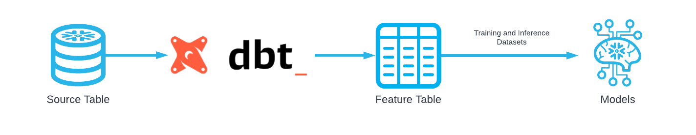
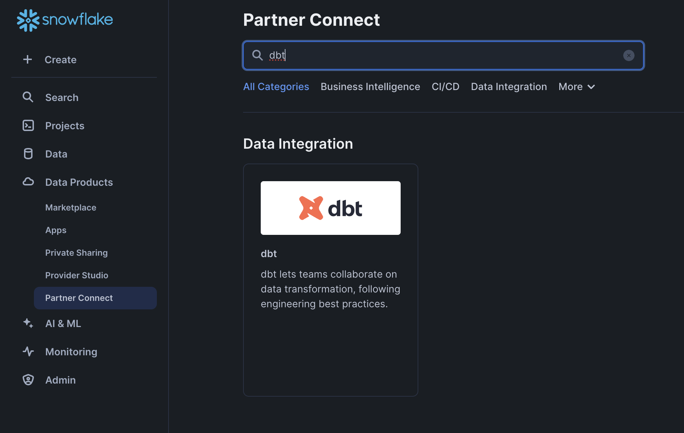
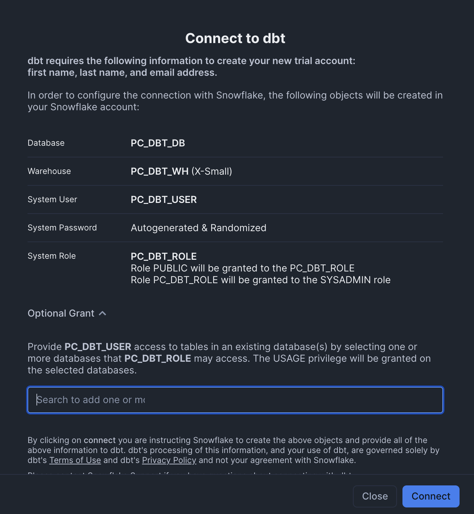
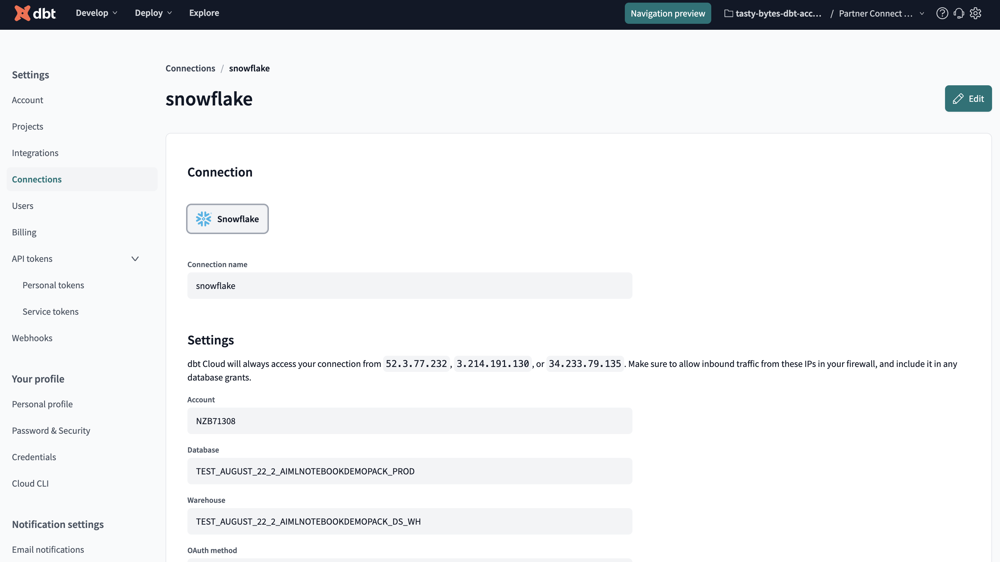
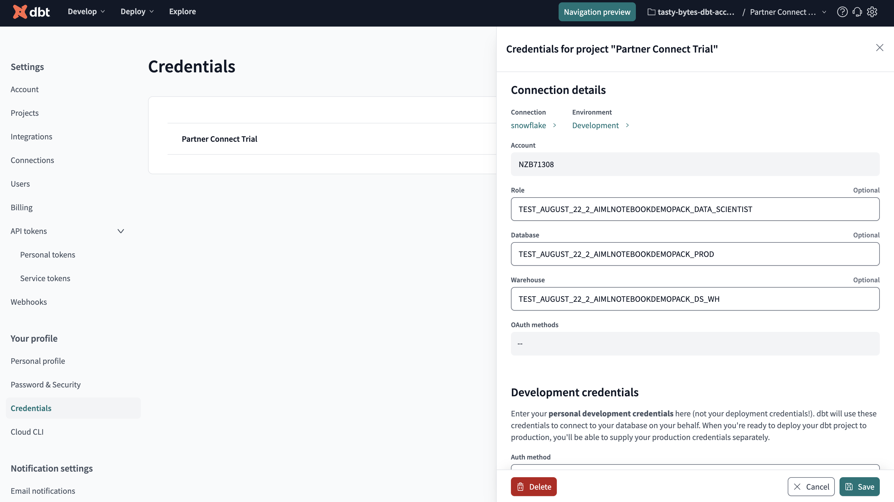
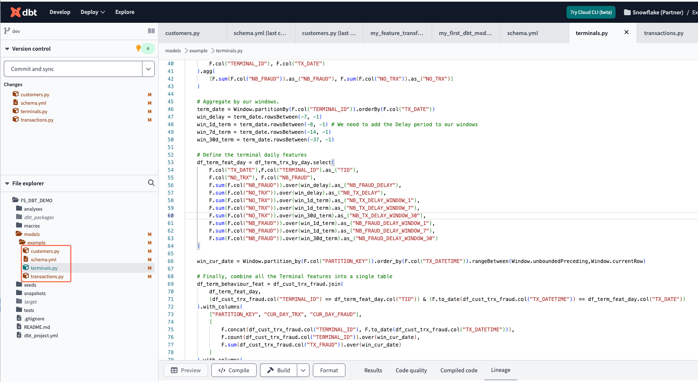

author: Charlie Hammond
id: getting-started-with-feature-store-and-dbt
categories: snowflake-site:taxonomy/solution-center/certification/quickstart, snowflake-site:taxonomy/product/applications-and-collaboration, snowflake-site:taxonomy/snowflake-feature/build
language: en
summary: This guide will go through everything you need to get started with dbt and Snowflake Feature Store 
environments: web
status: Published 
feedback link: https://github.com/Snowflake-Labs/sfguides/issues

# Getting Started with Snowflake Feature Store and dbt
<!-- ------------------------ -->
## Overview 

This Quickstart demonstrates the integration between dbt and Snowflake Feature Store. The source data is managed within a Snowflake database, while the feature pipelines are orchestrated and executed using dbt. The resulting feature tables are stored in Snowflake. We then read from these feature tables, register them as Feature Views, and build ML Datasets.

This architecture allows you to leverage dbt for data transformation while incorporating Snowflake Feature Store into your ML pipeline. We'll begin by defining base tables in Snowflake. Next, we'll use dbt to transform the data and save it back to Snowflake. Afterward, we'll register the transformed tables as feature tables and build a dataset. Finally, we'll add more data to the source table and demonstrate how features are updated when dbt is run again. Let's dive in!



### What You Will Learn 
- How to create features with Feature Store
- How to integrate dbt alongside Feature Store

### What You’ll Need 
- A [Snowflake](https://app.snowflake.com/) Account
- A dbt Cloud Account (we will go through setting one up via Partner Connect)

### What You’ll Build 
- A Feature Engineering Pipeline using dbt with Snowflake Feature Store

<!-- ------------------------ -->
## Setup Your Account

Complete the following steps to setup your account:
- Navigate to Worksheets, click "+" in the top-right corner to create a new Worksheet, and choose "SQL Worksheet".
- Paste and the following SQL in the worksheet 
- Adjust <YOUR_USER> to your user
- Run all commands to create Snowflake objects

```sql
USE ROLE ACCOUNTADMIN;

-- Using ACCOUNTADMIN, create a new role for this exercise and grant to applicable users
CREATE OR REPLACE ROLE FS_DBT_ROLE;
GRANT ROLE FS_DBT_ROLE to USER <YOUR_USER>;

-- create our virtual warehouse
CREATE OR REPLACE WAREHOUSE FS_DBT_WH AUTO_SUSPEND = 60;

GRANT ALL ON WAREHOUSE FS_DBT_WH TO ROLE FS_DBT_ROLE;

-- Next create a new database and schema,
CREATE OR REPLACE DATABASE FS_DBT_DATABASE;
CREATE OR REPLACE SCHEMA FS_DBT_SCHEMA;

GRANT OWNERSHIP ON DATABASE FS_DBT_DATABASE TO ROLE FS_DBT_ROLE COPY CURRENT GRANTS;
GRANT OWNERSHIP ON ALL SCHEMAS IN DATABASE FS_DBT_DATABASE TO ROLE FS_DBT_ROLE COPY CURRENT GRANTS;
```

<!-- ------------------------ -->
## Setup dbt Cloud
This notebook requires a dbt account. You can follow the following steps to setup an account via partner connect. 

- From your Snowflake account, go to Data Products > Partner Connect, search for dbt



- Add FS_DBT_DATABASE in the Optional Grant settings of the Connect to dbt Form



- Register for an account on dbt
- From dbt, click on your account > Account Settings > Connections > Snowflake
- Update these fields
    - Database: FS_DBT_DATABASE
    - Warehouse: FS_DBT_WH
    - Role: FS_DBT_ROLE



- Go to Your Profile > Credentials and click on Partner Connect Trial
- Update the Connection Details with:
    - Database: FS_DBT_DATABASE
    - Warehouse: FS_DBT_WH
    - Role: FS_DBT_ROLE
- Update the Development Credentials 
    - Add a user that has access to role FS_DBT_ROLE (such as your own)
    - Update the schema to FS_DBT_SCHEMA



- In dbt, click develop > Cloud IDE
- Initialize a new project
- Delete the existing files in the models > example folder
- Download the four files in [this folder](https://github.com/Snowflake-Labs/sfguide-how-to-manage-features-in-dbt-with-snowflake-feature-store/tree/main/scripts/dbt-files/models) and add them to the models > example folder
- Replace dbt_project.yml with the contents of [this file](https://github.com/Snowflake-Labs/sfguide-how-to-manage-features-in-dbt-with-snowflake-feature-store/blob/main/scripts/dbt-files/dbt_project.yml)
- Add file macros > generate_schema_name.sql with the contents of [this file](https://github.com/Snowflake-Labs/sfguide-how-to-manage-features-in-dbt-with-snowflake-feature-store/blob/main/scripts/dbt-files/macros/generate_schema_name.sql)



<!-- ------------------------ -->
## Run the Notebook

- Download the notebook from this [link](https://github.com/Snowflake-Labs/sfguide-how-to-manage-features-in-dbt-with-snowflake-feature-store/blob/main/notebooks/0_start_here.ipynb)
- Change role to FS_DBT_ROLE
- Navigate to Projects > Notebooks in Snowsight
- Click Import .ipynb from the + Notebook dropdown
- Create a new notebok with the following settings
  - Notebook Location: FS_API_DATABASE, FS_API_SCHEMA
  - Warehouse: FS_API_WH
- Create Notebook
- Upload the two images [here](https://github.com/Snowflake-Labs/sfguide-how-to-manage-features-in-dbt-with-snowflake-feature-store/blob/main/scripts/img/) using the plus button on the notebook file explorer
- Click Packages in the top right, add `snowflake-ml-python`
- Run cells in the notebook!

<!-- ------------------------ -->
## Conclusion And Resources

In conclusion, this Quickstart showcases how dbt and Snowflake Feature Store can work together to create a seamless and efficient ML pipeline. By managing your source data in Snowflake and orchestrating feature pipelines with dbt, you can streamline the process of transforming, storing, and utilizing feature tables for your machine learning models.

We demonstrated how to define base tables, transform data using dbt, and register the resulting feature tables. This integration ensures that your features stay up-to-date with each run of dbt. Ready to get started? Start integrating dbt with Snowflake Feature Store today!

### What You Learned
- How to create features with Feature Store
- How to integrate dbt alongside Feature Store

### Related Resources
- [Snowflake Feature Store](https://docs.snowflake.com/en/developer-guide/snowflake-ml/feature-store/overview)
- [Entities](https://docs.snowflake.com/en/developer-guide/snowflake-ml/feature-store/entities)
- [Feature Views](https://docs.snowflake.com/en/developer-guide/snowflake-ml/feature-store/feature-views)
- [Datasets](https://docs.snowflake.com/en/developer-guide/snowflake-ml/feature-store/modeling#generating-datasets-for-training).
