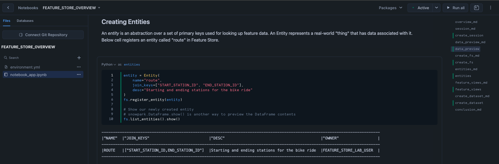

author: Charlie Hammond
id: getting-started-with-feature-store
summary: This guide give an overview of the key features of Snowflake Feature Store
categories: data-science, data-science-&-ml, Getting-Started, Notebooks
environments: web
status: Published 
feedback link: https://github.com/Snowflake-Labs/sfguides/issues
tags: Getting Started, Data Science

# Getting Started with Snowflake Feature Store
<!-- ------------------------ -->
## Overview 
Duration: 1

The Snowflake Feature Store offers a comprehensive solution for data scientists and machine learning (ML) engineers to create, manage, and utilize ML features within their data science workflows. Features, which are enriched or transformed data, serve as essential inputs for machine learning models. For instance, a feature might extract the day of the week from a timestamp to help the model identify weekly patterns, such as predicting that sales are typically 20% lower on Wednesdays. Other features often involve data aggregation or time-shifting. The process of defining these features, known as feature engineering, is crucial to developing high-quality ML applications.

In this quickstart, you will learn how to build the key components of a feature store workflow, including entities, feature views, and datasets. Entities represent the real-world objects or concepts that your features describe, such as customers or products. Feature views provide a structured way to define and store these features, allowing for consistent and efficient retrieval. Finally, datasets are collections of features that are prepared for model training or inference. By the end of this quickstart, you’ll have a solid understanding of how to create and manage these components within the Snowflake Feature Store, setting the foundation for building robust and scalable machine learning pipelines.

### Prerequisites
- Access to a Snowflake account with Accountadmin. 
- Access to run Notebooks in Snowflake
- Foundational knowledge of Data Science workflows

### What You Will Learn 
- The key features of Snowflake Feature Store including [entities](https://docs.snowflake.com/en/developer-guide/snowflake-ml/feature-store/entities), [feature views](https://docs.snowflake.com/en/developer-guide/snowflake-ml/feature-store/feature-views), and [datasets](https://docs.snowflake.com/en/developer-guide/snowflake-ml/feature-store/modeling#generating-datasets-for-training).

### What You’ll Need 
- A [Snowflake](https://app.snowflake.com/) Account

### What You’ll Build 
- An Snowflake Feature Store pipeline that generates a dataset for model training

<!-- ------------------------ -->
## Setup Your Account
Duration: 2

Complete the following steps to setup your account:
- Navigate to Worksheets, click "+" in the top-right corner to create a new Worksheet, and choose "SQL Worksheet".
- Paste and the following SQL in the worksheet 
- Adjust <YOUR_USER> to your user
- Run all commands to create Snowflake objects

```sql
USE ROLE ACCOUNTADMIN;

-- Using ACCOUNTADMIN, create a new role for this exercise and grant to applicable users
CREATE OR REPLACE ROLE FEATURE_STORE_LAB_USER;
GRANT ROLE FEATURE_STORE_LAB_USER to USER <YOUR_USER>;

-- create our virtual warehouse
CREATE OR REPLACE WAREHOUSE FEATURE_STORE_WH AUTO_SUSPEND = 60;

GRANT ALL ON WAREHOUSE FEATURE_STORE_WH TO ROLE FEATURE_STORE_LAB_USER;

-- use our feature_store_wh virtual warehouse 
USE WAREHOUSE FEATURE_STORE_WH;

-- Next create a new database and schema,
CREATE OR REPLACE DATABASE FEATURE_STORE_DATABASE;
CREATE OR REPLACE SCHEMA FEATURE_STORE_SCHEMA;

-- create external stage with the csv format to stage the dataset
CREATE STAGE IF NOT EXISTS FEATURE_STORE_DATABASE.FEATURE_STORE_SCHEMA.CITIBIKE_LOAD
    URL = 's3://snowflake-workshop-lab/citibike-trips-csv/trips_2018_7_7_0.csv.gz';

-- Load data from stage into a snowflake table
create or replace TABLE FEATURE_STORE_DATABASE.FEATURE_STORE_SCHEMA.CITIBIKE_TRIPS_TABLE (
	TRIPDURATION NUMBER(38,0),
	STARTTIME TIMESTAMP_NTZ(9),
	STOPTIME TIMESTAMP_NTZ(9),
	START_STATION_ID NUMBER(38,0),
	START_STATION_NAME VARCHAR(16777216),
	START_STATION_LATITUDE FLOAT,
	START_STATION_LONGITUDE FLOAT,
	END_STATION_ID NUMBER(38,0),
	END_STATION_NAME VARCHAR(16777216),
	END_STATION_LATITUDE FLOAT,
	END_STATION_LONGITUDE FLOAT,
	BIKEID NUMBER(38,0),
	MEMBERSHIP_TYPE VARCHAR(16777216),
	USERTYPE VARCHAR(16777216),
	BIRTH_YEAR NUMBER(38,0),
	GENDER NUMBER(38,0)
)COMMENT='citi bike table'
;

CREATE FILE FORMAT "FEATURE_STORE_DATABASE"."FEATURE_STORE_SCHEMA"."CITIBIKE_FORMAT" TYPE = 'CSV' COMPRESSION = 'AUTO' RECORD_DELIMITER = '
' FIELD_DELIMITER = ',' DATE_FORMAT = 'AUTO' TIME_FORMAT = 'AUTO' TIMESTAMP_FORMAT = 'AUTO' BINARY_FORMAT = 'HEX' ESCAPE = 'NONE' ESCAPE_UNENCLOSED_FIELD = '\\\\' FIELD_OPTIONALLY_ENCLOSED_BY = '"' NULL_IF = () ENCODING = 'UTF8' SKIP_BLANK_LINES = false TRIM_SPACE = false ERROR_ON_COLUMN_COUNT_MISMATCH = true REPLACE_INVALID_CHARACTERS = false EMPTY_FIELD_AS_NULL = true SKIP_BYTE_ORDER_MARK = true COMMENT = 'File format for type csv';

COPY INTO "FEATURE_STORE_DATABASE"."FEATURE_STORE_SCHEMA"."CITIBIKE_TRIPS_TABLE" ("TRIPDURATION", "STARTTIME", "STOPTIME", "START_STATION_ID", "START_STATION_NAME", "START_STATION_LATITUDE", "START_STATION_LONGITUDE", "END_STATION_ID", "END_STATION_NAME", "END_STATION_LATITUDE", "END_STATION_LONGITUDE", "BIKEID", "MEMBERSHIP_TYPE", "USERTYPE", "BIRTH_YEAR", "GENDER") FROM ( SELECT $1, $2, $3, $4, $5, $6, $7, $8, $9, $10, $11, $12, $13, $14, $15, $16 FROM @"FEATURE_STORE_DATABASE"."FEATURE_STORE_SCHEMA"."CITIBIKE_LOAD" ) FILE_FORMAT = "FEATURE_STORE_DATABASE"."FEATURE_STORE_SCHEMA"."CITIBIKE_FORMAT" ON_ERROR=CONTINUE;

GRANT OWNERSHIP ON DATABASE FEATURE_STORE_DATABASE TO ROLE FEATURE_STORE_LAB_USER COPY CURRENT GRANTS;
GRANT OWNERSHIP ON ALL SCHEMAS IN DATABASE FEATURE_STORE_DATABASE  TO ROLE FEATURE_STORE_LAB_USER COPY CURRENT GRANTS;
GRANT OWNERSHIP ON TABLE FEATURE_STORE_DATABASE.FEATURE_STORE_SCHEMA.CITIBIKE_TRIPS_TABLE TO ROLE FEATURE_STORE_LAB_USER;

-- Setup is now complete
```

<!-- ------------------------ -->
## Run the Notebook
Duration: 10

- Download the notebook from this link
- Change role to FEATURE_STORE_LAB_USER
- Navigate to Projects > Notebooks in Snowsight
- Click Import .ipynb from the + Notebook dropdown
- Create a new notebok with the following settings
  - Notebook Location: FEATURE_STORE_DATABASE, FEATURE_STORE_SCHEMA
  - Warehouse: FEATURE_STORE_WH
- Create Notebook
- Click Packages in the top right, add `snowflake-ml-python`
- Run cells in the notebook!



<!-- ------------------------ -->
## Conclusion And Resources
Duration: 1

The Snowflake Feature Store provides a powerful, all-in-one solution for data scientists and ML engineers to create, manage, and utilize machine learning features effectively.  In this quickstart, you’ve learned the essentials of building a feature store workflow, including entities, feature views, and datasets. Now, take the next step and apply these concepts to build robust, scalable ML pipelines within Snowflake. Check out the links below and start building you Feature Stores today!

### What You Learned
- **Understanding the Snowflake Feature Store**: Gained insight into how the Snowflake Feature Store helps manage and utilize ML features in data science workflows.
- **Building Key Components**:
  - **Entities**: Defined real-world objects or concepts that features describe, such as customers or products.
  - **Feature Views**: Learned how to structure and store features for consistent and efficient retrieval.
  - **Datasets**: Prepared collections of features for model training or inference.
- **Workflow Integration**: Developed an understanding of how these components work together to create a robust and scalable ML pipeline.

### Related Resources
- [Snowflake Feature Store](https://docs.snowflake.com/en/developer-guide/snowflake-ml/feature-store/overview)
- [Entities](https://docs.snowflake.com/en/developer-guide/snowflake-ml/feature-store/entities)
- [Feature Views](https://docs.snowflake.com/en/developer-guide/snowflake-ml/feature-store/feature-views)
- [Datasets](https://docs.snowflake.com/en/developer-guide/snowflake-ml/feature-store/modeling#generating-datasets-for-training).
