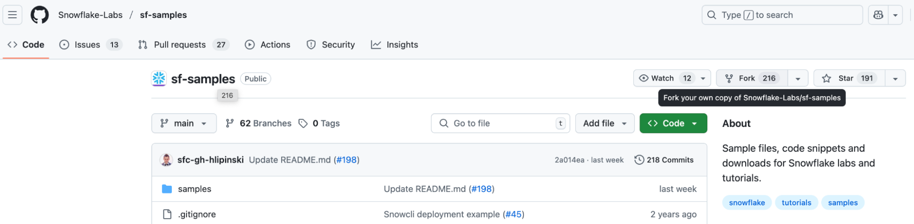
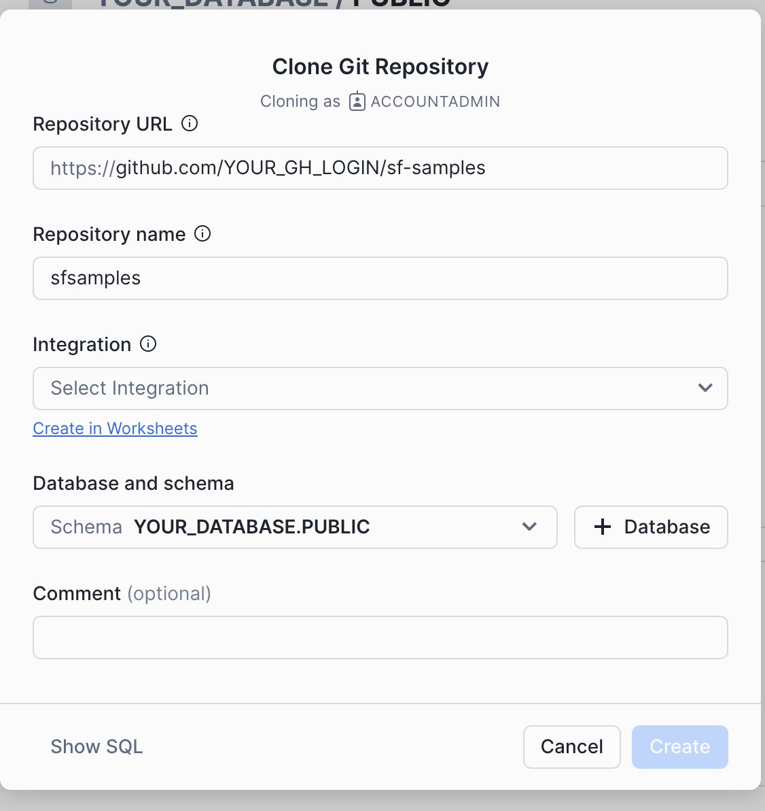
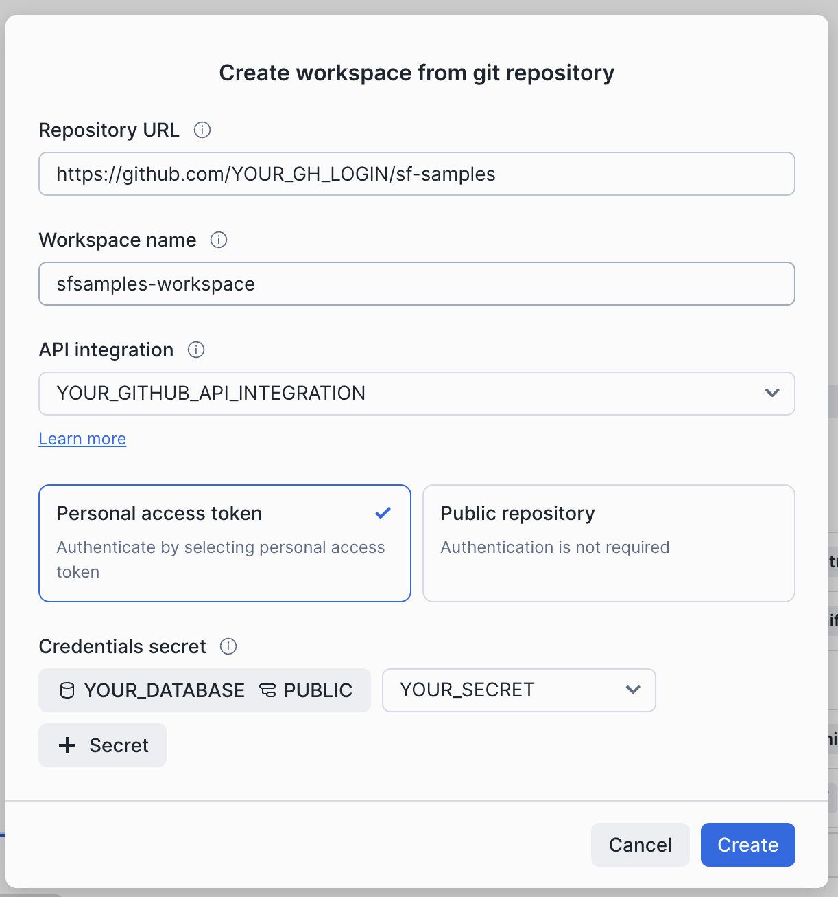

author: Monika Fus
id: git-integration
summary: This guide provides the instructions for connecting an existing Git repository to Snowflake and basic operations on that repository.
categories: Getting-Started
environments: web
status: Published 
feedback link: https://github.com/Snowflake-Labs/sfguides/issues
tags: Getting Started, Data Science, Data Engineering, Twitter 

# Connecting Your Git Repository With Snowflake
<!-- ------------------------ -->
## Overview 
Duration: 1

Do you have a Git repository that you would like to connect to Snowflake? You are able to do so with the Git Integration feature. Complete this guide to learn how to do it and what you can do with such repositories.

### What You Will Build
- A Git Repository accessible through Snowflake.
- A Snowflake Notebook created from Git Repository.
- A Snowflake Workspace created from Git Repository.

### What You Will Learn 
Here is a summary of what you will be able to learn in each step by following this Quickstart:
- **Basic repository setup**: How to prepare Snowflake objects needed to connect to a remote Git repository from Snowflake.
- **Basic repository operations**: How to browse a repository inside Snowflake and pull changes from the remote repository.
- **Interaction with Notebooks**: How to create a Snowflake Notebook from Git repository, make changes to it and push local changes to the remote repository.
- **Interaction with Workspaces**: How to create a Workspace from Git repository, make changes to it, push changes to the remote repository and use gitignore functionality.

### Prerequisites
- A Snowflake account. Sign up for a [30-day free trial](https://signup.snowflake.com/?utm_cta=quickstarts_) account, if required.
- A [GitHub](https://github.com/signup) account 

<!-- ------------------------ -->
## Basic repository setup
Duration: 10

### Prepare remote repository in Github
In this tutorial we will be using the Snowflake Samples git repository hosted on Github. We’d like to be able to modify it - so let’s start with creating a fork of that repository.

On [https://github.com/Snowflake-Labs/sf-samples/](https://github.com/Snowflake-Labs/sf-samples/) click on the `Fork` button, and then - leaving the repository name intact - click on `Create fork`.


As a result you have your very own copy of the repository available under [https://github.com/YOUR_GH_LOGIN/sf-samples](https://github.com/YOUR_GH_LOGIN/sf-samples).

### Create Snowflake objects for Git Integration
We’d like to access your repository in Snowflake. Log into Snowsight using your credentials.
Open the `Databases` view available in the menu on the left.


Create a database where your repository will be stored with `+ Database` button. Specify `YOUR_DATABASE` name and hit `Create`.

We will create Git repository inside the database you have just created and in default schema named `PUBLIC`. Click on `YOUR_DATABASE` on databases list and then on schema `PUBLIC`. There click on `Create` button and select `Git Repository` from the dropdown list.

Before creating a Git repository object you need to create API integration object that specifies details about Snowflake interaction with Git repository API.



API integration can be easily created by clicking on `Create in Worksheets` link below the `Integration` field.

Run a simple query to create API integration that allows for connections to repositories hosted on Github by you.

```SQL
create or replace api integration YOUR_GITHUB_API_INTEGRATION
  api_allowed_prefixes=('https://github.com/YOUR_GH_LOGIN')
  api_provider=git_https_api
  allowed_authentication_secrets = all
  enabled = true;
```

> aside positive
> 
> **Note** To create an API integration you need a role with the CREATE INTEGRATION privilege granted.

We also need to create a secret object that will hold git credentials allowing you to commit and push to the repository. Run a following query in the Worksheet:
```SQL
create or replace secret YOUR_SECRET
    type = password
    username = 'YOUR_GH_LOGIN'
    password = 'YOUR_GITHUB_PAT_VALUE';
```

> aside positive
> 
> **Note** In order to create a PAT in Github head over to https://github.com/settings/personal-access-tokens/new and select the permission: `Repository permissions > Contents` to be able to commit changes to the repository.

Now let’s go back to `YOUR_DATABASE` view (YOUR_SNOWFLAKE_URL/#/data/databases/YOUR_DATABASE/schemas/PUBLIC) and open the `Clone Git Repository` dialog again (`Create > Git Repository`). Now we can fill in all the fields.


Finally, hit the `Create` button and wait a bit for the cloning to complete.

Your Git repository is now created and ready to use!

<!-- ------------------------ -->
## Basic repository operations
Duration: 3

Let’s add a file on a new branch in Github to see how to retrieve changes from remote repository to Snowflake.

Add a new file in [https://github.com/YOUR_GH_LOGIN/sf-samples](https://github.com/YOUR_GH_LOGIN/sf-samples) to a new branch with Github UI. Hit `Add file` button and follow the steps provided there.


Head back to your `Git repository` view and click on `Fetch`. After a short wait the number of branches displayed on the right should have incremented.


Moreover, when you click on `Branch main`, your new branch should now be visible.


Click on your branch name to see the newly added file.


<!-- ------------------------ -->
## Interaction with Notebooks
Duration: 7

### Create a Notebook from Git repository
Snowflake Notebooks can be easily created from Git repositories.

To create a Notebook from the repository, head over to `Projects` and then `Notebooks` tab on the main Snowsight menu.

Then select `+Notebook` and `Create from repository` from the dropdown list.


Fill in the form like presented below. Name the notebook as you require and select `RDKit_Examples.ipynb` file. Set `YOUR_DATABASE` and default `PUBLIC` schema as Notebook location. Select the query warehouse available to you and hit the `Create` button.


As a result you can see a Notebook with runnable cells.


For more information on Notebooks check out Quickstart guide to Notebooks [here](https://quickstarts.snowflake.com/guide/getting_started_with_snowflake_notebooks/).

### Edit Notebook file in Snowflake
Notebook files can be edited at will. After making any changes that you see fit to the file, hit the `Push to Git` button. You will be presented with changes made to the file.


It is obligatory to fill in the commit message, author name and email address as well as the personal access token to commit changes to the remote repository. You should use the PAT created in the **Basic repository setup** step of this tutorial.

Click on the `Push` button and your commit will be pushed to the remote repository. The commit can be found here: [https://github.com//YOUR_GH_LOGIN/sf-samples/commits/main/](https://github.com//YOUR_GH_LOGIN/sf-samples/commits/main/).

### Pulling changes from the remote
In case any new changes appear in the remote repository, pull them to Snowflake with the Pull button.


<!-- ------------------------ -->
## Interaction with Workspaces
Duration: 7

You can interact with your Git repository via Snowflake with Workspaces. Head over to `Projects > Workspaces` tab in the main Snowsight menu to explore the possibilities.

### Create a Workspace from Git repository
Open the menu available under `My Workspace` and select `Create Workspace > From Git repository`.


Fill in the data for the remote repository you will connect to. Select API integration prepared in the **Basic repository setup** step of this tutorial.



After clicking on the `Create` button and waiting a bit, you will get a browsable Git repository. Find `README.md` file in `samples/rdkit` folder and click on it.


### Edit files in Snowflake
You can use the editor to make any necessary changes. Add a new line at the end of the file saying `4. You are good to go!` and switch to the `Changes` tab.


There you can see all recently modified files - `README.md` is marked with the letter `M`(odified).

Review the changes and hit the `Push` button. Now if you move on to Github, your newly added line should be visible there as well.

### Exclude files that should not be pushed to remote
Workspaces offer gitignore functionality. In the `.gitignore` file you can simply list files or folders that should not be synchronized to the remote repository on Push operation.

Let’s add a new file `local_secret.txt` with `+ Add New` button.
Inside the .gitignore file (that is already present in the repository) we can add a new line with content: local_secret.txt.
Move to the `Changes` tab. You can see that the `local_secret.txt` file has not been added to the list of modified files. Upon push the `local_secret.txt` will not be pushed to Github.


<!-- ------------------------ -->
## Conclusion And Resources
Duration: 1

### Conclusion
Congratulations! You've successfully completed the Getting Started with Snowflake Git Integration Quickstart guide.

### What You Learned
- **Basic repository setup**: How to prepare Snowflake objects needed to connect to a remote Git repository from Snowflake.
- **Basic repository operations**: How to browse a repository inside Snowflake and pull changes from the remote repository.
- **Interaction with Notebooks**: How to create a Snowflake Notebook from Git repository, make changes to it and push local changes to the remote repository.
- **Interaction with Workspaces**: How to create a Workspace from Git repository, make changes to it, push changes to the remote repository and use gitignore functionality.

### Resources
Here are some resources to learn more about Snowflake Git Integration:
- [Snowflake documentation on Git Integration](https://docs.snowflake.com/en/developer-guide/git/git-overview)
- [Youtube Git Integration tutorial](https://www.youtube.com/watch?v=4GOa1eUccmQ&ab_channel=SnowflakeDevelopers)
<!-- ------------------------ -->