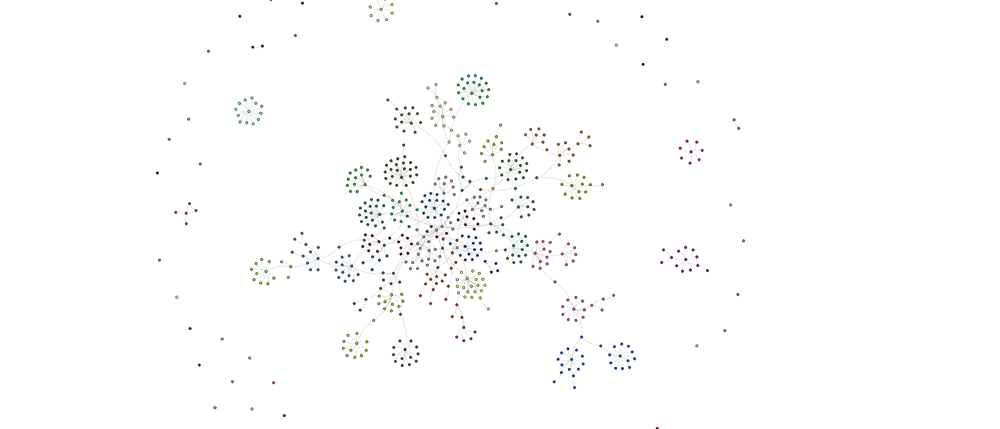

author: RelationalAI
id: getting-started-with-graphrag-and-relationalai
categories: snowflake-site:taxonomy/solution-center/certification/quickstart, snowflake-site:taxonomy/solution-center/certification/partner-solution, snowflake-site:taxonomy/solution-center/includes/architecture, snowflake-site:taxonomy/product/ai
language: en
summary: This is a sample Snowflake Guide 
environments: web
status: Published
feedback link: https://github.com/Snowflake-Labs/sfguides/issues


# Getting started with GraphRAG and RelationalAI

<!-- ------------------------ -->
## Overview

In this guide, we will use RelationalAI — a Snowflake Native App available in the Snowflake Marketplace — as well as [Snowflake Cortex LLMs](https://docs.snowflake.com/en/user-guide/snowflake-cortex/llm-functions) and [Snowflake Embeddings Models](https://docs.snowflake.com/en/user-guide/snowflake-cortex/vector-embeddings) to perform Graph Retrieval Augmented Generation (GraphRAG) on a corpus of documents.

The text corpus is a set of documents with a information about people, companies and academic institutions and provides a good basis for constructing a dense knowledge graph. Each document is a brief CV of a prominent figure in the tech industry. We will use the corpus as input to a Snowflake Cortex LLM to extract entities and their relations. Having done this, we will use the RelationalAI Native App to produce a knowledge graph representation of the entities and relations. This will allow us to execute RelationalAI community detection algorithms to summarize the corpus and identify the main topics and entities.

### What is RelationalAI?
RelationalAI is a cloud-native platform that enables organizations to streamline and enhance decisions with intelligence. RelationalAI extends Snowflake with native support for an expanding set of AI workloads (e.g., graph analytics, rule-based reasoning, and optimization), all within your Snowflake account, offering the same ease of use, scalability, security, and governance.

Users can build a knowledge graph using Python and materialize it on top of their Snowflake data, which are shared with the RelationalAI app through Snowflake Data Streams. Insights can be written back to Snowflake tables and shared across the organization.

### What you will learn
- How to install the RelationalAI Native App in your Snowflake account
- How to use Snowflake LLMs to extract entities and relations from the corpus
- How to represent the entities and relations with a RelationalAI graph
- How to run graph algorithms on the graph
- How to visualize the graph
- How to use the graph to answer user questions

### What you will need
- A [Snowflake Account](https://signup.snowflake.com/?utm_source=snowflake-devrel&utm_medium=developer-guides&utm_cta=developer-guides) on AWS in the US East (N. Virginia) region or the US West (Oregon) region
- Basic knowledge of using a Snowflake SQL Worksheet
- [Snowflake privileges](https://other-docs.snowflake.com/en/native-apps/consumer-installing#set-up-required-privileges) on your user to install a Native Application
- Snowflake account privileges to create databases and schemas in your Snowflake account
- The [RelationalAI CLI](https://relational.ai/docs/reference/cli/)

### What you will build
- A processing pipeline in Snowflake Cortex for extracting named entities and relations from unstructured text data
- A knowledge graph representation of the entities and relations with the RelationalAI Native App
- A method of summarization of corpus items based on the graph community they belong to
- A visualization of the communities in the graph
- A semantically similar retrieval pipeline of a user question against the community summaries
- A LLM-based question answering pipeline grounded on the community summaries

> 
> NOTE:  If you do not already have the RelationalAI Native App installed, please follow the instructions [here](https://relational.ai/docs/native_app/installation)

<!-- ------------------------ -->
## Snowflake Artifact and Corpus

We shall proceed with creating the Snowflake artifacts required for this guide.

> 
> 
> Steps (3) and (4) exist for educational purposes, the Snowflake application can be installed by executing this [SQL script](https://github.com/RelationalAI/graphrag/tree/main/getting-started/sql/script.sql).

```sql
USE ROLE ACCOUNTADMIN;
```

### Create a database, schema, tables etc.

```sql
/***
* Create a database, schema, warehouse and tables.
**/
CREATE OR REPLACE DATABASE graph_rag;
CREATE OR REPLACE SCHEMA graph_rag;
CREATE OR REPLACE WAREHOUSE graph_rag WAREHOUSE_SIZE='X-Small' AUTO_SUSPEND = 300;

-- Create data tables.
CREATE OR REPLACE TABLE corpus(
  ID INT NOT NULL AUTOINCREMENT START 1 INCREMENT 1 
  , CONTENT VARCHAR NOT NULL
)
COMMENT = 'Table containing the corpus which will be loaded from Azure storage';

CREATE OR REPLACE TABLE community_summary(
    COMMUNITY_ID INT
    , CONTENT VARCHAR
)
COMMENT = 'Table to store community-based corpus summaries';
```

### Installing the application UDFs
We shall now install the following Snowflake UDFs that wrap the functionality of extracting the entities and relations from the corpus, performing summarization and question answering:

- `LLM_EXTRACT_JSON`: this is a helper UDF for sanitizing the LLM response and extracting the JSON payload.
- `LLM_ENTITIES_RELATIONS`: this UDF will be used to call the LLM model and extract entities and relations from the text corpus.
- `LLM_ENTITIES_RELATIONS_TO_GRAPH`: this UDF will be used to convert the LLM output to a temporary graph representation.
- `CREATE_NODES_EDGES_STREAMS_SOURCES`: this is the main entry point for extracting entities and relations from the corpus.
- `LLM_SUMMARIZE`: we will be using this UDF to extract summaries of all corpus items that belong to a specific community.
- `LLM_ANSWER`: this UDF will be used to answer user questions based on the community summaries.
- `LLM_ANSWER_SUMMARIES`: we shall use this UDF to generate answers to user questions based on the community summaries. The LLM context will be provided by a window of community summaries and prompted to answer the user question if it exists in the context.

```sql
/***
* Install UDFs.
**/
CREATE OR REPLACE FUNCTION LLM_EXTRACT_JSON(llm_response OBJECT)
RETURNS VARIANT
LANGUAGE PYTHON
RUNTIME_VERSION = '3.10'
HANDLER = 'main'
AS
$$
import json
import re

def main(llm_response):
    payload = llm_response["choices"][0]["messages"]
    
    try:    
        # Remove whitespaces.
        payload = " ".join(payload.split())

        # Extract JSON from the string.
        return json.loads(re.findall(r"{.+[:,].+}|\[.+[,:].+\]", payload)[0])
    except:
        return json.loads(payload)
$$;

CREATE OR REPLACE FUNCTION LLM_ENTITIES_RELATIONS(content VARCHAR, additional_prompts VARCHAR DEFAULT '') 
RETURNS TABLE 
(response OBJECT) 
LANGUAGE SQL 
AS 
$$
    SELECT SNOWFLAKE.CORTEX.COMPLETE(
        'llama3-70b',
        [
            {
                'role': 'system', 
                'content': '
                    # Knowledge Graph Instructions
        
                    ## 1. Overview
                        - You are a top-tier algorithm designed for extracting information in structured formats to build a knowledge graph.
                        - Your aim is to achieve simplicity and clarity in the knowledge graph, making it accessible for a vast audience.
                        - **Nodes** represent entities and concepts. They are akin to Wikipedia nodes.
                            - If the entities cannot be extracted, return nothing.
                        - **Relations** represent links between entities. They are akin to predicates.
                        
                    ## 2. Labeling entities and relations
                        - **Completeness**
                            - Ensure that all entities are identified.
                        - **Consistency**
                            - Ensure you use basic or elementary types for entity labels.
                                - Example: when you identify an entity representing a person, always label it as "person". Avoid using more specific terms like "mathematician" or "scientist".
                        - **Entity IDs**: never utilize integers as entity IDs. Entity IDs must be names or human-readable identifiers found in the text, exactly as they appear in the text.
                            - Example: the ID of entity "John Doe" must be "John Doe".
                        - **Property format**
                            - Properties must be in a key-value format. 
                            - Properties must be in <entity>_has_<property> format.
                            - Do not include the entity ID in the properties, just the entity type.
                                - Example: "john_doe_has_age" is wrong. Correct naming is "has_age".
                        - **Relation naming**
                            - Relation names must never contain the entity types and names.
                            - Example:
                                - "person_is_president_of_company" is invalid because it includes the node name "person" and "company" in the relation name. Correct relation name must be "is_president_of".
                        - **Unique semantic relation naming**
                            - Relation names must semantically represent one and only one concept.
                            - Example: 
                                - "is_president_and_ceo_of" is invalid because it combines entities "president" and "ceo" into one relation.
                            - If a list of allowed relation names is provided, only use those relation names in the knowledge graph.
                    
                    ## 3. Handling node and relation properties
                        - **Property retrieval**
                            - Extract only the properties relevant to the entities and relations provided.
                                - Example: if the entity "studied_at" is identified, extract properties like "from_date", "to_date", "qualification".
                    
                    ## 4. Handling numerical data and dates
                        - **No separate nodes for dates / numbers**
                            - Do not create separate nodes for dates or numerical values. Always attach them as attributes or properties of nodes.
                        - **Quotation marks**
                            - Never use escaped single or double quotes within property values.
                        - **Naming convention**
                            - Use snake_case for property keys, e.g., "birth_date".
                        - **Numerical data**
                            - Dates, numbers etc. must be incorporated as attributes or properties of their respective nodes.
                    
                    ## 5. Coreference resolution
                        - **Maintain entity consistency**
                            - When extracting entities, it is vital to ensure consistency.
                            - If an entity, such as "John Doe", is mentioned multiple times in the text but is referred to by different names or pronouns (e.g., "John", "he"), always use the most complete identifier for that entity throughout the knowledge graph. In this example, use "John Doe" as the entity ID.
                            - The knowledge graph must be coherent and easily understandable, so maintaining consistency in entity references is crucial.
                    
                    ## 6. Relation subject / object consistency
                        - **Precedence**
                            - It is crucial that relations are consistent in terms of subject and object. Subjects are entities of lower granularity than objects. 
                            
                    ## 7. Output
                        - **Format**
                            - Produce well formatted, pure JSON only. 
                            - The JSON must be parsable by Python, as follows:
                            
                            {
                                "nodes": [
                                    {
                                        "id": entity ID (required),
                                        "type": entity type (required),
                                        "properties": entity properties (optional)
                                    },
                                    ...
                                ],
                                "relations": [
                                    {
                                        "src_node_id": source entity ID (required),
                                        "dst_node_id": destination entity ID (required),
                                        "type": relation type (required)
                                        "properties": relation properties (optional)
                                    },
                                    ...
                                ]
    
                            }
                            
                        - **Response**: 
                            - Respond strictly with the JSON object and nothing else.
                            - Do not include verbose information such as "here is what you asked for" etc.
                        
                    ## 8. Strict compliance
                        - Adhere to the rules strictly. Non-compliance will result in termination.
                    ' 
                    || additional_prompts ||
                    '
                    Your response:
                ' 
            },
            {
                'role': 'user', 
                'content': content
            }
        ], 
        {
            'temperature': 0,
            'top_p': 0
        }
    ) AS response
$$;

CREATE OR REPLACE AGGREGATE FUNCTION LLM_ENTITIES_RELATIONS_TO_GRAPH(corpus_id INT, llm_response VARIANT)
RETURNS ARRAY
LANGUAGE PYTHON
RUNTIME_VERSION = '3.10'
HANDLER = 'GraphBuilder'
PACKAGES = ('networkx', 'snowflake')
AS
$$
import logging
from typing import Any, Dict, List

import networkx as nx
import pandas as pd
import snowflake.snowpark as snowpark

logger = logging.getLogger("GRAPH_RAG")

class GraphBuilder(object):
    def __init__(self) -> None:
        self._graph: nx.Graph = nx.MultiDiGraph()

    def _nodes_df(self) -> pd.DataFrame:
        nodes_df: pd.DataFrame = None
        nodes: List = []
        edges: List = []
        corpus_ids: List = []
        node_types: List = []
        props: List = []

        try:
            for node, properties in self._graph.nodes(data=True):
                nodes.append(node)

                try:
                    corpus_ids.append(properties["corpus_id"])
                except:
                    corpus_ids.append(0)
                    
                try:
                    node_types.append(properties["type"])
                except:
                    node_types.append("undefined")
                    
                if len(properties) > 0:
                    props.append(properties)
                else:
                    props.append(0)
    
            nodes_df = pd.DataFrame(
                data={
                    "id": nodes,
                    "corpus_id": corpus_ids, 
                    "type": node_types,
                    "properties": props
                },
                columns=["id", "corpus_id", "type", "properties"]
            )
        except Exception as error:
            logger.error("Error calling _nodes_df function")
            logger.error(error)
            raise error
        finally:
            logger.info(f"Graph contains {len(nodes_df)} nodes")
            return nodes_df

    def _edges_df(self) -> pd.DataFrame:
        edges_df: pd.DataFrame = None
        src_nodes: List = []
        dst_nodes: List = []
        corpus_ids: List = []
        edge_types: List = []
        props: List = []

        try:
            for src_node, dst_node, properties in self._graph.edges(data=True):
                src_nodes.append(src_node)
                dst_nodes.append(dst_node)

                try:
                    corpus_ids.append(properties["corpus_id"])
                except:
                    corpus_ids.append(0)
                    
                try:
                    edge_types.append(properties["type"])
                except:
                    edge_types.append("undefined")
                    
                if len(properties) > 0:
                    props.append(properties)
                else:
                    props.append(None)
        
            edges_df = pd.DataFrame(
                data={
                    "src_node_id": src_nodes,
                    "dst_node_id": dst_nodes,
                    "corpus_id": corpus_ids, 
                    "type": edge_types,
                    "properties": props
                },
                columns=["src_node_id", "dst_node_id", "corpus_id", "type", "properties"]
            )
        except Exception as error:
            logger.error("Error calling _edges_df function")
            logger.error(error)
            raise error
        finally:
            logger.info(f"Graph contains {len(edges_df)} edges")
            return edges_df
            
    @property
    def aggregate_state(self) -> nx.Graph:
        return self._graph

    # Add graph nodes and edges from LLM response.
    def accumulate(self, corpus_id, llm_response):
        try:
            # Add nodes with (optional) properties.
            for node in llm_response["nodes"]:
                try:
                    if "properties" in node.keys():
                        self._graph.add_node(node["id"], type=node["type"], corpus_id=corpus_id, **node["properties"])
                    else:
                        self._graph.add_node(node["id"], type=node["type"], corpus_id=corpus_id)
                except Exception as error:
                    logger.error("Error accumulating graph nodes")
                    logger.error(error)
                    
            # Add edges with (optional) properties.
            for relation in llm_response["relations"]:
                try:
                    if "properties" in relation.keys():
                        self._graph.add_edge(relation["src_node_id"], relation["dst_node_id"], type=relation["type"], corpus_id=corpus_id, **relation["properties"])
                    else:
                        self._graph.add_edge(relation["src_node_id"], relation["dst_node_id"], type=relation["type"], corpus_id=corpus_id)
                except Exception as error:
                    logger.error("Error accumulating graph edges")
                    logger.error(error)
    
        except Exception as error:
            logger.error("Error calling _edges_df function")
            logger.error(error)
    
    def merge(self, graph) -> nx.Graph:
        self._graph = nx.union(self._graph, graph)

    # Return accumulated graph nodes and edges.
    def finish(self) -> List:
        nodes_df = self._nodes_df()
        edges_df = self._edges_df()
        return [
            nodes_df.to_dict("records"),
            edges_df.to_dict("records")
        ]
$$;

CREATE OR REPLACE PROCEDURE CREATE_NODES_EDGES_STREAMS_SOURCES() 
RETURNS VARCHAR
LANGUAGE SQL 
AS 
$$
    BEGIN
        CREATE OR REPLACE TEMPORARY TABLE nodes_edges_staging(nodes ARRAY, edges ARRAY);

        /***
        * Extract node and edge objects with the LLM and temporarily store the output to staging tables.
        **/
        INSERT INTO nodes_edges_staging
        WITH c AS (
            SELECT 
                c.id AS id
                , c.content AS content
            FROM 
                corpus AS c
        )
        , entities_relations AS (
            SELECT 
                c.id AS corpus_id
                , LLM_EXTRACT_JSON(r.response) AS response
            FROM 
                c
            JOIN TABLE(LLM_ENTITIES_RELATIONS(c.content, '')) AS r
        )
        , nodes_edges AS (
            SELECT
                LLM_ENTITIES_RELATIONS_TO_GRAPH(er.corpus_id, er.response) AS graph
            FROM
                entities_relations AS er
        )
        SELECT 
            ne.graph[0]::ARRAY AS nodes
            , ne.graph[1]::ARRAY AS edges
        FROM
            nodes_edges AS ne;

        /***
        * Populate Data Stream source tables.
        *
        * These tables will be used for creating the downstream RelationalAI graph.
        **/
        -- Nodes table.
        CREATE OR REPLACE TABLE nodes
        AS
        WITH nodes AS (
            SELECT 
                ne.nodes AS nodes
            FROM 
                nodes_edges_staging AS ne
        )
        SELECT 
            VALUE:"id"::VARCHAR id 
            , VALUE:"corpus_id"::INT corpus_id 
            , VALUE:"type"::VARCHAR type 
        FROM
            nodes AS n 
            , LATERAL FLATTEN(n.nodes) AS items;

        -- Edges table.
        CREATE OR REPLACE TABLE edges 
        AS 
        WITH edges AS ( 
            SELECT 
                ne.edges AS edges 
            FROM 
                nodes_edges_staging AS ne 
        ) 
        SELECT 
            VALUE:"src_node_id"::VARCHAR src_node_id 
            , VALUE:"dst_node_id"::VARCHAR dst_node_id 
            , VALUE:"corpus_id"::INT corpus_id 
            , VALUE:"type"::VARCHAR type 
        FROM 
            edges AS n 
            , LATERAL FLATTEN(n.edges) AS items;

        RETURN 'OK';
    END;
$$;

CREATE OR REPLACE FUNCTION LLM_SUMMARIZE(content VARCHAR) 
RETURNS TABLE 
(response OBJECT) 
LANGUAGE SQL 
AS 
$$
    SELECT SNOWFLAKE.CORTEX.COMPLETE(
        'llama3-70b',
        [
            {
                'role': 'system', 
                'content': '
                    # Summarization instructions
        
                    ## 1. Overview
                        - You are a top-tier algorithm designed for summarizing the provided text.

                    ## 2. Instructions
                        - Summarize the provided text so that all information mentioned in the text is retained.
                        - The text contains information about entities and relations that must be the target of summarization.
                        - Produce summary of the context you are given and nothing else. Do not extrapolate beyond the context given.
                        - Relations between entities must be preserved.
                        - The summarization must produce coherent and succinct text.
    
                    ## 3. Output
                        - **Format**
                            - Produce well formatted, pure JSON only.
                            - The JSON must be parsable by Python, as follows:
                                {"answer": "<output>"}
                            - The <output> must always be formatted as plain text.
                            
                        - **Response**: 
                            - Respond strictly with the JSON object and nothing else.
                            - Do not include verbose information such as "here is what you asked for" etc.
                        
                    ## 4. Strict compliance
                        - Adhere to the rules strictly. Non-compliance will result in termination.
    
                    Your response:
                ' 
            },
            {
                'role': 'user', 
                'content': content
            }
        ], 
        {
            'temperature': 0,
            'top_p': 0
        }
    ) AS response
$$;

CREATE OR REPLACE FUNCTION LLM_ANSWER(context VARCHAR, question VARCHAR) 
RETURNS TABLE 
(response OBJECT) 
LANGUAGE SQL 
AS 
$$
    SELECT SNOWFLAKE.CORTEX.COMPLETE(
        'llama3-70b',
        [
            {
                'role': 'system', 
                'content': '
                    # Question answering instructions
        
                    ## 1. Overview
                        - You are a top-tier algorithm designed for answering questions given specific context provided by the user.
                        
                    ## 2. Instructions
                        - Be concise and do not hallucinate.
                        - Be very specific.
                        - Be very precise.
                        - Answer the question based on the provided context and only that.
                        - If the question cannot be answered with the provided context information, clearly say so and do not answer the question.
                        
                    ## 3. Context
                        - This is the context on which to base your answer:

                        ```context
                    ' 
                    ||
                            context
                    ||
                    '
                        ```
                        
                    ## 4. Output
                        - **Format**
                            - Produce well formatted, pure JSON only.
                            - The JSON must be parsable by Python, as follows:
                                {
                                    "answer": "<output>",
                                    "evidence": "<supporting evidence as found in the provided context ONLY, otherwise this field must be empty.>", 
                                    "confidence": "<confidence score between 0.0 and 1.0 in human-readable format>"
                                }
                            - <output> must always be formatted as plain text.
                            - <evidence> must always come from context.
                            
                        - **Response**: 
                            - Respond strictly with the JSON object and nothing else.
                            - Do not include verbose information such as "here is what you asked for" etc.
                        
                    ## 5. Strict compliance
                        - Adhere to the rules strictly. Non-compliance will result in termination.
    
                    Your response:
                ' 
            },
            {
                'role': 'user', 
                'content': question
            }
        ], 
        {
            'temperature': 0.0,
            'top_p': 0
        }
    ) AS response
$$;

CREATE OR REPLACE PROCEDURE LLM_ANSWER_SUMMARIES(summarization_window INTEGER, question VARCHAR)  
RETURNS TABLE 
(
    answer VARIANT
    , evidence VARIANT
)
LANGUAGE SQL 
AS 
$$
DECLARE
    max_community_id INTEGER;
    community_id_from INTEGER DEFAULT 1;
    community_id_to INTEGER DEFAULT 0;
    counter INTEGER;
    resultset RESULTSET;
BEGIN
    CREATE OR REPLACE TEMPORARY TABLE temp_results(community_id_from INTEGER, community_id_to INTEGER, community_summaries VARCHAR, result VARIANT);

    SELECT
        MAX(community_id)
    INTO
        max_community_id
    FROM
        community_summary;

    counter := (max_community_id / :summarization_window) + 1;
    community_id_to := :summarization_window;
  
    FOR i IN 1 TO counter DO
        INSERT INTO 
            temp_results 
        WITH cs AS (
            SELECT DISTINCT 
                content
            FROM 
                community_summary
            WHERE 
                community_id BETWEEN :community_id_from AND :community_id_to
        )
        , c AS (
            SELECT 
                LISTAGG(content, '\n\n') WITHIN GROUP(ORDER BY content) AS content
            FROM 
                cs
        )
        SELECT 
            :community_id_from
            , :community_id_to
            , c.content
            , PARSE_JSON(LLM_EXTRACT_JSON(r.response)) AS response
        FROM 
            c
        JOIN TABLE(
            LLM_ANSWER(
                c.content,
                :question
            )
        ) AS r;
    
        community_id_from := community_id_from + :summarization_window;
        community_id_to := community_id_to + :summarization_window;
    END FOR;

    resultset := (
        WITH summary_answers AS (
            SELECT DISTINCT 
                result:answer AS summary_answer
                , result:evidence AS summary_evidence
            FROM 
                temp_results 
            WHERE
                result:evidence <> ''
        )
        , filtered_summary_answers AS (
            SELECT 
                LISTAGG(sa.summary_answer, '\n\n') WITHIN GROUP(ORDER BY sa.summary_answer) AS content
            FROM 
                summary_answers AS sa
        )
        , final_llm_answer AS (
            SELECT 
                fsa.content AS content
                , PARSE_JSON(LLM_EXTRACT_JSON(r.response)) AS response
            FROM 
                filtered_summary_answers AS fsa
            JOIN TABLE(
                LLM_ANSWER(
                    fsa.content,
                    :question
                )
            ) AS r
        )
        SELECT 
            fla.response:answer AS answer
            , fla.response:evidence AS evidence
        FROM 
            final_llm_answer AS fla
    );
    
    RETURN TABLE(resultset);
END;
$$;
```

### Loading the corpus table
We shall now load the data from the public Azure storage into the `corpus` table:

```sql
/***
* Copy data from Azure storage into the corpus table.
**/
COPY INTO corpus(content)
FROM 'azure://rdaxllm.blob.core.windows.net/dataset/graphrag/csv/tech_industry_cvs.csv'
FILE_FORMAT = (
    TYPE = CSV
    COMPRESSION = AUTO 
    FIELD_DELIMITER = '|'
    NULL_IF = '\\N'
    EMPTY_FIELD_AS_NULL = TRUE
    FIELD_OPTIONALLY_ENCLOSED_BY = '"'
)
ON_ERROR = CONTINUE;
```

<!-- ------------------------ -->
## Entities/Relations Extraction

With all our Snowflake artifacts in place, we are now ready to extract the entities and relations from the corpus. 

As mentioned, we shall call the entrypoint UDF `CREATE_NODES_EDGES_STREAMS_SOURCES` to extract the entities and relations from the corpus, storing the output in the `nodes` and `edges` tables:

> 
> 
> The parameter value `llama3-70b` is the name of the Snowflake Cortex LLM that we will use.

> 
> 
> Occasionally, you may encounter the error message:
>
> `SQL compilation error: Unsupported subquery type cannot be evaluated`. 
>
> This may happen due to the LLM responding in a non-prompt-compliant way and can be resolved by re-running the UDF.

```sql
CALL CREATE_NODES_EDGES_STREAMS_SOURCES('llama3-70b');
```

> 
> 
> Expect this process to take a few minutes to complete.

<!-- ------------------------ -->
## Local Environment Setup

### Python

In addition to your Snowflake account setup, follow the steps below to set up a local installation of Python with Jupyter Lab and other required packages.

- Clone the [Quickstart repository](https://github.com/RelationalAI/graphrag)

```bash
git clone https://github.com/RelationalAI/graphrag.git
```

- Navigate to the cloned repository directory and open a terminal under:

```bash
cd getting-started
```

- Set up a virtual environment for the packages you'll install

#### With Anaconda

Follow these steps if you use Anaconda for virtual environment management.

The repository provides an `environment.yml` which can be used to create an Anaconda virtual environment and install  required packages:

```sh
conda env create --file environment.yml
```

The Anaconda environment is named `snowflake-rai-graph-rag` so let us activate it:

```sh
conda activate snowflake-rai-graph-rag
```

#### With venv

Follow these steps if you use venv for virtual environment management.

```sh
python -m venv .venv
```

Activate the virtual environment on Linux and MacOS:

```sh
source .venv/bin/activate
```

Activate the virtual environment on Windows:
  
```sh
.venv\Scripts\activate
```

Install required Python packages:

```sh
python -m pip install python-dotenv jupyterlab snowflake-snowpark-python relationalai
```

### Create a RelationalAI config file
Having installed the `relationalai` Python package, you will need to set up a RAI configuration with the Snowflake credentials you want to use (similar to the configuration for Snowflake CLI).

Run `rai init` from your terminal and follow the prompts to enter your credentials and other configuration data:

- Choose `Snowflake` as your host platform
- Select a profile from `~/.snowflake/connections.toml` if you have one, or enter your username, password, and Account ID otherwise
- Select your role `rai_user` that you created earlier
- Select a Snowflake warehouse
- Select `[CREATE A NEW ENGINE]` to create a new engine. Enter any name you want for the engine e.g. `graph_rag`
- Select the engine `HighMem|S` size
- Choose the compute pool `rai_engine_pool_s` that you have created previously
- Press Enter to accept the default profile name of `default`

<!-- ------------------------ -->
## RelationalAI Engine

We shall now setup the RelationalAI engine that we will be using for performing graph analytics.

To create a RelationalAI engine, follow the steps below (using the RelationalAI CLI):

```sh
rai engines:create
```

- When prompted for the engine name enter `graph_rag`
- When prompted for the engine size, select an engine size from the list of options e.g. `HighMem|S`. Note that a small size engine is more than enough for this guide.
- When prompted for the engine pool, select a pool from the list of options e.g. `M_ENGINES`.

> 
> 
>  Creating the engine may take a few minutes to complete. The CLI will notify you when the engine is ready.

<!-- ------------------------ -->
## Snowflake/RelationaAI Data Streams

Having the source `nodes` and `edges` tables in place, we shall now setup the Snowflake / RelationalAI Data Streams to synchronize data between a Snowflake and a RelationalAI model.

Next, we shall be creating a the Data Streams for the `nodes` and `edges` tables, respectively:

```sh
rai imports:stream --source graph_rag.graph_rag.nodes --model graph_rag
rai imports:stream --source graph_rag.graph_rag.edges --model graph_rag
```

> 
> 
> **IMPORTANT** An import stream utilizes change data capture to synchronize your Snowflake data with your RelationalAI model at an interval of once per minute.

> 
> 
>  The `rai imports:stream` command may take a few minutes to complete. The streams are ready only after issuing the command:
>
> ```sh
> rai imports:list --model graph_rag
> ```
>
> is listing both streams in status `LOADED`.

<!-- ------------------------ -->
## Building Graph / Answering Questions

We shall now proceed with creating the RelationalAI graph and answer questions using the model. In this step, we shall be doing the following:

- Inspecting data in the RelationalAI model
- Using RelationalAI algorithms for community detection, specifically [Louvain](https://relational.ai/docs/reference/python/std/graphs/Compute/louvain/) 
- Visualizing graph communities
- Producing summaries from all corpus items that belong to a specific community
- Querying the graph for answers to user questions

### Jupyter notebook walkthrough

#### Creating a RelationalAI model

A RelationalAI model is the abstraction that defines the data structures for representing the graph. The model is synchronized through the Data Streams already provisioned:

```python
# Defining a RelationalAI model named `graph_rag`.
rai_model = rai.Model("graph_rag", dry_run=False)
snowflake_model = Snowflake(rai_model)

# Defining an `Entity` type. A `Entity` is a node in the graph.
Entity = rai_model.Type("Entity", source="graph_rag.graph_rag.nodes")

# Defining a `Relation` type. A `Relation` is an edge in the graph.
# Note how we attach `src` and `dst` properties in the `Relation`,
# indicatiing the source and destination entities, respectivelly.
Relation = rai_model.Type("Relation", source="graph_rag.graph_rag.edges")
Relation.define(
    src=(Entity, "src_node_id", "id"), 
    dst=(Entity, "dst_node_id", "id")
)
```

#### Computing Louvain community identifiers

```python
# Creating a graph representation of our model.
graph = Graph(model=rai_model, undirected=True)

# Applying the Louvain community detection on the model.
with rai_model.rule():
    entity = Entity()
    community_id = graph.compute.louvain(node=entity, max_levels=5, max_sweeps=10, level_tolerance=1e-2, sweep_tolerance=1e-4)
    entity.set(community_id=community_id)
```

#### Creating the RelationalAI graph

```python
with rai_model.rule():
    relation = Relation()
    graph.Node.extend(Entity, id=Entity.id, corpus_id=str(Entity.corpus_id), type=Entity.type, community_id=Entity.community_id)
    graph.Edge.add(from_=relation.src, to=relation.dst, corpus_id=str(relation.corpus_id), type=relation.type)
```

#### Visualizing the graph communities

```python
community_color_map = get_random_color_map(communities_length=200)

vis = graph.visualize(
    three=False, 
    graph_height=1000, 
    show_node_label=True, 
    show_edge_label=True, 
    style={
        "node": {
            "label": lambda n: f"{n.get('id')} ({n.get('type')})", 
            "color": lambda n: community_color_map.get(n["community_id"], "black"), 
            "size": 30, 
            "hover": lambda n: f"{n.get('id')} (type: {n.get('type')}, community: {n.get('community_id')})"
        }, 
        "edge": {
            "label": lambda e: e.get("type"), 
            "color": "grey", 
            "hover": lambda e: e.get("type")
        }
    }
)

vis.display(inline=True)
```

Here is what is should look like:



#### Community-based summarization

```python
with rai_model.query() as select:
    entity = Entity()
    response = select(alias(entity.id, "id"), alias(entity.community_id, "community_id"), alias(entity.corpus_id, "corpus_id"))

# Getting a (community, corpus-id) multi-index.
communities_count_df = results_df.groupby(by=["community_id", "corpus_id"]).count().rename(columns={"id": "entities_count"}).sort_index()

# Convert the multi index to a dict.
index = communities_count_df.index.to_flat_index()
d = {}
for x, y in index:
    d.setdefault(x, []).append(y)

execute_statement(
    session=session, 
    statement=f"TRUNCATE TABLE community_summary"
)

# Summarize all corpus items of a community.
for k, v in d.items():
    corpus_ids = ", ".join([str(i) for i in v])
    logger.info(f"Producing summarized versions of IDs ({corpus_ids}) for community {k}")
    try:
        execute_statement(
            session=session, 
            statement="""
                INSERT INTO community_summary(COMMUNITY_ID, CONTENT)
                WITH c AS (
                    SELECT 
                        LISTAGG(content, '\n\n') WITHIN GROUP(ORDER BY id) AS content
                    FROM 
                        CORPUS
                    WHERE 
                        id IN ({CORPUS_IDS})
                )
                SELECT 
                    {COMMUNITY_ID} AS community_id
                    , PARSE_JSON(LLM_EXTRACT_JSON(r.response)):answer AS response
                FROM 
                    c
                JOIN TABLE(LLM_SUMMARIZE(c.content)) AS r;
            """, 
            parameters={
                "COMMUNITY_ID": str(k), 
                "CORPUS_IDS": corpus_ids
            }
        )
    except Exception as error:
        logger.error("Error producing summarized versions of IDs ({corpus_ids}) for community {k}")
```

#### Answering questions by querying with community summaries as context

`Question`: *Describe in detail the connection between Samuel Altman and Elon Musk, if one exists.*

```python
question = "Describe in detail the connection between Samuel Altman and Elon Musk, if one exists."
```

Using a window of concatenated community summaries and asking the LLM if the question can be asked from evidence in the context window:

```python
# The previous-before-last parameter of the procedure call is the summarization window i.e. how many per-community summaries to include as context in the answer.
# A smaller value produces a smaller i.e. a finer context window at the cost of incurring more LLM calls.
execute_statement(
    session=session, 
    statement="""
        CALL LLM_ANSWER_SUMMARIES(5, '{QUESTION}');
    """, 
    parameters={
        "QUESTION": question
    }
)

# Gather results.
answer = execute_statement(
    session=session, 
    statement="""
        SELECT 
            * 
        FROM 
            TABLE(result_scan(last_query_id()));
    """
)[0][0]
```

`Answer`: *Samuel Altman and Elon Musk are connected through their involvement with OpenAI, a non-profit artificial intelligence research organization. Samuel Altman is the CEO of OpenAI, while Elon Musk is one of the co-founders of the organization.*

### Putting it all together
All operations can be performed using the RelationalAI Python library in the provided [Jupyter notebook](https://github.com/RelationalAI/graphrag/tree/main/getting-started/notebook/getting_started_with_graphrag_and_relationalai.ipynb). We already have set up our Python virtual environment in a previous step so let us go ahead and start the Jupyter Lab server:

```sh
jupyter lab
```

Please switch to the Jupyter notebook and follow the instructions to reproduce the steps outlined above.

<!-- ------------------------ -->
## Conclusion and Resources

### Conclusion

Thanks to RelationalAI's Native App on Snowflake, we have built a basic GraphRAG system with just a few steps. Although the dataset used is a small graph, our solution can scale to real-world graphs comprising millions of nodes and edges. This is due to our cloud-native architecture that not only separates compute from storage but also scales horizontally and vertically.

### What you have learned

In this Quickstart you have learned how to:

- Find and install the [RelationalAI Native App](https://app.snowflake.com/marketplace/listing/GZTYZOOIX8H/relationalai-relationalai?search=relationalai&originTab=provider&providerName=RelationalAI&profileGlobalName=GZTYZOOIX7W) in the [Snowflake Marketplace](/en/data-cloud/marketplace/)
- Build a knowledge graph on top of your Snowflake data without having to move data outside Snowflake's perimeter
- Create a basic GraphRAG implementation using RelationalAI graph algorithms

### Resources

- To learn about more about RelationalAI and view full documentation, visit the [RelationalAI](https://relational.ai) website.
- [Fork the Repo](https://github.com/RelationalAI/graphrag/tree/main/getting-started)
- [Watch the Demo](https://youtu.be/020i5zYGrx0?list=TLGGNBS5eghM7gkyNDA5MjAyNQ)
- [Download Reference Architecture](/content/dam/snowflake-site/developers/2024/08/Social-Graph-of-Prominent-Tech-figures-using-GraphRAG-on-RelationalAI.pdf)
- [Read the Blog](https://medium.com/@alex.ntoulas/9473506d6c07)
