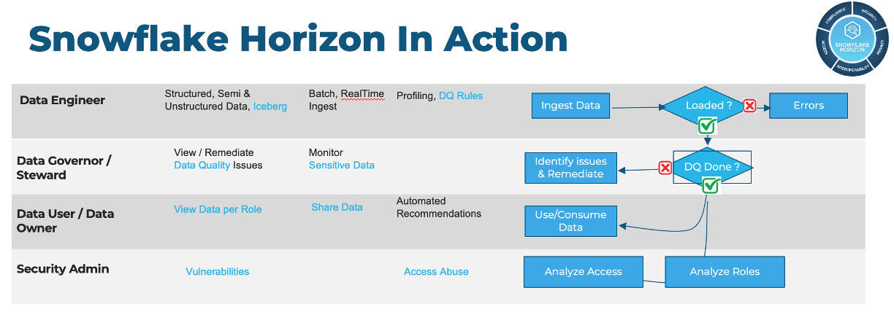

author: Susan Devitt
id: getting-started-with-horizon-for-data-governance-in-snowflake
categories: snowflake-site:taxonomy/solution-center/certification/quickstart, snowflake-site:taxonomy/solution-center/certification/community-sourced, snowflake-site:taxonomy/solution-center/includes/architecture, snowflake-site:taxonomy/product/data-engineering, snowflake-site:taxonomy/snowflake-feature/ingestion
language: en
summary: This guide is used to demonstrate the capabilities of Horizon for Data Governance. The walk-through consists of being able to ingest and monitor data pipelines in your organization, how to actively govern data including lineage and masking, and how Horizon can help with monitoring data in Snowflake using Snowsight. 
environments: web
status: Published 
feedback link: https://github.com/Snowflake-Labs/sfguides/issues


# Getting Started with Horizon for Data Governance in Snowflake
<!-- ------------------------ -->
## Overview 

Horizon is a suite of native Snowflake features that allow people easily find, understand, and trust data. In this lab you'll learn how Horizon ensures people have reliable and trustworthy data to make confident, data-driven decisions while ensuring observability and security of data assets.

In this expert-led, hands-on lab, you will follow a step-by-step guide utilizing a provided sample database of synthetic customer orders. Using this example data, you will learn how Horizon can monitor and provide visibility into your data within Snowflake. We will examine Horizon features from three different personas within Snowflake 
 - a Data Engineer monitoring pipelines
 - a Data Governor monitoring and masking PII
 - a Data Governor Admin auditing access and lineage 

### Introduction to Horizon

Before we dive into the lab, lets take a look at a typical governance workflow and learn a bit more about the personas we will be exploring today. 
#### Typical Governance Workflow  



#### [Data Engineer Persona Video](https://youtu.be/MdZ1PaJWH2w?si=o8k8HDrzQjZ5Jhst)  


#### [Data Governor/Steward Persona Video](https://youtu.be/bF6FAMeGEZc?si=mKxGlzJL6843B-FK)  


#### [Data Governor Admin Persona Video](https://youtu.be/doView4YqUI?si=tQd_KP7YzIIvogla)  

Now that you have the introduction to Horizon and our personas, lets get started.

### - What You’ll Learn 
- How to protect sensitive data using Snowflake's role-based masking policies
- How to visualize column-level lineage for impact analysis
- How to create a Horizon dashboard in Snowsight to monitor your data and policies

### - What You’ll Need 
- A trial [Snowflake](https://signup.snowflake.com/?utm_source=snowflake-devrel&utm_medium=developer-guides&utm_cta=developer-guides) Account with ACCOUNTADMIN access (recommended) or an existing Snowflake account (with ACCOUNTADMIN access)
<!-- ------------------------ -->
## Setup

All the scripts for this lab are available at [Snowflake Labs](https://github.com/Snowflake-Labs/sfguide-getting-started-with-horizon-data-governance-in-snowflake) for you as a resource.

Let's get started! First we will run the [script 0_lab_setup.sql](https://github.com/Snowflake-Labs/sfguide-getting-started-with-horizon-data-governance-in-snowflake/blob/main/0-lab-Setup.sql) 


**1. Create a new worksheet titled 0_lab_setup**

In Snowsight create a new worksheet and rename it 0_lab_setup.

**2. Copy the below script in its entirety and paste into your worksheet.**

This script will create the objects and load data needed to run the lab. More explanation on these objects and how they are used will be provided in later steps.
### [script 0_lab_setup.sql](https://github.com/Snowflake-Labs/sfguide-getting-started-with-horizon-data-governance-in-snowflake/blob/main/0-lab-Setup.sql)

````
--Create all Roles and assign to user
USE ROLE SECURITYADMIN;
CREATE OR REPLACE ROLE HRZN_DATA_ENGINEER;
CREATE OR REPLACE ROLE HRZN_DATA_GOVERNOR;
CREATE OR REPLACE ROLE HRZN_DATA_USER;
CREATE OR REPLACE ROLE HRZN_IT_ADMIN;

GRANT ROLE HRZN_DATA_ENGINEER TO ROLE SYSADMIN;
GRANT ROLE HRZN_DATA_GOVERNOR TO ROLE SYSADMIN;
GRANT ROLE HRZN_DATA_USER TO ROLE SYSADMIN;
GRANT ROLE HRZN_IT_ADMIN TO ROLE SYSADMIN;

SET MY_USER_ID  = CURRENT_USER();
SELECT ($MY_USER_ID);
GRANT ROLE HRZN_DATA_ENGINEER TO USER identifier($MY_USER_ID);
GRANT ROLE HRZN_DATA_GOVERNOR TO USER identifier($MY_USER_ID);
GRANT ROLE HRZN_DATA_USER TO USER identifier($MY_USER_ID);
GRANT ROLE HRZN_IT_ADMIN TO USER identifier($MY_USER_ID);

--Create warehouse and provide grants
USE ROLE SYSADMIN;
CREATE OR REPLACE WAREHOUSE HRZN_WH WITH WAREHOUSE_SIZE='X-SMALL';
GRANT USAGE ON WAREHOUSE HRZN_WH TO ROLE HRZN_DATA_ENGINEER;
GRANT USAGE ON WAREHOUSE HRZN_WH TO ROLE HRZN_DATA_GOVERNOR;
GRANT USAGE ON WAREHOUSE HRZN_WH TO ROLE HRZN_DATA_USER;
GRANT USAGE ON WAREHOUSE HRZN_WH TO ROLE HRZN_IT_ADMIN;

--Create database, schemas and assign to appropriate roles

GRANT  CREATE DATABASE ON ACCOUNT TO ROLE HRZN_DATA_ENGINEER;

USE ROLE HRZN_DATA_ENGINEER;
CREATE OR REPLACE DATABASE HRZN_DB;
CREATE OR REPLACE SCHEMA HRZN_DB.HRZN_SCH;

GRANT USAGE ON DATABASE HRZN_DB TO ROLE HRZN_DATA_GOVERNOR;
GRANT USAGE ON SCHEMA HRZN_DB.HRZN_SCH TO ROLE HRZN_DATA_GOVERNOR;
GRANT CREATE SCHEMA ON DATABASE HRZN_DB TO ROLE HRZN_DATA_GOVERNOR;

GRANT USAGE ON ALL SCHEMAS IN DATABASE HRZN_DB TO ROLE HRZN_DATA_GOVERNOR;
GRANT SELECT, INSERT, UPDATE, DELETE ON ALL TABLES IN DATABASE HRZN_DB TO ROLE HRZN_DATA_GOVERNOR;

GRANT SELECT ON ALL TABLES IN SCHEMA HRZN_DB.HRZN_SCH TO ROLE HRZN_DATA_GOVERNOR;
GRANT SELECT ON ALL VIEWS IN SCHEMA HRZN_DB.HRZN_SCH TO ROLE HRZN_DATA_GOVERNOR;

GRANT USAGE ON DATABASE HRZN_DB TO ROLE HRZN_IT_ADMIN;
GRANT USAGE ON SCHEMA HRZN_DB.HRZN_SCH TO ROLE HRZN_IT_ADMIN;
GRANT CREATE SCHEMA ON DATABASE HRZN_DB TO ROLE HRZN_IT_ADMIN;


GRANT USAGE ON DATABASE HRZN_DB TO ROLE HRZN_DATA_USER;
GRANT USAGE ON SCHEMA HRZN_DB.HRZN_SCH TO ROLE HRZN_DATA_USER;
GRANT USAGE ON ALL SCHEMAS IN DATABASE HRZN_DB TO ROLE HRZN_DATA_USER;
GRANT SELECT ON ALL TABLES IN DATABASE HRZN_DB TO ROLE HRZN_DATA_USER;

USE ROLE HRZN_DATA_GOVERNOR;

-- Create a  Schema to contain classifiers
CREATE OR REPLACE SCHEMA HRZN_DB.CLASSIFIERS
COMMENT = 'Schema containing Classifiers';

-- Create a Schema to contain Tags
CREATE OR REPLACE SCHEMA HRZN_DB.TAG_SCHEMA
COMMENT = 'Schema containing Tags';

CREATE OR REPLACE TABLE HRZN_DB.TAG_SCHEMA.ROW_POLICY_MAP
    (role STRING, state_visibility STRING);

-- with the table in place, we will now INSERT the relevant Role to City Permissions mapping to ensure
-- our Test only can see Massachusetts customers
INSERT INTO HRZN_DB.TAG_SCHEMA.ROW_POLICY_MAP
    VALUES ('HRZN_DATA_USER','MA'); 

    
-- Create a Schema to contain Security Policies
CREATE OR REPLACE SCHEMA SEC_POLICIES_SCHEMA
COMMENT = 'Schema containing Security Policies';

USE ROLE SECURITYADMIN;
GRANT SELECT, INSERT, UPDATE, DELETE ON FUTURE TABLES IN SCHEMA HRZN_DB.HRZN_SCH TO ROLE HRZN_DATA_GOVERNOR;
GRANT SELECT, INSERT, UPDATE, DELETE ON FUTURE TABLES IN DATABASE HRZN_DB TO ROLE HRZN_DATA_GOVERNOR;

GRANT SELECT ON FUTURE TABLES IN SCHEMA HRZN_DB.HRZN_SCH TO ROLE HRZN_DATA_USER;
GRANT SELECT ON FUTURE TABLES IN DATABASE HRZN_DB TO ROLE HRZN_DATA_USER;

GRANT SELECT ON FUTURE TABLES IN SCHEMA HRZN_DB.HRZN_SCH TO ROLE HRZN_IT_ADMIN;
GRANT SELECT ON FUTURE TABLES IN DATABASE HRZN_DB TO ROLE HRZN_IT_ADMIN;

GRANT USAGE ON ALL SCHEMAS IN DATABASE HRZN_DB TO ROLE HRZN_IT_ADMIN;
GRANT SELECT, INSERT, UPDATE, DELETE ON ALL TABLES IN DATABASE HRZN_DB TO ROLE HRZN_IT_ADMIN;
GRANT SELECT ON ALL VIEWS IN DATABASE HRZN_DB TO ROLE HRZN_IT_ADMIN;
GRANT SELECT ON ALL TABLES IN SCHEMA HRZN_DB.HRZN_SCH TO ROLE HRZN_IT_ADMIN;
GRANT SELECT ON ALL VIEWS IN SCHEMA HRZN_DB.HRZN_SCH TO ROLE HRZN_IT_ADMIN;


USE ROLE ACCOUNTADMIN;
GRANT DATABASE ROLE SNOWFLAKE.DATA_METRIC_USER TO ROLE HRZN_DATA_ENGINEER;
GRANT EXECUTE DATA METRIC FUNCTION ON ACCOUNT TO ROLE HRZN_DATA_ENGINEER;
-- Commented out because as of May 22 2024 this will not work in trial accounts.
--GRANT APPLICATION ROLE SNOWFLAKE.DATA_QUALITY_MONITORING_VIEWER TO ROLE HRZN_DATA_ENGINEER;

GRANT DATABASE ROLE SNOWFLAKE.GOVERNANCE_VIEWER TO ROLE HRZN_DATA_GOVERNOR;
GRANT DATABASE ROLE SNOWFLAKE.OBJECT_VIEWER TO ROLE HRZN_DATA_GOVERNOR;
GRANT DATABASE ROLE SNOWFLAKE.USAGE_VIEWER TO ROLE HRZN_DATA_GOVERNOR;
GRANT DATABASE ROLE SNOWFLAKE.DATA_METRIC_USER TO ROLE HRZN_DATA_GOVERNOR;
GRANT EXECUTE DATA METRIC FUNCTION ON ACCOUNT TO ROLE HRZN_DATA_GOVERNOR;
-- Commented out because as of May 22 2024 this will not work in trial accounts.
--GRANT APPLICATION ROLE SNOWFLAKE.DATA_QUALITY_MONITORING_VIEWER TO ROLE HRZN_DATA_GOVERNOR;


GRANT DATABASE ROLE SNOWFLAKE.GOVERNANCE_VIEWER TO ROLE HRZN_IT_ADMIN;
GRANT DATABASE ROLE SNOWFLAKE.OBJECT_VIEWER TO ROLE HRZN_IT_ADMIN;
GRANT DATABASE ROLE SNOWFLAKE.USAGE_VIEWER TO ROLE HRZN_IT_ADMIN;
GRANT DATABASE ROLE SNOWFLAKE.DATA_METRIC_USER TO ROLE HRZN_IT_ADMIN;
GRANT EXECUTE DATA METRIC FUNCTION ON ACCOUNT TO ROLE HRZN_IT_ADMIN;
-- Commented out because as of May 22 2024 this will not work in trial accounts.
--GRANT APPLICATION ROLE SNOWFLAKE.DATA_QUALITY_MONITORING_VIEWER TO ROLE HRZN_IT_ADMIN;


/***** C R E A T E   T A B L E *******/

USE ROLE HRZN_DATA_ENGINEER;
CREATE OR REPLACE TABLE HRZN_DB.HRZN_SCH.CUSTOMER (
	ID FLOAT,
	FIRST_NAME VARCHAR,
	LAST_NAME VARCHAR,
	STREET_ADDRESS VARCHAR,
	STATE VARCHAR,
	CITY VARCHAR,
	ZIP VARCHAR,
	PHONE_NUMBER VARCHAR,
	EMAIL VARCHAR,
	SSN VARCHAR,
	BIRTHDATE VARCHAR,
	JOB VARCHAR,
	CREDITCARD VARCHAR,
	COMPANY VARCHAR,
	OPTIN VARCHAR
);
CREATE OR REPLACE TABLE HRZN_DB.HRZN_SCH.CUSTOMER_ORDERS (
    CUSTOMER_ID VARCHAR,	
    ORDER_ID VARCHAR,	
    ORDER_TS DATE,	
    ORDER_CURRENCY VARCHAR,	
    ORDER_AMOUNT FLOAT,	
    ORDER_TAX FLOAT,	
    ORDER_TOTAL FLOAT
);
-- Load data from S3 into target tables. Then perform GRANTS.
COPY INTO HRZN_DB.HRZN_SCH.CUSTOMER
FROM s3://sfquickstarts/summit_2024_horizon_hol/CustomerDataRaw.csv
FILE_FORMAT = (TYPE = 'CSV', SKIP_HEADER = 1)
;

COPY INTO HRZN_DB.HRZN_SCH.CUSTOMER_ORDERS
FROM s3://sfquickstarts/summit_2024_horizon_hol/CustomerOrders.csv
FILE_FORMAT = (TYPE = 'CSV', SKIP_HEADER = 1)
;
GRANT ALL ON TABLE HRZN_DB.HRZN_SCH.CUSTOMER TO ROLE HRZN_DATA_GOVERNOR;
GRANT SELECT ON TABLE HRZN_DB.HRZN_SCH.CUSTOMER TO ROLE HRZN_DATA_USER;
GRANT SELECT ON TABLE HRZN_DB.HRZN_SCH.CUSTOMER TO ROLE HRZN_IT_ADMIN;

GRANT ALL ON TABLE HRZN_DB.HRZN_SCH.CUSTOMER_ORDERS TO ROLE HRZN_DATA_GOVERNOR;
GRANT SELECT ON TABLE HRZN_DB.HRZN_SCH.CUSTOMER_ORDERS TO ROLE HRZN_DATA_USER;
GRANT SELECT ON TABLE HRZN_DB.HRZN_SCH.CUSTOMER_ORDERS TO ROLE HRZN_IT_ADMIN;


USE ROLE ACCOUNTADMIN;
GRANT APPLY TAG on ACCOUNT to ROLE HRZN_DATA_GOVERNOR;
GRANT APPLY MASKING POLICY on ACCOUNT to ROLE HRZN_DATA_GOVERNOR;
GRANT APPLY ROW ACCESS POLICY ON ACCOUNT TO ROLE HRZN_DATA_GOVERNOR;
GRANT APPLY AGGREGATION POLICY ON ACCOUNT TO ROLE HRZN_DATA_GOVERNOR;
GRANT APPLY PROJECTION POLICY ON ACCOUNT TO ROLE HRZN_DATA_GOVERNOR;

GRANT DATABASE ROLE SNOWFLAKE.CLASSIFICATION_ADMIN TO ROLE HRZN_DATA_GOVERNOR;


--USE ROLE HRZN_DATA_ENGINEER;
--truncate table HRZN_DB.HRZN_SCH.CUSTOMER;
--truncate table HRZN_DB.HRZN_SCH.CUSTOMER_ORDERS;


--Create Lineage
USE ROLE HRZN_DATA_ENGINEER;


use database HRZN_DB;
use schema HRZN_DB.HRZN_SCH;
USE WAREHOUSE HRZN_WH;

-- create new table, then populate it with dynamic content
create OR REPLACE table HRZN_DB.HRZN_SCH.Customer_NY as
select *  EXCLUDE ZIP from HRZN_DB.HRZN_SCH.CUSTOMER where state='NY';

create OR REPLACE table HRZN_DB.HRZN_SCH.Customer_DC as
select *  EXCLUDE ZIP from HRZN_DB.HRZN_SCH.CUSTOMER where state='DC';

create OR REPLACE table HRZN_DB.HRZN_SCH.Customer_AR as
select *  EXCLUDE ZIP from HRZN_DB.HRZN_SCH.CUSTOMER where state='AR';


CREATE OR REPLACE VIEW HRZN_DB.HRZN_SCH.CUSTOMER_ORDER_SUMMARY AS
SELECT C.ID, C.FIRST_NAME, C.LAST_NAME, COUNT(CO.ORDER_ID) ORDERS_COUNT, SUM(CO.ORDER_TOTAL) ORDER_TOTAL
FROM HRZN_DB.HRZN_SCH.CUSTOMER C, HRZN_DB.HRZN_SCH.CUSTOMER_ORDERS CO
WHERE C.ID  = CO.CUSTOMER_ID
GROUP BY 1,2,3;

CREATE OR REPLACE TABLE HRZN_DB.HRZN_SCH.CUSTOMER_ORDER_SUMMARY_NY AS
SELECT CS.*
FROM HRZN_DB.HRZN_SCH.Customer_NY C, HRZN_DB.HRZN_SCH.CUSTOMER_ORDER_SUMMARY CS
WHERE C.ID  = CS.ID;

-- create new user stage, then copy CUSTOMER data here
create OR REPLACE stage CustomerNYStage;
copy into @CustomerNYStage from HRZN_DB.HRZN_SCH.CUSTOMER_ORDER_SUMMARY_NY;
````
<!-- ------------------------ -->

## Horizon as a Data Engineer - Data Quality Monitoring

### Overview
Data Governance doesn't need to be a daunting undertaking. This section is all about how to get started with curating assets to understand common problems that most data organizations want to solve such as data quality monitoring. We will show you how easily all roles benefit from Horizon and Snowflake's RBAC Framework. 

Before we begin, the Snowflake Access Control Framework is based on:
- Role-based Access Control (RBAC): Access privileges are assigned to roles, which 
    are in turn assigned to users.
- Discretionary Access Control (DAC): Each object has an owner, who can in turn 
    grant access to that object.

> 
>The key concepts to understanding access control in Snowflake are:
>- Securable Object: An entity to which access can be granted. Unless allowed by a 
    grant, access is denied. Securable Objects are owned by a Role (as opposed to a User)
>>- Examples: Database, Schema, Table, View, Warehouse, Function, etc
>- Role: An entity to which privileges can be granted. Roles are in turn assigned 
    to users. Note that roles can also be assigned to other roles, creating a role 
    hierarchy.
>- Privilege: A defined level of access to an object. Multiple distinct privileges 
    may be used to control the granularity of access granted.
 >- User: A user identity recognized by Snowflake, whether associated with a person 
    or program.

In Summary:
- In Snowflake, a Role is a container for Privileges to a Securable Object.
- Privileges can be granted Roles
- Roles can be granted to Users
- Roles can be granted to other Roles (which inherit that Roles Privileges)
- When Users choose a Role, they inherit all the Privileges of the Roles in the hierarchy.


### System Defined Roles and Privileges
> 
 >Before beginning to deploy Role Based Access Control (RBAC) for Horizon HOL,
 let's first take a look at the Snowflake System Defined Roles and their privileges

In Snowsight create a new worksheet and rename it 1_Data_Engineer. Copy and paste each code block below and execute. You can also find the entire Data Engineer Script at [ 1-DataEngineer.sql](https://github.com/Snowflake-Labs/sfguide-getting-started-with-horizon-data-governance-in-snowflake/blob/main/hol-lab/1-DataEngineer.sql) 

Let's start by assuming the Data Engineer role and our Snowflake Development Warehouse (synonymous with compute) and we will set the context with the appropriate Database and Schema. 
```
USE ROLE HRZN_DATA_ENGINEER;
USE WAREHOUSE HRZN_WH;
USE DATABASE HRZN_DB;
USE SCHEMA HRZN_SCH;
```

To follow best practices we will begin to investigate and deploy RBAC (Role-Based Access Control)

First, let's take a look at the Roles currently in our account
```
SHOW ROLES;
```

This next query, will turn the output of our last SHOW command and allow us to filter on the Snowflake System Roles provided by default in all Snowflake Accounts
  > Note: Depending on your permissions you may not see a result for every Role in the Where clause below.
```
SELECT
    "name",
    "comment"
FROM TABLE(RESULT_SCAN(LAST_QUERY_ID()))
WHERE "name" IN ('ORGADMIN','ACCOUNTADMIN','SYSADMIN','USERADMIN','SECURITYADMIN','PUBLIC');
```

#### Snowflake System Defined Role Definitions:
1. **ORGADMIN**: Role that manages operations at the organization level.
2. **ACCOUNTADMIN**: Role that encapsulates the SYSADMIN and SECURITYADMIN system-defined roles.
            It is the top-level role in the system and should be granted only to a limited/controlled number of users
            in your account.
3. **SECURITYADMIN**: Role that can manage any object grant globally, as well as create, monitor,
          and manage users and roles.
4. **USERADMIN**: Role that is dedicated to user and role management only.
5. **SYSADMIN**: Role that has privileges to create warehouses and databases in an account.
> 
>If, as recommended, you create a role hierarchy that ultimately assigns all custom roles to the SYSADMIN role, this role also has the ability to grant privileges on warehouses, databases, and other objects to other roles.
6. PUBLIC: Pseudo-role that is automatically granted to every user and every role in your account. The PUBLIC role can own securable objects, just like any other role; however, the objects owned by the role are available to every other user and role in your account.

 
                       
### Role Creation, GRANTS and SQL Variables

Now that we understand System Defined Roles, let's begin leveraging them to create a Test Role and provide it access to the Customer Order data we will deploy our initial Snowflake Horizon Governance features against.

We will use the Useradmin Role to create a Data Analyst Role
```
USE ROLE USERADMIN;

CREATE OR REPLACE ROLE HRZN_DATA_ANALYST
    COMMENT = 'Analyst Role';
```

Now we will switch to Securityadmin to handle our privilege GRANTS
```
USE ROLE SECURITYADMIN;
```
First we will grant ALL privileges on the Development Warehouse to our Sysadmin
```
GRANT ALL ON WAREHOUSE HRZN_WH TO ROLE HRZN_DATA_ANALYST;
```

Next we will grant only OPERATE and USAGE privileges to our Test Role
```
GRANT OPERATE, USAGE ON WAREHOUSE HRZN_WH TO ROLE HRZN_DATA_ANALYST;
```

> 
>**Snowflake Warehouse Privilege Grants**
>1. MODIFY: Enables altering any properties of a warehouse, including changing its size.
>2. MONITOR: Enables viewing current and past queries executed on a warehouse as well as usage statistics on that warehouse.
>3. OPERATE: Enables changing the state of a warehouse (stop, start, suspend, resume). In addition,enables viewing current and past queries executed on a warehouse and aborting any executing queries.
>4. USAGE: Enables using a virtual warehouse and, as a result, executing queries on the warehouse.
If the warehouse is configured to auto-resume when a SQL statement is submitted to it, the warehouse resumes automatically and executes the statement.
>5. ALL: Grants all privileges, except OWNERSHIP, on the warehouse.

Now we will grant USAGE on our Database and all Schemas within it
```
GRANT USAGE ON DATABASE HRZN_DB TO ROLE HRZN_DATA_ANALYST;
GRANT USAGE ON ALL SCHEMAS IN DATABASE HRZN_DB TO ROLE HRZN_DATA_ANALYST;
```
> 
> **Snowflake Database and Schema Grants**
>1. MODIFY: Enables altering any settings of a database.
>2. MONITOR: Enables performing the DESCRIBE command on the database.
>3. USAGE: Enables using a database, including returning the database details in the SHOW DATABASES command output. Additional privileges are required to view or take actions on objects in a database.
>4. ALL: Grants all privileges, except OWNERSHIP, on a database.

We are going to test Data Governance features as our Test Role, so let's ensure it can run SELECT statements against our Data Model
```
GRANT SELECT ON ALL TABLES IN SCHEMA HRZN_DB.HRZN_SCH TO ROLE HRZN_DATA_ANALYST;
GRANT SELECT ON ALL VIEWS IN SCHEMA HRZN_DB.HRZN_SCH TO ROLE HRZN_DATA_ANALYST;
```
> 
>**Snowflake View and Table Privilege Grants**
>1. SELECT: Enables executing a SELECT statement on a table/view.
>2. INSERT: Enables executing an INSERT command on a table. 
>3. UPDATE: Enables executing an UPDATE command on a table.
>4. TRUNCATE: Enables executing a TRUNCATE TABLE command on a table.
>5. DELETE: Enables executing a DELETE command on a table.
    **/

Before we proceed, let's SET a SQL Variable to equal our CURRENT_USER()
```
SET MY_USER_ID  = CURRENT_USER();
```

Now we can GRANT our Role to the User we are currently logged in as and use that role
```
GRANT ROLE HRZN_DATA_ANALYST TO USER identifier($MY_USER_ID);
```

### Data Quality Monitoring 

Within Snowflake, you can measure the quality of your data by using Data Metric Functions. Using these, we want to ensure that there are not duplicate or invalid Customer Email Addresses present in our system. While our team works to resolve any existing bad records, as a data engineer, we will work to monitor these occuring moving forward.

#### Creating Data Metric functions
Within this step, we will walk through adding Data Metric Functions to our Customer Order Table to capture Duplicate and Invalid Email Address counts everytime data is updated.

Creating a System DMF by first setting a schedule on the table and then setting the metrics
```
USE ROLE HRZN_DATA_ENGINEER;
--Schedule
ALTER TABLE HRZN_DB.HRZN_SCH.CUSTOMER SET DATA_METRIC_SCHEDULE = 'TRIGGER_ON_CHANGES';

--Accuracy
ALTER TABLE HRZN_DB.HRZN_SCH.CUSTOMER ADD DATA METRIC FUNCTION SNOWFLAKE.CORE.NULL_COUNT on (EMAIL);

--Uniqueness
ALTER TABLE HRZN_DB.HRZN_SCH.CUSTOMER ADD DATA METRIC FUNCTION SNOWFLAKE.CORE.UNIQUE_COUNT on (EMAIL);
ALTER TABLE HRZN_DB.HRZN_SCH.CUSTOMER ADD DATA METRIC FUNCTION SNOWFLAKE.CORE.DUPLICATE_COUNT on (EMAIL);;

--Volume
ALTER TABLE HRZN_DB.HRZN_SCH.CUSTOMER ADD DATA METRIC FUNCTION SNOWFLAKE.CORE.ROW_COUNT on ();


--Review Counts
SELECT SNOWFLAKE.CORE.NULL_COUNT(SELECT EMAIL FROM HRZN_DB.HRZN_SCH.CUSTOMER);
SELECT SNOWFLAKE.CORE.UNIQUE_COUNT(SELECT EMAIL FROM HRZN_DB.HRZN_SCH.CUSTOMER);
SELECT SNOWFLAKE.CORE.DUPLICATE_COUNT (SELECT EMAIL FROM HRZN_DB.HRZN_SCH.CUSTOMER) AS duplicate_count;
```

Before moving on, let's validate Trigger on Changes Schedule is in place
```
SHOW PARAMETERS LIKE 'DATA_METRIC_SCHEDULE' IN TABLE HRZN_DB.HRZN_SCH.CUSTOMER;
```

#### Creating a custom DMF
To accompany the Duplicate Count DMF, let's also create a Custom Data Metric Function that uses Regular Expression (RegEx) to Count Invalid Email Addresses
```
CREATE DATA METRIC FUNCTION HRZN_DB.HRZN_SCH.INVALID_EMAIL_COUNT(IN_TABLE TABLE(IN_COL STRING))
RETURNS NUMBER 
AS
'SELECT COUNT_IF(FALSE = (IN_COL regexp ''^[A-Za-z0-9._%+-]+@[A-Za-z0-9.-]+\.[A-Za-z]{2,4}$'')) FROM IN_TABLE';
```

For demo purposes, let's grant this to everyone
```
GRANT ALL ON FUNCTION HRZN_DB.HRZN_SCH.INVALID_EMAIL_COUNT(TABLE(STRING)) TO ROLE PUBLIC;
```

As we did above, let's see how many Invalid Email Addresses currently exist
```
SELECT HRZN_DB.HRZN_SCH.INVALID_EMAIL_COUNT(SELECT EMAIL FROM HRZN_DB.HRZN_SCH.CUSTOMER) AS INVALID_EMAIL_COUNT;
```

Before we can apply our DMF's to the table, we must first set the Data Metric Schedule. For our demo we will trigger this to run every 5 minutes
```
ALTER TABLE HRZN_DB.HRZN_SCH.CUSTOMER SET DATA_METRIC_SCHEDULE = '5 minute'; 
```
> 
>Data Metric Schedule specifies the schedule for running Data Metric Functions
for tables and can leverage MINUTE, USING CRON or TRIGGER_ON_CHANGES

Now we will add our Invalid Email Count Data Metric Function (DMF) to our table
```
ALTER TABLE HRZN_DB.HRZN_SCH.CUSTOMER 
    ADD DATA METRIC FUNCTION HRZN_DB.HRZN_SCH.INVALID_EMAIL_COUNT ON (EMAIL);
```

Before moving on, let's validate the Schedule is in place
```
SHOW PARAMETERS LIKE 'DATA_METRIC_SCHEDULE' IN TABLE HRZN_DB.HRZN_SCH.CUSTOMER;
```

Review the schedule
by selecting metric_name, ref_entity_name, schedule, schedule_status from table(information_schema.data_metric_function_references(
    ref_entity_name => 'HRZN_DB.HRZN_SCH.CUSTOMER', 
    ref_entity_domain => 'TABLE'));


The results our Data Metric Functions are written to an Event table, let's start by taking a look at the Raw output
> Note: Latency can be up to a few minutes. If the queries below are empty please wait a few minutes.

For ease of use, a flattened View is also provided so let's take a look at this as well

> 
>This view will not work in a trial account.
```
SELECT 
    change_commit_time,
    measurement_time,
    table_schema,
    table_name,
    metric_name,
    value
FROM SNOWFLAKE.LOCAL.DATA_QUALITY_MONITORING_RESULTS
WHERE table_database = 'HRZN_DB'
ORDER BY change_commit_time DESC;
```


 With the Data Quality metrics being logged every time our table changes we will be able to monitor the counts as new data flows in and existing e-mail updates are run.

> 
>In a production scenario a logical next step would be to configure alerts to notify you when changes to data quality occur. By combining the DMF and alert functionality, you can have consistent threshold notifications for data quality on the tables that you measure. 


## Horizon as Data Governor - Know & protect your data

**Overview**

In today's world of data management, it is common to have policies and procedures that range from data quality and retention to personal data protection. A Data Governor within an organization defines and applies data policies. Here we will explore Horizon features such as **universal search** that makes it easier to find Account objects,Snowflake Marketplace listings, relevant Snowflake Documentation and Snowflake Community Knowledge Base articles.

> 
>
>Note: Universal Search understands your query and information about your database objects and can find objects with names that differ from your search terms.
>Even if you misspell or type only part of your search term, you can still see
useful results.

To leverage Universal Search in Snowsight:
- Use the Left Navigation Menu 
- Select "Search" (Magnifying Glass)
- Enter Search criteria such as:
    - Snowflake Best Practices
    - How to use Snowflake Column Masking

### Create a new worksheet
  In snowsight create a new worksheet and rename it 2_Data_Governor. Copy and paste each code block below and execute. You can also find the entire Data Governor Script at [ 2-DataGovernor_DataUser.sql](https://github.com/Snowflake-Labs/sfguide-getting-started-with-horizon-data-governance-in-snowflake/blob/main/hol-lab/2-DataGovernor_DataUser.sql)  

Let's start by assuming the Data User role and using our Horizon Warehouse (synonymous with compute). This lets us see what access our Data Users have to our customer data.

````
USE ROLE HRZN_DATA_USER;
USE WAREHOUSE HRZN_WH;
USE DATABASE HRZN_DB;
USE SCHEMA HRZN_SCH;
````

Now, Let’s look at the customer details
````
SELECT FIRST_NAME, LAST_NAME, STREET_ADDRESS, STATE, CITY, ZIP, PHONE_NUMBER, EMAIL, SSN, BIRTHDATE, CREDITCARD
FROM HRZN_DB.HRZN_SCH.CUSTOMER
SAMPLE (100 ROWS);
````

### Protecting Sensitive Information
Looking at this table we can see there is a lot of PII and sensitive data that needs to be protected. However, as a Data user, we may not understand what fields contain the sensitive data.

To set this straight, we need to ensure that the right fields are classified and tagged properly. Further, we need to mask PII and other senstive data. Lets switch to the Data governor role and we can explore the Horizon features for classification, tagging and masking.
````
USE ROLE HRZN_DATA_GOVERNOR;
USE WAREHOUSE HRZN_WH;
USE DATABASE HRZN_DB;
USE SCHEMA HRZN_SCH;
````
#### Sensitive Data Classification

 In some cases, you may not know if there is sensitive data in a table. Snowflake Horizon provides the capability to automatically detect
 sensitive information and apply relevant Snowflake system defined privacy tags. 

 Classification is a multi-step process that associates Snowflake-defined system
 tags to columns by analyzing the fields and metadata for personal data. Data 
 Classification can be done via SQL or the Snowsight interface.

 Within this step we will be using SQL to classify a single table as well as all
 tables within a schema.

 To learn how to complete Data Classification within the Snowsight interface,
 please see the following documentation: 

 [Using Snowsight to classify tables in a schema]
(https://docs.snowflake.com/en/user-guide/governance-classify-using#using-sf-web-interface-to-classify-tables-in-a-schema)

#### Autoclassification for Sensitive information
> 
>OPTIONAL: You can perform classification through the UI as well.
--Databases -> HRZN_DB -> HRZN_SCH --> Click "..." -> Classify and Tag Sensitive Data

As our Raw Customer Schema only includes one table, let's use SYSTEM$CLASSIFY against it
````
CALL SYSTEM$CLASSIFY('HRZN_DB.HRZN_SCH.CUSTOMER', {'auto_tag': true});
````

Now let's view the new Tags Snowflake applied automatically via Data Classification
````
SELECT TAG_DATABASE, TAG_SCHEMA, OBJECT_NAME, COLUMN_NAME, TAG_NAME, TAG_VALUE
FROM TABLE(
  HRZN_DB.INFORMATION_SCHEMA.TAG_REFERENCES_ALL_COLUMNS(
    'HRZN_DB.HRZN_SCH.CUSTOMER',
    'table'
));
````
> 
>OPTIONAL You can perform classification through the UI as well.
--Databases -> HRZN_DB -> HRZN_SCH --> Click "..." -> Classify and Tag Sensitive Data

As our Raw Point-of-Sale Schema includes numerous tables, let's use SYSTEM$CLASSIFY_SCHEMA against it
````
CALL SYSTEM$CLASSIFY_SCHEMA('HRZN_DB.HRZN_SCH', {'auto_tag': true});
````

Once again, let's view the Tags applied using the Customer table within the Schema
````
    SELECT * FROM TABLE(HRZN_DB.information_schema.tag_references_all_columns('HRZN_DB.HRZN_SCH.CUSTOMER','table'));
````
#### Custom Classification

 Snowflake provides the CUSTOM_CLASSIFIER class in the SNOWFLAKE.DATA_PRIVACY schema
 to enable Data Engineers / Governors to extend their Data Classification capabilities based on their own knowledge of their data.

````
USE SCHEMA HRZN_DB.CLASSIFIERS;

create or replace snowflake.data_privacy.custom_classifier CREDITCARD();

Show snowflake.data_privacy.custom_classifier;

Call creditcard!add_regex('MC_PAYMENT_CARD','IDENTIFIER','^(?:5[1-5][0-9]{2}|222[1-9]|22[3-9][0-9]|2[3-6][0-9]{2}|27[01][0-9]|2720)[0-9]{12}$');
Call creditcard!add_regex('AMX_PAYMENT_CARD','IDENTIFIER','^3[4-7][0-9]{13}$');

Select creditcard!list();

select CREDITCARD from HRZN_DB.HRZN_SCH.CUSTOMER where CREDITCARD regexp '^3[4-7][0-9]{13}$';

CALL SYSTEM$CLASSIFY('HRZN_DB.HRZN_SCH.CUSTOMER',{'auto_tag': true, 'custom_classifiers': ['HRZN_DB.CLASSIFIERS.CREDITCARD']});
````
> 
>Note: This statement shows if a column is classified as a particular tag
````
Select SYSTEM$GET_TAG('snowflake.core.semantic_category','HRZN_DB.HRZN_SCH.CUSTOMER.CREDITCARD','column');
````
> 
>
 Moving forward as Schemas or Tables are created and updated we can use this exact process of Automatic and Custom Classification to maintain a strong governance posture and build rich semantic-layer metadata.

#### Tagging

A tag-based masking policy combines the object tagging and masking policy features to allow a masking policy to be set on a tag using an ALTER TAG command. When the data type in the masking policy signature and the data type of the column match, the tagged column is automatically protected by the conditions in the masking policy.
````
USE SCHEMA TAG_SCHEMA;
````
Create cost_center tag and add comment
````
create tag HRZN_DB.TAG_SCHEMA.cost_center allowed_values 'Sales','Marketing','Support';
alter tag HRZN_DB.TAG_SCHEMA.cost_center set comment = 'Respective Cost center for chargeback';
````
Create on sensitive datasets and add comments
````
create tag HRZN_DB.TAG_SCHEMA.confidential allowed_values 'Sensitive','Restricted','Highly Confidential';
alter tag HRZN_DB.TAG_SCHEMA.confidential set comment = 'Confidential information';
                                      
create tag HRZN_DB.TAG_SCHEMA.pii_type allowed_values 'Email','Phone Number','Last Name';
alter tag HRZN_DB.TAG_SCHEMA.pii_type set comment = 'PII Columns';
````

Apply tag on warehouse dev_demo_wh
````
alter warehouse HRZN_WH set tag cost_center = 'Sales';
````
Apply tags at the table and column level
````
--Table Level
alter table HRZN_DB.HRZN_SCH.customer set tag HRZN_DB.TAG_SCHEMA.confidential ='Sensitive';  
alter table HRZN_DB.HRZN_SCH.customer set tag HRZN_DB.TAG_SCHEMA.cost_center ='Sales';  
--Column Level
alter table HRZN_DB.HRZN_SCH.customer modify email set tag HRZN_DB.TAG_SCHEMA.pii_type ='Email';
alter table HRZN_DB.HRZN_SCH.customer modify phone_number set tag HRZN_DB.TAG_SCHEMA.pii_type ='Phone Number';
alter table HRZN_DB.HRZN_SCH.customer modify last_name set tag HRZN_DB.TAG_SCHEMA.pii_type ='Last Name';
````

Query account usage view to check tags and reference
> 
>Note: The following VIEWs have a latency of about 20 min after creating TAG objects before they will be able to display data.
````
select * from snowflake.account_usage.tag_references where tag_name ='CONFIDENTIAL' ;
select * from snowflake.account_usage.tag_references where tag_name ='PII_TYPE' ;
select * from snowflake.account_usage.tag_references where tag_name ='COST_CENTER' ;
````

Now we can use the TAG_REFERENCE_ALL_COLUMNS function to return the Tags associated with our customer order table.
````
SELECT
    tag_database,
    tag_schema,
    tag_name,
    column_name,
    tag_value
FROM TABLE(information_schema.tag_references_all_columns
    ('HRZN_DB.HRZN_SCH.customer','table'));
````
#### Dynamic Data Masking
In Snowflake it is possible to use Column-Level Security to mask dynamically and create a conditional policy. Lets see how we can combine these to create a conditional masking policy.
````
--Create masking policy for PII
CREATE OR REPLACE MASKING POLICY HRZN_DB.TAG_SCHEMA.MASK_PII AS
  (VAL CHAR) RETURNS CHAR ->
  CASE
    WHEN CURRENT_ROLE() IN ('ACCOUNTADMIN', 'HRZN_DATA_GOVERNOR') THEN VAL
      ELSE '***PII MASKED***'
    END;


 CREATE OR REPLACE MASKING POLICY HRZN_DB.TAG_SCHEMA.MASK_SENSITIVE AS
  (VAL CHAR) RETURNS CHAR ->
  CASE
    WHEN CURRENT_ROLE() IN ('ACCOUNTADMIN', 'HRZN_DATA_GOVERNOR') THEN VAL
      ELSE '***SENSITIVE***'
    END;

--Apply policies to specific columns
ALTER TABLE HRZN_DB.HRZN_SCH.CUSTOMER MODIFY COLUMN SSN SET MASKING POLICY HRZN_DB.TAG_SCHEMA.MASK_PII;
ALTER TABLE HRZN_DB.HRZN_SCH.CUSTOMER MODIFY COLUMN CREDITCARD SET MASKING POLICY HRZN_DB.TAG_SCHEMA.MASK_SENSITIVE;


SELECT SSN,CREDITCARD FROM HRZN_DB.HRZN_SCH.CUSTOMER;
````

Now we can switch back to our Data User role from the beginning of the script. LEts see if the Data User still has access to sensitive data. 
````
USE ROLE HRZN_DATA_USER;
USE WAREHOUSE HRZN_WH;
SELECT SSN,CREDITCARD FROM HRZN_DB.HRZN_SCH.CUSTOMER;
````
The data is masked for the Data User. 
````
USE ROLE HRZN_DATA_GOVERNOR;
USE SCHEMA HRZN_DB.TAG_SCHEMA;
````
The Data Governor can create opt-in masking based on condition
````
create or replace masking policy HRZN_DB.TAG_SCHEMA.conditionalPolicyDemo 
   as (phone_nbr string, optin string) returns string ->
   case
      when optin = 'Y' then phone_nbr
      else '***OPT OUT***'
   end;

alter table HRZN_DB.HRZN_SCH.CUSTOMER modify column PHONE_NUMBER set
   masking policy HRZN_DB.TAG_SCHEMA.conditionalPolicyDemo  using (PHONE_NUMBER, OPTIN);

SELECT PHONE_NUMBER,OPTIN FROM HRZN_DB.HRZN_SCH.CUSTOMER;
````


Snowflake makes it possible to streamline the masking process by grouping all these sensitive or PII columns under a common tag and apply masking for that tag.
````
--Create a Tag
CREATE OR REPLACE TAG HRZN_DB.TAG_SCHEMA.PII_COL ALLOWED_VALUES 'PII-DATA','NON-PII';

--Apply to the table
ALTER TABLE HRZN_DB.HRZN_SCH.CUSTOMER MODIFY COLUMN LAST_NAME SET TAG  HRZN_DB.TAG_SCHEMA.PII_COL = 'PII-DATA';
ALTER TABLE HRZN_DB.HRZN_SCH.CUSTOMER MODIFY COLUMN BIRTHDATE SET TAG  HRZN_DB.TAG_SCHEMA.PII_COL = 'PII-DATA';
ALTER TABLE HRZN_DB.HRZN_SCH.CUSTOMER MODIFY COLUMN STREET_ADDRESS SET TAG  HRZN_DB.TAG_SCHEMA.PII_COL = 'PII-DATA';
ALTER TABLE HRZN_DB.HRZN_SCH.CUSTOMER MODIFY COLUMN CITY SET TAG  HRZN_DB.TAG_SCHEMA.PII_COL = 'PII-DATA';
ALTER TABLE HRZN_DB.HRZN_SCH.CUSTOMER MODIFY COLUMN STATE SET TAG  HRZN_DB.TAG_SCHEMA.PII_COL = 'PII-DATA';
ALTER TABLE HRZN_DB.HRZN_SCH.CUSTOMER MODIFY COLUMN ZIP SET TAG  HRZN_DB.TAG_SCHEMA.PII_COL = 'PII-DATA';


--Create Masking Policy
CREATE OR REPLACE MASKING POLICY HRZN_DB.TAG_SCHEMA.PII_DATA_MASK AS (VAL string) RETURNS string ->
CASE
WHEN SYSTEM$GET_TAG_ON_CURRENT_COLUMN('HRZN_DB.TAG_SCHEMA.PII_COL') = 'PII-DATA' 
    AND CURRENT_ROLE() NOT IN ('HRZN_DATA_GOVERNOR','ACCOUNTADMIN') 
    THEN '**PII TAG MASKED**'
ELSE VAL
END;


--Apply Masking policy to the tag
ALTER TAG HRZN_DB.TAG_SCHEMA.PII_COL SET MASKING POLICY HRZN_DB.TAG_SCHEMA.PII_DATA_MASK;
````
Lets switch back to the Data User role and Check if the sensitive data is visible or masked
````
USE ROLE HRZN_DATA_USER;
SELECT FIRST_NAME, LAST_NAME, STREET_ADDRESS, CITY, STATE, ZIP 
FROM HRZN_DB.HRZN_SCH.CUSTOMER;
````
When we switch back to the Data Governor role we can see that the data is still present, just masked when required.

````
USE ROLE HRZN_DATA_GOVERNOR;
SELECT FIRST_NAME, LAST_NAME, STREET_ADDRESS, CITY, STATE, ZIP 
FROM HRZN_DB.HRZN_SCH.CUSTOMER;
````

#### Row-Access Policies

 Now that our Data Governor is happy with our Tag Based Dynamic Masking controlling masking at the column level, we will now look to restrict access at the row level for our Data Analyst role.

 Within our Customer  table, our role should only see Customers who are
 based in Massachussets(MA).

First, We need to unset any exising masking policies on the column
````USE ROLE HRZN_DATA_GOVERNOR;
ALTER TABLE HRZN_DB.HRZN_SCH.CUSTOMER MODIFY COLUMN STATE UNSET TAG  HRZN_DB.TAG_SCHEMA.PII_COL;
````
Lets see what the data user can see.
````
USE ROLE HRZN_DATA_USER;
SELECT FIRST_NAME, STREET_ADDRESS, STATE, OPTIN, PHONE_NUMBER, EMAIL, JOB, COMPANY FROM HRZN_DB.HRZN_SCH.CUSTOMER;
````
We will need to use row level security to show only the Data for Massachusetts.
````
USE ROLE HRZN_DATA_GOVERNOR;
--The mapping for the user is in the table ROW_POLICY_MAP
SELECT * FROM HRZN_DB.TAG_SCHEMA.ROW_POLICY_MAP; 
````

> 
>Note: Snowflake supports row-level security through the use of Row Access Policies to determine which rows to return in the query result. The row access policy can be relatively simple to allow one particular role to view rows, or be more complex to include a mapping table in the policy definition to determine access to rows in the query result.
````
CREATE OR REPLACE ROW ACCESS POLICY HRZN_DB.TAG_SCHEMA.CUSTOMER_STATE_RESTRICTIONS
    AS (STATE STRING) RETURNS BOOLEAN ->
       CURRENT_ROLE() IN ('ACCOUNTADMIN','HRZN_DATA_ENGINEER','HRZN_DATA_GOVERNOR') -- list of roles that will not be subject to the policy
        OR EXISTS -- this clause references our mapping table from above to handle the row level filtering
            (
            SELECT rp.ROLE
                FROM HRZN_DB.TAG_SCHEMA.ROW_POLICY_MAP rp
            WHERE 1=1
                AND rp.ROLE = CURRENT_ROLE()
                AND rp.STATE_VISIBILITY = STATE
            )
COMMENT = 'Policy to limit rows returned based on mapping table of ROLE and STATE: governance.row_policy_map';


 -- let's now apply the Row Access Policy to our City column in the Customer Order table
ALTER TABLE HRZN_DB.HRZN_SCH.CUSTOMER
    ADD ROW ACCESS POLICY HRZN_DB.TAG_SCHEMA.CUSTOMER_STATE_RESTRICTIONS ON (STATE);
````

With the policy successfully applied, let's test it using the Data User Role
````
USE ROLE HRZN_DATA_USER;
SELECT FIRST_NAME, STREET_ADDRESS, STATE, OPTIN, PHONE_NUMBER, EMAIL, JOB, COMPANY FROM HRZN_DB.HRZN_SCH.CUSTOMER;
````


#### Aggregation Policies

 Outside of the Data Access Policies (Masking and Row Access) we have covered,
 Snowflake Horizon also provides Privacy Policies. In this section we will cover
 the ability to set Aggregation Policies on Database Objects which can restrict
 certain roles to only aggregate data by only allowing for queries that aggregate
 data into groups of a minimum size versus retrieving individual roles.

 For the Data User role we have created, let's test an Aggregation Policy out against our Raw Order Header table.


> 
> An Aggregation Policy is a schema-level object that controls what type of query can access data from a table or view. When an aggregation policy is applied to a table, queries against that table must aggregate data into groups of a minimum size in order to return results,thereby preventing a query from returning information from an individual record.


For our use case, we will create a Conditional Aggregation Policy in our Governance Schema that will only allow queries from non-admin users to return results for queries that aggregate more than 1000 rows

````
USE ROLE HRZN_DATA_GOVERNOR;

CREATE OR REPLACE AGGREGATION POLICY HRZN_DB.TAG_SCHEMA.aggregation_policy
  AS () RETURNS AGGREGATION_CONSTRAINT ->
    CASE
      WHEN CURRENT_ROLE() IN ('ACCOUNTADMIN','HRZN_DATA_ENGINEER','HRZN_DATA_GOVERNOR')
      THEN NO_AGGREGATION_CONSTRAINT()  
      ELSE AGGREGATION_CONSTRAINT(MIN_GROUP_SIZE => 100) -- atleast 100 rows in aggregate
    END;
````
With the Aggregation Policy created, let's apply it to our Order Header table
````
ALTER TABLE HRZN_DB.HRZN_SCH.CUSTOMER_ORDERS
    SET AGGREGATION POLICY HRZN_DB.TAG_SCHEMA.aggregation_policy;
````    

- Lets try running a simple SELECT *?
````
SELECT TOP 10 * FROM HRZN_DB.HRZN_SCH.CUSTOMER_ORDERS;
````
- What happens if we include over 100 rows?
````
SELECT TOP 101 * FROM HRZN_DB.HRZN_SCH.CUSTOMER_ORDERS;
````
Now, lets switch to the Data User role and try those same queries.
````
USE ROLE HRZN_DATA_USER;
````
- Lets try running a simple SELECT *?
````
SELECT TOP 10 * FROM HRZN_DB.HRZN_SCH.CUSTOMER_ORDERS;
````
- What happens if we include over 100 rows?
````
SELECT TOP 101 * FROM HRZN_DB.HRZN_SCH.CUSTOMER_ORDERS;
````


Lets answer a few aggregate business questions on on the Customer Order table that we have previously:
1. Deployed Masking against PII columns
2. Deployed Row Level Security to restrict our Test Role to only Massachusetts results

- What are the total order amounts?
````
SELECT 
    cl.state,
    cl.city,
    COUNT(oh.order_id) AS count_order,
    SUM(oh.order_amount) AS order_total
FROM HRZN_DB.HRZN_SCH.CUSTOMER_ORDERS oh
JOIN HRZN_DB.HRZN_SCH.CUSTOMER cl
    ON oh.customer_id = cl.id
GROUP BY ALL
ORDER BY order_total DESC;

SELECT 
    cl.state,
    cl.city,
    COUNT(oh.order_id) AS count_order,
    SUM(oh.order_amount) AS order_total
FROM HRZN_DB.HRZN_SCH.CUSTOMER_ORDERS oh
JOIN HRZN_DB.HRZN_SCH.CUSTOMER cl
    ON oh.customer_id = cl.id
WHERE oh.order_amount > 64
GROUP BY ALL
ORDER BY order_total DESC;

SELECT 
    cl.state,
    cl.city,
    COUNT(oh.order_id) AS count_order,
    SUM(oh.order_amount) AS order_total
FROM HRZN_DB.HRZN_SCH.CUSTOMER_ORDERS oh
JOIN HRZN_DB.HRZN_SCH.CUSTOMER cl
    ON oh.customer_id = cl.id
WHERE oh.order_amount > 3
GROUP BY ALL
ORDER BY order_total DESC;
````


-What are the total order amounts by company and job?
 >Note: If the query returns a group that contains fewer records than the minimum group size of the policy, then Snowflake combines those groups into a remainder group.
 ````
SELECT 
    cl.company,
    cl.job,
    COUNT(oh.order_id) AS count_order,
    SUM(oh.order_amount) AS order_total
FROM HRZN_DB.HRZN_SCH.CUSTOMER_ORDERS oh
JOIN HRZN_DB.HRZN_SCH.CUSTOMER cl
    ON oh.customer_id = cl.id
GROUP BY ALL
ORDER BY order_total DESC;
````

Now lets try switching to our Data Governor Role, and now run that same query to see what the results look like in a privileged Role not restricted by Row Access and Aggregation policies.
````
USE ROLE HRZN_DATA_GOVERNOR;
USE SCHEMA HRZN_DB.TAG_SCHEMA;

SELECT 
    cl.company,
    cl.job,
    COUNT(oh.order_id) AS count_order,
    SUM(oh.order_amount) AS order_total
FROM HRZN_DB.HRZN_SCH.CUSTOMER_ORDERS oh
JOIN HRZN_DB.HRZN_SCH.CUSTOMER cl
    ON oh.customer_id = cl.id
GROUP BY ALL
ORDER BY order_total DESC;
````
#### Projection Policies
Within this step, we will cover another Privacy Policy framework provided by Snowflake Horizon this time diving into Projection Policies which in short will prevent queries from using a SELECT statement to project values from a column.

> 
> A projection policy is a first-class, schema-level object that defines whether a column can be projected in the output of a SQL query result. A column with a projection policy assigned to it is said to be projection constrained.


For our use case, we will create a Conditional Projection Policy in our Governance Schema that will only allow our Admin Roles to project the columns we will assign it to
````
CREATE OR REPLACE PROJECTION POLICY HRZN_DB.TAG_SCHEMA.projection_policy
  AS () RETURNS PROJECTION_CONSTRAINT -> 
  CASE
    WHEN CURRENT_ROLE() IN ('ACCOUNTADMIN','HRZN_DATA_ENGINEER', 'HRZN_DATA_GOVERNOR')
    THEN PROJECTION_CONSTRAINT(ALLOW => true)
    ELSE PROJECTION_CONSTRAINT(ALLOW => false)
  END;
````
We need to unset any exising masking poilcies on the column
````
ALTER TABLE HRZN_DB.HRZN_SCH.CUSTOMER MODIFY COLUMN ZIP UNSET TAG  HRZN_DB.TAG_SCHEMA.PII_COL;
````
With the Projection Policy in place, let's assign it to our Postal Code column
````
ALTER TABLE HRZN_DB.HRZN_SCH.CUSTOMER
 MODIFY COLUMN ZIP
 SET PROJECTION POLICY HRZN_DB.TAG_SCHEMA.projection_policy;
````
Lets see how our projection policy works for the Data User. What does a 
SELECT * against the table yield?
````
 USE ROLE HRZN_DATA_USER;
SELECT TOP 100 * FROM HRZN_DB.HRZN_SCH.CUSTOMER;
````

What if we EXCLUDE the postal_code column?
````
SELECT TOP 100 * EXCLUDE ZIP FROM HRZN_DB.HRZN_SCH.CUSTOMER;
````

 Although our Projection Policy blocks our Data User Role from including the Postal Code column
 in the SELECT clause it can still be used in the WHERE clause to assist with analysis.

Knowing this, let's now help our marketing team by addressing a few of their questions

Which CUSTOMERS from postal_code other than 97135 AND 95357 should recieve a program anniversary promotion this month? 
````
SELECT 
* EXCLUDE ZIP
FROM HRZN_DB.HRZN_SCH.CUSTOMER
WHERE ZIP NOT IN ('97135', '95357');
````

Which members from postal_code 97135 AND 95357 have have opted in for text messages?
````
SELECT 
    ID,FIRST_NAME,PHONE_NUMBER,EMAIL, COMPANY
FROM HRZN_DB.HRZN_SCH.CUSTOMER
WHERE ZIP IN ('97135', '95357')
    AND OPTIN = 'Y';
````
Now that we've protected our data and our users can access it appropriately to address their questions, let's move on to explore the Governor Admin role.


<!-- ------------------------ -->
## Governor Admin - Access & Audit

**Overview**

Access History provides insights into user queries encompassing what data was 
read and when, as well as what statements have performed a write operations. Access History is particularly important for Compliance, Auditing, and Governance.

Within this step, we will walk through leveraging Access History to find when the last time our Raw data was read from and written to. 
In Snowsight create a new worksheet and rename it 3_Governor_Admin. Copy and paste each code block below and execute. You can also find the entire Data Governor Admin Script at [ 3-Data-governor-Admin.sql](https://github.com/Snowflake-Labs/sfguide-getting-started-with-horizon-data-governance-in-snowflake/blob/main/hol-lab/3-Data-governor-Admin.sql) 

> 
>Note: Access History latency is up to 3 hours.  So, some of the queries below may not have results right away. 
````
USE ROLE HRZN_IT_ADMIN;
 USE DATABASE HRZN_DB;
 USE SCHEMA HRZN_SCH;
 USE WAREHOUSE HRZN_WH;
````

Let's check out how our data is being accessed
- How many queries have accessed each of our Raw layer tables directly?
````
SELECT 
    value:"objectName"::STRING AS object_name,
    COUNT(DISTINCT query_id) AS number_of_queries
FROM snowflake.account_usage.access_history,
LATERAL FLATTEN (input => direct_objects_accessed)
WHERE object_name ILIKE 'HRZN%'
GROUP BY object_name
ORDER BY number_of_queries DESC;
````

- What is the breakdown between Read and Write queries and when did they last occur?
````
SELECT 
    value:"objectName"::STRING AS object_name,
    CASE 
        WHEN object_modified_by_ddl IS NOT NULL THEN 'write'
        ELSE 'read'
    END AS query_type,
    COUNT(DISTINCT query_id) AS number_of_queries,
    MAX(query_start_time) AS last_query_start_time
FROM snowflake.account_usage.access_history,
LATERAL FLATTEN (input => direct_objects_accessed)
WHERE object_name ILIKE 'HRZN%'
GROUP BY object_name, query_type
ORDER BY object_name, number_of_queries DESC;

-- last few "read" queries
SELECT
    qh.user_name,    
    qh.query_text,
    value:objectName::string as "TABLE"
FROM snowflake.account_usage.query_history AS qh
JOIN snowflake.account_usage.access_history AS ah
ON qh.query_id = ah.query_id,
    LATERAL FLATTEN(input => ah.base_objects_accessed)
WHERE query_type = 'SELECT' AND
    value:objectName = 'HRZN_DB.HRZN_SCH.CUSTOMER' AND
    start_time > dateadd(day, -90, current_date());

-- last few "write" queries
SELECT
    qh.user_name,    
    qh.query_text,
    value:objectName::string as "TABLE"
FROM snowflake.account_usage.query_history AS qh
JOIN snowflake.account_usage.access_history AS ah
ON qh.query_id = ah.query_id,
    LATERAL FLATTEN(input => ah.base_objects_accessed)
WHERE query_type != 'SELECT' AND
    value:objectName = 'HRZN_DB.HRZN_SCH.CUSTOMER' AND
    start_time > dateadd(day, -90, current_date());
````

- Find longest running queries
````
SELECT
query_text,
user_name,
role_name,
database_name,
warehouse_name,
warehouse_size,
execution_status,
round(total_elapsed_time/1000,3) elapsed_sec
FROM snowflake.account_usage.query_history
ORDER BY total_elapsed_time desc
LIMIT 10;
````
- Find queries that have been executed against sensitive tables
````
SELECT
  q.USER_NAME,
  q.QUERY_TEXT,
  q.START_TIME,
  q.END_TIME
FROM
  SNOWFLAKE.ACCOUNT_USAGE.QUERY_HISTORY q 
WHERE
  q.QUERY_TEXT ILIKE '%HRZN_DB.HRZN_SCH.CUSTOMER%'
ORDER BY
  q.START_TIME DESC;
````

- Show the flow of sensitive data
````
SELECT
    *
FROM
(
    select
      directSources.value: "objectId"::varchar as source_object_id,
      directSources.value: "objectName"::varchar as source_object_name,
      directSources.value: "columnName"::varchar as source_column_name,
      'DIRECT' as source_column_type,
      om.value: "objectName"::varchar as target_object_name,
      columns_modified.value: "columnName"::varchar as target_column_name
    from
      (
        select
          *
        from
          snowflake.account_usage.access_history
      ) t,
      lateral flatten(input => t.OBJECTS_MODIFIED) om,
      lateral flatten(input => om.value: "columns", outer => true) columns_modified,
      lateral flatten(
        input => columns_modified.value: "directSources",
        outer => true
      ) directSources
    union
// 2
    select
      baseSources.value: "objectId" as source_object_id,
      baseSources.value: "objectName"::varchar as source_object_name,
      baseSources.value: "columnName"::varchar as source_column_name,
      'BASE' as source_column_type,
      om.value: "objectName"::varchar as target_object_name,
      columns_modified.value: "columnName"::varchar as target_column_name
    from
      (
        select
          *
        from
          snowflake.account_usage.access_history
      ) t,
      lateral flatten(input => t.OBJECTS_MODIFIED) om,
      lateral flatten(input => om.value: "columns", outer => true) columns_modified,
      lateral flatten(
        input => columns_modified.value: "baseSources",
        outer => true
      ) baseSources
) col_lin
   WHERE
       (SOURCE_OBJECT_NAME = 'HRZN_DB.HRZN_SCH.CUSTOMER' OR TARGET_OBJECT_NAME='HRZN_DB.HRZN_SCH.CUSTOMER')
    AND
        (SOURCE_COLUMN_NAME IN (
                SELECT
                    COLUMN_NAME
                FROM
                (
                    SELECT
                        *
                    FROM TABLE(
                      HRZN_DB.INFORMATION_SCHEMA.TAG_REFERENCES_ALL_COLUMNS(
                        'HRZN_DB.HRZN_SCH.CUSTOMER',
                        'table'
                      )
                    )
                )
                WHERE TAG_NAME IN ('CONFIDENTIAL','PII_COL','PII_TYPE') 
            )
            OR
            TARGET_COLUMN_NAME IN (
                SELECT
                    COLUMN_NAME
                FROM
                (
                    SELECT
                        *
                    FROM TABLE(
                      HRZN_DB.INFORMATION_SCHEMA.TAG_REFERENCES_ALL_COLUMNS(
                        'HRZN_DB.HRZN_SCH.CUSTOMER',
                        'table'
                      )
                    )
                )
                WHERE TAG_NAME IN ('CONFIDENTIAL','PII_COL','PII_TYPE') --Enter the relevant tag(s) to check against.
            )
            );
````
    
- How many queries have accessed each of our tables indirectly?
````
SELECT 
    base.value:"objectName"::STRING AS object_name,
    COUNT(DISTINCT query_id) AS number_of_queries
FROM snowflake.account_usage.access_history,
LATERAL FLATTEN (input => base_objects_accessed) base,
LATERAL FLATTEN (input => direct_objects_accessed) direct,
WHERE 1=1
    AND object_name ILIKE 'HRZN%'
    AND object_name <> direct.value:"objectName"::STRING -- base object is not direct object
GROUP BY object_name
ORDER BY number_of_queries DESC;
````
> 
>Direct Objects Accessed: Data objects directly named in the query explicitly.
Base Objects Accessed: Base data objects required to execute a query.
 
 > Clean up (Optional).
 >Create a new worksheet named 99_lab_teardown. Copy and paste the entire Teardown Script at [ 99-lab-teardown.sql](https://github.com/Snowflake-Labs/sfguide-getting-started-with-horizon-data-governance-in-snowflake/blob/main/99-lab-teardown.sql) 
<!-- ------------------------ -->
## Conclusion And Resources

You did it! In this comprehensive lab, you have seen how Horizon:
- Secures data with role-based access control, governance policies, and more 

- Monitors data quality with both out-of-the-box and custom metrics

- Audits data usage through Access History and Schema Change Tracking

- Understands the flow of data through object dependencies and lineage

### What You Learned
- How to create stages, databases, tables, views, and virtual warehouses.
- As a Data Engineer, how to implement Data Quality Monitoring and data metric functions
- As a Data Governor, how to apply column-level and row-level security and how to use projection and aggregation constraints 
- As a Governor Admin, how to use data lineage and dependencies to audit access and understand the flow of data


### Resources
- Check out more Horizon [resources] (/en/data-cloud/horizon/) and [documentation](https://docs.snowflake.com/en/guides-overview-govern)
- Read the [Definitive Guide to Governance in Snowflake](/resource/the-definitive-guide-to-governance-in-snowflake)
- Join the [Snowflake Community](https://community.snowflake.com/s/)
- Sign up for [Snowflake University](http://https://community.snowflake.com/s/snowflake-university)
- Fork the [Repo on GitHub](https://github.com/Snowflake-Labs/sfquickstarts/blob/cortex-fine-tuning/site/sfguides/src/getting_started_with_llm_finetuning_using_cortex_ai/getting_started_with_llm_finetuning_using_cortex_ai.md)
- Download [Reference Architecture](/content/dam/snowflake-site/developers/2024/06/LLM-Serverless-Fine-tuning-With-Snowflake-Cortex-AI-.pdf)
- [Read the Blog](https://medium.com/snowflake/re-imagine-data-governance-with-snowflake-horizon-and-powered-by-ai-9ac1ead51b6f)
- [Watch the Demo](https://youtu.be/CML-mhhCvOA?list=TLGGiSkeWqigbJ4yNDA5MjAyNQ)
