author: Eric Tolotti
id: getting-started-with-iceberg-in-onelake
summary: This is a quickstart for building an Iceberg Lakehouse using Catalog Linked Databases and Iceberg tables usable by both Snowflake and Microsoft OneLake 
title: Building an Iceberg Lakehouse with Snowflake and Microsoft OneLake
categories: snowflake-site:taxonomy/solution-center/certification/quickstart, snowflake-site:taxonomy/product/data-engineering, snowflake-site:taxonomy/snowflake-feature/apache-iceberg
environments: web
language: en
status: Published 
feedback link: https://github.com/Snowflake-Labs/sfguides/issues


# Building an Iceberg Lakehouse with Snowflake and Microsoft OneLake

<!-- ------------------------ -->
## Overview

Data architectures are consolidating around open table formats and flexible compute engines. As data volumes grow and AI workloads become more demanding, maintaining multiple copies of the same datasets across systems is no longer practical. The combination of OneLake storage, Apache Iceberg tables, and Snowflake’s execution engine provides a clean, sustainable model that meets the needs of this architecture.

Apache Iceberg serves as the shared table layer between Snowflake and Microsoft Fabric. Iceberg’s metadata structure, versioning, and concurrency model allow multiple engines to read and write the same tables without conflict. This removes the need for synchronization pipelines, custom connectors, or duplicated storage zones. The data lives once in OneLake, and Snowflake can operate on it directly through the Iceberg REST catalog.

In Snowflake, these Iceberg tables appear as first-class objects; fully governed, queryable with standard SQL, compatible with Snowpark, and available to downstream tools. Snowflake handles optimization, performance, and security policies, while OneLake maintains the underlying files. Fabric engines can access the same tables when needed, ensuring consistency across engines without extra engineering work.

This pattern is becoming the default approach for large-scale data estates: open storage, shared table formats, and specialized compute engines operating side-by-side. It keeps the storage layer open and portable while allowing Snowflake to provide the reliability, performance, and governance needed for production workloads. It also supports future requirements without re-architecting. Teams can introduce new engines, frameworks, or AI systems as needed, all against the same Iceberg tables.

This quickstart demonstrates the core workflow: creating Iceberg tables in OneLake, registering them with Snowflake through the REST catalog, and validating end-to-end access. The steps reflect where modern architecture is heading; open storage, minimal data movement, and Snowflake as the primary compute layer for engineering, analytics, and AI.


### Prerequisites
- familiarity with [Snowflake](/en/developers/guides/getting-started-with-snowflake/) and a Snowflake account
- familiarity with [Microsoft Fabric](https://learn.microsoft.com/en-us/fabric/get-started/microsoft-fabric-overview) and a Fabric workspace


### What You Will Learn
- creating an external volume and catalog integration to read Iceberg data in OneLake
- creating a Snowflake Database in OneLake and writing Snowflake managed Iceberg tables
- setting OneLake as a catalog linked database in Snowflake
- querying Iceberg from Snowflake and Fabric services

### What You Will Build 
- You will build a fully interoperable, open lakehouse by integrating Snowflake with Microsoft OneLake. You will get sample data in Fabric, create an external volume, set up OneLake as an Catalog Linked Database in Snowflake, and create Iceberg tables in OneLake. The end result is a seamless data architecture where Snowflake can manage and query data stored in the open formats of OneLake.

### What You will Need 
- A free [Snowflake Account](https://signup.snowflake.com/?utm_source=snowflake-devrel&utm_medium=developer-guides&utm_cta=developer-guides)
- [Fabric Capacity](https://learn.microsoft.com/en-us/fabric/get-started/fabric-trial)  
- For the sake of the lab it is best if both platforms have access to the public internet and are not in a virtual network.

The end-to-end workflow will look like this:
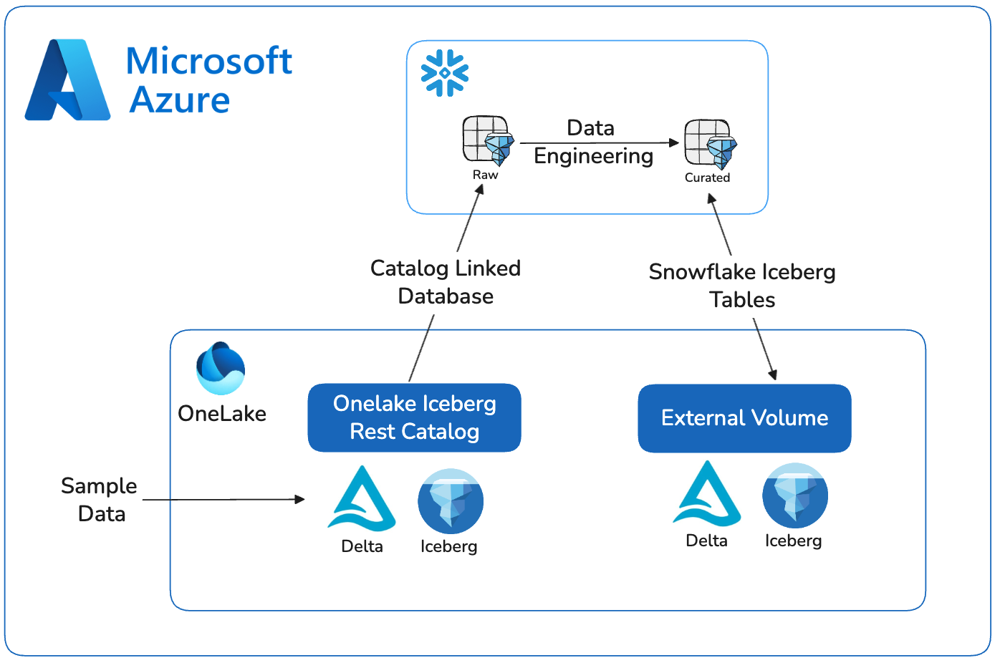


<!-- ------------------------ -->
## Prepare Sample Data

In Microsoft Fabric, begin by creating a New Item.
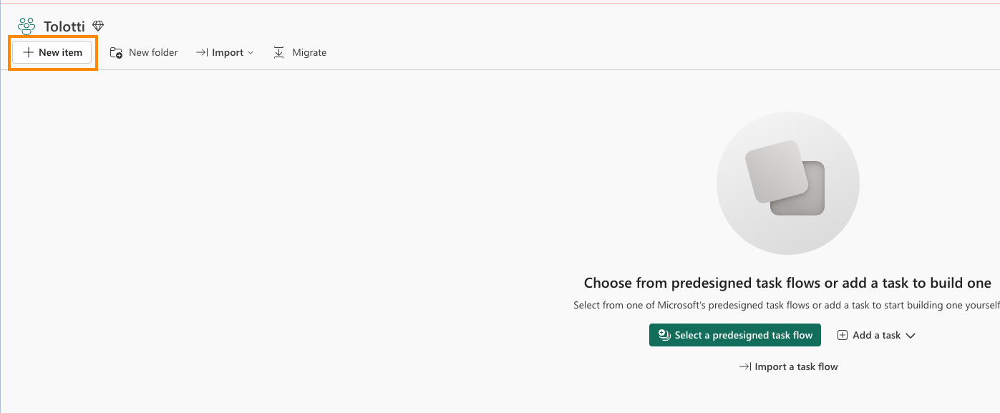
* Select Lakehouse and name it SnowflakeOneLakeLakehouse.  
* Ensure Lakehouse schemas is checked and Create.
* In the center of the screen, select Start with sample data. 
* Select Retail data model from Wide World Importers.
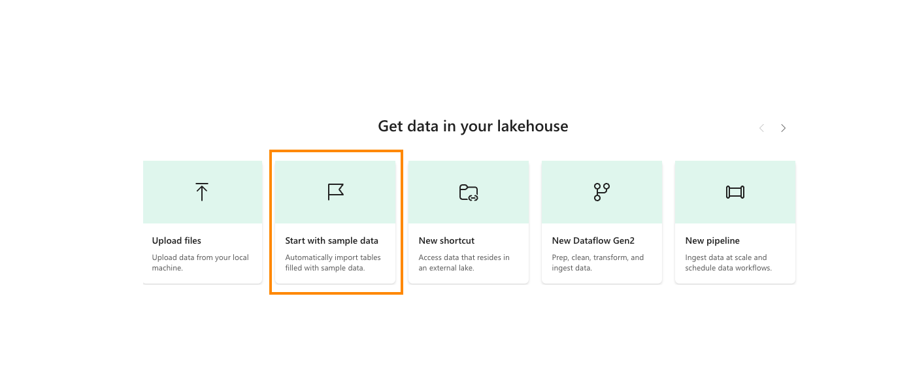
You should now see a number of tables available.
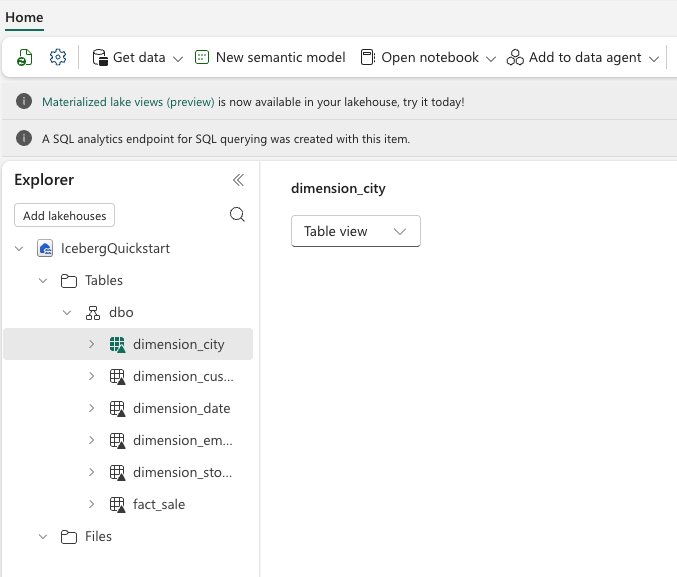

These Fabric Settings needs to be enabled:

In the Fabric Admin Portal, in Tenant Settings under the Developer Settings category, "Service Principals can call Fabric public APIs" is ENABLED.

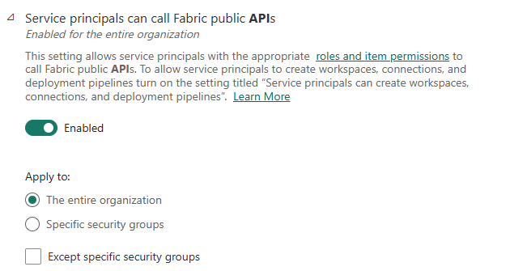

Under OneLake Settings, "Users can access data stored in OneLake with apps external to Fabric" is ENABLED.
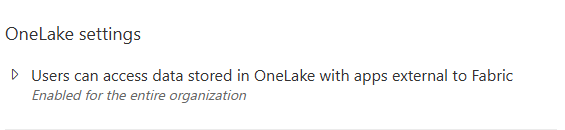

In your Fabric Worskpace settings, under Delegated Settings, make sure "Enable Delta Lake to Apache Iceberg table format virtualization" is ON.

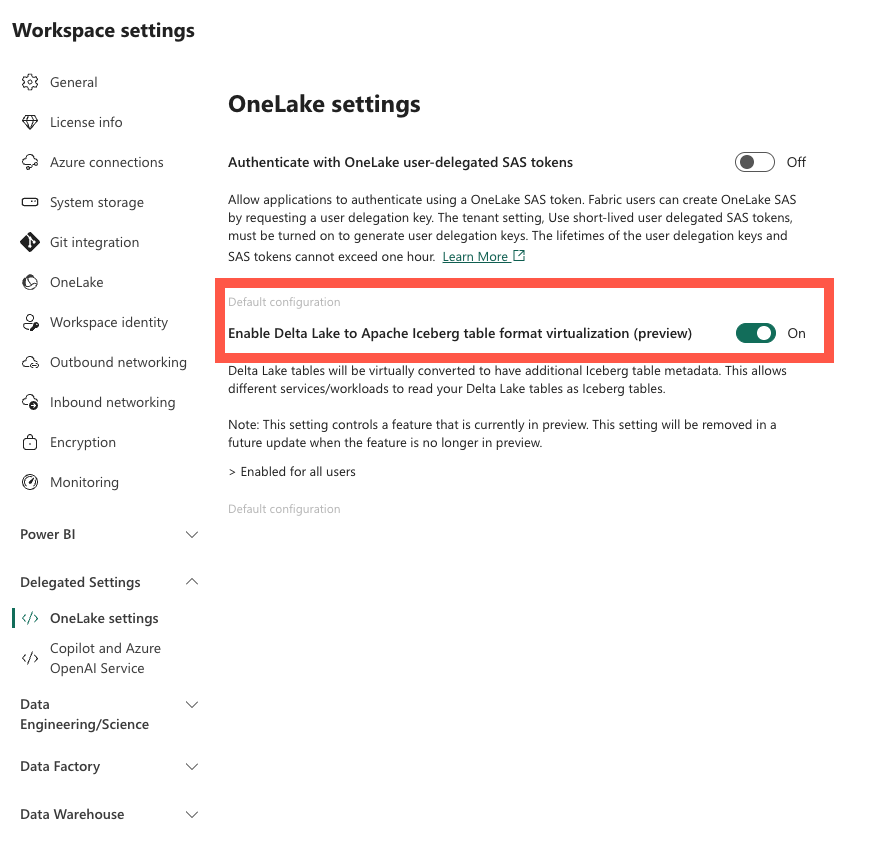


<!-- ------------------------ -->
## Create a Snowflake Catalog Linked Database

### Azure Portal
1. In the Azure portal search for and open "App Registrations"
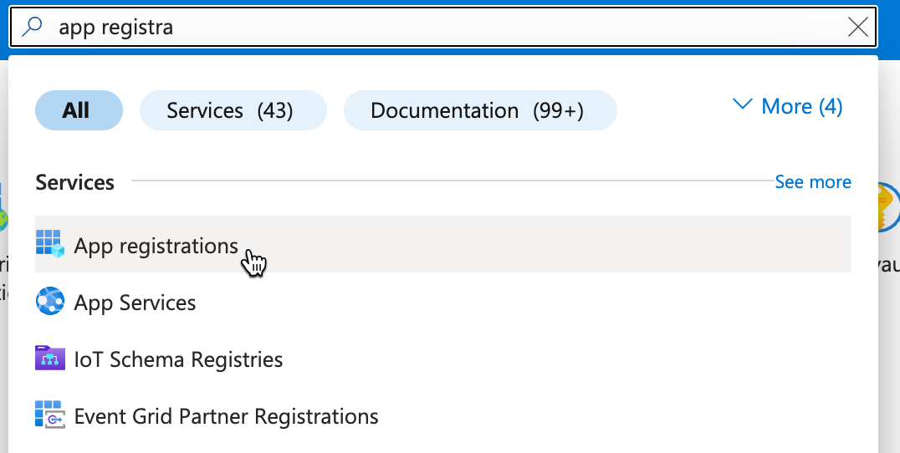

2. Click "+ New Registration"
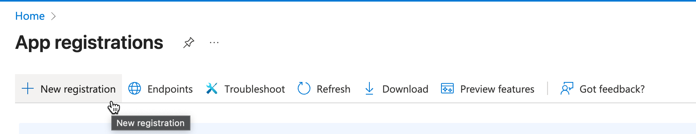
3. Give the app name (ex. <username>_Snowflake_Oath_Client )
Create by clicking "Register"
Copy and make note of the "Directory (tenant) ID"
Copy and make note of the "Application (client) ID"
Copy and make note of the  "Managed application in local directory" Name -- used for "Managed Access" step
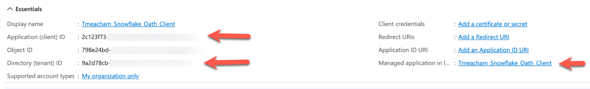
4. Under Manage, choose API Permissions
Under Configured permissions, click "Add a Permission"
Select the Azure Storage tile.
Check the box for user_impersonation
Click Add Permission
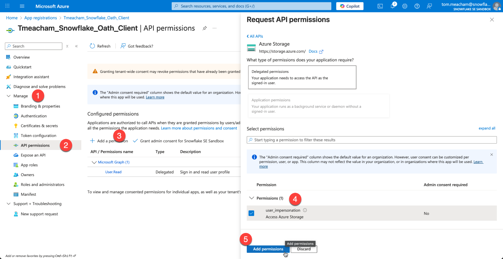
5. On the left hand menu, Click "Certificates & secrets"
Click "New Client Secret"
!!IMPORTANT!! Copy the Value, as it will not be available later. (Secret ID doesn't not matter)
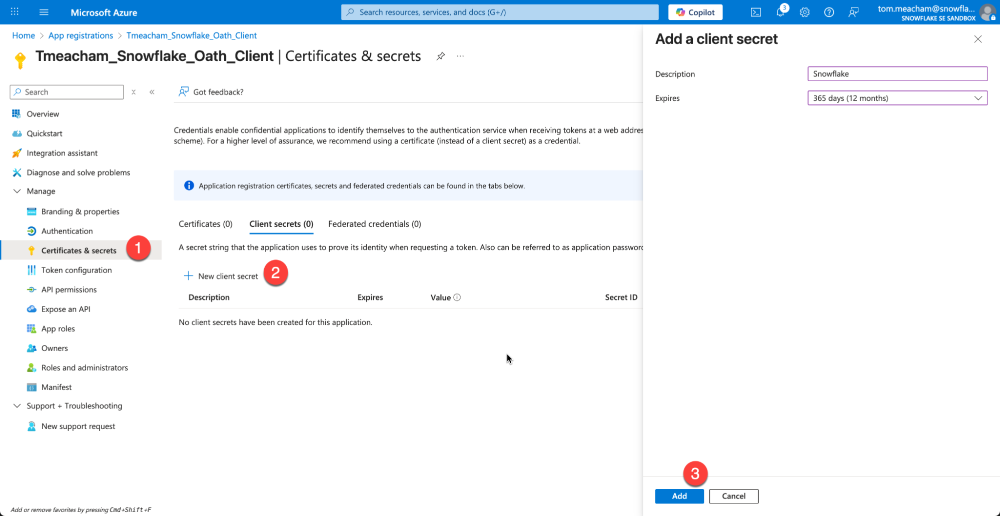
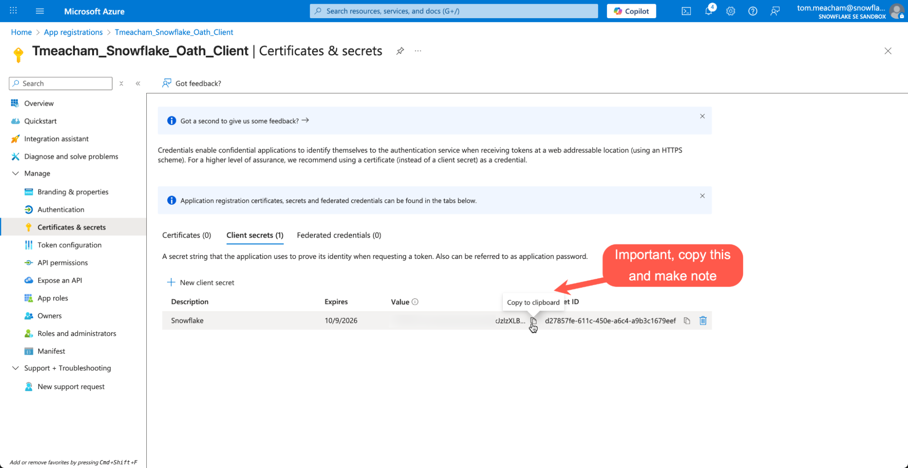

### Fabric Workspace
6. Return to your Fabric Workspace (note: not your Lakehouse)
Click Manage Access at the top
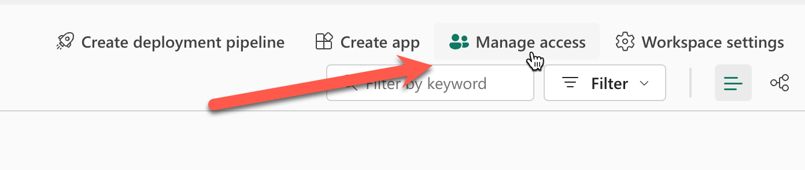
Paste in the "Managed application in local directory" from earlier, and set the role to "Contributor"
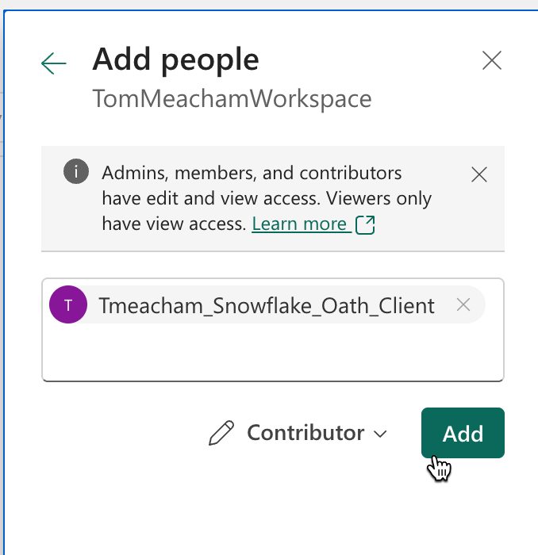


### Fabric Lakehouse
7. Click on your Lakehouse to fetch the following values from the url in the browser (just copy url)
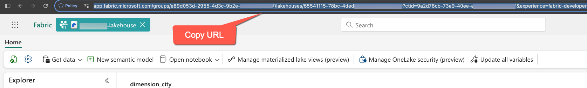
### Snowflake
8. Create a New SQL file. 
Because setup will require creating account level integrations, ACCOUNTADMIN role will be required for setup.
9. Paste in the variables you have captured into the variables at the start of the SQL script. You should have a total of 6 items you have captured.
```sql
USE ROLE ACCOUNTADMIN;

/*****************************************************************************************
This section contains all the variables that need to be configured by the user before
executing the script. Modifying these values will alter the script's behavior.

After setting the values, execute.
*****************************************************************************************/

-- Azure OAuth App Variables (set these values)
SET azure_tenant_id = 'xxxxxxxx-xxxx-xxxx-xxxx-xxxxxxxxxx';
SET azure_oauth_app_client_id = 'xxxxxxxx-xxxx-xxxx-xxxx-xxxxxxxxxx';
SET azure_oauth_client_secret_value = 'xxxxxxxx-xxxx-xxxx-xxxx-xxxxxxxxxx';
SET azure_oauth_app_managed_app_in_local_dir_name = '_Oauth_Client';

-- Lakehouse variables (set these values)
SET fabric_lakehouse_name = 'SnowflakeOneLakeLakehouse';
SET fabric_lakehouse_url = '';


/*****************************************************************************************
After successfully executing the above, execute this block.
These variables are set programmatically. Do not edit the these values.
*****************************************************************************************/

-- Snowflake Object Names
SET snowflake_fabric_rest_catalog_integration_name = 'SnowflakeOneLakeLakehouse_IRC_INT';
SET snowflake_fabric_external_volume = 'SnowflakeOneLakeLakehouse_IRC_EXTERNAL_VOLUME';
SET snowflake_fabric_write_external_volume = 'SnowflakeOneLakeLakehouse_WRITE_EXTERNAL_VOLUME';
SET snowflake_catalog_linked_db_name = 'SnowflakeOneLakeLakehouse_CLDB';

-- Snowflake Object Parameters
SET fabric_workspace_id = (SELECT REGEXP_SUBSTR($fabric_lakehouse_url, 'groups/([0-9a-f]{8}-[0-9a-f]{4}-[0-9a-f]{4}-[0-9a-f]{4}-[0-9a-f]{12})', 1, 1, 'e', 1));
SET fabric_data_item_id = (SELECT REGEXP_SUBSTR($fabric_lakehouse_url, 'lakehouses/([0-9a-f]{8}-[0-9a-f]{4}-[0-9a-f]{4}-[0-9a-f]{4}-[0-9a-f]{12})', 1, 1, 'e', 1));
SET catalog_name = (SELECT CONCAT_WS('/', $fabric_workspace_id, $fabric_data_item_id));
SET oauth_token_uri = (SELECT CONCAT('https://login.microsoftonline.com/', $azure_tenant_id,'/oauth2/v2.0/token'));
SET storage_base_url = (SELECT CONCAT('azure://onelake.dfs.fabric.microsoft.com/', $catalog_name));


/*****************************************************************************************
This query enables you to inspect all variables that were set above.
Optional: Save this information via copy/paste of donwnload a csv for reference
*****************************************************************************************/

WITH validate_cte as (
    SELECT 'azure_tenant_id' as variable_name, $azure_tenant_id as variable_value, 'Used in creation of EXTERNAL VOLUME' as notes union all
    SELECT 'azure_oauth_app_managed_app_in_local_dir_name', $azure_oauth_app_managed_app_in_local_dir_name, 'Used to add via "Manage Access" in Fabric Workspace (set role to "contributor")' union all
    SELECT 'azure_oauth_app_client_id', $azure_oauth_app_client_id, 'Used in creation of CATALOG INTEGRATION' union all
    SELECT 'azure_oauth_client_secret_value', $azure_oauth_client_secret_value, 'Used in creation of CATALOG INTEGRATION' union all
    SELECT 'fabric_lakehouse_name', $fabric_lakehouse_name, 'Used to construct names for Snowflake Objects such as "snowflake_fabric_rest_catalog_integration_name", "snowflake_fabric_external_volume", and  "snowflake_catalog_linked_db_name". Note: This does not need to match the lakehouse name in fabric, this used for object naming consistency ' union all
    SELECT 'fabric_lakehouse_url', $fabric_lakehouse_url, 'Reference. Used to extract "fabric_workspace_id" and "fabric_data_item_id"' union all
    SELECT 'oauth_token_uri', $oauth_token_uri, 'Used in creation of CATALOG INTEGRATION, Constructed with "azure_tenant_id"' union all
    SELECT 'fabric_workspace_id', $fabric_workspace_id, 'Reference, used to construct "catalog_name" variable' union all
    SELECT 'fabric_data_item_id', $fabric_data_item_id, 'Reference, used to construct "catalog_name" variable' union all
    SELECT 'catalog_name', $catalog_name, 'Used in creation of CATALOG INTEGRATION' union all
    SELECT 'storage_base_url', $storage_base_url, 'Used in creation of CATALOG INTEGRATION' union all
    SELECT 'snowflake_fabric_rest_catalog_integration_name', $snowflake_fabric_rest_catalog_integration_name, 'Used in creation of EXTERNAL VOLUME' union all
    SELECT 'snowflake_fabric_external_volume', $snowflake_fabric_external_volume, 'Name of EXTERNAL VOLUME object' union all
    SELECT 'snowflake_catalog_linked_db_name', $snowflake_catalog_linked_db_name, 'Name of Catalog Linked Database'
)
SELECT * FROM validate_cte;


/*****************************************************************************************
>> Step 1
Create the Snowflake External Iceberg Rest Catalog Integration object.

The naming convention used in this script is:
FABRIC_[fabric_lakehouse_name]__IRC_INT
*****************************************************************************************/
-- Create catalog integration object
CREATE OR REPLACE CATALOG INTEGRATION IDENTIFIER($snowflake_fabric_rest_catalog_integration_name)
    CATALOG_SOURCE = ICEBERG_REST
    TABLE_FORMAT = ICEBERG
    REST_CONFIG = (
        CATALOG_URI = 'https://onelake.table.fabric.microsoft.com/iceberg' -- Iceberg base URL at the OneLake table endpoint
        CATALOG_NAME = $catalog_name -- Fabric data item scope, in the form `workspaceID/dataItemID`
    )
    REST_AUTHENTICATION = (
        TYPE = OAUTH -- Entra auth
        OAUTH_TOKEN_URI = $oauth_token_uri -- Entra tenant ID
        OAUTH_CLIENT_ID = $azure_oauth_app_client_id -- Entra application client ID
        OAUTH_CLIENT_SECRET = $azure_oauth_client_secret_value -- Entra application client secret value
        OAUTH_ALLOWED_SCOPES = ('https://storage.azure.com/.default') -- Storage token audience
    )
    ENABLED = TRUE
;


/*****************************************************************************************
Validate the Catalog Integration object was created
*****************************************************************************************/
SHOW CATALOG INTEGRATIONS like 'SnowflakeOneLakeLakehouse_IRC_INT';


/*****************************************************************************************
Optional: describe the Catalog Integration object
*****************************************************************************************/
DESC CATALOG INTEGRATION SnowflakeOneLakeLakehouse_IRC_INT;


/*****************************************************************************************
>> Step 2
Create the External Volume objects: One for IRC, one for writing
*****************************************************************************************/

-- Note this command constructs and executes the SQL statement.
EXECUTE IMMEDIATE $$
DECLARE
    constructed_sql_statement VARCHAR;
BEGIN
    SELECT
        'CREATE OR REPLACE EXTERNAL VOLUME IDENTIFIER(''' || $snowflake_fabric_external_volume || ''')' ||
        '\n    STORAGE_LOCATIONS =' ||
        '\n    (' ||
        '\n        (' ||
        '\n            NAME = ''' || $snowflake_fabric_external_volume || ''',' ||
        '\n            STORAGE_PROVIDER = ''AZURE'',' ||
        '\n            STORAGE_BASE_URL = ''' || $storage_base_url || ''',' ||
        '\n            AZURE_TENANT_ID = ''' || $azure_tenant_id || '''' ||
        '\n        )' ||
        '\n    )' ||
        '\n    ALLOW_WRITES = FALSE' ||
        '\n;'
    INTO :constructed_sql_statement;

    -- RETURN :constructed_sql_statement;
    EXECUTE IMMEDIATE :constructed_sql_statement;
    RETURN 'CREATE EXTERNAL VOLUME statement executed successfully.';
END;
$$;

/*****************************************************************************************
>> Step 3
* Copy the Azure Multi-tenant app name
* click the "consent url" (it will open snowflake's homepage, this is expected)
*****************************************************************************************/
DESC EXTERNAL VOLUME identifier($snowflake_fabric_external_volume) ->>
SELECT 
    PARSE_JSON("property_value") as property_value,
    split_part(property_value:AZURE_MULTI_TENANT_APP_NAME::string, '_', 1) as AZURE_MULTI_TENANT_APP_NAME,
    property_value:AZURE_CONSENT_URL::string as AZURE_CONSENT_URL_CLICK_ME, 
    property_value:AZURE_TENANT_ID::string as AZURE_TENANT_ID, -- exposed for troubleshooting
    property_value:STORAGE_PROVIDER::string as STORAGE_PROVIDER, -- exposed for troubleshooting
    property_value:STORAGE_REGION::string as STORAGE_REGION, -- exposed for troubleshooting
    -- property_value:STORAGE_BASE_URL::string as STORAGE_BASE_URL,
    -- property_value:STORAGE_ALLOWED_LOCATIONS as STORAGE_ALLOWED_LOCATIONS
FROM $1
    WHERE "property" = 'STORAGE_LOCATION_1';

```
Be sure to click the consent URL and copy the multi-tenant app name for the next step. The consent URL may need to be run by an entra ID admin if you do not have access.
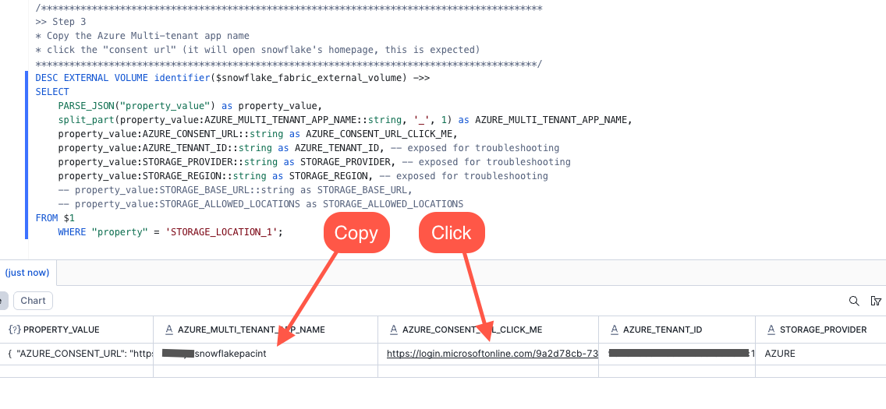

### Fabric Workspace
1. Return to your Fabric Workspace and Click Manage Access in the top right of the interface.
Make sure you are in your Fabric Work Space, and NOT your Lakehouse interface.
2. Take the value of the AZURE_MULTI_TENANT_APP_NAME you copied from the last query you ran in Snowflake, and add it to the workspace.
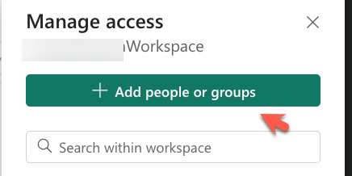
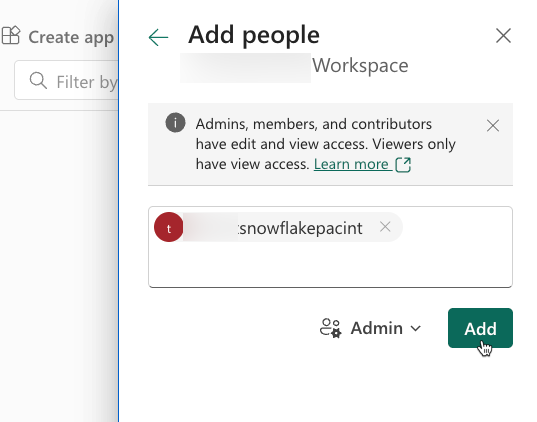

### Snowflake
1. Continue with the Snowflake SQL Script to Create your Catalog Linked Database
```sql
/*****************************************************************************************
Create a Snowflake Catalog linked database to connect to Fabric OneLake Lakehouse

Reference:
* https://docs.snowflake.com/en/sql-reference/sql/create-database-catalog-linked
*****************************************************************************************/
CREATE OR REPLACE DATABASE IDENTIFIER($snowflake_catalog_linked_db_name)
  LINKED_CATALOG = (
    CATALOG = $snowflake_fabric_rest_catalog_integration_name
  )
  EXTERNAL_VOLUME = $snowflake_fabric_external_volume
;

/*****************************************************************************************
Finshed!
You can now query and explore your data.
Note: Fabric is case sensitive, so you will need to use double quoted identifiers for 
mixed case or lower case object names. ex. "schema"."table"
*****************************************************************************************/
USE DATABASE IDENTIFIER($snowflake_catalog_linked_db_name);
SHOW SCHEMAS;
SHOW TABLES;  --This may take a minute to populate

/*****************************************************************************************
TROUBLESHOOTING

This query monitors the status of a catalog link by retrieving the
execution state, error details, and timing information from the system
function SYSTEM$CATALOG_LINK_STATUS for the variable CATALOG_LINKED_DB_NAME

No results is good. 
*****************************************************************************************/

WITH CATALOG_LINK_STATUS_CTE
AS
(
    SELECT PARSE_JSON(SYSTEM$CATALOG_LINK_STATUS($snowflake_catalog_linked_db_name)) AS RAW
)
SELECT 
    CLS.RAW:executionState::string AS EXECUTION_STATE,
    FD.INDEX as ERROR_INDEX,
    FD.value:errorCode::string AS ERROR_CODE,
    FD.value:errorMessage::string AS ERROR_MESSAGE,
    FD.value:qualifiedEntityName::string AS QUALIFIED_ENTITY_NAME,
    FD.value:entityDomain::string AS ENTITY_DOMAIN,
    FD.value:operation::string AS OPERATION,
    CLS.RAW:lastLinkAttemptStartTime::string AS LAST_LINK_ATTEMPT_START_TIME
FROM CATALOG_LINK_STATUS_CTE AS CLS,
    LATERAL FLATTEN(input => CLS.RAW, path => 'failureDetails', OUTER => True) AS FD;
```
It may take a minute for the initial sync to complete. You can run the troubleshooting query above to check on the status.

Once complete, the OneLake Lakehouse tables will show up in Snowflake data explorer as linked objects.  You can query and interact with them just like any other data in Snowflake.
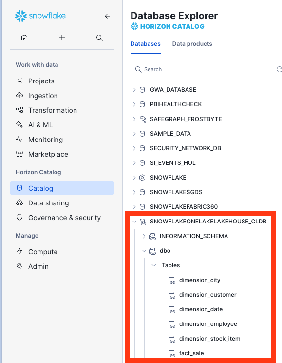


<!-- ------------------------ -->
## Create a Snowflake Database in OneLake

In this section, curated and enriched data will be written back to OneLake as a Snowflake Database Object. In a real environment this would be the data engineering work to clean the raw data in OneLake, combine data from disparate sources, modeling the unified data in your enterprise data warehouse, and preparing data products to be consumed by users. But for the sake of this quickstart, this step will just be merging some of the raw data and filtering records and writing the table back to OneLake.

Start by creating a Snowflake database that will serve the processed, curated data.

```sql
CREATE OR REPLACE DATABASE SNOWFLAKEONELAKELAKEHOUSE_ANALYTICS;
```


### Create a Snowflake connection in Microsoft Fabric
In this step you create a Snowflake connection in Microsoft Fabric, which allows you to connect your standard database in Snowflake to Microsoft Fabric.

1. Navigate to Microsoft Fabric.
2. Select the Settings icon and select Manage connections and gateways.
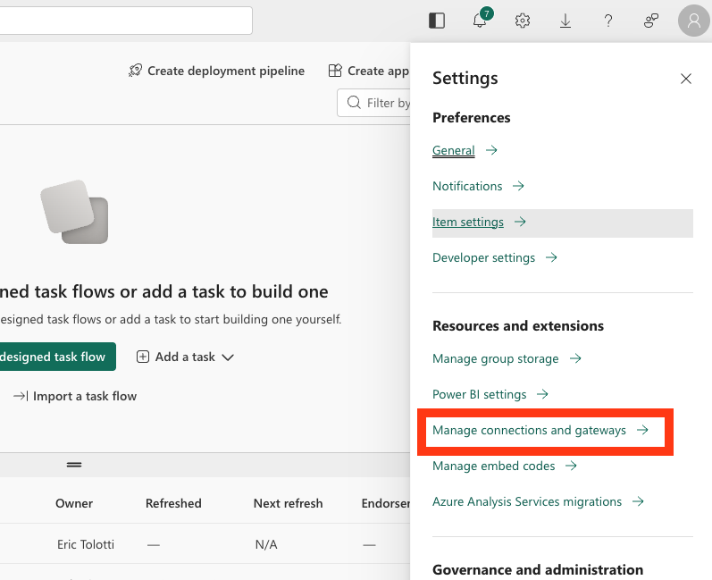
3. Select + New.
4. In the New connection dialog, create a Snowflake connection:
     * Select Cloud.
     * For Connection name, enter a connection name.
     * For Connection type, select Snowflake.
     * For Server, enter your identifier for your Snowflake account:
     * https://<orgname>-<accountname>.snowflakecomputing.com [Finding the organization and account name for an account](https://docs.snowflake.com/en/user-guide/admin-account-identifier#label-account-name-find)

   * For Warehouse, enter the name of a warehouse in Snowflake.
   * For Authentication method, select Snowflake.
   * For Username, enter the name of the user.
   * For Password, enter the password for the user that you created in Snowflake.
   * Select Create.

For more information about creating a Snowflake connection in Microsoft Fabric, see [Set up your Snowflake database connection](https://learn.microsoft.com/en-us/fabric/data-factory/connector-snowflake)

5. After your connection is created, save the Connection ID for your connection for use later.
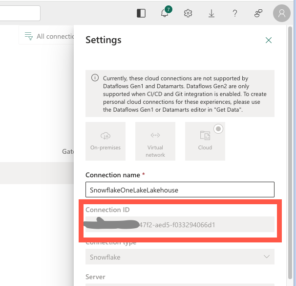

6. From the connection Managed users menu, search for your multi-tenant app name and grant it user access to the connection.
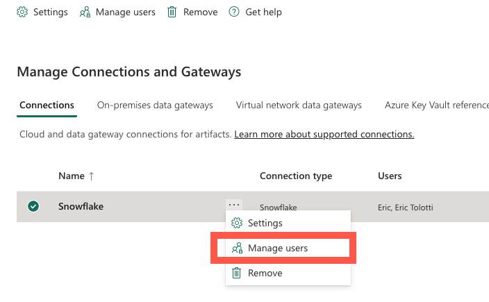
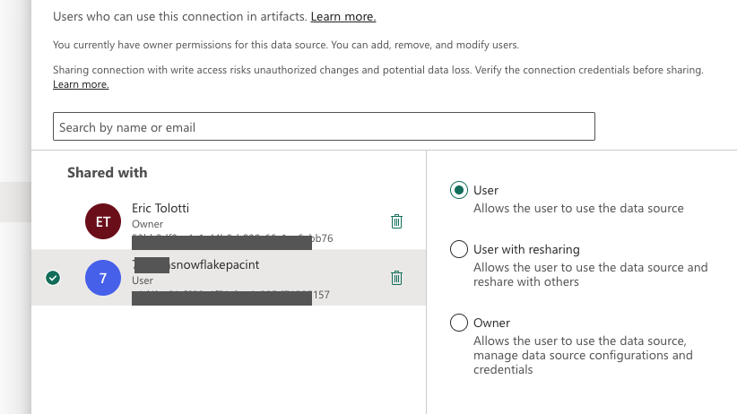

### Connect your Snowflake database to Microsoft Fabric
In this step, you connect a standard Snowflake database to Microsoft Fabric.

1. Sign in to Snowsight.
2. In the navigation menu, select Ingestion » Add Data.
3. On the Add Data page, select Microsoft OneLake.
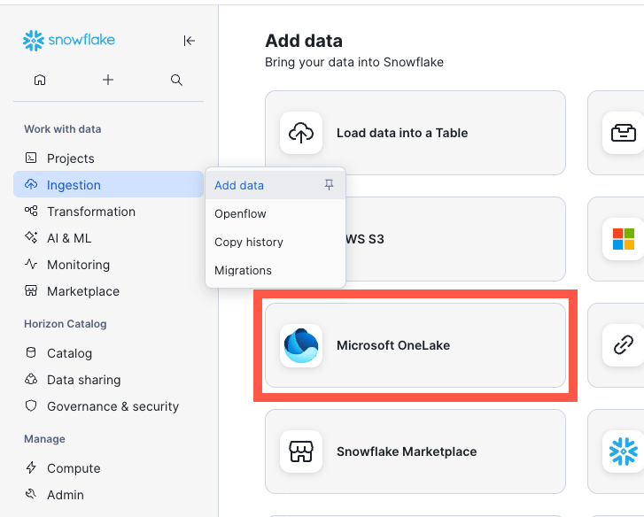
4. Enter your Fabric tenant ID and select Continue.
5. Select Continue. And in the Create an item in Microsoft Fabric dialog, fill in the fields:
     * For Fabric workspace name, enter the name of the workspace in Fabric where you want to view your Iceberg tables.

6. For Snowflake database, select SNOWFLAKEONELAKELAKEHOUSE_ANALYTICS and continue.

7. In the Create External Volume dialog, to create an external volume, review the volume details, and then select Create Volume.

A Snowflake Database object is created in Microsoft Fabric.
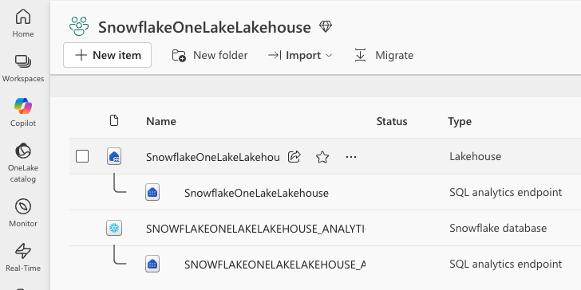

### Create an Iceberg table
In this step, you create a Snowflake-managed Iceberg table stored in OneLake.

```sql
USE DATABASE SNOWFLAKEONELAKELAKEHOUSE_ANALYTICS;

--Create the Iceberg table in OneLake
 CREATE ICEBERG TABLE FACT_EMPLOYEE_PROFIT  (
        EMPLOYEE_PREFERRED_NAME STRING,
        BRAND STRING,
        TOTAL_PROFIT NUMBER(18, 2),
        TOTAL_INVOICES int,
        TOTAL_SALES_REVENUE NUMBER(18, 2)
    )
CATALOG = 'SNOWFLAKE';

--Insert sample data
INSERT INTO SNOWFLAKEONELAKELAKEHOUSE_ANALYTICS.ANALTYICS.FACT_EMPLOYEE_PROFIT
    --Top Selling Employees: Profit Breakdown by Product Brand
SELECT
    T_E.PreferredName,
    T_SI.Brand,
    SUM(T0.Profit) AS TotalProfit,
    COUNT(T0.WWIInvoiceID) AS TotalInvoices,
    SUM(T0.TotalExcludingTax) AS TotalSalesRevenue
FROM
    fact_sale T0
JOIN
    dimension_employee T_E ON T0.SalespersonKey = T_E.EmployeeKey
JOIN
    dimension_stock_item T_SI ON T0.StockItemKey = T_SI.StockItemKey
WHERE
    T_E.IsSalesperson = 1
    AND T0.Profit > 0
GROUP BY
    T_E.PreferredName,
    T_SI.Brand
ORDER BY
    T_E.PreferredName,
    TotalProfit DESC;
```

You can now find the Snowflake database object, with the data populated, within OneLake.  
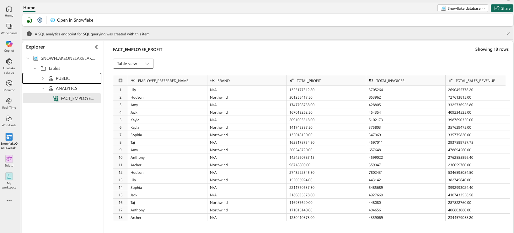

<!-- ------------------------ -->
## Conclusion and Resources


Congratulations! You've successfully created an Iceberg table in OneLake as a Snowflake data object, and set up OneLake as a catalog linked database in Snowflake. Resulting in a fully bi-directional Open Lakehouse. You can now use this data for power BI reports, querying from Snowflake, working with Snowpark, working with Fabric Notebooks, and many more use-cases. This is the foundation for an Iceberg Lakehouse architecture with Snowflake on Azure!


### What You Learned
- creating an external volume and catalog integration to read Iceberg data in OneLake
- creating a Snowflake Database in OneLake and writing Snowflake managed Iceberg tables
- setting OneLake as a catalog linked database in Snowflake
- querying Iceberg from Snowflake and Fabric services

### Resources
- [CREATE CATALOG INTEGRATION (Apache Iceberg™ REST)](https://docs.snowflake.com/en/sql-reference/sql/create-catalog-integration-rest)

- [CREATE EXTERNAL VOLUME](https://docs.snowflake.com/en/sql-reference/sql/create-external-volume)

- [CREATE DATABASE (catalog-linked)](https://docs.snowflake.com/en/sql-reference/sql/create-database-catalog-linked)

- [Getting started with OneLake table APIs for Iceberg (Snowflake)](https://learn.microsoft.com/en-us/fabric/onelake/table-apis/onelake-iceberg-table-apis-detailed#snowflake)

If you have any questions, reach out to your Snowflake account team!
