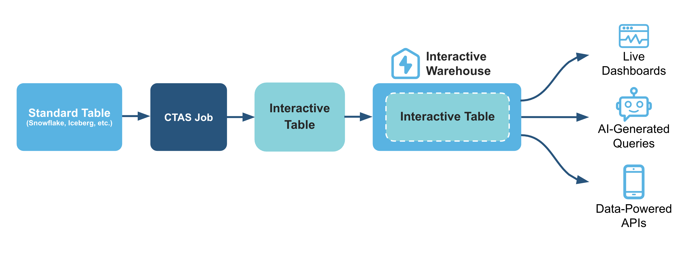

# Getting Started with Snowflake Interactive Tables

## Overview

When it comes to near real-time (or sub-second) analytics, the ideal scenario involves achieving consistent, rapid query performance and managing costs effectively, even with large datasets and high user demand. 

Snowflake's new Interactive Warehouses and Tables are designed to deliver on these needs. They provide high-concurrency, low-latency serving layer for near real-time analytics. This allows consistent, sub-second query performance for live dashboards and APIs with great price-for-performance. With this end-to-end solution, you can avoid operational complexities and tool sprawl.

Here's how interactive warehouses and tables fits in for a typical data analytics pipeline:

### What You'll Learn
- The core concepts behind Snowflake's Interactive Warehouses and Tables and how they provide low-latency analytics.
- How to create and configure an Interactive Warehouse using SQL.
- The process of creating an Interactive Table from an existing standard table.
- How to attach a table to an Interactive Warehouse to pre-warm the data cache for faster queries.
- A methodology for benchmarking and comparing the query latency of an interactive setup versus a standard warehouse.

### What You'll Build

You will build a complete, functioning interactive data environment in Snowflake, including a dedicated Interactive Warehouse and an Interactive Table populated with data. You will also create a Python-based performance test that executes queries against both your new interactive setup and a standard configuration, culminating in a comparative bar chart that visually proves the latency improvements.

# Step-By-Step Guide

For prerequisites, environment setup, step-by-step guide and instructions, please refer to the [QuickStart Guide](template.md).
