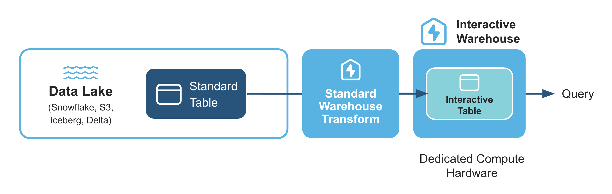
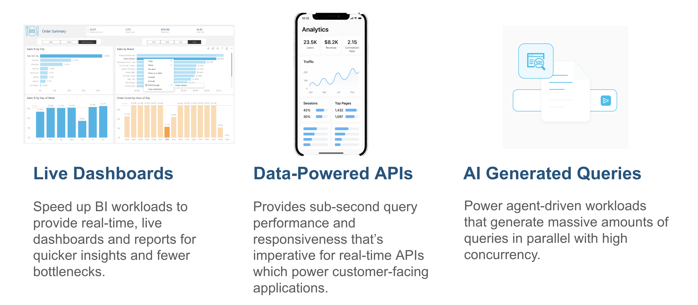
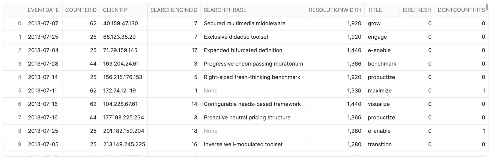
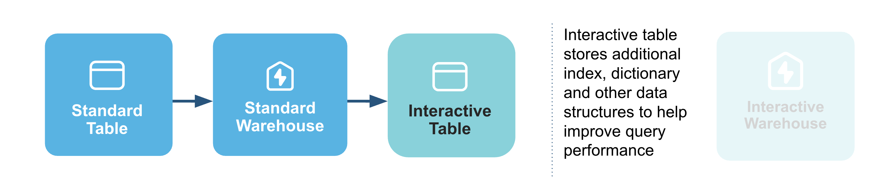
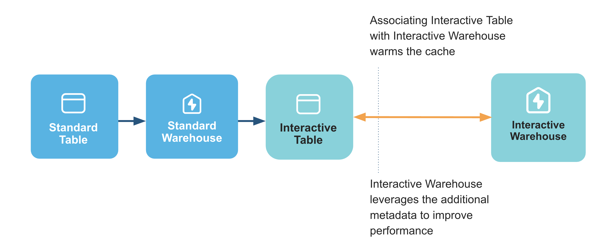
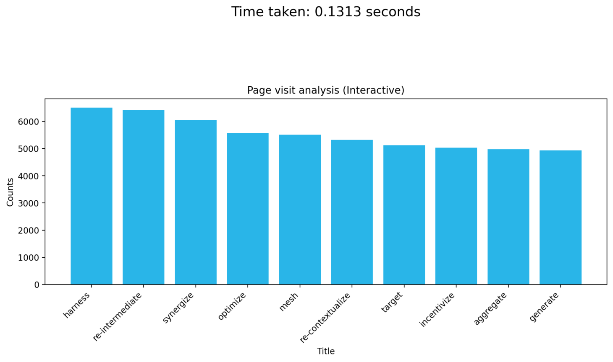
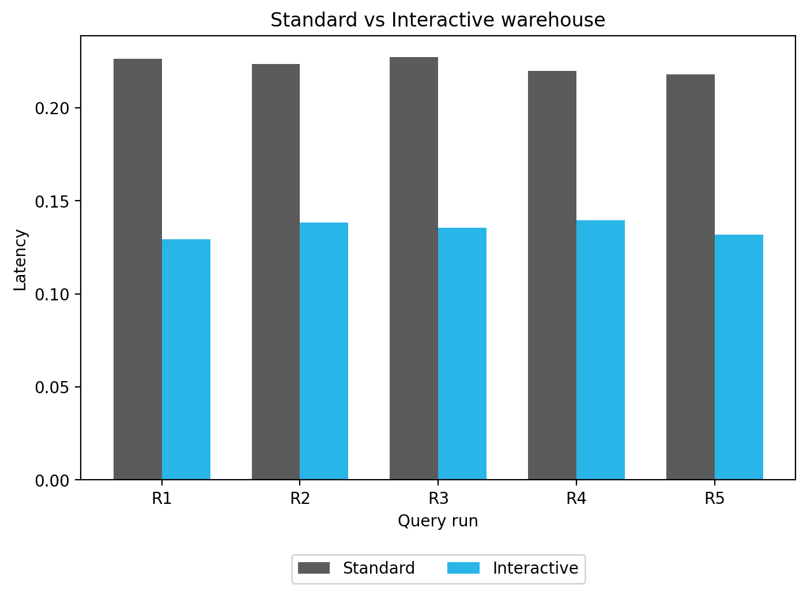

author: Chanin Nantasenamat
id: getting-started-with-interactive-tables
summary: This guide demonstrates how to set up and use Snowflake's Interactive Warehouses and Tables to achieve sub-second query performance. 
categories: snowflake-site:taxonomy/solution-center/certification/quickstart, snowflake-site:taxonomy/product/analytics
language: en
environments: web
status: Published
language: en


# Getting Started with Snowflake Interactive Tables

## Overview


When it comes to near real-time (or sub-second) analytics, the ideal scenario involves achieving consistent, rapid query performance and managing costs effectively, even with large datasets and high user demand. 

Snowflake's new Interactive Warehouses and Tables are designed to deliver on these needs. They provide high-concurrency, low-latency serving layer for near real-time analytics. This allows consistent, sub-second query performance for live dashboards and APIs with great price-for-performance. With this end-to-end solution, you can avoid operational complexities and tool sprawl.

Here's how interactive warehouses and tables fits in for a typical data analytics pipeline:


### What You'll Learn
- The core concepts behind Snowflake's Interactive Warehouses and Tables and how they provide low-latency analytics.
- How to create and configure an Interactive Warehouse using SQL.
- The process of creating an Interactive Table from an existing standard table.
- How to attach a table to an Interactive Warehouse to pre-warm the data cache for faster queries.
- A methodology for benchmarking and comparing the query latency of an interactive setup versus a standard warehouse.

### What You'll Build

You will build a complete, functioning interactive data environment in Snowflake, including a dedicated Interactive Warehouse and an Interactive Table populated with data. You will also create a Python-based performance test that executes queries against both your new interactive setup and a standard configuration, culminating in a comparative bar chart that visually proves the latency improvements.

### Prerequisites
- Access to a [Snowflake account](https://signup.snowflake.com/?utm_source=snowflake-devrel&utm_medium=developer-guides&utm_cta=developer-guides)
- Basic knowledge of SQL and Python.
- Familiarity with data warehousing and performance concepts.
- A Snowflake role with privileges to create warehouses and tables (*i.e.*, `SYSADMIN` is used in the notebook).

## Understand Interactive Warehouses and Interactive Tables


To boost query performance for interactive, sub-second analytics, Snowflake introduces two new, specialized objects that work together: interactive warehouses and interactive tables.

Think of them as a high-performance pair. Interactive tables are structured for extremely fast data retrieval, and interactive warehouses are the specialized engines required to query them. Using them in tandem is the key to achieving the best possible query performance and lowest latency.



### Interactive Warehouses
An interactive warehouse tunes the Snowflake engine specially for low-latency, interactive workloads. This type of warehouse is optimized to run continuously, serving high volumes of concurrent queries. All interactive warehouses run on the latest generation of hardware and can only query interactive tables.

### Interactive Tables
Interactive tables have different methods for data ingestion and support a more limited set of SQL statements and query operators than standard Snowflake tables.

### Use cases
Snowflake interactive tables are optimized for fast, simple queries when you require consistent low-latency responses. Interactive warehouses provide the compute resources required to serve these queries efficiently. Together, they enable use cases such as live dashboards, data-powered APIs, and serving high-concurrency workloads.



Furthermore, this pairing of interactive warehouses and tables is ideal for a range of specific, demanding use cases where sub-second query performance is paramount. In industries like ad-tech, IoT, and video analytics, it can power near real-time decisioning on massive event streams. For application development, it enables highly responsive data-powered APIs and in-app user behavior analytics. It's also perfectly suited for internal analytics, providing the speed needed for live dashboards, BI acceleration, and critical observability/APM systems that require high-throughput alerting.


### Limitations

The queries that work best with interactive tables are usually `SELECT` statements with selective `WHERE` clauses, optionally including a `GROUP BY` clause on a few dimensions.

Here are some limitations of interactive warehouses and interactive tables:
- An interactive warehouse is always up and running by design. You can manually suspend the warehouse, but expect significant query latency when you resume the warehouse.
- Snowflake interactive tables don’t support ETL, long-running queries (more than 5 seconds), or data manipulation language (DML) commands such as `UPDATE` and `DELETE`.
- Do modify data, you should update the data in source tables and either fully replace an interative table with new version, or use a dynamic table style incremental refresh by setting TARGET_LAG
- You can't query standard Snowflake tables from an interactive warehouse. To query both standard tables and interactive tables in the same session, run `USE WAREHOUSE` to switch to the appropriate warehouse type depending on the type of table.
- You can't run `CALL` commands to call stored procedures through interactive warehouse

<!-- ------------------------ -->
## Setup

### Data operations

#### Optional: Create warehouse

In order to create an interactive table and fill the table with data, you'll need to use a standard warehouse.
You can use any existing warehouse or create a new one, here we'll create a new warehouse called `WH`:

```sql
CREATE OR REPLACE WAREHOUSE WH WITH WAREHOUSE_SIZE='X-SMALL';
```

#### Step 1: Create a Database and Schema

First, we'll start by creating a database called `MY_DEMO_DB` and `BENCHMARK_FDN` and `BENCHMARK_INTERACTIVE` as schemas:

```sql
CREATE DATABASE IF NOT EXISTS MY_DEMO_DB;
CREATE SCHEMA IF NOT EXISTS MY_DEMO_DB.BENCHMARK_FDN;
CREATE SCHEMA IF NOT EXISTS MY_DEMO_DB.BENCHMARK_INTERACTIVE;
```

#### Step 2: Create a new stage
Next, we'll create a stage called `my_csv_stage` where the CSV file will soon be stored:

```sql
-- Define database and schema to use
USE SCHEMA MY_DEMO_DB.BENCHMARK_FDN;

-- Create a stage that includes the definition for the CSV file format
CREATE OR REPLACE STAGE my_csv_stage
  FILE_FORMAT = (
    TYPE = 'CSV'
    SKIP_HEADER = 1
    FIELD_OPTIONALLY_ENCLOSED_BY = '"'
  );
```

#### Step 3: Upload CSV to a stage

1. In the Snowflake UI, navigate to the database you created (`MY_DEMO_DB`).
2. Go to the `my_csv_stage` stage
3. Upload the [`synthetic_hits_data.csv`](https://github.com/Snowflake-Labs/snowflake-demo-notebooks/blob/main/Interactive_Tables/synthetic_hits_data.csv) file to this stage.

#### Step 4: Create the Table and Load Data

Now that we have the CSV file in the stage, we'll need to create the `HITS2_CSV` table and extract contents from the CSV file into it.

```sql
-- Use your database and schema
USE SCHEMA MY_DEMO_DB.BENCHMARK_FDN;

-- Create the table with the correct data types
CREATE OR REPLACE TABLE HITS2_CSV (
    EventDate DATE,
    CounterID INT,
    ClientIP STRING,
    SearchEngineID INT,
    SearchPhrase STRING,
    ResolutionWidth INT,
    Title STRING,
    IsRefresh INT,
    DontCountHits INT
);

-- Copy the data from your stage into the table
-- Make sure to replace 'my_csv_stage' with your stage name
COPY INTO HITS2_CSV FROM  @my_csv_stage/synthetic_hits_data.csv
  FILE_FORMAT = (TYPE = 'CSV' SKIP_HEADER = 1);
```

#### Step 5: Query the data

Finally, we'll now retrieve contents from the table by performing a simple query with the `SELECT` statement:

```sql
-- Query
SELECT * FROM MY_DEMO_DB.BENCHMARK_FDN.HITS2_CSV;
```

This essentially retrieves data from the `MY_DEMO_DB` database, `BENCHMARK_FDN` schema and `HITS2_CSV` table:



<!-- ------------------------ -->
## Performance Demo of Snowflake's Interactive Warehouses/Tables


To proceed with carrying out this performance comparison of interactive warehouses/tables with standard ones, you can download notebook file [Getting_Started_with_Interactive_Tables.ipynb](https://github.com/Snowflake-Labs/snowflake-demo-notebooks/blob/main/Interactive_Tables/Getting_Started_with_Interactive_Tables.ipynb) provided in the repo.

### Load libraries and define custom functions

We'll start by loading the prerequisite libraries and define helper functions that will be used for the benchmark.

```python
import snowflake.connector as snow
import matplotlib.pyplot as plt
import numpy as np
import pandas as pd
import time
import datetime
import random
import statistics
import tabulate
from concurrent.futures import ThreadPoolExecutor, as_completed

conn_kwargs={}

def execute_and_print(query):
    cursor.execute(query)
    print(tabulate.tabulate(cursor.fetchall()))

def run_and_measure(count, mode):

    if mode =="std":
        query = """
                SELECT SearchEngineID, ClientIP, COUNT(*) AS c, SUM(IsRefresh), AVG(ResolutionWidth) FROM 
                BENCHMARK_FDN.HITS2_CSV
                WHERE SearchPhrase <> '' GROUP BY SearchEngineID, ClientIP ORDER BY c DESC LIMIT 10;
                """
        warehouse_query ="USE WAREHOUSE wh"
    else:
        query = """
                SELECT SearchEngineID, ClientIP, COUNT(*) AS c, SUM(IsRefresh), AVG(ResolutionWidth) FROM 
                BENCHMARK_INTERACTIVE.CUSTOMERS
                WHERE SearchPhrase <> '' GROUP BY SearchEngineID, ClientIP ORDER BY c DESC LIMIT 10;
                """
        warehouse_query ="USE WAREHOUSE interactive_demo_b"
    timings = []
    with snow.connect(**conn_kwargs) as conn:
        with conn.cursor() as cur:
            cur.execute(warehouse_query)
            cursor.execute('ALTER SESSION SET USE_CACHED_RESULT = FALSE;')
            for i in range(count+1):
                t0 = time.time()
                cur.execute(query).fetchall()
                time_taken = time.time() - t0
                timings.append(time_taken)
                
    return timings
    
def plot_data(data, title, time_taken, color='blue'):
    # Separate titles and counts
    titles = [item[0] for item in data]
    counts = [item[1] for item in data]

    # Plot bar chart
    
    plt.figure(figsize=(12, 4))
    plt.bar(titles, counts, color=color)
    plt.xticks(rotation=45, ha='right')
    plt.ylabel("Counts")
    plt.xlabel("Title")
    plt.title(title)
    plt.text(6, 100, f'Time taken: {time_taken:.4f} seconds', ha='right',va='top', fontdict={'size': 16})
    #plt.tight_layout()
    plt.show()

```

### Setting up connection to a Snowflake deployment and verifying versions

Here, we'll connect to Snowflake and verify the version and confirm that key interactive features are enabled, before setting the active database and role for the session.

```python
config = { }
cursor = snow.connect(**config).cursor()

query = """ USE DATABASE MY_DEMO_DB; """
execute_and_print(query)

query = """ USE ROLE SYSADMIN;  """
execute_and_print(query)
```

### Create an interactive warehouse


Next, let's create our `interactive_demo_b` warehouse and immediately turn it on:

```python
query = """
CREATE or REPLACE INTERACTIVE WAREHOUSE interactive_demo_b
                WAREHOUSE_SIZE = 'XSMALL'
                MIN_CLUSTER_COUNT = 1
                MAX_CLUSTER_COUNT = 1
                COMMENT = 'Interactive warehouse demo';
"""
execute_and_print(query)
query = """
ALTER WAREHOUSE INTERACTIVE_DEMO_B RESUME;
"""
execute_and_print(query)
```

This should yield the following output:

```
--------------------------------------------------------------  
INTERACTIVE WAREHOUSE INTERACTIVE_DEMO_B successfully created.  
--------------------------------------------------------------  
```

### Create an interactive table



Now, we'll use the `WH` warehouse to efficiently create our new interactive `CUSTOMERS` table by copying all the data from the original standard table:

```python
print("Switch to demo database")
print(cursor.execute("USE DATABASE MY_DEMO_DB").fetchall())

print("Use a standard warehouse for creating the interactive table's data")
print(cursor.execute("USE WAREHOUSE WH").fetchall())

query = """
CREATE OR REPLACE INTERACTIVE TABLE 
MY_DEMO_DB.BENCHMARK_INTERACTIVE.CUSTOMERS CLUSTER BY (ClientIP)
AS
 SELECT * FROM MY_DEMO_DB.BENCHMARK_FDN.HITS2_CSV
 
"""
execute_and_print(query)
```

This gives the following output:
```
Switch to demo database  
[('Statement executed successfully.',)]  
Use a standard warehouse for creating the interactive table's data  
[('Statement executed successfully.',)]  
-------------------------------------  
Table CUSTOMERS successfully created.  
-------------------------------------
```

### Attach interactive table to a warehouse



Next, we'll attach our interactive table to the warehouse, which pre-warms the data cache for optimal query performance:

```python
query = """
USE DATABASE MY_DEMO_DB;
"""
execute_and_print(query)

query = """
ALTER WAREHOUSE interactive_demo_b ADD TABLES(BENCHMARK_INTERACTIVE.CUSTOMERS);
"""
execute_and_print(query)
```

Running the above statement should yield the following:
```
--------------------------------  
Statement executed successfully.  
--------------------------------  
...
```

### Run queries with interactive warehouse


Now, we'll run our first performance test on the interactive setup by executing a page-view query, timing its execution, and then plotting the results.

We'll start by activating the interactive warehouse and disabling the result cache:

```python
print("Use a standard warehouse for creating the interactive table's data")
cursor.execute("USE WAREHOUSE interactive_demo_b")
cursor.execute('USE DATABASE MY_DEMO_DB;')
cursor.execute('ALTER SESSION SET USE_CACHED_RESULT = FALSE;')
```


Next, we'll run a query to find the top 10 most viewed pages for July 2013, measures how long it takes, and then plots the results and execution time:

```python
query = """
SELECT Title, COUNT(*) AS PageViews
FROM BENCHMARK_INTERACTIVE.CUSTOMERS
WHERE CounterID = 62
  AND EventDate >= '2013-07-01'
  AND EventDate <= '2013-07-31'
  AND DontCountHits = 0
  AND IsRefresh = 0
  AND Title <> ''
  AND REGEXP_LIKE(Title, '^[\\x00-\\x7F]+$')
  AND LENGTH(Title) < 20
GROUP BY Title
ORDER BY PageViews DESC
LIMIT 10;
"""

start_time = time.time()
result = cursor.execute(query).fetchall()
end_time = time.time()
time_taken = end_time - start_time

plot_data(result, "Page visit analysis (Interactive)", time_taken)
```

This gives the following plot:



### Compare to a standard warehouse


To establish a performance baseline, we'll run an identical page-view query on a standard warehouse to measure and plot its results for comparison.

We'll start by preparing the session for a performance benchmark by selecting a standard `XSMALL` warehouse, disabling the result cache, and setting the active database:

```python
print("Use a standard warehouse for creating the interactive table's data")
cursor.execute("USE WAREHOUSE WH")
cursor.execute('ALTER SESSION SET USE_CACHED_RESULT = FALSE;')
cursor.execute('USE DATABASE MY_DEMO_DB;')
```


Here, we'll run a top 10 page views analysis by executing the query, measuring its performance, and immediately plotting the results and execution time:

```python
query = """
SELECT Title, COUNT(*) AS PageViews
FROM BENCHMARK_FDN.HITS2_CSV
WHERE CounterID = 62
  AND EventDate >= '2013-07-01'
  AND EventDate <= '2013-07-31'
  AND DontCountHits = 0
  AND IsRefresh = 0
  AND Title <> ''
  AND REGEXP_LIKE(Title, '^[\\x00-\\x7F]+$')
  AND LENGTH(Title) < 20
GROUP BY Title
ORDER BY PageViews DESC
LIMIT 10;
"""

start_time = time.time()
result = cursor.execute(query).fetchall()
end_time = time.time()
time_taken = end_time - start_time

plot_data(result, "Page visit analysis (Interactive)", time_taken, 'green')
```


### Run some queries concurrently

To directly compare performance, we'll benchmark both the interactive and standard warehouses over several runs and then plot their latencies side-by-side in a grouped bar chart:

```python
runs = 4

counts_iw = run_and_measure(runs,"iw")
print(counts_iw)

counts_std = run_and_measure(runs,"std")
print(counts_std)

titles = [f"R{i}" for i in range(1, len(counts_iw)+1)]

x = np.arange(len(titles))  # the label locations
width = 0.35  # bar width

fig, ax = plt.subplots(figsize=(8, 5))
ax.bar(x - width/2, counts_std, width, label="Standard", color="green")
ax.bar(x + width/2, counts_iw, width, label="Interactive", color="blue")

ax.set_ylabel("Latency")
ax.set_xlabel("Query run")
ax.set_title("Standard vs Interactive warehouse")
ax.set_xticks(x)
ax.set_xticklabels(titles)
ax.legend(
    loc='upper center',
    bbox_to_anchor=(0.5, -0.15),
    ncol=2
)
plt.show()
```



## Conclusion And Resources


In this guide, we explored how to address the challenge of low-latency, near real-time analytics using Snowflake's interactive warehouses and tables. We walked through the complete setup process, from creating the necessary database objects and loading data to configuring and attaching an interactive table to an interactive warehouse. The subsequent performance benchmark clearly demonstrated the substantial latency improvements these specialized features provide over standard configurations, especially under concurrent query loads. This confirms their value as a powerful solution for demanding use cases like live dashboards and high-throughput data APIs, where sub-second performance is critical.

### What You Learned
- Interactive warehouses and tables work together as a specialized pair to deliver low-latency analytics for use cases like live dashboards and APIs.
- How to create, configure, and attach interactive warehouses and tables using SQL to prepare a high-performance analytics environment.
- How to benchmark and visually demonstrate the performance gains of interactive setups over standard ones using Python, proving their effectiveness for high-concurrency workloads.

### Related Resources

Data and Notebook:
- [synthetic_hits_data.csv](https://github.com/Snowflake-Labs/snowflake-demo-notebooks/blob/main/Interactive_Tables/synthetic_hits_data.csv)
- [Getting_Started_with_Interactive_Tables.ipynb](https://github.com/Snowflake-Labs/snowflake-demo-notebooks/blob/main/Interactive_Tables/Getting_Started_with_Interactive_Tables.ipynb)

Documentation:
- [Snowflake interactive tables and interactive warehouses](https://docs.snowflake.com/en/user-guide/interactive)
