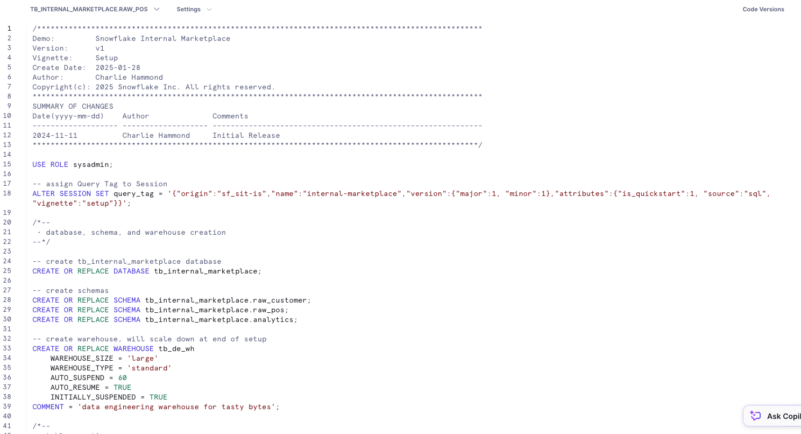
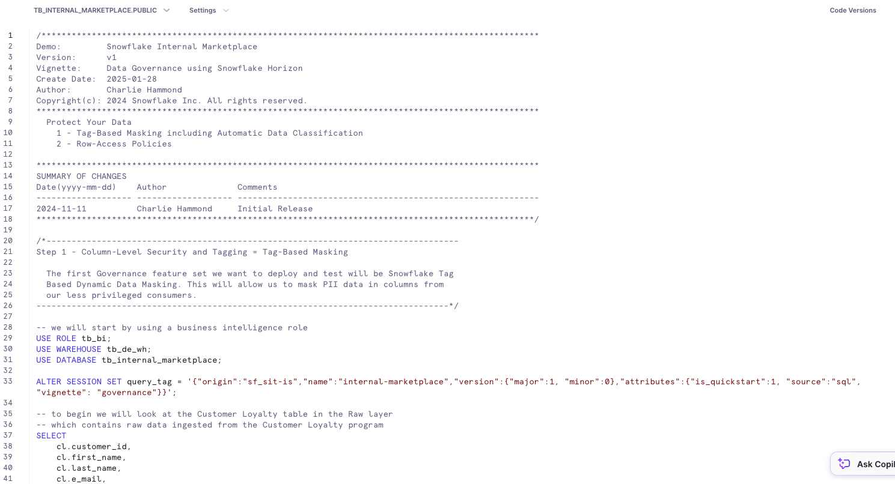
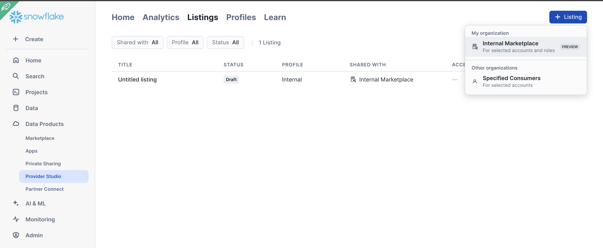
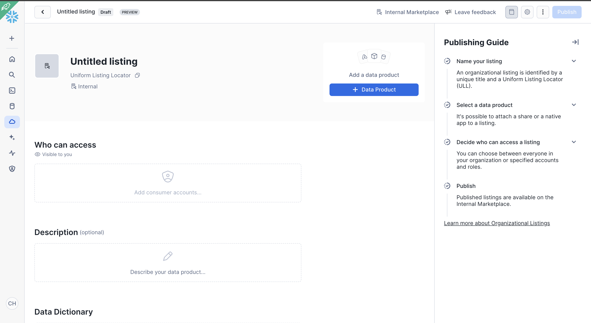
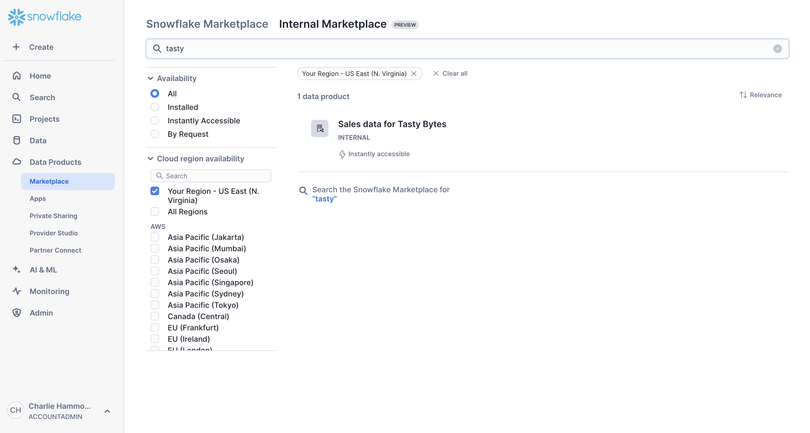
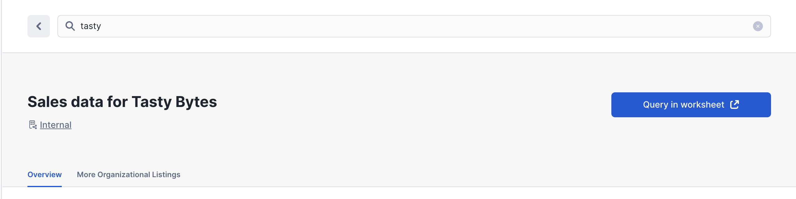

author: Charlie Hammond
id: getting-started-with-internal-marketplace
summary: This is a sample Snowflake Guide
categories: Getting-Started
environments: web
status: Published 
feedback link: https://github.com/Snowflake-Labs/sfguides/issues
tags: Getting Started, Data Science, Data Engineering, Twitter 


# Getting Started with Snowflake Internal Marketplace
<!-- ------------------------ -->
## Overview
Duration: 1

This solution provides a comprehensive guide to get you started using organizational listings on the Snowflake Internal Marketplace. It is divided into three main parts: Snowflake Horizon, Provider Flows, and Consumer Flows. The solution utilizes Tasty Bytes data and shares the governed sales data to another account within the same organization.

### Prerequisites
- Basic understanding of Snowflake
- Access to Snowflake account with ACCOUNTADMIN role
- Access to Snowflake account with [global sharing enabled](https://other-docs.snowflake.com/en/collaboration/provider-listings-auto-fulfillment#allow-accounts-to-set-up-cross-cloud-auto-fulfillment) or access to ORGADMIN role

### What You Will Learn
- How to set up an organizational listing on the internal marketplace
- How to apply data governance to organization listings using Tag-Based Masking and Row-Access Policies
- How to consume data from the internal marketplace

### What You Will Build
- An organizational listing on the internal marketplace
- A governed data sharing setup
- Experience in consuming data from the internal marketplace

<!-- ------------------------ -->

## Creating Snowflake Objects

### Creating Objects, Loading Data, and Joining Data
Duration: 3

Navigate to Worksheets, click "+" in the top-right corner to create a new Worksheet, and choose "SQL Worksheet".

Access the setup script [here](https://github.com/Snowflake-Labs/sfguide-getting-started-with-internal-marketplace/blob/main/scripts/setup.sql). Paste it into Snowsight and run the SQL in the worksheet to create Snowflake objects (database, schema, tables, roles, etc.).



## Governance with Internal Marketplace
Duration: 2

This section guides you through optional governance configuration to ensure data governance is applied to the data being shared internally. The following features are showcased:

1. Database roles for fine-grained access
2. Tag-Based Masking including Automatic Data Classification
3. Row-Access Policies

### SQL
Within Snowsight, walk through [the demo script](https://github.com/Snowflake-Labs/sfguide-getting-started-with-internal-marketplace/blob/main/scripts/vignette-1-governance.sql) within a Snowflake SQL Worksheet.



<!-- ------------------------ -->
## Internal Marketplace - Provider Workflows
Duration: 3

This vignette guides you through setting up an organizational listing on the internal marketplace. You can create this through Snowsight or the SQL script.

### Required Setup

You must run the following command as orgadmin to grant your account access to create global data sharing if it has not been done yet on your account

```sql
USE ROLE orgadmin;
CALL system$enable_global_data_sharing_for_account('<account name>');
```

### SQL

Run the [linked script](https://github.com/Snowflake-Labs/sfguide-getting-started-with-internal-marketplace/blob/main/scripts/vignette-3-consumer.sql) to create the organizational listing

### Snowsight

Use the following steps to create the organization listing from Snowsight. Note the sql setup is required to create fine grained access controls with database roles. 

1. Go to Provider Studio > + Listing > Internal Marketplace

2. Click + Data Product and add TB_INTERNAL_MARKETPLACE.ANALYTICS.CUSTOMER_LOYALTY_METRICS_V. Add a relevant account and description

3. Publish!


<!-- ------------------------ -->
## Internal Marketplace - Consumer Workflows
Duration: 2

Once you have created your internal marketplace listing, you can view it as a consumer. Note: it can take a few minutes for the listing to become available in consumer accounts if you just ran the provider vignette.

### SQL

Once the listing has been added, you can go through [this script](https://github.com/Snowflake-Labs/sfguide-getting-started-with-internal-marketplace/blob/main/scripts/vignette-3-consumer.sql) to query the data from within a consumer account.

### Snowsight

You can discover the internal marketplace listing by doing the following steps

1. Go to Data Products > Marketplace > Internal Marketplace > Search Tasty

2. Click into the listing to discover more information about the listing


<!-- ------------------------ -->
## Conclusion And Resources
Duration: 1

Congratulations! You have successfully set up an organizational listing on the Snowflake Internal Marketplace, applied data governance, and learned how to consume data from the internal marketplace.

### What You Learned
- How to set up an organizational listing on the internal marketplace
- How to apply data governance using Tag-Based Masking and Row-Access Policies
- How to consume data from the internal marketplace

### Related Resources
- [Snowflake Documentation](https://docs.snowflake.com/)
- [Snowflake Internal Marketplace](https://www.snowflake.com/data-marketplace/)
