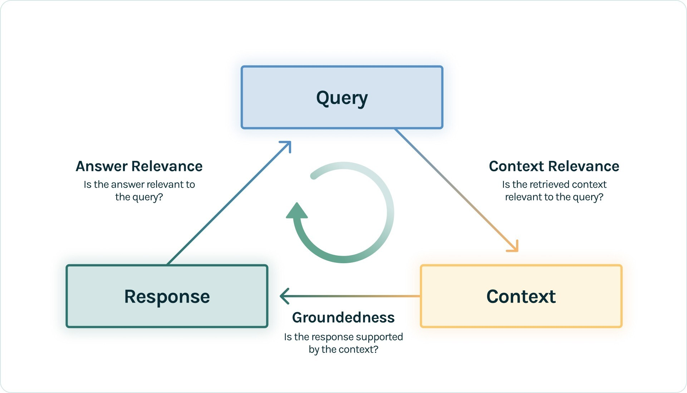
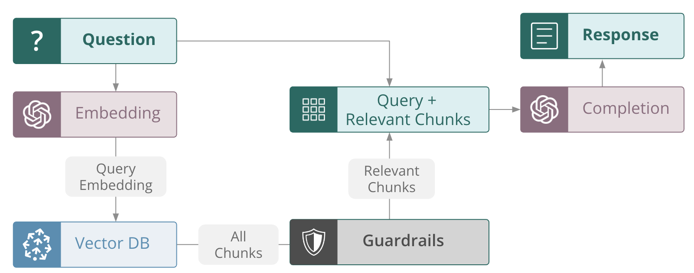

author: Josh Reini
id: getting-started-with-llmops-using-snowflake-cortex-and-trulens
categories: snowflake-site:taxonomy/solution-center/certification/quickstart, snowflake-site:taxonomy/product/ai
language: en
summary: This is a guide for getting started with LLMOps using Snowflake Cortex and TruLens.
environments: web
status: hidden
feedback link: https://github.com/Snowflake-Labs/sfguides/issues


# Getting Started with LLMOps using Snowflake Cortex and TruLens

## Overview

By completing this guide, you'll get started with LLMOps by building a RAG by combining [Cortex LLM Functions](https://docs.snowflake.com/en/user-guide/snowflake-cortex/llm-functions) and [Cortex Search](https://docs.snowflake.com/en/user-guide/snowflake-cortex/cortex-search/cortex-search-overview), and then using [TruLens](https://www.trulens.org/) to add observability and guardrails.

Along the way, you will also learn how run TruLens feedback functions with Snowflake Cortex as the [feedback provider](https://www.trulens.org/reference/trulens/providers/cortex/), and how to [log TruLens traces and evaluation metrics to a Snowflake table](https://www.trulens.org/trulens/tracking/logging/where_to_log/log_in_snowflake/). Last, we'll show how to use [TruLens guardrails](https://www.trulens.org/trulens/guardrails/) for filtering retrieved context and reducing hallucination.

Here is a summary of what you will be able to learn in each step by following this quickstart:

- **Setup Environment**: Create a session to use Snowflake Cortex capabilities.
- **Cortex Complete**: Use Cortex `Complete()` to call Mistral Large.
- **Add Data**: Load and preprocess raw documentation from GitHub, and load to Cortex Search.
- **Search**: Search over the data loaded to Cortex Search.
- **Create a RAG**: Create a RAG with Cortex Search and Complete and add TruLens instrumentation.
- **Feedback Functions**: Add context relevance, groundedness and answer relevance evaluations to the RAG.
- **Application Testing**: Understand the performance of your RAG across a test set.
- **Guardrails**: Add context filter guardrails to reduce hallucinations.
- **Measure Improvement**: See the improved evaluation results after adding guardrails.

### What are Cortex LLM Functions?

Snowflake Cortex gives you instant access to industry-leading large language models (LLMs) trained by researchers at companies like Mistral, Reka, Meta, and Google, including Snowflake Arctic, an open enterprise-grade model developed by Snowflake.

### What is Cortex Search?

Cortex Search enables low-latency, high-quality search over your Snowflake data. Cortex Search powers a broad array of search experiences for Snowflake users including Retrieval Augmented Generation (RAG) applications leveraging Large Language Models (LLMs).

### What is TruLens?

[TruLens](https://www.trulens.org/) is a library for tracking and evaluating Generative AI applications. It provides an extensive set of feedback functions to systematically measure the quality of your LLM based applications. It also traces the internal steps of your application, and allows you to run feedback functions on any internal step. Feedback function results can be examined in a TruLens dashboard, or used at runtime as guardrails.

### What You Will Learn
- How to build a RAG with Cortex Search and Cortex LLM Functions.
- How to use TruLens Feedback Functions and Tracing.
- How to log TruLens Evaluation Results and Traces to Snowflake.
- How to use TruLens Feedback Functions as Guardrails to reduce hallucination.

### What You Will Build
- A retrieval-augmented generation (RAG) app
- An LLMOps pipeline
- Context filter guardrails

### Prerequisites
- A Snowflake account with Cortex LLM Functions and Cortex Search enabled.  If you do not have a Snowflake account, you can register for a [free trial account](https://signup.snowflake.com/?utm_source=snowflake-devrel&utm_medium=developer-guides&utm_cta=developer-guides&_fsi=yYZEVo4S&_fsi=yYZEVo4S).
- A Snowflake account login with ACCOUNTADMIN role. If you have this role in your environment, you may choose to use it. If not, you will need to 1) Register for a free trial, 2) Use a different role that has the ability to create database, schema, tables, stages, tasks, user-defined functions, and stored procedures OR 3) Use an existing database and schema in which you are able to create the mentioned objects.

## Setup Environment


In a new SQL worksheet, run the following SQL commands to create the [warehouse](https://docs.snowflake.com/en/sql-reference/sql/create-warehouse.html), [database](https://docs.snowflake.com/en/sql-reference/sql/create-database.html) and [schema](https://docs.snowflake.com/en/sql-reference/sql/create-schema.html).

```sql
USE ROLE ACCOUNTADMIN;

CREATE OR REPLACE WAREHOUSE LLMOPS_WH_M WAREHOUSE_SIZE=MEDIUM;
CREATE OR REPLACE DATABASE LLMOPS_DB;
CREATE OR REPLACE SCHEMA LLMOPS_SCHEMA;

USE LLMOPS_DB.LLMOPS_SCHEMA;
```

For this quickstart, you will need your Snowflake credentials and a GitHub PAT Token ready. If you don't have a GitHub PAT Token already, you can get one by following the instructions [here](https://docs.github.com/en/authentication/keeping-your-account-and-data-secure/managing-your-personal-access-tokens#creating-a-fine-grained-personal-access-token).

In your development environment, create a new `.env` file that looks like this with your username, password and [account](https://docs.snowflake.com/en/user-guide/admin-account-identifier) filled in:

```bash
# Loading data from github
GITHUB_TOKEN=

# Snowflake details
SNOWFLAKE_USER=
SNOWFLAKE_USER_PASSWORD=
SNOWFLAKE_ACCOUNT=
SNOWFLAKE_DATABASE=LLMOPS_DB
SNOWFLAKE_SCHEMA=LLMOPS_SCHEMA
SNOWFLAKE_WAREHOUSE=LLMOPS_WH_M
SNOWFLAKE_ROLE=ACCOUNTADMIN
SNOWFLAKE_CORTEX_SEARCH_SERVICE=LLMOPS_CORTEX_SEARCH_SERVICE
```

> 
> You will later create a cortex search service with the name ***LLMOPS_CORTEX_SEARCH_SERVICE***. You are welcome to set that now..

Next create a new conda environment and install the packages required with the following commands in your terminal:

```bash
conda create -n getting_started_llmops python=3.11
conda activate getting_started_llmops
conda install -c https://repo.anaconda.com/pkgs/snowflake snowflake-snowpark-python snowflake-ml-python snowflake.core notebook ipykernel

pip install trulens-core trulens-providers-cortex trulens-connectors-snowflake llama-index llama-index-embeddings-huggingface llama-index-readers-github snowflake-sqlalchemy
```

Once we have an environment with the right packages installed, we can load our credentials and set our Snowflake connection in a jupyter notebook notebook.

To open the jupyter notebook, you can follow the following steps:

1) In a terminal window, browse to this folder and run `jupyter notebook` at the command line. (You may also use other tools and IDEs such Visual Studio Code.)

2) Open [snowflake_llmops_quickstart.ipynb](https://github.com/Snowflake-Labs/sfguide-getting-started-with-llmops-using-snowflake-cortex-and-trulens/blob/main/snowflake_llmops_quickstart.ipynb) to download the Notebook from GitHub. ***(NOTE: Do NOT right-click to download.)***

> 
> IMPORTANT: Make sure in the Jupyter notebook the (Python) kernel is set to ***getting_started_llmops*** -- which is the name of the environment created in the previous step.

```python
from dotenv import load_dotenv
from snowflake.snowpark.session import Session
import os

load_dotenv()

connection_params = {
  "account":  os.getenv["SNOWFLAKE_ACCOUNT"],
  "user": os.getenv["SNOWFLAKE_USER"],
  "password": os.getenv["SNOWFLAKE_USER_PASSWORD"],
  "role": os.getenv["SNOWFLAKE_ROLE"],
  "database": os.getenv["SNOWFLAKE_DATABASE"],
  "schema": os.getenv["SNOWFLAKE_SCHEMA"],
  "warehouse": os.getenv["SNOWFLAKE_WAREHOUSE"]
}

snowpark_session = Session.builder.configs(connection_params).create()
```

## Cortex Complete


With the snowpark session set, we have what we need to try out Snowflake Cortex LLM:

```python
from snowflake.cortex import Complete

print(Complete("mistral-large", "how do snowflakes get their unique patterns?"))
```

## Add Data


Next, we'll turn to the retrieval component of our RAG and set up Cortex Search.

This requires three steps:

1. Read and preprocess unstructured documents.
2. Embed the cleaned documents with Arctic Embed.
3. Call the Cortex search service.

### Read and preprocess unstructured documents

For this example, we want to load Cortex Search with documentation from GitHub about a popular open-source library, Streamlit. To do so, we'll use a GitHub data loader available from LlamaHub.

Here we'll also expend some effort to clean up the text so we can get better search results.

```python
from llama_index.readers.github import GithubRepositoryReader, GithubClient
import os
import re
import nest_asyncio

nest_asyncio.apply()

github_token = os.getenv["GITHUB_TOKEN"]
client = GithubClient(github_token=github_token, verbose=False)

reader = GithubRepositoryReader(
    github_client=client,
    owner="streamlit",
    repo="docs",
    use_parser=False,
    verbose=True,
    filter_directories=(
        ["content"],
        GithubRepositoryReader.FilterType.INCLUDE,
    ),
    filter_file_extensions=(
        [".md"],
        GithubRepositoryReader.FilterType.INCLUDE,
    ),
)

documents = reader.load_data(branch="main")


def clean_up_text(content: str) -> str:
    """
    Remove unwanted characters and patterns in text input.

    :param content: Text input.

    :return: Cleaned version of original text input.
    """

    # Fix hyphenated words broken by newline
    content = re.sub(r"(\w+)-\n(\w+)", r"\1\2", content)

    unwanted_patterns = ["---\nvisible: false", "---", "#", "slug:"]
    for pattern in unwanted_patterns:
        content = re.sub(pattern, "", content)

    # Remove all slugs starting with a \ and stopping at the first space
    content = re.sub(r"\\slug: [^\s]*", "", content)

    # normalize whitespace
    content = re.sub(r"\s+", " ", content)
    return content


cleaned_documents = []

for d in documents:
    cleaned_text = clean_up_text(d.text)
    d.text = cleaned_text
    cleaned_documents.append(d)
```

### Process the documents with Semantic Splitting

We'll use Snowflake's Arctic Embed model available from HuggingFace to embed the documents. We'll also use Llama-Index's `SemanticSplitterNodeParser` for processing.

```python
from llama_index.embeddings.huggingface import HuggingFaceEmbedding
from llama_index.core.node_parser import SemanticSplitterNodeParser

embed_model = HuggingFaceEmbedding("Snowflake/snowflake-arctic-embed-m")

splitter = SemanticSplitterNodeParser(
    buffer_size=1, breakpoint_percentile_threshold=85, embed_model=embed_model
)
```

With the embed model and splitter, we can execute them in an ingestion pipeline

```python
from llama_index.core.ingestion import IngestionPipeline

cortex_search_pipeline = IngestionPipeline(
    transformations=[
        splitter,
    ],
)

results = cortex_search_pipeline.run(show_progress=True, documents=cleaned_documents)
```

### Load data to Cortex Search

Now that we've embedded our documents, we're ready to load them to Cortex Search.

Here we can use the same connection details as we set up for Cortex Complete.

```python
import os
import snowflake.connector
from tqdm.auto import tqdm

snowflake_connector = snowflake.connector.connect(**connection_params)

cursor = snowflake_connector.cursor()

cursor.execute("CREATE OR REPLACE TABLE streamlit_docs(doc_text VARCHAR)")
for curr in tqdm(results):
    cursor.execute("INSERT INTO streamlit_docs VALUES (%s)", curr.text)
```

## Search


First we need to create a [Cortex Search](https://docs.snowflake.com/en/user-guide/snowflake-cortex/cortex-search/cortex-search-overview) Service in Snowflake. To do so, you can opena SQL Worksheet in your Snowflake instance, and run the following SQL command:

```sql
CREATE OR REPLACE CORTEX SEARCH SERVICE LLMOPS_CORTEX_SEARCH_SERVICE
  ON doc_text
  WAREHOUSE = LLMOPS_WH_M
  TARGET_LAG = '1 hour'
AS (
  SELECT
      doc_text
  FROM LLMOPS_DB.LLMOPS_SCHEMA.streamlit_docs
);
```

Next, we can go back to our python notebook and create a `CortexSearchRetreiver` class to connect to our cortex search service and add the `retrieve` method that we can leverage for calling it.

```python
import os
from snowflake.core import Root
from typing import List


class CortexSearchRetriever:

    def __init__(self, snowpark_session: Session, limit_to_retrieve: int = 4):
        self._snowpark_session = snowpark_session
        self._limit_to_retrieve = limit_to_retrieve

    def retrieve(self, query: str) -> List[str]:
        root = Root(self._snowpark_session)
        cortex_search_service = (
            root.databases[os.getenv["SNOWFLAKE_DATABASE"]]
            .schemas[os.getenv["SNOWFLAKE_SCHEMA"]]
            .cortex_search_services[os.getenv["SNOWFLAKE_CORTEX_SEARCH_SERVICE"]]
        )
        resp = cortex_search_service.search(
            query=query,
            columns=["doc_text"],
            limit=self._limit_to_retrieve,
        )

        if resp.results:
            return [curr["doc_text"] for curr in resp.results]
        else:
            return []
```

Once the retriever is created, we can test it out. Now that we have grounded access to the Streamlit docs, we can ask questions about using Streamlit, like "How do I launch a streamlit app".

```python
retriever = CortexSearchRetriever(snowpark_session=snowpark_session, limit_to_retrieve=4)

retrieved_context = retriever.retrieve(query="How do I launch a streamlit app?")
```

## Create a RAG


Now that we've set up the components we need from Snowflake Cortex, we can build our RAG.

We'll do this by creating a custom python class with each the methods we need. We'll also add TruLens instrumentation with the `@instrument` decorator to our app.

The first thing we need to do however, is to [set the database connection to Snowflake](https://www.trulens.org/trulens/tracking/logging/where_to_log/log_in_snowflake/) where we'll log the traces and evaluation results from our application. This way we have a stored record that we can use to understand the app's performance. This is done when initializing `Tru`.

```python
from trulens.core import TruSession
from trulens.connectors.snowflake import SnowflakeConnector

tru_snowflake_connector = SnowflakeConnector(snowpark_session=snowpark_session)

tru_session = TruSession(connector=tru_snowflake_connector)
```

Now we can construct the RAG.

```python
from trulens.apps.custom import instrument


class RAG_from_scratch:

    def __init__(self):
        self.retriever = CortexSearchRetriever(snowpark_session=snowpark_session, limit_to_retrieve=4)

    @instrument
    def retrieve_context(self, query: str) -> list:
        """
        Retrieve relevant text from vector store.
        """
        return self.retriever.retrieve(query)

    @instrument
    def generate_completion(self, query: str, context_str: list) -> str:
        """
        Generate answer from context.
        """
        prompt = f"""
          You are an expert assistant extracting information from context provided.
          Answer the question based on the context. Be concise and do not hallucinate.
          If you don´t have the information just say so.
          Context: {context_str}
          Question:
          {query}
          Answer:
        """
        return Complete("mistral-large", prompt)

    @instrument
    def query(self, query: str) -> str:
        context_str = self.retrieve_context(query)
        return self.generate_completion(query, context_str)


rag = RAG_from_scratch()
```

## Feedback Functions


After constructing the RAG, we can set up the feedback functions we want to use to evaluate the RAG.

Here, we'll use the [RAG Triad](https://www.trulens.org/trulens/getting_started/core_concepts/rag_triad/). The RAG triad is made up of 3 evaluations along each edge of the RAG architecture: context relevance, groundedness and answer relevance.



Satisfactory evaluations on each provides us confidence that our LLM app is free from hallucination.

We will also use [LLM-as-a-Judge](https://arxiv.org/abs/2306.05685) evaluations, using Mistral Large on [Snowflake Cortex](https://www.trulens.org/reference/trulens/providers/cortex/) as the LLM.

```python
from trulens.providers.cortex.provider import Cortex
from trulens.core import Feedback
from trulens.core import Select
import numpy as np

provider = Cortex(snowpark_session.connection, "llama3.1-8b")

f_groundedness = (
    Feedback(provider.groundedness_measure_with_cot_reasons, name="Groundedness")
    .on(Select.RecordCalls.retrieve_context.rets[:].collect())
    .on_output()
)

f_context_relevance = (
    Feedback(provider.context_relevance, name="Context Relevance")
    .on_input()
    .on(Select.RecordCalls.retrieve_context.rets[:])
    .aggregate(np.mean)
)

f_answer_relevance = (
    Feedback(provider.relevance, name="Answer Relevance")
    .on_input()
    .on_output()
    .aggregate(np.mean)
)
```

After defining the feedback functions to use, we can just add them to the application along with giving the application an ID.

```python
from trulens.apps.custom import TruCustomApp

tru_rag = TruCustomApp(
    rag,
    app_name="RAG",
    app_version="simple",
    feedbacks=[f_groundedness, f_answer_relevance, f_context_relevance],
    )
)
```

## Application Testing


Now that the application is ready, we can run it on a test set of questions about streamlit to measure its performance.

```python
prompts = [
    "How do I launch a streamlit app?",
    "How can I capture the state of my session in streamlit?",
    "How do I install streamlit?",
    "How do I change the background color of a streamlit app?",
    "What's the advantage of using a streamlit form?",
    "What are some ways I should use checkboxes?",
    "How can I conserve space and hide away content?",
    "Can you recommend some resources for learning Streamlit?",
    "What are some common use cases for Streamlit?",
    "How can I deploy a streamlit app on the cloud?",
    "How do I add a logo to streamlit?",
    "What is the best way to deploy a Streamlit app?",
    "How should I use a streamlit toggle?",
    "How do I add new pages to my streamlit app?",
    "How do I write a dataframe to display in my dashboard?",
    "Can I plot a map in streamlit? If so, how?",
    "How do vector stores enable efficient similarity search?",
]
```

```python
with tru_rag as recording:
    for prompt in prompts:
        rag.query(prompt)

tru_session.get_leaderboard()
```

## Guardrails


In addition to making informed iteration, we can also directly use feedback results as guardrails at inference time. In particular, here we show how to use the context relevance score as a guardrail to filter out irrelevant context before it gets passed to the LLM. This both reduces hallucination and improves efficiency.



To do so, we'll rebuild our RAG using the `@context-filter` decorator on the method we want to filter, and pass in the feedback function and threshold to use for guardrailing.

```python
from trulens.core.guardrails.base import context_filter

# note: feedback function used for guardrail must only return a score, not also reasons
f_context_relevance_score = Feedback(
    provider.context_relevance, name="Context Relevance"
)


class filtered_RAG_from_scratch(RAG_from_scratch):

    @instrument
    @context_filter(f_context_relevance_score, 0.75, keyword_for_prompt="query")
    def retrieve_context(self, query: str) -> list:
        """
        Retrieve relevant text from vector store.
        """
        return self.retriever.retrieve(query)


filtered_rag = filtered_RAG_from_scratch()
```

## Measure Improvement


We can combine the new version of our app with the feedback functions we already defined.

```python
from trulens.apps.custom import TruCustomApp

tru_filtered_rag = TruCustomApp(
    filtered_rag,
    app_name="RAG",
    app_version="filtered",
    feedbacks=[f_groundedness, f_answer_relevance, f_context_relevance],
)
```

Then we run it on a test set of questions about streamlit to measure its performance.

```python
prompts = [
    "How do I launch a streamlit app?",
    "How can I capture the state of my session in streamlit?",
    "How do I install streamlit?",
    "How do I change the background color of a streamlit app?",
    "What's the advantage of using a streamlit form?",
    "What are some ways I should use checkboxes?",
    "How can I conserve space and hide away content?",
    "Can you recommend some resources for learning Streamlit?",
    "What are some common use cases for Streamlit?",
    "How can I deploy a streamlit app on the cloud?",
    "How do I add a logo to streamlit?",
    "What is the best way to deploy a Streamlit app?",
    "How should I use a streamlit toggle?",
    "How do I add new pages to my streamlit app?",
    "How do I write a dataframe to display in my dashboard?",
    "Can I plot a map in streamlit? If so, how?",
    "How do vector stores enable efficient similarity search?",
]
```

Last, we can use `get_leaderboard()` to see the performance of the two application versions head to head.

```python
with tru_rag as recording:
    for prompt in prompts:
        rag.query(prompt)

tru_session.get_leaderboard()
```

## Conclusion And Resources

Congratulations! You've successfully built a RAG by combining Cortex Search and LLM Functions, adding in TruLens Feedback Functions as Observability. You also set up logging for TruLens to Snowflake, and added TruLens Guardrails to reduce hallucination.

### What You Learned

- How to build a RAG with Cortex Search and Cortex LLM Functions.
- How to use TruLens Feedback Functions and Tracing.
- How to log TruLens Evaluation Results and Traces to Snowflake.
- How to use TruLens Feedback Functions as Guardrails to reduce hallucination.

### Related Resources

- [Snowflake Cortex Documentation](https://docs.snowflake.com/en/guides-overview-ai-features)
- [TruLens Documentation](https://trulens.org/)
- [TruLens GitHub Repository](https://github.com/truera/trulens)
