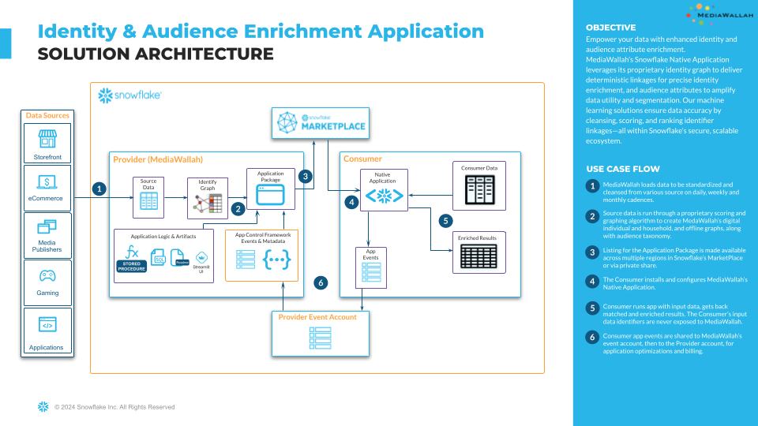

author: Jeffrey Chen
id: getting-started-with-mediawallah-enrichment-native-app
categories: snowflake-site:taxonomy/solution-center/certification/quickstart, snowflake-site:taxonomy/solution-center/certification/partner-solution, snowflake-site:taxonomy/solution-center/includes/architecture, snowflake-site:taxonomy/industry/advertising-media-and-entertainment, snowflake-site:taxonomy/product/applications-and-collaboration
language: en
summary: This is a guide to use MediaWallah's Enrichment Application 
environments: web
status: Published
feedback link: https://github.com/Snowflake-Labs/sfguides/issues


# Getting Started with MediaWallah Enrichment Application
<!-- ------------------------ -->
## Overview

**Note: The Enrichment Application is currently only available on**
`AWS US-EAST-1`
*MediaWallah is working to make this available in other regions*
MediaWallah's Enrichment Data Marketplace listing holds Two Applications. **Matchtest** and **Enrichment**.
**Matchtest** - Allows users to quickly test overlap between consumer's own data with various MediaWallah dataverse without exposure. Providing informed insights on if dataset is worth enrichment.
**Enrichment** - Returns consumer's data linked to MediaWallah's dataverse. Allowing consumers to check for data quality and usability.
Users of the free Enrichment application has a limited version of the Enrichment Application; only returning a percentage of the total for a limited time window.
Please Contact MediaWallah if additional time or trial runs are needed.
Enrichment results are returned in four tables.

### Prerequisites
* [Snowflake Account](https://signup.snowflake.com/?utm_source=snowflake-devrel&utm_medium=developer-guides&utm_cta=developer-guides)
* The provider must accept the Snowflake Marketplace Provider Terms of Service.
* The consumer must accept the Snowflake Marketplace Consumer Terms of Service.
* The consumer must be able to operate ACCOUNTADMIN, SECURITYADMIN roles.

### What You’ll Learn
- How to download the MediaWallah Enrichment Application from Snowflake Data Marketplace
- How to install the application
- How to setup log share with MediaWallah
- How to permission tables for data enrichment
- How to view and access results produced by the application
- How to upgrade or uninstall the application
- How to view the metadata table for privileges and usage rates.

### What You’ll Build
- The requied databases, schemas, warehouse, and role to use MediaWallah's Enrichment Application

### Architecture
<!--  -->


## Installation

### Account Setup (Post-Install)
Create objects and “helper” stored procedures.
The following scripts help streamline the log sharing process and app usage considerably, and can be executed by the consumer before or after the app installation.
Executing the scripts will create everything the consumer needs to use the app, including roles and warehouses.
**NOTE:** The ACCOUNTADMIN and SECURITYADMIN roles are required create the APP_ADMIN_ROLE, which is granted privileges to complete the pre-install setup:
* IMPORT SHARE
* CREATE SHARE
* CREATE DATABASE
* CREATE WAREHOUSE
* CREATE APPLICATION


#### Account Setup
##### This script sets up the Consumer's account to install the Native App
```sql
-------------------------------------------------------------------------------
-- 01_account_setup.sql
-- This script sets up the Consumer''s account to install the Native App
-- Note: it takes some time to switch between ROLEs,
--       wait a few seconds before running the next lines after switching roles.
-------------------------------------------------------------------------------
--get current user
SET APP_USER = CURRENT_USER();

--set parameter for admin role
SET APP_ADMIN_ROLE = 'C_MWEN_APP_ADMIN';

--set parameter for warehouse
SET APP_WH = 'C_MWEN_APP_WH';

--create admin role
USE ROLE SECURITYADMIN;
CREATE ROLE IF NOT EXISTS IDENTIFIER($APP_ADMIN_ROLE) ;
ALTER ROLE IF EXISTS IDENTIFIER($APP_ADMIN_ROLE) SET COMMENT = '{"origin":"sf_ps_wls","name":"acf","version":{"major":1, "minor":3},"attributes":{"role":"consumer","component":"app_admin_role"}}';
GRANT ROLE IDENTIFIER($APP_ADMIN_ROLE) TO ROLE SYSADMIN;
GRANT ROLE IDENTIFIER($APP_ADMIN_ROLE) TO USER IDENTIFIER($APP_USER);

--grant privileges to admin role
USE ROLE ACCOUNTADMIN;
GRANT IMPORT SHARE ON ACCOUNT TO ROLE IDENTIFIER($APP_ADMIN_ROLE);
GRANT CREATE SHARE ON ACCOUNT TO ROLE IDENTIFIER($APP_ADMIN_ROLE);
GRANT MANAGE SHARE TARGET ON ACCOUNT TO ROLE IDENTIFIER($APP_ADMIN_ROLE);
GRANT CREATE DATABASE ON ACCOUNT TO ROLE IDENTIFIER($APP_ADMIN_ROLE);
GRANT CREATE WAREHOUSE ON ACCOUNT TO ROLE IDENTIFIER($APP_ADMIN_ROLE);
GRANT CREATE APPLICATION ON ACCOUNT TO ROLE IDENTIFIER($APP_ADMIN_ROLE);

USE ROLE IDENTIFIER($APP_ADMIN_ROLE);

CREATE OR REPLACE WAREHOUSE IDENTIFIER($APP_WH) WITH WAREHOUSE_SIZE = 'XSMALL'
  WAREHOUSE_TYPE = 'STANDARD'
  AUTO_SUSPEND = 300
  AUTO_RESUME = TRUE
  --MIN_CLUSTER_COUNT = 1
  --MAX_CLUSTER_COUNT = 1
  --SCALING_POLICY = 'STANDARD'
  COMMENT = '{"origin":"sf_ps_wls","name":"acf","version":{"major":1, "minor":3},"attributes":{"role":"consumer","component":"app_warehouse"}}'
;

UNSET (APP_USER, APP_ADMIN_ROLE, APP_WH);
```

#### Create Helper DB
##### This script creates a database that houses the input data for the application and the helper stored procedure.
```sql
-------------------------------------------------------------------------------
-- 02_create_helper_db.sql
-- This script creates a database that houses the input data for the application
-- and the helper stored procedure.
-------------------------------------------------------------------------------
--set parameter for admin role
SET APP_ADMIN_ROLE = 'C_MWEN_APP_ADMIN';

--set parameter for warehouse
SET APP_WH = 'C_MWEN_APP_WH';

--set parameter for helper db
SET HELPER_DB = 'C_MWEN_HELPER_DB';

USE ROLE IDENTIFIER($APP_ADMIN_ROLE);
USE WAREHOUSE IDENTIFIER($APP_WH);

--source data db/schemas
CREATE DATABASE IF NOT EXISTS IDENTIFIER($HELPER_DB);

USE DATABASE IDENTIFIER($HELPER_DB);
CREATE SCHEMA IF NOT EXISTS SOURCE;
CREATE SCHEMA IF NOT EXISTS PRIVATE; --to store wrapper stored procedures

UNSET (APP_ADMIN_ROLE, APP_WH, HELPER_DB);
```

#### Create Create Share Logs Procedure.sql
##### This procedure serves as a wrapper procedure that calls the app's LOG_SHARE_INSERT procedure.  In adddition it makes the necessary grants to the log/metric tables to the app and creates the log share to the Provider.
```sql
-------------------------------------------------------------------------------
-- 03_create_create_log_share_procedure.sql
-- This procedure serves as a wrapper procedure that calls the app\'s LOG_SHARE_INSERT procedure.
-- In adddition it makes the necessary grants to the log/metric tables to the app
-- and creates the log share to the Provider.
-------------------------------------------------------------------------------
--set parameter for admin role
SET APP_ADMIN_ROLE = 'C_MWEN_APP_ADMIN';

--set parameter for warehouse
SET APP_WH = 'C_MWEN_APP_WH';

--set parameter for helper db
SET HELPER_DB = 'C_MWEN_HELPER_DB';

USE ROLE IDENTIFIER($APP_ADMIN_ROLE);
USE WAREHOUSE IDENTIFIER($APP_WH);
USE DATABASE IDENTIFIER($HELPER_DB);

CREATE OR REPLACE PROCEDURE PRIVATE.CREATE_LOG_SHARE(app_name VARCHAR, app_code VARCHAR, provider_locator VARCHAR)
  RETURNS VARCHAR
  LANGUAGE JAVASCRIPT
  COMMENT = '{"origin":"sf_ps_wls","name":"acf","version":{"major":1, "minor":3},"attributes":{"role":"consumer","component":"helper_sproc_create_log_share}}'
  EXECUTE AS CALLER
  AS
  $$

    //get consumer_name
    var rset = snowflake.execute({sqlText: `SELECT consumer_name FROM ${APP_NAME}.UTIL_APP.METADATA_C_V;`});
    rset.next();
    var consumer_name = rset.getColumnValue(1);

    var timeout = 300000; //milliseconds - 5 min timeout

    try {

      snowflake.execute({sqlText:`USE ROLE C_MWEN_APP_ADMIN;`});

      //create app share DB
      snowflake.execute({sqlText:`CREATE OR REPLACE DATABASE MWEN_APP_SHARE;`});

      //create log share schema
      snowflake.execute({sqlText:`CREATE OR REPLACE SCHEMA MWEN_APP_SHARE.logs;`});

      //create logs table
      snowflake.execute({sqlText:`CREATE OR REPLACE TABLE MWEN_APP_SHARE.logs.logs(msg VARIANT, signature BINARY) CHANGE_TRACKING=TRUE COMMENT = '{"origin":"sf_ps_wls","name":"acf","version":{"major":1, "minor":3},"attributes":{"role":"consumer","component":"consumer_log_share"}}';`});

      //create metrics share schema
      snowflake.execute({sqlText:`CREATE OR REPLACE SCHEMA MWEN_APP_SHARE.metrics;`});

      //create metrics table
      snowflake.execute({sqlText:`CREATE OR REPLACE TABLE MWEN_APP_SHARE.metrics.metrics(msg VARIANT, signature BINARY) CHANGE_TRACKING=TRUE COMMENT = '{"origin":"sf_ps_wls","name":"acf","version":{"major":1, "minor":3},"attributes":{"role":"consumer","component":"consumer_log_share"}}';`});

      //grant privileges on logs/metrics to application
      snowflake.execute({sqlText:`GRANT USAGE ON DATABASE MWEN_APP_SHARE TO APPLICATION ${APP_NAME};`});
      snowflake.execute({sqlText:`GRANT USAGE ON SCHEMA MWEN_APP_SHARE.LOGS TO APPLICATION ${APP_NAME};`});
      snowflake.execute({sqlText:`GRANT USAGE ON SCHEMA MWEN_APP_SHARE.METRICS TO APPLICATION ${APP_NAME};`});
      snowflake.execute({sqlText:`GRANT SELECT, INSERT, UPDATE ON TABLE MWEN_APP_SHARE.LOGS.LOGS TO APPLICATION ${APP_NAME};`});
      snowflake.execute({sqlText:`GRANT SELECT, INSERT, UPDATE ON TABLE MWEN_APP_SHARE.METRICS.METRICS TO APPLICATION ${APP_NAME};`});

      //call provider log_share_insert SP to insert installation logs
      var rset = snowflake.execute({sqlText:`CALL ${APP_NAME}.PROCS_APP.LOG_SHARE_INSERT('${PROVIDER_LOCATOR}', '${APP_CODE}');`});
      rset.next();
      var provision_results = rset.getColumnValue(1);

      //create share
      snowflake.execute({sqlText:`CREATE SHARE IF NOT EXISTS MWEN_${consumer_name}_APP_SHARE COMMENT = '{"origin":"sf_ps_wls","name":"acf","version":{"major":1, "minor":3},"attributes":{"role":"consumer","component":"consumer_log_share"}}';`});

      //grant privileges on logs table to share
      snowflake.execute({sqlText:`GRANT USAGE ON DATABASE MWEN_APP_SHARE TO SHARE MWEN_${consumer_name}_APP_SHARE;`});

      snowflake.execute({sqlText:`GRANT USAGE ON SCHEMA MWEN_APP_SHARE.logs TO SHARE MWEN_${consumer_name}_APP_SHARE;`});
      snowflake.execute({sqlText:`GRANT SELECT ON TABLE MWEN_APP_SHARE.logs.logs TO SHARE MWEN_${consumer_name}_APP_SHARE;`});

      snowflake.execute({sqlText:`GRANT USAGE ON SCHEMA MWEN_APP_SHARE.metrics TO SHARE MWEN_${consumer_name}_APP_SHARE;`});
      snowflake.execute({sqlText:`GRANT SELECT ON TABLE MWEN_APP_SHARE.metrics.metrics TO SHARE MWEN_${consumer_name}_APP_SHARE;`});

      //share logs with provider
      snowflake.execute({sqlText:`ALTER SHARE MWEN_${consumer_name}_APP_SHARE ADD ACCOUNTS=${PROVIDER_LOCATOR};`});


      //current date
      const date = Date.now();
      var currentDate = null;

      //poll metadata_c_v view until consumer is enabled, or timeout is reached
      do {
          currentDate = Date.now();
          var rset = snowflake.execute({sqlText:`SELECT value FROM ${APP_NAME}.UTIL_APP.METADATA_C_V WHERE UPPER(key) = 'ENABLED' AND UPPER(value) = 'Y';`});
      } while ((rset.getRowCount() == 0) && (currentDate - date < timeout));

      //if the timeout is reached, disable consumer and return
      while (currentDate - date >= timeout){
        return `WARNING:  Consumer has not been enabled yet. Continue to monitor the METADATA_C_V view and contact Provider for more details.`;
      }

      return 'Consumer is now enabled';
    } catch (err) {
      var result = `
      Failed: Code: `+err.code + `
      State: `+err.state+`
      Message: `+err.message+`
      Stack Trace:`+ err.stack;

      return `Error: ${result}`;
  }
  $$
  ;

UNSET (APP_ADMIN_ROLE, APP_WH, HELPER_DB);
```

#### Create Generate Request Procedure
##### This procedure serves as a wrapper procedure that calls the app's REQUEST stored procedure, passing in a parameters object that includes the input table (if applicable), the app procedure to call, the procedure parameters, and the results table (if applicable)
```sql
-------------------------------------------------------------------------------
-- 04_create_generate_request_procedure.sql
-- This procedure serves as a wrapper procedure that calls the app\'s REQUEST stored procedure,
-- passing in a parameters object that includes the input table (if applicable),
-- the app procedure to call, the procedure parameters, and the results table (if applicable)
-------------------------------------------------------------------------------
--set parameter for admin role
SET APP_ADMIN_ROLE = 'C_MWEN_APP_ADMIN';

--set parameter for warehouse
SET APP_WH = 'C_MWEN_APP_WH';

--set parameter for helper db
SET HELPER_DB = 'C_MWEN_HELPER_DB';

USE ROLE IDENTIFIER($APP_ADMIN_ROLE);
USE WAREHOUSE IDENTIFIER($APP_WH);
USE DATABASE IDENTIFIER($HELPER_DB);

CREATE OR REPLACE PROCEDURE PRIVATE.GENERATE_REQUEST(app_name VARCHAR, app_code VARCHAR, parameters VARCHAR)
  RETURNS VARCHAR
  LANGUAGE JAVASCRIPT
  COMMENT = '{"origin":"sf_ps_wls","name":"acf","version":{"major":1, "minor":3},"attributes":{"role":"consumer","component":"helper_sproc_generate_request"}}'
  EXECUTE AS CALLER
  AS
  $$

    try {
      var PARAMETERS_JSON = JSON.parse(PARAMETERS);
      //clean up input_table_name and results_table_name and append to inner parameters object
      PARAMETERS_JSON.input_table = PARAMETERS_JSON.input_table.replace(/"/g, "");
      PARAMETERS_JSON.results_table = PARAMETERS_JSON.results_table.replace(/"/g, "");
      PARAMETERS_JSON.proc_parameters[0].input_table_name = PARAMETERS_JSON.input_table;
      PARAMETERS_JSON.proc_parameters[0].results_table_name = PARAMETERS_JSON.results_table;

      //update PARAMETERS string
      PARAMETERS = JSON.stringify(PARAMETERS_JSON).replace(/\'/g, "\\'");

      let { input_table } = PARAMETERS_JSON;

      snowflake.execute({sqlText:`USE ROLE C_MWEN_APP_ADMIN;`});

      if(input_table) {

        //grant privs to source database, schema, and table to application
        const [src_db, src_sch, src_tbl] = input_table.split(".");

        snowflake.execute({sqlText:`GRANT USAGE ON DATABASE ${src_db} TO APPLICATION ${APP_NAME};`});
        snowflake.execute({sqlText:`GRANT USAGE ON SCHEMA ${src_db}.${src_sch} TO APPLICATION ${APP_NAME};`});
        snowflake.execute({sqlText:`GRANT SELECT ON TABLE ${src_db}.${src_sch}.${src_tbl} TO APPLICATION ${APP_NAME};`});
      }

      //if the application can write results outside of its DB, provide grants here:  FEATURE NOT ENABLED YET
      //TODO:  add a field called RESULTS_LOCATION to specify db.sch where results should reside, if desired.
      //snowflake.execute({sqlText:`GRANT USAGE,CREATE TABLE ON SCHEMA C_MWEN_HELPER_DB.RESULTS TO APPLICATION ${APP_NAME};`});


      //call the app REQUST sproc
      var rset = snowflake.execute({sqlText:`CALL ${APP_NAME}.PROCS_APP.REQUEST('MWEN', '${PARAMETERS}');`});
      rset.next();
      var response_json = JSON.parse(rset.getColumnValue(1));

      return `${response_json.state}: ${response_json.message}`;
    } catch (err) {
      var result = `
      failed: Code: `+err.code + `
      state: `+err.state+`
      message: `+err.message+`
      stackTrace:`+err.stackTrace || err.stack;

      return `Error: ${result}`;
  }
  $$
  ;

UNSET (APP_ADMIN_ROLE, APP_WH, HELPER_DB);
```

#### Create Uninstall Procedure
##### This procedure serves as a wrapper procedure that uninstalls the Provider's app and removes
```sql
-------------------------------------------------------------------------------
-- 05_create_uninstall_procedure.sql
-- This procedure serves as a wrapper procedure that uninstalls the Provider\'s app and removes
-------------------------------------------------------------------------------
--set parameter for admin role
SET APP_ADMIN_ROLE = 'C_MWEN_APP_ADMIN';

--set parameter for warehouse
SET APP_WH = 'C_MWEN_APP_WH';

--set parameter for helper db
SET HELPER_DB = 'C_MWEN_HELPER_DB';

USE ROLE IDENTIFIER($APP_ADMIN_ROLE);
USE WAREHOUSE IDENTIFIER($APP_WH);
USE DATABASE IDENTIFIER($HELPER_DB);

CREATE OR REPLACE PROCEDURE PRIVATE.UNINSTALL(app_name VARCHAR)
  RETURNS VARCHAR
  LANGUAGE JAVASCRIPT
  COMMENT = '{"origin":"sf_ps_wls","name":"acf","version":{"major":1, "minor":3},"attributes":{"role":"consumer","component":"helper_sproc_app_uninstall"}}'
  EXECUTE AS CALLER
  AS
  $$

  try {
    //drop all existing outbound shares to the Provider account
    snowflake.execute({sqlText: `SHOW SHARES LIKE '%MWEN_%_APP_SHARE%'`});
    snowflake.execute({sqlText: `CREATE OR REPLACE TEMPORARY TABLE C_MWEN_HELPER_DB.PRIVATE.OUTBOUND_SHARES AS SELECT "name" FROM TABLE(RESULT_SCAN(LAST_QUERY_ID())) WHERE "owner" = 'C_MWEN_APP_ADMIN' AND "kind" = 'OUTBOUND';`});

    var rset = snowflake.execute({sqlText: `SELECT * FROM C_MWEN_HELPER_DB.PRIVATE.OUTBOUND_SHARES;`});
    while(rset.next()){
      var full_share_name = rset.getColumnValue(1);
      full_share_name_arr = full_share_name.split(".");
      share_name = full_share_name_arr[2];

      snowflake.execute({sqlText:`DROP SHARE IF EXISTS ${full_share_name};`});
      snowflake.execute({sqlText:`DROP SHARE IF EXISTS ${full_share_name};`});
    }

    //drop log database
    snowflake.execute({sqlText: `DROP DATABASE IF EXISTS MWEN_APP_SHARE;`});

    //drop application
    snowflake.execute({sqlText: `DROP APPLICATION IF EXISTS ${APP_NAME};`});

    return `App: ${APP_NAME} removed.`;

  } catch (err) {
    var result = `
    Failed: Code: `+err.code + `
    State: `+err.state+`
    Message: `+err.message+`
    Stack Trace:`+err.stack;

    return `Error: ${result}`;
    }
$$
;

UNSET (APP_ADMIN_ROLE, APP_WH, HELPER_DB);
```

#### Grant Application Role
##### This grants the application role to a specific user of the application if one was not granted on installation
```sql
-------------------------------------------------------------------------------
-- 06_grant_application_role.sql
-- This grants the application role to a specific user of the application if one was not granted on installation
-------------------------------------------------------------------------------
USE ROLE ACCOUNTADMIN;
SHOW APPLICATIONS;

SET APP_OWNER = (SELECT "owner" FROM TABLE(RESULT_SCAN(LAST_QUERY_ID())) WHERE UPPER("name") = 'MEDIAWALLAH_ENRICHMENT_APP');

USE ROLE IDENTIFIER($APP_OWNER);

GRANT APPLICATION ROLE MEDIAWALLAH_ENRICHMENT_APP.APP_ROLE TO ROLE C_MWEN_APP_ADMIN;
```

<!-- ------------------------ -->
## Verify Installation

Once the app is installed, the consumer should verify installation by querying the METADATA_C_V view. If the table’s headers are visible then the consumer can continue to Onboarding.
**Example:**
```sql
------------------------ Step 02: Verify Installation ------------------------
USE ROLE C_MWEN_APP_ADMIN;
USE WAREHOUSE C_MWEN_APP_WH;
SELECT * FROM MEDIAWALLAH_ENRICHMENT_APP.UTIL_APP.METADATA_C_V;
-- NOTE: should see metadata table headers
```

<!-- ------------------------ -->
## Onboarding

To be onboarded the consumer must send their CURRENT_ORGANIZATION_NAME, CURRENT_ACCOUNT, and CURRENT_ACCOUNT_NAME to operations@mediawallah.com; with the subject line “Native App Onboarding Request: MediaWallah MEDIAWALLAH_ENRICHMENT_APP App".
These details can be found using the following queries:

```sql
------------------------ Step 03.a: Onboarding ------------------------
SELECT CURRENT_ORGANIZATION_NAME();
SELECT CURRENT_ACCOUNT();
SELECT CURRENT_ACCOUNT_NAME();
```
Onboarding typically will occur on the day of the request, however, please allow up to 2 business days.
Once onboarded, the consumer should see metadata entries when querying the METADATA_C_V view.
**Example:**
```sql
------------------------ Step 03.b: Onboarding ------------------------
USE ROLE C_MWEN_APP_ADMIN;
USE WAREHOUSE C_MWEN_APP_WH;
SELECT * FROM MEDIAWALLAH_ENRICHMENT_APP.UTIL_APP.METADATA_C_V;
-- NOTE: should see metadata table with entries
```

<!-- ------------------------ -->
## Log/Metric Sharing

After being successfully Onboarded, the consumer uses the **C_MWEN_APP_ADMIN** role to call the CREATE_LOG_SHARE helper stored procedure. This procedure creates the necessary database, tables, and share to store the logs and metrics tables and enable MediaWallah to access them.
**Example:**
```sql
------------------------ Step 04: Log/Metric Sharing ------------------------
USE ROLE C_MWEN_APP_ADMIN;
USE WAREHOUSE C_MWEN_APP_WH;
CALL C_MWEN_HELPER_DB.PRIVATE.CREATE_LOG_SHARE(
  'MEDIAWALLAH_ENRICHMENT_APP'
 ,'MWEN'
 ,'MEDIAWALLAH'
);
```

<!-- ------------------------ -->
## Enablement

The consumer will be automatically enabled once the log share is verified by the application (this process takes about two minutes). Query the METADATA_C_V table to check for successful enablement:
**Example:**
```sql
------------------------ Step 05: Enablement ------------------------
SELECT *
FROM MEDIAWALLAH_ENRICHMENT_APP.UTIL_APP.METADATA_C_V
WHERE KEY = 'enabled'
;
-- NOTE: should see metadata key/value pairs, along with enabled = 'Y'
```

<!-- ------------------------ -->
## Granting Application Access to the Consumer's Dataset(s)

### Granting Access to the Consumer’s Dataset(s)
The application will need access to the consumer's dataset; **Either directly to the table or a view of the table.**


**Example:** Granting access to the a consumer's dataset `[CONSUMER_DB].[CONSUMER_SCH].[CONSUMER_TBL]` owned by `SYSADMIN` role to the **C_MWEN\_APP_ADMIN** role.
(Replace placeholders accordingly)
```sql
-- Below is the code with all the database, schema, and table names that need to be replaced in brackets
-- use the role that has ownership of the source data table
USE ROLE SYSADMIN;
-- grant privileges to source data
GRANT USAGE ON DATABASE [CONSUMER_DB] TO ROLE C_MWEN_APP_ADMIN;
GRANT USAGE ON SCHEMA [CONSUMER_DB].[CONSUMER_SCH] TO ROLE C_MWEN_APP_ADMIN;
GRANT SELECT ON TABLE [CONSUMER_DB].[CONSUMER_SCH].[CONSUMER_TBL] TO ROLE C_MWEN_APP_ADMIN;
-- Now the Table [CONSUMER_DB].[CONSUMER_SCH].[CONSUMER_TBL] can be used by the Application!

-- Creating a view of source dataset table in C_MWEN_HELPER_DB.SOURCE schema
USE ROLE C_MWEN_APP_ADMIN;
CREATE OR REPLACE VIEW C_MWEN_HELPER_DB.SOURCE.[CONSUMER_VIEW] AS
  SELECT * FROM [CONSUMER_DB].[CONSUMER_SCH].[CONSUMER_TBL];
```


<!-- ------------------------ -->
## Generating Requests

Once enabled, the consumer can call the GENERATE_REQUEST helper stored procedure to use any of the consumer’s allowed stored procs. Data will be generated into the MEDIAWALLAH_ENRICHMENT_APP.RESULTS_APP schema. View [Results Guide](https://nativeapps.mediawallah.com/MEDIAWALLAH_ENRICHMENT_APP/MWEN%20-%20Results%20Guide.pdf) for a detailed explanation of the generated data.
Optimal warehouse sizing will depend on consumer input dateset dimensions. MediaWallah maintains an average run times based on historical runs in a Warehouse Sizing Doc, ask for details.
**For a detailed explanation of the parameters used in GENERATE_REQUEST, see next section**


**Matchtest Example:**
```sql
------------------------ Generating Request: Matchtest Example ------------------------
USE ROLE C_MWEN_APP_ADMIN;
USE WAREHOUSE C_MWEN_APP_WH;
ALTER WAREHOUSE C_MWEN_APP_WH
SET WAREHOUSE_SIZE = "2X-LARGE" WAIT_FOR_COMPLETION = TRUE;

-- NOTE: execution time is determined by warehouse size, and is
-- controlled by the consumer.
CALL C_MWEN_HELPER_DB.PRIVATE.GENERATE_REQUEST(
  'MEDIAWALLAH_ENRICHMENT_APP'
 ,'MWEN'
 ,$${
    "input_table": "C_MWEN_HELPER_DB.SOURCE.[CONSUMER_TBL]",
    "proc_name": "matchtest",
    "proc_parameters": [{
      "app_code": "MWEN",
      "primary_key": "EMAIL_ADD_MD5",
      "primary_key_type": "MD5_HASH"
      "return_types": "DEVICE_ID,IP_ADDRESS"
    }],
    "results_table": "MEDIAWALLAH_ENRICHMENT_APP.RESULTS_APP.[OUTPUT_TABLE_NAME]"
  }$$
);
-- NOTE: third argument in the GENERATE_REQUEST SP string quoted in $$
-- NOTE: if [OUTPUT_TABLE_NAME] already exists, this will overwrite the data
```

**Enrichment Example:**
```sql
------------------------ Generating Request: Enrichment Example ------------------------
USE ROLE C_MWEN_APP_ADMIN;
USE WAREHOUSE C_MWEN_APP_WH;
ALTER WAREHOUSE C_MWEN_APP_WH
SET WAREHOUSE_SIZE = "2X-LARGE" WAIT_FOR_COMPLETION = TRUE;

-- NOTE: execution time is determined by warehouse size, and is
-- controlled by the consumer.
CALL C_MWEN_HELPER_DB.PRIVATE.GENERATE_REQUEST(
  'MEDIAWALLAH_ENRICHMENT_APP'
 ,'MWEN'
 ,$${
    "input_table": "C_MWEN_HELPER_DB.SOURCE.[CONSUMER_VIEW]",
    "proc_name": "enrichment",
    "proc_parameters": [{
      "app_code": "MWEN",
      "primary_key": "EMAIL_ADD_MD5",
      "primary_key_type": "MD5_HASH",
      "return_types": "DEVICE_ID,IP_ADDRESS"
    }],
    "results_table": "MEDIAWALLAH_ENRICHMENT_APP.RESULTS_APP.[OUTPUT_TABLE_NAME]"
  }$$
);
-- NOTE: third argument in the GENERATE_REQUEST SP string quoted in $$
-- NOTE: if [OUTPUT_TABLE_NAME] already exists, this will overwrite the data
```


<!-- ------------------------ -->
## Parameters Description

##### JSON Parameters Description
```markdown
|------------------|----------------------------------------------------|
| param            | description                                        |
|==================|====================================================|
| input_table      | the consumers input table name; must be granted to |
|                  |  **C_MWEN_APP_ADMIN** role                 |
| proc_name        | name of approved application consumer has access to|
|                  |  (such as matchtest or enrichment)                 |
| proc_parameters  | stringified json object containing parameters used |
|                  |  in the approved proc_name                         |
| results_table    | output location of the application; application    |
|                  |  appends the proc_name to the final table name     |
|                  |                                                    |
|                  | **matchtest:** will produce one reporting table    |
|                  |  for requested/allowed return_types return_types:  |
|                  |    MEDIAWALLAH_ENRICHMENT_APP                          |
|                  |      .RESULTS_APP.[OUTPUT_TABLE_NAME]_REPORT       |
|                  |                                                    |
|                  | **enrichment:** will produce multiple tables       |
|                  |  depending on requested/allowed return_types,      |
|                  |  as well as and a reporting table                  |
|                  |    MEDIAWALLAH_ENRICHMENT_APP                          |
|                  |      .RESULTS_APP                                  |
|                  |      .[OUTPUT_TABLE_NAME]_CLIENT_ENRICHMENT        |
|                  |        > Contains an App Resolutiuon ID connected  |
|                  |          to the consumer input_table data. This is |
|                  |          used to join return_types data            |
|                  |      .[OUTPUT_TABLE_NAME]_DIGITAL_ENRICHMENT       |
|                  |        > Contains an ARID to connect to requested  |
|                  |          return_types if applicable                |
|                  |      .[OUTPUT_TABLE_NAME]_PII_ENRICHMENT           |
|                  |        > Contains an ARID to connect to requested  |
|                  |          return_types if applicable                |
|                  |      .[OUTPUT_TABLE_NAME]_AUDIENCE_ENRICHMENT      |
|                  |        > Contains an ARID to connect to requested  |
|                  |          return_types if applicable                |
|                  |      .[OUTPUT_TABLE_NAME]_REPORT                   |
| app_code         | the abbreviated codename of the MediaWallah app    |
| primary_key      | the name of the column in the input_table dataset, |
|                  |  that the consumer would like to match to          |
|                  |  MediaWallah identity graph data                   |
| primary_key_type | the type of the match_key, matching MediaWallah    |
|                  |  available match key types (see below)             |
| return_types     | the type of the return ids or audience consumer    |
|                  |  wishes to get matchtest or enrichment against     |
|                  |  (see below)                                       |
|------------------|----------------------------------------------------|
```
**note**: During Enrichment Trial users only recieve a percentage of the total data, complete data is shared in full application

<!-- ------------------------ -->
## Match Key Type

##### Available options for match_key_type:
*note*: allowed match_key_types may vary due to contract
```markdown
|-----------------|-----------------------------------------------------|
| match_key_types | description                                         |
|=================|=====================================================|
| DEVICE_ID       | Mobile Advertising ID such as IDFA, or AAID, or IDFV|
| UBID            | MediaWallah Cookie                                  |
| CTV_ID          | Connected TV such as Roku, fire                     |
| IP_ADDRESS      | IPV4                                                |
| MD5_HASH        | Hashed email using MD5 algorithm                    |
| SHA1_HASH       | Hashed email using SHA1 algorithm                   |
| SHA256_HASH     | Hashed email using SHA256 algorithm                 |
| EMAIL           | Plain Text Email                                    |
| ADDRESS         | Contactnate ADDRESS_1, ADDRESS_2, CITY, STATE, ZIP5 |
| PHONE           | Standarization of phone number as varchar E. 164    |
| APN             | AppNexus                                            |
| TTD             | The Trade Desk                                      |
| CRT             | Criteo                                              |
| ADB             | Adobe                                               |
| LTM             | Lotame                                              |
| BWX             | BeesWax                                             |
| NLS             | Nielsen                                             |
| EYE             | Eyeota                                              |
| PUB             | Pubmatic                                            |
| MMA             | MediaMath                                           |
| SOV             | Sovrn                                               |
|-----------------|-----------------------------------------------------|
```
**note**: Plain text emails should be lowered and white spaced removed before Hashing

<!-- ------------------------ -->
## Return Type

##### Available options for return_types:
*note*: allowed return_types may vary due to contract
```markdown
|-----------------|-----------------------------------------------------|
| DIGITAL         | description                                         |
|=================|=====================================================|
| DEVICE_ID       | Mobile Advertising ID such as IDFA, or AAID, or IDFV|
| UBID            | MediaWallah Cookie                                  |
| CTV_ID          | Connected TV such as Roku, fire                     |
| IP_ADDRESS      | IPV4                                                |
| MD5_HASH        | Hashed email using MD5 algorithm                    |
| SHA1_HASH       | Hashed email using SHA1 algorithm                   |
| SHA256_HASH     | Hashed email using SHA256 algorithm                 |
| APN             | AppNexus                                            |
| TTD             | The Trade Desk                                      |
| CRT             | Criteo                                              |
| ADB             | Adobe                                               |
| LTM             | Lotame                                              |
| BWX             | BeesWax                                             |
| NLS             | Nielsen                                             |
| EYE             | Eyeota                                              |
| PUB             | Pubmatic                                            |
| MMA             | MediaMath                                           |
| SOV             | Sovrn                                               |
|-----------------|-----------------------------------------------------|
```
```markdown
|-----------------|-----------------------------------------------------|
| PII             | description                                         |
|=================|=====================================================|
| EMAIL           | Plain Text Email                                    |
| ADDRESS         | Contactnate ADDRESS_1, ADDRESS_2, CITY, STATE, ZIP5 |
| PHONE           | Standarization of phone number as varchar E. 164    |
|-----------------|-----------------------------------------------------|
```
```markdown
|---------------------------|-------------------------------------------|
| DEMO                      | description                               |
|===========================|===========================================|
| DEMO_GENDER               | Gender                                    |
| DEMO_AGE_BRACKET          | Age                                       |
| DEMO_INCOME_BRACKET       | Estimated Income Bracket                  |
| DEMO_NET_WORTH            | Estimated Networth                        |
| DEMO_HOMEOWNER            | Boolean if user is homeowner or not       |
| DEMO_MARRIED              | Boolean if user is married or not         |
| DEMO_CHILDREN             | Boolean if user has children or not       |
|---------------------------|-------------------------------------------|
| B2B_COMPANY_EMPLOYEE_COUNT| Estimated company size user belongs to    |
| B2B_DEPARTMENT            | Department user works for                 |
| B2B_JOB_TITLE             | Current Job title of user                 |
| B2B_SENIORITY_LEVEL       | Current job level                         |
| B2B_PRIMARY_INDUSTRY      | Industry user works at                    |
| B2B_COMPANY_REVENUE       | Estimated company revenue user works for  |
|---------------------------|-------------------------------------------|
| PURCHASE_PRODUCT          | product purchased by the user in the last |
|                           |   3 months                                |
| PURCHASE_BRAND            | brand of product purchased by the user in |
|                           |   last 3 months                           |
| PURCHASE_SEGMENT          | segment category associated with product  |
|                           |   purchased by the user in last 3 months  |
|---------------------------|-------------------------------------------|
| LOCATION_STATE            | location based on user residence          |
|---------------------------|-------------------------------------------|
```
**Note**: Plain text emails should be lowered and white spaced removed before Hashing

<!-- ------------------------ -->
## Viewing Results
#### View Results
Depending on which application (aka proc_name) used, the GENERATE_REQUEST procedure will generate different outputs based on the RESULTS_TABLE.
**Matchtest**
```sql
-- MATCHTEST REPORT
SELECT *
FROM MEDIAWALLAH_ENRICHMENT_APP.RESULTS_APP.[OUTPUT_TABLE_NAME]_REPORT
ORDER BY BUCKET_TYPE, MATCHED_DATA_TYPE
;
```

**Enrichment**
```sql
-- ENRICHMENT RESULTS
SELECT *
FROM MEDIAWALLAH_ENRICHMENT_APP.RESULTS_APP.[OUTPUT_TABLE_NAME]_CLIENT_ENRICHMENT
LIMIT 100
;

SELECT *
FROM MEDIAWALLAH_ENRICHMENT_APP.RESULTS_APP.[OUTPUT_TABLE_NAME]_DIGITAL_ENRICHMENT
LIMIT 100
;

SELECT *
FROM MEDIAWALLAH_ENRICHMENT_APP.RESULTS_APP.[OUTPUT_TABLE_NAME]_PII_ENRICHMENT
LIMIT 100
;

SELECT *
FROM MEDIAWALLAH_ENRICHMENT_APP.RESULTS_APP.[OUTPUT_TABLE_NAME]_AUDIENCE_ENRICHMENT
LIMIT 100
;

-- ENRICHMENT REPORT
SELECT *
FROM MEDIAWALLAH_ENRICHMENT_APP.RESULTS_APP.[OUTPUT_TABLE_NAME]_REPORT
ORDER BY BUCKET_TYPE, MATCHED_DATA_TYPE
;
```
<!-- ------------------------ -->
## Using ARID

An ARID (App Resolution Identifier) is the primary key generated per run of the application, used to join the original data with enriched digital data, enriched offline data and/or enriched audience segment data.
**Example joining Data**
```sql
SELECT c.*, e.ID_VALUE, e.ID_TYPE
FROM MEDIAWALLAH_ENRICHMENT_APP.RESULTS_APP.[RESULTS_TABLE_NAME]_ENRICHMENT c
JOIN MEDIAWALLAH_ENRICHMENT_APP.RESULTS_APP.[RESULTS_TABLE_NAME]_ENRICHMENT e
ON (
    c.ARID = e.ARID
AND e.ID_TYPE = 'MD5_HASH'
)
;
```

**Example joining audience with taxonomy**
```sql
SELECT a.ARID, t.SEGMENT, t.SEGMENT_VALUE, a.ID_VALUE, a.ID_SUMMARY_TYPE, a.ID_TYPE, a.TIER, a.MATCH_KEY
FROM (
    SELECT e.ARID, s1.VALUE::varchar AS ID_VALUE, e.ID_SUMMARY_TYPE, e.ID_TYPE, e.TIER, e.MATCH_KEY
    FROM MEDIAWALLAH_ENRICHMENT_APP.RESULTS_APP.[RESULTS_TABLE_NAME]_AUDIENCE_ENRICHMENT e
    ,TABLE(FLATTEN(e.ID_VALUE, OUTER=> TRUE)) s1
) a
JOIN MEDIAWALLAH_ENRICHMENT_APP.UTIL_APP.TAXONOMY_C_V t
ON (
  a.ID_VALUE = t.SEGMENT_VALUE_ID
)
;
```

<!-- ------------------------ -->
## Metadata (Reference)
#### Metadata (Reference)
```markdown
SELECT * FROM MEDIAWALLAH_ENRICHMENT_APP.UTIL_APP.METADATA_C_V
```

```markdown
|----------------------------------|------------------------------------|
| DEMO                             | description                        |
|==================================|====================================|
| allowed_procs                    | procedures consumer has access to  |
| allowed_funcs                    | functions consumer has access to   |
| enabled                          | if is able to use the application  |
| install_count                    | number of times app is installed   |
| total_requests                   | number of request made to app      |
| total_records_processed          | total records processed by app     |
| total_distinct_match_keys        | total match_keys sent to app       |
| total_distinct_matched_match_keys| total match_keys matched by app    |
| total_returned_rows              | total rows returned by app         |
| total_returned_records           | total records returned by app      |
| total_returned_pairs             | total pairs returned by app        |
| allowed_return_types             | return_types available to consumer |
| allowed_match_key_types          | match_key_types available          |
| subscription_mode                | trial or paid                      |
| trial_expiration_timestamp       | when trial expires                 |
| trial_request_limit              | # request allowed during trial     |
| trial_record_limit               | # of records allowed for trial     |
| trial_match_key_limit            | # match_keys allowed for trial     |
| trial_matched_match_key_limit    | # of matched match_keys for trial  |
| trial_return_percentage          | percentage returned during trial   |
| custom_client_name               | name of client                     |
| usage_rate                       | contracted usage rate              |
| billing_type                     | usage based or fixed rate          |
|----------------------------------|------------------------------------|
```


<!-- ------------------------ -->
## Uninstall (Optional)
#### Uninstall (Optional)
In the event the consumer wishes to uninstall the app, the consumer can use the **C_MWEN_APP_ADMIN** role to call the UNINSTALL helper stored procedure. This procedure will drop the application database, the logs share, and the shared logs database. The Application Share (which includes the results and logs tables) will be permanently removed from the consumer’s Snowflake instance.
**Note**: It is important to note any data generated by the application stored in MEDIAWALLAH_ENRICHMENT_APP.RESULTS_APP will be lost. Please export results accordingly.
**Example:**
```sql
------------------------ UNINSTALL ------------------------
USE ROLE ACCOUNTADMIN;
SHOW APPLICATIONS;

SET APP_OWNER = (SELECT "owner" FROM TABLE(RESULT_SCAN(LAST_QUERY_ID())) WHERE UPPER("name") = 'MEDIAWALLAH_ENRICHMENT_APP');

USE ROLE IDENTIFIER($APP_OWNER);
CALL C_MWEN_HELPER_DB.PRIVATE.UNINSTALL('MEDIAWALLAH_ENRICHMENT_APP');
```

Example:
* To remove the C_MWEN_HELPER_DB:
```sql
DROP DATABASE C_MWEN_HELPER_DB;
```
* To remove the C_MWEN_APP_WH:
```sql
DROP WAREHOUSE C_MWEN_APP_WH;
```
* To remove the C_MWEN_APP_ADMIN:
```sql
USE ROLE ACCOUNTADMIN;
DROP ROLE C_MWEN_APP_ADMIN;
```

<!-- ------------------------ -->
## Upgrade (Optional)

#### Upgrade (Optional)
As new versions and patches are relased. To Upgrade use the following commands.
```sql
USE ROLE ACCOUNTADMIN;
ALTER APPLICATION MEDIAWALLAH_ENRICHMENT_APP UPGRADE;
```

<!-- ------------------------ -->
## Re-Enablement

#### Re-Enablement
Consumer usage of the application is disabled when either of the following happens:
1. MediaWallah loses access to the consumer log share (through either removing MediaWallah from the share or dropping the share altogether.
2. The consumer purposely tampers with the logs shared to MediaWallah

The consumer can re-enable themselves depending on the cases mentioned above:
1. When MediaWallah loses access to the log share, if the log share exists in the consumer account, the consumer can simply add MediaWallah back to the share.
  * For example:
  ```sql
  ALTER SHARE MWEN_[CONSUMER NAME]_APP_SHARE
  ADD ACCOUNTS=MEDIAWALLAH;
  ```
If the log share no longer exists, the share can be re-created by calling the CREATE_LOG_SHARE helper stored procedure.
  * For example:
  ```sql
  CALL C_MWEN_HELPER_DB.PRIVATE.CREATE_LOG_SHARE(
    'MEDIAWALLAH_ENRICHMENT_APP'
   ,'MEDIAWALLAH'
  );
  ```
2. However, when the consumer tampers with the logs, the consumer is disabled immediately and cannot re-enable themselves. MediaWallah decides if that the consumer can use the application again, and re-enables them. Once MediaWallah allows re-enablement, the consumer can re-share the logs, get enabled, and continue to use the application.


<!-- ------------------------ -->
## Conclusion And Resources

### Conclusions
Congratulations! You've successfully completed the Getting Started with MediaWallah Enrichment Native Application quickstarts Guide.
Now you can utilize this service at your convenience, and receive enriched data with a few simple actions.
We look forward to working with you. Please reach out for any questions snowflake@mediawallah.com

### What You Learned
- How to download the MediaWallah Enrichment Application
- How to install the application
- how to setup log share with MediaWallah
- How to permission tables for data enrichment
- How to view and access results produced by the application
- How to upgrade or uninstall the application
- How to view the metadata table for privileges and usage rates.

### Related Resources
- [MediaWallah Enrichment App](https://app.snowflake.com/marketplace/listing/GZSOZ5Q3W8J/mediawallah-inc-mediawallah-enrichment-app)
- [Reference Architecture](https://drive.google.com/file/d/1Es4gaeOOmpfmBDSp9RkCIGZB1PQHyzHg/view])
- [Blog](https://medium.com/snowflake/ultra-secure-identity-and-audience-profile-enrichment-made-simple-21e48a56ab4a)
<!-- - [<link to github code repo>] -->
[Fork Repo on GitHub](https://github.com/Snowflake-Labs/sf-samples/pull/155)
<!-- - [<link to documentation>] -->
<!-- - [<link to youtube>] -->
[Watch the Demo](https://youtu.be/I4e-qj5jHW8?list=TLGGsB5qTdKOvZ4yNDA5MjAyNQ)
