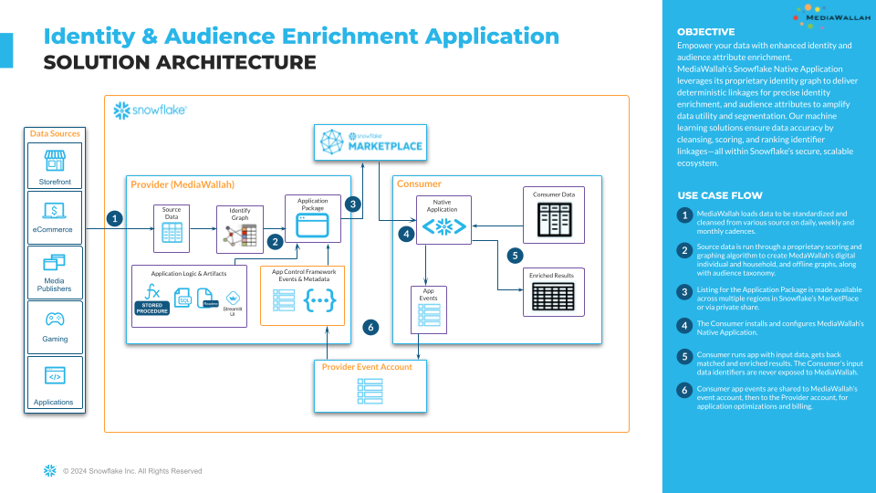

author: Jeffrey Chen
id: getting-started-with-mediawallah-enrichment-native-app
categories: snowflake-site:taxonomy/solution-center/certification/quickstart, snowflake-site:taxonomy/solution-center/certification/partner-solution, snowflake-site:taxonomy/solution-center/includes/architecture, snowflake-site:taxonomy/industry/advertising-media-and-entertainment, snowflake-site:taxonomy/product/applications-and-collaboration
language: en
summary: Install the MediaWallah Enrichment Native App from the Snowflake Marketplace, matchtest hashed emails, phones, addresses or device IDs against MediaWallah's identity graph, and enrich them without your data leaving your Snowflake account.
environments: web
status: Published
feedback link: https://github.com/Snowflake-Labs/sfguides/issues
open in snowflake: https://app.snowflake.com/marketplace/listing/GZSOZ5Q3W8J/mediawallah-inc-mediawallah-enrichment-app


# Getting Started with MediaWallah Enrichment Application
<!-- ------------------------ -->
## Overview

**Note: The Enrichment Application is currently only available on**
`AWS US-EAST-1`
*MediaWallah is working to make this available in other regions*

MediaWallah's Enrichment Marketplace listing installs one application with two request types.
**Matchtest** (`proc_name: matchtest`) - Quickly tests the overlap between your data and MediaWallah's dataverse without exposing either side. A report-only run that tells you whether a dataset is worth enriching.
**Enrichment** (`proc_name: enrichment`) - Returns your data linked to MediaWallah's dataverse for the return types allowed on your contract.

New installs are onboarded automatically and start in a 7-day trial (`subscription_mode = trial`), which returns a percentage of the total for a limited time window. Contact MediaWallah if additional time or trial runs are needed, or to move to a paid subscription.
Enrichment results are returned in four tables plus a report.

### Prerequisites
* [Snowflake Account](https://signup.snowflake.com/?utm_source=snowflake-devrel&utm_medium=developer-guides&utm_cta=developer-guides)
* The consumer must accept the Snowflake Marketplace Consumer Terms of Service.
* The consumer must be able to operate the ACCOUNTADMIN role (or a role granted ACCOUNTADMIN) for the one-time setup.

### What You’ll Learn
- How to install the MediaWallah Enrichment Application from the Snowflake Marketplace
- How to run the one-time account setup
- How to confirm automatic onboarding and trial status
- How to permission tables for data enrichment
- How to submit matchtest and enrichment requests
- How to format PHONE and ADDRESS match keys
- How to view and access results produced by the application
- How to upgrade or uninstall the application
- How to view the metadata table for privileges and usage rates.

### What You’ll Need
- A Snowflake account on AWS US-EAST-1 with a role that can create applications (ACCOUNTADMIN, or a role granted ACCOUNTADMIN)
- A table of your own identifiers to match: hashed emails, plain emails, phone numbers, addresses, device IDs, IPs or cookies
- About 20 minutes

### What You’ll Build
- The required databases, schemas, warehouse, and role to use MediaWallah's Enrichment Application

### Architecture


<!-- ------------------------ -->
## Installation

### Get the app from the Marketplace
1. Sign in to Snowsight with a role that can create applications (ACCOUNTADMIN, or a role granted ACCOUNTADMIN).
2. Open the [MediaWallah Enrichment App listing](https://app.snowflake.com/marketplace/listing/GZSOZ5Q3W8J/mediawallah-inc-mediawallah-enrichment-app) and select **Get**.
3. Keep the default application name **MEDIAWALLAH_ENRICHMENT_APP**. Every example in this guide uses that name.
4. Pick the warehouse the install should run on and select **Get**. Wait for the install-complete email before continuing.

### One-time setup (required, run once per account)
Prior to using this app, the following one-time setup steps below **must be executed**.
Please make ONLY the changes mentioned in the **NOTES** below.
### Any other changes may result in the setup process failing.

**NOTES:**
- Replace ```<MY_ROLE>``` with either the ACCOUNTADMIN role or a role that has been granted ACCOUNTADMIN.
  - ACCOUNTADMIN privileges are required for this step.
- Replace ```<MY_WAREHOUSE>``` with the desired warehouse.
- For this step, an XSMALL warehouse can be used.
- Replace all ```<APP_NAME>``` references with the name of the native app, as installed in the consumer account.
  - The App Name can be found by executing (as ACCOUNTADMIN or the role that installed the app):  ```SHOW APPLICATIONS;``` (reference the **name** column)

```sql
SET APP_NAME = '<APP_NAME>';
SET MY_ROLE = '<MY_ROLE>'; -- Role which was used to install Application (Suggested ACCOUNTADMIN)
SET MY_WAREHOUSE = '<MY_WAREHOUSE>';

USE ROLE IDENTIFIER($MY_ROLE);
USE WAREHOUSE IDENTIFIER($MY_WAREHOUSE);

CREATE DATABASE IF NOT EXISTS SIDECAR;
CREATE SCHEMA IF NOT EXISTS SIDECAR.RUNNER;
CREATE OR REPLACE PROCEDURE SIDECAR.RUNNER.SidecarRunner(app_name string)
RETURNS STRING
LANGUAGE PYTHON
RUNTIME_VERSION = '3.13'
PACKAGES = ('snowflake-snowpark-python')
HANDLER = 'run_sidecar_sql'
EXECUTE AS CALLER
AS
$$
from snowflake.snowpark.functions import col

def run_sidecar_sql(session, app_name):
  df = session.sql(f"SELECT * FROM {app_name}.SETUP.SQL").collect()
  for row in df:
    session.sql(row[0]).collect()
  return "success"
$$;

-- use app database
USE DATABASE IDENTIFIER($APP_NAME);

--load install consumer setup sql commands
CALL UTIL_APP.LOAD_INSTALL_SQL($APP_NAME, (select current_user()));

-- Parameters:
  -- app_name VARCHAR - The name of the Native App installed
  -- app_user VARCHAR - The current user

--call SidecarRunner to execute commands
CALL SIDECAR.RUNNER.SidecarRunner($APP_NAME);

-- Parameters:
  -- app_name VARCHAR - The name of the Native App installed

USE ROLE IDENTIFIER($MY_ROLE);

--create the event table, if the account does not have one
CREATE OR REPLACE PROCEDURE C_MWEN_HELPER_DB.PRIVATE.DETECT_EVENT_TABLE()
    RETURNS STRING
    LANGUAGE JAVASCRIPT
    EXECUTE AS CALLER
    AS
    $$
        snowflake.execute({sqlText:"SHOW PARAMETERS LIKE '%%event_table%%' IN ACCOUNT"});
        var table_name = snowflake.execute({sqlText:'SELECT "value" FROM TABLE(RESULT_SCAN(LAST_QUERY_ID()));'});
        table_name.next();
        table_name = table_name.getColumnValue(1);
        if(table_name == '')
        {
           snowflake.execute({sqlText:"CREATE DATABASE IF NOT EXISTS EVENTS"});
           snowflake.execute({sqlText:"CREATE SCHEMA IF NOT EXISTS EVENTS"});
           snowflake.execute({sqlText:"CREATE EVENT TABLE IF NOT EXISTS EVENTS"});
           snowflake.execute({sqlText:"ALTER ACCOUNT SET EVENT_TABLE = EVENTS.EVENTS.EVENTS"});
           return 'ADDED EVENT TABLE'
        }
        return table_name
    $$;

CALL C_MWEN_HELPER_DB.PRIVATE.DETECT_EVENT_TABLE();

ALTER APPLICATION IDENTIFIER($APP_NAME) SET SHARE_EVENTS_WITH_PROVIDER=TRUE;

-- use app database
USE DATABASE IDENTIFIER($APP_NAME);

--insert initial logs --REQUIRED TO ENABLE APP
CALL PROCS_APP.LOG_SHARE_INSERT();

--grant account privileges to application
GRANT EXECUTE TASK ON ACCOUNT TO APPLICATION IDENTIFIER($APP_NAME);
GRANT EXECUTE MANAGED TASK ON ACCOUNT TO APPLICATION IDENTIFIER($APP_NAME);

--use app database
USE DATABASE IDENTIFIER($APP_NAME);

--call configure_tracker
CALL UTIL_APP.CONFIGURE_TRACKER();

--unset session variables
UNSET (APP_NAME, MY_ROLE, MY_WAREHOUSE);

SELECT 'Done' AS STATUS;
```

<!-- ------------------------ -->
## Helper Procedures (Optional)
These helper procedures are only needed when submitting requests from a worksheet instead of the app's Streamlit UI.
### Step 01: Account Setup
Create objects and “helper” stored procedures.
The following scripts help streamline app usage considerably, and can be executed by the consumer before or after the app installation.
**NOTE:** The ACCOUNTADMIN and SECURITYADMIN roles are required to create the APP_ADMIN_ROLE, which is granted privileges to complete the pre-install setup:

#### 01_create_generate_request_procedure.sql
##### This procedure serves as a wrapper procedure that calls the app's REQUEST stored procedure, passing in a parameters object that includes the input table (if applicable), the app procedure to call, the procedure parameters, and the results table (if applicable)
```sql
----------------------------------------------------------------------------
-- 01_create_generate_request_procedure.sql
-- This procedure serves as a wrapper procedure that calls the app\'s
-- REQUEST stored procedure, passing in a parameters object that includes
-- the input table (if applicable), the app procedure to call, the procedure
-- parameters, and the results table (if applicable)
----------------------------------------------------------------------------
--set parameter for admin role
SET APP_ADMIN_ROLE = 'C_MWEN_APP_ADMIN';

--set parameter for warehouse
SET APP_WH = 'C_MWEN_APP_WH';

--set parameter for helper db
SET HELPER_DB = 'C_MWEN_HELPER_DB';

USE ROLE IDENTIFIER($APP_ADMIN_ROLE);
USE WAREHOUSE IDENTIFIER($APP_WH);
USE DATABASE IDENTIFIER($HELPER_DB);

CREATE OR REPLACE PROCEDURE PRIVATE.GENERATE_REQUEST(app_name VARCHAR, parameters VARCHAR)
  RETURNS VARCHAR
  LANGUAGE JAVASCRIPT
  COMMENT = '{"origin":"sf_ps_wls","name":"acf","version":{"major":1, "minor":3},"attributes":{"role":"consumer","component":"helper_sproc_generate_request"}}'
  EXECUTE AS CALLER
  AS
  $$

    try {
      var PARAMETERS_JSON = JSON.parse(PARAMETERS);
      //clean up input_table_name and results_table_name and append to inner parameters object
      PARAMETERS_JSON.input_table = PARAMETERS_JSON.input_table.replace(/"/g, "");
      PARAMETERS_JSON.results_table = PARAMETERS_JSON.results_table.replace(/"/g, "");
      PARAMETERS_JSON.proc_parameters[0].input_table_name = PARAMETERS_JSON.input_table;
      PARAMETERS_JSON.proc_parameters[0].results_table_name = PARAMETERS_JSON.results_table;

      var app_desc = snowflake.execute({sqlText: `CALL PRIVATE.APP_DESC('${APP_NAME}');`});
      app_desc.next();
      var app_desc_json = app_desc.getColumnValue(1);
      PARAMETERS_JSON.proc_parameters[0].version = app_desc_json.version;
      PARAMETERS_JSON.proc_parameters[0].patch = app_desc_json.patch;

      //update PARAMETERS string
      PARAMETERS = JSON.stringify(PARAMETERS_JSON).replace(/\'/g, "\\'");

      let { input_table } = PARAMETERS_JSON;

      snowflake.execute({sqlText:`USE ROLE C_MWEN_APP_ADMIN;`});

      if(input_table) {

        //grant privs to source database, schema, and table to application
        const [src_db, src_sch, src_tbl] = input_table.split(".");

        snowflake.execute({sqlText:`GRANT USAGE ON DATABASE ${src_db} TO APPLICATION ${APP_NAME};`});
        snowflake.execute({sqlText:`GRANT USAGE ON SCHEMA ${src_db}.${src_sch} TO APPLICATION ${APP_NAME};`});
        snowflake.execute({sqlText:`GRANT SELECT ON TABLE ${src_db}.${src_sch}.${src_tbl} TO APPLICATION ${APP_NAME};`});
      }

      //if the application can write results outside of its DB, provide grants here:  FEATURE NOT ENABLED YET
      //TODO:  add a field called RESULTS_LOCATION to specify db.sch where results should reside, if desired.
      //snowflake.execute({sqlText:`GRANT USAGE,CREATE TABLE ON SCHEMA C_MWEN_HELPER_DB.RESULTS TO APPLICATION ${APP_NAME};`});


      //call the app REQUST sproc
      var rset = snowflake.execute({sqlText:`CALL ${APP_NAME}.PROCS_APP.REQUEST('${PARAMETERS}');`});
      rset.next();
      var response_json = JSON.parse(rset.getColumnValue(1));

      return `${response_json.state}: ${response_json.message}`;
    } catch (err) {
      var result = `
      failed: Code: `+err.code + `
      state: `+err.state+`
      message: `+err.message+`
      stackTrace:`+err.stackTrace || err.stack;

      return `Error: ${result}`;
  }
  $$
  ;

UNSET (APP_ADMIN_ROLE, APP_WH, HELPER_DB);
```

#### 02_create_uninstall_procedure.sql
##### This procedure serves as a wrapper procedure that uninstalls the Provider's app and removes
```sql
----------------------------------------------------------------------------
-- 02_create_uninstall_procedure.sql
-- This procedure serves as a wrapper procedure that uninstalls the
-- Provider\'s app and removes
----------------------------------------------------------------------------
--set parameter for admin role
SET APP_ADMIN_ROLE = 'C_MWEN_APP_ADMIN';

--set parameter for warehouse
SET APP_WH = 'C_MWEN_APP_WH';

--set parameter for helper db
SET HELPER_DB = 'C_MWEN_HELPER_DB';

USE ROLE IDENTIFIER($APP_ADMIN_ROLE);
USE WAREHOUSE IDENTIFIER($APP_WH);
USE DATABASE IDENTIFIER($HELPER_DB);

CREATE OR REPLACE PROCEDURE PRIVATE.UNINSTALL(app_name VARCHAR)
  RETURNS VARCHAR
  LANGUAGE JAVASCRIPT
  COMMENT = '{"origin":"sf_ps_wls","name":"acf","version":{"major":1, "minor":3},"attributes":{"role":"consumer","component":"helper_sproc_app_uninstall"}}'
  EXECUTE AS CALLER
  AS
  $$

  try {
    //drop all existing outbound shares to the Provider account
    snowflake.execute({sqlText: `SHOW SHARES LIKE '%MWEN_%_APP_SHARE%'`});
    snowflake.execute({sqlText: `CREATE OR REPLACE TEMPORARY TABLE C_MWEN_HELPER_DB.PRIVATE.OUTBOUND_SHARES AS SELECT "name" FROM TABLE(RESULT_SCAN(LAST_QUERY_ID())) WHERE "owner" = 'C_MWEN_APP_ADMIN' AND "kind" = 'OUTBOUND';`});

    var rset = snowflake.execute({sqlText: `SELECT * FROM C_MWEN_HELPER_DB.PRIVATE.OUTBOUND_SHARES;`});
    while(rset.next()){
      var full_share_name = rset.getColumnValue(1);
      full_share_name_arr = full_share_name.split(".");
      share_name = full_share_name_arr[2];

      snowflake.execute({sqlText:`DROP SHARE IF EXISTS ${full_share_name};`});
      snowflake.execute({sqlText:`DROP SHARE IF EXISTS ${full_share_name};`});
    }

    //drop log database
    snowflake.execute({sqlText: `DROP DATABASE IF EXISTS MWEN_APP_SHARE;`});

    //drop application
    snowflake.execute({sqlText: `DROP APPLICATION IF EXISTS ${APP_NAME};`});

    return `App: ${APP_NAME} removed.`;

  } catch (err) {
    var result = `
    Failed: Code: `+err.code + `
    State: `+err.state+`
    Message: `+err.message+`
    Stack Trace:`+err.stack;

    return `Error: ${result}`;
    }
$$
;

UNSET (APP_ADMIN_ROLE, APP_WH, HELPER_DB);
```


#### 03_application_description_procedure.sql
##### This procedure helps identify the version and patch number of the current run is on
```sql
----------------------------------------------------------------------------
-- 03_application_description_procedure.sql
-- This procedure helps identify the version and patch number of the current run is on
-- Provider\'s app and removes
----------------------------------------------------------------------------
--set parameter for admin role
SET APP_ADMIN_ROLE = 'C_MWEN_APP_ADMIN';

--set parameter for warehouse
SET APP_WH = 'C_MWEN_APP_WH';

--set parameter for helper db
SET HELPER_DB = 'C_MWEN_HELPER_DB';

USE ROLE IDENTIFIER($APP_ADMIN_ROLE);
USE WAREHOUSE IDENTIFIER($APP_WH);
USE DATABASE IDENTIFIER($HELPER_DB);

CREATE OR REPLACE PROCEDURE PRIVATE.APP_DESC(app_name VARCHAR)
    RETURNS VARIANT
    LANGUAGE JAVASCRIPT
    COMMENT = '{"origin":"sf_ps_wls","name":"acf","version":{"major":1, "minor":3},"attributes":{"role":"consumer","component":"helper_sproc_app_desc"}}'
    EXECUTE AS CALLER
    AS
    $$
    try {
        let get_app_desc = () => {
            var results = {};
            var d_app = snowflake.execute({sqlText: `DESCRIBE APPLICATION ${APP_NAME};`});
            while (d_app.next()) {
                if(['version','patch'].includes(d_app.getColumnValueAsString(1))) {
                    results[`${d_app.getColumnValueAsString(1)}`] = d_app.getColumnValueAsString(2);
                }
            }
            return results;
        }

        return get_app_desc();

    } catch (err) {
    var result = `
    Failed: Code: `+err.code + `
    State: `+err.state+`
    Message: `+err.message+`
    Stack Trace:`+err.stack;

    return `Error: ${result}`;
    }
$$
;

UNSET (APP_ADMIN_ROLE, APP_WH, HELPER_DB);
```


#### 04_grant_application_role.sql
##### This grants the application role to a specific user of the application if one was not granted on installation
```sql
----------------------------------------------------------------------------
-- 06_grant_application_role.sql
-- This grants the application role to a specific user of the application
-- if one was not granted on installation
----------------------------------------------------------------------------
USE ROLE ACCOUNTADMIN;
SHOW APPLICATIONS;

SET APP_OWNER = (SELECT "owner" FROM TABLE(RESULT_SCAN(LAST_QUERY_ID())) WHERE UPPER("name") = 'MEDIAWALLAH_ENRICHMENT_APP');

USE ROLE IDENTIFIER($APP_OWNER);

GRANT APPLICATION ROLE MEDIAWALLAH_ENRICHMENT_APP.APP_ROLE TO ROLE C_MWEN_APP_ADMIN;
```

<!-- ------------------------ -->
## Verify Installation and Onboarding

Onboarding is automatic. The one-time setup above emits an install event to MediaWallah; within a couple of minutes the app's metadata view is populated and `enabled` is `Y`. There is no share to create and nothing to email.
```sql
------------------------ Verify Installation ------------------------
USE ROLE ACCOUNTADMIN;
SELECT * FROM MEDIAWALLAH_ENRICHMENT_APP.UTIL_APP.METADATA_C_V;
-- NOTE: should see metadata key/value pairs, including enabled = 'Y',
--       subscription_mode = 'trial' and trial_expiration_timestamp (7 days from install)
```
If the view is still empty after five minutes, confirm the setup script completed (`SELECT 'Done'` at the end) and that the account has an event table (`SHOW PARAMETERS LIKE 'event_table' IN ACCOUNT`), then contact operations@mediawallah.com with your `CURRENT_ORGANIZATION_NAME()` and `CURRENT_ACCOUNT_NAME()`.

To move from trial to a paid subscription, or to extend a trial, contact operations@mediawallah.com. The `subscription_mode` and limits in the metadata view are managed by MediaWallah.

<!-- ------------------------ -->
## Granting Application Access to the Consumer's Dataset(s)

### Granting Application Access to the Consumer's Dataset(s)
The application will need access to the consumer's dataset; **Either directly to the table or a view of the table.**


**Example:** Granting access to a consumer's dataset `[CONSUMER_DB].[CONSUMER_SCH].[CONSUMER_TBL]` owned by `SYSADMIN` role to the **C_MWEN\_APP_ADMIN** role.
(Replace placeholders accordingly)
```sql
----------------------------------------------------------------------------
-- Below is the code with all the database, schema, and table names that
-- need to be replaced in brackets
-- use the role that has ownership of the source data table
USE ROLE SYSADMIN;
-- grant privileges to source data
GRANT USAGE ON DATABASE [CONSUMER_DB] TO ROLE C_MWEN_APP_ADMIN;
GRANT USAGE ON SCHEMA [CONSUMER_DB].[CONSUMER_SCH] TO ROLE C_MWEN_APP_ADMIN;
GRANT SELECT ON TABLE [CONSUMER_DB].[CONSUMER_SCH].[CONSUMER_TBL] TO ROLE C_MWEN_APP_ADMIN;
-- Now the Table [CONSUMER_DB].[CONSUMER_SCH].[CONSUMER_TBL] can be used by the Application!

-- Creating a view of source dataset table in C_MWEN_HELPER_DB.SOURCE schema
USE ROLE C_MWEN_APP_ADMIN;
CREATE OR REPLACE VIEW C_MWEN_HELPER_DB.SOURCE.[CONSUMER_VIEW] AS
  SELECT * FROM [CONSUMER_DB].[CONSUMER_SCH].[CONSUMER_TBL];
```

<!-- ------------------------ -->
## Generating Requests

Once enabled, the consumer can call the GENERATE_REQUEST helper stored procedure to use any of the consumer’s allowed stored procs. Data will be generated into the MEDIAWALLAH_ENRICHMENT_APP.RESULTS_APP schema. View [Results Guide](https://nativeapps.mediawallah.com/enrichment/MWEN%20-%20Results%20Guide.pdf) for a detailed explanation of the generated data.
Optimal warehouse sizing will depend on consumer input dataset dimensions. MediaWallah maintains average run times based on historical runs in a Warehouse Sizing Doc, ask for details (as a reference point: a 1MM-record matchtest completes in roughly 4 minutes on a 2X-LARGE warehouse).
For a detailed explanation of the parameters used in GENERATE_REQUEST, see below
**Note:** Application should only be run in series; one request at a time. Multiple requests can cause failures and inaccurate billing reporting in logs

**IMPORTANT — warehouse size and how the request is submitted:**
- The request runs synchronously on the warehouse of the session that submits it. Size that warehouse for your input volume (see the ALTER WAREHOUSE step in the examples below) — a large input on an XSMALL warehouse can run for hours.
- Do **NOT** submit large requests through the app's Streamlit UI. The Streamlit page runs the request synchronously in its own session; if the page times out or is closed before the request finishes, **the request is cancelled silently** and no error is reported anywhere. Submit large requests from a SQL worksheet instead — a worksheet query keeps running server-side even if the browser tab is closed.
**Matchtest Example:**
```sql
----------------------- Generating Request: Matchtest Example --------------
USE ROLE C_MWEN_APP_ADMIN;
USE WAREHOUSE C_MWEN_APP_WH;
ALTER WAREHOUSE C_MWEN_APP_WH
SET WAREHOUSE_SIZE = "2X-LARGE" WAIT_FOR_COMPLETION = TRUE;

-- NOTE: execution time is determined by warehouse size, and is
-- controlled by the consumer.
CALL C_MWEN_HELPER_DB.PRIVATE.GENERATE_REQUEST(
  'MEDIAWALLAH_ENRICHMENT_APP'
 ,$${
    "input_table": "C_MWEN_HELPER_DB.SOURCE.[CONSUMER_TBL]",
    "proc_name": "matchtest",
    "proc_parameters": [{
      "primary_key": "EMAIL_ADD_MD5",
      "primary_key_type": "MD5_HASH",
      "return_types": "DEVICE_ID,IP_ADDRESS"
    }],
    "results_table": "MEDIAWALLAH_ENRICHMENT_APP.RESULTS_APP.[OUTPUT_TABLE_NAME]"
  }$$
);
-- NOTE: second argument in the GENERATE_REQUEST SP string quoted in $$
-- NOTE: if [OUTPUT_TABLE_NAME] already exists, this will overwrite the data
```

**Enrichment Example:**
```sql
----------------------- Generating Request: Enrichment Example -------------
USE ROLE C_MWEN_APP_ADMIN;
USE WAREHOUSE C_MWEN_APP_WH;
ALTER WAREHOUSE C_MWEN_APP_WH
SET WAREHOUSE_SIZE = "2X-LARGE" WAIT_FOR_COMPLETION = TRUE;

-- NOTE: execution time is determined by warehouse size, and is
-- controlled by the consumer.
CALL C_MWEN_HELPER_DB.PRIVATE.GENERATE_REQUEST(
  'MEDIAWALLAH_ENRICHMENT_APP'
 ,$${
    "input_table": "C_MWEN_HELPER_DB.SOURCE.[CONSUMER_VIEW]",
    "proc_name": "enrichment",
    "proc_parameters": [{
      "primary_key": "EMAIL_ADD_MD5",
      "primary_key_type": "MD5_HASH",
      "return_types": "DEVICE_ID,IP_ADDRESS"
    }],
    "results_table": "MEDIAWALLAH_ENRICHMENT_APP.RESULTS_APP.[OUTPUT_TABLE_NAME]"
  }$$
);
-- NOTE: second argument in the GENERATE_REQUEST SP string quoted in $$
-- NOTE: if [OUTPUT_TABLE_NAME] already exists, this will overwrite the data
```

**Direct REQUEST Example (without the helper procedure):**
If the GENERATE_REQUEST helper is not installed, the app's REQUEST procedure can be called directly. Grant the app read access to the input table, then pass the full parameters object — note that `input_table_name` and `results_table_name` are repeated inside `proc_parameters`:
```sql
----------------------- Generating Request: Direct REQUEST -----------------
USE ROLE C_MWEN_APP_ADMIN;
USE WAREHOUSE C_MWEN_APP_WH;
ALTER WAREHOUSE C_MWEN_APP_WH
SET WAREHOUSE_SIZE = "2X-LARGE" WAIT_FOR_COMPLETION = TRUE;

-- the app needs read access to the input table
GRANT USAGE ON DATABASE [CONSUMER_DB] TO APPLICATION MEDIAWALLAH_ENRICHMENT_APP;
GRANT USAGE ON SCHEMA [CONSUMER_DB].[CONSUMER_SCH] TO APPLICATION MEDIAWALLAH_ENRICHMENT_APP;
GRANT SELECT ON TABLE [CONSUMER_DB].[CONSUMER_SCH].[CONSUMER_TBL] TO APPLICATION MEDIAWALLAH_ENRICHMENT_APP;

CALL MEDIAWALLAH_ENRICHMENT_APP.PROCS_APP.REQUEST($${
  "input_table": "[CONSUMER_DB].[CONSUMER_SCH].[CONSUMER_TBL]",
  "proc_name": "matchtest",
  "proc_parameters": [{
    "app_code": "MWEN",
    "primary_key": "EMAIL_ADD_MD5",
    "primary_key_type": "MD5_HASH",
    "return_types": "DEVICE_ID,IP_ADDRESS",
    "input_table_name": "[CONSUMER_DB].[CONSUMER_SCH].[CONSUMER_TBL]",
    "results_table_name": "MEDIAWALLAH_ENRICHMENT_APP.RESULTS_APP.[OUTPUT_TABLE_NAME]"
  }],
  "results_table": "MEDIAWALLAH_ENRICHMENT_APP.RESULTS_APP.[OUTPUT_TABLE_NAME]"
}$$);
-- NOTE: if [OUTPUT_TABLE_NAME] already exists, this will overwrite the data
```

<!-- ------------------------ -->
## Parameters Description

##### JSON Parameters Description
```markdown
|------------------|----------------------------------------------------|
| param            | description                                        |
|==================|====================================================|
| input_table      | the consumers input table name; must be granted to |
|                  |  **C_MWEN_APP_ADMIN** role                         |
| proc_name        | name of approved application consumer has access to|
|                  |  (such as matchtest or enrichment)                 |
| proc_parameters  | stringified json object containing parameters used |
|                  |  in the approved proc_name                         |
| results_table    | output location of the application; application    |
|                  |  appends the proc_name to the final table name     |
|                  |                                                    |
|                  | **matchtest:** will produce one reporting table    |
|                  |  for requested/allowed return_types:               |
|                  |    MEDIAWALLAH_ENRICHMENT_APP                      |
|                  |      .RESULTS_APP.[OUTPUT_TABLE_NAME]_REPORT       |
|                  |                                                    |
|                  | **enrichment:** will produce multiple tables       |
|                  |  depending on requested/allowed return_types,      |
|                  |  as well as a reporting table                      |
|                  |    MEDIAWALLAH_ENRICHMENT_APP                      |
|                  |      .RESULTS_APP                                  |
|                  |      .[OUTPUT_TABLE_NAME]_CLIENT_ENRICHMENT        |
|                  |        > Contains an App Resolution ID connected   |
|                  |          to the consumer input_table data. This is |
|                  |          used to join return_types data            |
|                  |      .[OUTPUT_TABLE_NAME]_DIGITAL_ENRICHMENT       |
|                  |        > Contains an ARID to connect to requested  |
|                  |          return_types if applicable                |
|                  |      .[OUTPUT_TABLE_NAME]_PII_ENRICHMENT           |
|                  |        > Contains an ARID to connect to requested  |
|                  |          return_types if applicable                |
|                  |      .[OUTPUT_TABLE_NAME]_AUDIENCE_ENRICHMENT      |
|                  |        > Contains an ARID to connect to requested  |
|                  |          return_types if applicable                |
|                  |      .[OUTPUT_TABLE_NAME]_REPORT                   |
| app_code         | the abbreviated codename of the MediaWallah app    |
| primary_key      | the name of the column in the input_table dataset, |
|                  |  that the consumer would like to match to          |
|                  |  MediaWallah identity graph data                   |
| primary_key_type | the type of the match_key, matching MediaWallah    |
|                  |  available match key types (see below)             |
|                  | (match_key / match_key_type are accepted as legacy |
|                  | aliases and normalized to primary_key)             |
| return_types     | the type of the return ids or audience consumer    |
|                  |  wishes to get matchtest or enrichment against     |
|                  |  (see below)                                       |
|------------------|----------------------------------------------------|
```
**note**: During Enrichment Trial users only receive a percentage of the total data, complete data is shared in full application

<!-- ------------------------ -->
## Match Key Type

##### Available options for match_key_type:
**note**: allowed match_key_types may vary due to contract
```markdown
|-----------------|-----------------------------------------------------|
| match_key_types | description                                         |
|=================|=====================================================|
| DEVICE_ID       | Mobile Advertising ID such as IDFA, or AAID, or IDFV|
| UBID            | MediaWallah Cookie                                  |
| CTV_ID          | Connected TV such as Roku, fire                     |
| IP_ADDRESS      | IPV4                                                |
| MD5_HASH        | Hashed email using MD5 algorithm                    |
| SHA1_HASH       | Hashed email using SHA1 algorithm                   |
| SHA256_HASH     | Hashed email using SHA256 algorithm                 |
| EMAIL           | Plain Text Email                                    |
| ADDRESS         | ADDRESS_1,ADDRESS_2,CITY,STATE,ZIP5 (see below)     |
| NAME_ADDRESS    | FIRST_NAME,ADDRESS_1 (see below)                    |
| PHONE           | Phone number, normalized to E.164 (see below)       |
| HASHED_PHONE    | SHA256 of the E.164 phone (see Formatting: PHONE)   |
| APN             | AppNexus                                            |
| TTD             | The Trade Desk                                      |
| CRT             | Criteo                                              |
| ADB             | Adobe                                               |
| LTM             | Lotame                                              |
| BWX             | BeesWax                                             |
| NLS             | Nielsen                                             |
| EYE             | Eyeota                                              |
| PUB             | Pubmatic                                            |
| MMA             | MediaMath                                           |
| SOV             | Sovrn                                               |
|-----------------|-----------------------------------------------------|
```
**note**: Plain text emails should be lowered and white spaced removed before Hashing

##### Formatting: PHONE
`primary_key` names one column. The app normalizes it to E.164 before matching: everything except digits is removed, a 10 digit number gets `+1` prepended, an 11-15 digit number gets `+` prepended. All of these match the same record:
```
2125551234
(212) 555-1234
1-212-555-1234
+12125551234
```
Values that do not normalize this way are **not used as match keys**. That means any value with fewer than 10 digits (e.g. a 7-digit local number) or more than 15 digits, and any value whose digits are not a real phone number. They are skipped, count as unmatched, and cannot be rescued by the app. MediaWallah's graph holds North American (`+1`) numbers, so a non-US number normalizes but will not find a match. Clean these rows before submitting.

HASHED_PHONE must be the SHA-256 of the E.164 string and nothing else: `SHA2('+12125551234')`. A hash of `2125551234`, `12125551234`, `(212) 555-1234` or any other form will not match, and the app cannot detect or repair it. Normalize to E.164 first, then hash. Hex case does not matter.

##### Formatting: ADDRESS
`primary_key` is five comma-separated column names from your table, in this order: ADDRESS_1, ADDRESS_2, CITY, STATE, ZIP5. The column names can be anything; the position is what matters.
```json
      "primary_key": "addr1,addr2,city,st,zip",
      "primary_key_type": "ADDRESS",
```
The five values are concatenated with no delimiter and compared case-insensitively, so each column must match MediaWallah's stored form, which is USPS standardized:
```markdown
|-----------|----------------------------------------------------------------------------------------------|
| column    | expected form                                                                                |
|===========|==============================================================================================|
| ADDRESS_1 | House number + street, USPS abbreviations and directionals: 60 SUNRISE CIR, 312 12TH AVE NW  |
|           | Spelled-out STREET / AVENUE / ROAD will not match ST / AVE / RD. No trailing periods.         |
| ADDRESS_2 | Unit only: APT 15, STE 200, UNIT B. NULL or empty when there is none (treated the same).     |
|           | Never fold the unit into ADDRESS_1.                                                          |
| CITY      | USPS city name: NAUGATUCK, MANDAN, LONG BEACH                                                |
| STATE     | 2-letter USPS code: NJ, not New Jersey                                                       |
| ZIP5      | Exactly 5 characters as text, zero-padded: 06770, not 6770 and not 06770-1234                |
|-----------|----------------------------------------------------------------------------------------------|
```
Casing does not matter (both sides are uppercased). Whitespace and punctuation do: `60 SUNRISE CIR.` or ` 60 SUNRISE CIR` will not match.

Example rows as they should look in your table:
```
ADDR1            | ADDR2   | CITY      | ST | ZIP
60 SUNRISE CIR   |         | NAUGATUCK | CT | 06770
312 12TH AVE NW  | APT 15  | MANDAN    | ND | 58554
10 MAIN ST       | STE 200 | HOBOKEN   | NJ | 07030
```
Best results come from running your file through a CASS / USPS address standardizer before submitting.

##### Formatting: NAME_ADDRESS
`primary_key` is two comma-separated column names, in this order: FIRST_NAME, ADDRESS_1. Same rules as ADDRESS: the two values are concatenated with no delimiter and compared case-insensitively, ADDRESS_1 in USPS form. Use this when you have no city/state/zip, or as a looser secondary key.
```json
      "primary_key": "first_name,addr1",
      "primary_key_type": "NAME_ADDRESS",
```

<!-- ------------------------ -->
## Return Type

##### Available options for return_types:
*note*: allowed return_types may vary due to contract
```markdown
|-----------------|-----------------------------------------------------|
| DIGITAL         | description                                         |
|=================|=====================================================|
| DEVICE_ID       | Mobile Advertising ID such as IDFA, or AAID, or IDFV|
| UBID            | MediaWallah Cookie                                  |
| CTV_ID          | Connected TV such as Roku, fire                     |
| IP_ADDRESS      | IPV4                                                |
| MD5_HASH        | Hashed email using MD5 algorithm                    |
| SHA1_HASH       | Hashed email using SHA1 algorithm                   |
| SHA256_HASH     | Hashed email using SHA256 algorithm                 |
| HASHED_PHONE    | Returned as SHA2('+1' + 10 digits)                  |
| APN             | AppNexus                                            |
| TTD             | The Trade Desk                                      |
| CRT             | Criteo                                              |
| ADB             | Adobe                                               |
| LTM             | Lotame                                              |
| BWX             | BeesWax                                             |
| NLS             | Nielsen                                             |
| EYE             | Eyeota                                              |
| PUB             | Pubmatic                                            |
| MMA             | MediaMath                                           |
| SOV             | Sovrn                                               |
|-----------------|-----------------------------------------------------|
```
```markdown
|-----------------|-----------------------------------------------------|
| PII             | description                                         |
|=================|=====================================================|
| EMAIL           | Plain Text Email                                    |
| ADDRESS         | ADDRESS_1, ADDRESS_2, CITY, STATE, ZIP5 (USPS form) |
| PHONE           | Returned as 10 digits; see Formatting: PHONE        |
|-----------------|-----------------------------------------------------|
```
```markdown
|---------------------------|-------------------------------------------|
| DEMO                      | description                               |
|===========================|===========================================|
| DEMO_GENDER               | Gender                                    |
| DEMO_AGE_BRACKET          | Age                                       |
| DEMO_INCOME_BRACKET       | Estimated Income Bracket                  |
| DEMO_NET_WORTH            | Estimated Networth                        |
| DEMO_HOMEOWNER            | Boolean if user is homeowner or not       |
| DEMO_MARRIED              | Boolean if user is married or not         |
| DEMO_CHILDREN             | Boolean if user has children or not       |
|---------------------------|-------------------------------------------|
| B2B_COMPANY_EMPLOYEE_COUNT| Estimated company size user belongs to    |
| B2B_DEPARTMENT            | Department user works for                 |
| B2B_JOB_TITLE             | Current Job title of user                 |
| B2B_SENIORITY_LEVEL       | Current job level                         |
| B2B_PRIMARY_INDUSTRY      | Industry user works at                    |
| B2B_COMPANY_REVENUE       | Estimated company revenue user works for  |
|---------------------------|-------------------------------------------|
| PURCHASE_PRODUCT          | product purchased by the user in the last |
|                           |   3 months                                |
| PURCHASE_BRAND            | brand of product purchased by the user in |
|                           |   last 3 months                           |
| PURCHASE_SEGMENT          | segment category associated with product  |
|                           |   purchased by the user in last 3 months  |
|---------------------------|-------------------------------------------|
| LOCATION_STATE            | location based on user residence          |
|---------------------------|-------------------------------------------|
```
**Note**: Plain text emails should be lowered and white spaced removed before Hashing

<!-- ------------------------ -->
## Viewing Results
#### Viewing Results
Depending on which application (aka proc_name) used, the GENERATE_REQUEST procedure will generate different outputs based on the RESULTS_TABLE.
**Matchtest**
```sql
-- MATCHTEST REPORT
SELECT *
FROM MEDIAWALLAH_ENRICHMENT_APP.RESULTS_APP.[OUTPUT_TABLE_NAME]_REPORT
ORDER BY BUCKET_TYPE, MATCHED_DATA_TYPE
;
```
**Enrichment**
```sql
-- ENRICHMENT RESULTS
SELECT *
FROM MEDIAWALLAH_ENRICHMENT_APP.RESULTS_APP.[OUTPUT_TABLE_NAME]_CLIENT_ENRICHMENT
LIMIT 100
;

SELECT *
FROM MEDIAWALLAH_ENRICHMENT_APP.RESULTS_APP.[OUTPUT_TABLE_NAME]_DIGITAL_ENRICHMENT
LIMIT 100
;

SELECT *
FROM MEDIAWALLAH_ENRICHMENT_APP.RESULTS_APP.[OUTPUT_TABLE_NAME]_PII_ENRICHMENT
LIMIT 100
;

SELECT *
FROM MEDIAWALLAH_ENRICHMENT_APP.RESULTS_APP.[OUTPUT_TABLE_NAME]_AUDIENCE_ENRICHMENT
LIMIT 100
;

-- ENRICHMENT REPORT
SELECT *
FROM MEDIAWALLAH_ENRICHMENT_APP.RESULTS_APP.[OUTPUT_TABLE_NAME]_REPORT
ORDER BY BUCKET_TYPE, MATCHED_DATA_TYPE
;
```

<!-- ------------------------ -->
## Using ARID
#### Using ARID
An ARID (App Resolution Identifier) is the primary key generated per run of the application, used to join the original data with enriched digital data, enriched offline data and/or enriched audience segment data.
**Example joining Data**
```sql
SELECT c.*, e.ID_VALUE, e.ID_TYPE
FROM MEDIAWALLAH_ENRICHMENT_APP.RESULTS_APP.[RESULTS_TABLE_NAME]_ENRICHMENT c
JOIN MEDIAWALLAH_ENRICHMENT_APP.RESULTS_APP.[RESULTS_TABLE_NAME]_ENRICHMENT e
ON (
    c.ARID = e.ARID
AND e.ID_TYPE = 'MD5_HASH'
)
;
```

**Example joining audience with taxonomy**
```sql
SELECT a.ARID, t.SEGMENT, t.SEGMENT_VALUE, a.ID_VALUE, a.ID_SUMMARY_TYPE, a.ID_TYPE, a.TIER, a.MATCH_KEY
FROM (
    SELECT e.ARID, s1.VALUE::varchar AS ID_VALUE, e.ID_SUMMARY_TYPE, e.ID_TYPE, e.TIER, e.MATCH_KEY
    FROM MEDIAWALLAH_ENRICHMENT_APP.RESULTS_APP.[RESULTS_TABLE_NAME]_AUDIENCE_ENRICHMENT e
    ,TABLE(FLATTEN(e.ID_VALUE, OUTER=> TRUE)) s1
) a
JOIN MEDIAWALLAH_ENRICHMENT_APP.UTIL_APP.TAXONOMY_C_V t
ON (
  a.ID_VALUE = t.SEGMENT_VALUE_ID
)
;
```

<!-- ------------------------ -->
## Metadata (Reference)
#### Metadata (Reference)
```markdown
SELECT * FROM MEDIAWALLAH_ENRICHMENT_APP.UTIL_APP.METADATA_C_V
```

```markdown
|----------------------------------|------------------------------------|
| key                              | description                        |
|==================================|====================================|
| allowed_procs                    | procedures consumer has access to  |
| allowed_funcs                    | functions consumer has access to   |
| enabled                          | if is able to use the application  |
| install_count                    | number of times app is installed   |
| total_requests                   | number of request made to app      |
| total_records_processed          | total records processed by app     |
| total_distinct_match_keys        | total match_keys sent to app       |
| total_distinct_matched_match_keys| total match_keys matched by app    |
| total_returned_rows              | total rows returned by app         |
| total_returned_records           | total records returned by app      |
| total_returned_pairs             | total pairs returned by app        |
| allowed_return_types             | return_types available to consumer |
| allowed_match_key_types          | match_key_types available          |
| subscription_mode                | trial or paid                      |
| trial_expiration_timestamp       | when trial expires                 |
| trial_request_limit              | # request allowed during trial     |
| trial_record_limit               | # of records allowed for trial     |
| trial_match_key_limit            | # match_keys allowed for trial     |
| trial_matched_match_key_limit    | # of matched match_keys for trial  |
| trial_return_percentage          | percentage returned during trial   |
| custom_client_name               | name of client                     |
| usage_rate                       | contracted usage rate              |
| billing_type                     | usage based or fixed rate          |
|----------------------------------|------------------------------------|
```

<!-- ------------------------ -->
## Uninstall (Optional)
#### Uninstall (Optional)
In the event the consumer wishes to uninstall the app, the consumer can use the **C_MWEN_APP_ADMIN** role to call the UNINSTALL helper stored procedure. This procedure will drop the application database, the logs share, and the shared logs database. The Application Share (which includes the results and logs tables) will be permanently removed from the consumer’s Snowflake instance.
**Note**: It is important to note any data generated by the application stored in MEDIAWALLAH_ENRICHMENT_APP.RESULTS_APP will be lost. Please export results accordingly.
**Example:**
```sql
------------------------ UNINSTALL ------------------------
USE ROLE ACCOUNTADMIN;
SHOW APPLICATIONS;

SET APP_OWNER = (SELECT "owner" FROM TABLE(RESULT_SCAN(LAST_QUERY_ID())) WHERE UPPER("name") = 'MEDIAWALLAH_ENRICHMENT_APP');

USE ROLE IDENTIFIER($APP_OWNER);
CALL C_MWEN_HELPER_DB.PRIVATE.UNINSTALL('MEDIAWALLAH_ENRICHMENT_APP');
```

Example:
* To remove the C_MWEN_HELPER_DB:
```sql
DROP DATABASE C_MWEN_HELPER_DB;
```
* To remove the C_MWEN_APP_WH:
```sql
DROP WAREHOUSE C_MWEN_APP_WH;
```
* To remove the C_MWEN_APP_ADMIN:
```sql
USE ROLE ACCOUNTADMIN;
DROP ROLE C_MWEN_APP_ADMIN;
```

* To remove the log and metric share from Application Version 1.3
** DANGER: this is your only copy of the share data, this can not be restored. and only applies to 1.3 data**
```sql
DROP SHARE MWEN_APP_SHARE;
```

<!-- ------------------------ -->
## Upgrade (Optional)
#### Upgrade (Optional)
As new versions and patches are released, upgrade with the following commands.
```sql
USE ROLE ACCOUNTADMIN;
ALTER APPLICATION MEDIAWALLAH_ENRICHMENT_APP UPGRADE;
```

<!-- ------------------------ -->
## Conclusion And Resources

### Conclusions
Congratulations! You've successfully completed the Getting Started with MediaWallah Enrichment Native Application quickstarts Guide.
Now you can utilize this service at your convenience, and receive enriched data with a few simple actions.
We look forward to working with you. Please reach out for any questions snowflake@mediawallah.com

### What You Learned
- How to download the MediaWallah Enrichment Application
- How to install the application
- How to confirm automatic onboarding and trial status
- How to permission tables for data enrichment
- How to view and access results produced by the application
- How to upgrade or uninstall the application
- How to view the metadata table for privileges and usage rates.

### Related Resources
- [MediaWallah Enrichment App](https://app.snowflake.com/marketplace/listing/GZSOZ5Q3W8J/mediawallah-inc-mediawallah-enrichment-app)
- [Reference Architecture](https://drive.google.com/file/d/1Es4gaeOOmpfmBDSp9RkCIGZB1PQHyzHg/view])
- [Blog](https://medium.com/snowflake/ultra-secure-identity-and-audience-profile-enrichment-made-simple-21e48a56ab4a)
<!-- - [<link to github code repo>] -->
[Fork Repo on GitHub](https://github.com/Snowflake-Labs/sf-samples/pull/155)
<!-- - [<link to documentation>] -->
<!-- - [<link to youtube>] -->
[Watch the Demo](https://youtu.be/I4e-qj5jHW8?list=TLGGsB5qTdKOvZ4yNDA5MjAyNQ)
