author: Matt Marzillo
id: getting-started-with-microsoft-copilot-studio-and-cortex-agents
categories: snowflake-site:taxonomy/solution-center/certification/quickstart, snowflake-site:taxonomy/product/ai, snowflake-site:taxonomy/snowflake-feature/ingestion/conversational-assistants, snowflake-site:taxonomy/snowflake-feature/cortex-llm-functions
language: en
summary: This is a quickstart showing users how use Microsoft Copilot Studio with Snowflake Cortex Agents 
environments: web
status: Published 
feedback link: https://github.com/Snowflake-Labs/sfguides/issues


# Getting Started with Microsoft Copilot Studio and Snowflake Cortex Agents
<!-- ------------------------ -->
## Overview 

Microsoft Copilot Studio is a conversational AI platform that allows users to create and customize copilots, using a low-code, graphical interface, enabling them to build agents for various scenarios and integrate them with Microsoft 365 Copilot or as standalone applications.

Cortex Agents orchestrate across both structured and unstructured data sources to deliver insights. They plan tasks, use tools to execute these tasks, and generate responses. Agents use Cortex Analyst (structured) and Cortex Search (unstructured) as tools, along with LLMs, to analyze data. Cortex Search extracts insights from unstructured sources, while Cortex Analyst generates SQL to process structured data. A comprehensive support for tool identification and tool execution enables delivery of sophisticated applications grounded in enterprise data.

By combining these two services, users can efficiently and securely build a copilot within Microsoft. This copilot leverages all of their Microsoft data and tooling alongside Snowflake Cortex services, which operate on their Snowflake data with Oauth support.

### Use Case
The core goal of this quickstart is to create a single, powerful Sales Intelligence solution that lives inside Microsoft Copilot. We’ll achieve this by creating a powerful Cortex Agent in Snowflake and securely connecting it to your Microsoft Copilot. Two data sources will be built, one with structured sales data and another with unstructured sales call data. We will create a Cortex Agent that uses Cortex Search (for unstructured data) and Cortex Analyst (for structured data), and then wrap a Cortex Agent around it so that it can combine both services in a unified agentic experience. This can then be used by Copilot by leveraging OAuth authentication and triggered by a simple phrase in your Microsoft Copilot to access sales data easily with plain text questions.

Snowflake Cortex has proven to be a best-in-class platform for building GenAI services and agents with your data. While there is overlap with functionality in Microsoft Copilot Studio, we see many customers who want to build GenAI services in Snowflake Cortex then materialize those services to Microsoft Copilot, having it serve as the single interface for all GenAI services and agents.

### Prerequisites
- Familiarity with Snowflake and a [Snowflake account](https://signup.snowflake.com/?utm_source=snowflake-devrel&utm_medium=developer-guides&utm_cta=developer-guides)
- Familiarity with [Microsoft 365 Copilot Studio](https://www.microsoft.com/en-us/microsoft-365/copilot/) and and a Microsoft 365 Account
- Access to the Microsoft Entra ID service for the Microsoft 365 tenant

### What You’ll Learn
- How to create  Snowflake Cortex Services for Search, Analyst, and Agents
- How to create a Microsoft 365 Copilot 
- How to connect your Microsoft Copilot to the Cortex Agent

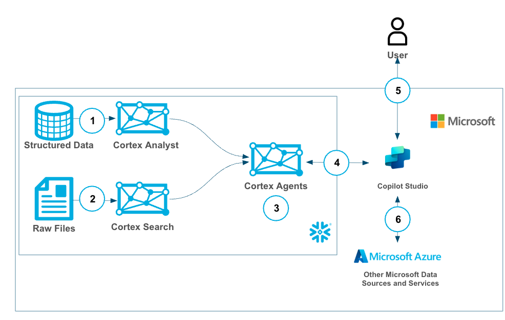
1. Create a Cortex Analyst Service with Semantic Model
2. Create a Cortex Search Service
3. Create a Cortex Agent that will use the services above as tools
4. Connect and authenticate to Cortex Agent from Microsoft Copilot
5. Use the Copilot with Cortex Agent
6. (Optional and not covered in this quickstart) connect other Microsoft Services to your Copilot

### What You'll Build
- A Snowflake Search Service
- A Snowflake Analyst Service
- A Snowflake Agent
- A Microsoft Copilot with connectivity to the Snowflake Agent

<!-- ------------------------ -->
## Configure Oauth

To securely connect your Microsoft Copilot to your Snowflake Cortex Agent, we use the industry standard OAuth protocol. This process involves creating two connected applications in Microsoft Entra ID and linking them to Snowflake via a Security Integration. 

We will use a PowerShell script to automate the manual configuration steps. This is the preferred method for configuring OAuth. For the manual steps, please see the [Appendix](#appendix) section.

Copy and paste the provided PowerShell script into a text editor.
- Replace the < tenant id > placeholder in the script with your actual Microsoft tenant id
- Save it as "AppCreationAndConfig.ps1"

```
$modules = @(
    @{ Name = "Microsoft.Graph.Authentication"; InstallCommand = "Install-Module -Name Microsoft.Graph.Authentication -Force -Scope CurrentUser -Verbose" },
    @{ Name = "Microsoft.Graph.Applications"; InstallCommand = "Install-Module -Name Microsoft.Graph.Applications -Force -Scope CurrentUser -Verbose" },
    @{ Name = "Microsoft.Graph.Identity.SignIns"; InstallCommand = "Install-Module -Name Microsoft.Graph.Identity.SignIns -Force -Scope CurrentUser -Verbose" }
)

foreach ($module in $modules) {
    if (-not (Get-Module -ListAvailable -Name $module.Name)) {
        try {
            Invoke-Expression $module.InstallCommand
        } catch {
            Write-Host "Warning: Failed to install $($module.Name). Continuing..."
        }
    }
}

# Connect to Microsoft Graph with required scopes
Connect-MgGraph -Scopes "Application.ReadWrite.All", "Directory.ReadWrite.All" -TenantId "< tenant id >"
 
$resourceAppName = Read-Host "Enter Resource App Name"
$clientAppName = Read-Host "Enter Client App Name"
$roleName = Read-Host "Enter App Role Name"
$tenantId = Read-Host "Enter Tenant ID"

# Create resource application
$resourceAppParams = @{
    DisplayName = $resourceAppName
    SignInAudience = "AzureADMyOrg"
}
$resourceApp = New-MgApplication @resourceAppParams
Start-Sleep -Seconds 10
$resourceAppId = $resourceApp.AppId
$resourceObjectId = $resourceApp.Id

Write-Host "Resource App created: $resourceAppId"

# Create client application
$clientAppParams = @{
    DisplayName = $clientAppName
    SignInAudience = "AzureADMyOrg"
}
$clientApp = New-MgApplication @clientAppParams
Start-Sleep -Seconds 10
$clientAppId = $clientApp.AppId
$clientObjectId = $clientApp.Id
Write-Host "Client App created: $clientAppId"

# Set identifier URI for resource app
$identifierUri = "api://$resourceAppId"
Update-MgApplication -ApplicationId $resourceApp.Id -IdentifierUris @($identifierUri)

# Create client secret
$passwordCredential = @{
    DisplayName = "SnowflakeSecret"
    EndDateTime = (Get-Date).AddYears(1)
}
$secret = Add-MgApplicationPassword -ApplicationId $clientApp.Id -PasswordCredential $passwordCredential
Write-Host "Secret created = $($secret.SecretText)"

# Create app role
$appRole = @{
    AllowedMemberTypes = @("Application")
    Description = "Snowflake app role"
    DisplayName = $roleName
    Id = [Guid]::NewGuid()
    IsEnabled = $true
    Value = "session:role:$roleName"
}

# Get existing app roles and add new one
$existingApp = Get-MgApplication -ApplicationId $resourceApp.Id
$appRoles = $existingApp.AppRoles + $appRole
Update-MgApplication -ApplicationId $resourceApp.Id -AppRoles $appRoles

# Create API permission scope
$scope = @{
    Id = [Guid]::NewGuid()
    Value = "session:scope:$roleName"
    AdminConsentDescription = "Can administer the Snowflake account"
    AdminConsentDisplayName = "Account Admin"
    IsEnabled = $true
    Type = "Admin"
}

$api = @{
    Oauth2PermissionScopes = @($scope)
}
Update-MgApplication -ApplicationId $resourceApp.Id -Api $api

# Create service principals
$resourceSP = New-MgServicePrincipal -AppId $resourceAppId
Start-Sleep -Seconds 10

$clientSP = New-MgServicePrincipal -AppId $clientAppId
Start-Sleep -Seconds 10

# Assign app role
$appRoleAssignment = @{
    PrincipalId = $clientSP.Id
    ResourceId = $resourceSP.Id
    AppRoleId = $appRole.Id
}
New-MgServicePrincipalAppRoleAssignment -ServicePrincipalId $clientSP.Id -BodyParameter $appRoleAssignment

# Grant OAuth2 permission
$permissionGrant = @{
    ClientId = $clientSP.Id
    ConsentType = "AllPrincipals"
    ResourceId = $resourceSP.Id
    Scope = $scope.Value
}
New-MgOauth2PermissionGrant -BodyParameter $permissionGrant

# Configure required resource access
$requiredResourceAccess = @{
    ResourceAppId = $resourceAppId
    ResourceAccess = @(
        @{
            Id = $scope.Id
            Type = "Scope"
        },
        @{
            Id = $appRole.Id
            Type = "Role"
        }
    )
}
Update-MgApplication -ApplicationId $clientApp.Id -RequiredResourceAccess @($requiredResourceAccess)

# Get access token
$tokenUrl = "https://login.microsoftonline.com/$tenantId/oauth2/v2.0/token"
$body = @{
    client_id = $clientAppId
    client_secret = $secret.SecretText
    scope = "$resourceAppId/.default"
    grant_type = "client_credentials"
}

$tokenResponse = Invoke-RestMethod -Method Post -Uri $tokenUrl -Body $body
$accessToken = $tokenResponse.access_token
Write-Host "Access Token: $accessToken"

# Decode token
$tokenParts = $accessToken -split '\.'
$payload = $tokenParts[1]
# Add padding to the payload
switch ($payload.Length % 4) {
    2 { $payload += '==' }
    3 { $payload += '=' }
}
$decodedPayload = [System.Text.Encoding]::UTF8.GetString([System.Convert]::FromBase64String($payload))
$payloadObject = $decodedPayload | ConvertFrom-Json
$sub = $payloadObject.sub

# Save output to file
$desktopPath = [System.Environment]::GetFolderPath("Desktop")
$outputFile = "snowflakeinfo.txt"

$outputContent = @"
============================================================================================================================
Snowflake power platform connection info
============================================================================================================================
Tenant: $TenantId
Client ID: $clientAppId
Client Secret: $($secret.SecretText)
Resource URL: $resourceAppId

============================================================================================================================
Snowflake SQL Commands. Please execute these commands on Snowflake for adding Security Integration and Creating User, Role
============================================================================================================================
create security integration external_azure
    type = external_oauth
    enabled = true
    external_oauth_any_role_mode = 'ENABLE'
    external_oauth_type = azure
    external_oauth_issuer = 'https://sts.windows.net/$TenantId/'
    external_oauth_jws_keys_url = 'https://login.microsoftonline.com/$TenantId/discovery/v2.0/keys'
    external_oauth_audience_list = ('$resourceAppId')
    external_oauth_token_user_mapping_claim = (upn,sub)
    external_oauth_snowflake_user_mapping_attribute = 'login_name';

ALTER ACCOUNT SET EXTERNAL_OAUTH_ADD_PRIVILEGED_ROLES_TO_BLOCKED_LIST = FALSE;

CREATE OR REPLACE USER AAD_SP_USER
    LOGIN_NAME = '$sub' 
    DISPLAY_NAME = 'AAD_SP_USER' 
    COMMENT = 'Snowflake User';

CREATE ROLE IF NOT EXISTS $roleName;

GRANT ROLE $roleName TO USER AAD_SP_USER;
"@

$outputContent | Out-File -FilePath $outputFile -Encoding UTF8
Write-Host "Info saved to: $outputFile"
```

Go to your Azure Portal, open up a PowerShell terminal, and upload the PowerShell script.

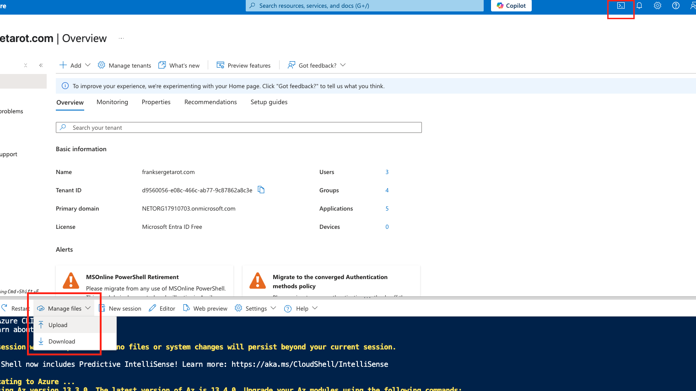

After uploading the script, you will execute it by running in the PowerShell terminal:
```
./AppCreationAndConfig.ps1
```

The script will prompt you for the required naming and access details. You will be prompted to name your registration and provide your **tenant id**, as well as the defined **role** (this should be **analyst**). You will also be prompted to name the app resources and app client. You can name them something simple like **cortexappresource** and **cortexappclient**.

This should all take about 1-2 minutes!

Upon completion, the script generates a snowflakeinfo.txt file containing the connection details. You will then download the snowflakeinfo.txt file and use that code to create your security integration and user in Snowflake.

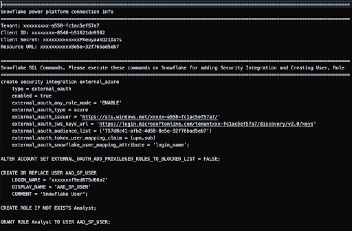


In a Snowflake SQL worksheet, copy and execute the **Snowflake SQL Commands** to create the security integration, role, and user in Snowflake.

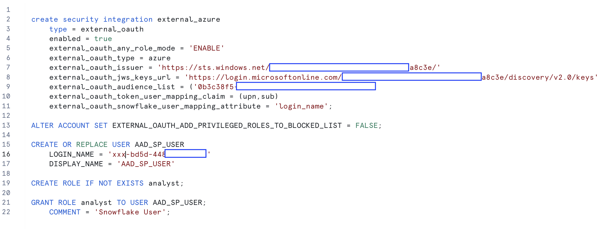

> **NOTE**: Keep the section titled **Snowflake power platform connection info** (Tenant, Client ID, Client Secret, Resource URL). You will need to reference these values when configuring the connection inside Copilot Studio to Snowflake. 

*If you already have a security integration for something like PowerBI you will have to [alter the security integration](https://docs.snowflake.com/en/sql-reference/sql/alter-security-integration-oauth-external) by adding the new audience url and mapping name, mapping attribute must remain 'login_name'.*

<!-- ------------------------ -->
## Set Up Snowflake Environment

This phase establishes the full environment that the Microsoft Copilot will access. Run the following commands in your Snowflake SQL worksheet to create the tables, load the sample sales data, and create the necessary warehouse.

```sql
-- Create database and schema
USE ROLE ACCOUNTADMIN;
CREATE OR REPLACE DATABASE sales_intelligence;
CREATE OR REPLACE SCHEMA sales_intelligence.data;
CREATE OR REPLACE WAREHOUSE sales_intelligence_wh;

-- Create tables for sales data
CREATE TABLE sales_conversations (
    conversation_id VARCHAR,
    transcript_text TEXT,
    customer_name VARCHAR,
    deal_stage VARCHAR,
    sales_rep VARCHAR,
    conversation_date TIMESTAMP,
    deal_value FLOAT,
    product_line VARCHAR
);

CREATE TABLE sales_metrics (
    deal_id FLOAT PRIMARY KEY,
    customer_name VARCHAR,
    deal_value FLOAT,
    close_date DATE,
    sales_stage VARCHAR,
    win_status BOOLEAN,
    sales_rep VARCHAR,
    product_line VARCHAR
);

-- First, let's insert data into sales_conversations
INSERT INTO sales_conversations 
(conversation_id, transcript_text, customer_name, deal_stage, sales_rep, conversation_date, deal_value, product_line)
VALUES
('CONV001', 'Initial discovery call with TechCorp Inc''s IT Director and Solutions Architect. Client showed strong interest in our enterprise solution features, particularly the automated workflow capabilities. Main discussion centered around integration timeline and complexity. They currently use Legacy System X for their core operations and expressed concerns about potential disruption during migration. Team asked detailed questions about API compatibility and data migration tools. Action items: 1) Provide detailed integration timeline document 2) Schedule technical deep-dive with their infrastructure team 3) Share case studies of similar Legacy System X migrations. Client mentioned Q2 budget allocation for digital transformation initiatives. Overall positive engagement with clear next steps.', 'TechCorp Inc', 'Discovery', 'Sarah Johnson', '2024-01-15 10:30:00', 75000, 'Enterprise Suite'),

('CONV002', 'Follow-up call with SmallBiz Solutions'' Operations Manager and Finance Director. Primary focus was on pricing structure and ROI timeline. They compared our Basic Package pricing with Competitor Y''s small business offering. Key discussion points included: monthly vs. annual billing options, user license limitations, and potential cost savings from process automation. Client requested detailed ROI analysis focusing on: 1) Time saved in daily operations 2) Resource allocation improvements 3) Projected efficiency gains. Budget constraints were clearly communicated - they have a maximum budget of $30K for this year. Showed interest in starting with basic package with room for potential upgrade in Q4. Need to provide competitive analysis and customized ROI calculator by next week.', 'SmallBiz Solutions', 'Negotiation', 'Mike Chen', '2024-01-16 14:45:00', 25000, 'Basic Package'),

('CONV003', 'Strategy session with SecureBank Ltd''s CISO and Security Operations team. Extremely positive 90-minute deep dive into our Premium Security package. Customer emphasized immediate need for implementation due to recent industry compliance updates. Our advanced security features, especially multi-factor authentication and encryption protocols, were identified as perfect fits for their requirements. Technical team was particularly impressed with our zero-trust architecture approach and real-time threat monitoring capabilities. They''ve already secured budget approval and have executive buy-in. Compliance documentation is ready for review. Action items include: finalizing implementation timeline, scheduling security audit, and preparing necessary documentation for their risk assessment team. Client ready to move forward with contract discussions.', 'SecureBank Ltd', 'Closing', 'Rachel Torres', '2024-01-17 11:20:00', 150000, 'Premium Security'),

('CONV004', 'Comprehensive discovery call with GrowthStart Up''s CTO and Department Heads. Team of 500+ employees across 3 continents discussed current challenges with their existing solution. Major pain points identified: system crashes during peak usage, limited cross-department reporting capabilities, and poor scalability for remote teams. Deep dive into their current workflow revealed bottlenecks in data sharing and collaboration. Technical requirements gathered for each department. Platform demo focused on scalability features and global team management capabilities. Client particularly interested in our API ecosystem and custom reporting engine. Next steps: schedule department-specific workflow analysis and prepare detailed platform migration plan.', 'GrowthStart Up', 'Discovery', 'Sarah Johnson', '2024-01-18 09:15:00', 100000, 'Enterprise Suite'),

('CONV005', 'In-depth demo session with DataDriven Co''s Analytics team and Business Intelligence managers. Showcase focused on advanced analytics capabilities, custom dashboard creation, and real-time data processing features. Team was particularly impressed with our machine learning integration and predictive analytics models. Competitor comparison requested specifically against Market Leader Z and Innovative Start-up X. Price point falls within their allocated budget range, but team expressed interest in multi-year commitment with corresponding discount structure. Technical questions centered around data warehouse integration and custom visualization capabilities. Action items: prepare detailed competitor feature comparison matrix and draft multi-year pricing proposals with various discount scenarios.', 'DataDriven Co', 'Demo', 'James Wilson', '2024-01-19 13:30:00', 85000, 'Analytics Pro'),

('CONV006', 'Extended technical deep dive with HealthTech Solutions'' IT Security team, Compliance Officer, and System Architects. Four-hour session focused on API infrastructure, data security protocols, and compliance requirements. Team raised specific concerns about HIPAA compliance, data encryption standards, and API rate limiting. Detailed discussion of our security architecture, including: end-to-end encryption, audit logging, and disaster recovery protocols. Client requires extensive documentation on compliance certifications, particularly SOC 2 and HITRUST. Security team performed initial architecture review and requested additional information about: database segregation, backup procedures, and incident response protocols. Follow-up session scheduled with their compliance team next week.', 'HealthTech Solutions', 'Technical Review', 'Rachel Torres', '2024-01-20 15:45:00', 120000, 'Premium Security'),

('CONV007', 'Contract review meeting with LegalEase Corp''s General Counsel, Procurement Director, and IT Manager. Detailed analysis of SLA terms, focusing on uptime guarantees and support response times. Legal team requested specific modifications to liability clauses and data handling agreements. Procurement raised questions about payment terms and service credit structure. Key discussion points included: disaster recovery commitments, data retention policies, and exit clause specifications. IT Manager confirmed technical requirements are met pending final security assessment. Agreement reached on most terms, with only SLA modifications remaining for discussion. Legal team to provide revised contract language by end of week. Overall positive session with clear path to closing.', 'LegalEase Corp', 'Negotiation', 'Mike Chen', '2024-01-21 10:00:00', 95000, 'Enterprise Suite'),

('CONV008', 'Quarterly business review with GlobalTrade Inc''s current implementation team and potential expansion stakeholders. Current implementation in Finance department showcasing strong adoption rates and 40% improvement in processing times. Discussion focused on expanding solution to Operations and HR departments. Users highlighted positive experiences with customer support and platform stability. Challenges identified in current usage: need for additional custom reports and increased automation in workflow processes. Expansion requirements gathered from Operations Director: inventory management integration, supplier portal access, and enhanced tracking capabilities. HR team interested in recruitment and onboarding workflow automation. Next steps: prepare department-specific implementation plans and ROI analysis for expansion.', 'GlobalTrade Inc', 'Expansion', 'James Wilson', '2024-01-22 14:20:00', 45000, 'Basic Package'),

('CONV009', 'Emergency planning session with FastTrack Ltd''s Executive team and Project Managers. Critical need for rapid implementation due to current system failure. Team willing to pay premium for expedited deployment and dedicated support team. Detailed discussion of accelerated implementation timeline and resource requirements. Key requirements: minimal disruption to operations, phased data migration, and emergency support protocols. Technical team confident in meeting aggressive timeline with additional resources. Executive sponsor emphasized importance of going live within 30 days. Immediate next steps: finalize expedited implementation plan, assign dedicated support team, and begin emergency onboarding procedures. Team to reconvene daily for progress updates.', 'FastTrack Ltd', 'Closing', 'Sarah Johnson', '2024-01-23 16:30:00', 180000, 'Premium Security'),

('CONV010', 'Quarterly strategic review with UpgradeNow Corp''s Department Heads and Analytics team. Current implementation meeting basic needs but team requiring more sophisticated analytics capabilities. Deep dive into current usage patterns revealed opportunities for workflow optimization and advanced reporting needs. Users expressed strong satisfaction with platform stability and basic features, but requiring enhanced data visualization and predictive analytics capabilities. Analytics team presented specific requirements: custom dashboard creation, advanced data modeling tools, and integrated BI features. Discussion about upgrade path from current package to Analytics Pro tier. ROI analysis presented showing potential 60% improvement in reporting efficiency. Team to present upgrade proposal to executive committee next month.', 'UpgradeNow Corp', 'Expansion', 'Rachel Torres', '2024-01-24 11:45:00', 65000, 'Analytics Pro');

-- Now, let's insert corresponding data into sales_metrics
INSERT INTO sales_metrics 
(deal_id, customer_name, deal_value, close_date, sales_stage, win_status, sales_rep, product_line)
VALUES
('001', 'TechCorp Inc', 75000, '2024-02-15', 'Closed', true, 'Sarah Johnson', 'Enterprise Suite'),

('002', 'SmallBiz Solutions', 25000, '2024-02-01', 'Lost', false, 'Mike Chen', 'Basic Package'),

('003', 'SecureBank Ltd', 150000, '2024-01-30', 'Closed', true, 'Rachel Torres', 'Premium Security'),

('004', 'GrowthStart Up', 100000, '2024-02-10', 'Pending', false, 'Sarah Johnson', 'Enterprise Suite'),

('005', 'DataDriven Co', 85000, '2024-02-05', 'Closed', true, 'James Wilson', 'Analytics Pro'),

('006', 'HealthTech Solutions', 120000, '2024-02-20', 'Pending', false, 'Rachel Torres', 'Premium Security'),

('007', 'LegalEase Corp', 95000, '2024-01-25', 'Closed', true, 'Mike Chen', 'Enterprise Suite'),

('008', 'GlobalTrade Inc', 45000, '2024-02-08', 'Closed', true, 'James Wilson', 'Basic Package'),

('009', 'FastTrack Ltd', 180000, '2024-02-12', 'Closed', true, 'Sarah Johnson', 'Premium Security'),

('010', 'UpgradeNow Corp', 65000, '2024-02-18', 'Pending', false, 'Rachel Torres', 'Analytics Pro');

-- Enable change tracking
ALTER TABLE sales_conversations SET CHANGE_TRACKING = TRUE;

-- Create the search service
CREATE OR REPLACE CORTEX SEARCH SERVICE sales_conversation_search
  ON transcript_text
  ATTRIBUTES customer_name, deal_stage, sales_rep
  WAREHOUSE = sales_intelligence_wh
  TARGET_LAG = '1 hour'
  AS (
    SELECT
        transcript_text,
        customer_name,
        deal_stage,
        sales_rep,
        conversation_date
    FROM sales_conversations
    WHERE conversation_date >= '2024-01-01' 
);

CREATE OR REPLACE STAGE models DIRECTORY = (ENABLE = TRUE);
```

Setting up Cortex Analyst
- In Snowsight, navigate to **AI & ML » Cortex Analyst**.
- Select SALES_INTELLIGENCE.DATA as the Database and Schema.
- Select **Create New » Create new Semantic View**.
 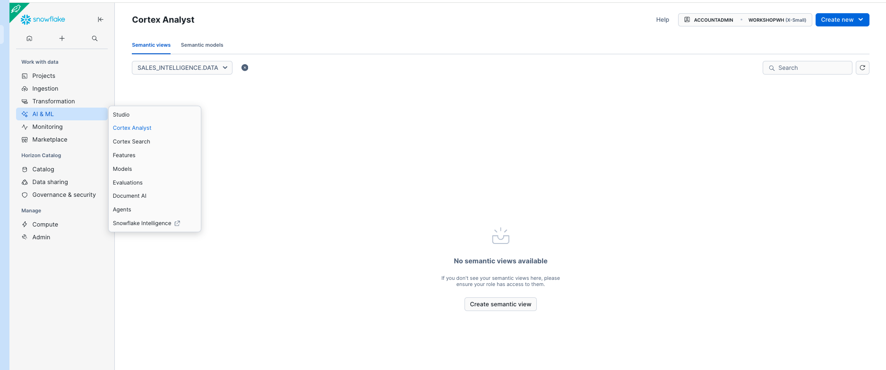

 Select the MODELS Stage and name the Analyst Service SALES_METRICS_MODEL and select **Next**.
 - Select the SALES_INTELLIGENCE database and the SALES_METRICS table then select **Next**.
 - Select all of the columns and select **Create and Save**.

> **NOTE**: This is a VERY simple Analyst service. You can click through the dimensions and see that Cortex used LLMs to write descriptions and synonyms for each of the dimensions. We're going to leave this as-is, but know that you can adjust this as needed to enhance the performance of Cortex Analyst.
 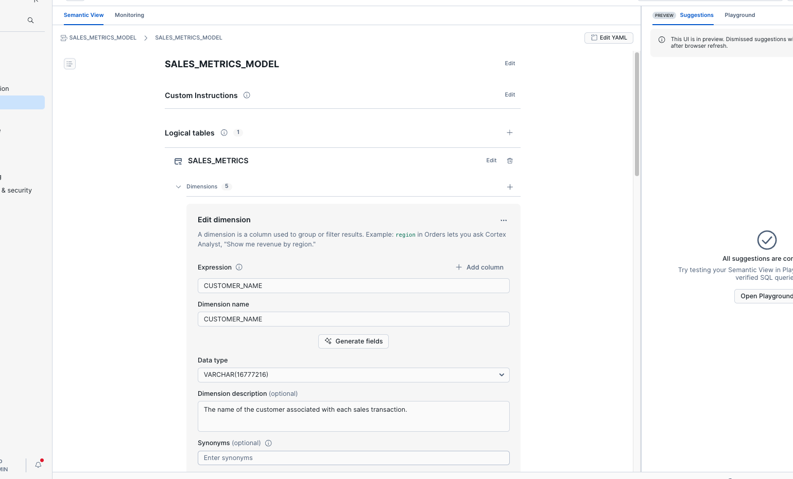

Setting up Cortex Agent
- In Snowsight, navigate to **AI & ML » Cortex Agent**.
- Select SALES_INTELLIGENCE.DATA as the Database and Schema.
- Select **Create Agent**.
- Name the agent SALES_INTELLIGENCE_AGENT and create the agent.


Let's add the tools and orchestration to the agent
- Select **Edit** in the top right.
- Select **Tools** and **Add** by Cortex Analyst.
- Select SALES_INTELLIGENCE.DATA as the Database and Schema.
- Select the SALES_METRICS_MODEL and generate a Description with Cortex AI.
- Select **Add**


- Select **Add** by Cortex Search.
- Select SALES_INTELLIGENCE.DATA as the Database and Schema.
- Select the SALES_CONVERSATION_SEARCH.
- Enter the name SALES_CONVERSATION_SEARCH and enter the description "the search service is for providing information on sales call transcripts".
- Select **Add**.


- Select **Orchestration** and leave the model set to **auto**.
- Add the following orchestration instructions, "use the analyst tool for sales metric and the search tool for call details, be quick with decisions efficiency is important".
- Add the following response instructions, "make the response concise and direct so that a strategic sales person can quickly understand the information provided. Provide answers that are suitable for all chat interfaces with no visualizations and quick and brief responses".
- Click on **Access** and select the Analyst role.
- Select **Save**.


Cortex Agent with Analyst and Search offers a highly accurate text to sql generator, along with an efficient hybrid search service wrapped in an efficient data agent.

The last step is granting the correct role permissions and creating a [Stored Procedure](https://docs.snowflake.com/en/developer-guide/stored-procedure/stored-procedures-overview). The Copilot Studio will call this procedure to trigger the Agent logic. Run the below code in the same SQL worksheet to create a Stored Procedure that calls the Snowflake Cortex Agent that will orchestrate with the provided tools and return an answer.

```sql
USE ROLE ACCOUNTADMIN;
GRANT USAGE ON DATABASE SALES_INTELLIGENCE TO ROLE ANALYST;
GRANT DATABASE ROLE SNOWFLAKE.CORTEX_AGENT_USER TO ROLE ANALYST;
GRANT DATABASE ROLE SNOWFLAKE.CORTEX_ANALYST_USER TO ROLE ANALYST;
GRANT USAGE ON SCHEMA DATA TO ROLE ANALYST;
GRANT USAGE ON CORTEX SEARCH SERVICE SALES_CONVERSATION_SEARCH TO ROLE ANALYST;
GRANT SELECT ON TABLE SALES_INTELLIGENCE.DATA.SALES_METRICS TO ROLE ANALYST;
GRANT USAGE ON WAREHOUSE SALES_INTELLIGENCE_WH TO ROLE ANALYST;

GRANT ROLE ACCOUNTADMIN TO ROLE ANALYST;

CREATE OR REPLACE PROCEDURE call_cortex_agent_proc(query STRING)
RETURNS STRING
LANGUAGE PYTHON
RUNTIME_VERSION = '3.9'
PACKAGES = ('snowflake-snowpark-python')
HANDLER = 'call_sales_intelligence_agent_proc'
EXECUTE AS CALLER
AS $$
import json
import _snowflake

def call_sales_intelligence_agent_proc(query: str):
    API_ENDPOINT = "/api/v2/databases/SALES_INTELLIGENCE/schemas/DATA/agents/SALES_INTELLIGENCE_AGENT:run"
    API_TIMEOUT = 15000  # this can be adjusted
    
    # Force very quick response
    speed_query = f"Quick answer: {query}"

    payload = {
        "messages": [
            {
                "role": "user",
                "content": [
                    {
                        "type": "text",
                        "text": speed_query
                    }
                ]
            }
        ]
    }

    try:
        resp = _snowflake.send_snow_api_request(
            "POST", API_ENDPOINT, {}, {}, payload, None, API_TIMEOUT
        )

        if resp["status"] != 200:
            return f"Error: {resp['status']}"

        response_content = json.loads(resp["content"])
        
        # Super fast processing - take first text found
        for event in response_content:
            event_type = event.get("event")
            
            if event_type == "response.text":
                return event.get("data", {}).get("text", "")
            elif event_type == "response.text.delta":
                text = event.get("data", {}).get("delta", {}).get("text", "")
                if text:
                    return text  # Return immediately on first text chunk
        
        return "No response within time limit"

    except Exception as e:
        return f"Timeout or error: {str(e)}"
$$;
```

After the creation of stored_proc, let's test and verify the stored procedure works. If the test call returns a successful summary of the conversation, your Agent is ready to connect to Microsoft Copilot Studio.

```sql
call call_cortex_agent_proc('what is the Initial discovery call with TechCorp Inc about') 
```
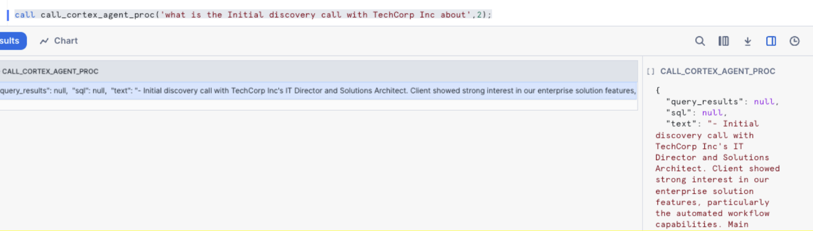


<!-- ------------------------ -->
## Configuring Copilot Agent

**NOTE:** This quickstart shows how to set up the connectivity with **Triggers** in Copilot Studio, but you can also use **Tools** with a similar flow to use Cortex.

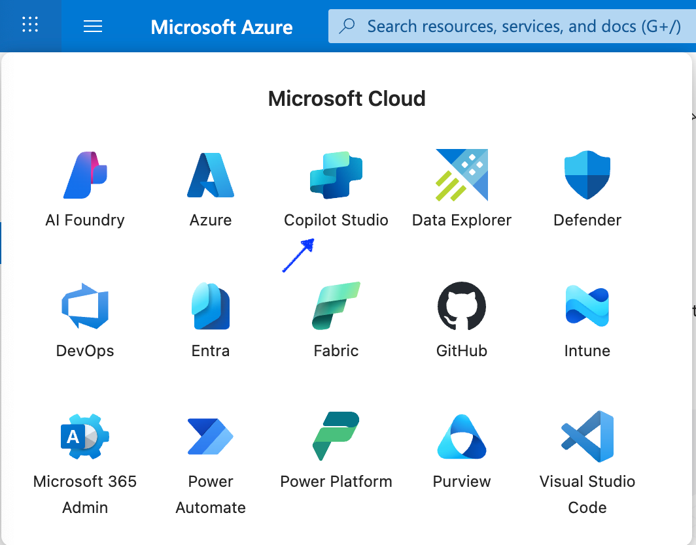

Go to your Microsoft Copilot Studio or select Copilot Studio from your Azure Portal.
- Select **Agents**
- Select **New agent**
- Select Skip to **Configure**
- Name the Agent something like **“Sales Agent”**
- Select **Create**

After several seconds, you should see your new Sales Agent.

### Configuring Copilot Agent

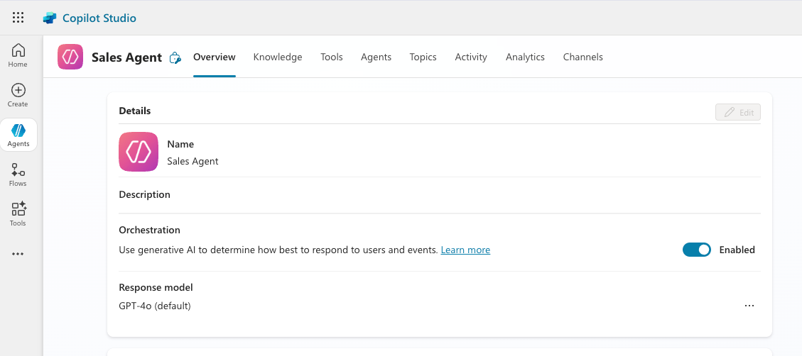

**Select Add a topic » From blank**

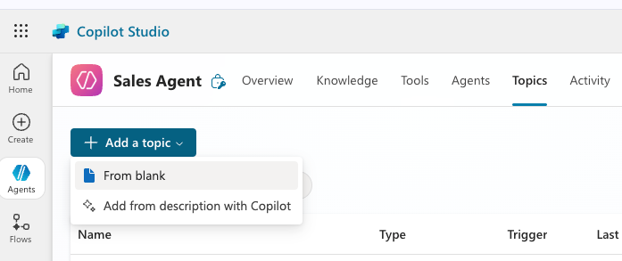

The Trigger, default to **The agent chooses** displays.

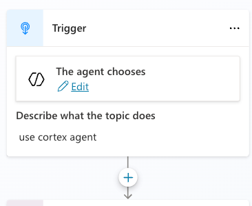

Select **Edit** under and enter the text **"use cortex agent"**. Then select the plus sign. This phrase will act as a **trigger** in the Copilot to use the Cortex Agent we just created.

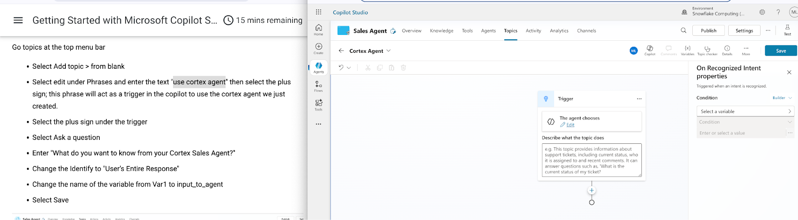

Select the plus sign under the trigger
- Select Ask a question
- Enter "What do you want to know from your Cortex Sales Agent?"
- Change the Identify to "User's Entire Response"
- Change the name of the variable from Var1 to input_to_agent


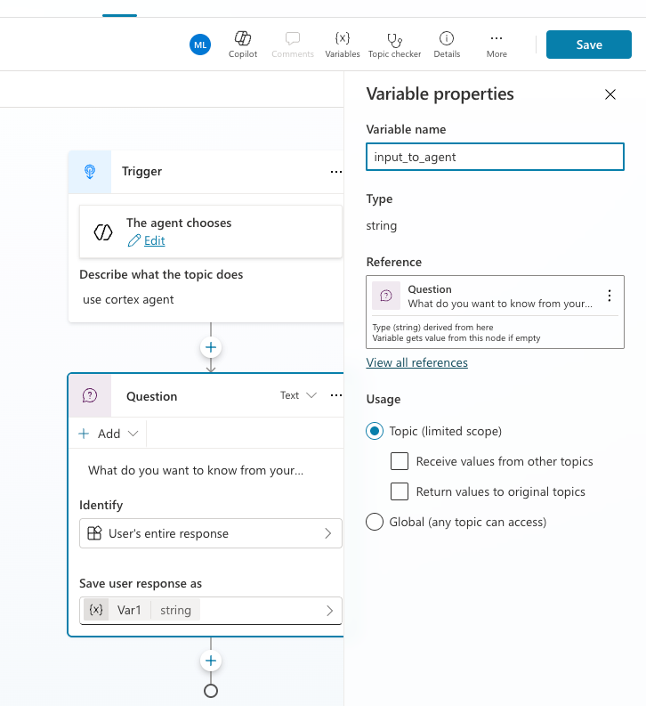

Click on Save. 
Click on the plus sign under the Question. 

**Select Add a tool, New Agent flow under the Question activity**.

A new window opens the Agent flows page, similar to this:

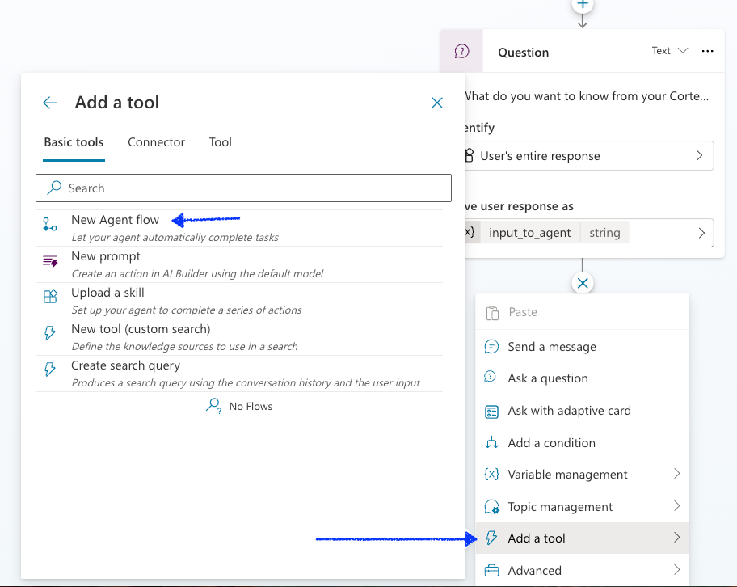

Click on the + icon, In between the “When an agent calls the flow” and ‘Respond to the agent’.

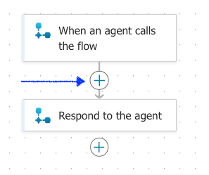

- In the Add an action popup
- Search for "snowflake" and select Submit SQL Statement for Execution

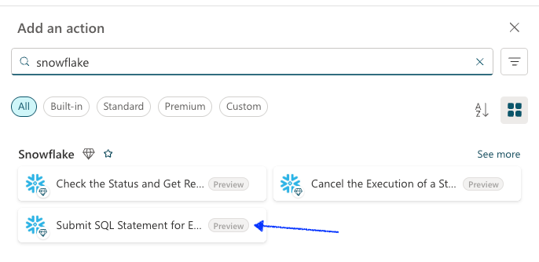

### Create a Snowflake Connection

Enter in the connection parameters (refer to the snowflakeinfo.txt downloaded from the OAuth set up) here. This should look similar to below:

For Resource URL: this can be obtained from the snowflakeinfo.text
<resource URL>

For example: xxxxx-32f76bad5eb7

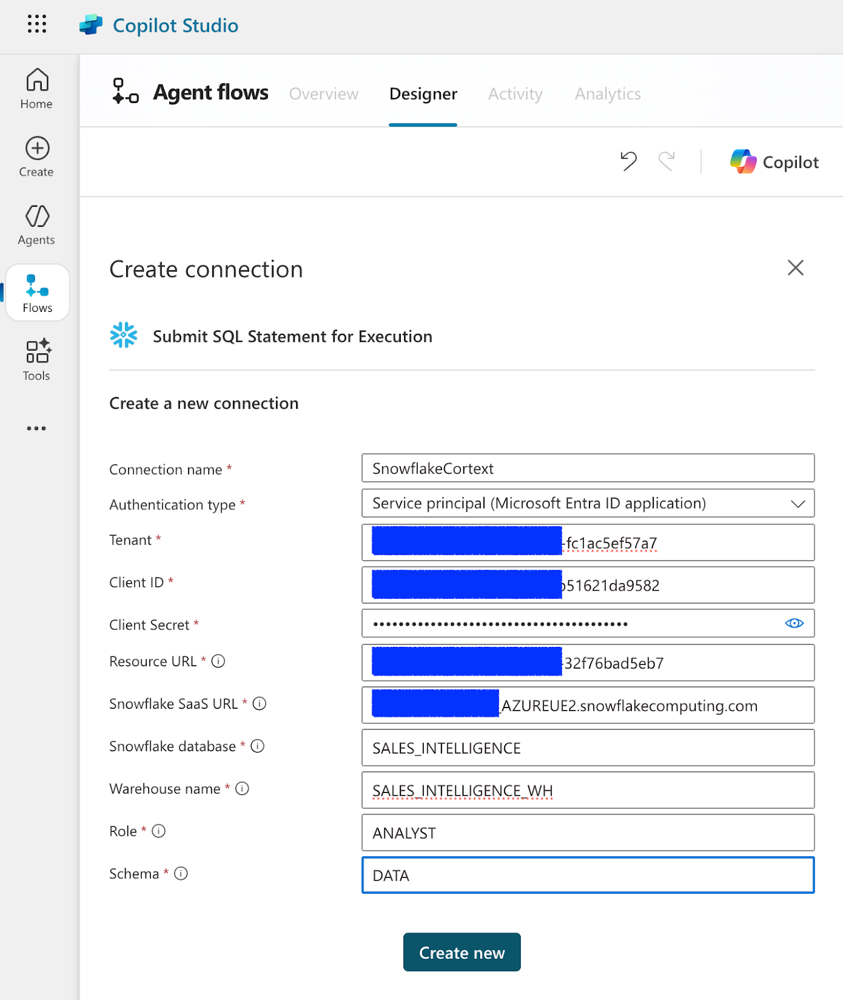

Under Parameters select: 
- Body/Statement
- Database
- Schema
- Warehouse
- Role

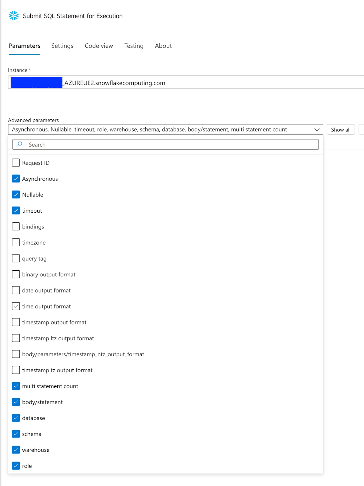

Enter the values as shown in the screenshot below:
- For the Body/Statement parameter, enter this query

```sql
CALL sales_intelligence.data.call_cortex_agent_proc('<>');
```

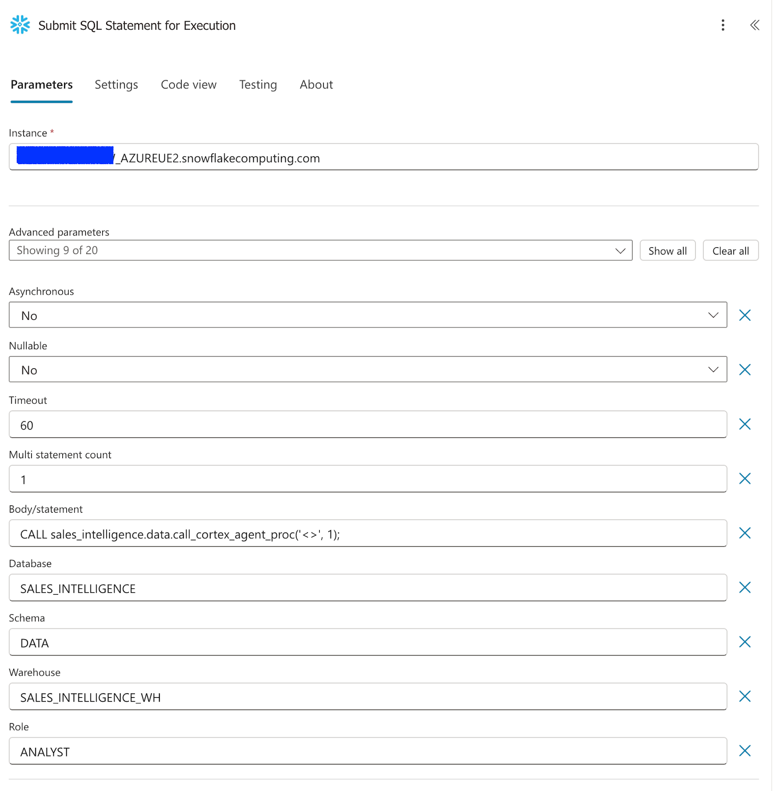


Select the Run a flow from Copilot action. Add an input parameter named copilot_prompt.

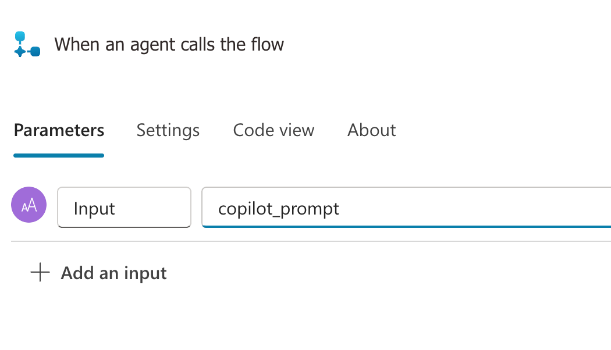

Select the **Respond to the Agent** add an output **Parameter**.
For the type of output, choose **Text**  and named **output_to_copilot**, in the "Enter a value to respond with" select the **lightning bolt** (or enter / and select **dynamic content**), search for "data".

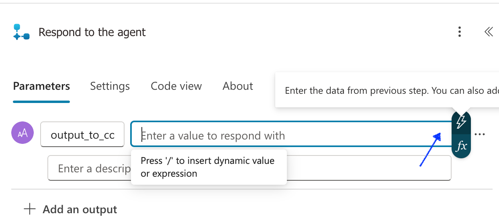

- Select **body/Data**

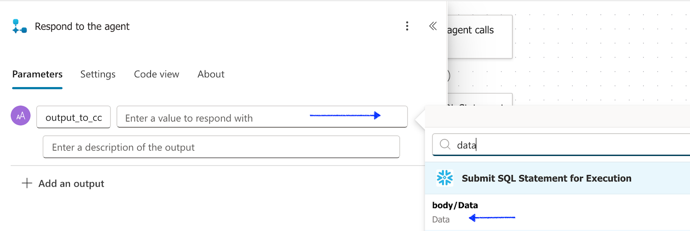

- Save and publish the flow

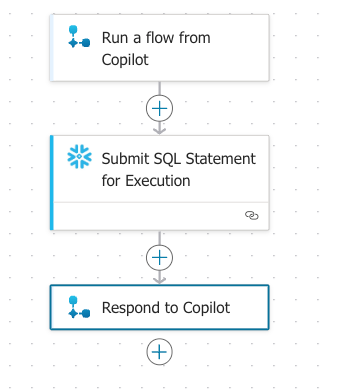

Go back to the Copilot Studio browser:
- Select the plus sign below the Question activity and select "Add an action" and you will see a new option for "Run a flow from Copilot"
- For the empty parameter value select input_to_agent directing the copilot prompt to go to the flow
- Select the plus sign under the Flow action and select send a message


- Click on the parameter {x} and select the output_to_copilot variable we created earlier

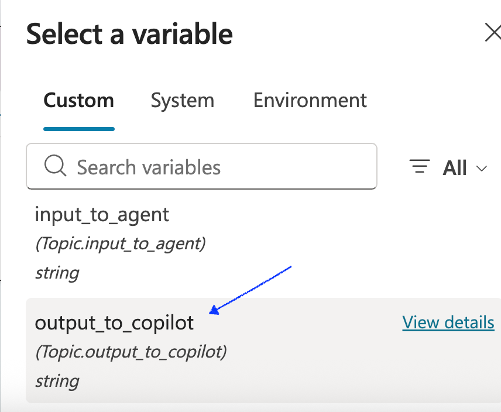

- Save the flow

Go back to the Flow window and select Submit SQL Statement for Execution.
In the Body/statement parameter where we call the stored procedure remove the <> , select the lightning bolt and select the copilot_prompt parameter. LEAVE THE SINGLE QUOTES IN THE QUERY!

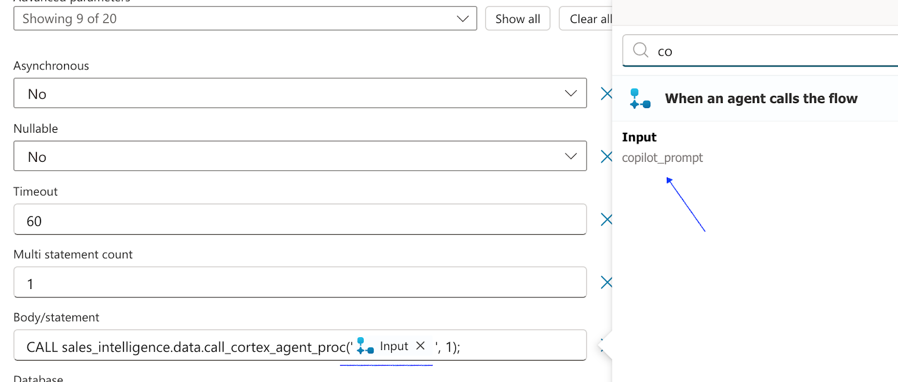

**Save and publish the flow!**

### Now let's test the Agent!
- Go back to the Copilot Studio, make sure the Copilot is saved.
- Select Test in the top right corner and enter "use cortex agent".
- Once asked what you to know from the Cortex Sales Agent type "tell me about securebank".
- You be prompted to connect or retry, select connect and a new window will pop up where you can connect to your Snowflake connection. This is a one time connection.
- Go back to the Copilot and select retry.
- You will see results from a call with Securebank, the Cortex agent used the Cortex Search tool to provide the results.
- Now you can update the stored procedure or Flow to better output the results or you can immediately ask the agent "can you summarize this call" and it will use Azure OpenAI to summarize the call.
- Enter "use cortex agent" once more and after the prompt type "what was the size of the securebank deal?" Now the Agent is using Cortex Analyst to return results from a SQL query. Ask the Copilot "just show me the deal value" and you'll see below.

> **NOTE**: If you expect (and are comfortable with) long running flows, users can increase the Timeout value on the Snowflake Execute SQL action. However, users can also provide additional instructions to the Cortex Agent to maximize efficiency.


<!-- ------------------------ -->
## Conclusion and Resources

Congratulations! You have successfully completed this integration! You have built a secure, powerful bridge between your enterprise data in Snowflake Cortex Agents and your user interface in Microsoft Copilot Studio.

### Technical Considerations
This quickstart showed you how to set up the connection to Cortex Agents from Microsoft Copilot. We focused on setting up one specific trigger, which was the one that routes questions to your Snowflake Agent. In order to make for a more robust Copilot, you will likely add additional triggers to other Agents or Knowledge Sources so that your Copilot is more versatile and can act on specific prompts/triggers.

### What You Learned
By following this quickstart, you learned how to:
- Create Snowflake Cortex Services for Search, Analyst, and Agents
- Create a Microsoft 365 Copilot 
- Connect your Microsoft Copilot to the Cortex Agent

### Resources
- Learn more about the complete [Snowflake Cortex set of features](/en/product/features/cortex/)
- Learn more about using [Agents in Cortex](https://docs.snowflake.com/en/user-guide/snowflake-cortex/cortex-agents)
- Learn more about using [Microsoft Copilot Studio](https://www.microsoft.com/en-us/microsoft-copilot/microsoft-copilot-studio)
- This quickstart shows you how to build custom Copilots with Snowflake Cortex. In 2025 there will be an easier way to connect a 365 or Teams Copilot to any agent in Snowflake. See the announcement in the bottom [here](/en/news/press-releases/snowflake-securely-integrates-microsoft-azure-openai-service-to-provide-access-to-the-latest-openai-models-with-expanded-microsoft-partnership/).

<!-- ------------------------ -->
## Appendix

This section shows the steps required to configure Oauth in Entra ID manually. This entire workflow was automated with the PowerShell script in the [Configure OAuth Section](#configure-oauth)

### Configure the OAuth resource in Microsoft Entra ID
- Navigate to the Microsoft Azure Portal and authenticate.
- Navigate to Microsoft Entra ID.
- Click on App Registrations.
- Click on New Registration.
- Enter Snowflake OAuth Resource, or similar value as the Name.
- Verify the Supported account types are set to Single Tenant.
- Click Register.
- Click on Expose an API.
- Click on the link next to Application ID URI to Add the Application ID URI. Application ID URI will be of the format Application ID URI <api://9xxxxxxxxxxxxxxxxxx>
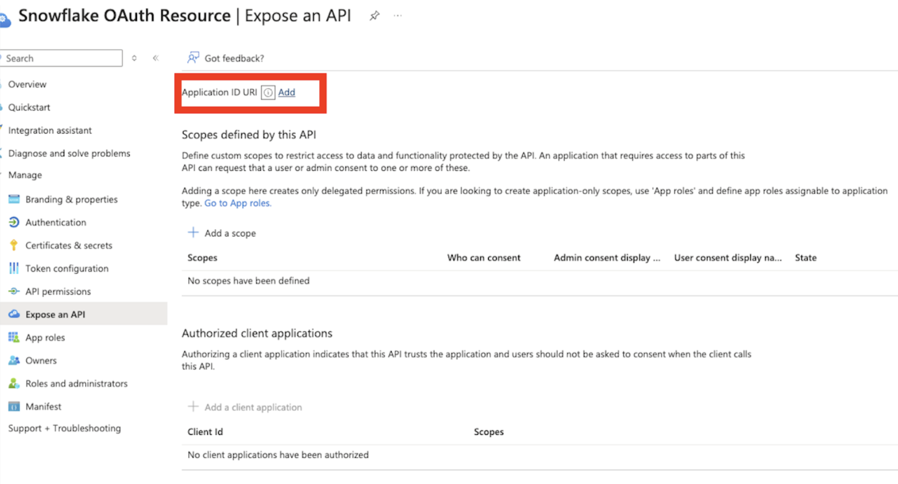

To add a Snowflake Role as a Role for OAuth flows where the programmatic client requests an 	access token for itself:
- Click on Manifest.
- Locate the appRoles element.
- Enter an App Role with the following settings, the Snowflake role should be the one which has access to a warehouse, and usage privileges on the schema (check here for details on manifest values).
- See the sample definition below:
The App Role manifests as follows. Avoid using high-privilege roles like ACCOUNTADMIN, SECURITYADMIN or ORGADMIN. 
```json
"appRoles":[
     {
         "allowedMemberTypes": [ "Application"],
         "description": "Analyst.",
         "displayName": "Analyst",
         "id": "3ea51f40-2ad7-4e79-aa18-12c45156dc6a",
         "isEnabled": true,
         "origin": "Application",
         "value": "session:role:analyst"
     }
 ]
```

### Create an OAuth client in Microsoft Entra ID
- Navigate to the Microsoft Azure Portal and authenticate.
- Navigate to Azure Active Directory.
- Click on App Registrations.
- Click on New Registration.
- Enter a name for the client such as Snowflake OAuth Client.
- Verify the Supported account types are set to Single Tenant.
- Click Register.
- In the Overview section, copy the ClientID from the Application (client) ID field. This will be known as the <OAUTH_CLIENT_ID> in the following steps.
- Click on Certificates & secrets and then new client secret.
- Add a description of the secret.
- For testing purposes, select long-living secrets but for Production follow your security policies.
- Click Add. Copy the secret. This will be known as the <OAUTH_CLIENT_SECRET> in the following steps.


Click on API Permissions.
- Click on Add Permission
- Click on APIs My Organization Uses. 
- Search for and click on the Snowflake OAuth Resource you created in Configure the Oauth Resource in Microsoft EntraID
- Click on the Application Permissions. 
- Check on the Permission related to the Roles manually defined in the Manifest of the Application that you wish to grant to this client.
- Click Add Permissions.
- Click on the Grant Admin Consent button to grant the permissions to the client. Note that for testing purposes, permissions are configured this way. However, in a production environment, granting permissions in this manner is not advisable.
- Click Yes.

Collect Azure AD information for Snowflake
- Navigate to the Microsoft Azure Portal and authenticate.
- Navigate to Azure Active Directory.
- Click on App Registrations.
- Click on the Snowflake OAuth Resource that you created in Configure the Oauth Resource in Microsoft Entra ID
- Click on Endpoints in the Overview interface.
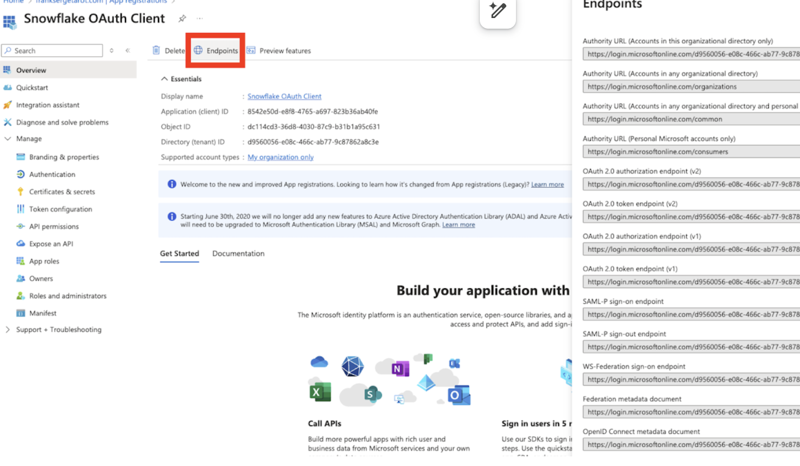

- On the right-hand side, copy the OAuth 2.0 token endpoint (v2) and note the URLs for OpenID Connect metadata and Federation Connect metadata.
- The OAuth 2.0 token endpoint (v2) will be known as the <AZURE_AD_OAUTH_TOKEN_ENDPOINT> in the following configuration steps. The endpoint should be similar to https://login.microsoftonline.com/<tenant-id>/oauth2/v2.0/token.
- For the OpenID Connect metadata, open in a new browser window.
- Locate the jwks_uri parameter and copy its value.
- This parameter value will be known as the <AZURE_AD_JWS_KEY_ENDPOINT> in the following configuration steps. The endpoint should be similar to https://login.microsoftonline.com/<tenant-id>/discovery/v2.0/keys.
- For the Federation metadata document, open the URL in a new browser window.
- Locate the "entityID" parameter in the XML Root Element and copy its value.
- This parameter value will be known as the <AZURE_AD_ISSUER> in the following configuration steps. The entityID value should be similar to https://sts.windows.net/<tenant-id>/.

### Validate Entra Authorization setup 
We recommend you test the configuration at this time, please use the curl below and check if ENTRA is issuing a token or any API testing tool like Insomnia or others.

```console
 curl -X POST -H "Content-Type: application/x-www-form-urlencoded;charset=UTF-8" --data-urlencode "client_id=<client_id from above>" --data-urlencode "client_secret=<Secret from above>" --data-urlencode "grant_type=client_credentials" --data-urlencode "scope=api://<Appl_URI_ID>/.default" 'https://login.microsoftonline.com/<tenant_id>/oauth2/v2.0/token'
```

After this take the token from the curl command and decode it here: jwt.ms. Extract the “sub” value, this will be the login name for the snowflake user you create for the azure SP.

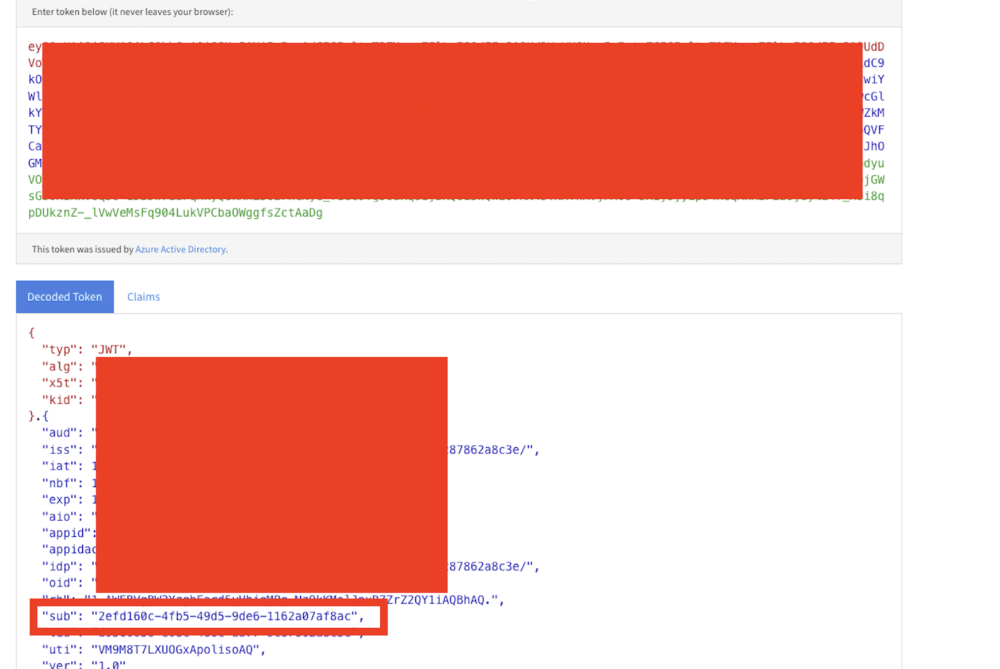

### Create a Snowflake security integration with audiences

The external_oauth_audience_list parameter of the security integration must match the Application ID URI that you specified while configuring Microsoft Entra ID.
Service Principal Authentication: 

```sql
create security integration external_oauth_azure
type = external_oauth
     enabled = true
     external_oauth_type = azure
     external_oauth_issuer = '<AZURE_AD_ISSUER>'
     external_oauth_jws_keys_url = '<AZURE_AD_JWS_KEY_ENDPOINT>'
     external_oauth_audience_list = ('<SNOWFLAKE_APPLICATION_ID_URI>')
     external_oauth_token_user_mapping_claim = ‘sub’    
     external_oauth_snowflake_user_mapping_attribute = 'login_name';
```

Create a user for Service Principal based connection:

The sub value should be mapped to a user in Snowflake, avoid using high privilege accounts Accountadmin, Orgadmin, Securityadmin. 

```sql
CREATE OR REPLACE USER SNOWSQL_OAUTH_USER 
LOGIN_NAME = '<sub value from decoded token>' 
DISPLAY_NAME = 'SnowSQL OAuth User' 
COMMENT = 'A system user for SnowSQL client to be used for OAuth based connectivity';
CREATE ROLE ANALYST;
GRANT ROLE ANALYST TO USER SNOWSQL_OAUTH_USER;
--To validate the token, execute below command in snowflake
select system$verify_external_oauth_token(‘<token>’);
```
