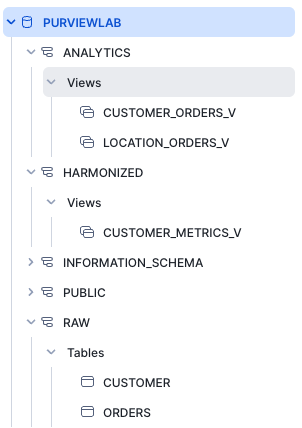
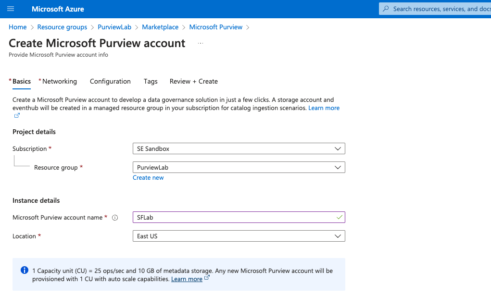
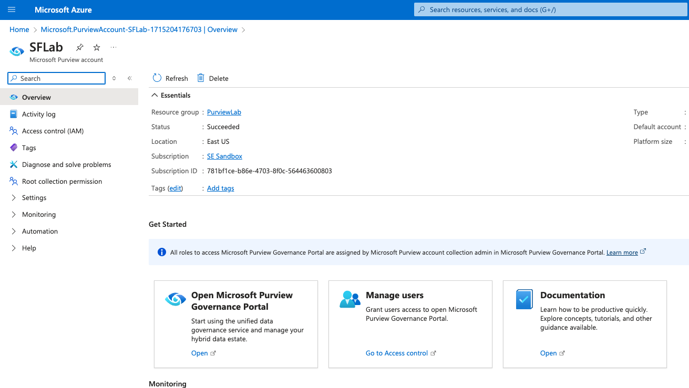
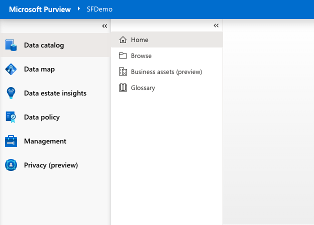
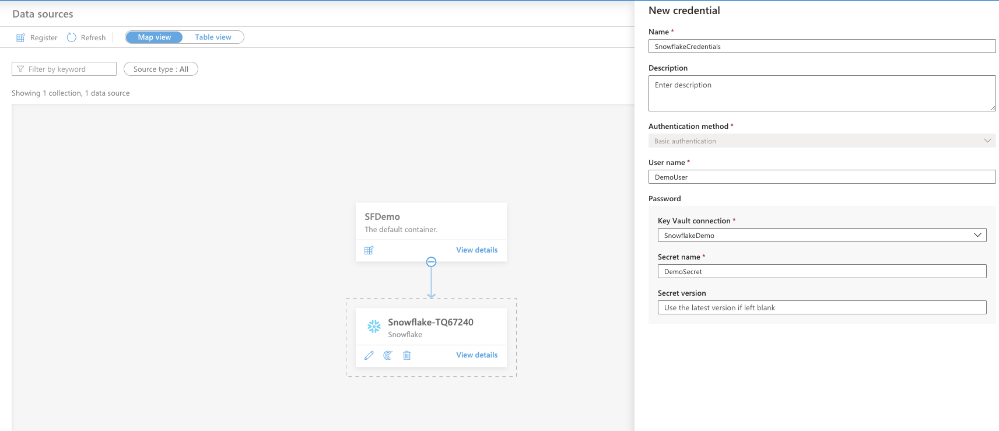
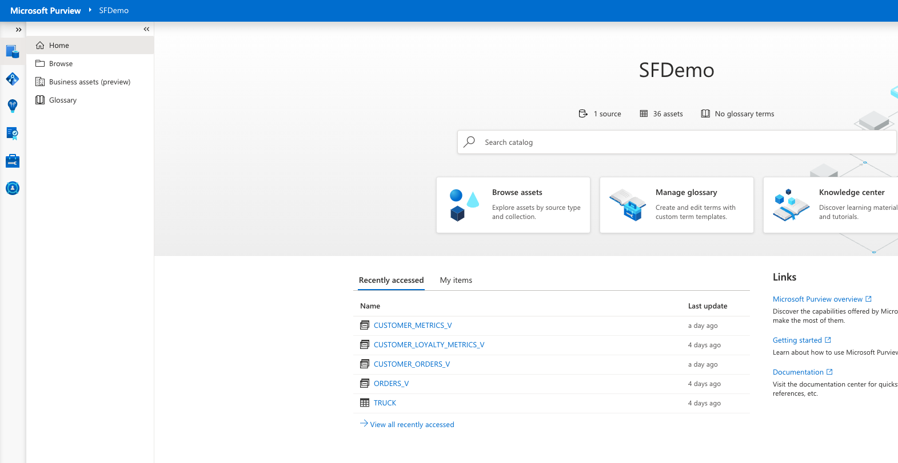
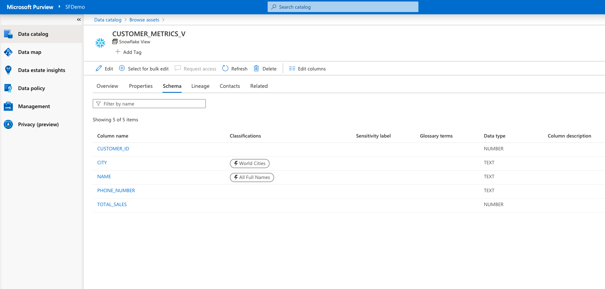
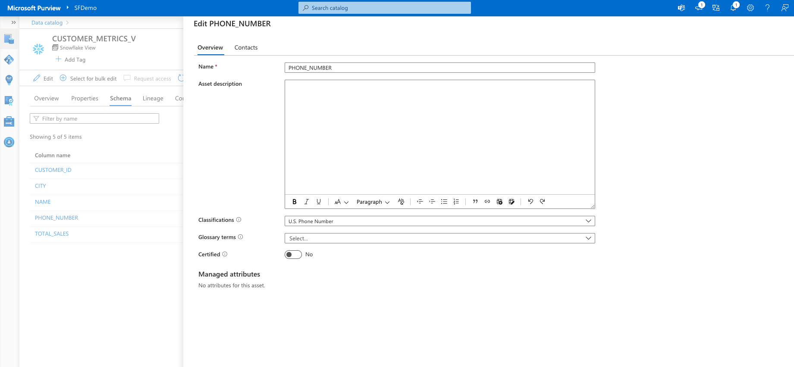
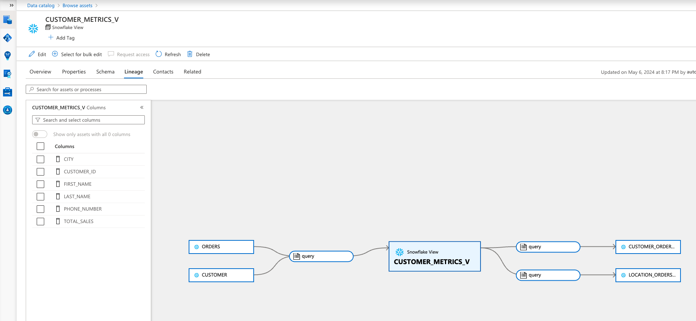
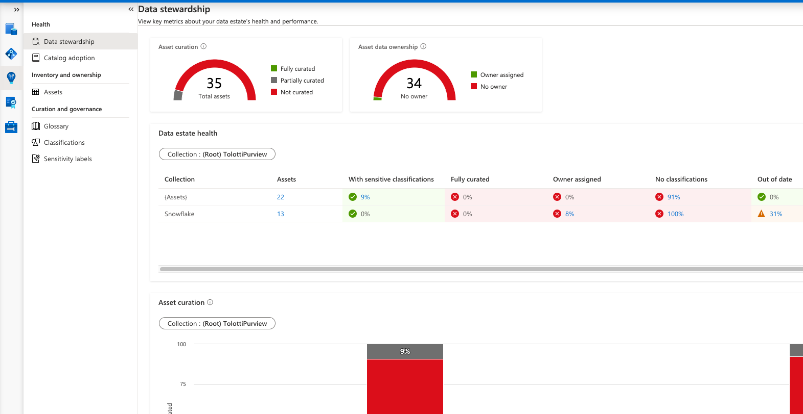

author: sfc-gh-etolotti
id: getting-started-with-microsoft-purview-and-snowflake
categories: snowflake-site:taxonomy/solution-center/certification/quickstart, snowflake-site:taxonomy/product/applications-and-collaboration
language: en
summary: This is a Quickstart for using Snowflake with Microsoft Purview 
environments: web
status: Published 
feedback link: https://github.com/Snowflake-Labs/sfguides/issues


# Getting Started with Microsoft Purview and Snowflake
<!-- ------------------------ -->
## Overview 

Snowflake Horizon is a built-in governance solution that helps users manage their data ecosystem. It provides a unified platform that supports five core pillars of data governance: compliance, security, privacy, interoperability, and access. These capabilities enable users to govern data, apps, and more across clouds, teams, partners, and customers. 
That interoperability works with Microsoft Purview, which extends the unified data governance solution to help you manage services across your entire Microsoft estate. These services include Azure storage services, Power BI, databases like SQL or Hive, file services, applications, and many more.

In this Quickstart you will create a data catalog demonstrating how to use Purview to increase the visibility of your Snowflake data objects, allowing you to easily manage your Snowflake data, as well as your larger Microsoft data ecosystem.


### Prerequisites
- Familiarity with Azure and an Azure account, and a Purview workspace

### What You Will Learn
- deploy Microsoft Purview
- set up a Snowflake database, and scan that data using Purview
- classify, label, and view lineage of your data

### What You Will Need 
- A free [Snowflake Account](https://signup.snowflake.com/?utm_source=snowflake-devrel&utm_medium=developer-guides&utm_cta=developer-guides)
- [Azure Account](https://azure.microsoft.com/en-us/free/search/?ef_id=_k_2ba2be3ad9791e57964fda0c62ccd55c_k_&OCID=AIDcmm5edswduu_SEM_k_2ba2be3ad9791e57964fda0c62ccd55c_k_&msclkid=2ba2be3ad9791e57964fda0c62ccd55c) with Purview

### What You Will Build 
You will create a Purview instance with a catalog of classified Snowflake data and lineage to track where your data comes from and where it gets used.

### Use Case
This use case will leverage sample retail data to register and scan that data source into Purview demonstrating how a Data Steward would manage, monitor, and classify the data under their domain. The use case also gives insight to how Snowflake data is being used in conjunction within their Azure environment.


<!-- ------------------------ -->
## Set Up Snowflake Environment

The first thing to do is create a database and warehouse in your Snowflake environment. Run the below code in a Snowflake worksheet. You are using the AccountAdmin role here for demo purposes, but in production you will likely use a different role.

```sql
--create database and warehouse
use role accountadmin;
CREATE OR REPLACE WAREHOUSE PURVIEWLAB_WH WITH WAREHOUSE_SIZE='X-SMALL';
CREATE OR REPLACE DATABASE PURVIEWLAB;
CREATE OR REPLACE SCHEMA RAW;
CREATE OR REPLACE SCHEMA HARMONIZED;
CREATE OR REPLACE SCHEMA ANALYTICS;

--create database and warehouse
create or replace TABLE PurviewLab.RAW.CUSTOMER (
	CUSTOMER_ID NUMBER(38,0),
	NAME VARCHAR(100) ,
	CITY VARCHAR(100) ,
	PHONE_NUMBER VARCHAR(100) 
);

INSERT INTO PurviewLab.RAW.CUSTOMER (CUSTOMER_ID, NAME,CITY,PHONE_NUMBER)
VALUES 
(1,'Rodolfo Tucker','Hamburg','(007)506-6068'),
(2,'Karla Mullen','Rio de Janeiro','(431)122-6142'),
(3,'Cortez Douglas','Paris','(157)518-3848'),
(4,'Janiya Pope','Krakow','(872)718-6879'),
(5,'Zaiden Knapp','Barcelona','(545)152-4832'),
(6,'Micah Beard','Hamburg','(535)753-3461'),
(7,'Ricardo Byrd','Barcelona','(138)082-1391'),
(8,'Marie Boyer','New York','(587)006-4451'),
(9,'Josie Glass','Stockholm','(023)863-4028'),
(10,'Korbin Ward','Cairo','(049)196-8102');

select * from frostbyte_tasty_bytes.analytics.customer_loyalty_metrics_v;

create or replace TABLE PurviewLab.RAW.ORDERS (
	ORDER_ID NUMBER(38,0),
	CUSTOMER_ID NUMBER(38,0),
	ORDER_TOTAL NUMBER(38,4)
);

INSERT INTO PurviewLab.RAW.ORDERS (ORDER_ID, CUSTOMER_ID,ORDER_TOTAL)
VALUES 
(1,1,11.0000),
(2,1,42.0000),
(3,1,33.0000),
(4,2,6.0000),
(5,2,5.0000),
(6,3,5.0000),
(7,3,6.0000),
(8,3,37.0000),
(9,3,11.0000),
(10,4,16.0000),
(11,5,24.0000),
(12,5,21.0000),
(13,6,17.0000),
(14,6,9.0000),
(15,6,13.0000),
(16,7,22.0000),
(17,8,34.0000),
(18,8,14.0000),
(19,9,25.0000),
(20,10,4.0000),
(21,10,18.0000);


create or replace view PurviewLab.HARMONIZED.CUSTOMER_METRICS_V AS 
SELECT 
    cl.customer_id,
    cl.city,
    cl.name,
    cl.phone_number,
    SUM(oh.order_total) AS total_sales
FROM PurviewLab.RAW.CUSTOMER cl
JOIN PurviewLab.RAW.ORDERS oh
ON cl.customer_id = oh.customer_id
GROUP BY cl.customer_id, cl.city, cl.name, cl.phone_number;


create or replace view PurviewLab.ANALYTICS.CUSTOMER_ORDERS_V
 as
SELECT CUSTOMER_ID, NAME, TOTAL_SALES FROM PurviewLab.HARMONIZED.CUSTOMER_METRICS_V;

create or replace view PurviewLab.ANALYTICS.LOCATION_ORDERS_V
 as
SELECT CITY, SUM(TOTAL_SALES) as TOTAL_SALES FROM PurviewLab.HARMONIZED.CUSTOMER_METRICS_V GROUP BY CITY;
```
This SQL has set up the data you'll scan and work with in Purview later in the Quickstart.

The result should look like this screenshot with tables, views, and schemas: 


<!-- ------------------------ -->
## Set Up Azure Environment

### Set Up Microsoft Purview

Now you need to set up your Purview instance.

1. From the Azure Marketplace, search for Purview.
   * Click Create.
   * Enter your Subscription, Resource group, an Account Name, and Location.
   * Under Networking, select either Public Endpoints.
   * Under Review + Create, click Create.



2. Once created go to the new resource.
   * Click on Open Microsoft Purview Governance Portal.





## Purview Workspace Overview

Once in the Purview workspace, there are a number of options on the left panel.

1. Data Catalog
   * Home - Search your Data Catalog.
   * Browse - Manually browse through the Catalog.
   * Business Assets - Group data into data products.
   * Glossary - Create data vocabulary and terms for business users.
2. Data Map
   * Map out your registered data sources into collections.
   * Set up scans, monitor scan progress, and define classifications.
3. Data Estate Insights
   * Review metrics around your data assets, usage, and completeness of metadata.
4. Data Policy 
   * Access controls to data sources.
5. Management
   * Manage the Purview workspace, credentials, private endpoints.
6. Privacy
   * Set additional data privacy controls.


[](assets/Workspace.png)

<!-- ------------------------ -->
## Scanning and the Catalog

Now you need to register Snowflake as a data source, which will allow you to scan Snowflake data into the catalog.

1. From the Data Map
   * Click Register.
   * Search for Snowflake and continue.
   * Fill in the name and server information.
   * Assign a collection. Collections are a way to group data sources, assets, and objects in a logical way for your organization. In this case just keep it set to the Root collection.

[](assets/Register.png)

2. Once created you will see your Snowflake source added to the Data Map. From here you can edit, run scans, and view details on the history of the object.
   * Click New Scan and give it a Name.
   * Create new Credentials. Fill in the User Name, add a connection to a Key Vault where the credentials are stored, and enter the Secret Name from the vault.
   * Back in the scan information, add in the PURVIEWLAB_WH for Warehouse and PURVIEWLAB for Database.
   * Test the connection and then continue.
   * Set up the scan to occur on a schedule. In this case, select once for a single scan.
   * Click Save and Run. It may take a few minutes to run the scan. You can click on view details on the Snowflake object to see the status.



3. Once the scan is complete, go into the Data Catalog on the left menu. This allows you to view all of the objects scanned from Snowflake.
   * Click Browse on the left and select the collection.
   * This will show all the objects that were scanned. You can filter by table, procedure, etc.




<!-- ------------------------ -->
## Classification and Lineage

Classifications categorize data based on its sensitivity, importance, or usage, enabling you to apply appropriate access controls, cryptions, and retention policies. They help mitigate the risk of data breaches or regulator non-compliance.

From the Data Catalog Home page, search for "CUSTOMER_METRICS_V"
   * Click on the view. This takes you to the overview page for the object.
   * Click Schema and you will see the view schema, fields, data types, and any assigned glossary terms describing the data.
   * Under classifications you'll see that the scan has auto-classified Cities as "World Cities" and Name as "All Full Names."



Now add a manual classification.
   * Click on the Column Name phone_number.
   * At the top select Edit.
   * Under Classifications search "U.S. Phone Number" and check it.
   * Click Certified to indicate this data set has been certified as reliable and meeting organizational standards.
   * Click Save then Close.



Lineage tracks the origin, transformation, and movement of data throughout its lifecycles, providing a comprehensive audit trail. This creates transparency and accountability and also facilitates troubleshooting and impact analysis.

Now click Lineage at the top. This view will show how this data object ties to upstream and downstream data entities.
   * In this case Customer_Metrics_V has data that comes from the tables Orders and Customers. And this view is used later in the views Customer_Orders and Location_Orders.




<!-- ------------------------ -->
## Data Estate Insights


The data estate insights show a comprehensive overview of your organization's data ecosystem. It highlights key metrics such as number of data sources, assets, data health, and usage patterns. These metrics can help you identify what data your organization needs the most and what data needs to be curated and defined.

Note: Data Insights may take 24 hours to populate after first scanning data.

1. Data Stewardship
   * This view shows key data health and performance metrics:
   	 * number of assets
   	 * data curated by assigned owners, classifications, and descriptions
  	 * amount of sensitive data
  	 * out-of-date scans

2. Catalog Adoption
   * This view shows key engagement and usage metrics:
   	 * number of catalog users and searches
   	 * asset and keyword engagement




<!-- ------------------------ -->
## Conclusion and Resources

Congratulations! You've successfully set up Microsoft Purview. You have scanned your Snowflake data, classified and labeled. You can now monitor your data estate and see how the data you prepare in the Snowflake platform is used downstream in Azure and Microsoft services.

### What You Learned
- how to deploy Microsoft Purview
- how to scan your Snowflake data objects and classify them
- how to monitor data health, track lineage, and map your data estate

### Related Resources

This Quickstart is just that, a quick way to get you started with Purview and Snowflake. You will want to consider the additional items below for enterprise-grade workloads:
- [Official Documentation](https://learn.microsoft.com/en-us/purview/register-scan-snowflake)


