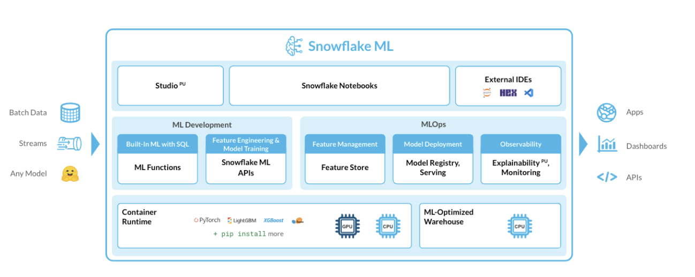
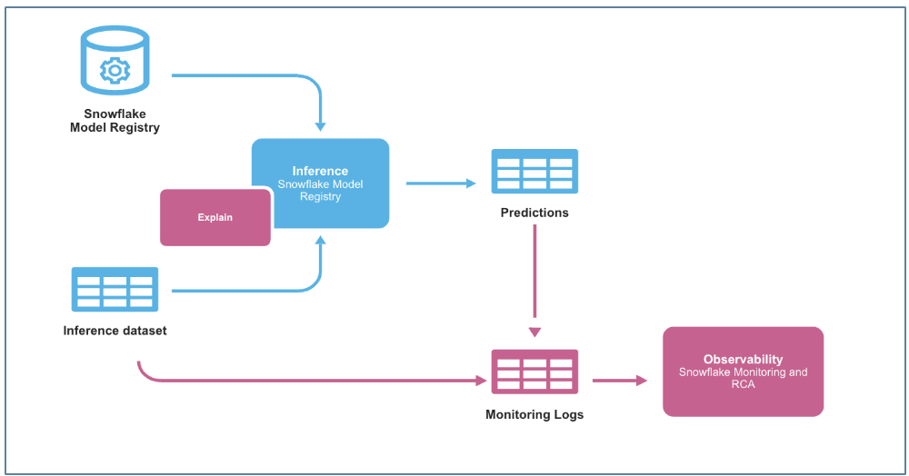
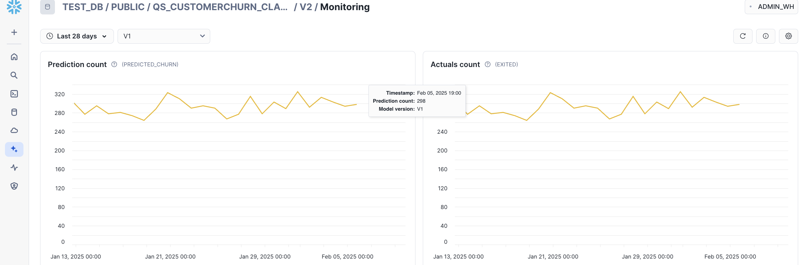
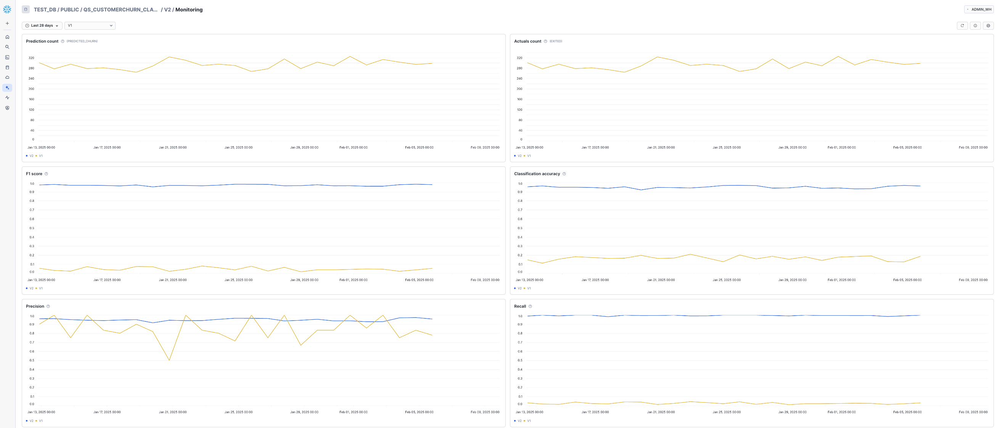
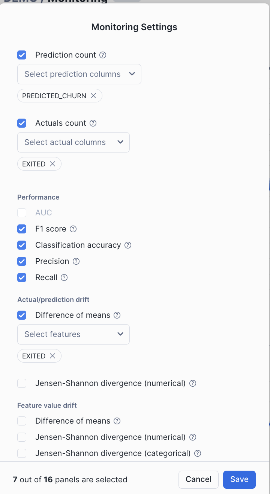

author: Kala Govindarajan
id: getting-started-with-ml-observability-in-snowflake
categories: snowflake-site:taxonomy/solution-center/certification/quickstart, snowflake-site:taxonomy/solution-center/certification/community-sourced, snowflake-site:taxonomy/solution-center/includes/architecture, snowflake-site:taxonomy/product/ai, snowflake-site:taxonomy/snowflake-feature/transformation
language: en
summary: ML Ops is defined as the core function of ML engineering focused on optimizing the process of deploying, maintaining, and monitoring models in production. Snowflake ML Observability allows to monitor models deployed in production via Snowflake Model Registry to track the quality of the model across multiple dimensions such as performance and drift along with volume. With this ML Ops-driven approach for customer churn monitoring, enterprises can ensure that ML models add real value, minimize the risk of performance decay, and make informed, data-driven decisions that drive customer retention. 
environments: web
status: Published 
feedback link: https://github.com/Snowflake-Labs/sfguides/issues
fork repo link: https://github.com/Snowflake-Labs/sfguide-getting-started-with-ml-observability-in-snowflake


# Getting Started with ML Observability in Snowflake
<!-- ------------------------ -->
## Overview 

Snowflake ML provides organizations with an integrated set of capabilities for end-to-end ML development and operations in a single platform on top of governed data. 
For many large enterprises, extracting tangible value from Machine Learning (ML) initiatives remains a significant challenge. Despite substantial investments, the journey from developing models to realizing their benefits often encounters numerous roadblocks. MLOps is a core function of ML engineering and focuses on streamlining the process of taking machine learning models to production, and then maintaining and monitoring them effectively. Unlike traditional software, machine learning models can change their behavior over time due to various factors, including input drift, outdated assumptions from model training, issues in data pipelines, and standard challenges like hardware/software environments and traffic. These factors can lead to a decline in model performance and unexpected behavior which needs to be monitored very closely. 




In this Quickstart guide we will be exploring ML Observability in Snowflake that enables one to detect model behavior changes over time due to input drift, stale training assumptions, and data pipeline issues, as well as the usual factors, including changes to the underlying hardware and software and the fluid nature of traffic. ML Observability allows you to track the quality of production models that has been deployed via the Snowflake Model Registry across multiple dimensions, such as performance, drift, and volume. 

For demonstration purposes, let's consider a multinational financial services firm aiming to understand and mitigate customer churn. Losing customers not only impacts revenue but also incurs additional costs to acquire new ones. Therefore, having an accurate model to predict churn and monitoring it regularly is crucial. The financial firm leverages Snowflake ML for its end to end ML pipeline and have achieved continuous monitoring for data quality, model quality, bias drift and feature attribution drift data quality, model quality, bias drift and feature attribution drift with ML Observability.

### Prerequisites
- A Snowflake account (including free trials)  with access to a role that has the ACCOUNTADMIN role. If not, you will need to work with your admin to perform the initial environment setup.
- Git installed.

### What You’ll Learn 
- How to build a comprehensive and scalable production-ready MLOps pipeline that manages the entire ML workflow in Snowflake ML.
- How to implement model performance tracking across multiple dimensions, such as performance, drift, and volume via the Snowflake Model Registry.
- How to carry monitoring of customer churn classification model


### What You’ll Need 
- A Snowflake account (including free trials)
- Access to the ACCOUNTADMIN role. If not, you will need to work with your admin to perform the initial environment setup.
- Git installed.

### What You’ll Build 
- How to build a comprehensive and scalable production-ready MLOps pipeline that manages the entire ML workflow in Snowflake.
- 
    - **loads data and prepare data**
    - **performs feature transformations on the data using Snowflake ML APIs**
    - **train an XGBoost ML model with Snowflake ML APIs**
    - **create a built-in model monitor to detect model and feature drift over time**
    - **implement model performance tracking across multiple dimensions, such as performance, drift, and volume via the Snowflake Model Registry**
    - **monitor performance drift and retrain model using new data trends**
    - **Analyze Performance metrics, statistics metrics and drift metrics and configure alerts**

<!-- ------------------------ -->
## Setup Environment

This section will walk you through creating various objects

#### High-Level Workflow

We will leverage Snowflake Notebooks to carry the Data loading, Feature Engineering, Model Training, Model Inference and the Model Monitoring setup.

**Step 1**. Navigate to Worksheets in Snowsight. Create a database and warehouse that is needed for the Notebook execution. The commands are given below :

```
USE ROLE SYSADMIN;
create database customer_db;

CREATE OR REPLACE WAREHOUSE ml_wh WITH 
WAREHOUSE_TYPE = standard WAREHOUSE_SIZE = Medium
AUTO_SUSPEND = 5 AUTO_RESUME = True;

```

**Step 2**. Clone [GitHub](https://github.com/Snowflake-Labs/sfguide-getting-started-with-ml-observability-in-snowflake) repository.

Open and download the following [notebook](https://github.com/Snowflake-Labs/sfguide-getting-started-with-ml-observability-in-snowflake/tree/main/notebook) from the cloned repository. Import the notebook into the Snowflake Snowsight under Projects -> Notebooks section. Note that the snowflake-ml-python is a required package and remember to add it in the package selector.

**Step 3**. Notebook Walkthrough. You can choose to run cell by cell or Run All.

- First import essential packages are imported, including snowpark,snowflake ml,snowflake ml modeling and the snowflake ml registry.

- We will employ synthetic data to predict customer churn for this hypothetical financial customer churn use case. This data includes features related to both customer demographics and transaction information, which a financial firm might use to make predictions about whether a customer will churn.

- Leverage the generated synthetic data to create new features using the snowflake.ml.modeling.preprocessing functions from the Snowpark ML Preprocessing API. All feature transformations using Snowpark ML are distributed operations in the same way with Snowpark DataFrame operations.

- Train an XGBoost classifier model using the Snowpark ML Modeling API.
  
- Log the trained model to Snowflake Model Registry. 
  
- After logging the model by calling the registry’s log_model method, inference can be carried out using the model operations.
  
- For the purpose of ongoing inference a function that leverages the trained model from the Snowflake model registry and the preprocessing pipeline is used.
**Step 4**. Model Monitor
Even a well-trained model may degrade over time due to data drift—shifts in data distributions caused by changes in customer behavior, seasonality, or external factors.

To track this, we create a Model Monitor in Snowflake



- Create a model monitor using the CREATE MODEL MONITOR command wither using the python class or the SQL command. The model monitor must be created in the same schema as the model version that needs to be monitored. 
  
- The monitor object attaches to the specific model version with a source table name

```
CREATE OR REPLACE MODEL MONITOR QS_CHURN_MODEL_MONITOR
WITH
    MODEL=QS_CustomerChurn_classifier
    VERSION=demo
    FUNCTION=predict
    SOURCE=CUSTOMER_CHURN
    BASELINE=CUSTOMERS
    TIMESTAMP_COLUMN=TRANSACTIONTIMESTAMP
    PREDICTION_CLASS_COLUMNS=(PREDICTED_CHURN)  
    ACTUAL_CLASS_COLUMNS=(EXITED)
    ID_COLUMNS=(CUSTOMERID)
    WAREHOUSE=ML_WH
    REFRESH_INTERVAL='1 min'
    AGGREGATION_WINDOW='1 day';
```

**Step 5**. Retraining the Model

When drift exceeds a predefined threshold, retraining is required to improve accuracy. The model performance can be viewed in the Snowsight dashbaord.

- Log the new version of the trained model under the same model name and different model version. Create a new model monitor  .


**Step 6**. Continuous Monitoring & Improvement

Once the retrained model is live, we continue monitoring prediction accuracy, precision, and recall.

**Step 7**. Alert Notificiation
An alert is setup to ensure that when a monitored metric (such as model drift) exceeds a certain threshold, a notification is inserted into a TEST_NOTIFICATION table.

An alert function is created that runs every 60 minutes and checks if data drift has occurred using the MODEL_MONITOR_DRIFT_METRIC function.


<!-- ------------------------ -->
## Monitoring Model Performance in Snowsight

Lets view the monitoring dashboards in Snowsight.

- Navigate to the ML Monitoring dashboard in Snowsight. 

- In the Snowsight navigation menu, select AI & ML and then Models.
- This will list all models in the Snowflake Model Registry across databases and schemas that the current role can access.
- To view details for a specific model, select its row in the Models list. This will open the model's details page, where you can find key information, such as the model's description, tags, versions, and monitors.

In the Monitors section of the details page, a list of model monitors can be found, including the model versions they are linked to, their status, and creation dates.

#### Metrics Monitoring



Prediction Count - Count of non-null values for prediction column.

Actual Count - Count of non-null values for label column.



Precision - ratio of true positive predictions to the total predicted positives, indicating the accuracy of positive predictions.

Classification accuracy- ratio of correctly predicted instances to the total instances in the dataset.

Recall - ratio of true positive predictions to the total actual positives, measuring the ability to capture all relevant instances.

The F1 Score - the harmonic mean of precision and recall, providing a balance between the two metrics.

Difference of mean - compares the average values between two datasets.



There are other metrics that can be tracked as per the model type. 


In addition to the above metrics that can be visually observed in the dashboard, the following Model monitoring functions allow users to evaluate model performance, detect drift, and count records over time. These system table functions execute SQL queries against nested monitor tables to provide insights into model behavior.

**Drift Metrics**.
Drift metrics help identify whether the data distribution of a feature has changed over time compared to a baseline. This is crucial in detecting data drift, which can degrade model performance.
```
SELECT * FROM TABLE(MODEL_MONITOR_DRIFT_METRIC(
<model_monitor_name>, <drift_metric_name>, <column_name>, <granularity>, <start_time>, <end_time>)
)
```

**Performance Metrics**.

Performance metrics assess how well a model is predicting outcomes. These metrics vary based on whether the model is a regression or binary classification model.
```
SELECT * FROM TABLE(MODEL_MONITOR_PERFORMANCE_METRIC(
<model_monitor_name>, <metric_name>, <granularity>, <start_time>, <end_time>)
)
```

**Statistical Metrics**.

Count metrics provide statistical insights about dataset records, such as total count and missing values.

```
SELECT * FROM TABLE(MODEL_MONITOR_STAT_METRIC(
<model_monitor_name>, <metric_name>, <column_name>, <granularity>, <start_time>, <end_time>)
)
```

These metrics combined with the alert function helps maintain model reliability, allowing for proactive issue detection and better model governance.


<!-- ------------------------ -->
## Conclusion And Resources

In this guide, we explored how financial firms can build end-to-end, production-ready customer churn prediction models using Snowflake ML. With Snowflake's new features supporting MLOps, organizations can now monitor, optimize, and manage models at scale in production. This approach ensures models are deployed in a controlled, reliable manner and continue to evolve, delivering sustained value over time. Ultimately, Snowflake empowers organizations to move confidently from development to production, unlocking the full potential of their machine learning models and driving impactful, large-scale results.

### What You Learned
- - Implement an end-to-end ML lifecycle in Snowflake—from training an initial model to monitoring drift, retraining, and continuously improving its predictions.
- How to build a comprehensive and scalable production-ready MLOps pipeline that manages the entire ML workflow in Snowflake. 
- How to implement model performance tracking across multiple dimensions, such as performance, drift, and volume  via the Snowflake Model Registry.

 

### Related Resources

- #### [Snowpark ML](https://docs.snowflake.com/en/developer-guide/snowflake-ml/overview)
- #### [Snowpark Model Observability](https://docs.snowflake.com/en/developer-guide/snowflake-ml/model-registry/model-observability)
- #### [Getting Started with Snowflake ML](/en/developers/guides/intro-to-machine-learning-with-snowpark-ml-for-python/)
- [Fork the Repo](https://github.com/Snowflake-Labs/sfguide-getting-started-with-ml-observability-in-snowflake/tree/main/notebook)
- [Download Reference Architecture](https://drive.google.com/file/d/1DSXlhZQlfI8DYiE-HYKcLK5wyaFYSqIb/view?usp=sharing)
- [Watch the Demo](https://youtu.be/VS7_yvt498Y?list=TLGGF-5YkcMeUncyNDA5MjAyNQ)
- 
