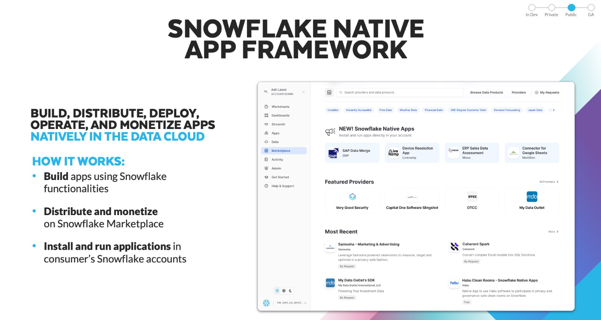
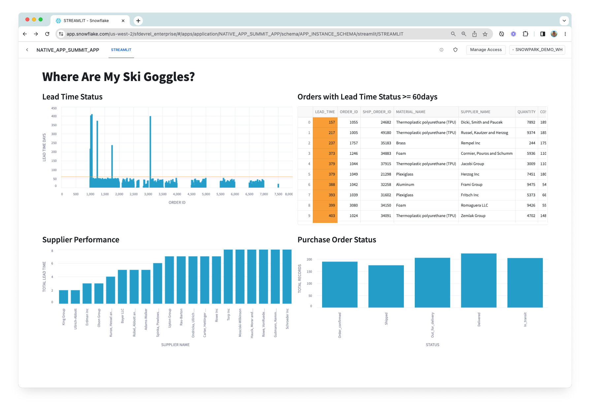
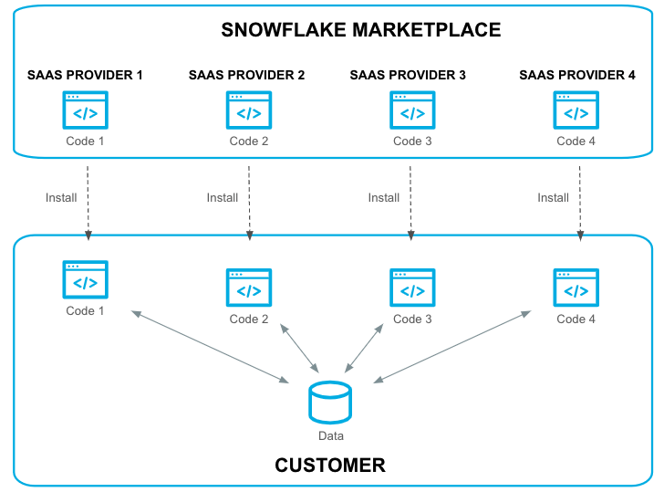

author: Daniel Myers
id: getting-started-with-native-apps
categories: snowflake-site:taxonomy/solution-center/certification/quickstart, snowflake-site:taxonomy/product/applications-and-collaboration, snowflake-site:taxonomy/snowflake-feature/build, snowflake-site:taxonomy/snowflake-feature/native-apps
language: en
summary: Follow this tutorial to get up and running with your first Snowflake Native Application 
environments: web
status: Published 
feedback link: https://github.com/Snowflake-Labs/sfguides/issues

# Getting Started with Snowflake Native Apps
<!-- ------------------------ -->
## Overview 



In this Quickstart, you'll build your first Snowflake Native Application. 

Snowflake Native Applications provide developers a way to package applications for consumption by other Snowflake users. The Snowflake Marketplace is a central place for Snowflake users to discover and install Snowflake Native Applications. 

 The application you'll build will visualize data from suppliers of raw material, used for inventory and supply chain management. Let's explore the application from the perspective of the application provider and an application consumer.

– **Provider** – In this Quickstart, the provider of the app is a supply chain management company. They have proprietary data on all sorts of shipments. They've built the app, bundled it with access to their shipping data, and listed it on the Snowflake Marketplace so that manufacturers can use it in combination with manufacturing supply chain data to get a view of the supply chain.

– **Consumer** – The consumer of the app manufactures a consumer product – in this case it's ski goggles. They work with several suppliers of the raw material used to manufacture the ski goggles. When the consumer runs the application in their account, the application will render multiple charts to help them visualize information related to:

- **Lead Time Status** The lead time status of the raw material procurement process.
- **Raw Material Inventory** Inventory levels of the raw materials. 
- **Purchase Order Status** The status of all the purchase orders (shipped, in transit; completed)
- **Supplier Performance** The performance of each raw material supplier, measured in terms lead time, quality, and cost of raw materials delivered by the supplier.

The data powering the charts is a combination of the consumer's own supply chain data (orders and site recovery data) in their Snowflake account, while the provider is sharing shipping data to provide an enriched view of the overall supply chain.

Note that this Quickstart is limited to a single-account installation. You'll use a single Snowflake account to experience the app from the provider's perspective and from the consumer's perspective. Listing to the Snowflake Marketplace and versions / release directives are outside of the scope of this guide.

Let's get started!



### Prerequisites
- Snowflake trial account
- Beginner Python knowledge


### What You’ll Learn 
- Snowflake Native App Framework
- Snowflake Native App deployment
- Snowflake Native App sharing and Marketplace Listing


### What You’ll Need 
- [VSCode](https://code.visualstudio.com/download) Installed
- [Snowflake CLI](https://docs.snowflake.com/developer-guide/snowflake-cli-v2/installation/installation) Latest version Installed

### What You’ll Build 
- A Snowflake Native Application

<!-- ------------------------ -->
## Architecture & Concepts

Snowflake Native Apps are a new way to build data intensive applications. Snowflake Native Apps benefit from running *inside* Snowflake and can be installed from the Snowflake Marketplace, similar to installing an app on a smart phone. Snowflake Native Apps can read and write data to a user's database (when given permission to do so). Snowflake Native Apps can even bring in new data to their users, providing new insights. 

When discussing Snowflake Native Apps, there are two personas to keep in mind: **Providers** and **Consumers**.

- **Providers:** Developers of the app. The developer or company publishing an app to the Snowflake Marketplace is an app provider.

- **Consumer:** Users of an app. When a user installs an app from the Snowflake Marketplace, they are a consumer of the app.

The diagram below demonstrates this model:
 


<!-- ------------------------ -->
## Clone Sample Repo & Directory Structure

To create our Snowflake Native Application, we will first clone the [starter project](https://github.com/Snowflake-Labs/sfguide-getting-started-with-native-apps) by running this command:

```bash
git clone git@github.com:Snowflake-Labs/sfguide-getting-started-with-native-apps.git
```
This command is going to create an application project folder on your local machine, cloned from the github repo.

If you do not have Snowflake CLI or Git installed, you can also download the code directly from [GitHub](https://github.com/Snowflake-Labs/sfguide-getting-started-with-native-apps/archive/refs/heads/main.zip) and extract it to a local folder.

This repository contains all of our starter code for our native app. Throughout the rest of this tutorial we will be modifying various parts of the code to add functionality and drive a better understanding of what is happening at each step in the process.


Let's explore the directory structure:

```plaintext
|-- repos
    |-- .gitignore
    |-- LICENSE
    |-- app
        |-- data
        |   |-- order_data.csv
        |   |-- shipping_data.csv
        |   |-- site_recovery_data.csv
        |-- src
        |   |-- manifest.yml
        |   |-- setup.sql
        |   |-- libraries
        |   |   |-- environment.yml
        |   |   |-- procs.py
        |   |   |-- streamlit.py
        |   |   |-- udf.py
    |-- scripts
    |   |-- setup-package-script.sql
    |-- prepare_data.sh
    |-- snowflake.yml
```

There `src` directory is used to store all of our various source code including stored procedures, user defined functions (UDFs), our streamlit application, and even our installation script `setup.sql`.


<!-- ------------------------ -->
## Upload Necessary Data

### Upload provider shipping data 

Now, let's create a database that we will use to store provider's shipping data. This is the data that we will share with the application so that the consumer can enrich their own supply chain data with it when they install the app in their account.

This commands are run by executing the **prepare_data.sh** file. But first we are going to explain its contents.

First the file creates the database, warehouse, schema, and defines the table that will hold the shipping data.

```
snow sql -q "
CREATE OR REPLACE WAREHOUSE NATIVE_APP_QUICKSTART_WH WAREHOUSE_SIZE=SMALL INITIALLY_SUSPENDED=TRUE;

-- this database is used to store our data
CREATE OR REPLACE DATABASE NATIVE_APP_QUICKSTART_DB;
USE DATABASE NATIVE_APP_QUICKSTART_DB;

CREATE OR REPLACE SCHEMA NATIVE_APP_QUICKSTART_SCHEMA;
USE SCHEMA NATIVE_APP_QUICKSTART_SCHEMA;

CREATE OR REPLACE TABLE MFG_SHIPPING (
  order_id NUMBER(38,0), 
  ship_order_id NUMBER(38,0),
  status VARCHAR(60),
  lat FLOAT,
  lon FLOAT,
  duration NUMBER(38,0)
);"
```

### Upload Consumer Supply Chain Data

In this scenario, consumers will provide their own supply chain data (orders and site recovery data) from their own Snowflake account. The app will use the consumer's data to render graphs representing different aspects of the supply chain.

We'll use the `NATIVE_APP_QUICKSTART_DB` to store the consumer supply chain data.

```
snow sql -q "
USE WAREHOUSE NATIVE_APP_QUICKSTART_WH;

-- this database is used to store our data
USE DATABASE NATIVE_APP_QUICKSTART_DB;

USE SCHEMA NATIVE_APP_QUICKSTART_SCHEMA;

CREATE OR REPLACE TABLE MFG_ORDERS (
  order_id NUMBER(38,0), 
  material_name VARCHAR(60),
  supplier_name VARCHAR(60),
  quantity NUMBER(38,0),
  cost FLOAT,
  process_supply_day NUMBER(38,0)
);


CREATE OR REPLACE TABLE MFG_SITE_RECOVERY (
  event_id NUMBER(38,0), 
  recovery_weeks NUMBER(38,0),
  lat FLOAT,
  lon FLOAT
);"
```

Once we have created the necessary tables in the provider and consumer side, the next step is to load the csv files to the corresponding tables.
A stage is available and directly linked to every table created in Snowflake,  so we are going to take advantage of that dedicated stage and upload the files directly to the table associated stage. You can find more information about stages types **[here](https://docs.snowflake.com/en/user-guide/data-load-overview)**
That is accomplished using the `snow stage copy` command:

```bash
# loading shipping data into table stage
snow stage copy ./app/data/shipping_data.csv @%MFG_SHIPPING --database NATIVE_APP_QUICKSTART_DB --schema NATIVE_APP_QUICKSTART_SCHEMA

# loading orders data into table stage
snow stage copy ./app/data/order_data.csv @%MFG_ORDERS --database NATIVE_APP_QUICKSTART_DB --schema NATIVE_APP_QUICKSTART_SCHEMA

# loading site recovery data into table stage
snow stage copy ./app/data/site_recovery_data.csv @%MFG_SITE_RECOVERY --database NATIVE_APP_QUICKSTART_DB --schema NATIVE_APP_QUICKSTART_SCHEMA
```

Now the data is in the table stage, but its not yet loaded inside the table, for that, the following commands are run in the file:

```
snow sql -q"USE WAREHOUSE NATIVE_APP_QUICKSTART_WH;
-- this database is used to store our data
USE DATABASE NATIVE_APP_QUICKSTART_DB;

USE SCHEMA NATIVE_APP_QUICKSTART_SCHEMA;

COPY INTO MFG_SHIPPING
FILE_FORMAT = (TYPE = CSV
FIELD_OPTIONALLY_ENCLOSED_BY = '\"');

COPY INTO MFG_ORDERS
FILE_FORMAT = (TYPE = CSV
FIELD_OPTIONALLY_ENCLOSED_BY = '\"');

COPY INTO MFG_SITE_RECOVERY
FILE_FORMAT = (TYPE = CSV
FIELD_OPTIONALLY_ENCLOSED_BY = '\"');
"
```

## Share the Provider Shipping Data

In order for this data to be available to the application consumer, we'll need to share it in the application package via reference usage.

The following steps are performed by the **setup-package-script.sql** file, which is automatically run whenever we deploy the application:

- Creates a schema in the application package that will be used for sharing the shipping data

- Create a view within that schema

- Grants usage on the schema to the application package

- Grants reference usage on the database holding the provider shipping data to the application package

- Grants SELECT privileges on the view to the application package, meaning the app will be able to SELECT on the view once it is installed

```sql
-- ################################################################
-- Create SHARED_CONTENT_SCHEMA to share in the application package
-- ################################################################
use database NATIVE_APP_QUICKSTART_PACKAGE;
create schema shared_content_schema;

use schema shared_content_schema;
create or replace view MFG_SHIPPING as select * from NATIVE_APP_QUICKSTART_DB.NATIVE_APP_QUICKSTART_SCHEMA.MFG_SHIPPING;

grant usage on schema shared_content_schema to share in application package NATIVE_APP_QUICKSTART_PACKAGE;
grant reference_usage on database NATIVE_APP_QUICKSTART_DB to share in application package NATIVE_APP_QUICKSTART_PACKAGE;
grant select on view MFG_SHIPPING to share in application package NATIVE_APP_QUICKSTART_PACKAGE;
```

This flow ensures that the data is able to be shared securely with the consumer through the application. The objects containing the provider's proprietary shipping data are **never** shared directly with the consumer via a Snowflake Native Application. This means the provider's proprietary data remains safe, secure, and in the provider's Snowflake account. Instead, the application package has reference usage on objects (databases) corresponding to the provider's data, and when a consumer install the app (i.e., instantiates the application package), they are able to use the shared data through the application.

<!-- ------------------------ -->
## Manifest.yml

The `manifest.yml` file is an important aspect of a Snowflake Native App. This file defines some metadata about the app, configuration options, and provides references to different artifacts of the application.

Let's take a look at the one provided in the GitHub repository:

```
#version identifier
manifest_version: 1

version:
  name: V1
  label: Version One
  comment: The first version of the application

#artifacts that are distributed from this version of the package
artifacts:
  setup_script: scripts/setup.sql
  default_streamlit: app_instance_schema.streamlit
  extension_code: true

#runtime configuration for this version
configuration:
  log_level: debug
  trace_level: off

references:
  - order_table:
      label: "Orders Table" 
      description: "Select table"
      privileges:
        - SELECT
      object_type: Table 
      multi_valued: false 
      register_callback: app_instance_schema.update_reference 
  - site_recovery_table:
      label: "Site Recovery Table" 
      description: "Select table"
      privileges:
        - SELECT
      object_type: Table 
      multi_valued: false 
      register_callback: app_instance_schema.update_reference

```

`manifest_version`

- this is the Snowflake defined manifest file version. If there are new configuration options or additions, the version number will change.

`version`

- this is a user-defined version for the application. This version identifier is used when creating the app package.

`artifacts`

- this contains options and definitions for where various parts of our package is located. In particular the `setup_script` option is required.

`configuration`

- this is used to define what logging we want to use in our application. During development we will want a log level of `debug`. 

`references`

-  this part of the manifest file contains all the references to Snowflake objects that the Native App needs access to. The Native App Consumer will grant access to the objects when installing or using the application. We will use this in our native app to gain access to the `order_table` and `site_recovery_table`. 

<!-- ------------------------ -->
## Installation Script

The installation script **setup.sql** defines all Snowflake objects used within the application. This script runs every time a user installs the application into their environment. 

```
-- ==========================================
-- This script runs when the app is installed 
-- ==========================================

-- Create Application Role and Schema
create application role if not exists app_instance_role;
create or alter versioned schema app_instance_schema;

-- Share data
create or replace view app_instance_schema.MFG_SHIPPING as select * from shared_content_schema.MFG_SHIPPING;

-- Create Streamlit app
create or replace streamlit app_instance_schema.streamlit from '/libraries' main_file='streamlit.py';

-- Create UDFs
create or replace function app_instance_schema.cal_lead_time(i int, j int, k int)
returns float
language python
runtime_version = '3.8'
packages = ('snowflake-snowpark-python')
imports = ('/libraries/udf.py')
handler = 'udf.cal_lead_time';

create or replace function app_instance_schema.cal_distance(slat float,slon float,elat float,elon float)
returns float
language python
runtime_version = '3.8'
packages = ('snowflake-snowpark-python','pandas','scikit-learn==1.1.1')
imports = ('/libraries/udf.py')
handler = 'udf.cal_distance';

-- Create Stored Procedure
create or replace procedure app_instance_schema.billing_event(number_of_rows int)
returns string
language python
runtime_version = '3.8'
packages = ('snowflake-snowpark-python')
imports = ('/libraries/procs.py')
handler = 'procs.billing_event';

create or replace procedure app_instance_schema.update_reference(ref_name string, operation string, ref_or_alias string)
returns string
language sql
as $$
begin
  case (operation)
    when 'ADD' then
       select system$set_reference(:ref_name, :ref_or_alias);
    when 'REMOVE' then
       select system$remove_reference(:ref_name, :ref_or_alias);
    when 'CLEAR' then
       select system$remove_all_references();
    else
       return 'Unknown operation: ' || operation;
  end case;
  return 'Success';
end;
$$;

-- Grant usage and permissions on objects
grant usage on schema app_instance_schema to application role app_instance_role;
grant usage on function app_instance_schema.cal_lead_time(int,int,int) to application role app_instance_role;
grant usage on procedure app_instance_schema.billing_event(int) to application role app_instance_role;
grant usage on function app_instance_schema.cal_distance(float,float,float,float) to application role app_instance_role;
grant SELECT on view app_instance_schema.MFG_SHIPPING to application role app_instance_role;
grant usage on streamlit app_instance_schema.streamlit to application role app_instance_role;
grant usage on procedure app_instance_schema.update_reference(string, string, string) to application role app_instance_role;
```

<!-- ------------------------ -->
## Create App Package

A Snowflake Application Package is conceptually similar to that of an application installer for a desktop computer (like `.msi` for Windows or `.pkg` for Mac). An app package for Snowflake contains all the material used to install the application later, including the setup scripts. In fact, we will be using this app package in future steps to test our app!

Now that we've understood our project files, lets create the Snowflake Application Package so we can upload our project:

To create an application package you can go through the manual UI process or you can run:


```
snow app run
```

> 
>
> This code is going to actually create the entire application, not only the application package.
<!-- ------------------------ -->
## Update UDF.py

To add some new functionality to our application we will modify **UDF.py**. This is the Python file we use to create all our User Defined Functions (UDFs).

```python
def cal_distance(lat1,lon1,lat2,lon2):
   import math
   radius = 3959 # miles == 6371 km
   dlat = math.radians(lat2-lat1)
   dlon = math.radians(lon2-lon1)
   a = math.sin(dlat/2) * math.sin(dlat/2) + math.cos(math.radians(lat1)) \
        * math.cos(math.radians(lat2)) * math.sin(dlon/2) * math.sin(dlon/2)
   c = 2 * math.atan2(math.sqrt(a), math.sqrt(1-a))
   d = radius * c
   return dw

# process_supply_day + duration + recovery_weeks * 7 (days)
def cal_lead_time(i,j,k):
   return i + j + k

```

> 
> 
> You can import any package in the `https://repo.anaconda.com/pkgs/snowflake` channel from [Anaconda](https://docs.conda.io/en/latest/miniconda.html)

Let's add a new function that simply outputs "Hello World!"

To do this, copy and paste the code below into **UDF.py**:

```python
def hello_world():
   return "Hello World!"
```

In the next step, we will expose this function to Consumers by adding it to our installation script.

<!-- ------------------------ -->
## Update Installation Script


Let's add the following code snippet to our `setup.sql` script so we can use the python function we created in the previous step:

```python
create or replace function app_instance_schema.hello_world()
returns string
language python
runtime_version = '3.8'
packages = ('snowflake-snowpark-python')
imports = ('/libraries/udf.py')
handler = 'udf.hello_world';

grant usage on function app_instance_schema.hello_world() to application role app_instance_role;
```

<!-- ------------------------ -->
## Create App Package Version

We've now added some basic functionality to the native app. From here, we will create the first version of our application package. You can have multiple versions available. 

To create a version in our application package, execute the following command:

```
snow app version create V1
```

Executing this command will create a version `V1` in our application package.
You can explicitly number the patch by adding `--patch <number>` as an argument to `snow app version create`. Because this version does not yet exist and because we did not specify the patch number, the system is going to add our code as patch 0 in this version.

As explained before, you can also set the version information inside of manifest.yml. In that case, running `snow app version create` without any arguments will automatically use that version. It would look something like this:

```
version:
  name: V1
  label: Version One
  comment: The first version of the application
```


<!-- ------------------------ -->
## Install the Application

To use the application, we'll first need to install it in the account. Normally you would click an install button in the Snowflake Marketplace, but since we're building the application and using a single account to demonstrate the provider and consumer experiences, you'll run the same `snow app run` CLI command as we mentioned before. This command creates and/or updates the application package and also deploys the application. If you'd like to instead install the application yourself, you can do so like this:

```
-- ################################################################
-- INSTALL THE APP IN THE ACCOUNT
-- ################################################################

USE DATABASE NATIVE_APP_QUICKSTART_DB;
USE SCHEMA NATIVE_APP_QUICKSTART_SCHEMA;
USE WAREHOUSE NATIVE_APP_QUICKSTART_WH;

-- This executes "setup.sql"; This is also what gets executed when installing the app
CREATE APPLICATION NATIVE_APP_QUICKSTART_APP FROM application package NATIVE_APP_QUICKSTART_PACKAGE using version V1 patch 0;
```

When it finishes running, it is going to show you a link to open the app directly. Alternatively, you can see the NATIVE_APP_QUICKSTART_APP listed under Apps in the UI.

<!-- ------------------------ -->
## Run the Streamlit App

Click on the app to launch it and give it a few seconds to warm up. 

When running the app for the first time, you'll be prompted to do some first-time setup by granting the app access to certain tables (i.e., create object-level bindings). The bindings link references defined in the manifest file to corresponding objects in the Snowflake account. These bindings ensure that the application can run as intended.

Upon running the application, you will see this:


### Teardown

To delete the application you just created, you can run this command:

`snow app teardown`

And to delete the database you used to populate the application, this command will do:

`snow sql -q "DROP DATABASE NATIVE_APP_QUICKSTART_DB"`

<!-- ------------------------ -->
## Conclusion & Next Steps

Congratulations, you have now developed your first Snowflake Native Application! As next steps and to learn more, checkout additional documentation at [docs.snowflake.com](https://docs.snowflake.com) and demos of other Snowflake Native Apps at [developers.snowflake.com/solutions](https://developers.snowflake.com/solutions/?_sft_technology=native-apps).

For a slightly more advanced Snowflake Native Application, see the following Quickstart: [Build a Snowflake Native App to Analyze Chairlift Sensor Data](/en/developers/guides/native-app-chairlift/).

### Additional resources

- [Snowflake Native App Developer Toolkit](/snowflake-native-app-developer-toolkit/?utm_cta=na-us-en-eb-native-app-quickstart)
- [Native Apps Examples](https://github.com/snowflakedb/native-apps-examples)

### What we've covered
- Prepare data to be included in your application.
- Create an application package that contains the data and business logic of your application.
- Share data with an application package.
- Add business logic to an application package.
- View and test the application in Snowsight.

