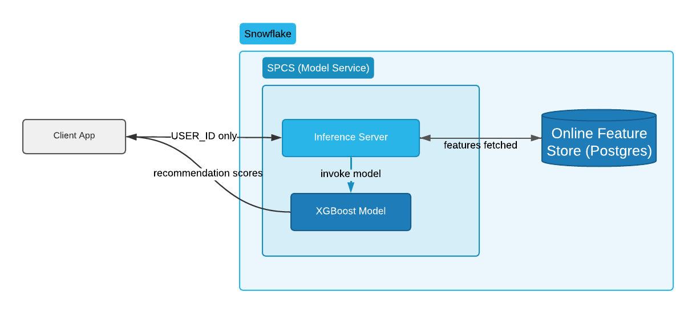

author: Sho Tanaka, Avinash Joshi
id: getting-started-with-online-ml-feature-store-and-inference
summary: Learn how to build a real-time product recommendation service using Snowflake's Online Feature Store and ML inference
categories: snowflake-site:taxonomy/product/ai, snowflake-site:taxonomy/product/data-engineering, snowflake-site:taxonomy/snowflake-feature/model-development, snowflake-site:taxonomy/snowflake-feature/snowpark-container-services, snowflake-site:taxonomy/solution-center/certification/quickstart
language: en
environments: web
status: Published
feedback link: https://github.com/Snowflake-Labs/sfguides/issues
tags: Getting Started, Machine Learning, Feature Store, SPCS, Recommendation, Snowflake ML, Real-Time Inference

# Getting Started with Online ML - Feature Store + Inference
<!-- ------------------------ -->
## Overview

> **Note: This quickstart requires a paid Snowflake account.** Snowpark Container Services (SPCS), which powers both the Online Feature Store and real-time inference, does not support trial accounts. To upgrade a trial, go to **Admin > Billing & Terms** in Snowsight and add a credit card.

Building a real-time recommendation service typically requires your application to collect every user feature, package it into the request, and send it to the model endpoint on every call. As feature sets grow, this creates large payloads, duplicated logic, and a maintenance burden across every client.

**Online Feature Store Integration** solves this by letting your inference service fetch features automatically at request time. You send only the entity ID — for example, a `USER_ID` — and the SPCS model service looks up the rest of the features from a Snowflake Postgres-backed online store before invoking the model.

In this quickstart you will build a real-time product recommendation service for an e-commerce site from end to end:

1. Generate synthetic user, item, and interaction data
2. Create a Feature View backed by Snowflake Postgres online store
3. Train an XGBoost click-prediction ranking model
4. Deploy the model to SPCS with automatic feature retrieval
5. Call the REST endpoint with only `USER_ID` and get product recommendations back

### What You'll Build
- A Feature Store with a `USER_FEATURES` view served from a low-latency Postgres online store
- An XGBoost ranking model registered in Snowflake Model Registry
- An SPCS inference service that auto-fetches user features at inference time
- A REST endpoint that accepts just an entity ID and returns recommendation scores
- A React web application hosted in Snowflake App Runtime for a complete, browser-based recommendation UI

### What You'll Learn
- How to register a Feature View with `OnlineStoreType.POSTGRES` for low-latency lookups
- How to deploy a model service with `feature_sources_per_function` for automatic feature retrieval
- How to call the REST API with only entity IDs
- How to override individual feature values in a request
- How to build and deploy a Snowflake App (Next.js) with CoCo for a browser-based recommendation UI

### Prerequisites

This quickstart requires a **paid Snowflake account**. The following features used here do not work on trial accounts:

| Feature | Reason trial accounts are not supported |
|---|---|
| Online Feature Store (`OnlineStoreType.POSTGRES`) | `create_online_service()` provisions SPCS compute with `HIGHMEM` instances internally. Trial accounts are restricted to Burstable/General Purpose tiers (up to `STANDARD_L`). |
| SPCS Model Serving (`mv.create_service()`) | Snowpark Container Services requires a paid account. Trial accounts cannot create compute pools or SPCS services. |

To upgrade a trial account, go to **Admin > Billing & Terms** in Snowsight and add a credit card.

**Account requirements:**

- **Account type**: Paid Snowflake account (credit card linked). Trial accounts are not supported.
- **Role**: `ACCOUNTADMIN`, or a role with `CREATE COMPUTE POOL` and `BIND SERVICE ENDPOINT ON ACCOUNT` privileges
- **Region**: Any AWS, Azure, or GCP commercial region where SPCS is available ([see available regions](https://docs.snowflake.com/en/developer-guide/snowpark-container-services/overview#available-regions-and-considerations))
- **Edition**: Standard or higher. Enterprise or higher is recommended for production workloads.
- **Python**: No local installation required — all code runs in a Snowflake Workspace Notebook. Package `snowflake-ml-python >= 1.41.0` is installed in the notebook.

> If you prefer to run the notebook locally, see the [Appendix](#appendix-deploy-from-a-local-machine).

<!-- ------------------------ -->
## 1. Online Feature Store Integration: Concepts

### The Problem with Traditional Real-Time Inference

In a typical real-time recommendation flow, the client application must:

1. Look up or compute every feature the model needs (`PURCHASE_COUNT_30D`, `CLICK_RATE_7D`, preferred category, …)
2. Pack all features into the HTTP request body
3. Send the payload to the model endpoint

This approach has drawbacks:

- **Large payloads** slow down requests as feature sets grow
- **Duplicated feature logic** across multiple services and clients
- **Stale features** when clients cache or pre-compute feature values

### Online Feature Store Integration

With Online Feature Store Integration, the SPCS model service fetches feature values directly from a Snowflake Postgres online store at inference time. The client only needs to send the **entity ID** (the join key defined in the Feature View, e.g. `USER_ID`).



### Key Concepts

| Term | Description |
|---|---|
| **Feature View** | A versioned, managed set of features backed by a query or dataframe |
| **Entity** | The join key(s) used to look up features (e.g. `USER_ID`) |
| **OnlineStoreType.POSTGRES** | Snowflake Postgres backend for low-latency (sub-10ms) feature lookups |
| **feature_sources_per_function** | Parameter in `create_service()` that maps model methods to Feature Views |

> Note: Online Feature Store Integration backed by Snowflake Postgres is in **Public Preview**. Requires `snowflake-ml-python >= 1.41.0`.

<!-- ------------------------ -->
## 2. Setup

### Step 1: Run the Setup Script

Open a SQL worksheet in Snowsight and run the contents of [setup.sql](https://github.com/Snowflake-Labs/sfquickstarts/blob/master/site/sfguides/src/getting-started-with-online-ml-feature-store-and-inference/setup.sql).

The script creates:
- `RECOMMEND_DB` database and `RECOMMEND` schema
- `RECOMMEND_WH` warehouse (Medium)
- `RECOMMEND_CPU_POOL` compute pool for SPCS
- `FS_PRODUCER_ROLE` and `FS_CONSUMER_ROLE` for Feature Store access control

> Note: `CREATE COMPUTE POOL` may fail on trial accounts. Use `SYSTEM_COMPUTE_POOL_CPU` as a fallback when running Cell 10.

### Step 2: Import the Notebook

1. In Snowsight, go to **Projects > Notebooks**
2. Click the **down arrow** next to **+ Notebook** and select **Import .ipynb file**
3. Upload [notebook.ipynb](https://github.com/Snowflake-Labs/sfquickstarts/blob/master/site/sfguides/src/getting-started-with-online-ml-feature-store-and-inference/notebook.ipynb)
4. Set **Database** to `RECOMMEND_DB`, **Schema** to `RECOMMEND`, **Warehouse** to `RECOMMEND_WH`
5. Click **Create**

### Step 3: Add Required Packages

In the notebook, open the **Packages** picker and add:
- `snowflake-ml-python` (>= 1.41.0)
- `xgboost`
- `scikit-learn`

You are now ready to run the notebook cells in the following chapters.

<!-- ------------------------ -->
## 3. Data Preparation

In this chapter you will generate synthetic e-commerce data, create a feature engineering view, and verify that the session is connected correctly.

### Run Cell 1: Connect and Import Libraries

**Run Cell 1** in the notebook. It connects to your Snowflake session and imports the required libraries.

```python
from snowflake.snowpark.context import get_active_session
import pandas as pd, numpy as np
from datetime import datetime, timedelta

session = get_active_session()
session.use_database("RECOMMEND_DB")
session.use_schema("RECOMMEND")
session.use_warehouse("RECOMMEND_WH")
print(f"Connected as: {session.get_current_user()}")
```

### Run Cell 2: Generate Synthetic Data

**Run Cell 2** to generate 1,000 users, 500 items, and 50,000 interaction events and write them to Snowflake tables.

The data reflects a realistic e-commerce pattern: click probability is higher (35%) when a user's preferred category matches the item's category, and lower (10%) otherwise.

Expected output:
```
Users: 1,000 | Items: 500 | Interactions: 50,000
```

### Run Cell 3: Create Feature Engineering Views

**Run Cell 3** to create two SQL views that pre-encode categorical features as integers. Encoding in SQL means the model always receives numeric-ready data without a separate Python preprocessing step.

**`USER_FEATURES_V`** — aggregates each user's activity and encodes their preferred category:

| Column | Description |
|---|---|
| `USER_ID` | Entity key |
| `PURCHASE_COUNT_30D` | Purchases in the last 30 days |
| `CLICK_RATE_7D` | Average click rate over the last 7 days |
| `PREFERRED_CATEGORY_ENC` | Category encoded as integer (Books=0, Clothing=1, Electronics=2, Home=3, Sports=4) |
| `LAST_ACTIVITY_TS` | Timestamp used for Feature Store time-travel |

**`ITEM_FEATURES_V`** — encodes item attributes:

| Column | Description |
|---|---|
| `ITEM_ID` | Entity key |
| `ITEM_CATEGORY_ENC` | Category encoded as integer |
| `PRICE_RANGE_ENC` | Price range encoded as integer (High=0, Low=1, Medium=2) |
| `AVG_RATING` | Average item rating |

Expected output:
```
USER_FEATURES_V created.
ITEM_FEATURES_V created.
```

<!-- ------------------------ -->
## 4. Feature Store Setup

In this chapter you will initialize the Feature Store, provision the Postgres online service, and register a Feature View that is served at low latency.

### Run Cell 4: Initialize Feature Store and Create Online Service

**Run Cell 4** to initialize the Feature Store and provision the managed Postgres backend.

> **Note:** `create_online_service()` provisions SPCS compute with `HIGHMEM` instances internally. This requires a **paid Snowflake account** — trial accounts will receive an error. If you are on a trial account, stop here and upgrade before continuing.

```python
from snowflake.ml.feature_store import FeatureStore

fs = FeatureStore(session=session, database="RECOMMEND_DB", name="RECOMMEND",
                  default_warehouse="RECOMMEND_WH", creation_mode="CREATE_IF_NOT_EXIST")

# Create online service (skip if already exists from a previous run)
try:
    fs.create_online_service("FS_PRODUCER_ROLE", "FS_CONSUMER_ROLE")
except Exception as e:
    if "already exists" in str(e):
        print("Online service already exists, skipping creation.")
    else:
        raise

status = fs.get_online_service_status()
while status.status != "RUNNING":
    time.sleep(30)
    status = fs.get_online_service_status()
print(f"Online service RUNNING. Endpoints: {status.endpoints}")
```

> **Provisioning time:** The online service takes **5–15 minutes** to start on first creation. The cell polls every 30 seconds and prints the current status. Wait until you see `Online service RUNNING.` before proceeding to Cell 5.

> The `try/except` block handles re-runs gracefully — if the online service already exists from a previous session, it is reused without error.

> The online service runs continuously. Call `fs.drop_online_service()` when you are done to avoid unused resource costs.

### Run Cell 5: Register Feature Views

**Run Cell 5** to register **two** Feature Views with `OnlineStoreType.POSTGRES` — one for users and one for items. Both are served from the Postgres online store at inference time.

```python
# User Feature View — entity key: USER_ID
user_entity = Entity(name="USER", join_keys=["USER_ID"])
fs.register_entity(user_entity)

user_fv = FeatureView(
    name="USER_FEATURES",
    entities=[user_entity],
    feature_df=session.table("USER_FEATURES_V"),
    timestamp_col="LAST_ACTIVITY_TS",
    refresh_freq="1 minute",
    online_config=OnlineConfig(
        enable=True, target_lag="10 seconds",
        store_type=OnlineStoreType.POSTGRES,
    ),
)
user_fv_registered = fs.register_feature_view(user_fv, version="V1", block=True)

# Item Feature View — entity key: ITEM_ID
item_entity = Entity(name="ITEM", join_keys=["ITEM_ID"])
fs.register_entity(item_entity)

item_fv = FeatureView(
    name="ITEM_FEATURES",
    entities=[item_entity],
    feature_df=session.table("ITEM_FEATURES_V"),
    refresh_freq="1 minute",
    online_config=OnlineConfig(
        enable=True, target_lag="10 seconds",
        store_type=OnlineStoreType.POSTGRES,
    ),
)
item_fv_registered = fs.register_feature_view(item_fv, version="V1", block=True)
```

> **Note:** `feature_sources_per_function` currently supports **max 1 Feature View per function**. In this quickstart, only `USER_FEATURES` is auto-fetched at inference time. Item features are passed directly in the request payload. Both Feature Views are registered here so training data can be retrieved from them in Cell 7.

### Run Cell 6: Verify Feature Retrieval

**Run Cell 6** to confirm that both Feature Views are serving correctly.

Expected output:

```
=== User Features ===
USER_ID   | PURCHASE_COUNT_30D | CLICK_RATE_7D | PREFERRED_CATEGORY_ENC
----------|--------------------|---------------|------------------------
user_0001 | 3                  | 0.28          | 2
user_0042 | 1                  | 0.12          | 1
user_0107 | 5                  | 0.41          | 0

=== Item Features ===
ITEM_ID   | ITEM_CATEGORY_ENC | PRICE_RANGE_ENC | AVG_RATING
----------|-------------------|-----------------|----------
item_0010 | 2                 | 1               | 4.3
item_0055 | 0                 | 2               | 3.7
item_0200 | 4                 | 0               | 4.8
```

<!-- ------------------------ -->
## 5. Model Building and Deployment

In this chapter you will train an XGBoost click-prediction model, register it in the Model Registry, and deploy it to SPCS with automatic feature retrieval configured.

### Run Cell 7: Prepare Training Data

**Run Cell 7** to retrieve features from both Feature Views and join them with interaction labels. Because encoding is done in SQL (Cell 3), no `LabelEncoder` is needed here — all features are already numeric.

Expected output:
```
Training samples: 50,000  |  Click rate: 18.45%
```

### Run Cell 8: Train the Model

**Run Cell 8** to train the XGBoost click-prediction model. The `scale_pos_weight` parameter handles the class imbalance between clicked and non-clicked interactions.

Expected output:
```
Test ROC-AUC: 0.8312
```

### Run Cell 9: Register the Model

**Run Cell 9** to log the trained model to the Snowflake Model Registry. The cell also drops any existing inference service and model version before re-registering, so it is safe to run multiple times.

```python
# Drop existing service/model for clean re-runs
session.sql("DROP SERVICE IF EXISTS RECOMMEND_DB.RECOMMEND.RECOMMEND_INFERENCE_SERVICE").collect()
reg.delete_model("PRODUCT_RECOMMEND_MODEL")  # if exists

mv = reg.log_model(
    model=model,
    model_name="PRODUCT_RECOMMEND_MODEL",
    version_name="V1",
    sample_input_data=sample_input,
    conda_dependencies=["xgboost", "scikit-learn", "pandas", "numpy"],
)
```

### Run Cell 10: Deploy to SPCS with Feature Retrieval

**Run Cell 10** — this is the core step of this quickstart. The `feature_sources_per_function` parameter maps the `predict` method to `USER_FEATURES`. At inference time, the SPCS service automatically fetches user features from the Postgres online store before invoking the model. Item features are provided directly in the request payload.

```python
mv.create_service(
    service_name="RECOMMEND_INFERENCE_SERVICE",
    service_compute_pool="RECOMMEND_CPU_POOL",
    ingress_enabled=True,
    force_rebuild=True,          # force image rebuild on re-runs
    feature_sources_per_function={
        "predict": [user_fv_registered],  # auto-fetch USER_FEATURES only
        # Item features are sent in the request — max 1 Feature View per function
    },
)
```

> The service build takes **5–10 minutes** on first deployment. `force_rebuild=True` ensures the image is rebuilt if this cell is re-run.

### Run Cell 11: Get the Endpoint URL

**Run Cell 11** to check the service status and retrieve the public endpoint URL.

Expected output:
```
service_name                   inference_endpoint                                   status
RECOMMEND_INFERENCE_SERVICE    abc123-recommend-db-proj.snowflakecomputing.app      READY
```

Copy the endpoint URL — you will need it in the next chapter and for the demo app in Chapter 6.

<!-- ------------------------ -->
## 6. Real-Time Serving

The inference service is running. In this chapter you will call the REST endpoint and observe automatic user feature retrieval in action.

### Authentication

Cell 12 uses the Snowflake session token directly — **no PAT is required** when running inside a Workspace Notebook:

```python
token = session.connection._rest._token
headers = {"Authorization": f'Snowflake Token="{token}"', "Content-Type": "application/json"}
```

### Run Cell 11: Get the Endpoint URL

**Run Cell 11** to check the service status and retrieve the endpoint URLs.

```python
services = mv.list_services()
print(services[["name", "status", "inference_endpoint", "internal_endpoint"]])
```

Expected output:
```
name                        status  inference_endpoint                                internal_endpoint
RECOMMEND_INFERENCE_SERVICE READY   abc123-recommend-db.snowflakecomputing.app        recommend-inference...svc.spcs.internal
```

> If `inference_endpoint` is blank, the public ingress is still provisioning. Use `internal_endpoint` in the meantime for testing from within the notebook.

### Run Cell 12: Call the Endpoint with USER_ID + Item Features

**Run Cell 12** sends `USER_ID` plus item features for each candidate item. The service automatically fetches the user's `PURCHASE_COUNT_30D`, `CLICK_RATE_7D`, and `PREFERRED_CATEGORY_ENC` from the Postgres online store, then combines them with the item features in the request to score each candidate.

```python
payload = {
    "dataframe_split": {
        "index": [0, 1, 2],
        "columns": ["USER_ID", "ITEM_CATEGORY_ENC", "PRICE_RANGE_ENC", "AVG_RATING"],
        "data": [
            ["user_0042", 0, 1, 4.5],  # Books, Low price
            ["user_0107", 3, 0, 3.8],  # Home, High price
            ["user_0255", 2, 2, 4.2],  # Electronics, Medium price
        ],
    }
}
```

**Why item features are in the request**: `feature_sources_per_function` currently supports max 1 Feature View per function. User features are auto-fetched (entity key = `USER_ID`); item features are passed directly because there is no item entity in the request context.

### Run Cell 13: Override a User Feature Value

**Run Cell 13** to override `PURCHASE_COUNT_30D` while still passing item features. The overridden value is used instead of the Postgres lookup; other user features (`CLICK_RATE_7D`, `PREFERRED_CATEGORY_ENC`) are still fetched automatically.

```python
payload_override = {
    "dataframe_split": {
        "index": [0],
        "columns": ["USER_ID", "PURCHASE_COUNT_30D", "ITEM_CATEGORY_ENC", "PRICE_RANGE_ENC", "AVG_RATING"],
        "data": [["user_0042", 20, 0, 1, 4.5]],  # PURCHASE_COUNT_30D overridden
    }
}
```

This pattern is useful for A/B testing, counterfactual analysis, or injecting real-time signals that arrive faster than the feature store refresh cycle.

### Run Cell 14: Cleanup

**Run Cell 14** to stop all running services and release compute resources when you are done.

```python
# Drops inference service, suspends compute pool and warehouse,
# and deletes the Feature Store online service
```

> Running the cleanup cell prevents ongoing credit charges from idle SPCS services and the Postgres online service.


<!-- ------------------------ -->
## 7. Build a Recommendation UI (Optional)

> **This chapter is optional.** Chapters 1–6 are the complete quickstart. This chapter adds a browser-based demo UI to visualize the recommendation results.

In this chapter you will deploy a Next.js recommendation UI from the companion GitHub repository as a **Snowflake App Runtime** application — a Next.js app hosted on SPCS. It accepts a USER_ID, ranks 10 candidate items by click probability, and displays the user's Feature Store values alongside the results.

The app source lives in `snowflake-app/` in the companion repository:
**[github.com/Snowflake-Labs/demo-content-rec-with-online-feature-serving](https://github.com/Snowflake-Labs/demo-content-rec-with-online-feature-serving)**

### Prerequisites

- [Snowflake CLI 3.17+](https://docs.snowflake.com/en/developer-guide/snowflake-cli/installation/installation) installed locally
- Account administrator has completed [App Development Setup](https://docs.snowflake.com/en/developer-guide/snowflake-app-runtime/account-admin-setup) in Snowsight once per account

Verify the CLI version:

```bash
snow --version  # must be 3.17 or later
```

### Step 1: Get the Inference Endpoint

From the notebook Cell 11 output, copy the `internal_endpoint` of `RECOMMEND_INFERENCE_SERVICE`. It has the format:

```
recommend-inference-service.<hash>.svc.spcs.internal
```

### Step 2: Clone and Configure

```bash
git clone https://github.com/Snowflake-Labs/demo-content-rec-with-online-feature-serving
cd demo-content-rec-with-online-feature-serving/snowflake-app

# Set the inference endpoint (SPCS-to-SPCS internal communication, no PAT needed)
echo "INFERENCE_INTERNAL_ENDPOINT=http://<internal-endpoint>:5000" > .env.local
```

### Step 3: Deploy

```bash
snow app deploy --database RECOMMEND_DB --schema RECOMMEND
```

Snowflake runs `npm ci` and `next build` remotely — no local build or Docker required. The first deploy takes **5–10 minutes**.

```bash
# Open the deployed app in your browser
snow app open
```

### Step 4: Try the App

Open the URL in your browser:

1. Enter `user_0042` in the **USER_ID** field
2. Click **Get Recommendations**
3. The **User Features panel** shows `PURCHASE_COUNT_30D`, `CLICK_RATE_7D`, and `PREFERRED_CATEGORY` — values the inference service fetched automatically from the Postgres online store
4. 10 candidate items are ranked by click probability with score bars

This is the same `feature_sources_per_function` behavior you tested in Chapter 6, now surfaced in a live web UI.

<!-- ------------------------ -->
## Conclusion and Resources

Congratulations! You built a real-time product recommendation service end to end using Snowflake's Online ML features.

### What You Learned
- How to register a **Feature View** with `OnlineStoreType.POSTGRES` for sub-10ms feature lookups
- How to provision an online service with `fs.create_online_service()` for managed Postgres feature serving
- How to deploy an SPCS model service with `feature_sources_per_function` so only entity IDs are needed in requests
- How the service automatically fetches, merges, and validates features at inference time
- How to override individual feature values for A/B testing and counterfactual analysis
- How to deploy a Snowflake App (Next.js) using `snow app deploy` for a browser-based recommendation UI

### Clean Up (Optional)

```sql
DROP SERVICE IF EXISTS RECOMMEND_DB.RECOMMEND.RECOMMEND_APP;
DROP SERVICE IF EXISTS RECOMMEND_DB.RECOMMEND.RECOMMEND_INFERENCE_SERVICE;
DROP COMPUTE POOL IF EXISTS RECOMMEND_CPU_POOL;
DROP DATABASE IF EXISTS RECOMMEND_DB;
```

### Related Resources

- [Online Feature Store — Documentation](https://docs.snowflake.com/en/developer-guide/snowflake-ml/feature-store/online-feature-store)
- [Online Feature Store Integration with Real-Time Inference](https://docs.snowflake.com/en/developer-guide/snowflake-ml/inference/real-time-inference-rest-api#online-feature-store-integration)
- [Snowflake Feature Store Overview](https://docs.snowflake.com/en/developer-guide/snowflake-ml/feature-store/overview)
- [Deploy Models for Real-Time Inference (REST API)](https://docs.snowflake.com/en/developer-guide/snowflake-ml/inference/real-time-inference-rest-api)
- [Snowflake Model Registry](https://docs.snowflake.com/en/developer-guide/snowflake-ml/model-registry/overview)
- [Snowflake App Runtime](https://docs.snowflake.com/en/developer-guide/snowflake-apps/overview)
- [Git Integration in Snowflake](https://docs.snowflake.com/en/developer-guide/git/git-overview)

<!-- ------------------------ -->
## Appendix: Deploy from a Local Machine

This appendix covers two local workflows: running the notebook from your machine, and deploying the demo app without Snowsight.

### Run the Notebook Locally

**Prerequisites:**

```bash
# Python 3.9+
pip install "snowflake-ml-python>=1.41.0" xgboost scikit-learn jupyter
```

Configure a Snowflake connection in `~/.snowflake/connections.toml`:

```toml
[default]
account = "<your_account>"
user = "<your_user>"
authenticator = "externalbrowser"
```

**Run the notebook:**

```bash
git clone https://github.com/Snowflake-Labs/sfquickstarts
cd sfquickstarts/site/sfguides/src/getting-started-with-online-ml-feature-store-and-inference

# Replace get_active_session() with a regular Session connection
# At the top of the notebook, change Cell 1 to:
#   from snowflake.snowpark import Session
#   session = Session.builder.config("connection_name", "default").create()

jupyter notebook notebook.ipynb
```

All other cells run unchanged. The `SNOWFLAKE_PAT` environment variable is required for Cell 12:

```bash
export SNOWFLAKE_PAT="<your-pat-token>"
```

### Deploy the Demo App from a Local Machine

If you prefer to work locally instead of using Snowsight, follow these steps on macOS or Linux.

### Prerequisites

```bash
# Install Snowflake CLI
pip install snowflake-cli

# Configure your connection
snow connection add

# Verify
snow --version
```

### Clone and Deploy

```bash
git clone https://github.com/Snowflake-Labs/sfguide-online-ml-recommend-app
cd sfguide-online-ml-recommend-app

# Set the inference endpoint
echo "NEXT_PUBLIC_INFERENCE_ENDPOINT=https://<your-endpoint>.snowflakecomputing.app" > .env.local

# Deploy
snow app run \
  --database RECOMMEND_DB \
  --schema RECOMMEND

# Open in browser
snow app open
```

The result is identical to the Snowsight-based deployment in Chapter 5.
