id: getting-started-with-openflow-kafka-connector
language: en
summary: Getting Started with Openflow Kafka Connector for Real-Time Log Streaming 
categories: snowflake-site:taxonomy/solution-center/certification/quickstart, snowflake-site:taxonomy/product/platform, snowflake-site:taxonomy/snowflake-feature/ingestion, snowflake-site:taxonomy/snowflake-feature/transformation, snowflake-site:taxonomy/snowflake-feature/openflow
environments: web
status: Published
feedback link: <https://github.com/Snowflake-Labs/sfquickstarts/issues>
author: Kamesh Sampath

# Getting Started with Openflow Kafka Connector
<!-- ------------------------ -->
## Overview

This quickstart demonstrates how to build a real-time streaming pipeline from Apache Kafka to Snowflake using Openflow. You'll learn how to capture application and system logs in real-time, enabling immediate analytics and insights on operational data.

### Demo: Application Log Streaming

You'll stream realistic application and system logs including web API requests, authentication events, database operations, system metrics, and error tracking.

**Sample Log Structure:**

```json
{
  "timestamp": "2025-10-15T10:23:45.123Z",
  "level": "INFO",
  "service": "web-api",
  "host": "api-server-01",
  "message": "Request processed successfully",
  "request_id": "req-abc123",
  "duration_ms": 45,
  "status_code": 200
}
```

This demonstrates a common pattern: centralizing logs from distributed systems for real-time monitoring, historical analysis, and incident investigation using Snowflake's SQL analytics instead of expensive log platforms.

By completing this guide, you will build an end-to-end streaming pipeline that ingests logs from Kafka in real-time and enables powerful analytics in Snowflake.

### What is Openflow

[Snowflake Openflow](https://docs.snowflake.com/en/user-guide/data-integration/openflow/about) is Snowflake's integration service built on Apache NiFi. Think of it as a universal connector that can pipe data from practically anywhere into Snowflake—structured tables, unstructured documents, images, videos, sensor data, you name it.

What makes Openflow powerful:

- **Hundreds of connectors** out of the box, with the flexibility to build custom ones if needed
- **Handles both batch and streaming** at virtually any scale—perfect for real-time use cases like this log streaming demo
- **Fully managed** by Snowflake, so you get built-in security, compliance, and monitoring without the operational overhead
- **Bi-directional data flows**—not just loading data in, but also sending data out to other systems when needed

The best part? It's all powered by Apache NiFi under the hood, which is battle-tested and used by thousands of companies for mission-critical data pipelines.

**Openflow Deployment Models**:

Openflow is available in two deployment options, both supporting the same connectors and features:

- **Snowflake Deployment (SPCS)**: Streamlined and integrated solution using Snowpark Container Services. Native integration with Snowflake's security model for seamless authentication, authorization, and network security. *This quickstart uses SPCS deployment.*
- **Bring Your Own Cloud (BYOC)**: Data processing engine runs within your own cloud environment (AWS, Azure, GCP) while Snowflake manages the overall service and control plane. Ideal for handling sensitive data preprocessing locally within your organization's cloud environment.

Learn more at the [Openflow documentation](https://docs.snowflake.com/en/user-guide/data-integration/openflow/about) and [BYOC deployments](https://docs.snowflake.com/en/user-guide/data-integration/openflow/about-byoc).

### About the Openflow Kafka Connector

The [Openflow Connector for Kafka](https://docs.snowflake.com/en/user-guide/data-integration/openflow/connectors/kafka/about) reads messages from Kafka topics and writes them into Snowflake tables using Snowpipe Streaming for low-latency ingestion.

**In this quickstart**, we'll use the [JSON/AVRO data format connector](https://docs.snowflake.com/en/user-guide/data-integration/openflow/connectors/kafka/kafka-json-avro) which provides:

- **Automatic Schema Detection**: Message fields become table columns automatically
- **Schema Evolution**: Tables adapt when new fields are added
- **Simple Configuration**: Easy to get started

> **Advanced Option**: For production scenarios requiring Kafka metadata (partition, offset), dead letter queues, or Iceberg table support, see the [DLQ and metadata connector](https://docs.snowflake.com/en/user-guide/data-integration/openflow/connectors/kafka/kafka-dlq-metadata).

### What You Will Learn

You'll configure a Kafka topic, set up the Openflow Kafka connector, and stream log data in real-time to Snowflake. Then you'll use SQL to perform real-time analytics on your streaming logs.

### What You Will Build

A real-time log streaming and analytics platform with an automated pipeline from Kafka to Snowflake, complete with monitoring and sample analytics queries.

### Prerequisites

Before we dive in, here's what you'll need:

**Snowflake Setup:**

- Enterprise account with Openflow Snowflake Deployments enabled (AWS, Azure, or GCP Commercial Regions)
- ACCOUNTADMIN access (or someone who can help with the initial setup—we'll need to create network rules and external access integrations)

**Kafka Cluster:**

- Access to a Kafka cluster—could be Confluent Cloud, AWS MSK, GCP Managed Kafka, Azure Event Hubs with Kafka API, or self-hosted
- Ability to create topics and produce messages (we'll create one called `application-logs`)
- Network connectivity from Snowflake to your Kafka brokers (we'll walk you through the network rule setup—it's easier than it sounds!)

> **Don't have Kafka yet?** We tested this with **Confluent Cloud**, which has a free tier perfect for this quickstart. You can spin up a cluster in about 5 minutes. Other managed options like AWS MSK or GCP Managed Kafka work great too.

> **Using Openflow BYOC?** This quickstart focuses on **SPCS deployment** (Snowflake-managed), but the connector setup and concepts are identical for [BYOC deployments](https://docs.snowflake.com/en/user-guide/data-integration/openflow/about-byoc)—only the runtime deployment steps differ.

<!-- ------------------------ -->

## Clone Repository

Let's grab the [companion code](https://github.com/Snowflake-Labs/sfguide-getting-started-openflow-kafka-connector) which has everything you need—SQL scripts, sample data, and helpful utilities to make your life easier.

```bash
git clone https://github.com/Snowflake-Labs/sfguide-getting-started-openflow-kafka-connector.git
cd sfguide-getting-started-openflow-kafka-connector
export QUICK_START_REPO=$PWD
```

The `QUICK_START_REPO` environment variable will help us reference files easily throughout this guide.

### What's in the Repository?

**SQL Scripts** (Run these in Snowsight):

- `sql/1.snowflake_setup.sql` - Sets up your Snowflake environment (role, database, warehouse, network rules)
- `sql/2.verify_ingestion.sql` - Checks that data is flowing correctly
- `sql/2a.verify_base_schema.sql` - Validates your initial schema (11 fields)
- `sql/2b.verify_schema_evolution.sql` - Confirms new columns appeared automatically (29 fields)
- `sql/3.analytics_queries.sql` - Real-world analytics examples you can run on your log data
- `sql/4.cortex_search.sql` - Semantic search queries with natural language
- `sql/5.cleanup.sql` - Clean up when you're done

**Sample Data** (Pre-generated for testing):

- `sample-data/sample_logs.json` - 50 realistic log events (base schema)
- `sample-data/sample_logs_evolved.json` - 80 log events with extra fields (evolved schema)
- `sample-data/generate_logs.py` - Python script to generate custom logs or test your Kafka connection

**Helper Tools**:

- `Taskfile.yml` - Automates common tasks (optional but handy!)
- `.env.template` - Template for your Kafka connection settings
- `RPK_CLI_README.md` - Detailed rpk CLI setup guide

> **Prefer Notebooks?** If you're more comfortable with Jupyter notebooks, you can follow along using our [interactive notebook version](https://github.com/Snowflake-Labs/sfguide-getting-started-openflow-kafka-connector/blob/main/notebooks/OPENFLOW_KAFKA_CONNECTOR_QS.ipynb) instead. It contains the same content in a notebook-friendly format.

> **Quick Tip**: The `generate_logs.py` script has a `--test-connection` flag that's super helpful for verifying your Kafka setup works before we start. We'll use this later!

<!-- ------------------------ -->

## Configure Kafka

Time to get Kafka ready! We'll install the Kafka CLI tools (rpk), create our topic, and make sure everything's connected properly before we start streaming logs.

### Kafka Requirements

This guide assumes you have a Kafka cluster already created and available. Before proceeding, ensure your cluster meets these requirements:

> **Required Kafka Configuration**:
>
> - **Kafka cluster available**: You have a running Kafka cluster (GCP Managed Kafka, AWS MSK, Confluent Cloud, or self-hosted) with network accessibility from Snowflake.
> - **Topic creation permissions**: Ability to create topics or use existing topics
> - **Producer access**: Ability to produce messages to topics (for testing)
> - **Broker endpoints**: Note down your Kafka broker addresses (e.g., `broker1:9092,broker2:9092`)
> - **Security protocol**: Know your security configuration (SASL_SSL)
> - **SASL mechanism**: Know your SASL mechanism (PLAIN)
>
> This quickstart was tested with **Confluent Cloud**.

### Setup Redpanda CLI (rpk)

We'll use [`rpk` (Redpanda CLI)](https://docs.redpanda.com/current/reference/rpk/) for Kafka operations. Don't let the name fool you—despite being called "Redpanda CLI," it works perfectly with **any** Kafka cluster (Confluent, AWS MSK, GCP, self-hosted, etc.).

**Why rpk instead of traditional kafka-topics.sh?**

- ✅ **Simpler commands** - Much easier to remember and type
- ✅ **Better error messages** - Actually tells you what went wrong
- ✅ **Works everywhere** - One tool for all your Kafka clusters
- ✅ **Modern UX** - Helpful output, color coding, progress indicators

Think of rpk as the "kubectl for Kafka"—it's what the kafka-topics.sh tool should have been!

**Install rpk**:

**macOS (Homebrew)**:

```bash
brew install redpanda-data/tap/redpanda
```

**Linux (Debian/Ubuntu)**:

```bash
curl -1sLf 'https://dl.redpanda.com/nzc4ZYQK3WRGd9sy/redpanda/cfg/setup/bash.deb.sh' | sudo -E bash
sudo apt install redpanda -y
```

**Linux (RHEL/CentOS)**:

```bash
curl -1sLf 'https://dl.redpanda.com/nzc4ZYQK3WRGd9sy/redpanda/cfg/setup/bash.rpm.sh' | sudo -E bash
sudo yum install redpanda -y
```

**Verify installation**:

```bash
rpk version
```

> **Alternative**: If you prefer traditional Kafka CLI tools, they work too. Just replace `rpk` commands with equivalent `kafka-topics.sh` commands. However, we recommend `rpk` for its improved usability.

### Configure rpk Profile

Let's create an rpk **profile**—think of it as a saved connection shortcut. Instead of typing your broker address and credentials every single time you run a command, we'll save them once in a profile and rpk will remember them.

**What's a profile?** It's like saving a WiFi password—you configure it once, and it just works from then on. No more typing `--brokers`, `--username`, `--password` over and over!

> **Important - Kafka Credentials Required**: Before proceeding, ensure you have obtained the following from your Kafka cluster administrator or cloud console:
>
> - **Kafka Broker Address(es)**: Public endpoint(s) of your Kafka brokers (e.g., `broker-1.example.com:9092`)
> - **Username**: Your SASL authentication username (e.g. "api-key" in Confluent Cloud)
> - **Password**: Your SASL authentication password (e.g. "api-secret" in Confluent Cloud)
>
> For this quickstart, we assume:
>
> - **Security Protocol**: `SASL_SSL` (encrypted connection with authentication)
> - **SASL Mechanism**: `PLAIN` (username/password authentication)

**Profile Setup (SASL_SSL with PLAIN)**:

```bash
# Create a profile for this quickstart
rpk profile create quickstart-kafka

# Set broker and security settings
# Replace YOUR-KAFKA-BROKER, YOUR-USER-NAME, and YOUR-PASSWORD with your actual Kafka broker, username, and password
rpk profile set kafka_api.tls.enabled="true"
rpk profile set brokers="YOUR-KAFKA-BROKER:9092"
rpk profile set sasl.mechanism="PLAIN"
rpk profile set user="YOUR-USER-NAME"
rpk profile set pass="YOUR-PASSWORD"
```

> **Confluent Cloud Users**: Use your Confluent Cloud **API Key** as the username and **API Secret** as the password. These can be created in the Confluent Cloud Console under "Data Integration" → "API Keys".

**Verify profile configuration**:

```bash
# View current profile
rpk profile print

# Test connection
rpk cluster info
```

You should see your cluster information displayed, confirming connectivity.

> **Profile Benefits**: With a configured profile, you don't need to specify `--brokers` or authentication details in subsequent rpk commands. The profile stores all connection settings securely.

### Kafka Service Options

This quickstart works with any Kafka service. Ensure you have:

- **Broker Endpoints**: The connection string(s) for your Kafka cluster
- **Network Access**: Kafka brokers must be accessible from Snowflake
- **Credentials**: API keys/passwords if using SASL authentication
- **Topic Permissions**: Ability to create topics and produce messages

**Common Kafka Services**:

- **Confluent Cloud**: Fully managed Kafka service
- **GCP Managed Kafka**: Cloud Pub/Sub with Kafka API enabled
- **AWS MSK**: Managed Streaming for Apache Kafka
- **Azure Event Hubs**: With Kafka protocol support
- **Self-Hosted Kafka**: Your own Kafka cluster

> **Tested Environment**: This quickstart was tested with **Confluent Cloud** using SASL_SSL security protocol and PLAIN authentication mechanism.

### Create Kafka Topic

Create a topic for streaming application logs using rpk. Since we configured the profile, we don't need to specify `--brokers` in commands.

```bash
# Create topic with 3 partitions for scalability
rpk topic create application-logs \
  --partitions 3 \
  --replicas 3
```

**Expected output**:

```
TOPIC            STATUS
application-logs  OK
```

> **Topic Naming**: You can use any topic name you prefer. If you use a different name, make sure to update the connector configuration accordingly. The default setup assumes `application-logs`.

### Verify Kafka Cluster and Topic

Use rpk to verify your cluster configuration and the newly created topic:

```bash
# List all topics
rpk topic list
```

You should see `application-logs` in the topic list.

```bash
# Describe the topic details
rpk topic describe application-logs
```

This shows partition count, replication factor, and other configuration.

### Record Cluster Information

Run `rpk cluster info` to get your Kafka broker details. **You'll need these broker endpoints for the Snowflake network rule configuration in the next chapter.**

```bash
# Display cluster information
rpk cluster info
```

**Expected output**:

The output will look like this and may vary depending on your Kafka cluster.

```
CLUSTER
=======
lkc-ddwwmo

BROKERS
=======
ID    HOST                          PORT
0     broker-1.example.com          9092
1     broker-2.example.com          9092
2     broker-3.example.com          9092
...

TOPICS
======
NAME              PARTITIONS  REPLICAS
application-logs  3           3
topic_0           6           3
...
```

**⚠️ Important—don't skip this:** Grab all those broker endpoints from the output (like `broker-1.example.com:9092`, `broker-2.example.com:9092`, etc.). You'll need them in the next chapter when we configure Snowflake's network rules. Think of it as telling Snowflake "these Kafka brokers are safe to talk to."

### Setup Log Generator

Now that your Kafka environment is configured, verify your connection and credentials using the helper script from the cloned repository.

**Setup Python environment using uv** (recommended):

The repository includes a `pyproject.toml` for dependency management. We'll use `uv` for faster package installation:

```bash
# Install uv (if not already installed)
curl -LsSf https://astral.sh/uv/install.sh | sh

# Create virtual environment and install dependencies
uv venv
source .venv/bin/activate  # On Windows: .venv\Scripts\activate
uv sync
```

**Alternative - using pip**:

```bash
pip install kafka-python python-dotenv
```

**Configure environment variables**:

The `generate_logs.py` script requires environment variables. Copy the template and update it with your Kafka credentials:

```bash
# Copy template to .env
cp $QUICK_START_REPO/.env.template .env

# Edit .env with your Kafka credentials
# Update the following values:
#   KAFKA_BOOTSTRAP_SERVERS - Your Kafka broker endpoint(s)
#   KAFKA_SASL_USERNAME - Your API Key/username
#   KAFKA_SASL_PASSWORD - Your API Secret/password
```

> **Required Configuration**: The `.env` file is required for the `generate_logs.py` script to work. Update `KAFKA_BOOTSTRAP_SERVERS`, `KAFKA_SASL_USERNAME`, and `KAFKA_SASL_PASSWORD` with your actual Kafka credentials from the rpk profile setup. The template already has `KAFKA_SECURITY_PROTOCOL=SASL_SSL` and `KAFKA_SASL_MECHANISM=PLAIN` set correctly.

**Test connection**:

```bash
python $QUICK_START_REPO/sample-data/generate_logs.py --test-connection
```

**Expected output for successful connection**:

```
============================================================
KAFKA CONNECTION TEST
============================================================

[1/4] Testing connection to Kafka brokers...
      Brokers: pkc-n98pk.us-west-2.aws.confluent.cloud:9092
      Security: SASL_SSL
      SASL Mechanism: PLAIN
      SASL Username: FNEI67I3U52IIGG5
      ✓ Successfully connected to Kafka brokers

[2/4] Fetching cluster metadata...
      ✓ Connected to cluster

[3/4] Checking topic accessibility...
      Topic: application-logs
      ✓ Topic 'application-logs' exists and is accessible
      ✓ Topic has 3 partition(s): [0, 1, 2]

[4/4] Testing write permissions...
      Sending test message to topic 'application-logs'...
      ✓ Successfully sent test message
      ✓ Written to partition 2 at offset 6

============================================================
CONNECTION TEST RESULT: ✓ SUCCESS
============================================================

Your Kafka configuration is working correctly!
You can now produce logs with:
  python generate_logs.py --count 100
```

> **Troubleshooting**: If the connection test fails, verify:
>
> - Your `.env` file has correct values matching your rpk profile
> - The broker endpoints are accessible from your network
> - Your API Key and API Secret are correct
> - Security protocol and SASL mechanism match your cluster's configuration

### Next Steps

With your Kafka environment validated, you're ready to configure Snowflake to access your Kafka cluster. The broker endpoints from `rpk cluster info` will be added to Snowflake's network rules in the next chapter.

<!-- ------------------------ -->
## Configure Snowflake

Perfect! Kafka's configured. Now let's get Snowflake ready to receive those logs. We'll create a dedicated database, warehouse, and—here's the important part—network rules that tell Snowflake "these Kafka brokers are safe to connect to."

### Run Snowflake Setup Script

Open **Snowsight** (Snowflake's web UI) or your preferred SQL client and run the setup script located in `sql/1.snowflake_setup.sql` from the cloned repository.

The script will create:

1. **Role**: `QUICKSTART_ROLE` - Runtime role for Openflow operations (reused if already exists)
2. **Database**: `QUICKSTART_KAFKA_CONNECTOR_DB` - Database for storing Kafka streaming data
3. **Warehouse**: `QUICKSTART_KAFKA_CONNECTOR_WH` (XS size) - Compute for queries
4. **Schema**: `NETWORKS` - Schema for network rules
5. **Network Rule**: `kafka_network_rule` - Allow network access to Kafka brokers
6. **External Access Integration**: `quickstart_kafka_connector_access` - Enable Openflow to connect to Kafka

### Customize Network Rule

> **IMPORTANT - Get Your Kafka Broker List**: Before customizing the network rule, extract your broker endpoints from the Kafka cluster info you recorded earlier.
>
> **Quick Extract Command** (if you have jq installed):
>
> ```bash
> rpk cluster info --format=json | jq -r '[.brokers[].host] | map("'"'"'" + . + "'"'"'") | join(",")'
> ```
>
> **Example output**: `'broker-1.example.com','broker-2.example.com','broker-3.example.com'`
>
> This formatted list is ready to paste into the network rule's `VALUE_LIST`.

**⚠️ Don't skip this step!** The network rule is like a firewall allowlist—you need to tell Snowflake exactly which Kafka brokers it's allowed to connect to.

In the script, find this section:

```sql
-- IMPORTANT: Update the network rule with your Kafka broker endpoints
CREATE OR REPLACE NETWORK RULE QUICKSTART_KAFKA_CONNECTOR_DB.NETWORKS.kafka_network_rule
  MODE = EGRESS
  TYPE = HOST_PORT
  VALUE_LIST = (
    'YOUR-KAFKA-BROKER-1:9092',  -- Replace with your actual Kafka broker
    'YOUR-KAFKA-BROKER-2:9092',  -- Add additional brokers if available
    'YOUR-KAFKA-BROKER-3:9092'   -- Remove if you have fewer brokers
  );
```

Replace `YOUR-KAFKA-BROKER-X` with your actual Kafka broker hostnames or IP addresses.

**Examples**:

- **GCP Managed Kafka**: `'34.123.45.67:9092'`
- **AWS MSK**: `'b-1.mycluster.kafka.us-east-1.amazonaws.com:9092'`
- **Confluent Cloud**: `'pkc-xxxxx.us-east-1.aws.confluent.cloud:9092'`
- **Self-hosted**: `'kafka.mycompany.com:9092'`

#### Multiple Brokers

If your Kafka cluster has multiple brokers (recommended for production), add all broker endpoints to the `VALUE_LIST`. This ensures high availability and proper load balancing.

For example:

```sql
VALUE_LIST = (
  'broker-1.kafka.example.com:9092',
  'broker-2.kafka.example.com:9092',
  'broker-3.kafka.example.com:9092'
)
```

#### Using Wildcards for Similar Domains

If your Kafka brokers follow a similar naming pattern (e.g., `broker-1.kafka.example.com`, `broker-2.kafka.example.com`), you can simplify your network rule using wildcards:

```sql
VALUE_LIST = ('*.kafka.example.com:9092')
```

This pattern matches all subdomains under `kafka.example.com`, making it easier to maintain when brokers are added or removed.

**For more information** on wildcard patterns and `HOST_PORT` type rules, see the [CREATE NETWORK RULE](https://docs.snowflake.com/en/sql-reference/sql/create-network-rule) documentation.

### Execute the Setup Script

1. Open Snowsight and sign in with ACCOUNTADMIN or equivalent role
2. Open a new SQL worksheet
3. Copy the contents of `sql/1.snowflake_setup.sql` (after updating network rule)
4. Execute the entire script
5. Verify objects were created:

```sql
-- Verify objects
USE ROLE QUICKSTART_ROLE;
SHOW DATABASES LIKE 'QUICKSTART_KAFKA_CONNECTOR_DB';
SHOW SCHEMAS IN DATABASE QUICKSTART_KAFKA_CONNECTOR_DB;
SHOW WAREHOUSES LIKE 'QUICKSTART_KAFKA_CONNECTOR_WH';
SHOW NETWORK RULES IN SCHEMA QUICKSTART_KAFKA_CONNECTOR_DB.NETWORKS;
SHOW EXTERNAL ACCESS INTEGRATIONS LIKE 'quickstart_kafka_connector_access';
```

You should see all objects created successfully.

<!-- ------------------------ -->
## Setup Openflow Runtime

Before you can use the Kafka connector, you need an active Openflow Snowflake Deployments runtime. If you've already set up Openflow Snowflake Deployments for another quickstart, you can skip this section and reuse your existing runtime.

> **New to Openflow Snowflake Deployments?** For more comprehensive coverage, see the dedicated [Getting Started with Openflow Snowflake Deployments](https://quickstarts.snowflake.com/guide/getting_started_with_openflow_spcs/index.html) quickstart. The steps below provide everything you need to get started quickly.

### Create Openflow Deployment

1. In Snowsight, navigate to **Data > Integrations > Openflow**
2. Click **+ Deployment**
3. Enter deployment name: `QUICKSTART_KAFKA_DEPLOYMENT`
4. Select region matching your account region
5. Click **Create Deployment**
6. Wait for status to show **Active** (2-3 minutes)

### Create Openflow Runtime

Once your deployment is active:

1. Click on your deployment name (`QUICKSTART_KAFKA_DEPLOYMENT`)
2. Click **+ Runtime**
3. Configure the runtime:
   - **Name**: `QUICKSTART_KAFKA_RUNTIME`
   - **Size**: Small (sufficient for this quickstart)
   - **Runtime Role**: Select `QUICKSTART_ROLE` (created in previous step)
   - **External Access Integrations**: Select `quickstart_kafka_connector_access`
4. Click **Create Runtime**
5. Wait for status to show **Active** (2-5 minutes)


> **Important**: Make sure to attach the `quickstart_kafka_connector_access` external access integration when creating the runtime. This allows the runtime to connect to your Kafka brokers through Snowflake's network rules.

You're now ready to configure the Kafka connector!

<!-- ------------------------ -->
## Add Kafka Connector

Perfect! Both Kafka and Snowflake are set up. Now comes the fun part—connecting them together with Openflow. We'll add the Kafka connector to our runtime and configure it through the Openflow Canvas (web UI).


> **New Tab & Authentication**: Adding the connector to your runtime will open a new runtime tab in your browser with the canvas showing the **Openflow Kafka; JSON + SASL + Schema evolution** (abbreviated as **Kafka JSON SASL SCHEMAEV**) processor group. If prompted, authenticate/authorize access to allow the canvas to access the runtime. You'll configure this connector in the next section.

The **Openflow Kafka; JSON + SASL + Schema evolution** connector is now on your canvas. It includes all the processors and services needed to stream data from Kafka to Snowflake.

<!-- ------------------------ -->
## Configure Kafka Connector

The **Openflow Kafka; JSON + SASL + Schema evolution** connector uses three parameter contexts to organize its configuration:

1. **Kafka JSON SASL SCHEMAEV Source Parameters** - Kafka connection details including brokers, security settings, and topic configuration
2. **Kafka JSON SASL SCHEMAEV Destination Parameters** - Snowflake target database and schema configuration
3. **Kafka JSON SASL SCHEMAEV Ingestion Parameters** - Kafka-specific settings like topic names, consumer group, and auto-offset reset

> **About the Connector Name**: "Kafka JSON SASL SCHEMAEV" is the abbreviated form of **Openflow Kafka; JSON + SASL + Schema evolution**. This name indicates the connector supports JSON data format, SASL authentication, and automatic schema evolution.

To access parameter contexts:

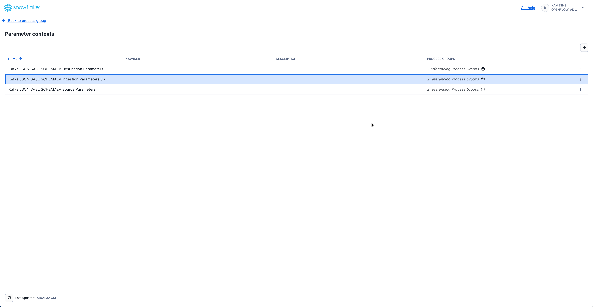

### Configure Kafka Source Parameters

Configure the Kafka connection details including broker endpoints, security protocol, and authentication.

#### Access Kafka Source Parameters

From the Parameter contexts list, click the **three dots menu (⋮)** next to **Kafka JSON SASL SCHEMAEV Source Parameters** and select **Edit**.

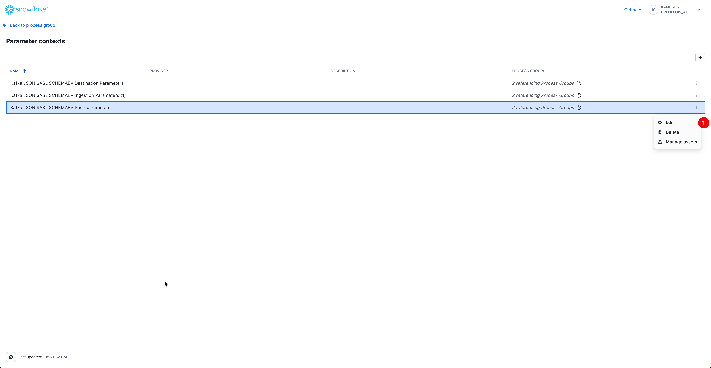

Click on the **Parameters** tab and configure the following values:

| Parameter | Value | Description |
|-----------|-------|-------------|
| **Kafka Bootstrap Servers** | `pkc-n98px.us-west-2.aws.confluent.cloud:9092` | Your Kafka broker endpoint(s). Replace with your actual broker address from the `rpk cluster info` output. For multiple brokers, use comma-separated list (e.g., `broker1:9092,broker2:9092,broker3:9092`). |
| **Kafka SASL Mechanism** | `PLAIN` | SASL authentication mechanism. Use `PLAIN` for username/password authentication (Confluent Cloud uses this). |
| **Kafka SASL Password** | `<YOUR-API-SECRET>` | Your Kafka SASL password (called "API Secret" in Confluent Cloud). This will be stored as a sensitive value. |
| **Kafka SASL Username** | `<YOUR-API-KEY>` | Your Kafka SASL username (called "API Key" in Confluent Cloud). |
| **Kafka Security Protocol** | `SASL_SSL` | Security protocol for Kafka connection. `SASL_SSL` provides encrypted connection with authentication. |

> **Connection Details**: These values should match the credentials you configured in the `rpk profile` during the [Setup Kafka Environment](#setup-kafka-environment) section. If you're using Confluent Cloud, these are your API Key (username) and API Secret (password).

Your completed configuration should look like this:

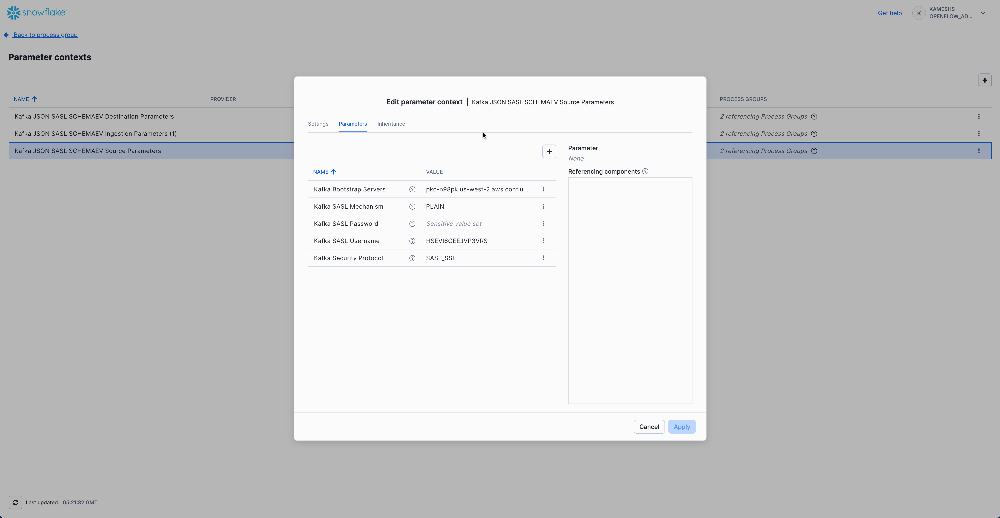

Click **Apply** to save your Kafka source parameters configuration.

### Configure Kafka Destination Parameters

Configure the Snowflake destination connection where Kafka data will be streamed.

> **IMPORTANT**: Ensure you have completed the [Setup Snowflake Environment](#setup-snowflake-environment) section before proceeding. The Kafka connector requires the database, warehouse, and role to be created in advance.

#### Access Kafka Destination Parameters

From the Parameter contexts list, click the **three dots menu (⋮)** next to **Kafka JSON SASL SCHEMAEV Destination Parameters** and select **Edit**.


Click on the **Parameters** tab and configure the following values:

| Parameter | Value | Description |
|-----------|-------|-------------|
| **Destination Database** | `QUICKSTART_KAFKA_CONNECTOR_DB` | Snowflake database where tables will be created (created in [sql/1.snowflake_setup.sql](https://github.com/Snowflake-Labs/sfguide-getting-started-openflow-kafka-connector/blob/main/sql/1.snowflake_setup.sql)) |
| **Destination Schema** | `PUBLIC` | Snowflake schema where tables will be created |
| **Snowflake Account Identifier** | Leave empty | Not required when using session token authentication |
| **Snowflake Authentication Strategy** | `SNOWFLAKE_SESSION_TOKEN` | Uses the runtime's session for authentication (recommended for SPCS deployments) |
| **Snowflake Private Key** | Leave empty | Not required when using session token authentication |
| **Snowflake Private Key File** | Leave empty | Not required when using session token authentication |
| **Snowflake Private Key Password** | Leave empty | Not required when using session token authentication |
| **Snowflake Role** | `QUICKSTART_ROLE` | Runtime role with permissions to create tables and write data (created in [sql/1.snowflake_setup.sql](https://github.com/Snowflake-Labs/sfguide-getting-started-openflow-kafka-connector/blob/main/sql/1.snowflake_setup.sql)) |
| **Snowflake Username** | Leave empty | Not required when using session token authentication |

Your completed configuration should look like this:

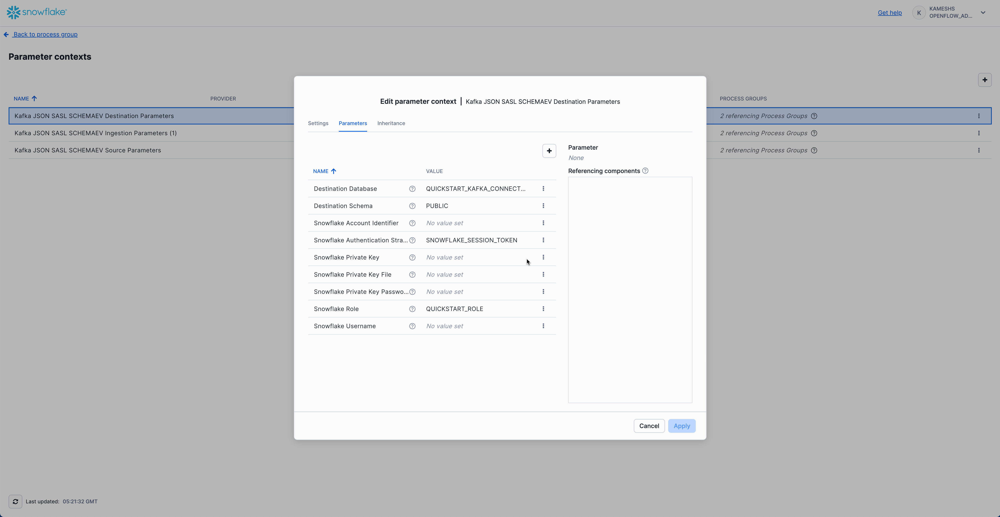

> **Session Token Authentication**: When using `SNOWFLAKE_SESSION_TOKEN`, the connector authenticates using the Openflow runtime's Snowflake session. This is the recommended approach for SPCS deployments as it eliminates the need to manage separate credentials.

Click **Apply** to save your Kafka destination parameters configuration.

### Configure Kafka Ingestion Parameters

Configure Kafka-specific ingestion settings including topics, consumer group, and offset behavior. This parameter context inherits values from both **Kafka Source Parameters** and **Kafka Destination Parameters**.

#### Access Kafka Ingestion Parameters

From the Parameter contexts list, click the **three dots menu (⋮)** next to **Kafka JSON SASL SCHEMAEV Ingestion Parameters (1)** and select **Edit**.

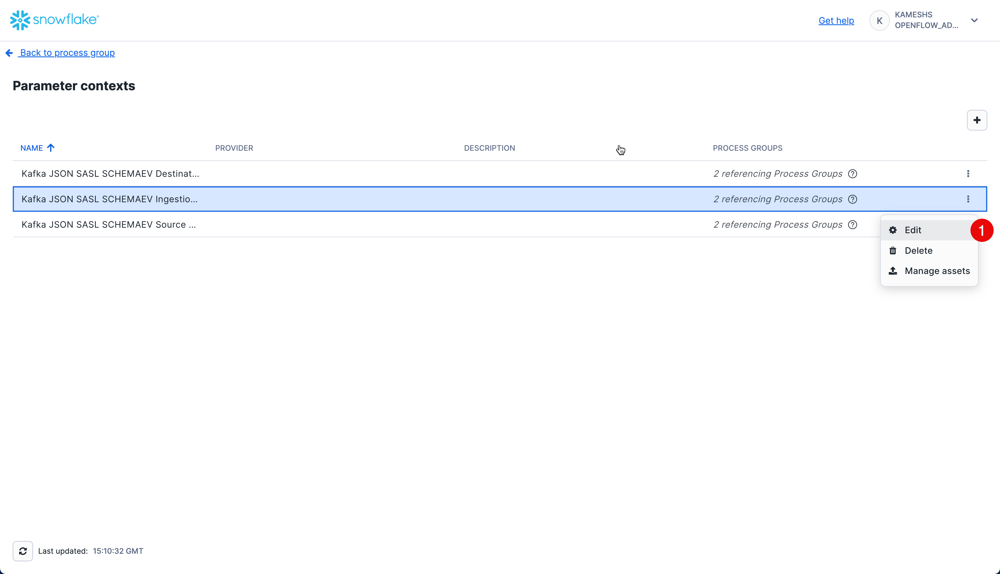

Click on the **Parameters** tab. By default, all parameters including inherited ones are visible. You can toggle the visibility of inherited parameters using the **Show inherited parameters** checkbox at the bottom.

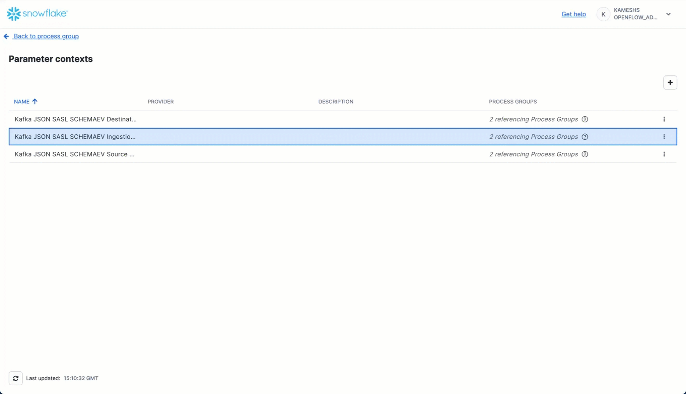

Configure the following key parameters:

| Parameter | Value | Description |
|-----------|-------|-------------|
| **Kafka Auto Offset Reset** | `latest` | Determines where to start reading when no offset exists. Use `latest` to read new messages only, or `earliest` to read from the beginning of the topic. |
| **Kafka Group Id** | `openflow_qs_kafka_connector` | Kafka consumer group ID. This identifies the consumer group and tracks consumed offsets. |
| **Kafka Topic Format** | `names` | Specifies whether to use topic names (as opposed to regex patterns). Use `names` for explicit topic list. |
| **Kafka Topics** | `application-logs` | Comma-separated list of Kafka topics to consume. This should match the topic(s) you created in [Setup Kafka Environment](#setup-kafka-environment). |
| **Topic To Table Map** | Leave empty | Optional mapping to customize table names. If empty, table names will match topic names exactly but converted to uppercase with double quotes (e.g., topic `application-logs` → table `"APPLICATION-LOGS"`). |

**Inherited Parameters** (visible when "Show inherited parameters" is checked):

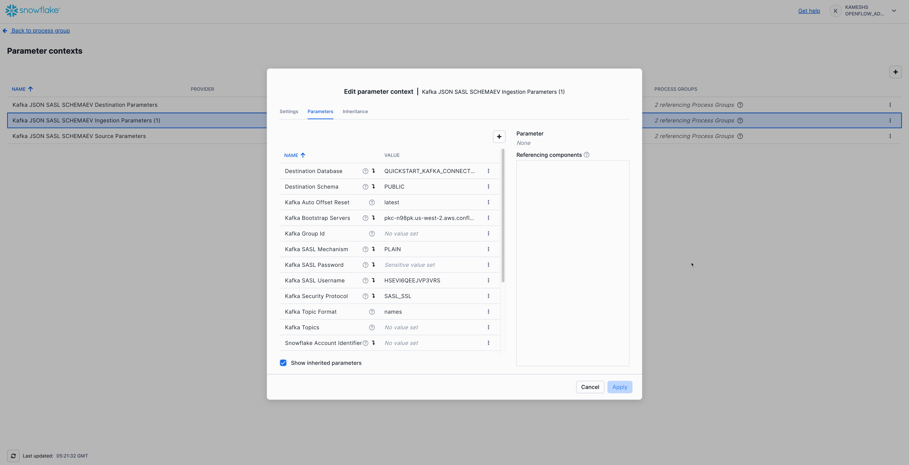

From **Kafka Source Parameters**:

- Kafka Bootstrap Servers
- Kafka SASL Mechanism (`PLAIN`)
- Kafka SASL Username (API Key)
- Kafka SASL Password (API Secret)
- Kafka Security Protocol (`SASL_SSL`)

From **Kafka Destination Parameters**:

- Destination Database
- Destination Schema
- Snowflake Role
- Snowflake Authentication Strategy

Your completed configuration should look like this:

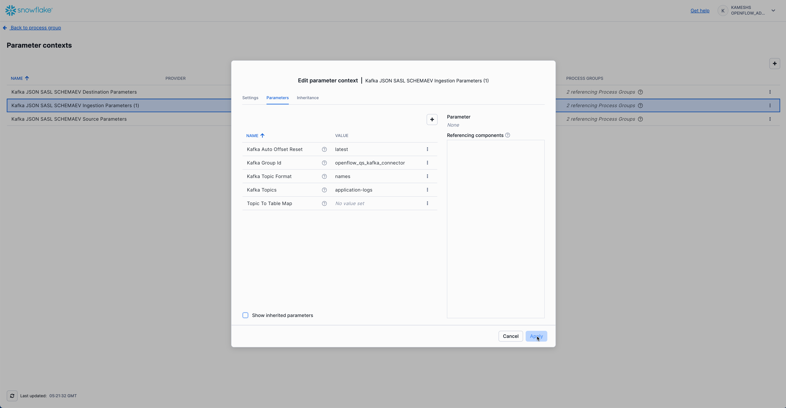

> **Configuration Notes**:
>
> - **Auto Offset Reset**: Use `latest` for real-time streaming (only new messages), or `earliest` to replay all existing messages in the topic.
> - **Consumer Group**: The group ID allows Kafka to track which messages have been consumed. If you restart the connector, it will resume from where it left off.
> - **Table Naming**: By default, Openflow creates tables matching your topic names exactly but converted to uppercase with double quotes following Snowflake standards (e.g., topic `application-logs` → table `"APPLICATION-LOGS"`).

Click **Apply** to save your Kafka ingestion parameters configuration.

### Navigate Back to Process Group

After configuring all three parameter contexts, navigate back to the main Process Group canvas to start the connector. Click the **Navigate Up to Process Group** button in the breadcrumb navigation at the bottom left of the canvas.

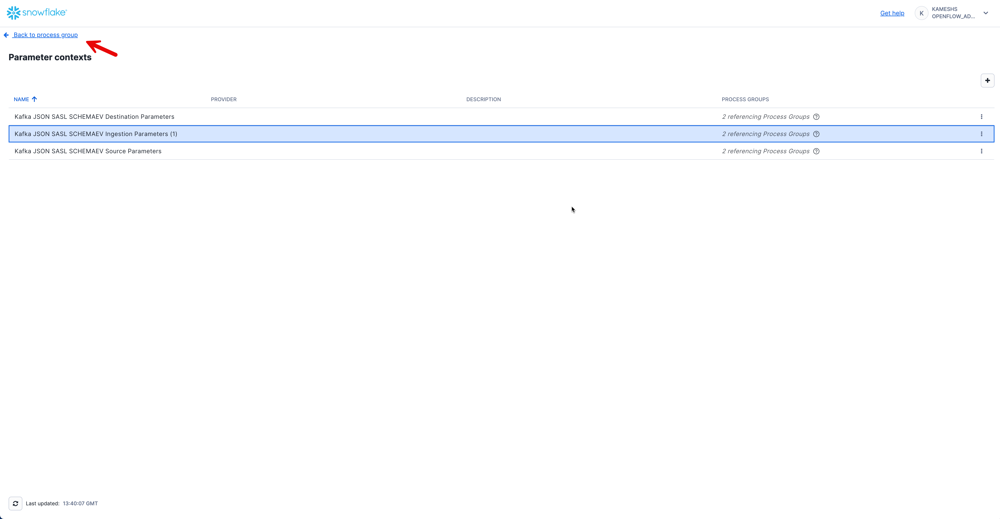

This returns you to the main canvas where you'll see the **Kafka JSON SASL SCHEMAEV** connector ready to be started.

<!-- ------------------------ -->
## Start the Connector

With all three parameter contexts configured, you're now ready to start the Kafka connector and begin streaming data from Kafka to Snowflake.

### Start Process Group

To start the Kafka connector:

1. **Right-click on the canvas** (on an empty area)
2. Select **Start** to start all process groups
3. The connector will begin consuming messages from your Kafka topic
4. Watch the flow metrics update as data flows from Kafka to Snowflake

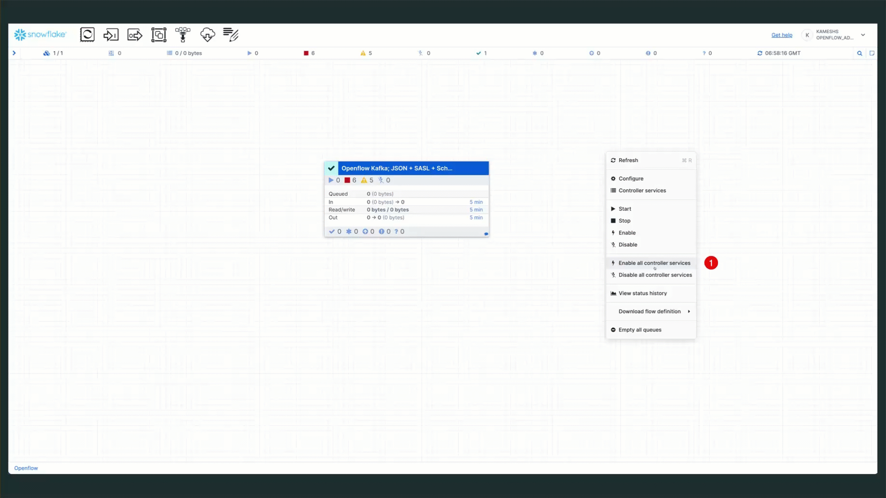

> **Note**: You may see an error message about "Snowflake Private Key Service" failing to enable. This error can be safely ignored since this quickstart uses `SNOWFLAKE_SESSION_TOKEN` authentication instead of private key authentication. The connector will function normally with session token authentication.

> **What's Happening?** The connector:
>
> 1. **Connects to Kafka**: Establishes a connection to your Kafka brokers using the configured credentials
> 2. **Subscribes to Topics**: Begins consuming messages from the `application-logs` topic
> 3. **Streams to Snowflake**: Writes records to Snowflake in near real-time using Snowpipe Streaming
> 4. **Tracks Offsets**: Maintains consumer group offsets so it can resume from where it left off if restarted

Once the connector is running, you should see:

- **Active processors** (green indicators)
- **Messages flowing** through the connections
- **Metrics updating** (messages consumed, bytes transferred, etc.)

Your Kafka connector is now configured and running!

<!-- ------------------------ -->
## Schema Evolution

In this section, you'll witness the power of **automatic schema evolution** by:

1. **Phase 1**: Produce base log messages and verify initial schema
2. **Phase 2**: Produce evolved log messages with new fields and watch new columns appear automatically!

This demonstrates a key advantage of the Openflow Kafka connector—your schema evolves automatically as your application adds new fields.

### Understanding Automatic Schema Detection

The Openflow Kafka JSON/AVRO connector uses [automatic schema detection](https://docs.snowflake.com/en/user-guide/data-integration/openflow/connectors/kafka/kafka-json-avro#schema-detection-and-evolution):

- **Tables are auto-created** from Kafka topic names
- **Message fields become table columns** - Each JSON field becomes an individual column  
- **Data types are inferred** automatically from your data
- **Schema evolves automatically** - New fields in messages add new columns transparently
- **No manual DDL required** - The connector handles all schema changes

> **Key Benefit**: As your application evolves and adds new fields to log messages, corresponding columns are added automatically—no pipeline reconfiguration or manual ALTER TABLE statements needed!

---

## Generate Base Logs

Let's start by producing logs with the base schema and examining the auto-created table structure.

### Install Dependencies (If Not Already Done)

```bash
# Install kafka-python library (skip if already installed)
pip install kafka-python python-dotenv

# Or if you prefer conda
conda install -c conda-forge kafka-python python-dotenv
```

### Produce Base Schema Logs

#### Using Python Generator (Recommended)

Generate 50 log events with the **base schema** (core fields only):

```bash
# Produce base logs (WITHOUT evolved fields)
python $QUICK_START_REPO/sample-data/generate_logs.py --count 50
```

You should see output like:

```
Connecting to Kafka brokers: pkc-xxxxx.aws.confluent.cloud:9092
✓ Connected to Kafka
Producing 50 log events (base schema) to topic 'application-logs'...
  Sent 10/50 events (partition: 0, offset: 125)
  Sent 20/50 events (partition: 1, offset: 89)
  ...
✓ Successfully produced 50 log events (base schema)
```

> **About Record Counts**: Both methods (Python generator and sample file) produce exactly **50 base schema records** for consistency.
>
> - If you ran `--test-connection` earlier, you'll have 51 total records
> - Multiple runs will accumulate records (not replace them)
> - All records include the same 11 base schema fields (some with NULL values where not applicable)

#### Using rpk with Sample File

Alternatively, you can use the provided sample file with rpk (contains 50 base schema records):

```bash
rpk topic produce application-logs -f '%v{json}\n' < $QUICK_START_REPO/sample-data/sample_logs.json
```

##### Generate Custom Sample Files

You can also create custom JSONL sample files without connecting to Kafka:

```bash
# Generate custom base schema file
python $QUICK_START_REPO/sample-data/generate_logs.py --count 100 --output my_logs.json

# Generate custom evolved schema file
python $QUICK_START_REPO/sample-data/generate_logs.py --count 50 --evolved --output my_evolved_logs.json
```

This is useful for testing, creating custom datasets, or regenerating the sample files with updated logic.

### Verify Table Creation

Open Snowsight and verify the table was auto-created:

```sql
-- Set context
USE ROLE QUICKSTART_ROLE;
USE DATABASE QUICKSTART_KAFKA_CONNECTOR_DB;
USE SCHEMA PUBLIC;
USE WAREHOUSE QUICKSTART_KAFKA_CONNECTOR_WH;

-- Check that table was created
SHOW TABLES LIKE 'APPLICATION-LOGS';

-- Count records
SELECT COUNT(*) as TOTAL_RECORDS FROM "APPLICATION-LOGS";
-- Expected: ~50 records (or 51 if you ran --test-connection earlier)
```

### 📸 Capture Initial Schema (Important!)

This is crucial for seeing the "WOW moment" in Phase 2. Run this query and **note the columns**:

```sql
-- Show initial schema columns with data types (sorted alphabetically)
SELECT 
  COLUMN_NAME, 
  DATA_TYPE
FROM QUICKSTART_KAFKA_CONNECTOR_DB.INFORMATION_SCHEMA.COLUMNS 
WHERE TABLE_NAME ILIKE 'APPLICATION-LOGS'
ORDER BY COLUMN_NAME;
```

**Expected Base Columns** (sorted alphabetically):

```
AMOUNT          NUMBER
DURATION_MS     NUMBER
ERROR           TEXT
HOST            TEXT
LEVEL           TEXT
MESSAGE         TEXT
REQUEST_ID      TEXT
SERVICE         TEXT
STATUS_CODE     NUMBER
TIMESTAMP       TEXT
USER_ID         TEXT
```

That's **11 base columns** in Phase 1.

> **Remember These 11 Columns**: We'll run this query again in Phase 2 and see many NEW columns appear automatically!
>
> **Note**: Some columns like `AMOUNT`, `USER_ID`, and `ERROR` may contain NULL values for records where those fields don't apply. For example, only payment-related logs will have `AMOUNT` values, and only ERROR-level logs will have the `ERROR` field populated.

### Query Base Schema Data

Explore the data using direct column access (no JSON parsing needed!):

```sql
-- View sample records
SELECT 
  TIMESTAMP,
  LEVEL,
  SERVICE,
  MESSAGE,
  STATUS_CODE,
  DURATION_MS
FROM "APPLICATION-LOGS"
ORDER BY TIMESTAMP DESC
LIMIT 10;

-- Log level distribution
SELECT 
  LEVEL,
  COUNT(*) as LOG_COUNT
FROM "APPLICATION-LOGS"
GROUP BY LEVEL
ORDER BY LOG_COUNT DESC;

-- Error analysis (ERROR field only appears in ERROR logs)
SELECT 
  TIMESTAMP,
  SERVICE,
  MESSAGE,
  ERROR,
  STATUS_CODE
FROM "APPLICATION-LOGS"
WHERE ERROR IS NOT NULL
ORDER BY TIMESTAMP DESC
LIMIT 10;

-- Service health summary
SELECT 
  SERVICE,
  COUNT(*) as TOTAL_LOGS,
  SUM(CASE WHEN LEVEL = 'ERROR' THEN 1 ELSE 0 END) as ERROR_COUNT,
  SUM(CASE WHEN LEVEL = 'WARN' THEN 1 ELSE 0 END) as WARN_COUNT,
  ROUND(AVG(DURATION_MS), 2) as AVG_DURATION_MS
FROM "APPLICATION-LOGS"
GROUP BY SERVICE
ORDER BY ERROR_COUNT DESC;
```

> **Full Verification Script**: Run `sql/2a.verify_base_schema.sql` for comprehensive Phase 1 verification queries including performance analysis, error summaries, and payment transactions.

---

## Generate Evolved Logs

Now for the **WOW moment**! Let's produce logs with evolved fields and watch new columns appear automatically.

### Produce Evolved Schema Logs

#### Using Python Generator with --evolved Flag (Recommended)

Generate logs with **additional fields** (region, auth_method, currency, etc.):

```bash
python $QUICK_START_REPO/sample-data/generate_logs.py --count 80 --evolved
```

You should see:

```
Producing 80 log events (evolved schema) to topic 'application-logs'...
  Sent 10/80 events (partition: 0, offset: 175)
  Sent 20/80 events (partition: 1, offset: 89)
  ...
  Sent 80/80 events (partition: 2, offset: 201)
✓ Successfully produced 80 log events (evolved schema)
```

#### Using rpk with Evolved Sample File

Alternatively, use the pre-generated evolved sample file with rpk (contains 80 evolved schema records):

```bash
rpk topic produce application-logs -f '%v{json}\n' < $QUICK_START_REPO/sample-data/sample_logs_evolved.json
```

### 🎯 Compare Schemas - NEW Columns Appeared

Run the same INFORMATION_SCHEMA query again and compare with Phase 1:

```sql
-- Show columns NOW - compare with Phase 1!
SELECT 
  COLUMN_NAME, 
  DATA_TYPE
FROM QUICKSTART_KAFKA_CONNECTOR_DB.INFORMATION_SCHEMA.COLUMNS 
WHERE TABLE_NAME ILIKE 'APPLICATION-LOGS'
ORDER BY COLUMN_NAME;
```

**🆕 NEW Columns That Appeared** (sorted alphabetically):

```
AUTH_METHOD           TEXT
AVAILABLE_GB          NUMBER
AVAILABLE_MB          NUMBER
CONTENT_TYPE          TEXT
CURRENCY              TEXT
DISK_USAGE_PERCENT    NUMBER
FILE_SIZE_BYTES       NUMBER
MEMORY_PERCENT        NUMBER
METRICS_COUNT         NUMBER
PAYMENT_METHOD        TEXT
PRODUCT_ID            TEXT
PROVIDER              TEXT
QUERY_PARAMS          VARIANT
RATING                NUMBER
RECIPIENT             TEXT
REGION                TEXT
RESULT_COUNT          NUMBER
RETRY_COUNT           NUMBER
SESSION_DURATION      NUMBER
SMTP_CODE             NUMBER
STATUS                TEXT
TEST                  BOOLEAN
TIME_WINDOW           TEXT
TRACE_ID              TEXT
VALIDATION_ERRORS     VARIANT
VERSION               TEXT
```

**That's 26 new columns automatically added!** (from 11 → 37 total columns)

> **🎉 WOW!** These columns were added **automatically** without any DDL changes, pipeline reconfiguration, or downtime! This is automatic schema evolution in action!

### Query Evolved Schema Fields

Let's explore the new fields:

**1. Records with REGION field**:

```sql
SELECT 
  TIMESTAMP,
  SERVICE,
  MESSAGE,
  REGION,
  TRACE_ID
FROM "APPLICATION-LOGS"
WHERE REGION IS NOT NULL
ORDER BY TIMESTAMP DESC
LIMIT 10;
```

**2. Auth logs with new authentication fields**:

```sql
SELECT 
  TIMESTAMP,
  SERVICE,
  USER_ID,
  AUTH_METHOD,
  PROVIDER,
  REGION
FROM "APPLICATION-LOGS"
WHERE AUTH_METHOD IS NOT NULL
ORDER BY TIMESTAMP DESC;
```

**3. Payment logs with currency information**:

```sql
SELECT 
  TIMESTAMP,
  SERVICE,
  AMOUNT,
  CURRENCY,
  PAYMENT_METHOD,
  USER_ID,
  REGION
FROM "APPLICATION-LOGS"
WHERE CURRENCY IS NOT NULL
ORDER BY TIMESTAMP DESC;
```

**4. File uploads with metadata**:

```sql
SELECT 
  TIMESTAMP,
  SERVICE,
  MESSAGE,
  FILE_SIZE_BYTES,
  CONTENT_TYPE,
  REGION
FROM "APPLICATION-LOGS"
WHERE FILE_SIZE_BYTES IS NOT NULL
ORDER BY TIMESTAMP DESC;
```

**5. System metrics** (appears in WARN logs with memory/disk issues):

```sql
SELECT 
  TIMESTAMP,
  SERVICE,
  MESSAGE,
  MEMORY_PERCENT,
  AVAILABLE_MB,
  DISK_USAGE_PERCENT,
  AVAILABLE_GB,
  REGION
FROM "APPLICATION-LOGS"
WHERE MEMORY_PERCENT IS NOT NULL 
   OR DISK_USAGE_PERCENT IS NOT NULL
ORDER BY TIMESTAMP DESC;
```

> **Note**: System metrics only appear in WARN level logs with messages like "Memory usage above 80%" or "Disk space running low". If this query returns no results, produce more evolved logs to generate system metrics:
>
> ```bash
> # Produce additional evolved logs
> python $QUICK_START_REPO/sample-data/generate_logs.py --count 100 --evolved
> ```

> **Full Schema Evolution Queries**: Run `sql/2b.verify_schema_evolution.sql` for comprehensive queries exploring all evolved fields including API parameters, error retries, email delivery, analytics metrics, and more!

### Understanding What Just Happened

**Key Takeaways**:

✅ **Automatic Column Addition** - New fields in JSON → New columns in table (no manual intervention)  
✅ **Zero Downtime** - Schema evolved while pipeline continued running  
✅ **Backward Compatible** - Old records have NULL for new columns  
✅ **No Pipeline Changes** - Same connector configuration handles both schemas  
✅ **Type Inference** - New columns got appropriate data types automatically  

> **Real-World Benefits**: This schema evolution capability is ideal for:
>
> - Microservices with evolving log formats
> - A/B testing with different instrumentation
> - Gradual feature rollouts
> - Multi-tenant systems with varying schemas
> - DevOps teams that don't want to manage schema migrations

### Troubleshooting

If you don't see data in Snowflake after producing logs:

1. **Check Kafka Topic** - Verify messages exist:

   ```bash
   rpk topic consume application-logs --num 5
   ```

2. **Check Openflow Canvas** - Ensure all processors are running (green status)

3. **Check Offset Reset** - If using `latest`, only new messages after connector start are consumed

> **Tip**: See the [Monitoring the Pipeline](#monitoring-the-pipeline) chapter for detailed monitoring guidance.

<!-- ------------------------ -->
## Log Analytics

Now that logs are streaming into Snowflake, let's perform powerful analytics that would be difficult or expensive in traditional log platforms.

### Basic Log Analytics

Run the analytics queries from `sql/3.analytics_queries.sql`:

#### Count by Log Level

```sql
-- Distribution of log levels
SELECT 
  LEVEL as LOG_LEVEL,
  COUNT(*) as EVENT_COUNT,
  ROUND(COUNT(*) * 100.0 / SUM(COUNT(*)) OVER(), 2) as PERCENTAGE
FROM "APPLICATION-LOGS"
GROUP BY LOG_LEVEL
ORDER BY EVENT_COUNT DESC;
```

**Example Output** (actual counts will vary based on the logs you've generated):

```
LOG_LEVEL | EVENT_COUNT | PERCENTAGE
----------|-------------|------------
INFO      | 350         | 70.00
WARN      | 100         | 20.00
ERROR     | 50          | 10.00
```

> **Note**: The actual counts and percentages will vary depending on how many log events you've produced and the random distribution of log levels generated by the script.

#### Top Error Messages

```sql
-- Most common error messages
SELECT 
  MESSAGE as ERROR_MESSAGE,
  SERVICE,
  COUNT(*) as ERROR_COUNT
FROM "APPLICATION-LOGS"
WHERE LEVEL = 'ERROR'
GROUP BY ERROR_MESSAGE, SERVICE
ORDER BY ERROR_COUNT DESC
LIMIT 10;
```

This helps identify the most frequent errors to prioritize fixing.

#### Service Health Overview

```sql
-- Event count and error rate by service
SELECT 
  SERVICE as SERVICE_NAME,
  COUNT(*) as TOTAL_EVENTS,
  SUM(CASE WHEN LEVEL = 'ERROR' THEN 1 ELSE 0 END) as ERROR_COUNT,
  SUM(CASE WHEN LEVEL = 'WARN' THEN 1 ELSE 0 END) as WARN_COUNT,
  ROUND(ERROR_COUNT * 100.0 / NULLIF(TOTAL_EVENTS, 0), 2) as ERROR_RATE_PCT
FROM "APPLICATION-LOGS"
GROUP BY SERVICE_NAME
ORDER BY ERROR_RATE_PCT DESC;
```

Quickly identify which services have the highest error rates.

### Time-Series Analysis

#### Events Per Minute

```sql
-- Event volume over time (per minute)
SELECT 
  DATE_TRUNC('minute', TO_TIMESTAMP(TIMESTAMP)) as TIME_BUCKET,
  COUNT(*) as EVENTS_PER_MINUTE,
  SUM(CASE WHEN LEVEL = 'ERROR' THEN 1 ELSE 0 END) as ERRORS_PER_MINUTE
FROM "APPLICATION-LOGS"
WHERE TO_TIMESTAMP(TIMESTAMP) >= DATEADD('hour', -1, CURRENT_TIMESTAMP())
GROUP BY TIME_BUCKET
ORDER BY TIME_BUCKET DESC;
```

Visualize event volume trends and error spikes over time.

#### Peak Traffic Hours

```sql
-- Hourly event distribution
SELECT 
  HOUR(TO_TIMESTAMP(TIMESTAMP)) as HOUR_OF_DAY,
  COUNT(*) as EVENT_COUNT,
  AVG(DURATION_MS) as AVG_DURATION_MS
FROM "APPLICATION-LOGS"
WHERE TO_TIMESTAMP(TIMESTAMP) >= DATEADD('day', -1, CURRENT_TIMESTAMP())
  AND DURATION_MS IS NOT NULL
GROUP BY HOUR_OF_DAY
ORDER BY HOUR_OF_DAY;
```

Identify peak usage hours for capacity planning.

> **Note**: The `TIMESTAMP` column is stored as TEXT. We use `TO_TIMESTAMP()` to convert it to TIMESTAMP type for time-based analysis. If your quickstart was just completed, you may see limited data in the last hour/day time windows.

### Performance Analytics

#### Slowest Requests

```sql
-- Slowest requests
SELECT
  SERVICE,
  REQUEST_ID,
  DURATION_MS,
  MESSAGE,
  TIMESTAMP AS REQUEST_TIME,
  LEVEL,
  STATUS_CODE
FROM
  QUICKSTART_KAFKA_CONNECTOR_DB.PUBLIC."APPLICATION-LOGS"
WHERE
  NOT DURATION_MS IS NULL
  AND DURATION_MS > 0
ORDER BY
  DURATION_MS DESC
LIMIT 20;
```

#### Performance by Service

```sql
-- Average performance metrics by service
SELECT
  SERVICE,
  COUNT(*) as TOTAL_REQUESTS,
  ROUND(AVG(DURATION_MS), 2) as AVG_DURATION_MS,
  MIN(DURATION_MS) as MIN_DURATION_MS,
  MAX(DURATION_MS) as MAX_DURATION_MS,
  SUM(
    CASE
      WHEN STATUS_CODE >= 400 THEN 1
      ELSE 0
    END
  ) as ERROR_COUNT,
  ROUND(
    AVG(
      CASE
        WHEN STATUS_CODE >= 400 THEN 1
        ELSE 0
      END
    ) * 100,
    2
  ) as ERROR_RATE_PCT
FROM
  QUICKSTART_KAFKA_CONNECTOR_DB.PUBLIC."APPLICATION-LOGS"
WHERE
  DURATION_MS IS NOT NULL
  AND DURATION_MS > 0
GROUP BY
  SERVICE
ORDER BY
  AVG_DURATION_MS DESC;
```

Calculate average, min, and max latency along with error rates by service—essential SRE metrics!

### Advanced Analytics

#### Error Correlation

```sql
-- Find correlated errors (errors occurring together)
WITH ERROR_WINDOWS AS (
  SELECT
    SERVICE,
    CAST(TIMESTAMP AS TIMESTAMP) AS ERROR_TIME,
    REQUEST_ID,
    STATUS_CODE,
    DURATION_MS,
    DATE_TRUNC ('MINUTE', CAST(TIMESTAMP AS TIMESTAMP)) AS TIME_WINDOW
    /* Create 5-minute time windows */
  FROM
    QUICKSTART_KAFKA_CONNECTOR_DB.PUBLIC."APPLICATION-LOGS"
  WHERE
    LEVEL ILIKE '%ERROR%'
),
SERVICE_PAIRS AS (
  SELECT
    a.SERVICE AS SERVICE_A,
    b.SERVICE AS SERVICE_B,
    a.TIME_WINDOW,
    COUNT(DISTINCT a.REQUEST_ID) AS ERRORS_SERVICE_A,
    COUNT(DISTINCT b.REQUEST_ID) AS ERRORS_SERVICE_B,
    AVG(a.DURATION_MS) AS AVG_DURATION_A,
    AVG(b.DURATION_MS) AS AVG_DURATION_B
  FROM
    ERROR_WINDOWS AS a
    JOIN ERROR_WINDOWS AS b ON a.TIME_WINDOW = b.TIME_WINDOW
    AND a.SERVICE < b.SERVICE
    /* Avoid duplicate pairs */
  GROUP BY
    a.SERVICE,
    b.SERVICE,
    a.TIME_WINDOW
  HAVING
    ERRORS_SERVICE_A > 0
    AND ERRORS_SERVICE_B > 0
)
SELECT
  SERVICE_A,
  SERVICE_B,
  COUNT(*) AS CONCURRENT_ERROR_WINDOWS,
  SUM(ERRORS_SERVICE_A) AS TOTAL_ERRORS_A,
  SUM(ERRORS_SERVICE_B) AS TOTAL_ERRORS_B,
  ROUND(AVG(AVG_DURATION_A), 2) AS AVG_DURATION_A,
  ROUND(AVG(AVG_DURATION_B), 2) AS AVG_DURATION_B
FROM
  SERVICE_PAIRS
GROUP BY
  SERVICE_A,
  SERVICE_B
HAVING
  CONCURRENT_ERROR_WINDOWS > 1
ORDER BY
  CONCURRENT_ERROR_WINDOWS DESC,
  TOTAL_ERRORS_A + TOTAL_ERRORS_B DESC;
```

Discover when errors in one service correlate with errors in another—great for finding cascading failures!

> **Why This Matters**: Traditional log platforms charge premium prices for long retention and complex queries. With Snowflake, you can keep years of logs at low storage costs and run sophisticated SQL analytics without specialized query languages or expensive log indexing.

<!-- ------------------------ -->
## Semantic Search

Enable natural language search over your log messages using Snowflake Cortex Search. This allows you to query logs using plain English through Snowflake Intelligence or programmatically.

All queries in this section are available in `sql/4.cortex_search.sql`.

### Create Cortex Search Service

Create a search service on your log messages with critical attributes as filters:

```sql
USE ROLE QUICKSTART_ROLE;
USE DATABASE QUICKSTART_KAFKA_CONNECTOR_DB;
USE SCHEMA PUBLIC;

-- Create Cortex Search service on log messages
-- Includes both base and evolved schema attributes for comprehensive filtering
CREATE OR REPLACE CORTEX SEARCH SERVICE application_logs_search
  ON MESSAGE
  ATTRIBUTES LEVEL, SERVICE, ERROR, STATUS_CODE, DURATION_MS, MEMORY_PERCENT, DISK_USAGE_PERCENT, REGION
  WAREHOUSE = QUICKSTART_KAFKA_CONNECTOR_WH
  TARGET_LAG = '1 minute'
  AS (
    SELECT 
      MESSAGE,
      LEVEL,
      SERVICE,
      ERROR,
      STATUS_CODE,
      DURATION_MS::NUMBER as DURATION_MS,
      TIMESTAMP,
      REQUEST_ID,
      HOST,
      USER_ID,
      MEMORY_PERCENT::NUMBER as MEMORY_PERCENT,
      AVAILABLE_MB::NUMBER as AVAILABLE_MB,
      DISK_USAGE_PERCENT::NUMBER as DISK_USAGE_PERCENT,
      AVAILABLE_GB::NUMBER as AVAILABLE_GB,
      REGION
    FROM "APPLICATION-LOGS"
  );
```

> **What This Does**:
>
> - **ON MESSAGE**: Indexes the MESSAGE field for semantic search
> - **ATTRIBUTES**: LEVEL, SERVICE, ERROR, STATUS_CODE, DURATION_MS, MEMORY_PERCENT, DISK_USAGE_PERCENT, REGION become filterable dimensions
> - **TARGET_LAG**: Search index updates within 1 minute of new data
> - **Semantic Understanding**: Understands concepts, not just exact text matches
> - **Evolved Schema Support**: Includes both base and evolved schema columns for comprehensive filtering
> - **Type Casting**: Numeric columns (DURATION_MS, MEMORY_PERCENT, AVAILABLE_MB, DISK_USAGE_PERCENT, AVAILABLE_GB) are cast to NUMBER for proper filter operations
> - **Performance Filtering**: DURATION_MS is indexed as an attribute, enabling fast filtering for performance-related searches (e.g., slow requests, timeout issues)

### Query Using Snowflake Intelligence

Once the search service is created, you can use **Snowflake Intelligence** for natural language queries:

**Example questions you can ask**:

- "Show me all payment errors from the last hour"
- "Find authentication failures"
- "What database timeouts occurred?"
- "Show warnings from the inventory service"

Snowflake Intelligence will automatically use your Cortex Search service to find relevant logs!

### Query Programmatically

You can also query the search service using SQL with the [`SNOWFLAKE.CORTEX.SEARCH_PREVIEW` function](https://docs.snowflake.com/en/sql-reference/functions/search_preview-snowflake-cortex):

> **Note**: `SEARCH_PREVIEW` is designed for testing and validation. For production applications requiring low latency, use the Python API or the service's native REST endpoint.

```sql
-- Semantic search for authentication errors
-- Returns MESSAGE, LEVEL, SERVICE, TIMESTAMP, and ERROR columns
SELECT
  SNOWFLAKE.CORTEX.SEARCH_PREVIEW(
    'QUICKSTART_KAFKA_CONNECTOR_DB.PUBLIC.application_logs_search',
    '{
      "query": "authentication failed",
      "columns": ["MESSAGE", "LEVEL", "SERVICE", "TIMESTAMP", "ERROR"],
      "filter": {"@eq": {"LEVEL": "ERROR"}},
      "limit": 10
    }'
  ) AS search_results;

-- Search for payment issues with base schema columns
SELECT
  SNOWFLAKE.CORTEX.SEARCH_PREVIEW(
    'QUICKSTART_KAFKA_CONNECTOR_DB.PUBLIC.application_logs_search',
    '{
      "query": "payment declined timeout",
      "columns": ["MESSAGE", "SERVICE", "STATUS_CODE", "TIMESTAMP", "REQUEST_ID"],
      "filter": {"@eq": {"SERVICE": "payment-service"}},
      "limit": 10
    }'
  ) AS search_results;

-- Find database connection problems
SELECT
  SNOWFLAKE.CORTEX.SEARCH_PREVIEW(
    'QUICKSTART_KAFKA_CONNECTOR_DB.PUBLIC.application_logs_search',
    '{
      "query": "database connection timeout",
      "columns": ["MESSAGE", "LEVEL", "SERVICE", "HOST", "TIMESTAMP"],
      "filter": {"@eq": {"LEVEL": "ERROR"}},
      "limit": 10
    }'
  ) AS search_results;
```

### Search with Multiple Filters

Combine semantic search with multiple attribute filters to narrow down results:

```sql
-- Find errors in payment OR auth services
SELECT
  SNOWFLAKE.CORTEX.SEARCH_PREVIEW(
    'QUICKSTART_KAFKA_CONNECTOR_DB.PUBLIC.application_logs_search',
    '{
      "query": "failed transaction",
      "columns": ["MESSAGE", "LEVEL", "SERVICE", "ERROR", "STATUS_CODE", "TIMESTAMP"],
      "filter": {
        "@and": [
          {"@eq": {"LEVEL": "ERROR"}},
          {"@or": [
            {"@eq": {"SERVICE": "payment-service"}},
            {"@eq": {"SERVICE": "auth-service"}}
          ]}
        ]
      },
      "limit": 20
    }'
  ) AS search_results;

-- Search for system warnings with high memory usage (evolved schema)
SELECT
  SNOWFLAKE.CORTEX.SEARCH_PREVIEW(
    'QUICKSTART_KAFKA_CONNECTOR_DB.PUBLIC.application_logs_search',
    '{
      "query": "memory usage warning system resource",
      "columns": ["MESSAGE", "LEVEL", "SERVICE", "MEMORY_PERCENT", "AVAILABLE_MB", "REGION", "TIMESTAMP"],
      "filter": {
        "@and": [
          {"@eq": {"LEVEL": "WARN"}},
          {"@gte": {"MEMORY_PERCENT": 80}}
        ]
      },
      "limit": 15
    }'
  ) AS search_results;

-- Search for slow requests with performance issues
SELECT
  SNOWFLAKE.CORTEX.SEARCH_PREVIEW(
    'QUICKSTART_KAFKA_CONNECTOR_DB.PUBLIC.application_logs_search',
    '{
      "query": "slow request timeout performance",
      "columns": ["MESSAGE", "SERVICE", "DURATION_MS", "STATUS_CODE", "TIMESTAMP", "REQUEST_ID"],
      "filter": {
        "@gte": {"DURATION_MS": 1000}
      },
      "limit": 20
    }'
  ) AS search_results;
```

> **Benefits of Cortex Search**:
>
> - **Natural Language**: Query logs in plain English, not complex regex
> - **Semantic Understanding**: Finds conceptually similar messages, not just keyword matches
> - **Fast**: Optimized vector search returns results in milliseconds
> - **Always Fresh**: Automatically indexes new logs as they arrive
> - **Snowflake Intelligence Integration**: Works seamlessly for conversational queries

<!-- ------------------------ -->
## Monitoring the Pipeline

Let's monitor the health and performance of your streaming pipeline.

### Monitor Real-Time in Openflow Canvas

The Openflow Canvas provides real-time monitoring of your streaming pipeline. While data flows, observe the streaming statistics on the canvas:

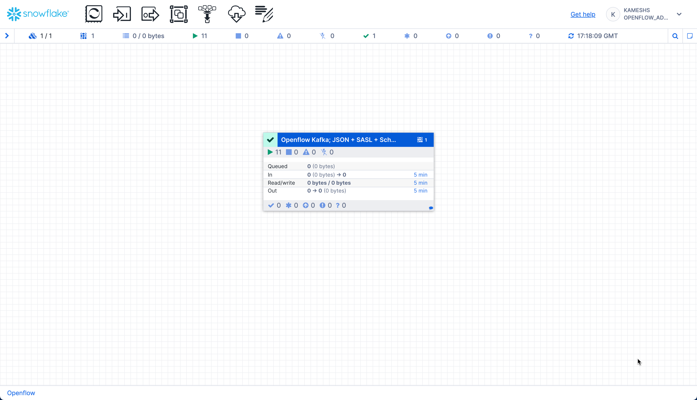

The canvas displays real-time metrics for the connector process group:

- **In**: Number of running processors (e.g., 11 active components)
- **Queued**: FlowFiles waiting to be processed (0 shown = no backlog, which is healthy)
- **In**: FlowFiles entering the process group with data volume
- **Read/Write**: Data throughput rates (bytes read from Kafka / bytes written to Snowflake)
- **Out**: FlowFiles leaving the process group
- **Timing**: All metrics show data for the last "5 min" window

> **Statistics Reset**: The statistics displayed on the canvas reset every **5 minutes**. If you see zeros, it means no data has flowed in the current 5-minute window. This is normal between data generation runs or during idle periods.

#### Drill Down for Detailed Statistics

You can click on individual processors or connections to see detailed statistics and data flow:


**What to Monitor**:

1. **Process Group Statistics** (on the canvas):
   - Running processors count
   - Queue sizes (should be low)
   - Data throughput rates

2. **Individual Processor Stats** (right-click → View Status History):
   - **ConsumeKafka**: Bytes Read, FlowFiles Out, Processing Time
   - **PutSnowflake**: FlowFiles In, Bytes Written, Success Rate

3. **Connection Queues** (click on arrows between processors):
   - FlowFiles Queued (should be minimal)
   - Queue Size (indicates backpressure if large)

> **Healthy Pipeline Indicators**:
>
> - Minimal queue buildup (< 100 FlowFiles queued)
> - Steady data throughput matching your production rate
> - All processors in running state (green)
> - No errors in processor logs
>
> If you see large queues (> 1000), consider scaling up your runtime or adjusting processor concurrency settings.

### Troubleshooting

If you encounter issues with your pipeline:

**No Data Flowing**:

1. Verify Kafka topic has messages: `rpk topic consume application-logs --num 5`
2. Check processors are running (green status in Canvas)
3. Verify network rules allow Kafka broker access
4. Confirm authentication credentials are correct
5. Check consumer group offset (may be at end of topic if using `latest`)

### Set Up Alerts (Optional)

For production pipelines, create Snowflake alerts for automated monitoring:

```sql
USE ROLE QUICKSTART_ROLE;
USE DATABASE QUICKSTART_KAFKA_CONNECTOR_DB;

-- Alert if error rate exceeds threshold
CREATE OR REPLACE ALERT PUBLIC.HIGH_ERROR_RATE_ALERT
  WAREHOUSE = QUICKSTART_KAFKA_CONNECTOR_WH
  SCHEDULE = '5 MINUTE'
  IF (
    SELECT 
      SUM(CASE WHEN LEVEL = 'ERROR' THEN 1 ELSE 0 END) * 100.0 / NULLIF(COUNT(*), 0)
    FROM "APPLICATION-LOGS"
    WHERE TO_TIMESTAMP(TIMESTAMP) >= DATEADD('minute', -5, CURRENT_TIMESTAMP())
  ) > 15  -- Alert if > 15% error rate
  THEN CALL SYSTEM$SEND_EMAIL(
    'DataOps Team',
    'ops@example.com',
    'Kafka Pipeline Alert: Error rate exceeds 15% in last 5 minutes'
  );

-- Alert on critical service errors
CREATE OR REPLACE ALERT PUBLIC.CRITICAL_SERVICE_ALERT
  WAREHOUSE = QUICKSTART_KAFKA_CONNECTOR_WH
  SCHEDULE = '5 MINUTE'
  IF (
    SELECT COUNT(*)
    FROM "APPLICATION-LOGS"
    WHERE LEVEL = 'ERROR'
      AND SERVICE IN ('payment-service', 'auth-service')
      AND TO_TIMESTAMP(TIMESTAMP) >= DATEADD('minute', -5, CURRENT_TIMESTAMP())
  ) > 10
  THEN CALL SYSTEM$SEND_EMAIL(
    'DataOps Team',
    'ops@example.com',
    'Kafka Pipeline Alert: Critical service experiencing multiple errors'
  );
```

> **Customize Alerts**: Adjust thresholds, services, and notification methods based on your operational needs. You can also integrate with [Snowflake notifications](https://docs.snowflake.com/en/user-guide/alerts) for Slack, PagerDuty, or webhook integrations.

<!-- ------------------------ -->
## Cleanup

When you're done with the demo, you can clean up resources to avoid unnecessary costs.

### Stop Openflow Connector

Stop and disable the Kafka connector in the Openflow Canvas:


**Steps**:

1. Open the Openflow Canvas
2. Right-click the connector process group
3. Select **Stop** to stop data flow
4. Right-click again and select **Disable** to prevent accidental restarts
5. Optionally, delete the connector if you won't reuse it

### Clean Up Snowflake Objects (Optional)

If you want to completely remove all demo objects, run the cleanup script from `sql/5.cleanup.sql`:

```sql
-- Use ACCOUNTADMIN to drop objects
USE ROLE ACCOUNTADMIN;

-- Drop Cortex Search service (if created)
DROP CORTEX SEARCH SERVICE IF EXISTS QUICKSTART_KAFKA_CONNECTOR_DB.PUBLIC.application_logs_search;

-- Drop alerts (if created)
DROP ALERT IF EXISTS QUICKSTART_KAFKA_CONNECTOR_DB.PUBLIC.HIGH_ERROR_RATE_ALERT;
DROP ALERT IF EXISTS QUICKSTART_KAFKA_CONNECTOR_DB.PUBLIC.CRITICAL_SERVICE_ALERT;

-- Drop database (this removes all tables and data)
DROP DATABASE IF EXISTS QUICKSTART_KAFKA_CONNECTOR_DB;

-- Drop warehouse
DROP WAREHOUSE IF EXISTS QUICKSTART_KAFKA_CONNECTOR_WH;

-- Drop external access integration
DROP EXTERNAL ACCESS INTEGRATION IF EXISTS quickstart_kafka_connector_access;

-- Note: We don't drop QUICKSTART_ROLE as it may be used by other quickstarts
```

> **Warning**: This will permanently delete all log data and configuration. Make sure you've exported anything you need before dropping objects.

### Clean Up Openflow Runtime (Optional)

If you won't be using Openflow for other connectors:

1. Navigate to **Data > Integrations > Openflow**
2. Click on your deployment
3. Delete the runtime (click ⋮ menu → Delete Runtime)
4. Optionally, delete the deployment

> **Keep Runtime for Other Connectors**: If you plan to use other Openflow connectors (PostgreSQL CDC, Google Drive, etc.), keep your runtime and deployment—they can be reused across multiple connectors!

### Clean Up Kafka Resources (Optional)

If you created a Kafka topic specifically for this demo:

```bash
# Delete the topic using rpk
rpk topic delete application-logs
```

> **Managed Kafka Services**: For Confluent Cloud and other managed Kafka platforms, you can also delete topics through the service console or web UI.

<!-- ------------------------ -->
## Conclusion And Resources

Congratulations! You've successfully built a real-time log streaming pipeline from Kafka to Snowflake using Openflow.

### What You Learned

In this quickstart, you:

- ✅ Configured a Kafka topic for log streaming
- ✅ Set up Snowflake objects (database, tables, network rules)
- ✅ Created an Openflow Snowflake Deployments runtime
- ✅ Configured the Openflow Kafka Connector with automatic schema evolution
- ✅ Streamed real-time logs from Kafka to Snowflake
- ✅ Performed powerful SQL analytics on streaming log data
- ✅ Enabled semantic search with Cortex Search for natural language queries
- ✅ Monitored pipeline health and performance
- ✅ Set up automated alerts for production monitoring

### Key Takeaways

**Real-Time Data**: With Snowpipe Streaming, logs appear in Snowflake within seconds of being produced to Kafka—enabling real-time monitoring and alerting.

**Cost-Effective**: Snowflake's storage costs are significantly lower than dedicated log platforms for long-term retention. Keep years of logs for compliance and historical analysis.

**Powerful Analytics**: SQL is more flexible and powerful than log query languages. Join logs with business data, apply machine learning, and create complex analytical queries.

**Scalable**: The pipeline scales automatically with your data volume. Kafka handles millions of events, Snowflake handles petabytes of data.

### Next Steps

**1. Advanced Kafka Features**:

- Try with **AVRO format** and **Confluent Schema Registry** for schema evolution
- Configure **multiple topics** with topic-to-table mapping
- Implement **SASL_SSL security** for production deployments
- Tune for **high-throughput** using the [performance guide](https://docs.snowflake.com/en/user-guide/data-integration/openflow/connectors/kafka/performance-tuning)

**2. Enhance Analytics & AI**:

- Create **materialized views** for common queries
- Build **Streamlit dashboards** for real-time monitoring  
- Apply **Snowflake Cortex AI** for anomaly detection and log classification
- Expand **Cortex Search** with additional attributes and custom relevance ranking
- Use **Snowflake Intelligence** for conversational log exploration

**3. Try Other Openflow Connectors**:

- [**PostgreSQL CDC**](https://quickstarts.snowflake.com/guide/getting_started_with_openflow_postgresql_cdc/): Replicate database changes in real-time
- [**Google Drive**](https://docs.snowflake.com/en/user-guide/data-integration/openflow/connectors/gdrive/about): Ingest unstructured documents for AI analysis
- [**Kinesis**](https://docs.snowflake.com/en/user-guide/data-integration/openflow/connectors/kinesis/about): Stream data from AWS
- [**MySQL CDC**](https://docs.snowflake.com/en/user-guide/data-integration/openflow/connectors/mysql/about): Replicate MySQL databases

**4. Production Deployment**:

- Set up alerting for pipeline failures
- Implement data quality checks
- Configure backup and failover
- Document runbooks for operations

### Resources

**Openflow & Kafka**:

- [Openflow Documentation](https://docs.snowflake.com/en/user-guide/data-integration/openflow/about)
- [Kafka Connector Documentation](https://docs.snowflake.com/en/user-guide/data-integration/openflow/connectors/kafka/about)
- [Kafka Connector Performance Tuning](https://docs.snowflake.com/en/user-guide/data-integration/openflow/connectors/kafka/performance-tuning)
- [All Openflow Connectors](https://docs.snowflake.com/en/user-guide/data-integration/openflow/connectors/about-openflow-connectors)

**Snowflake Features**:

- [Snowpipe Streaming](https://docs.snowflake.com/en/user-guide/data-load-snowpipe-streaming-overview)
- [Cortex Search](https://docs.snowflake.com/en/user-guide/snowflake-cortex/cortex-search/cortex-search-overview)
- [Snowflake Intelligence](https://docs.snowflake.com/en/user-guide/snowflake-cortex/snowflake-intelligence)
- [Snowflake Alerts](https://docs.snowflake.com/en/user-guide/alerts)

### Feedback

We'd love to hear your feedback! If you have questions or suggestions:

- [Open an issue](https://github.com/Snowflake-Labs/sfquickstarts/issues) on GitHub
- Share your experience on [Snowflake Community](https://community.snowflake.com/)

Thank you for completing this quickstart!
