id: getting-started-with-openflow-postgresql-cdc
categories: snowflake-site:taxonomy/solution-center/certification/quickstart, snowflake-site:taxonomy/product/platform, snowflake-site:taxonomy/snowflake-feature/ingestion, snowflake-site:taxonomy/snowflake-feature/transformation, snowflake-site:taxonomy/snowflake-feature/openflow
language: en
summary: Getting Started with Openflow PostgreSQL Change Data Capture (CDC)
environments: web
status: published
feedback link: <https://github.com/Snowflake-Labs/sfquickstarts/issues>
author: Kamesh Sampath

# Getting Started with PostgreSQL CDC
<!-- ------------------------ -->
## Overview

This quickstart demonstrates how to build a real-time Change Data Capture (CDC) pipeline from PostgreSQL to Snowflake using Openflow. You'll learn how to capture both initial snapshots and incremental changes, enabling real-time analytics on transactional data.

We use a healthcare appointment management system as our demo dataset, but the same patterns apply to any database-based application including e-commerce, CRM, ERP, and other transactional systems.

### Healthcare Appointments Demo Dataset

You'll work with a realistic **Healthcare Appointment Management** system that includes:

- **100 synthetic patients** with diverse demographics
- **10 doctors** across 5 medical specializations
- **170 appointments** (150 historical + 20 upcoming)
- **120 visit records** with diagnoses and charges
- **Real-time CDC events** demonstrating INSERT, UPDATE operations

> **IMPORTANT - Demo Data Disclaimer:** All patient data, doctor information, and healthcare records in this demo are **entirely fictitious** and created for demonstration purposes only. No real PHI (Protected Health Information) is used.

By completing this guide, you will build an end-to-end CDC pipeline that captures changes from PostgreSQL in real-time and enables analytics in Snowflake.

Here is a summary of what you will learn in each step by following this quickstart:

- **Setup Environment**: Configure Snowflake database objects, PostgreSQL instance, and network access
- **Openflow Configuration**: Set up [Openflow](https://docs.snowflake.com/en/user-guide/data-integration/openflow/about) SPCS runtime
- **Add PostgreSQL Connector**: Configure the [PostgreSQL CDC connector](https://docs.snowflake.com/en/user-guide/data-integration/openflow/connectors/postgres/about)
- **Initialize PostgreSQL Database**: Load healthcare schema and synthetic data
- **Verify Snapshot Load**: Confirm initial data capture in Snowflake
- **Generate Live CDC Events**: Simulate real-time appointment operations
- **Real-time Analytics**: Query live data and analyze CDC metadata
- **Monitor CDC Pipeline**: Track replication lag and data quality

### What is Openflow

[Snowflake Openflow](https://docs.snowflake.com/en/user-guide/data-integration/openflow/about) is an integration service that connects any data source and any destination with hundreds of processors supporting structured and unstructured text, images, audio, video and sensor data. Built on Apache NiFi, Openflow lets you run a fully managed service in your own cloud for complete control.

**Key Features and Benefits**:

- **Open and Extensible**: An extensible managed service powered by Apache NiFi, enabling you to build and extend processors from any data source to any destination
- **Unified Data Integration Platform**: Handle complex, bi-directional data extraction and loading through a fully managed service
- **Enterprise-Ready**: Out-of-the-box security, compliance, and observability hooks for data integration
- **High Speed Ingestion**: Handle structured and unstructured data in both batch and streaming modes at virtually any scale
- **Continuous Multimodal Data**: Near real-time unstructured data ingestion from sources like SharePoint, Google Drive, and more

**Openflow Deployment Models**:

Openflow is available in two deployment options, both supporting the same connectors and features:

- **Snowflake Deployment (SPCS)**: Streamlined and integrated solution using Snowpark Container Services. Native integration with Snowflake's security model for seamless authentication, authorization, and network security. *This quickstart uses SPCS deployment.*
- **Bring Your Own Cloud (BYOC)**: Data processing engine runs within your own cloud environment (AWS, Azure, GCP) while Snowflake manages the overall service and control plane. Ideal for handling sensitive data preprocessing locally within your organization's cloud environment.

Learn more at the [Openflow documentation](https://docs.snowflake.com/en/user-guide/data-integration/openflow/about) and [BYOC deployments](https://docs.snowflake.com/en/user-guide/data-integration/openflow/about-byoc).

### What is Change Data Capture (CDC)

Change Data Capture (CDC) is a design pattern that identifies and captures changes made to data in a database, then delivers those changes in real-time to a downstream system. Instead of periodically querying the entire database, CDC efficiently tracks only what changed.

**How PostgreSQL CDC Works**:

PostgreSQL CDC uses **logical replication**, which reads changes from the Write-Ahead Log (WAL). When data is modified in PostgreSQL:

1. Changes are written to the WAL (a transaction log)
2. A replication slot captures these changes
3. A publication defines which tables to track
4. Openflow reads from the replication slot and delivers changes to Snowflake

**CDC Benefits**:

- Changes flow to Snowflake within seconds
- Complete history of all INSERT, UPDATE, DELETE operations  
- Built-in audit trail with CDC metadata
- Minimal overhead on source database
- Only changes are transferred after initial snapshot

**CDC vs Traditional Batch ETL**:

| Aspect | CDC | Batch ETL |
|--------|-----|-----------|
| **Latency** | Seconds | Hours/Days |
| **Data Freshness** | Real-time | Scheduled intervals |
| **Network Impact** | Changes only | Full table scans |
| **Database Load** | Minimal (log reading) | High (full queries) |
| **History** | All changes tracked | Point-in-time snapshots |

Learn more about [PostgreSQL CDC with Openflow](https://docs.snowflake.com/en/user-guide/data-integration/openflow/connectors/postgres/about).

### What You Will Learn

You'll configure PostgreSQL logical replication, set up the Openflow CDC connector, and capture both snapshot and incremental changes. Then you'll use Snowflake Intelligence to query your CDC data with natural language.

### What You Will Build

A real-time healthcare appointment tracking system with an automated CDC pipeline from PostgreSQL to Snowflake, complete with audit trails for all data changes.

### Prerequisites

Before starting, ensure you have:

- **Snowflake Account**: Enterprise account with Openflow Snowflake Deployment enabled (AWS or Azure regions)
- **Account Permissions**: ACCOUNTADMIN role or equivalent for initial setup
- **PostgreSQL Instance**: PostgreSQL 11+ with logical replication enabled. **Recommended**: [Snowflake Postgres](https://www.snowflake.com/en/product/features/postgres/) - see [Getting Started with Snowflake Postgres](https://www.snowflake.com/en/developers/guides/getting-started-with-snowflake-postgres/) for setup. Alternatives: AWS RDS, Amazon Aurora, GCP Cloud SQL, Azure Database, or self-hosted
- **Network Connectivity**: Ability to configure network access from Snowflake to PostgreSQL

> **Openflow Deployment**: This quickstart uses **Openflow Snowflake Deployment** (Snowflake-managed). If you're using [Openflow BYOC deployment](https://docs.snowflake.com/en/user-guide/data-integration/openflow/about-byoc), the connector setup and concepts are the same, but runtime deployment steps will differ.

<!-- ------------------------ -->

## Clone the QuickStart Repository

First, clone the repository to get access to SQL scripts and setup files:

```bash
git clone https://github.com/Snowflake-Labs/sfguide-getting-started-openflow-postgresql-cdc.git
cd sfguide-getting-started-openflow-postgresql-cdc
```

**Repository Contents:**

- **`sql/0.init_healthcare.sql`** - PostgreSQL schema and synthetic data initialization
- **`sql/1.snowflake_setup.sql`** - Snowflake environment setup (role, database, warehouse, network rules)
- **`sql/2.verify_snapshot.sql`** - Snapshot load verification queries
- **`sql/3.live_appointments.sql`** - Live CDC event generation script
- **`sql/4.analytics_queries.sql`** - Real-time analytics query examples

<!-- ------------------------ -->
## Setup PostgreSQL Database

In this section, we'll configure PostgreSQL for CDC and load the healthcare demo data.

### PostgreSQL Requirements

This guide assumes you have a PostgreSQL instance already created and available. Before proceeding, ensure your instance meets these requirements:

> **Required PostgreSQL Configuration**:
>
> - **PostgreSQL instance available**: You have a running PostgreSQL instance (Snowflake Postgres, AWS RDS, GCP Cloud SQL, Azure Database, or self-hosted) with network accessibility
> - **Logical replication enabled**: `wal_level = logical` (required for CDC) - see configuration instructions below
> - **User with REPLICATION privileges**: The PostgreSQL user must have replication permissions
> - **Network access**: Configure network access from Snowflake SPCS to your PostgreSQL instance
> - **Supported versions**: PostgreSQL 11-17
>
> This quickstart was tested with **Snowflake Postgres v17**.

#### Enable Logical Replication (If Not Already Enabled)

PostgreSQL CDC requires logical replication to be enabled. This allows the connector to capture changes from the Write-Ahead Log (WAL).

**Grant REPLICATION privileges to your PostgreSQL user:**

```sql
ALTER USER snowflake_admin WITH REPLICATION;
```

**Enable logical replication** via your PostgreSQL service:

- **Snowflake Postgres**: Logical replication is enabled by default. No additional configuration required. See [Getting Started with Snowflake Postgres](https://www.snowflake.com/en/developers/guides/getting-started-with-snowflake-postgres/) for setup
- **GCP Cloud SQL**: Set the `cloudsql.logical_decoding` and `cloudsql.enable_pglogical` flags to `on`
- **AWS RDS** or **AWS Aurora**: Set `rds.logical_replication = 1` and apply it to your instance
- **Azure Database**: Set `wal_level = logical` via the Azure portal or Azure CLI
- **Self-hosted PostgreSQL**: Edit `postgresql.conf` to set `wal_level = logical` (or run `ALTER SYSTEM SET wal_level = logical;`), then restart PostgreSQL

> **Important**: For detailed configuration instructions specific to your PostgreSQL service, see [Snowflake's PostgreSQL CDC Setup Guide - Configure wal_level](https://docs.snowflake.com/en/user-guide/data-integration/openflow/connectors/postgres/setup#configure-wal-level).

After enabling logical replication and restarting your PostgreSQL instance if needed, you'll verify the `wal_level` setting in the next section after setting up your PostgreSQL client.

### Setup Notes

Before configuring your PostgreSQL environment, note these setup considerations:

- **Service Compatibility**: You can use any PostgreSQL service:
  - Snowflake Postgres (recommended)
  - AWS RDS
  - Amazon Aurora
  - GCP Cloud SQL
  - Azure Database for PostgreSQL
  - Self-hosted PostgreSQL
  
  The SQL scripts are compatible with all variants; configuration steps may vary slightly depending on your service.

- **Client Tools**: You can use any PostgreSQL client you're comfortable with - `psql` command-line tool, pgAdmin, DBeaver, DataGrip, TablePlus, or others. This guide shows `psql` examples, but the SQL scripts work with any client.

- **PostgreSQL User**: This guide uses the `snowflake_admin` user for both CLI connections and Openflow connector configuration. You can use any PostgreSQL user with appropriate privileges (superuser or replication role) - just ensure the user has permissions for logical replication and can create publications and replication slots.

### Setup PostgreSQL Client Environment

This section shows how to install and configure the `psql` command-line tool, which is used throughout this guide.

> **Don't have psql installed?** The `psql` client is part of the PostgreSQL installation:
>
> - **macOS**: `brew install postgresql` (via Homebrew)
> - **Ubuntu/Debian**: `sudo apt-get install postgresql-client`
> - **RHEL/CentOS**: `sudo yum install postgresql`
> - **Windows**: Download from [PostgreSQL Downloads](https://www.postgresql.org/download/windows/)
>
> **Using a different client?** If you prefer pgAdmin, DBeaver, or another GUI client, you can adapt the `psql` commands throughout this guide by running the SQL portion in your client's query window.

#### Set Environment Variables

Set these environment variables to avoid repeating connection parameters:

```bash
export PGHOST='YOUR-POSTGRES-HOST'        # e.g., your Snowflake Postgres endpoint
export PGPORT='5432'
export PGDATABASE='postgres'
export PGUSER='snowflake_admin'
```

These variables will be referenced throughout the guide (e.g., `$PGHOST`, `$PGUSER`) for convenience.

#### Configure Password File

Create a `.pgpass` file to avoid entering your password repeatedly. This file securely stores your PostgreSQL credentials.

```bash
# Create .pgpass file (Unix/Linux/macOS)
echo "$PGHOST:$PGPORT:$PGDATABASE:$PGUSER:YOUR-PASSWORD" >> ~/.pgpass

# Set proper permissions (required for security)
chmod 0600 ~/.pgpass
```

> **Password File Format**: The `.pgpass` file format is `hostname:port:database:username:password`. You can use `*` as a wildcard for any field. Learn more about [PostgreSQL password files](https://www.postgresql.org/docs/current/libpq-pgpass.html).

### Test PostgreSQL Connection

Before proceeding with any configuration, verify that your PostgreSQL instance is accessible and that logical replication is enabled.

#### Check PostgreSQL Accessibility

First, ensure your PostgreSQL instance allows external connections:

**For Snowflake Postgres (Recommended):**

- Your Snowflake Postgres instance is accessible via the endpoint provided during setup
- Network connectivity between Snowflake SPCS and Snowflake Postgres is automatically configured
- Note the **Connection Endpoint** - you'll need this for both client connection and Openflow connector configuration
- See [Getting Started with Snowflake Postgres](https://www.snowflake.com/en/developers/guides/getting-started-with-snowflake-postgres/) for setup details

**For GCP Cloud SQL:**

- Navigate to Cloud SQL instance → **Connections** → **Networking**
- Ensure **Public IP** is enabled (or VPC peering is configured for private)
- Add authorized networks if needed (or configure for broad access during demo)
- Note the **Public IP Address** - you'll need this for both client connection and Snowflake network rule

**For AWS RDS:**

- Navigate to RDS instance → **Connectivity & security**
- Ensure **Publicly accessible** is "Yes" (or VPC peering is configured)
- Check **Security group** allows inbound traffic on port 5432
- Note the **Endpoint** - you'll need this for both client connection and Snowflake network rule

**For Azure Database for PostgreSQL:**

- Navigate to PostgreSQL server → **Connection security**
- Ensure **Allow access to Azure services** is enabled
- Add firewall rules for your IP address
- Note the **Server name** - you'll need this for both client connection and Snowflake network rule

**For self-hosted PostgreSQL:**

- Ensure `pg_hba.conf` allows connections from your IP (or use `0.0.0.0/0` for demo)
- Firewall allows inbound traffic on port 5432
- PostgreSQL is listening on external interfaces (`listen_addresses = '*'` in `postgresql.conf`)

#### Test Basic Connection

Test the connection to your PostgreSQL instance using any method you prefer:

**For Snowflake Postgres:** Use the `psql` connection URL provided during instance creation. The connection string format is typically provided in the Snowflake Postgres setup UI.

**Option 1: Using psql:**

If you set up environment variables and `.pgpass` in the previous section, simply run:

```bash
psql -c "SELECT version();"
```

If you didn't set up environment variables, specify connection parameters explicitly:

```bash
psql -h YOUR-POSTGRES-HOST -p 5432 -U snowflake_admin -d postgres -c "SELECT version();"
```

**Option 2: Using pgAdmin, DBeaver, or other GUI client:**

- Create a new connection with your PostgreSQL host, port, username, and password
- Test the connection
- Run `SELECT version();` to verify

Expected result (version number may vary):

```text
                                                 version                                                  
----------------------------------------------------------------------------------------------------------
 PostgreSQL 17.2 on x86_64-pc-linux-gnu, compiled by gcc (Debian 12.2.0-14) 12.2.0, 64-bit
(1 row)
```

> **Connection Failed?** If you cannot connect to PostgreSQL, resolve this before proceeding. Common fixes:
>
> - **Check firewall**: Ensure port 5432 is open
> - **Check PostgreSQL config**: Verify `listen_addresses` in `postgresql.conf`
> - **Check pg_hba.conf**: Ensure host-based authentication allows your connection
> - **Check cloud provider**: Verify security groups, firewall rules, authorized networks
> - **Verify credentials**: Ensure username and password are correct
>
> All subsequent steps require a working PostgreSQL connection.

#### Verify psql Configuration (Optional)

If you set up environment variables and `.pgpass`, test that they're working correctly:

```bash
psql -c "SELECT current_database(), current_user;"
```

Expected output:

```text
 current_database | current_user 
------------------+--------------
 postgres         | snowflake_admin
(1 row)
```

If the connection succeeds without prompting for a password, your psql environment is configured correctly.

#### Verify Logical Replication

Confirm that logical replication is enabled (as required in the PostgreSQL Requirements section):

> **Snowflake Postgres Advantage:** If you're using Snowflake Postgres, logical replication (`wal_level = logical`) is **enabled by default**. You can skip this verification step, but feel free to confirm it works as expected.

```bash
psql -c "SHOW wal_level;"
```

Expected output:

```text
 wal_level 
-----------
 logical
(1 row)
```

If the output shows `logical`, you're all set! If not, go back to the "Enable Logical Replication" section in PostgreSQL Requirements and ensure you've enabled `wal_level = logical` and restarted your PostgreSQL instance.

### Initialize Healthcare Database

Now we'll initialize the PostgreSQL database with the healthcare schema, synthetic data, and CDC configuration.

#### Execute the Initialization Script

The `sql/0.init_healthcare.sql` script will:

1. Grant replication privileges to the snowflake_admin user
2. Create the `healthcare` schema
3. Create tables: `patients`, `doctors`, `appointments`, `visits`
4. Load 100 synthetic patients, 10 doctors, 170 appointments, and 100 visit records
5. Create indexes for performance
6. Configure CDC publication for logical replication

#### Run the Script

```bash
psql -f sql/0.init_healthcare.sql
```

> **Using a different PostgreSQL client?** If you're using pgAdmin, DBeaver, or another GUI client instead of `psql`, simply open `sql/0.init_healthcare.sql`, copy the entire contents, and execute it in your client's query window. The script contains standard PostgreSQL SQL and will work with any client.
>
> **Script Duration**: Approximately 10-15 seconds to complete.

#### Verify PostgreSQL Setup

Before connecting Openflow, let's verify the entire PostgreSQL CDC configuration is correct.

> **Using a different PostgreSQL client?** All verification queries below use `psql` for consistency. If you're using a GUI client (pgAdmin, DBeaver, etc.), simply run the SQL portion of each command. For example, for `psql -c "SELECT ..."`, just run `SELECT ...` in your client.

#### Check Tables Exist

```bash
psql -c "\dt healthcare.*"
```

Expected output:

```text
              List of relations
   Schema   |     Name     | Type  |      Owner      
------------+--------------+-------+-----------------
 healthcare | appointments | table | snowflake_admin
 healthcare | doctors      | table | snowflake_admin
 healthcare | patients     | table | snowflake_admin
 healthcare | visits       | table | snowflake_admin
(4 rows)
```

#### Check Row Counts

```bash
psql -c "SELECT 
  (SELECT COUNT(*) FROM healthcare.patients) as patients,
  (SELECT COUNT(*) FROM healthcare.doctors) as doctors,
  (SELECT COUNT(*) FROM healthcare.appointments) as appointments,
  (SELECT COUNT(*) FROM healthcare.visits) as visits;"
```

Expected output:

```text
 patients | doctors | appointments | visits 
----------+---------+--------------+--------
      100 |      10 |          170 |    100
(1 row)
```

> **What's a Publication?** A PostgreSQL publication defines which tables are tracked for CDC. The Openflow connector subscribes to this publication to receive change events (INSERT, UPDATE, DELETE) in real-time.

#### Verify CDC Publication

```bash
psql -c "SELECT * FROM pg_publication WHERE pubname = 'healthcare_cdc_publication';"
```

Expected output:

```text
          pubname           | pubowner | puballtables | pubinsert | pubupdate | pubdelete | pubtruncate 
----------------------------+----------+--------------+-----------+-----------+-----------+-------------
 healthcare_cdc_publication |    16390 | t            | t         | t         | t         | t
(1 row)
```

#### Verify Published Tables

```bash
psql -c "SELECT schemaname, tablename FROM pg_publication_tables WHERE pubname = 'healthcare_cdc_publication';"
```

Expected output:

```text
 schemaname |  tablename   
------------+--------------
 healthcare | appointments
 healthcare | doctors
 healthcare | patients
 healthcare | visits
(4 rows)
```

#### Check CDC Configuration

```bash
psql -c "SELECT
    current_setting('wal_level') AS wal_level,
    current_setting('max_replication_slots') AS max_replication_slots,
    current_setting('max_wal_senders') AS max_wal_senders,
    (SELECT count(*) FROM pg_publication) AS publication_count,
    (SELECT count(*) FROM pg_replication_slots) AS active_slots;"
```

Expected output:

```text
 wal_level | max_replication_slots | max_wal_senders | publication_count | active_slots 
-----------+-----------------------+-----------------+-------------------+--------------
 logical   | 10                    | 10              | 1                 | 0
(1 row)
```

> **What to check:**
>
> - `wal_level` should be `logical`
> - `max_replication_slots` should be at least 1 (typically 10 or more)
> - `max_wal_senders` should be at least 1 (typically 10 or more)
> - `publication_count` should be 1 (our healthcare_cdc_publication)
> - `active_slots` will be 0 now, and will increase to 1 once Openflow connects

#### Verify Replication Privileges

```bash
psql -c "SELECT rolname, rolsuper, rolreplication FROM pg_roles WHERE rolname = '$PGUSER';"
```

Expected output:

```text
 rolname         | rolsuper | rolreplication 
-----------------+----------+----------------
 snowflake_admin | f        | t
(1 row)
```

> **Snowflake Postgres Advantage:** If you're using Snowflake Postgres, the `snowflake_admin` user is **pre-configured with replication privileges** (`rolreplication = t`) and is not a superuser (`rolsuper = f`). This is the recommended secure configuration for CDC workloads.
>
> **Note:** For other managed services (AWS RDS, Azure), `rolsuper` is typically `f` (false). For self-hosted installations where you're using the superuser account, it may be `t` (true). The critical column to verify is `rolreplication` which must be `t` (true).

The `rolreplication` column should be `t` (true). If it's `f` (false), grant replication privileges:

```bash
psql -c "ALTER USER $PGUSER WITH REPLICATION;"
```

> **Setup Complete!** Your PostgreSQL database is now fully configured for CDC with:
>
> - ✅ Logical replication enabled
> - ✅ Healthcare schema with 100 patients, 10 doctors, 170 appointments, 100 visits
> - ✅ CDC publication tracking all healthcare tables
> - ✅ Replication privileges granted
>

Next, let us setup the Snowflake environment.

<!-- ------------------------ -->
## Setup Snowflake Environment

In this section, we'll set up the Snowflake objects needed for the CDC pipeline.

### Create Snowflake Objects

Now we'll set up all required Snowflake objects for the CDC pipeline. This includes creating a dedicated role, database, warehouse, and network access configuration.

#### What We're Creating

- **Role**: `QUICKSTART_ROLE` - Dedicated role for Openflow runtime
- **Database**: `QUICKSTART_PGCDC_DB` - Database for healthcare CDC data
- **Warehouse**: `QUICKSTART_PGCDC_WH` - Compute warehouse for data processing
- **Network Rule**: PostgreSQL connection endpoint
- **External Access Integration**: Allows SPCS to connect to PostgreSQL
- **Snowflake Intelligence Infrastructure**: `snowflake_intelligence` database and `agents` schema for AI-powered analytics

#### Execute the Setup Script

Open <a href="https://app.snowflake.com/_deeplink/#/workspaces?utm_source=snowflake-devrel&utm_medium=developer-guides&utm_content=getting-started-with-openflow-postgresql-cdc&utm_cta=developer-guides-deeplink" class="_deeplink">Workspaces</a> in Snowsight (**Projects** → **Workspaces**), copy paste the `sql/1.snowflake_setup.sql` script and execute it.

> **IMPORTANT:** Before running the script, update line 64 with your PostgreSQL endpoint:
>
> ```sql
> VALUE_LIST = ('YOUR-POSTGRES-HOST:5432');
> ```
>
> Replace `YOUR-POSTGRES-HOST` with:
>
> - **Snowflake Postgres**: Your Snowflake Postgres connection endpoint
> - **GCP Cloud SQL**: Your instance's public IP (e.g., `34.123.45.67`)
> - **AWS RDS**: Your RDS endpoint hostname
> - **Azure Database**: Your Azure PostgreSQL server name
> - **Self-hosted**: Your server hostname or IP address

The script will:

1. Create the `QUICKSTART_ROLE` role (or reuse if coming from SPCS quickstart)
2. Create `QUICKSTART_PGCDC_DB` database with two schemas:
   - `HEALTHCARE` - For CDC data tables
   - `NETWORKS` - For network rule definitions
3. Create `QUICKSTART_PGCDC_WH` warehouse (MEDIUM size, auto-suspend after 5 minutes)
4. Create network rule for PostgreSQL connectivity
5. Create external access integration `quickstart_pgcdc_access`
6. Create Snowflake Intelligence infrastructure (`snowflake_intelligence` database and `agents` schema)
7. Grant appropriate permissions

#### Verify Snowflake Setup

After running the script, verify the setup in a new SQL worksheet in Snowsight.

Open a new SQL worksheet and run the following verification queries:

#### Verify Schemas

```sql
USE ROLE QUICKSTART_ROLE;
USE WAREHOUSE QUICKSTART_PGCDC_WH;
SHOW SCHEMAS IN DATABASE QUICKSTART_PGCDC_DB;
```

Expected output (note: the `healthcare` schema will be automatically created by Openflow when the connector is added):

```text
| created_on          | name                  | is_default | is_current | database_name      | owner            | comment | options | retention_time | owner_role_type |
|---------------------|-----------------------|------------|------------|--------------------|--------------------|---------|---------|----------------|-----------------|
| 2025-10-07 10:00:00 | INFORMATION_SCHEMA    | N          | N          | QUICKSTART_PGCDC_DB | ACCOUNTADMIN      |         |         | 1              | ROLE            |
| 2025-10-07 10:00:00 | NETWORKS              | N          | N          | QUICKSTART_PGCDC_DB | QUICKSTART_ROLE   |         |         | 1              | ROLE            |
| 2025-10-07 10:00:00 | PUBLIC                | Y          | N          | QUICKSTART_PGCDC_DB | QUICKSTART_ROLE   |         |         | 1              | ROLE            |
```

#### Verify Integration

```sql
SHOW INTEGRATIONS LIKE 'quickstart_pgcdc_access';
```

Expected output:

```text
| name                      | type              | category          | enabled | comment                                    | created_on          |
|---------------------------|-------------------|-------------------|---------|--------------------------------------------|--------------------|
| quickstart_pgcdc_access   | EXTERNAL_ACCESS   | SECURITY          | true    | OpenFlow SPCS runtime access for PostgreSQL CDC | 2025-10-07 10:00:00 |
```

#### Verify Network Rule

Verify that Snowflake's network rule is correctly configured to allow connections to your PostgreSQL instance.

> **⚠️ IMPORTANT - Snowflake Network Connectivity**
>
> For Openflow to connect to your PostgreSQL instance, two things must be true:
>
> 1. **PostgreSQL must allow inbound connections from Snowflake**: Configure your cloud provider's firewall/security groups to allow connections from Snowflake SPCS IP ranges (or use broad access for demo purposes)
> 2. **Snowflake network rule must match your PostgreSQL host/port**: The network rule created in `1.snowflake_setup.sql` must specify the exact host and port of your PostgreSQL instance
>
> This section verifies requirement #2. If you encounter connection errors when starting the Openflow connector later, you'll need to verify both requirements.

Check the network rule configuration:

```sql
DESC NETWORK RULE QUICKSTART_PGCDC_DB.NETWORKS.postgres_network_rule;
```

Expected output should show your actual PostgreSQL host:

```text
| name                     | type       | mode   | value_list                     | comment |
|--------------------------|------------|--------|--------------------------------|---------|
| postgres_network_rule    | HOST_PORT  | EGRESS | ['your-actual-host.com:5432']  |         |
```

> **⚠️ Host Mismatch?** If the `value_list` doesn't match your PostgreSQL host, you **must** recreate the network rule and external access integration with the correct host:
>
> ```sql
> -- Drop existing objects
> USE ROLE ACCOUNTADMIN;
> DROP INTEGRATION IF EXISTS quickstart_pgcdc_access;
> USE ROLE QUICKSTART_ROLE;
> DROP NETWORK RULE IF EXISTS QUICKSTART_PGCDC_DB.NETWORKS.postgres_network_rule;
> 
> -- Create network rule with CORRECT PostgreSQL host
> USE DATABASE QUICKSTART_PGCDC_DB;
> USE SCHEMA NETWORKS;
> CREATE OR REPLACE NETWORK RULE postgres_network_rule
>   MODE = EGRESS
>   TYPE = HOST_PORT
>   VALUE_LIST = ('YOUR-CORRECT-POSTGRES-HOST:5432');  -- ⚠️ Update this!
> 
> -- Recreate external access integration
> USE ROLE ACCOUNTADMIN;
> CREATE OR REPLACE EXTERNAL ACCESS INTEGRATION quickstart_pgcdc_access
>   ALLOWED_NETWORK_RULES = (QUICKSTART_PGCDC_DB.NETWORKS.postgres_network_rule)
>   ENABLED = true
>   COMMENT = 'OpenFlow SPCS runtime access for PostgreSQL CDC';
> 
> -- Grant to role
> GRANT USAGE ON INTEGRATION quickstart_pgcdc_access TO ROLE QUICKSTART_ROLE;
> 
> -- Verify
> USE ROLE QUICKSTART_ROLE;
> SHOW INTEGRATIONS LIKE 'quickstart_pgcdc_access';
> ```

**✅ Network Rule Verification Complete!**

You've verified that the Snowflake network rule matches your PostgreSQL host and port.

> **Note**: Full end-to-end connectivity (Snowflake → PostgreSQL) will be tested when the Openflow connector starts. If you encounter connection errors during connector startup, verify:
>
> 1. PostgreSQL firewall/security groups allow inbound connections from Snowflake SPCS
> 2. Network rule configuration is correct (verified above)
> 3. PostgreSQL credentials are correct
> 4. PostgreSQL is running and accessible

<!-- ------------------------ -->
## Openflow Configuration

In this section, you'll set up the Openflow Snowflake Deployments infrastructure needed to run the PostgreSQL connector. Before proceeding, ensure you've completed the Snowflake setup with `QUICKSTART_ROLE`, `QUICKSTART_PGCDC_DB` database, and `QUICKSTART_PGCDC_WH` warehouse.

### Complete Openflow Snowflake Deployments Setup

This CDC quickstart builds on the foundational Openflow Snowflake Deployments setup. Navigate to the [Getting Started with Openflow Snowflake Deployments](/en/developers/guides/getting-started-with-openflow-spcs/) quickstart and complete the following two sections (approximately 15 minutes total):

- **Setup Core Snowflake**: Create `OPENFLOW_ADMIN` role and enable BCR Bundle 2025_06.

- **Create Deployment**: Set up your Openflow Snowflake Deployment (e.g., `QUICKSTART_DEPLOYMENT`).

Once your deployment is active, return here to create a runtime. If you already have an Openflow deployment, you can skip the deployment creation and just ensure you select the correct deployment name when creating the runtime.

After completing these prerequisite sections, you'll have:

- `OPENFLOW_ADMIN` role with deployment privileges
- BCR Bundle 2025_06 enabled (required for CDC connectors)
- Active Openflow deployment
- Network rules for Snowflake infrastructure

### Create Runtime for PostgreSQL CDC

Now that you have an active Openflow deployment, create a runtime environment specifically configured for the PostgreSQL connector.

**Resources from Setup Environment**: You already created the following in the "Setup Environment" section:

- `QUICKSTART_ROLE` - Runtime role
- `QUICKSTART_PGCDC_DB` - Database with `NETWORKS` schema  
- `QUICKSTART_PGCDC_WH` - Warehouse
- `postgres_network_rule` - Network rule
- `quickstart_pgcdc_access` - External access integration

#### Verify External Access Integration

Verify the external access integration created in the "Setup Environment" section:

```sql
USE ROLE QUICKSTART_ROLE;

-- Verify integration exists and is enabled
SHOW INTEGRATIONS LIKE 'quickstart_pgcdc_access';
DESC INTEGRATION quickstart_pgcdc_access;
```

Expected output for `SHOW INTEGRATIONS`:

```text
| name                     | type              | category | enabled | comment                                              | created_on          |
|--------------------------|-------------------|----------|---------|------------------------------------------------------|---------------------|
| quickstart_pgcdc_access  | EXTERNAL_ACCESS   | SECURITY | true    | OpenFlow SPCS runtime access for PostgreSQL CDC      | 2025-10-07 10:00:00 |
```

> **What's an External Access Integration?** This allows your Openflow runtime to communicate with external services (your PostgreSQL database) from within Snowpark Container Services. The `postgres_network_rule` you created earlier defines which PostgreSQL endpoints are accessible.

#### Create Runtime via Snowsight

Follow these steps to create your runtime:

1. **Navigate to Openflow**: Go to **Work with data** → **Ingestion** → **Openflow**
2. **Switch to Runtimes Tab**: Click the **Runtimes** tab
3. **Ensure Correct Role**: Verify your role is set to `OPENFLOW_ADMIN` (check top-right corner of Snowsight)
4. **Click Create Runtime**: Click the **+ Runtime** button
5. **Configure Runtime**:
   - **Name**: `QUICKSTART_PGCDC_RUNTIME`
   - **Deployment**: Select `QUICKSTART_DEPLOYMENT` (or your deployment name)
   - **Runtime Role**: Select `QUICKSTART_ROLE`
   - **External Access Integration**: Select `quickstart_pgcdc_access`
6. **Click Create**: Complete the runtime creation

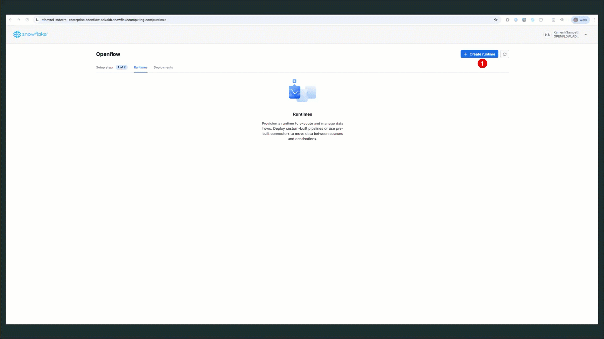

> **Runtime Creation Time**: Runtime creation typically takes 3-5 minutes. The status will progress from `CREATING` → `ACTIVE`.

#### Verify Runtime Status

Check that your runtime is active:

1. **Navigate to Runtimes Tab**: Go to **Work with data** → **Ingestion** → **Openflow** → **Runtimes**
2. **Check Status**: Look for `QUICKSTART_PGCDC_RUNTIME` with status **ACTIVE**

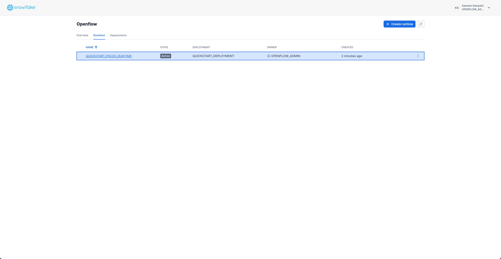

Expected status: **ACTIVE**

> **Troubleshooting**: If the runtime status shows `ERROR` or stays in `CREATING` for more than 10 minutes:
>
> - Verify the external access integration exists: `SHOW INTEGRATIONS LIKE 'quickstart_pgcdc_access';`
> - Check that `QUICKSTART_ROLE` has all required grants: `SHOW GRANTS TO ROLE QUICKSTART_ROLE;`
> - Review the [Openflow Snowflake Deployments](/en/developers/guides/getting-started-with-openflow-spcs/) troubleshooting guide

#### Access the Runtime Canvas

Once your runtime is active, you can access the Openflow canvas to add and configure connectors:

**Click on the runtime name** (`QUICKSTART_PGCDC_RUNTIME`) to open the canvas. This will open in a new browser tab where you'll configure connectors and build your data pipeline.

> **Authentication**: When opening the runtime canvas for the first time, you may be prompted to authenticate/authorize access. Accept these prompts to allow the canvas to access the runtime and required resources.

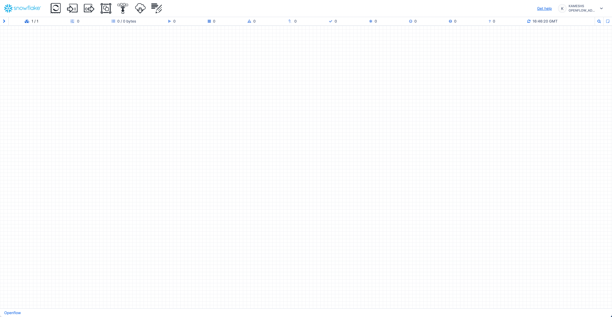

> **REFERENCE DOCUMENTATION:**
>
> For detailed information, see [Create runtime](https://docs.snowflake.com/en/user-guide/data-integration/openflow/setup-openflow-spcs-create-runtime) in the official documentation.

<!-- ------------------------ -->
## Add PostgreSQL Connector

Navigate to your Openflow runtime canvas. In Snowsight's Openflow UI, you can access the canvas by clicking on the runtime name from the Overview page.

### Openflow Database CDC Connectors

While this quickstart focuses on PostgreSQL, the concepts and workflow apply to all Openflow database CDC connectors. Openflow provides CDC connectors for major relational databases, enabling real-time replication of database tables into Snowflake for comprehensive, centralized reporting.

#### Supported Databases

- **[PostgreSQL](https://docs.snowflake.com/en/user-guide/data-integration/openflow/connectors/postgres/about)**: Versions 11-17 (Snowflake Postgres, AWS RDS, Amazon Aurora, GCP Cloud SQL, Azure Database, Standard) - *Used in this quickstart*
- **[MySQL](https://docs.snowflake.com/en/user-guide/data-integration/openflow/connectors/mysql/about)**: Versions 8.0, 8.4 (Standard, AWS RDS, Amazon Aurora, GCP Cloud SQL)
- **[SQL Server](https://docs.snowflake.com/en/user-guide/data-integration/openflow/connectors/sql-server/about)**: SQL Server 2017+ (Standard, AWS RDS, Azure SQL Database)

#### Why Use Openflow for CDC

Openflow provides a unified platform for CDC across all major databases with consistent workflows and metadata, whether you're using PostgreSQL, MySQL, SQL Server, or Oracle (coming soon).

### Add PostgreSQL Connector to Runtime

Navigate to **Work with data** → **Ingestion** → **Openflow** → **Overview**. Follow the animation below to add the PostgreSQL connector to your runtime:


> **New Tab & Authentication**: Adding the connector to your runtime will open a new runtime tab in your browser with the canvas showing the **PostgreSQL** processor group. If prompted, authenticate/authorize access to allow the canvas to access the runtime. You'll configure this connector in the next section.

The **PostgreSQL** connector is now on your canvas. It includes all the processors and services needed for snapshot load and incremental CDC from PostgreSQL to Snowflake.

<!-- ------------------------ -->
## Configure PostgreSQL Connector

The PostgreSQL connector uses three parameter contexts to organize its configuration:

1. **PostgreSQL Source Parameters** - PostgreSQL connection details and CDC-specific settings like publication and replication slot
2. **PostgreSQL Destination Parameters** - Snowflake table mapping and schema configuration
3. **PostgreSQL Ingestion Parameters** - Schema and columns that need to be loaded into Snowflake

To access parameter contexts:

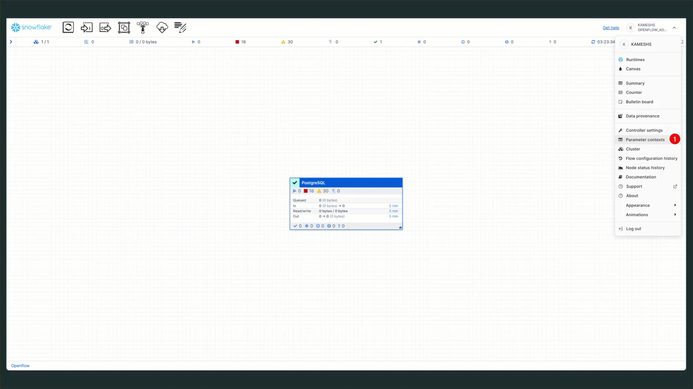

> **Production Tip:** For production deployments, use a SecretManagerParameterProvider (like `AwsSecretsManagerParameterProvider`) to store credentials in a secrets manager rather than directly in the connector configuration.

### Configure PostgreSQL Source Parameters

Configure the PostgreSQL database connection details and CDC-specific settings.

#### Download PostgreSQL JDBC Driver

Before configuring the parameters, download the PostgreSQL JDBC driver that will be used for the database connection.

Get the PostgreSQL JDBC driver from [https://jdbc.postgresql.org/download/](https://jdbc.postgresql.org/download/)

- This quickstart uses `postgresql-42.7.7.jar` (you can use any recent version)

You'll upload this JAR file as a reference asset so the connector can use it to connect to PostgreSQL.

#### Access PostgreSQL Source Parameters

From the Parameter contexts list, click the **three dots menu (⋮)** next to **PostgreSQL Source Parameters** and select **Edit**.

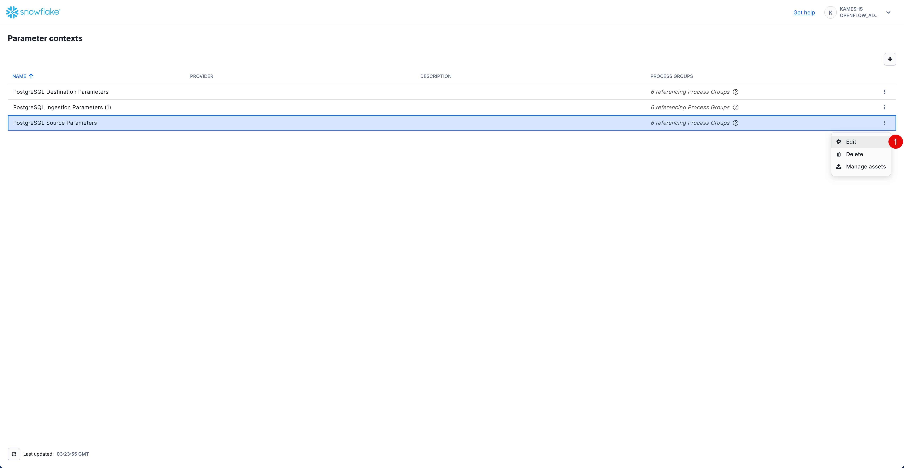

Click on the **Parameters** tab and configure the following values:

| Parameter | Value | Description |
|-----------|-------|-------------|
| **PostgreSQL Connection URL** | `jdbc:postgresql://<YOUR-POSTGRES-HOST>:5432/postgres` | JDBC connection URL to your PostgreSQL instance. Replace `<YOUR-POSTGRES-HOST>` with your actual PostgreSQL host (e.g., your Snowflake Postgres endpoint) |
| **PostgreSQL JDBC Driver** | `postgresql-42.7.7.jar` | Reference to the PostgreSQL JDBC driver JAR (see upload instructions below) |
| **PostgreSQL Password** | `<YOUR-PASSWORD>` | Password for the PostgreSQL user (stored as sensitive value) |
| **PostgreSQL Username** | `snowflake_admin` | PostgreSQL username (or the user you configured with REPLICATION privileges) |
| **Publication Name** | `healthcare_cdc_publication` | Name of the PostgreSQL publication created in [0.init_healthcare.sql](https://github.com/Snowflake-Labs/sfguide-getting-started-openflow-postgresql-cdc/blob/main/sql/0.init_healthcare.sql#L348) |
| **Replication Slot Name** | Leave empty for auto-generation | Optional. If specified, this exact name will be used for the replication slot. If left empty, Openflow automatically generates a unique name following the pattern `snowflake_connector_<unique_id>`. |

> **Connection URL Format**: The PostgreSQL JDBC URL format is `jdbc:postgresql://HOST:PORT/DATABASE`.
>
> - For Snowflake Postgres: Use your Snowflake Postgres endpoint (e.g., `jdbc:postgresql://your-snowflake-postgres-endpoint:5432/postgres`)
> - For GCP Cloud SQL: Use the public IP address (e.g., `jdbc:postgresql://34.123.45.67:5432/postgres`)
> - For AWS RDS: Use the endpoint hostname (e.g., `jdbc:postgresql://mydb.abc123.us-east-1.rds.amazonaws.com:5432/postgres`)
> - For other services: Use your specific connection details

#### Upload JDBC Driver as Reference Asset

Follow the animation below to upload the downloaded JAR file and reference it in the **PostgreSQL JDBC Driver** parameter:


Your completed configuration should look like this:

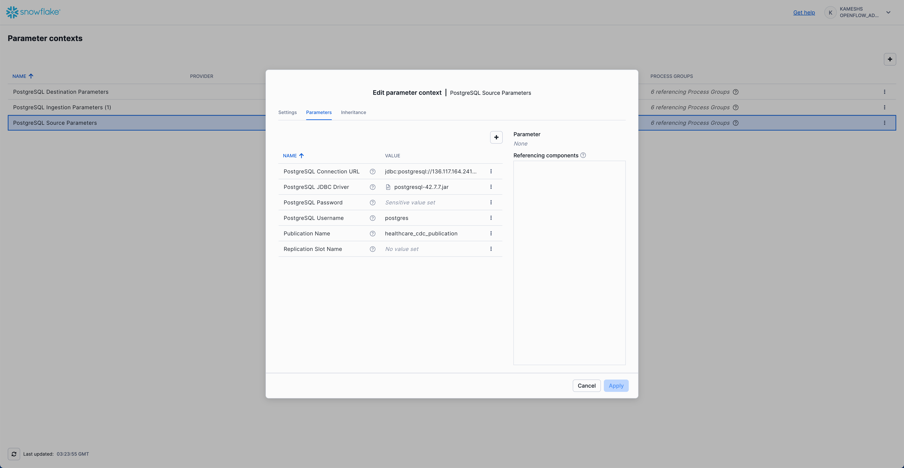

> **Note:** The screenshot shows `postgres` as the PostgreSQL Username. Based on your setup, use the appropriate username (e.g., Snowflake Postgres uses `snowflake_admin` by default).

Click **Apply** to save your PostgreSQL source parameters configuration.

### Configure PostgreSQL Destination Parameters

Configure the Snowflake destination connection where PostgreSQL data will be replicated.

> **IMPORTANT**: Ensure you have completed the [Create Snowflake Objects](#create-snowflake-objects) section before proceeding. The PostgreSQL connector requires the database, warehouse, and role to be created in advance.

#### Access PostgreSQL Destination Parameters

From the Parameter contexts list, click the **three dots menu (⋮)** next to **PostgreSQL Destination Parameters** and select **Edit**.

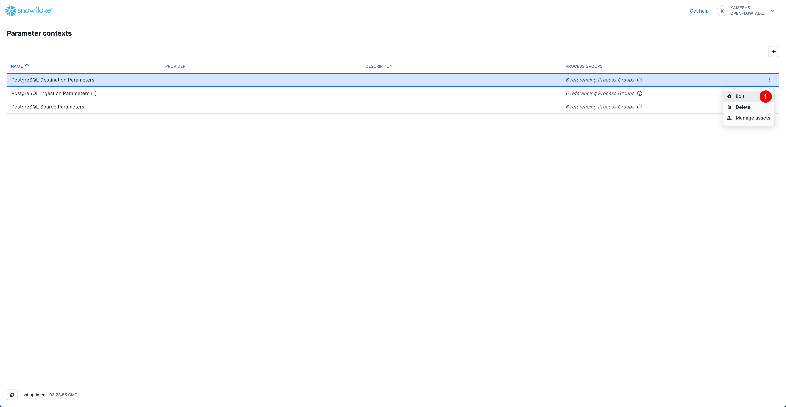

Click on the **Parameters** tab and configure the following values:

| Parameter | Value | Description |
|-----------|-------|-------------|
| **Destination Database** | `QUICKSTART_PGCDC_DB` | Snowflake database where tables will be created (defined in [1.snowflake_setup.sql#L23](https://github.com/Snowflake-Labs/sfguide-getting-started-openflow-postgresql-cdc/blob/main/sql/1.snowflake_setup.sql#L23)) |
| **Snowflake Account Identifier** | Leave empty | Not required when using session token authentication |
| **Snowflake Authentication Strategy** | `SNOWFLAKE_SESSION_TOKEN` | Uses the runtime's session for authentication (recommended for SPCS deployments) |
| **Snowflake Private Key** | Leave empty | Not required when using session token authentication |
| **Snowflake Private Key File** | Leave empty | Not required when using session token authentication |
| **Snowflake Private Key Password** | Leave empty | Not required when using session token authentication |
| **Snowflake Role** | `QUICKSTART_ROLE` | Runtime role with permissions to create tables and write data (defined in [1.snowflake_setup.sql#L20](https://github.com/Snowflake-Labs/sfguide-getting-started-openflow-postgresql-cdc/blob/main/sql/1.snowflake_setup.sql#L20)) |
| **Snowflake Username** | Leave empty | Not required when using session token authentication |
| **Snowflake Warehouse** | `QUICKSTART_PGCDC_WH` | Warehouse for data processing (defined in [1.snowflake_setup.sql#L26](https://github.com/Snowflake-Labs/sfguide-getting-started-openflow-postgresql-cdc/blob/main/sql/1.snowflake_setup.sql#L26)) |

Your completed configuration should look like this:

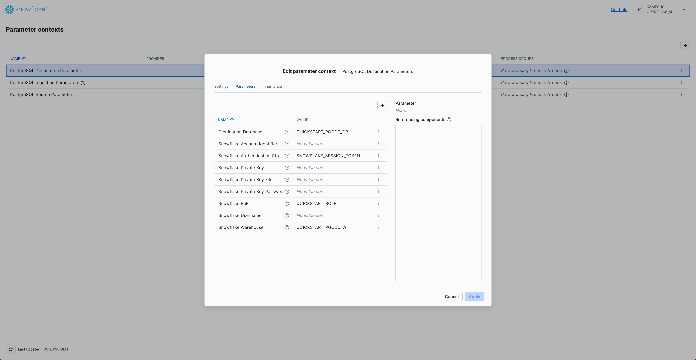

> **Session Token Authentication**: When using `SNOWFLAKE_SESSION_TOKEN`, the connector authenticates using the Openflow runtime's Snowflake session. This is the recommended approach for SPCS deployments as it eliminates the need to manage separate credentials.

Click **Apply** to save your PostgreSQL destination parameters configuration.

### Configure PostgreSQL Ingestion Parameters

Configure CDC ingestion settings and table filters. This parameter context inherits values from both **PostgreSQL Source Parameters** and **PostgreSQL Destination Parameters**.

#### Access PostgreSQL Ingestion Parameters

From the Parameter contexts list, click the **three dots menu (⋮)** next to **PostgreSQL Ingestion Parameters (1)** and select **Edit**.

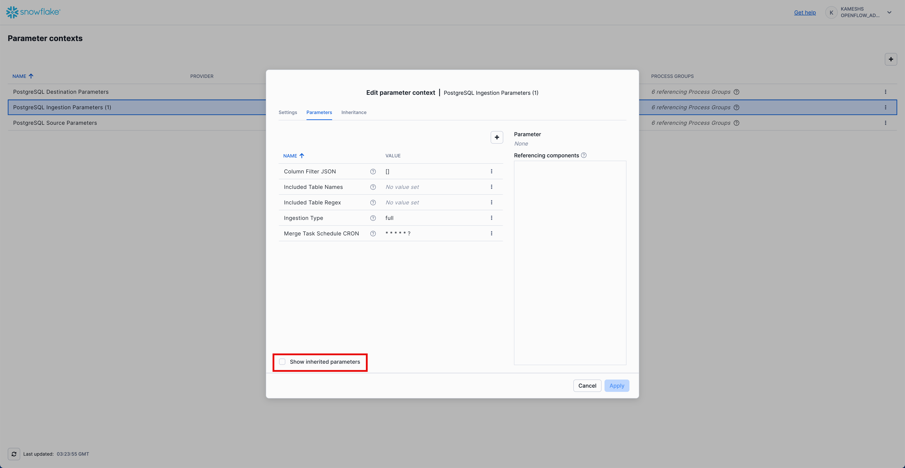

Click on the **Parameters** tab. By default, you'll see only the parameters specific to this context. To view all parameters (including inherited ones), check the **Show inherited parameters** checkbox at the bottom.

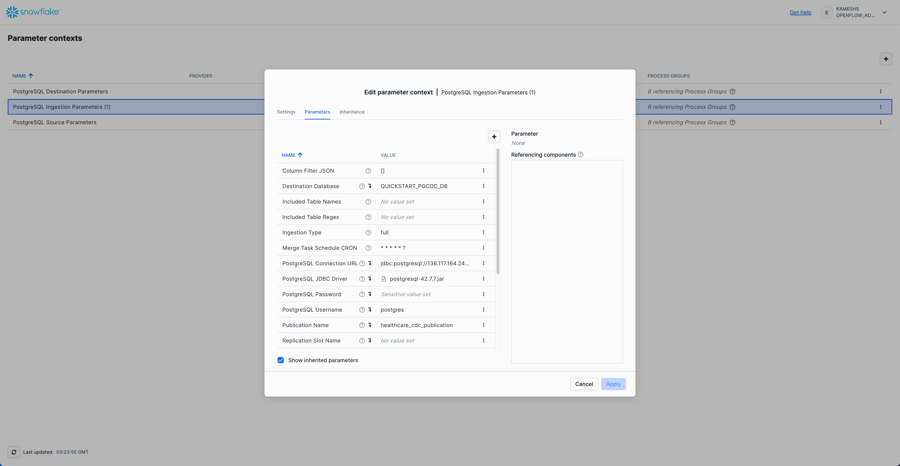

> **Note:** The screenshot shows `postgres` as the PostgreSQL Username. Based on your setup, use the appropriate username (e.g., Snowflake Postgres uses `snowflake_admin` by default).

Configure the following key parameters:

| Parameter | Value | Description |
|-----------|-------|-------------|
| **Column Filter JSON** | `[]` | Empty array means all columns are included |
| **Included Table Names** | Leave empty | Use regex instead for flexible filtering |
| **Included Table Regex** | `healthcare\..*` | Regular expression to match table names for CDC. The pattern `healthcare\..*` matches all tables in the `healthcare` schema. The backslash escapes the dot to match a literal period in the schema-qualified table names (e.g., `healthcare.patients`, `healthcare.doctors`). |
| **Ingestion Type** | `full` | Performs full snapshot followed by incremental CDC. Other option is "incremental" which only performs incremental CDC, existing data is not loaded. |
| **Merge Task Schedule CRON** | `* * * * * ?` | Runs merge tasks every second for near real-time updates |

**Inherited Parameters** (visible when "Show inherited parameters" is checked):

From **PostgreSQL Source Parameters**:

- PostgreSQL Connection URL
- PostgreSQL JDBC Driver
- PostgreSQL Username
- PostgreSQL Password
- Publication Name (`healthcare_cdc_publication` - created in [0.init_healthcare.sql#L348](https://github.com/Snowflake-Labs/sfguide-getting-started-openflow-postgresql-cdc/blob/main/sql/0.init_healthcare.sql#L348))
- Replication Slot Name (auto-generated)

From **PostgreSQL Destination Parameters**:

- Destination Database
- Snowflake Role
- Snowflake Warehouse
- Snowflake Authentication Strategy

Your completed configuration with inherited parameters should look like this:

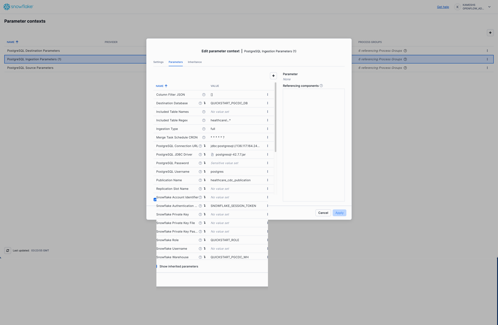

> **Note:** The screenshot shows `postgres` as the PostgreSQL Username. Based on your setup, use the appropriate username (e.g., Snowflake Postgres uses `snowflake_admin` by default).

> **Configuration Notes**:
>
> - **Table Regex Pattern**: The regex `healthcare\..*` matches all tables in the `healthcare` schema. The backslash escapes the dot to match a literal period (e.g., `healthcare.patients`, `healthcare.doctors`, `healthcare.appointments`, `healthcare.visits`).
> - **Merge Task Schedule**: The CRON expression `* * * * * ?` means "every second", providing near real-time CDC updates. For production workloads, adjust based on your latency requirements and cost considerations. Learn more about [Quartz CRON expressions](http://www.quartz-scheduler.org/documentation/quartz-2.3.0/tutorials/crontrigger.html).

Click **Apply** to save your PostgreSQL ingestion parameters configuration.

With all three parameter contexts configured, you're now ready to start the CDC pipeline!

<!-- ------------------------ -->
## Verify Snapshot Load

With the connector configured, you're now ready to start the CDC pipeline and verify that the initial snapshot is loaded correctly.

### Enable Services and Start Connector

Before starting the connector, you need to enable the controller services that manage the CDC replication process.

Follow these steps to enable services and start the connector:

1. **Open Controller Services**: Right-click on the canvas and select "Configure"
2. **Enable Services**: Enable the two controller services (State Provider and Database Connection Pool)
3. **Start Process Groups**: Right-click on the process groups and start them
4. **Monitor Progress**: Watch the connector flow execute the snapshot load

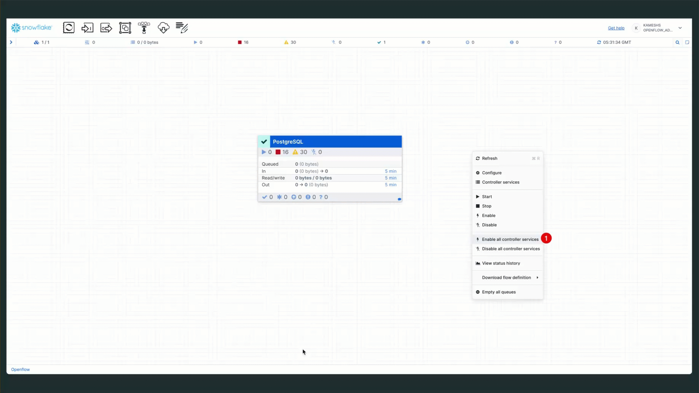

> **Note**: You may see an error message about "Snowflake Private Key Service" failing to enable. This error can be safely ignored since this quickstart uses `SNOWFLAKE_SESSION_TOKEN` authentication instead of private key authentication. The connector will function normally with session token authentication.

> **What's Happening?** The connector performs two main operations:
>
> 1. **Snapshot Load**: Captures all existing data from PostgreSQL tables and loads it into Snowflake
> 2. **CDC Initialization**: Establishes the replication slot and begins listening for changes
>
> The snapshot typically takes 1-2 minutes for the demo dataset. For larger datasets, the duration will be proportional to the data volume.

Once the services are running, your connector status should show all components active:

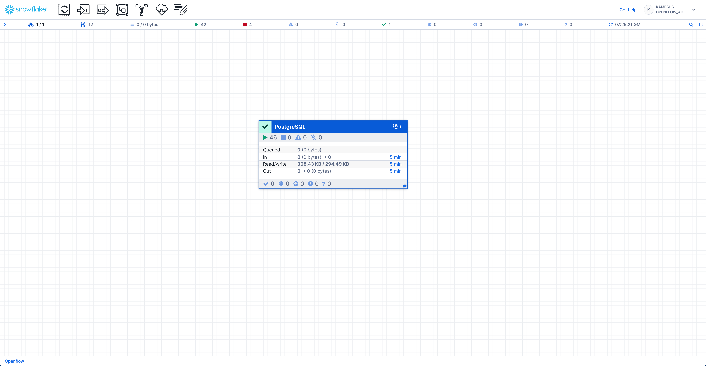

### Verify Data in Snowflake

After the snapshot completes, verify that the data was loaded successfully in Snowflake.

> **IMPORTANT: Identifier Quoting Rule**
>
> PostgreSQL creates lowercase unquoted identifiers (e.g., `healthcare`, `appointments`, `patient_id`). When Openflow replicates these to Snowflake, they are preserved as **case-sensitive lowercase** names.
>
> **In Snowflake, you MUST quote these identifiers in lowercase**:
>
> - ✅ Correct: `USE SCHEMA "healthcare"; SELECT "patient_id", "status" FROM "appointments";`
> - ❌ Wrong: `USE SCHEMA healthcare; SELECT patient_id, status FROM appointments;`
> - ❌ Wrong: `SELECT PATIENT_ID, STATUS FROM APPOINTMENTS;`
>
> Why? Snowflake uppercases unquoted identifiers, so `appointments` becomes `APPOINTMENTS`, which won't match the actual table name `appointments` (lowercase). All queries in this quickstart follow this quoting convention.

#### Check Record Counts

Run the following query in Snowsight to verify all tables were created and populated:

```sql
USE ROLE QUICKSTART_ROLE;
USE DATABASE QUICKSTART_PGCDC_DB;
USE SCHEMA "healthcare";
USE WAREHOUSE QUICKSTART_PGCDC_WH;

SELECT 'patients' as table_name, COUNT(*) as record_count FROM "patients"
UNION ALL
SELECT 'doctors', COUNT(*) FROM "doctors"
UNION ALL
SELECT 'appointments', COUNT(*) FROM "appointments"
UNION ALL
SELECT 'visits', COUNT(*) FROM "visits"
ORDER BY table_name;
```

Expected output:

```text
+----------------+--------------+
| TABLE_NAME     | RECORD_COUNT |
+----------------+--------------+
| APPOINTMENTS   |          170 |
| DOCTORS        |           10 |
| PATIENTS       |          100 |
| VISITS         |          100 |
+----------------+--------------+
```

> Note: The initial snapshot loads 100 rows in `"visits"`. Additional visit records are generated during the Live CDC demo, so this count will increase after running the steps in "Generate Live CDC Events".

#### Verify CDC Metadata

Check that CDC metadata columns are present and confirm the snapshot was loaded:

```sql
SELECT 
    COUNT(*) as total_rows,
    MIN(_SNOWFLAKE_INSERTED_AT) as earliest_inserted,
    MAX(_SNOWFLAKE_INSERTED_AT) as latest_inserted,
    COUNT(DISTINCT _SNOWFLAKE_INSERTED_AT) as unique_insert_timestamps
FROM "appointments";
```

Expected output (timestamps will vary):

```text
+------------+---------------------------+---------------------------+---------------------------+
| TOTAL_ROWS | EARLIEST_INSERTED         | LATEST_INSERTED           | UNIQUE_INSERT_TIMESTAMPS  |
+------------+---------------------------+---------------------------+---------------------------+
|        170 | 2025-10-08 10:15:33.000   | 2025-10-08 10:15:45.000   |                        10 |
+------------+---------------------------+---------------------------+---------------------------+
```

This confirms that all 170 appointments were successfully loaded during the snapshot phase.

> **CDC Metadata Columns**: Openflow automatically adds the following metadata columns to track changes:
>
> - `_SNOWFLAKE_INSERTED_AT` (TIMESTAMP): When the row was first inserted into Snowflake during the snapshot or initial CDC event
> - `_SNOWFLAKE_UPDATED_AT` (TIMESTAMP): When the row was last updated by CDC processing (remains NULL for snapshot-only rows)
> - `_SNOWFLAKE_DELETED` (BOOLEAN): Logical delete flag (FALSE for active rows, TRUE when a DELETE event is captured)
>
> During the Live CDC demo, you'll see `_SNOWFLAKE_UPDATED_AT` populated when records are modified, and `_SNOWFLAKE_DELETED` set to TRUE for deleted records.

#### Verify Appointment Status Distribution

Check the distribution of appointment statuses:

```sql
SELECT 
    "status",
    COUNT(*) as count,
    ROUND(COUNT(*) * 100.0 / SUM(COUNT(*)) OVER (), 2) as percentage
FROM "appointments"
GROUP BY "status"
ORDER BY count DESC;
```

Expected output (approximate - actual counts will vary):

```text
+-----------+-------+------------+
| STATUS    | COUNT | PERCENTAGE |
+-----------+-------+------------+
| completed |   100 |      58.82 |
| cancelled |    40 |      23.53 |
| scheduled |    15 |       8.82 |
| no_show   |    10 |       5.88 |
| confirmed |     5 |       2.94 |
+-----------+-------+------------+
```

> **Note on Data Variability**: The exact counts and percentages will vary each time you run the initialization script because the appointment status is assigned using `RANDOM()` in PostgreSQL. Your actual output might show `completed: 102, cancelled: 44, no_show: 4` or other values, which is completely normal. The important thing is that you see a mix of different statuses with `completed` being the most common (~60%), followed by `cancelled` (~25%).
>
> **Save Baseline Results**: These snapshot results serve as your baseline for comparison. After running the CDC demo, you'll re-run this same query to see how the status distribution changed. Consider saving these results or taking a screenshot for easy side-by-side comparison later.

#### Verify Doctor Workload

Check appointment distribution across doctors:

```sql
SELECT 
    d."first_name" || ' ' || d."last_name" as doctor_name,
    d."specialization",
    d."department",
    COUNT(a."appointment_id") as total_appointments,
    SUM(CASE WHEN a."status" = 'completed' THEN 1 ELSE 0 END) as completed_appointments,
    SUM(CASE WHEN a."status" IN ('scheduled', 'confirmed') THEN 1 ELSE 0 END) as upcoming_appointments
FROM "doctors" d
LEFT JOIN "appointments" a ON d."doctor_id" = a."doctor_id"
GROUP BY d."doctor_id", d."first_name", d."last_name", d."specialization", d."department"
ORDER BY total_appointments DESC
LIMIT 5;
```

This query shows the top 5 doctors by appointment volume, demonstrating that relational joins work correctly with the replicated data.

### Run Additional Verification Queries

For comprehensive verification, run the complete verification script from the companion GitHub repository:

📋 **Full Verification Script**: [2.verify_snapshot.sql](https://github.com/Snowflake-Labs/sfguide-getting-started-openflow-postgresql-cdc/blob/main/sql/2.verify_snapshot.sql)

The full script includes additional checks for:

- Data quality validation (NULL checks)
- Patient demographics analysis
- Revenue summaries by doctor
- Common diagnoses
- Follow-up and prescription statistics

You can run this script directly in Snowsight by copying and pasting the SQL.

> **Snapshot Load Complete!** If all queries return expected results, your PostgreSQL tables are successfully replicated to Snowflake. The connector is now listening for changes and will automatically capture any INSERT, UPDATE, or DELETE operations in real-time.

<!-- ------------------------ -->
## Snowflake Intelligence

Now that the snapshot is loaded, let's set up Snowflake Intelligence before generating CDC events. This allows you to establish a baseline understanding of your data, then observe changes in real-time after running the CDC demo.

> **Why Set Up Intelligence First?** By asking baseline questions about your snapshot data now, you'll be able to compare results after the CDC demo and see exactly how the data changed. This creates a powerful before/after experience for understanding CDC!

### What You'll Build

You'll create an AI agent that can answer questions like:

- "Show me doctor workload for today"
- "Which appointments were updated via CDC in the last hour?"
- "What's the revenue by specialization this month?"
- "How many records were soft-deleted today?"

The agent understands your healthcare schema AND the CDC metadata columns for tracking changes!

### Prerequisites

Before setting up Snowflake Intelligence, ensure you have:

- ✅ Completed snapshot load with Openflow pipeline running
- ✅ Snowflake Intelligence infrastructure created (this was done in `1.snowflake_setup.sql` which created the `snowflake_intelligence` database and `agents` schema)
- ✅ Default role and warehouse set in your Snowflake user profile

### Upload Semantic Model

The semantic model defines your healthcare schema for the AI agent. It includes table definitions, relationships, and CDC metadata columns.

> **NOTE:** The `semantic_models` stage and `snowflake_intelligence` database were already created when you ran `1.snowflake_setup.sql`. You just need to upload the semantic model file!

Upload the semantic model to the stage using Snowsight:

1. Navigate directly to **Ingestion** --> **Add Data**: <a href="https://app.snowflake.com/_deeplink/#/data/add-data?utm_source=snowflake-devrel&utm_medium=developer-guides&utm_campaign=-us-en-all&utm_content=app-getting-started-with-openflow-postgresql-cdc&utm_cta=developer-guides-deeplink" class="_deeplink">Load files into a Stage</a>
2. Select the database, schema, and stage:
   - **Database:** `QUICKSTART_PGCDC_DB`
   - **Schema:** `PUBLIC`
   - **Stage:** `semantic_models`
3. Click **+ Files** and select `healthcare_cdc_semantic_model.yaml` from the `semantic-models/` directory in your cloned repository
4. Click **Upload**

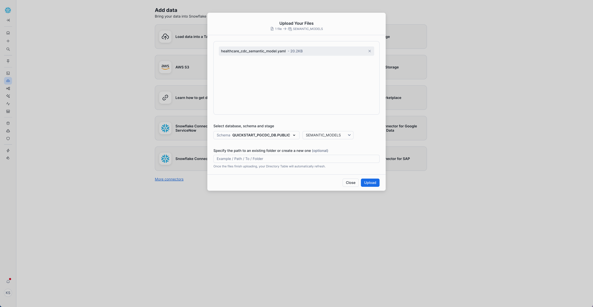

Or use Snowflake CLI:

```bash
snow stage put semantic-models/healthcare_cdc_semantic_model.yaml @semantic_models \
  --database QUICKSTART_PGCDC_DB \
  --schema PUBLIC \
  --role QUICKSTART_ROLE \
  --overwrite
```

Verify the upload via <a href="https://app.snowflake.com/_deeplink/#/data/databases/QUICKSTART_PGCDC_DB/schemas/PUBLIC/stage/SEMANTIC_MODELS?utm_source=snowflake-devrel&utm_medium=developer-guides&utm_campaign=-us-en-all&utm_content=app-getting-started-with-openflow-postgresql-cdc&utm_cta=developer-guides-deeplink" class="_deeplink">Database Explorer</a>

### Create the Agent

> **IMPORTANT:** Before creating the agent, ensure you are using the `QUICKSTART_ROLE` role in Snowsight. This ensures the agent is owned by the correct role and has proper access to resources. You can switch roles using the role selector in the top-right corner of Snowsight.

#### Access Agent Creation Interface

1. Sign in to Snowsight
2. **Switch to `QUICKSTART_ROLE`** using the role selector in the top-right corner
3. Navigate directly to Agents: <a href="https://app.snowflake.com/_deeplink/#/agents?utm_source=snowflake-devrel&utm_medium=developer-guides&utm_campaign=-us-en-all&utm_content=app-buidling-new-snowflake-intelligence-agents&utm_cta=developer-guides-deeplink" class="_deeplink">Create Snowflake Intelligence Agent</a>
4. Select **"Create agent"**

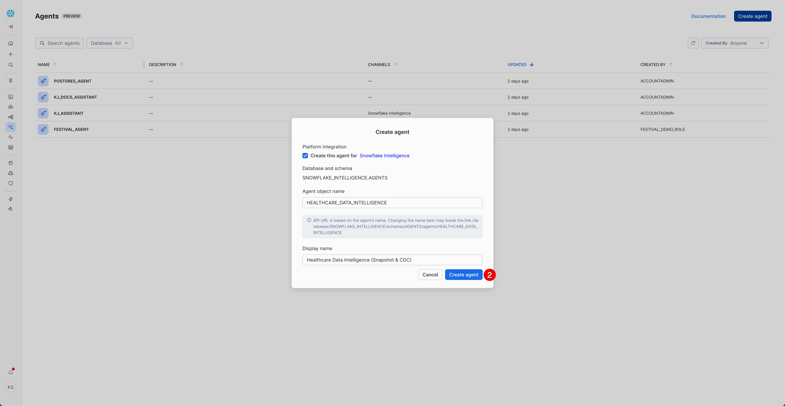

**Platform Integration:**

- ☑️ Select **"Create this agent for Snowflake Intelligence"**

**Agent Details:**

- **Agent object name:** `HEALTHCARE_DATA_INTELLIGENCE`
- **Display name:** `Healthcare Data Intelligence (Snapshot & CDC)`

#### Configure Agent Basics

After creating the agent, configure its details:

1. **Click on the agent name** (`HEALTHCARE_DATA_INTELLIGENCE`) in the agent list to open it

   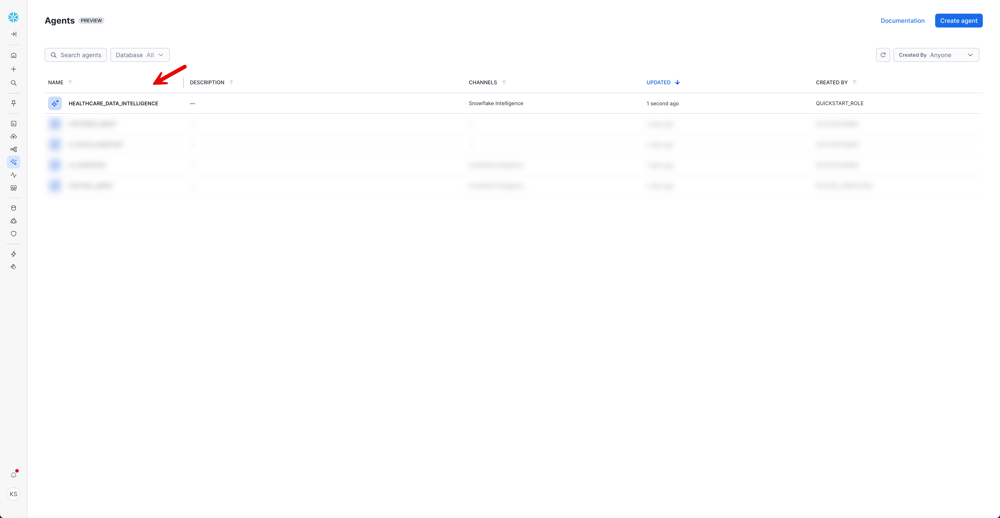

2. **Click "Edit"** button to start editing the agent configuration

   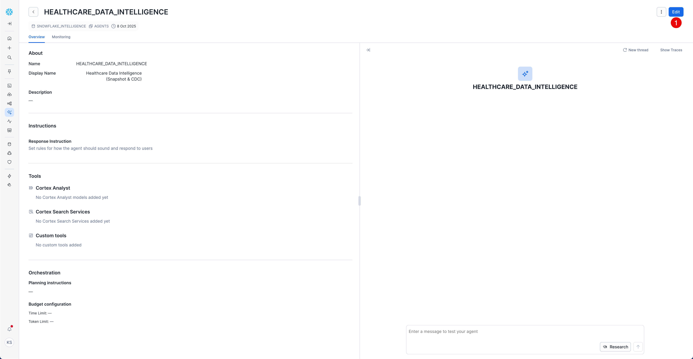

> **IMPORTANT:** As you configure each section below (About, Tools, Orchestration, Access), remember to click **"SAVE"** after completing all configurations to ensure your changes are preserved.

Now configure the agent basics in the "About" section:

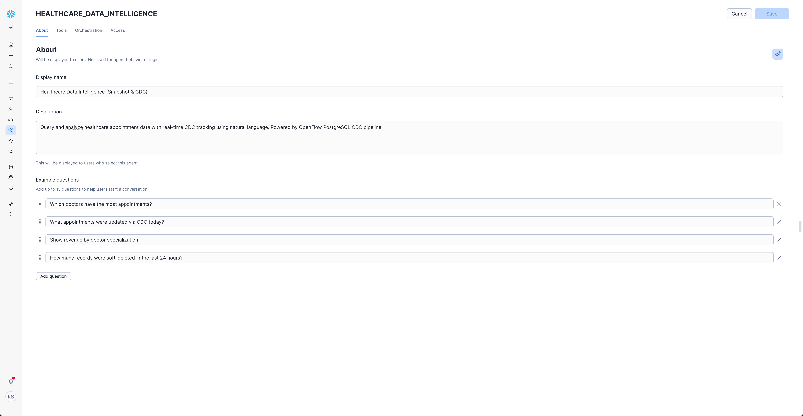

- **Description:** `Query and analyze healthcare appointment data with real-time CDC tracking using natural language. Powered by OpenFlow PostgreSQL CDC pipeline.`

**Example Questions** (Add these to help users get started):

```text
"Show me the appointment status distribution"
```

```text
"Which doctors have the most appointments?"
```

```text
"What appointments were updated via CDC today?"
```

```text
"Show revenue by doctor specialization"
```

```text
"How many records were soft-deleted in the last 24 hours?"
```

### Configure Agent Tools

#### Add Semantic Model


1. Navigate to **"Tools"** tab
2. Find **"Semantic Models"** section
3. Click **"+ Add"** button

**Configure the Semantic Model:**

- **Name:** `HEALTHCARE_DATA_ANALYTICS`
- **Stage:** `@PUBLIC.semantic_models`
- **File:** `healthcare_cdc_semantic_model.yaml`
- **Description:** `Healthcare appointment management with real-time snapshot and CDC data tracking`

> **TIP:** The semantic model includes definitions for all four tables (patients, doctors, appointments, visits) plus their relationships and CDC metadata columns (_Snowflake_INSERTED_AT,_Snowflake_UPDATED_AT, _Snowflake_DELETED).

### Configure Orchestration

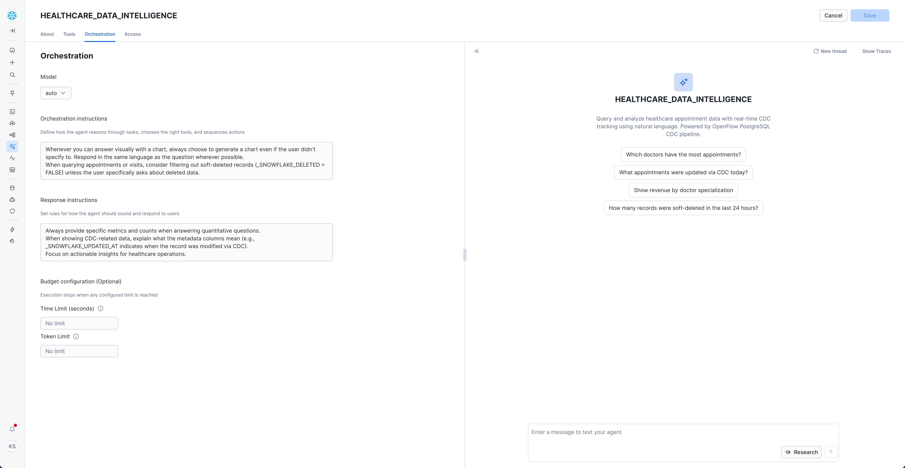

1. Navigate to **"Orchestration"** tab
2. Set **Model:** `auto` (recommended - lets Snowflake choose the optimal model)

**Orchestration Instructions:**

```
Whenever you can answer visually with a chart, always choose to generate a chart even if the user didn't specify to. 
Respond in the same language as the question wherever possible.
When querying appointments or visits, consider filtering out soft-deleted records (_SNOWFLAKE_DELETED = FALSE) unless the user specifically asks about deleted data.
```

**Response Instructions:** (Optional)

```
Always provide specific metrics and counts when answering quantitative questions.
When showing CDC-related data, explain what the metadata columns mean (e.g., _SNOWFLAKE_UPDATED_AT indicates when the record was modified via CDC).
Focus on actionable insights for healthcare operations.
```

> **TIP:** Use `auto` (default) to let Snowflake automatically select the best available model for your region and query type. Supported models include Claude 4.0, Claude 3.7, Claude 3.5, and GPT 4.1.

### Set Access Controls

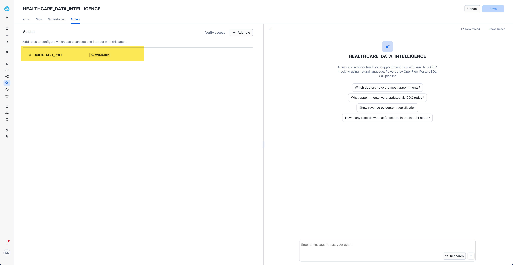

1. Navigate to **"Access"** tab
2. Click **"Add role"**
3. Select appropriate roles for your organization

**Example Role Configuration:**

- **Role:** `QUICKSTART_ROLE`
- **Permission:** `OWNERSHIP`

> **NOTE:** All queries use the user's credentials. Ensure users have appropriate access to the `QUICKSTART_PGCDC_DB."healthcare"` schema and underlying tables.

### Ask Baseline Questions (Snapshot Data)

Now that your agent is configured, let's ask baseline questions about the snapshot data to establish the initial state.

#### Getting Started with Queries

1. Access Snowflake Intelligence: [Open Snowflake Intelligence](https://ai.snowflake.com/)
2. Select your agent `Healthcare Data Intelligence (Snapshot & CDC)` from the dropdown

   

3. Set the role and warehouse for the agent to use:
   - **Role:** `QUICKSTART_ROLE`
   - **Warehouse:** `QUICKSTART_PGCDC_WH`

   

      > **IMPORTANT:** The agent will use these credentials to query your data. Make sure the role has access to the `QUICKSTART_PGCDC_DB."healthcare"` schema and all tables.

4. Start with these baseline questions:

**Baseline Questions:**

```text
"How many total appointments do we have?"
```

**Expected:** ~170 appointments from snapshot load

```text
"Show me the appointment status distribution"
```

**Expected:** Breakdown showing completed (100), cancelled (40), scheduled (15), no_show (10), confirmed (5)

```text
"Which doctors have the most appointments?"
```

**Expected:** List of 10 doctors with appointment counts

```text
"What's the total revenue from all visits?"
```

**Expected:** Sum of charges from 100 visits (~$15,000-$20,000)

```text
"Show me appointments by specialization"
```

**Expected:** Breakdown by General Practice, Cardiology, Pediatrics, Orthopedics, etc.

```text
"Are there any records with CDC updates yet?"
```

**Expected:** "No, all records are from the initial snapshot load. The _Snowflake_UPDATED_AT column is NULL for all records."


> **Baseline Established!** You now have a clear picture of your snapshot data. Keep these numbers in mind - after running the CDC demo in the next section, you'll ask follow-up questions to see exactly what changed!

<!-- ------------------------ -->
## Generate Live CDC Events

Now that the snapshot is loaded, let's generate live CDC events to see real-time replication in action. We'll simulate a busy morning at DemoClinic Healthcare with various database operations.

### What CDC Events Will Be Generated

The demo script simulates a busy morning at DemoClinic Healthcare (8:00 AM - 12:45 PM) and will generate the following CDC events:

| **Event Type** | **Operation** | **Count** | **Description** |
|----------------|---------------|-----------|-----------------|
| **INSERT** | New Appointments | **10** | - 3 scheduled appointments (8:00 AM)<br>- 2 urgent walk-ins (10:00 AM)<br>- 5 future appointments (12:00 PM) |
| **INSERT** | New Visit Records | **4** | - 2 completed visits (9:30 AM)<br>- 2 more completed visits (11:30 AM) |
| **UPDATE** | Appointment Status Changes | **20+** | - Scheduled → Confirmed (morning batch)<br>- Confirmed → Checked In (4 + 2 patients)<br>- Checked In → In Progress (2 + 2 appointments)<br>- In Progress → Completed (2 + 2 visits)<br>- Confirmed → Cancelled (1 appointment)<br>- Confirmed → No Show (1 patient) |
| **DELETE** | Removed Appointments | **2** | - Old cancelled appointments deleted (soft delete in Snowflake)<br>- Deletes the 2 appointments with lowest IDs from old cancelled records |
| **UPDATE** | Doctor Records | **1** | - Doctor availability changed (accepting_new_patients = FALSE) |

**Total Impact:**

- **170 → 180** appointments (net +10, accounting for 2 deletes)
- **100 → 104** visit records (net +4)
- **20+** appointment status transitions captured
- **2** soft-deleted records (visible with `_SNOWFLAKE_DELETED = TRUE`)
- **1** doctor record update

> **Real CDC Patterns**: This script demonstrates all major CDC event types you'll encounter in production: customer records being created (INSERT), order statuses changing (UPDATE), and old data being archived (DELETE). The timing is designed to align with Openflow's 1-minute sync interval!

### Run CDC Demo Script

The easiest way to generate CDC events is to run the provided SQL script on your PostgreSQL database.

#### Option 1: Using psql Command Line

If you have the environment variables set from earlier, run:

```bash
psql -f sql/3.live_appointments.sql
```

Or with explicit connection:

```bash
psql -h YOUR_POSTGRES_HOST \
     -p 5432 \
     -U postgres \
     -d postgres \
     -f sql/3.live_appointments.sql
```

#### Option 2: Copy and Paste in pgAdmin or PostgreSQL Client

1. Open the script: [3.live_appointments.sql](https://github.com/Snowflake-Labs/sfguide-getting-started-openflow-postgresql-cdc/blob/main/sql/3.live_appointments.sql)
2. Copy the entire contents
3. Paste into your PostgreSQL client (pgAdmin, DBeaver, etc.)
4. Execute the script

The script will:

- Run for approximately **5 minutes** (with strategic pauses)
- Display progress messages with timestamps (8:00 AM → 12:45 PM simulation)
- Wait 60 seconds after major operations to align with CDC sync intervals
- Show a summary of changes at the end

> **Perfect Timing for CDC**: The script includes 60-second pauses after key operations to align with Openflow's 1-minute CDC sync interval. This lets you:
>
> - Switch to Snowflake between operations to observe changes appearing
> - See multiple CDC sync cycles in action
> - Understand the near real-time nature of CDC (not instant, but very fast!)
>
> The script displays "⏳ Waiting 60 seconds for CDC sync..." messages to indicate when it's a good time to check Snowflake.

#### Expected Output

You should see output like this:

```text
🕐 8:00 AM - New appointment requests coming in...
✅ 3 new appointments scheduled

🕐 8:15 AM - Front desk confirming today's appointments...
✅ Today's appointments confirmed

🕐 8:30 AM - Patients checking in for their appointments...
✅ 4 patients checked in

...

═══════════════════════════════════════════════════════════
📊 CDC Demo Summary - Changes Generated
═══════════════════════════════════════════════════════════

 activity                            | count 
-------------------------------------+-------
 New appointments created            |    10
 Appointments updated (status changes)|    20
 New visit records created           |     4
 Doctor records updated              |     1

✅ All CDC events have been generated!
```

### Verify Changes in Snowflake

While the script is running (or immediately after), switch to Snowflake to see the changes appear in real-time.

> **Tip - Refresh Openflow Canvas**: You can also monitor CDC activity in the Openflow UI. Right-click on the canvas and select **Refresh** to see updated statistics (records processed, events captured, etc.) on the connector flows in real-time.

#### Check Updated Row Counts

Run this query to see the increased record counts:

```sql
USE ROLE QUICKSTART_ROLE;
USE DATABASE QUICKSTART_PGCDC_DB;
USE SCHEMA "healthcare";
USE WAREHOUSE QUICKSTART_PGCDC_WH;

SELECT 'patients' as table_name, COUNT(*) as record_count FROM "patients"
UNION ALL
SELECT 'doctors', COUNT(*) FROM "doctors"
UNION ALL
SELECT 'appointments', COUNT(*) FROM "appointments"
UNION ALL
SELECT 'visits', COUNT(*) FROM "visits"
ORDER BY table_name;
```

Expected output (compare to snapshot baseline of 170 appointments, 100 visits):

```text
+----------------+--------------+
| TABLE_NAME     | RECORD_COUNT |
+----------------+--------------+
| appointments   |          180 | -- +10 new appointments (net: 12 inserts - 2 deletes)
| doctors        |           10 | -- unchanged
| patients       |          100 | -- unchanged
| visits         |          104 | -- +4 new visit records
+----------------+--------------+
```

#### Verify CDC Metadata Shows Updates

Check the CDC metadata timestamps to see snapshot vs updated records:

```sql
SELECT 
    COUNT(*) as total_records,
    SUM(CASE WHEN _SNOWFLAKE_DELETED THEN 1 ELSE 0 END) as deleted_records,
    COUNT(DISTINCT _SNOWFLAKE_INSERTED_AT) as distinct_insert_times,
    COUNT(DISTINCT _SNOWFLAKE_UPDATED_AT) as distinct_update_times
FROM "appointments";
```

Expected output:

```text
+----------------+-----------------+-----------------------+-----------------------+
| TOTAL_RECORDS  | DELETED_RECORDS | DISTINCT_INSERT_TIMES | DISTINCT_UPDATE_TIMES |
+----------------+-----------------+-----------------------+-----------------------+
|           180  |               2 |                    2+ |                    2+ |
+----------------+-----------------+-----------------------+-----------------------+
```

This shows:

- **180** total appointments (170 original + 10 new from CDC)
- **2** deleted appointments (soft deleted with `_SNOWFLAKE_DELETED = TRUE`)
- **2+** distinct insert times (snapshot load + CDC inserts)
- **2+** distinct update times (various CDC updates)

To see the distribution of when records were inserted:

```sql
SELECT 
    DATE_TRUNC('minute', _SNOWFLAKE_INSERTED_AT) as insert_minute,
    COUNT(*) as records_inserted
FROM "appointments"
GROUP BY insert_minute
ORDER BY insert_minute;
```

This will show you the snapshot load followed by CDC inserts happening later.

#### Query the Journal Tables

Snowflake Openflow creates journal tables that track all CDC events. These tables are created dynamically as CDC events occur for each table, following the naming pattern: `<source_table_name>_JOURNAL_<timestamp>_<schema_generation>` where:

- `<timestamp>` = Epoch seconds when the source table was added to replication
- `<schema_generation>` = Integer starting at 1, increasing with each schema change on the source table

Based on the CDC events generated by the live appointments script, you'll see these journal tables appear in order:

1. **First**: `appointments_JOURNAL_1759908563_1` - Created when appointment status changes occur
2. **Second**: `visits_JOURNAL_1759908563_1` - Created when new visit records are added  
3. **Third**: `doctors_JOURNAL_1759908563_1` - Created when doctor availability is updated

> **Journal Table Naming**: The timestamp portion (e.g., `1759908563`) will be different in your environment based on when tables are added to replication. The schema generation number starts at `1` and increments if the source table schema changes. For more details, see [Track data changes in tables](https://docs.snowflake.com/en/user-guide/data-integration/openflow/connectors/postgres/setup#track-data-changes-in-tables) in the Snowflake documentation.

> **Find Your Journal Tables**: You can see which journal tables have been created by running:
>
> ```sql
> SHOW TABLES LIKE '%_JOURNAL_%' IN SCHEMA "healthcare";
> ```
>
> This will list all journal tables that Openflow has created as CDC events occurred. The tables appear in order as different table types experience their first CDC event.

Query recent CDC events for appointments:

```sql
-- View recent CDC events for appointments
-- Replace the timestamp with your actual journal table name
SELECT 
    SEEN_AT as event_time,
    EVENT_TYPE,
    "PRIMARY_KEY__appointment_id" as appointment_id,
    "PAYLOAD__patient_id" as patient_id,
    "PAYLOAD__doctor_id" as doctor_id,
    "PAYLOAD__status" as status,
    "PAYLOAD__reason_for_visit" as reason_for_visit,
    "PAYLOAD__appointment_date" as appointment_date
FROM QUICKSTART_PGCDC_DB."healthcare"."appointments_JOURNAL_1759908563_1"
WHERE SEEN_AT >= DATEADD(minute, -10, CURRENT_TIMESTAMP)
ORDER BY SEEN_AT DESC
LIMIT 20;
```

> **Journal Table Structure**: Journal tables track all CDC events with:
>
> - `EVENT_TYPE`: The operation type - `IncrementalInsertRows`, `IncrementalUpdateRows`, or `IncrementalDeleteRows`
> - `SEEN_AT`: Timestamp when the CDC event was captured
> - `PRIMARY_KEY__<column>`: Primary key column(s) from the source table (quoted, lowercase)
> - `PAYLOAD__<column>`: All data columns from the source table (quoted, lowercase)
> - `SF_METADATA`: Additional Snowflake CDC metadata

To find your actual journal table names:

```sql
SHOW TABLES LIKE '%_JOURNAL_%' IN SCHEMA QUICKSTART_PGCDC_DB."healthcare";
```

This shows the complete audit trail of all changes captured by CDC!

#### View Deleted Records

Query appointments that were deleted (soft delete):

```sql
SELECT 
    "appointment_id",
    "patient_id",
    "status",
    "appointment_date",
    "reason_for_visit",
    _SNOWFLAKE_INSERTED_AT,
    _SNOWFLAKE_UPDATED_AT,
    _SNOWFLAKE_DELETED
FROM "appointments"
WHERE _SNOWFLAKE_DELETED = TRUE;
```

Expected output (the exact `appointment_id` and `patient_id` values will be consistent across runs due to deterministic `ORDER BY appointment_id`):

```text
+-----------------+------------+------------+------------------+-----------------------------+---------------------------+---------------------------+----------------------+
| APPOINTMENT_ID  | PATIENT_ID | STATUS     | APPOINTMENT_DATE | REASON_FOR_VISIT            | _SNOWFLAKE_INSERTED_AT    | _SNOWFLAKE_UPDATED_AT     | _SNOWFLAKE_DELETED   |
+-----------------+------------+------------+------------------+-----------------------------+---------------------------+---------------------------+----------------------+
|             123 |         45 | cancelled  | 2024-08-15       | Annual physical examination | 2025-10-08 10:15:33.000   | 2025-10-08 15:30:22.000   | TRUE                 |
|             156 |         78 | cancelled  | 2024-09-01       | Routine checkup             | 2025-10-08 10:15:40.000   | 2025-10-08 15:30:22.000   | TRUE                 |
+-----------------+------------+------------+------------------+-----------------------------+---------------------------+---------------------------+----------------------+
```

> **Note on Deleted Record IDs**: The specific appointment IDs deleted will be consistent across multiple runs of the demo because the DELETE query uses `ORDER BY appointment_id` to select the 2 oldest cancelled appointments deterministically. The actual IDs depend on which appointments were randomly assigned `cancelled` status during your PostgreSQL initialization.

> **Soft Deletes**: Notice that deleted records are still queryable in Snowflake! The `_SNOWFLAKE_DELETED` flag marks them as deleted, but the data is preserved. This is crucial for:
>
> - Audit trails and compliance
> - Historical analysis
> - Data recovery if needed
>
> You can filter deleted records out of queries with `WHERE _SNOWFLAKE_DELETED = FALSE` or `WHERE NOT _SNOWFLAKE_DELETED`.

#### Compare Before and After Status Distribution

Re-run the status distribution query to see the changes:

```sql
SELECT 
    "status",
    COUNT(*) as count,
    ROUND(COUNT(*) * 100.0 / SUM(COUNT(*)) OVER (), 2) as percentage
FROM "appointments"
WHERE NOT _SNOWFLAKE_DELETED  -- Exclude deleted records
GROUP BY "status"
ORDER BY count DESC;
```

**Key Changes from Baseline:**

The CDC script will create these changes:

- **completed**: Increases by +4 (new completed visits)
- **scheduled**: Increases by +5 (new future appointments)  
- **no_show**: Increases by +1 (missed appointment)
- **confirmed**: Decreases as some move to other statuses
- **in_progress**: New status with +2 (active visits)
- **Total active records**: 170 → 180 (+10 net, accounting for 2 soft deletes)

The exact counts and percentages will vary based on your baseline snapshot data (which uses `RANDOM()` for initial status assignment), but you should see the relative changes described above.

> **Real-time CDC in Action!** The changes you made in PostgreSQL appeared in Snowflake within seconds. This demonstrates the power of CDC for real-time data integration and analytics.

---

### Return to Snowflake Intelligence (Ask CDC Questions)

Now that CDC events have been processed, return to your Snowflake Intelligence agent and ask CDC-specific questions to see the changes!

1. Access Snowflake Intelligence: [Open Snowflake Intelligence](https://ai.snowflake.com/)
2. Select your agent `HEALTHCARE_DATA_INTELLIGENCE` from the dropdown
3. **Refresh the agent cache** by clicking the refresh button or typing a new question (this ensures the agent fetches the latest CDC data)
4. Ask these CDC-focused questions:

#### CDC Monitoring Questions

**Track Recent Changes:**

```text
"How many appointments were updated via CDC in the last hour?"
```

Count of records with `_SNOWFLAKE_UPDATED_AT` in the last hour (typically 10-30 records depending on timing)

```text
"Show me all appointments that were modified today via CDC"
```

Table with appointment details and `_SNOWFLAKE_UPDATED_AT` timestamps

```text
"Which appointments were soft-deleted?"
```

2 cancelled appointments that were removed (where `_SNOWFLAKE_DELETED = TRUE`)

> **Note on Counts**: The exact numbers you see may vary based on when you run the CDC script, how long it runs, and the timing of CDC sync intervals. For example, you might see "12 appointments were updated" or "30 appointments were updated" - both are correct depending on which CDC events have been synced at query time. The key is to verify that CDC events are being captured, not to match exact counts.

#### Compare Before and After

**Compare to Your Baseline:**

```text
"What's the new appointment status distribution?"
```

**Expected:** Updated counts showing more completed appointments than the baseline

```text
"How many new visit records were created today?"
```

**Expected:** Visit count increase from baseline of 100 to 110 visits

```text
"Show me appointments that changed from scheduled to completed"
```

**Expected:** Appointments with status transitions during the CDC demo

#### Operational Analytics

**Real-time Operations:**

```text
"Which doctors completed the most visits today?"
```

**Expected:** Doctor rankings with today's completed visit counts

```text
"What's today's total revenue from visits?"
```

**Expected:** Sum of charges from visits created today (~$2,000-$3,000 from new visits)

```text
"Show me all urgent appointments added today"
```

**Expected:** Walk-in appointments with urgent status added during CDC demo

#### CDC Audit Trail

**Track Changes:**

```text
"Show me appointments with status changes in the last 2 hours?"
```

**Expected:** Appointments with `_SNOWFLAKE_UPDATED_AT` in last 2 hours

```text
"How many total records have been modified via CDC?"
```

**Expected:** Count where `_SNOWFLAKE_UPDATED_AT IS NOT NULL` (~30 records)

```text
"What percentage of appointments were updated via incremental vs snapshot only?"
```

**Expected:** Ratio showing ~85% snapshot, ~15% CDC-modified

#### Advanced CDC Questions

**Change Patterns:**

```text
"Show me the timeline of appointment status changes today"
```

**Expected:** Time-series of status transitions with timestamps

```text
"Which patient had the most appointment updates?"
```

**Expected:** Patient with multiple appointment modifications during the demo

```text
"Compare snapshot-only vs CDC-updated appointment counts"
```

**Expected:** Breakdown showing 170 snapshot, 30 CDC-modified

#### Business Insights

**Operational Metrics:**

```text
"What's the cancellation rate for today's appointments?"
```

**Expected:** Percentage of cancelled appointments

```text
"Show revenue by doctor for visits completed in the last hour"
```

**Expected:** Recent revenue attribution from new visits

```text
"How many appointments need follow-up visits?"
```

**Expected:** Count from visits where `follow_up_required = TRUE`

> **Pro Tip:** Snowflake Intelligence understands the CDC metadata columns and can differentiate between snapshot data and real-time changes. Try asking comparative questions like "Show me only the appointments that changed today" to see CDC-specific insights!

### Alternative: SQL Queries

If you prefer SQL over natural language, you can also use the comprehensive analytics script with 20+ pre-built queries:

📋 **Analytics Script**: [4.analytics_queries.sql](https://github.com/Snowflake-Labs/sfguide-getting-started-openflow-postgresql-cdc/blob/main/sql/4.analytics_queries.sql)

**Example SQL Queries:**

**1. CDC Change Volume:**

```sql
SELECT 
    'appointments' as table_name,
    COUNT(*) as total_records,
    SUM(CASE WHEN _SNOWFLAKE_UPDATED_AT IS NULL THEN 1 ELSE 0 END) as snapshot_only,
    SUM(CASE WHEN _SNOWFLAKE_UPDATED_AT IS NOT NULL THEN 1 ELSE 0 END) as updated_via_cdc,
    SUM(CASE WHEN _SNOWFLAKE_DELETED THEN 1 ELSE 0 END) as soft_deleted
FROM "appointments";
```

**2. Recent CDC Events:**

```sql
SELECT 
    "appointment_id",
    "patient_id",
    "status",
    "appointment_date",
    _SNOWFLAKE_UPDATED_AT,
    _SNOWFLAKE_DELETED
FROM "appointments"
WHERE _SNOWFLAKE_UPDATED_AT >= DATEADD(hour, -24, CURRENT_TIMESTAMP)
ORDER BY _SNOWFLAKE_UPDATED_AT DESC;
```

**3. Doctor Productivity with CDC Data:**

```sql
SELECT 
    d."first_name" || ' ' || d."last_name" as doctor_name,
    d."specialization",
    COUNT(a."appointment_id") as total_appointments,
    SUM(CASE WHEN a."status" = 'completed' THEN 1 ELSE 0 END) as completed
FROM "doctors" d
LEFT JOIN "appointments" a ON d."doctor_id" = a."doctor_id"
WHERE NOT a._SNOWFLAKE_DELETED OR a._SNOWFLAKE_DELETED IS NULL
GROUP BY d."doctor_id", d."first_name", d."last_name", d."specialization"
ORDER BY completed DESC;
```

> **Best of Both Worlds:** Use Snowflake Intelligence for ad-hoc exploration and business user queries, and SQL for repeatable reporting and dashboards!

<!-- ------------------------ -->
## Cleanup

When you're done with the quickstart, follow these steps to clean up all resources. This prevents unnecessary compute costs and removes test data from your environment.

> **⚠️ DESTRUCTIVE OPERATIONS**: Some cleanup steps below will permanently delete databases, schemas, tables, and all data created during this quickstart. Make sure you've captured any queries or insights you want to keep before proceeding!

### Step 1: Stop the PostgreSQL Connector (Optional)

If you want to temporarily pause CDC replication without deleting any configuration:

1. Navigate to your Openflow runtime canvas
2. Right-click on the **PostgreSQL** processor group
3. Select **Stop** to halt CDC replication
4. Wait for the connector to fully stop (status indicator turns red)

> **TIP:** Stopping the connector preserves your configuration while preventing further CDC processing and associated compute costs. You can restart it later by right-clicking and selecting **Start**. Use this option if you want to keep your runtime and connector configuration intact.

### Step 2: Delete Openflow Runtime (Permanent)

Deleting the Openflow runtime will automatically stop all services and connectors, and clean up the container infrastructure.

#### For Dedicated Runtime (Created for This Quickstart)

If you created a dedicated Openflow runtime for this quickstart:

**Via Snowsight:**

1. Navigate to **Work with data** → **Ingestion** → **Openflow**
2. Go to **Runtimes** tab
3. Find your runtime (e.g., `quickstart_pgcdc_runtime`)
4. Click on the runtime and select **Delete**
5. Confirm deletion
6. Wait for the runtime to be fully removed (this may take a few minutes)

> **What Gets Deleted**: Deleting the runtime removes all connectors, services (NiFi, Registry), and the SPCS infrastructure. This automatically closes all database connections, including PostgreSQL replication slots.

#### For Shared Runtime (From Companion Quickstart)

> **⚠️ IMPORTANT**: If you're using the Openflow runtime from the companion quickstart "[Getting Started with Openflow on SPCS](https://quickstarts.snowflake.com/guide/getting-started-openflow-spcs)", DO NOT delete the runtime! It may be used by other connectors or projects.

Instead, stop the PostgreSQL connector and its related services:

1. Navigate to **Work with data** → **Ingestion** → **Openflow**
2. Select your runtime and open the canvas
3. Right-click on the **PostgreSQL** processor group
4. Select **Stop** to halt the connector
5. Right-click on each related service (NiFi processors, controller services)
6. Select **Stop** or **Disable** to stop all CDC-related services
7. Wait for all components to fully stop (status indicators turn red/gray)

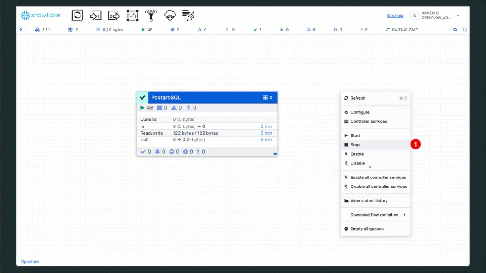

> **Keep the Runtime**: The shared runtime can be reused for future Openflow projects, including other CDC connectors, API integrations, or file ingestion pipelines. Stopping services preserves all configuration while eliminating compute costs.

### Step 3: Clean Up PostgreSQL

Remove the CDC configuration and test database from PostgreSQL.

#### Terminate Active Replication Slots

Connect to your PostgreSQL database and run these queries:

```sql
-- View replication slots
SELECT slot_name, slot_type, active, restart_lsn 
FROM pg_replication_slots 
WHERE database = 'postgres';
```

Since you stopped the connector in previous steps, the slot will show `active = false`. Drop the inactive slot:

```sql
-- Drop inactive replication slot(s)
SELECT pg_drop_replication_slot(slot_name) 
FROM pg_replication_slots 
WHERE database = 'postgres' 
  AND NOT active;
```

> **Replication Slot Naming**: The replication slot name is automatically generated by Openflow following the pattern `snowflake_connector_<unique_id>`. The query above will show you the exact name.
>
> **If Slot is Active**: If the slot still shows `active = true` (connector not fully stopped), first terminate the backend connection:
>
> ```sql
> -- Terminate the active backend connection
> SELECT pg_terminate_backend(active_pid)
> FROM pg_replication_slots
> WHERE slot_name = 'snowflake_connector_XXXXX' AND active = true;
> 
> -- Then drop the slot
> SELECT pg_drop_replication_slot('snowflake_connector_XXXXX');
> ```

#### Drop the Publication

Remove the CDC publication:

```sql
-- Drop the publication for healthcare tables
DROP PUBLICATION IF EXISTS healthcare_cdc_publication;
```

#### Drop the Healthcare Schema (Optional)

If you want to completely remove the test data:

```sql
-- Drop the healthcare schema and all its objects
DROP SCHEMA IF EXISTS healthcare CASCADE;

-- Verify cleanup
SELECT schema_name 
FROM information_schema.schemata 
WHERE schema_name = 'healthcare';
```

Expected output: Empty result set (0 rows), confirming the healthcare schema has been removed.

> **Keep PostgreSQL?** If you're using a shared PostgreSQL instance, you may want to keep the schema and just drop the publication. If this was a dedicated test instance, you can safely drop everything.

### Step 4: Drop Snowflake Intelligence Agent

Remove the AI agent and its associated database:

```sql
-- Use ACCOUNTADMIN role (required for agent operations)
USE ROLE ACCOUNTADMIN;

-- Drop the Snowflake Intelligence agent
DROP AGENT IF EXISTS snowflake_intelligence.agents.HEALTHCARE_DATA_INTELLIGENCE;
```

### Step 5: Drop Snowflake Objects

Remove all Snowflake resources created for this quickstart:

```sql
-- Use ACCOUNTADMIN role for cleanup
USE ROLE ACCOUNTADMIN;

-- Drop the main database (includes healthcare schema and all tables)
DROP DATABASE IF EXISTS QUICKSTART_PGCDC_DB CASCADE;

-- Drop the warehouse
DROP WAREHOUSE IF EXISTS QUICKSTART_PGCDC_WH;

-- Drop the external access integration
DROP INTEGRATION IF EXISTS quickstart_pgcdc_access;

-- Drop the role
DROP ROLE IF EXISTS QUICKSTART_ROLE;
```

#### Verify Cleanup

Confirm all objects are removed:

```sql
-- Check for remaining objects
SHOW DATABASES LIKE 'QUICKSTART_PGCDC_DB';
SHOW DATABASES LIKE 'snowflake_intelligence';
SHOW WAREHOUSES LIKE 'QUICKSTART_PGCDC_WH';
SHOW INTEGRATIONS LIKE 'quickstart_pgcdc_access';
SHOW ROLES LIKE 'QUICKSTART_ROLE';
```

Expected output: Empty result sets for all queries.

### Step 6: Remove Local Files (Optional)

If you cloned the quickstart repository locally and no longer need it:

```bash
# Navigate to parent directory
cd ..

# Remove the quickstart directory
rm -rf openflow-postgresql-cdc-demo

# Verify removal
ls -la | grep openflow-postgresql-cdc-demo
```

### Cleanup Complete

All resources have been removed. You can verify by:

- ✅ Checking Snowflake compute usage (warehouse should not be running)
- ✅ Confirming no active PostgreSQL replication slots
- ✅ Verifying no Openflow services consuming compute credits

> **Cost Savings**: By cleaning up unused resources, you avoid unnecessary compute costs. Warehouses, services, and replication slots all consume credits when active!

<!-- ------------------------ -->
## Conclusion And Resources

Congratulations! You've successfully built a real-time CDC pipeline from PostgreSQL to Snowflake using Openflow.

### What You Learned

- How to configure PostgreSQL logical replication for CDC
- How to set up Snowflake Intelligence with semantic models for natural language queries
- How to configure Openflow PostgreSQL connector for CDC
- How to capture both snapshot and incremental changes
- How to analyze real-time data and CDC metadata with AI-powered insights
- How to use natural language to explore CDC changes

### Related Resources

**Openflow Documentation**:

- [Openflow Overview](https://docs.snowflake.com/en/user-guide/data-integration/openflow/about)
- [PostgreSQL CDC Connector](https://docs.snowflake.com/en/user-guide/data-integration/openflow/connectors/postgres/about)
- [MySQL CDC Connector](https://docs.snowflake.com/en/user-guide/data-integration/openflow/connectors/mysql/about)
- [SQL Server CDC Connector](https://docs.snowflake.com/en/user-guide/data-integration/openflow/connectors/sql-server/about)
- [Manage Openflow](https://docs.snowflake.com/en/user-guide/data-integration/openflow/manage)
- [Monitor Openflow](https://docs.snowflake.com/en/user-guide/data-integration/openflow/monitor)

**Snowflake Intelligence**:

- [Snowflake Intelligence Overview](https://docs.snowflake.com/en/user-guide/snowflake-cortex/snowflake-intelligence)
- [Semantic Models](https://docs.snowflake.com/en/user-guide/snowflake-cortex/semantic-model-spec)
- [Agents](https://docs.snowflake.com/en/user-guide/snowflake-cortex/agents)

**PostgreSQL Resources**:

- [Snowflake Postgres](https://www.snowflake.com/en/product/features/postgres/)
- [Getting Started with Snowflake Postgres](https://www.snowflake.com/en/developers/guides/getting-started-with-snowflake-postgres/)
- [PostgreSQL Logical Replication](https://www.postgresql.org/docs/current/logical-replication.html)

**Snowflake Platform**:

- [Snowpark Container Services](https://docs.snowflake.com/en/developer-guide/snowpark-container-services/overview)
- [External Access Integration](https://docs.snowflake.com/en/sql-reference/sql/create-external-access-integration)

---

**Feedback**: Please provide feedback on this quickstart via [GitHub Issues](https://github.com/Snowflake-Labs/sfquickstarts/issues)
