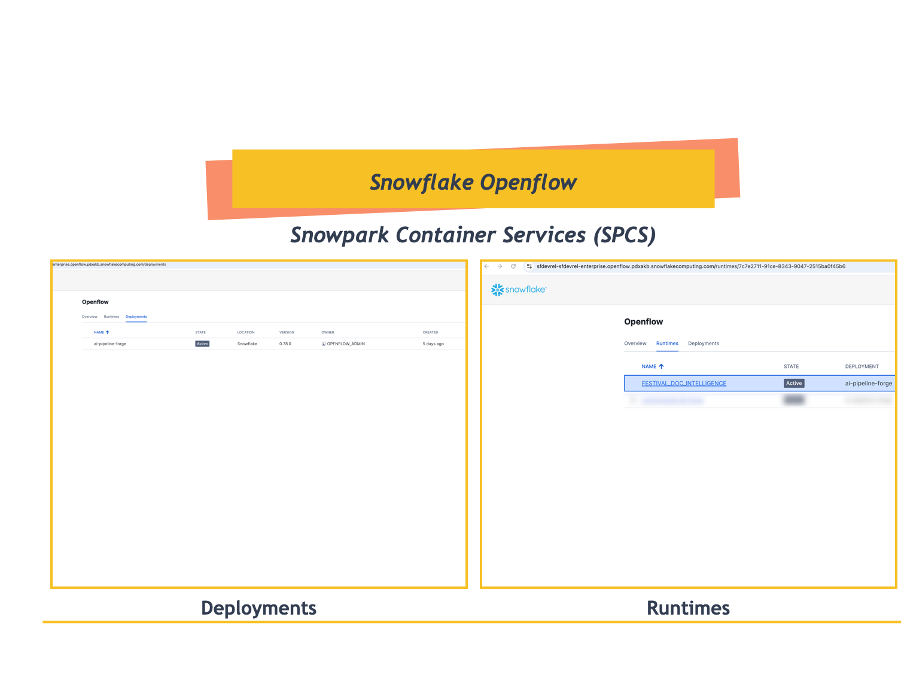
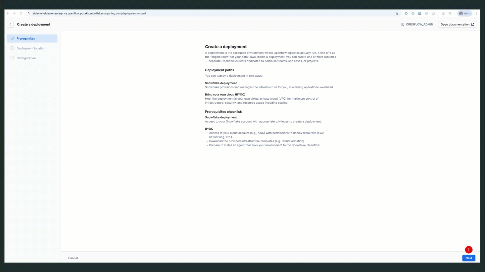
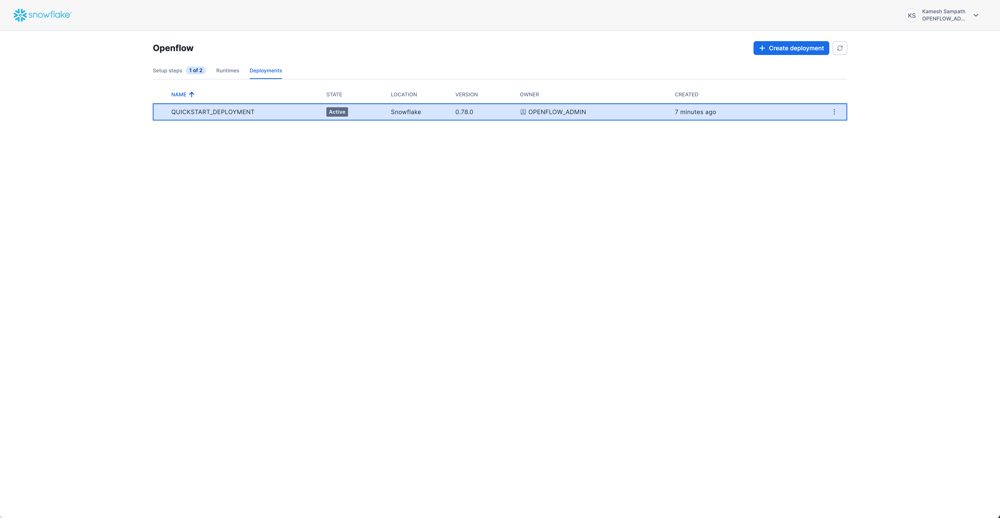
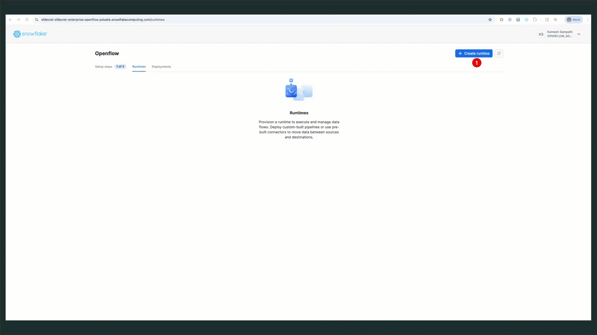
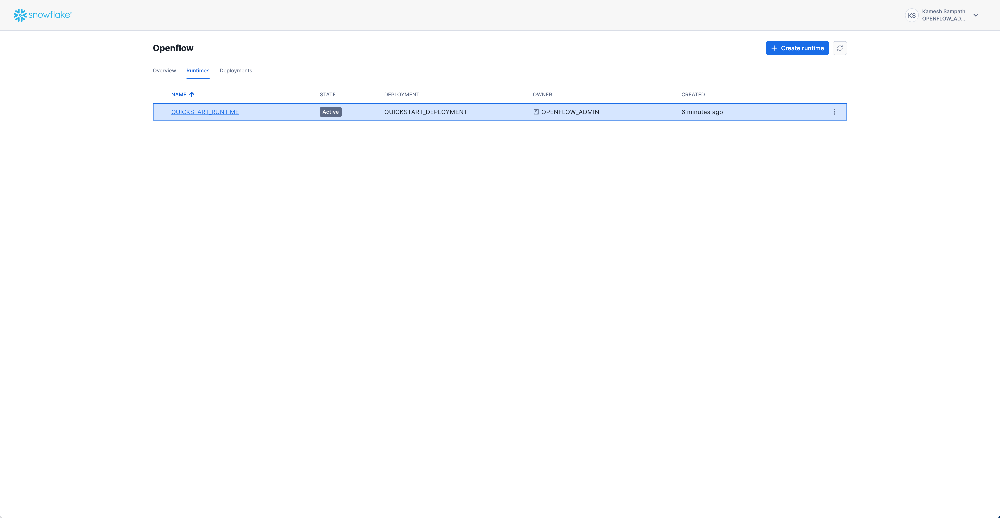

id: getting-started-with-openflow-spcs
categories: snowflake-site:taxonomy/solution-center/certification/quickstart, snowflake-site:taxonomy/product/platform, snowflake-site:taxonomy/snowflake-feature/ingestion, snowflake-site:taxonomy/snowflake-feature/transformation, snowflake-site:taxonomy/snowflake-feature/snowpark-container-services
language: en
summary: Getting Started with Snowflake Openflow using Snowpark Container Services (SPCS) 
environments: web
status: Published
feedback link: <https://github.com/Snowflake-Labs/sfguide-getting-started-with-openflow-spcs/issues>
author: Kamesh Sampath, Dan Chaffelson

# Getting Started with Openflow Snowflake Deployments
<!-- ------------------------ -->
## Overview

Learn how to set up Snowflake Openflow using Snowpark Container Services (SPCS) in about 25 minutes. You'll create the foundation needed to start ingesting data from external sources using pre-built connectors.

### What is Openflow

Openflow is Snowflake's managed service for building data pipelines in Snowpark Container Services (SPCS). It provides pre-built connectors that make it easy to ingest data from various sources into Snowflake.



**Key Benefits**:

- Fully managed - no infrastructure to maintain
- 19+ pre-built connectors for popular data sources
- Automatic scaling based on your data volume
- Built-in security and governance

### Available Connectors

Openflow supports 19+ connectors including:

- **Cloud Storage**: Google Drive, Box, SharePoint, Amazon S3, Azure Blob Storage
- **Databases**: MySQL, PostgreSQL, Oracle, SQL Server
- **Messaging**: Kafka, RabbitMQ
- **SaaS Applications**: Salesforce, ServiceNow, Workday

For a complete list with descriptions, see [Openflow connectors](https://docs.snowflake.com/en/user-guide/data-integration/openflow/connectors/about-openflow-connectors).

### What You Will Learn

- Set up the Openflow admin role and permissions
- Create an Openflow deployment
- Configure runtime roles and external access integrations
- Create an active runtime ready for connectors

### What You Will Build

- Openflow Snowflake Deployment
- Active runtime environment
- External access integrations for Google Drive and PostgreSQL

### Prerequisites

Before starting, ensure you have:

- **Snowflake Account**: Enterprise account in AWS or Azure Commercial Regions
- **Account Permissions**: ACCOUNTADMIN role or equivalent for initial setup
- **Region Availability**: Openflow Snowflake Deployments is available in AWS and Azure Commercial Regions
- **Compute Resources**: Ability to create compute pools and databases

> **IMPORTANT:** Openflow Snowflake Deployments are a Preview Feature gradually rolling out to all accounts in AWS and Azure Commercial Regions.

### Setup Overview

Setting up Openflow involves four main tasks:

| Step | Task | Persona | Duration |
|------|------|---------|----------|
| 1 | Setup Core Snowflake | Snowflake Administrator | 10 min |
| 2 | Create Deployment | Deployment Engineer / Administrator | 5 min |
| 3 | Create Runtime Role | Data Engineer | 5 min |
| 4 | Create Runtime | Data Engineer | 5 min |

> **NOTE:** This setup is typically a one-time configuration per Snowflake environment and must be completed **before** configuring any Openflow connectors.

### What Happens After This Setup

Once you complete this 25-minute setup, you'll have a production-ready Openflow environment. Here's what you can do immediately:

**✅ Start Ingesting Data**

- Connect to Google Drive and ingest documents for AI/ML processing
- Set up PostgreSQL CDC for real-time database replication
- Stream data from Kafka, RabbitMQ, or other message queues

**✅ No Code Required**

- Use the Openflow canvas (web UI) to visually configure connectors
- Or use the companion Jupyter notebooks for programmatic setup

**✅ Production-Ready Infrastructure**

- Your deployment automatically scales based on data volume
- Built-in security with network rules and access controls
- Optional event tables for monitoring and troubleshooting

> **QUICK WIN:** After completing this setup, you can have your first connector running and ingesting data in under 10 minutes using the companion notebooks!

<!-- ------------------------ -->
## Setup Core Snowflake

Before creating a deployment, you need to configure core Snowflake components including the Openflow admin role, required privileges, and network configuration.

### Companion Repository

This quickstart references the companion GitHub repository which includes Jupyter notebooks and SQL scripts for various Openflow connectors:

**Repository**: [https://github.com/Snowflake-Labs/sfguide-getting-started-with-openflow-spcs](https://github.com/Snowflake-Labs/sfguide-getting-started-with-openflow-spcs)

**SQL Scripts:**

All SQL commands in this quickstart are available as downloadable scripts:

- **[quickstart_setup_core.sql](https://github.com/Snowflake-Labs/sfguide-getting-started-with-openflow-spcs/blob/main/sql/quickstart_setup_core.sql)** - Core Snowflake setup (this section)
- **[quickstart_runtime_role.sql](https://github.com/Snowflake-Labs/sfguide-getting-started-with-openflow-spcs/blob/main/sql/quickstart_runtime_role.sql)** - Runtime role and external access integration
- **[quickstart_cleanup.sql](https://github.com/Snowflake-Labs/sfguide-getting-started-with-openflow-spcs/blob/main/sql/quickstart_cleanup.sql)** - Complete resource cleanup

**Key Notebooks:**

- **[EAI_GDRIVE.ipynb](https://github.com/Snowflake-Labs/sfguide-getting-started-with-openflow-spcs/blob/main/notebooks/EAI_GDRIVE.ipynb)** - External Access Integration setup for Google Drive connector
- **[EAI_POSTGRES.ipynb](https://github.com/Snowflake-Labs/sfguide-getting-started-with-openflow-spcs/blob/main/notebooks/EAI_POSTGRES.ipynb)** - External Access Integration setup for PostgreSQL connector

> **TIP:** Download the SQL scripts to run all commands at once, or use the notebooks for connector-specific setup after completing the basic infrastructure.

### How to Use SQL Scripts in Snowsight

If you downloaded the SQL scripts from the companion repository, here's how to import and execute them in Snowsight:

**Using Projects (Recommended):**

1. **Navigate to Projects**: In Snowsight, go to **Projects** → **Worksheets** (left sidebar)
2. **Create or Open Project**: Click **"+ Project"** to create a new project, or open an existing one
3. **Add SQL File**: Click **"..."** (more options) → **"Import SQL file"**
4. **Select Downloaded Script**: Choose the `.sql` file you downloaded (e.g., `quickstart_setup_core.sql`)
5. **Execute Commands**:
   - **Run All**: Click the **▶ Run All** button to execute the entire script
   - **Step-by-Step**: Select individual SQL statements and click **▶ Run** for granular control

> **NOTE:** The SQL scripts include detailed comments explaining each step. You can also copy-paste commands directly from this guide into a worksheet if you prefer.

### Create Openflow Admin Role

The `OPENFLOW_ADMIN` role is the primary administrative role for managing Openflow deployments.

Log into [Snowsight](https://docs.snowflake.com/en/user-guide/ui-snowsight.html#) and open a SQL worksheet.

> **IMPORTANT:**
>
> - If you use different names for objects created in this section, be sure to update scripts and configurations in the following sections accordingly.
>
> - For each SQL script block below, select all the statements in the block and execute them top to bottom.

Run the following SQL commands to create the Openflow admin role:

```sql
-- Create the Openflow admin role (requires ACCOUNTADMIN or equivalent privileges)
USE ROLE ACCOUNTADMIN;
CREATE ROLE IF NOT EXISTS OPENFLOW_ADMIN;

-- Grant necessary privileges
GRANT CREATE DATABASE ON ACCOUNT TO ROLE OPENFLOW_ADMIN;
GRANT CREATE COMPUTE POOL ON ACCOUNT TO ROLE OPENFLOW_ADMIN;
GRANT CREATE INTEGRATION ON ACCOUNT TO ROLE OPENFLOW_ADMIN;
GRANT BIND SERVICE ENDPOINT ON ACCOUNT TO ROLE OPENFLOW_ADMIN;

-- Grant role to current user and ACCOUNTADMIN
GRANT ROLE OPENFLOW_ADMIN TO ROLE ACCOUNTADMIN;
GRANT ROLE OPENFLOW_ADMIN TO USER IDENTIFIER(CURRENT_USER());
```

This creates the admin role and grants it the necessary permissions to create and manage Openflow deployments.

### Enable BCR Bundle 2025_06 for Integration-level Network Policy

> **CHECK FIRST:** This step is **only required** if you plan to use Database CDC, SaaS, Streaming, or Slack connectors. If you're unsure which connectors you'll use, check the bundle status first. You can always enable it later if needed.

**Step 1: Check if BCR Bundle 2025_06 is already enabled**

```sql
-- Check the bundle status
USE ROLE ACCOUNTADMIN;
CALL SYSTEM$BEHAVIOR_CHANGE_BUNDLE_STATUS('2025_06');
```

**Step 2: Enable the bundle if status shows `DISABLED`**

If the result shows `DISABLED`, enable the bundle:

```sql
-- Enable BCR Bundle 2025_06
CALL SYSTEM$ENABLE_BEHAVIOR_CHANGE_BUNDLE('2025_06');
```

> **WHY THIS IS NEEDED:**
>
> BCR Bundle 2025_06 enables integration-level network policies required for Database CDC, SaaS, Streaming, and Slack connectors to connect to Snowpipe Streaming. For more details, see [Enable BCR Bundle documentation](https://docs.snowflake.com/en/user-guide/data-integration/openflow/setup-openflow-spcs-sf#enable-bcr-bundle-2025-06-for-integration-level-network-policy).

### Verify Setup

Check that all core resources were created successfully:

```sql
-- Verify role exists
SHOW ROLES LIKE 'OPENFLOW_ADMIN';

-- Verify grants
SHOW GRANTS TO ROLE OPENFLOW_ADMIN;
```

> **REFERENCE DOCUMENTATION:**
>
> For detailed information, see [Setup core Snowflake](https://docs.snowflake.com/en/user-guide/data-integration/openflow/setup-openflow-spcs-sf) in the official documentation.

<!-- ------------------------ -->
## Create Deployment

After configuring core Snowflake, create an Openflow deployment. This is the container environment where Openflow will run.

### Access Openflow in Snowsight

> **IMPORTANT:** Before proceeding, ensure your user role in Snowsight is set to `OPENFLOW_ADMIN`. You can check and change your role in the top-right corner of Snowsight.

1. **Navigate to Openflow**: Go to **Work with data** → **Ingestion** → **Openflow**
2. **Openflow Interface**: You'll see three tabs:
   - **Overview** - List of available connectors and documentation
   - **Runtimes** - Manage your runtime environments
   - **Deployments** - Create and manage Openflow deployments

### Create Your First Deployment

1. **Navigate to Deployments Tab**: Click on the **Deployments** tab
2. **Create Deployment**: Click **Create Deployment** button
3. **Enter Deployment Name**: `QUICKSTART_DEPLOYMENT`
4. **Complete the wizard**: Follow the prompts shown in the GIF below



> **NOTE:** Deployment creation takes approximately **5-10 minutes**. The status will progress from `CREATING` → `ACTIVE`.

> **OPTIONAL - Event Table Configuration:** For advanced monitoring and troubleshooting, you can configure an Openflow-specific event table. See the [official documentation](https://docs.snowflake.com/en/user-guide/data-integration/openflow/setup-openflow-spcs-deployment#optional-configure-openflow-specific-event-table) for detailed instructions.

### Verify Deployment Status

Check that your deployment is running via the Snowsight UI:

1. **Navigate to Deployments Tab**: Go to **Work with data** → **Ingestion** → **Openflow** → **Deployments**
2. **Check Status**: Look for your deployment with status **ACTIVE**



Expected status: **ACTIVE**

> **REFERENCE DOCUMENTATION:**
>
> For detailed information, see [Create deployment](https://docs.snowflake.com/en/user-guide/data-integration/openflow/setup-openflow-spcs-deployment) in the official documentation.

<!-- ------------------------ -->
## Create Runtime Role

Create a runtime role that will be used by your Openflow runtime. This role needs access to databases, schemas, and warehouses for data ingestion.

> **SQL SCRIPT AVAILABLE:** All commands in this section are available in **[quickstart_runtime_role.sql](https://github.com/Snowflake-Labs/sfguide-getting-started-with-openflow-spcs/blob/main/sql/quickstart_runtime_role.sql)** from the companion repository.

### Step 1: Create the Runtime Role and Resources

```sql
-- Create runtime role
USE ROLE ACCOUNTADMIN;
CREATE ROLE IF NOT EXISTS QUICKSTART_ROLE;

-- Create database for Openflow resources
CREATE DATABASE IF NOT EXISTS QUICKSTART_DATABASE;

-- Create warehouse for data processing
CREATE WAREHOUSE IF NOT EXISTS QUICKSTART_WH
  WAREHOUSE_SIZE = MEDIUM
  AUTO_SUSPEND = 300
  AUTO_RESUME = TRUE;

-- Grant privileges to runtime role
GRANT USAGE ON DATABASE QUICKSTART_DATABASE TO ROLE QUICKSTART_ROLE;
GRANT USAGE ON WAREHOUSE QUICKSTART_WH TO ROLE QUICKSTART_ROLE;

-- Grant runtime role to Openflow admin
GRANT ROLE QUICKSTART_ROLE TO ROLE OPENFLOW_ADMIN;
```

### Step 2: Create External Access Integration

External Access Integrations allow your runtime to connect to external data sources. This quickstart creates one integration with network rules for both Google Drive and PostgreSQL connectors.

> **USE COMPANION NOTEBOOKS:**
>
> For detailed External Access Integration setup for specific connectors, use the notebooks from the [companion repository](https://github.com/Snowflake-Labs/sfguide-getting-started-with-openflow-spcs):
>
> - **`EAI_GDRIVE.ipynb`** - Complete setup for Google Drive connector
> - **`EAI_POSTGRES.ipynb`** - Complete setup for PostgreSQL connector

```sql
-- Create schema for network rules
USE ROLE ACCOUNTADMIN;
CREATE SCHEMA IF NOT EXISTS QUICKSTART_DATABASE.NETWORKS;

-- Create network rule for Google APIs
CREATE OR REPLACE NETWORK RULE google_api_network_rule
  MODE = EGRESS
  TYPE = HOST_PORT
  VALUE_LIST = (
    'admin.googleapis.com',
    'oauth2.googleapis.com',
    'www.googleapis.com',
    'google.com'
  );

-- Create network rule for your Google Workspace domain (optional)
-- Replace 'your-domain.com' with your actual domain
CREATE OR REPLACE NETWORK RULE workspace_domain_network_rule
  MODE = EGRESS
  TYPE = HOST_PORT
  VALUE_LIST = ('your-domain.com');

-- Create network rule for PostgreSQL endpoint
-- Replace 'your-postgres-host.com:5432' with your actual endpoint
CREATE OR REPLACE NETWORK RULE postgres_network_rule
  MODE = EGRESS
  TYPE = HOST_PORT
  VALUE_LIST = ('your-postgres-host.com:5432');

-- Create ONE external access integration with ALL network rules
CREATE OR REPLACE EXTERNAL ACCESS INTEGRATION quickstart_access
  ALLOWED_NETWORK_RULES = (
    QUICKSTART_DATABASE.NETWORKS.google_api_network_rule,
    QUICKSTART_DATABASE.NETWORKS.workspace_domain_network_rule,
    QUICKSTART_DATABASE.NETWORKS.postgres_network_rule
  )
  ENABLED = TRUE
  COMMENT = 'Openflow Snowflake Deployments runtime access for Google Drive and PostgreSQL connectors';

-- Grant usage to runtime role
GRANT USAGE ON INTEGRATION quickstart_access TO ROLE QUICKSTART_ROLE;
```

> **NOTE:** This creates one external access integration with multiple network rules for different connector types. You can add or remove network rules based on which connectors you plan to use.

### Verify Setup

```sql
-- Verify role and grants
SHOW ROLES LIKE 'QUICKSTART_ROLE';
SHOW GRANTS TO ROLE QUICKSTART_ROLE;

-- Verify integration
SHOW INTEGRATIONS LIKE 'quickstart_access';
DESC INTEGRATION quickstart_access;
```

> **REFERENCE DOCUMENTATION:**
>
> For detailed information, see [Create runtime role](https://docs.snowflake.com/en/user-guide/data-integration/openflow/setup-openflow-spcs-create-rr) in the official documentation.

<!-- ------------------------ -->
## Create Runtime

Create a runtime associated with the previously created runtime role. A runtime is the execution environment for your Openflow connectors.

### Create Runtime via Snowsight

Follow these steps to create your runtime:

1. **Navigate to Runtimes**: Go to **Work with data** → **Ingestion** → **Openflow** → **Runtimes** tab
2. **Click Create Runtime**: Click the **Create Runtime** button in the top right
3. **Enter Runtime Name**: `QUICKSTART_RUNTIME`
4. **Select Runtime Role**: Choose `QUICKSTART_ROLE` from the dropdown
5. **Select External Access Integration**: Choose `quickstart_access` from the dropdown
6. **Select Compute Pool**: Choose an existing compute pool from the list
7. **Click Create**: Complete the runtime creation



> **NOTE:** Runtime creation typically takes 3-5 minutes. The status will progress from `CREATING` → `ACTIVE`.

### Verify Runtime Status

Check that your runtime is active:

1. **Navigate to Runtimes Tab**: Go to **Work with data** → **Ingestion** → **Openflow** → **Runtimes**
2. **Check Status**: Look for `QUICKSTART_RUNTIME` with status **ACTIVE**



Expected status: **ACTIVE**

### Access the Runtime Canvas

Once your runtime is active, you can access the Openflow canvas to add and configure connectors:

**Click on the runtime name** (`QUICKSTART_RUNTIME`) to open the canvas where you can add connectors and build data pipelines.


> **TIP:** The canvas is where you'll add and configure connectors, manage data flows, and monitor pipeline execution. You're now ready to add your first connector!

> **REFERENCE DOCUMENTATION:**
>
> For detailed information, see [Create runtime](https://docs.snowflake.com/en/user-guide/data-integration/openflow/setup-openflow-spcs-create-runtime) in the official documentation.

<!-- ------------------------ -->
## Next Steps

With your Openflow Snowflake Deployments set up, you're ready to configure connectors to ingest data from external sources.

### Summary of What You Built

After completing this guide, you have:

- ✅ **`OPENFLOW_ADMIN` role** - Administrative role with deployment and integration privileges
- ✅ **Openflow Deployment (`QUICKSTART_DEPLOYMENT`)** - Container environment running in SPCS
- ✅ **Runtime Role (`QUICKSTART_ROLE`)** - With database, schema, and warehouse access
- ✅ **External Access Integration (`quickstart_access`)** - Network rules for Google Drive and PostgreSQL connectors
- ✅ **Active Runtime (`QUICKSTART_RUNTIME`)** - Ready to host connectors

**You're now ready to configure connectors and build data pipelines!**

### Choose Your Next Path

Now that your infrastructure is ready, here are your next options:

### Configure Connectors

Add and configure connectors for your data sources:

- Google Drive Connector - Ingest unstructured documents
- PostgreSQL Connector - Real-time database CDC
- Kafka Connector - Stream real-time events
- [View All 19+ Connectors](https://docs.snowflake.com/en/user-guide/data-integration/openflow/connectors/about-openflow-connectors)

### Explore Companion Notebooks

Use the notebooks from the [companion repository](https://github.com/Snowflake-Labs/sfguide-getting-started-with-openflow-spcs) for detailed connector setup:

- [EAI_GDRIVE.ipynb](https://github.com/Snowflake-Labs/sfguide-getting-started-with-openflow-spcs/blob/main/notebooks/EAI_GDRIVE.ipynb) - Google Drive External Access Integration
- [EAI_POSTGRES.ipynb](https://github.com/Snowflake-Labs/sfguide-getting-started-with-openflow-spcs/blob/main/notebooks/EAI_POSTGRES.ipynb) - PostgreSQL External Access Integration

### Build Data Pipelines

Try these common use cases:

- **Document Intelligence** - Ingest and analyze documents from Google Drive
- **Database Replication** - Real-time CDC from PostgreSQL to Snowflake
- **Real-time Streaming** - Process Kafka event streams
- **Multi-source Integration** - Combine data from multiple connectors

> **RECOMMENDED:** Start with the [Openflow Unstructured Data Pipeline quickstart](/en/developers/guides/getting-started-with-openflow-unstructured-data-pipeline/) for a complete end-to-end example using Openflow Snowflake Deployments.

<!-- ------------------------ -->
## Troubleshooting

### Deployment Not Starting

**Issue**: Deployment status stuck in `CREATING` or shows `ERROR`

**Solutions**:

1. **Verify Role Privileges**:

   ```sql
   -- Check OPENFLOW_ADMIN has required privileges
   SHOW GRANTS TO ROLE OPENFLOW_ADMIN;
   ```

2. **Review Event Table Logs** (if enabled):

   ```sql
   -- Query event table for errors
   SELECT * FROM OPENFLOW_CONFIG.EVENTS.openflow_events
   WHERE RECORD:severity = 'ERROR'
   ORDER BY TIMESTAMP DESC
   LIMIT 100;
   ```

### Runtime Cannot Access External Services

**Issue**: Connector fails to connect to external services (e.g., Google Drive, databases)

**Solutions**:

1. **Verify External Access Integration**:

   ```sql
   -- Check integration exists and is enabled
   SHOW INTEGRATIONS LIKE 'openflow_%';
   DESC INTEGRATION your_integration_name;
   ```

2. **Check Network Rules**:

   ```sql
   -- Verify all required hostnames are in network rules
   DESC NETWORK RULE your_network_rule;
   ```

3. **Test Network Connectivity**:
   - Ensure the external service endpoint is correct
   - Verify firewall rules allow traffic from Snowflake IP ranges
   - Check service credentials are valid

4. **Review Integration Grants**:

   ```sql
   -- Verify runtime role has access
   SHOW GRANTS ON INTEGRATION your_integration_name;
   ```

### Permission Errors

**Issue**: "Insufficient privileges" errors when creating resources

**Solutions**:

1. **Verify Current Role**:

   ```sql
   -- Check which role you're using
   SELECT CURRENT_ROLE();
   
   -- Switch to appropriate role
   USE ROLE OPENFLOW_ADMIN;
   -- or
   USE ROLE ACCOUNTADMIN;
   ```

2. **Check Role Hierarchy**:

   ```sql
   -- Verify role grants
   SHOW GRANTS TO ROLE OPENFLOW_ADMIN;
   SHOW GRANTS TO USER your_username;
   ```

2. **Grant Missing Privileges**:

   ```sql
   -- Example: Grant database creation if missing
   USE ROLE ACCOUNTADMIN;
   GRANT CREATE DATABASE ON ACCOUNT TO ROLE OPENFLOW_ADMIN;
   ```

### Getting Help

If you continue experiencing issues:

1. **Check Documentation**: [Openflow Documentation](https://docs.snowflake.com/en/user-guide/data-integration/openflow/about)
2. **Community Support**: [Snowflake Community](https://community.snowflake.com/)
3. **GitHub Issues**: [Companion Repository Issues](https://github.com/Snowflake-Labs/sfguide-getting-started-with-openflow-spcs/issues)

<!-- ------------------------ -->
## Cleanup

When you're finished with the quickstart or want to remove resources, use Snowsight UI to clean up.

> **SQL SCRIPT AVAILABLE:** For convenience, all cleanup commands are available in **[quickstart_cleanup.sql](https://github.com/Snowflake-Labs/sfguide-getting-started-with-openflow-spcs/blob/main/sql/quickstart_cleanup.sql)** from the companion repository.

### Remove Deployments and Runtimes

**Via Snowsight:**

1. **Navigate to Openflow**: Go to **Work with data** → **Ingestion** → **Openflow**
2. **Remove Runtime**:
   - Go to **Runtimes** tab
   - Find `QUICKSTART_RUNTIME`
   - Click on the runtime and select **Delete**
3. **Remove Deployment**:
   - Go to **Deployments** tab
   - Find `QUICKSTART_DEPLOYMENT`
   - Click on the deployment and select **Delete**

> **NOTE:** Deleting deployments and runtimes via Snowsight ensures proper cleanup of all associated resources.

### Remove Supporting Resources

After removing deployments and runtimes, clean up the supporting resources:

```sql
-- Switch to ACCOUNTADMIN
USE ROLE ACCOUNTADMIN;

-- Drop external access integration
DROP INTEGRATION IF EXISTS quickstart_access;

-- Drop network rules
DROP NETWORK RULE IF EXISTS google_api_network_rule;
DROP NETWORK RULE IF EXISTS workspace_domain_network_rule;
DROP NETWORK RULE IF EXISTS postgres_network_rule;

-- Drop warehouse
DROP WAREHOUSE IF EXISTS QUICKSTART_WH;

-- Drop database
DROP DATABASE IF EXISTS QUICKSTART_DATABASE;

-- Drop role
DROP ROLE IF EXISTS QUICKSTART_ROLE;
```

> **WARNING:** Dropping the database will delete all ingested data. Ensure you have backups of important data before proceeding.

<!-- ------------------------ -->
## Conclusion And Resources

Congratulations! You've successfully set up Snowflake Openflow using Snowpark Container Services (SPCS). You now have a fully functional data integration platform ready to connect to external data sources.

### What You Accomplished

- **Infrastructure Setup**: Created core Snowflake resources including admin role and network rules
- **Deployment Creation**: Launched an Openflow Snowflake Deployment with optional event logging
- **Runtime Configuration**: Created runtime role with external access integrations
- **Active Runtime**: Deployed a runtime environment ready to host connectors
- **Best Practices**: Learned monitoring, troubleshooting, and resource management

### Key Capabilities Enabled

- **Pre-built Connectors**: Access to 19+ connectors for popular data sources
- **Managed Infrastructure**: No server management, automatic scaling
- **Secure Communication**: Network rules and external access integrations
- **Monitoring**: Optional event tables for observability
- **Flexibility**: Support for diverse data sources and formats

### Next Steps

1. **Configure Your First Connector**: Use the companion notebooks (`EAI_GDRIVE.ipynb` or `EAI_POSTGRES.ipynb`) to set up Google Drive or PostgreSQL
2. **Build Data Pipelines**: Set up automated data ingestion from your chosen source
3. **Add More Connectors**: Explore the 19+ available connectors for different data sources
4. **Learn Best Practices**: Review the official Openflow documentation for tips and patterns

### Related Resources

**Official Documentation:**

- [Openflow Documentation](https://docs.snowflake.com/en/user-guide/data-integration/openflow/about)
- [Openflow Snowflake Deployments Setup Guide](https://docs.snowflake.com/en/user-guide/data-integration/openflow/setup-openflow-spcs)
- [Openflow Connectors](https://docs.snowflake.com/en/user-guide/data-integration/openflow/connectors/about-openflow-connectors)
- [Snowpark Container Services](https://docs.snowflake.com/en/developer-guide/snowpark-container-services/overview)
- [External Access Integration](https://docs.snowflake.com/en/developer-guide/external-network-access/creating-using-external-network-access)

**Code and Notebooks:**

- [Companion GitHub Repository](https://github.com/Snowflake-Labs/sfguide-getting-started-with-openflow-spcs)
- [Example Pipelines and Notebooks](https://github.com/Snowflake-Labs/sfguide-getting-started-with-openflow-spcs/tree/main/notebooks)

**Management and Operations:**

- [Manage Openflow](https://docs.snowflake.com/en/user-guide/data-integration/openflow/about)

### Community and Support

- [Snowflake Community](https://community.snowflake.com/)
- [GitHub Issues](https://github.com/Snowflake-Labs/sfguide-getting-started-with-openflow-spcs/issues)

We would love your feedback on this QuickStart Guide! Please submit your feedback using the [GitHub issues link](https://github.com/Snowflake-Labs/sfguide-getting-started-with-openflow-spcs/issues).
