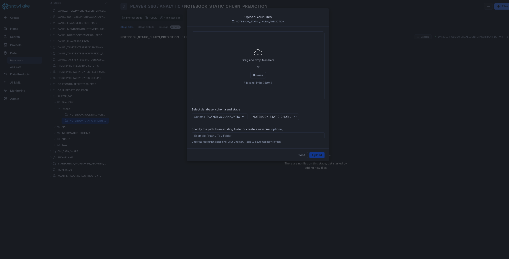
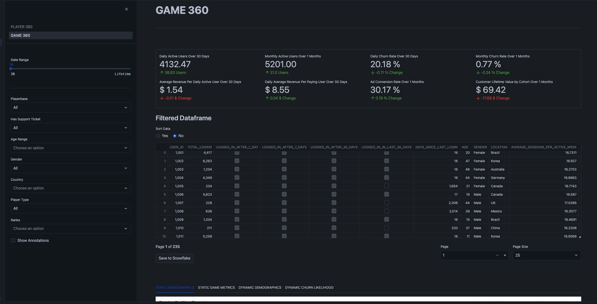

author: Daniel_Yu
id: getting-started-with-player-360-unlocking-churn-prediction-and-game-optimization
categories: snowflake-site:taxonomy/solution-center/certification/quickstart, snowflake-site:taxonomy/solution-center/certification/certified-solution, snowflake-site:taxonomy/solution-center/includes/architecture, snowflake-site:taxonomy/industry/gaming, snowflake-site:taxonomy/product/applications-and-collaboration, snowflake-site:taxonomy/snowflake-feature/build
language: en
summary: The Player 360 solution showcases how gaming companies can create a comprehensive unified data intelligence platform, tailored for game developers, analysts and data scientists aiming to build exceptional gaming experiences. 
environments: web
status: Published
feedback link: https://github.com/Snowflake-Labs/sfguides/issues 
fork repo link: https://github.com/Snowflake-Labs/sfguide-getting-started-with-player-360-unlocking-churn-prediction-and-game-optimization


# Getting Started with Player 360: Unlocking Churn Prediction and Game Optimization
<!-- ------------------------ -->
## Overview


In the gaming industry, Player data is often fragmented across multiple sources, including event streams, purchase histories, and platform-specific behaviors. This disjointed data makes it challenging for gaming companies and key personas such as marketing and product to gain a holistic understanding of individual players and overall game performance. In this demo we will create a "Player 360" dashboard, which integrates and visualizes diverse player data sources into a single, dynamic "Player Card." This card will offer insights into player activity & interactions (behavior, buying habits, etc), and this preliminary use case will potentially show the highest risk for churn players. Similarly, we will create a “Game 360” dashboard which integrates games-level insights across the playerbase, focusing on key KPIs, metrics, and overall user behavior.


By aggregating these data streams in a unified system and leveraging Snowflake features such as Snowpark ML, Snowflake Notebooks, and Streamlit in Snowflake, companies can more effectively understand player/customer journeys, tailor in-game experiences, and optimize monetization strategies.


### What You’ll Learn
- How to work with Snowflake features such as [Dynamic Tables](https://docs.snowflake.com/en/user-guide/dynamic-tables-intro)  that integrate well with streaming data
- How to use [Snowflake Notebooks](https://docs.snowflake.com/en/user-guide/ui-snowsight/notebooks) and [Snowpark Python](https://docs.snowflake.com/en/developer-guide/snowpark/python/index) for data engineering and ML
- How to train a model using [Snowpark ML Modeling](https://docs.snowflake.com/en/developer-guide/snowpark-ml/modeling)
- How to further enhance ML capabilities with Snowflake Notebooks using [Container Runtime](https://docs.snowflake.com/en/user-guide/ui-snowsight/notebooks-on-spcs) (public preview).
- How to log and reference models using [Snowflake Model Registry](https://docs.snowflake.com/en/developer-guide/snowpark-ml/model-registry/overview)
- How to use [Streamlit](https://docs.streamlit.io/) in Snowflake (SiS) to build a frontend client-facing application


### Prerequisites
- A non-trial Snowflake [Snowflake](https://signup.snowflake.com/?utm_source=snowflake-devrel&utm_medium=developer-guides&utm_cta=developer-guides)  account in a supported AWS commercial region.
- A Snowflake account login with a role that has the ACCOUNTADMIN role. If not, you will need to work with your ACCOUNTADMIN to perform the initial account setup (e.g. creating the EXTERNAL ACCESS INTEGRATION).
- Git installed.


### What You’ll Build
- A fullstack data analytics platform for a fictional gaming company **Snowforge Interactive** and their flagship game **Frosthammer**
- End-to-End ML Pipeline that incorporates the latest ML features such as Snowflake Model Registry and Snowflake Containerized Notebooks

**Architecture Diagram:**


<!-- ------------------------ -->
## Setup
**Step 1**. - Copy the the setup script and run it in Snowsight SQL Worksheet. This is the [setup script](https://github.com/Snowflake-Labs/sfguide-getting-started-with-player-360-unlocking-churn-prediction-and-game-optimization/blob/main/scripts/setup.sql).

**Step 2**. - Copy the the code below and run it in Snowsight SQL Worksheet. This is the [build script](https://github.com/Snowflake-Labs/sfguide-getting-started-with-player-360-unlocking-churn-prediction-and-game-optimization/blob/main/scripts/raw_build.sql) that populates the database with the RAW data.


**Step 3**. - Copy the the code in the build script and run it in Snowsight SQL Worksheet. This is the [build script](https://github.com/Snowflake-Labs/sfguide-getting-started-with-player-360-unlocking-churn-prediction-and-game-optimization/blob/main/scripts/analytic_build.sql) that populates the analytics schema.


**Step 4** - Upload Notebook and Streamlit files
- **Upload required [notebook](https://github.com/Snowflake-Labs/sfguide-getting-started-with-player-360-unlocking-churn-prediction-and-game-optimization/tree/main/notebooks) files** to the correct stages within the `PLAYER_360.ANALYTIC` schema
Click '+ Files' in the top right of the stage. Upload all files that you downloaded from GitHub into the stage. **Make sure your the files match the following**:

  - *Notebook 1:* Upload `0_start_here.ipynb` notebook file and `environment.yml` file  to the `@PLAYER_360.ANALYTIC.notebook_static_churn_prediction` stage 


  - *Notebook 2:* Upload only the `1_Rolling_Churn_Prediction_Model.ipynb` notebook file (excluding environment.yml) to `@PLAYER_360.ANALYTIC.notebook_rolling_churn_prediction` stage

<br><br>

- **Upload required  [streamlit](https://github.com/Snowflake-Labs/sfguide-getting-started-with-player-360-unlocking-churn-prediction-and-game-optimization/tree/main/streamlit) files** to the correct stages within the `PLAYER_360.APP` schema
Click '+ Files' in the top right of the stage. Upload all files that you downloaded from GitHub into the stage. **Make sure your the files match the following**:

  - *Streamlit Files:* Upload the following files (`PLAYER_360.py, GAME_360.py, environment.yml`) in streamlit folder to the `@PLAYER_360.APP.streamlit_player36` stage. Note that the images subfolder does not need to be uploaded

<br></br>


<!-- ------------------------ -->
## Static Churn Prediction Notebook 
**Step 1:** Run following [0_notebook_setup.sql](https://github.com/Snowflake-Labs/sfguide-getting-started-with-player-360-unlocking-churn-prediction-and-game-optimization/blob/main/scripts/0_notebook_setup.sql) script as a sql worksheet in snowsight
```sql
use role SYSADMIN;
CREATE OR REPLACE NOTEBOOK PLAYER_360.ANALYTIC.PLAYER_360_static_churn_prediction
FROM '@PLAYER_360.ANALYTIC.notebook_static_churn_prediction'
MAIN_FILE = '0_start_here.ipynb'
QUERY_WAREHOUSE = 'PLAYER_360_DATA_APP_WH';
```

**Step 2:** The notebook has now been created in your Snowflake account! All packages and Python setup has already been completed.

To access it, navigate to Snowsight, select the `SYSADMIN` role, and click the Project, click the Notebooks tab. Open **PLAYER_360_static_churn_prediction** notebook and run each of the cells.


Within this notebook, you'll visualize player segments and analyze key churn features, perform feature engineering using the Snowflake Preprocessing Pipelines, and using the model registry to manage and log your ML Model. 


<!-- ------------------------ -->
## Rolling Churn Prediction Notebook 
**Step 1:** Run the [1_notebook_setup.sql](https://github.com/Snowflake-Labs/sfguide-getting-started-with-player-360-unlocking-churn-prediction-and-game-optimization/blob/main/scripts/1_notebook_setup.sql) script as a sql worksheet in snowsight. This sets up compute pools and external access integration and programmatically creates Snowflake Container Notebook for notebook 2.

```sql
ALTER SESSION SET query_tag = '{"origin":"sf_sit-is", "name":"Player_360", "version":{"major":1, "minor":0}, "attributes":{"is_quickstart":1, "source":"sql"}}';
USE ROLE accountadmin;
USE DATABASE PLAYER_360;
USE SCHEMA ANALYTIC;

-- Create and grant access to compute pools
CREATE COMPUTE POOL IF NOT EXISTS PLAYER_360_cpu_xs_5_nodes
  MIN_NODES = 1
  MAX_NODES = 5
  INSTANCE_FAMILY = CPU_X64_XS;

CREATE COMPUTE POOL IF NOT EXISTS PLAYER_360_gpu_s_5_nodes
  MIN_NODES = 1
  MAX_NODES = 5
  INSTANCE_FAMILY = GPU_NV_S;

GRANT USAGE ON COMPUTE POOL PLAYER_360_cpu_xs_5_nodes TO ROLE SYSADMIN;
GRANT USAGE ON COMPUTE POOL PLAYER_360_gpu_s_5_nodes TO ROLE SYSADMIN;

-- Create and grant access to EAIs
-- Substep #1: create network rules (these are schema-level objects; end users do not need direct access to the network rules)

create or replace network rule PLAYER_360_allow_all_rule
  TYPE = 'HOST_PORT'
  MODE= 'EGRESS'
  VALUE_LIST = ('0.0.0.0:443','0.0.0.0:80');

-- Substep #2: create external access integration (these are account-level objects; end users need access to this to access the public internet with endpoints defined in network rules)

CREATE OR REPLACE EXTERNAL ACCESS INTEGRATION PLAYER_360_allow_all_integration
  ALLOWED_NETWORK_RULES = (PLAYER_360_allow_all_rule)
  ENABLED = true;

CREATE OR REPLACE NETWORK RULE PLAYER_360_pypi_network_rule
  MODE = EGRESS
  TYPE = HOST_PORT
  VALUE_LIST = ('pypi.org', 'pypi.python.org', 'pythonhosted.org',  'files.pythonhosted.org');

CREATE OR REPLACE EXTERNAL ACCESS INTEGRATION PLAYER_360_pypi_access_integration
  ALLOWED_NETWORK_RULES = (PLAYER_360_pypi_network_rule)
  ENABLED = true;

GRANT ALL PRIVILEGES ON INTEGRATION PLAYER_360_allow_all_integration TO ROLE SYSADMIN;
GRANT ALL PRIVILEGES ON INTEGRATION PLAYER_360_pypi_access_integration TO ROLE SYSADMIN;


USE ROLE SYSADMIN;
USE WAREHOUSE PLAYER_360_DATA_APP_WH;
USE DATABASE PLAYER_360;
USE SCHEMA ANALYTIC;

CREATE OR REPLACE NOTEBOOK PLAYER_360.ANALYTIC.PLAYER_360_rolling_churn_prediction
FROM '@PLAYER_360.ANALYTIC.notebook_rolling_churn_prediction'
MAIN_FILE = '1_Rolling_Churn_Prediction_Model.ipynb'
QUERY_WAREHOUSE = 'PLAYER_360_DATA_APP_WH'
COMPUTE_POOL='PLAYER_360_gpu_s_5_nodes'
RUNTIME_NAME='SYSTEM$GPU_RUNTIME';
ALTER NOTEBOOK PLAYER_360_rolling_churn_prediction ADD LIVE VERSION FROM LAST;
ALTER NOTEBOOK PLAYER_360_rolling_churn_prediction set external_access_integrations = ("PLAYER_360_pypi_access_integration", 
                                                                                                            "PLAYER_360_allow_all_integration");
```

**Step 2:** The notebook has now been created in your Snowflake account! All the setup has been completed including for the compute pools, External Acces Integration, and container runtimes!

To access it, navigate to Snowsight, select the `SYSADMIN` role, and click the Project, click the Notebooks tab. Open **PLAYER_360_rolling_churn_prediction** notebook and run each of the cells.


This notebook creates a ML Model that can handle inference on incoming near-real time streaming data, representing the use case of predicting churn based off a customer's recent behavior as opposed to overall behavior. Within this notebook, you'll explore how to use Snowflake Notebooks using Container Runtime, perform even more data and feature engineering, and utilize the Model Registry.


<!-- ------------------------ -->
## Streamlit
**Step 1:** Run following streamlit_setup.sql script
```sql
use role SYSADMIN;
CREATE OR REPLACE STREAMLIT PLAYER_360.APP.PLAYER_360_streamlit
ROOT_LOCATION = '@PLAYER_360.APP.streamlit_player360'
MAIN_FILE = 'PLAYER_360.py'
QUERY_WAREHOUSE = 'PLAYER_360_DATA_APP_WH'
COMMENT = '{"origin":"sf_sit-is","name":"player_360","version":{"major":1, "minor":0},"attributes":{"is_quickstart":1, "source":"streamlit"}}';
```

**Step 2:** The notebook has now been created in your Snowflake account! All the setup has been completed for the package imports and the streamlit is ready to go!
To access it, navigate to Snowsight, select the `SYSADMIN` role, and click the Project, click the Streamlit tab. Open **PLAYER_360_streamlit** app and explore the different features!

**2a)** Explore Player 360 page


*Recommended Actions:*
- Navigate to Player Card for Player 1001 to analyze user behavior.
- Explore sections: `Points, Sessions, Purchases`
- Filter by Date Range to assess behavior over time for Player 1001.
- Go to Churn likelihood to explore the SHAP model for predicted Churn within the next 7 days based on recent behavior for Player 1001.
- Compare Player 11672 against Player 1005 in terms of:
  - User behavior before churn.
  - Predicted likelihood of churn.
  - Model explanations for churn prediction.

<br>

**2b)** Explore Game 360 page


*Recommended Actions:*
- Review KPIs for the overall game performance dataset.
- In `Static Demographics` section, perform Exploratory Data Analysis (EDA) for key demographics (Location, Gender, Age, Rank) and display population segment breakdown.
    - Analyze churn rates across different demographic segments.   
    - Assess correlations between different variables using the Correlation Matrix.
    - Investigate the distribution of churned vs non-churned users based on average metrics, noting that churned users are more centralized.
    - Identify that churned users tend to spend a significant amount (make many purchases) before churning.
- In `Static Game Metrics`, zoom into specific time periods for deeper analysis of key KPIs. 
    - Filter by time period (e.g., January 1, 2023) to investigate dips in all metrics and recognize this as an inflection point for cohort LTV (Lifetime Value).
- In the sidebar, apply filters to isolate player segment behavior:
  - Poland
  - Casual Player Type
- Filter by time range to analyze the metrics of this player segment at various intervals before they churned.
- Transition to `Dynamic Demographics` and compare the correlation matrix, noting significant differences (e.g., red flags in correlations).
- In `Dynamic Churnlikelihood` Extract the demographic features most relevant for predicting churn.

- In the `Filtered Dataframe` Sort the data and export the filtered dataset.


<!-- ------------------------ -->
## Conclusion And Resources

This demo has showcased how Snowflake enables the creation of unified "Player 360" and "Game 360" dashboards by aggregating diverse player and game data streams into a single, actionable view. Through the use of Snowpark ML, Snowflake Notebooks, and Streamlit, we've demonstrated how companies can leverage these integrated tools to gain deeper insights into player behavior, churn risk, and overall game performance. By consolidating data sources and applying advanced analytics, gaming companies can optimize player engagement and refine monetization strategies, all within a governed and scalable environment.


### What You Learned
- How to create a fullstack data analytics platform for a fictional gaming company **Snowforge Interactive** and their flagship game **Frosthammer**
- How to build a End-to-End ML Pipeline that incorporates the latest ML features such as Snowflake Model Registry and Snowflake Containerized Notebooks
- How to use Streamlit in Snowflake to construct a front-facing client application

### Related Resources
- [Snowflake ML Webpage](/en/data-cloud/snowflake-ml/)
- [Snowpark ML Modeling](https://docs.snowflake.com/en/developer-guide/snowpark-ml/modeling)
- [Container Runtime](https://docs.snowflake.com/en/user-guide/ui-snowsight/notebooks-on-spcs)
- [Streamlit](https://docs.streamlit.io/)
- [Snowflake Model Registry](https://docs.snowflake.com/en/developer-guide/snowpark-ml/model-registry/overview)
- [Dynamic Tables](https://docs.snowflake.com/en/user-guide/dynamic-tables-intro)
- [Fork Notebook on GitHub](https://github.com/Snowflake-Labs/sfguide-getting-started-with-player-360-unlocking-churn-prediction-and-game-optimization)
- [Download Reference Architecture](/content/dam/snowflake-site/developers/2024/12/player-360-reference-architecture.pdf)
- [Read Medium Blog](https://medium.com/snowflake/getting-started-with-player-360-unlocking-churn-prediction-and-game-optimization-cff23c188fd3)
- [Watch the Demo](https://youtu.be/Ws7O8iSPoUM?list=TLGGpCvoAtbDc_QyNDA5MjAyNQ)
