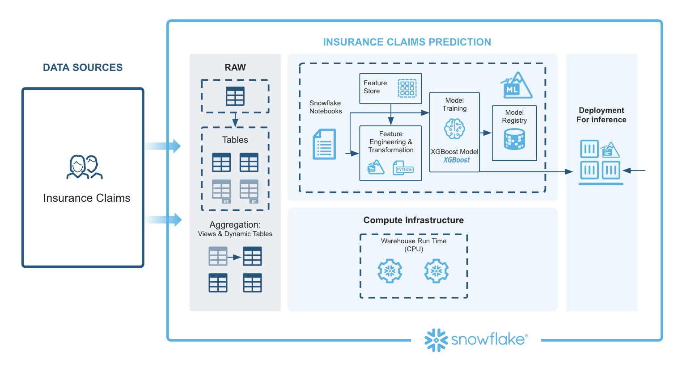
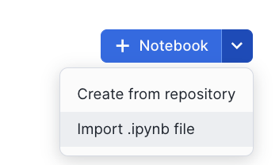
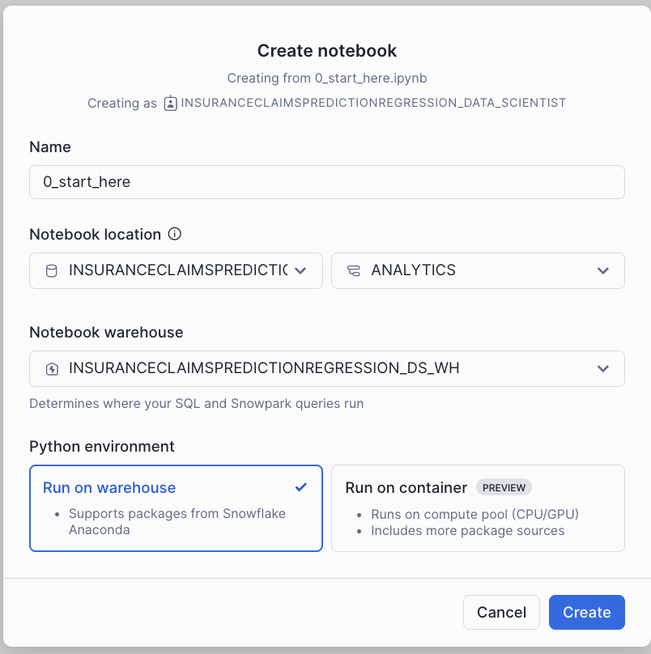
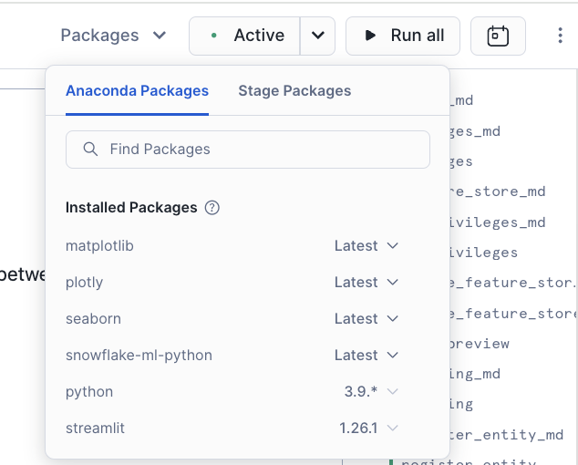
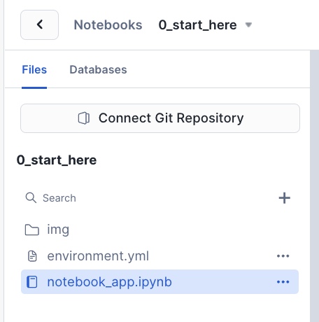
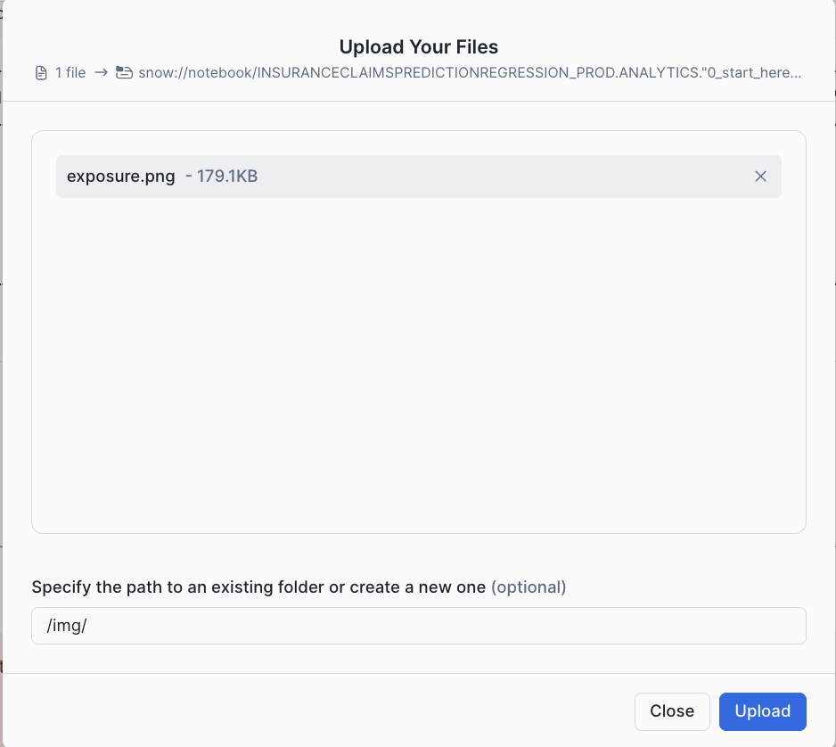

author: Swathi Jasti
id: getting-started-with-predicting-insurance-claims-regression-model
categories: snowflake-site:taxonomy/solution-center/certification/quickstart, snowflake-site:taxonomy/product/ai, snowflake-site:taxonomy/snowflake-feature/model-development, snowflake-site:taxonomy/snowflake-feature/ml-functions
language: en
summary: This quickstart provides an end-to-end workflow for predicting insurance claim outcomes using machine learning, focusing on feature engineering, model training, and deployment. 
environments: web
status: Published
feedback link: https://github.com/Snowflake-Labs/sfguides/issues

# Getting Started with Predicting Insurance Claims using XGBoost Regression Model

## Overview

This solution provides an end-to-end workflow for predicting insurance claim outcomes using machine learning, focusing on feature engineering, model training, and deployment. It showcases Snowflake's Feature Store and Model Registry, emphasizing streamlined ML operations tailored for the insurance claims domain.

### Prerequisites
- Privileges necessary to create a user, database, and warehouse in Snowflake
- A Snowflake account login with a role that has the ACCOUNTADMIN role. If not, you will need to work with your ACCOUNTADMIN to perform the initial account setup.

### What You Will Learn
- How to load and examine insurance claims data using the DataFrame API to identify key patterns and trends.
- How to generate a new insurance-related feature with a vectorized UDF, perform essential transformations (e.g., ordinal encoding) using Snowflake ML Preprocessing API, and utilize Snowflake’s Feature Store to manage and reuse features.
- How to build a preprocessing pipeline with Snowflake ML Modeling API, facilitating consistent data preparation for modeling.
- How to train an XGBoost model for claims prediction with the Snowflake ML Model API and optimize parameters using distributed GridSearchCV to improve predictive accuracy.
- How to register the model in Snowflake’s Model Registry for easy deployment and version control, enabling direct predictions on new claims data.

### What You Will Need
- A [GitHub](https://github.com/) Account
- A [Snowflake](https://app.snowflake.com/) Account with Accountadmin access

### What You Will Build
- An end-to-end workflow for predicting insurance claim outcomes using machine learning
- A feature engineering pipeline
- A model training pipeline
- A model deployment pipeline

## Setup Environment

Navigate to Worksheets, click "+" in the top-right corner to create a new Worksheet, and choose "SQL Worksheet".

Run the SQL from the [file](https://github.com/Snowflake-Labs/sfguide-getting-started-with-predicting-insurance-claims-regression-model/blob/main/scripts/setup.sql) in the worksheet to create Snowflake objects (database, schema, tables)

## Architecture

This architecture for the Insurance Claims Prediction solution is designed to generate prediction probabilities, providing a streamlined and scalable end-to-end ML workflow that integrates various Snowflake capabilities. Each component contributes to efficient processing, consistency, and scalability.

**Extracting Features:**
Data ingestion brings in policy and claims data from multiple sources into Snowflake. Using Snowflake Notebooks, SQL and Python can be seamlessly combined to query, manipulate, and prepare the data. Automated feature extraction ensures data from different sources is consolidated and ready for preprocessing.

**Preprocessing Data Using the Snowflake ML Library:**
The Snowpark API enables large-scale data transformations in Python, handling feature engineering efficiently. Snowflake’s Feature Store manages complex aggregations and reusable features, promoting consistency and simplifying feature computation with moving windows and other advanced calculations.

**Model Training (XGBoost):**
Preprocessed data is used to train an XGBoost model with Snowpark ML’s Modeling API. With GridSearchCV, Snowflake enables efficient hyperparameter tuning, helping to optimize model performance through distributed tuning.

**Model Registration and Deployment:**
The Snowflake Model Registry serves as a central hub for managing the model’s lifecycle, tracking versions, and managing metadata. The registered model is then ready for deployment.

**Model Inference Predictions:**
The deployed model generates predictions in real time, producing claim prediction probabilities for new data inputs, supporting decision-making.

This architecture leverages Snowflake’s integrated ML tools, covering data ingestion, preprocessing, model training, deployment, and inference to provide a comprehensive, efficient solution for insurance claims prediction.

## Insurance Claims Prediction - Regression Notebook

This notebook demonstrates how to create and manage feature views within a feature store. By facilitating collaboration across teams, it enables seamless reuse of features while bridging the gap between training and serving environments. In this example, we train and deploy a XGBoost model to generate insurance claims predictions.

- Navigate to Snowsight and change role to **INSURANCECLAIMSPREDICTIONREGRESSION_DATA_SCIENTIST**

- Select the Notebooks tab.

- Import the following Snowflake Notebook in Snowsight: [0_start_here.ipynb](https://github.com/Snowflake-Labs/sfguide-getting-started-with-predicting-insurance-claims-regression-model/blob/main/notebooks/0_start_here.ipynb)

- Create notebook with the settings in the screenshot.

- Once created, Add Packages(snowflake-ml-python, plotly, matplotlib & seaborn) to Notebook

- Once Packages are added, download the exposure calculation image from [here](https://github.com/Snowflake-Labs/sfguide-getting-started-with-predicting-insurance-claims-regression-model/blob/main/notebooks/img/exposure.png) and upload the image under img folder within the notebook. This is used in the notebook.

- Click each cell or Run all to run the Notebook

## Conclusion And Resources

In this quickstart, you learned how to use Snowflake's integrated ML tools to create an end-to-end workflow for predicting insurance claim outcomes. You learned how to load and examine insurance claims data, generate new features, build a preprocessing pipeline, train an XGBoost model, and deploy the model for real-time predictions.

### What You Learned
- How to load and examine insurance claims data using the DataFrame API to identify key patterns and trends.
- How to generate a new insurance-related feature with a vectorized UDF, perform essential transformations (e.g., ordinal encoding) using Snowflake ML Preprocessing API, and utilize Snowflake’s Feature Store to manage and reuse features.
- How to build a preprocessing pipeline with Snowflake ML Modeling API, facilitating consistent data preparation for modeling.
- How to train an XGBoost model for claims prediction with the Snowflake ML Model API and optimize parameters using distributed GridSearchCV to improve predictive accuracy.
- How to register the model in Snowflake’s Model Registry for easy deployment and version control, enabling direct predictions on new claims data.

### Related Resources
- [Source Code on GitHub](https://github.com/Snowflake-Labs/sfguide-getting-started-with-predicting-insurance-claims-regression-model)
- [Feature Store](https://docs.snowflake.com/en/developer-guide/snowflake-ml/feature-store/overview)
- [Model Registry](https://docs.snowflake.com/developer-guide/snowflake-ml/model-registry/overview?utm_cta=snowpark-dg-hero-card)
- [Snowflake ML Webpage](/en/data-cloud/snowflake-ml/)
