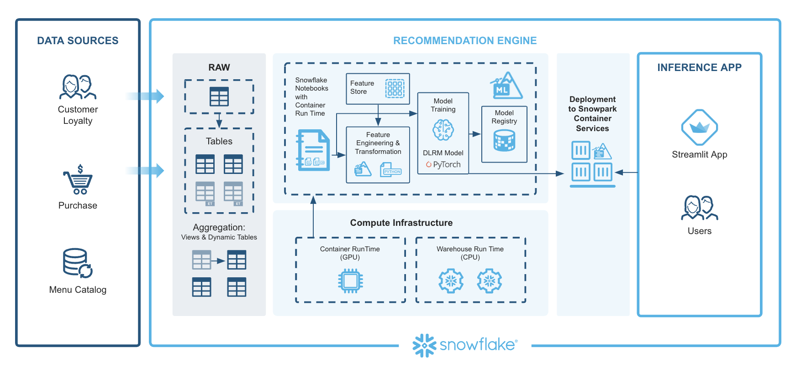
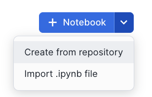
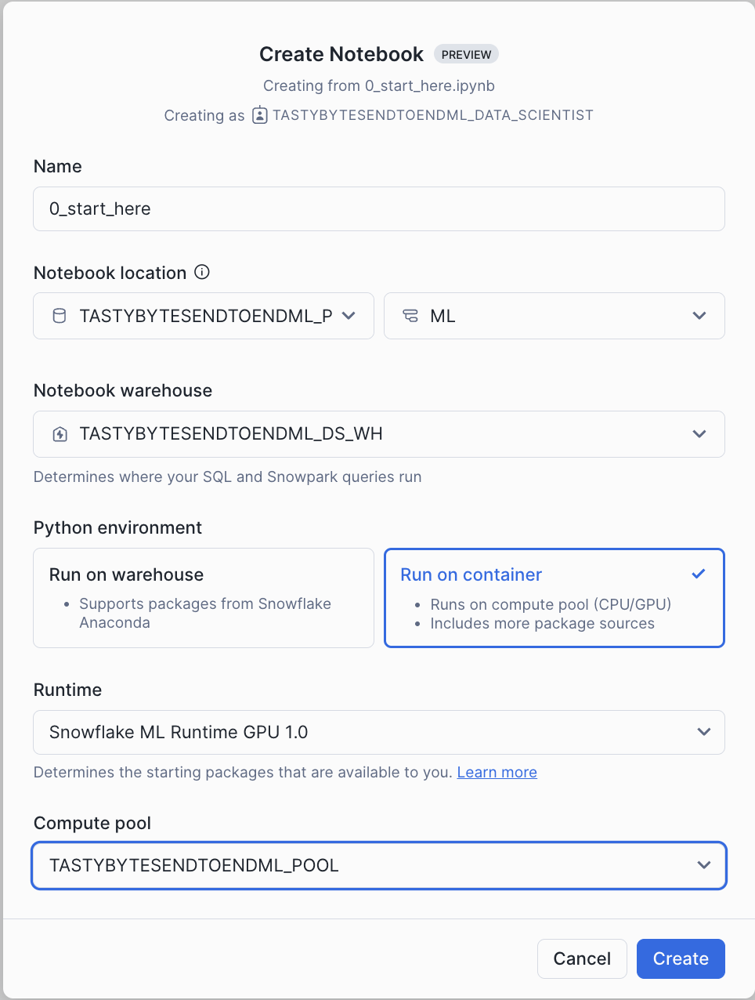
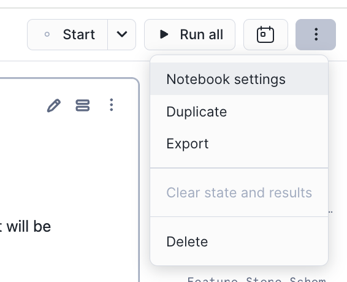
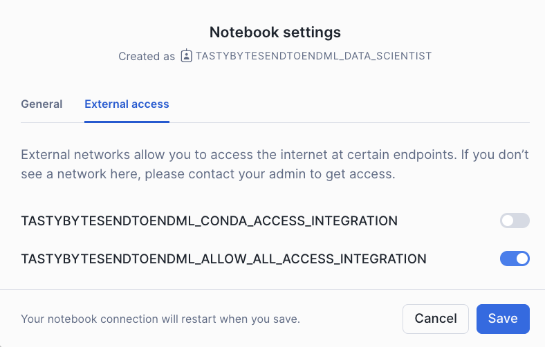
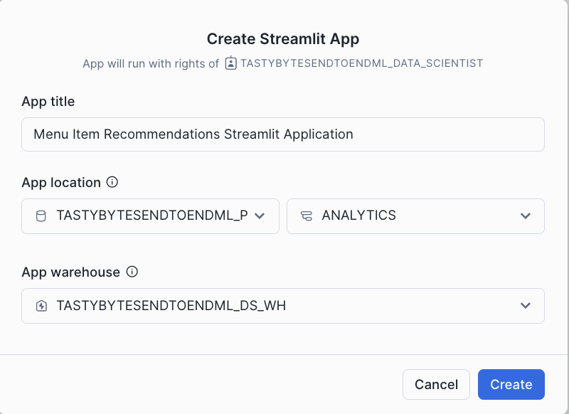
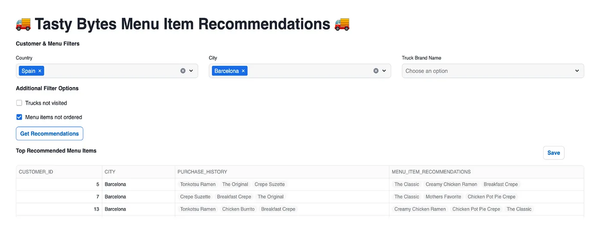

author: Swathi Jasti
id: getting-started-with-running-distributed-pytorch-models-on-snowflake
categories: snowflake-site:taxonomy/solution-center/certification/quickstart, snowflake-site:taxonomy/solution-center/certification/certified-solution, snowflake-site:taxonomy/solution-center/includes/architecture, snowflake-site:taxonomy/product/ai, snowflake-site:taxonomy/snowflake-feature/model-development, snowflake-site:taxonomy/snowflake-feature/snowflake-ml-functions
language: en
summary: Getting Started with Running Distributed PyTorch Models on Snowflake 
environments: web
status: Published 
feedback link: https://github.com/Snowflake-Labs/sfguides/issues
fork repo link: https://github.com/Snowflake-Labs/sfguide-getting-started-with-running-distributed-pytorch-models-on-snowflake

# Getting Started with Running Distributed PyTorch Models on Snowflake

## Overview

This solution generates upsell and cross-sell recommendations to increase sales for the Tasty Bytes business. In this quickstart, we will walk through how to build an end-to-end Pytorch recommendation model using [Snowflake ML](/en/data-cloud/snowflake-ml/). This involves:

- Extracting features from customer, menu, and purchase history.
- Preprocessing data.
- Training a PyTorch DLRM model with distributed processing on GPUs.
- Registering the model and serving it for inference with GPUs in containers.
- Running predictions and visualizing recommendations on Streamlit.
- Displaying personalized menu item recommendations along with purchase history in a Streamlit app.

In addition, this end-to-end ML solution using [Snowflake ML](/en/data-cloud/snowflake-ml/) aims to address the common challenges in building ML workflows, such as:

**Eliminating Silos and Governance Challenges:** Ensuring a seamless and integrated environment for ML development, from data processing to model serving, to tackle the issue of isolated workflows and governance difficulties.

**Simplifying Infrastructure Management:** Providing a no-configuration, no-data-movement, and no-infrastructure-management setup, allowing users to focus purely on ML development and deployment.

**Enhancing Consistency and Efficiency:** Unifying feature engineering for both training and serving within Snowflake ML to ensure consistency and efficiency throughout the ML lifecycle.

**Scalable Model Training:** Leveraging GPU-based processing for scalable and efficient model training.

**Integrated Development and Production Environments:** Offering a single platform for data processing, feature engineering, training, and serving, which facilitates comprehensive tracking and lineage of ML artifacts from start to finish.

### Prerequisites
- Privileges necessary to create a user, database, and warehouse in Snowflake
- A Snowflake Account. Sign up for a [30-day free trial](https://signup.snowflake.com/?utm_source=snowflake-devrel&utm_medium=developer-guides&utm_cta=developer-guides) account, if required. 
- (Optional) Completed [Getting Started with Snowflake Notebook Container Runtime](/en/developers/guides/notebook-container-runtime/)

### What You Will Learn
- How to extract features from customer, menu, and purchase history.
- How to preprocess data using the Snowflake ML APIs.
- How to train a PyTorch DLRM model with distributed processing on GPUs.
- How to register the model and deploy it to Snowflake’s Container Runtime (public preview).
- How to run predictions and visualize recommendations on Streamlit.
- How to display personalized menu item recommendations along with purchase history in a Streamlit app.

### What You Will Need
- A [GitHub](https://github.com/) Account
- A [Snowflake](https://app.snowflake.com/) Account with Accountadmin access

### What You Will Build
From Snowflake Notebooks on Container Runtime (public preview), you will complete the following in this quickstart: 

- A feature extraction pipeline from customer, menu, and purchase history.
- A preprocessing pipeline.
- A trained PyTorch DLRM model with distributed processing on GPUs.
- A model served for inference in containers.

Afterward, we will also show you how to build a Streamlit app for running predictions and visualizing recommendations.

## Setup Environment

Navigate to Worksheets, click "+" in the top-right corner to create a new Worksheet, and choose "SQL Worksheet".

Run the SQL from the [file](https://github.com/Snowflake-Labs/sfguide-getting-started-with-running-distributed-pytorch-models-on-snowflake/blob/main/scripts/setup.sql) in the worksheet to create Snowflake objects (database, schema, tables),

## Architecture

The architecture of the Tasty Bytes ML solution is designed to generate personalized upsell and cross-sell recommendations. Here's a detailed walkthrough of how we use components of Snowflake ML to complete this workflow:

**Extracting Features:** This begins with the ingestion of data into Snowflake. Data sources include customer profiles, menu details, and purchase histories. Snowflake Notebooks can be leveraged to provide an integrated development environment where SQL and Python are used to query, manipulate, and prepare the data. The team automates the extraction of relevant features, ensuring that data from various sources is consolidated and ready for subsequent steps.

**Preprocessing Data:** Next, the extracted data is preprocessed to make it suitable for machine learning. The Snowflake ML APIs are utilized for this purpose. Using Snowflake ML, the team writes data transformation and feature engineering code in Python. Snowflake’s parallel processing capabilities handle large-scale data efficiently, enabling quick and seamless preprocessing. Additionally, the Snowflake Feature Store is used to create and manage reusable features, simplifying the computation of complex aggregations and moving window calculations with simple Python commands. This ensures consistency and efficiency in feature engineering.

**Training a PyTorch DLRM Model with Distributed Processing on GPUs:** With preprocessed data ready, the model training phase begins. We are using PyTorch Deep Learning Recommendation Model (DLRM), which is well-suited for generating personalized recommendations. Using the Snowflake ML APIs, feature transformations are performed and the data is prepared for training. The actual training occurs in the Container Runtime, which includes prepackaged environments with popular Python packages and deep learning frameworks like PyTorch. This environment supports GPU nodes, enabling distributed training that scales efficiently without the need for heavy infrastructure management.

**Registering the Model and Serving It in Containers with GPUs:** After the model is trained, it is registered and deployed. The Snowflake Model Registry serves as the central hub for managing the model's lifecycle, tracking versions, and maintaining metadata. The trained DLRM model is registered here, making it ready for deployment. Deployment is fully managed by Snowflake , ensuring consistency between development and production. This environment maintains the same packages and configurations, allowing the model to be deployed seamlessly on Snowflake warehouses or Snowpark Container Services for access to GPUs.

**Running Predictions and Visualizing Recommendations on Streamlit:** With the model deployed, predictions are generated. The deployed model processes incoming data to produce personalized upsell and cross-sell recommendations. To make these insights accessible, we are leveraging Streamlit to build interactive dashboards. Streamlit provides a user-friendly interface where business users can explore the model’s predictions and visualizations. This interactive platform makes it easy to understand and act upon the insights generated by the model.

**Displaying Personalized Menu Item Recommendations Along with Purchase History in a Streamlit App:** The predictions generated by the model, which include personalized upsell and cross-sell recommendations, are displayed in the Streamlit app. This app shows the recommendations alongside relevant customer purchase history, providing a comprehensive view of the insights generated by the model.

This architecture integrates various Snowflake features to create a robust end-to-end ML solution. From data ingestion and preprocessing to model training, deployment, and visualization, each component plays a crucial role in ensuring the efficiency, scalability, and consistency of the ML workflow. By leveraging Snowflake ML, the Tasty Bytes team successfully addresses common challenges in ML workflows, empowering their business with actionable insights to drive sales growth.

## Notebook

This notebook demonstrates how to create and manage feature views within a feature store. By facilitating collaboration across teams, it enables seamless reuse of features while bridging the gap between training and serving environments. In this example, we train and deploy a deep learning model to generate personalized recommendations for loyalty customers, aiming to drive engagement and improve performance for underperforming food trucks at Tasty Bytes.

- Navigate to Snowsight and change role to **TASTYBYTESENDTOENDML_DATA_SCIENTIST**

- Select the Notebooks tab.

- Import the following Snowflake Notebook in Snowsight: [0_start_here.ipynb](https://github.com/Snowflake-Labs/sfguide-getting-started-with-running-distributed-pytorch-models-on-snowflake/blob/main/notebooks/0_start_here.ipynb)

- Create notebook with the settings in the screenshot.

- Once created, Click on Notebook Settings in the top right corner inside Snowflake Notebooks

- Enable **TASTYBYTESENDTOENDML_ALLOW_ALL_ACCESS_INTEGRATION** as per screenshot

- Click each cell or Run all to run the Notebook

## Streamlit Application

The Streamlit app showcases the deep learning model's predictions, featuring personalized upsell and cross-sell recommendations alongside relevant customer purchase history. This comprehensive view helps users easily understand and leverage the insights generated by the model. The app provides recommendations by gathering data, processing features, and utilizing a model registry for deployed deep learning model inference to deliver menu item suggestions. Various filter options are available to tailor the recommendations based on specific use cases. Users also have the option to save these results for campaigns and marketing efforts.

### Run Streamlit Application

To set up the Streamlit in Snowflake Application,

1. Navigate to Snowsight.
2. Select the Streamlit tab.
3. Click on **+ Streamlit App** to create streamlit App. Use the configuration from below screenshot to create the Application.
4. Once the App is created, replace the example code with the streamlit code in the [file](https://github.com/Snowflake-Labs/sfguide-getting-started-with-running-distributed-pytorch-models-on-snowflake/blob/main/streamlit/Menu_Item_Recommendations_App.py) 
4. Add **snowflake-ml-python** and **pytorch** packages to the app and Run the Application.

### Application Flow

This application generates menu item recommendations based on the filters selected in the user interface. For example, you can filter by country (e.g., Spain) and city (e.g., Barcelona). Additional filters such as **trucks not visited** and **menu items not ordered** can be applied to refine the recommendations for upselling and cross-selling opportunities.

When you click the **Get Recommendations** button, the application filters the data based on your selections, processes the features for the model, and runs the deep learning model inference to generate menu item recommendations along with purchase history for better context. You also have the option to save these results for use in campaigns and marketing efforts. By clicking the **Save** button, the results are saved to the Stage.

## Conclusion And Resources

### What You Learned
- How to extract features from customer, menu, and purchase history.
- How to preprocess data.
- How to train a PyTorch DLRM model with distributed processing on GPUs.
- How to register the model and deploy it to a container runtime environment.
- How to run predictions and visualize recommendations on Streamlit.
- How to display personalized menu item recommendations along with purchase history in a Streamlit app.

### Resources
- [Source Code on GitHub](https://github.com/Snowflake-Labs/sfguide-getting-started-with-running-distributed-pytorch-models-on-snowflake)
- [Demo Video on Youtube](https://www.youtube.com/watch?v=9uqcNBIY14g)
- [Blog](https://medium.com/snowflake/running-distributed-pytorch-models-on-snowflake-an-end-to-end-ml-solution-452d16a39553)
- [Solution Center](https://developers.snowflake.com/solution/running-distributed-pytorch-models-on-snowflake-an-end-to-end-ml-solution/)
- [Snowflake Notebooks: Documentation](https://docs.snowflake.com/en/user-guide/ui-snowsight/notebooks-on-spcs)
- [Feature Store: Documentation](https://docs.snowflake.com/en/developer-guide/snowflake-ml/feature-store/overview)
- [Model Registry: Documentation](https://docs.snowflake.com/developer-guide/snowflake-ml/model-registry/overview?utm_cta=snowpark-dg-hero-card)
- [Snowflake ML Webpage](/en/data-cloud/snowflake-ml/)

### Related Quickstarts
- [Getting Started with Snowflake Notebooks on Container Runtime](/en/developers/guides/notebook-container-runtime/)
- [Train an XGBoost Model with GPUs using Snowflake Notebooks](/en/developers/guides/train-an-xgboost-model-with-gpus-using-snowflake-notebooks/)
- [Defect Detection Using Distributed PyTorch With Snowflake Notebooks](/en/developers/guides/defect-detection-using-distributed-pytorch-with-snowflake-notebooks/)
- [Scale Embeddings with Snowflake Notebooks on Container Runtime](/en/developers/guides/scale-embeddings-with-snowflake-notebooks-on-container-runtime/)
- [Getting Started with Snowflake MLeg](/en/developers/guides/intro-to-machine-learning-with-snowpark-ml-for-python/)
- [Fork Repo on GitHub](https://github.com/Snowflake-Labs/sfguide-getting-started-with-running-distributed-pytorch-models-on-snowflake/tree/main)
- [Download Reference Architecture](/content/dam/snowflake-site/developers/2024/10/End-to-End-ML-Workflows-with-Snowflake-ML-Architecture.png)
- [Read the Blog](https://medium.com/snowflake/running-distributed-pytorch-models-on-snowflake-an-end-to-end-ml-solution-452d16a39553)
- [Watch the Demo](https://youtu.be/9uqcNBIY14g?list=TLGGGYyd9046ENkyNDA5MjAyNQ) 
