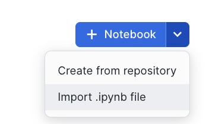

author: Swathi Jasti
id: getting-started-with-running-distributed-pytorch-models-on-snowflake
summary: Getting Started with Running Distributed PyTorch Models on Snowflake
categories: Getting-Started
environments: web
status: Published 
feedback link: https://github.com/Snowflake-Labs/sfguides/issues
tags: Getting Started, Data Science, Data Engineering, Data Apps 

# Getting Started with Running Distributed PyTorch Models on Snowflake

## Overview
Duration: 3

This solution generates upsell and cross-sell recommendations to increase sales for the Tasty Bytes business. This involves:

- Extracting features from customer, menu, and purchase history.
- Preprocessing data using the Snowpark ML library.
- Training a PyTorch DLRM model with distributed processing on GPUs.
- Registering the model and deploying it to a container runtime environment.
- Running predictions and visualizing recommendations on Streamlit.
- Displaying personalized menu item recommendations along with purchase history in a Streamlit app.

In addition, this end-to-end ML solution using Snowflake ML and Notebooks aims to address the common challenges in building ML workflows, such as:

**Eliminating Silos and Governance Challenges:** Ensuring a seamless and integrated environment for ML development, from data processing to model serving, to tackle the issue of isolated workflows and governance difficulties.

**Simplifying Infrastructure Management:** Providing a no-configuration, no-data-movement, and no-infrastructure-management setup, allowing users to focus purely on ML development and deployment.

**Enhancing Consistency and Efficiency:** Unifying feature engineering for both training and serving within Snowflake ML to ensure consistency and efficiency throughout the ML lifecycle.

**Scalable Model Training:** Leveraging GPU-based processing for scalable and efficient model training.

**Integrated Development and Production Environments:** Offering a single platform for data processing, feature engineering, training, and serving, which facilitates comprehensive tracking and lineage of ML artifacts from start to finish.

### Prerequisites
- A [GitHub](https://github.com/) Account

### What You Will Learn
- How to extract features from customer, menu, and purchase history.
- How to preprocess data using the Snowpark ML library.
- How to train a PyTorch DLRM model with distributed processing on GPUs.
- How to register the model and deploy it to a container runtime environment.
- How to run predictions and visualize recommendations on Streamlit.
- How to display personalized menu item recommendations along with purchase history in a Streamlit app.

### What You Will Need
- A [GitHub](https://github.com/) Account
- Snowflake Account

### What You Will Build
- A feature extraction pipeline from customer, menu, and purchase history.
- A preprocessing pipeline using the Snowpark ML library.
- A trained PyTorch DLRM model with distributed processing on GPUs.
- A deployed model in a container runtime environment.
- A Streamlit app for running predictions and visualizing recommendations.

## Creating Objects, Loading Data, and Joining Data
Duration: 10

Navigate to Worksheets, click "+" in the top-right corner to create a new Worksheet, and choose "SQL Worksheet".

Run the SQL from the [file](https://github.com/Snowflake-Labs/sfguide-getting-started-with-running-distributed-pytorch-models-on-snowflake/blob/main/scripts/setup.sql) in the worksheet to create Snowflake objects (database, schema, tables),

## Architecture
Duration: 3

The architecture of the Tasty Bytes ML solution is designed to generate personalized upsell and cross-sell recommendations. Here’s a detailed walkthrough of how each component and process comes together to achieve this:

**Extracting Features:** This begins with the ingestion of data into Snowflake. Data sources include customer profiles, menu details, and purchase histories. Snowflake Notebooks can be leveraged to provide an integrated development environment where SQL and Python are used to query, manipulate, and prepare the data. The team automates the extraction of relevant features, ensuring that data from various sources is consolidated and ready for subsequent steps.

**Preprocessing Data Using the Snowpark ML Library:** Next, the extracted data is preprocessed to make it suitable for machine learning. The Snowpark ML library is utilized for this purpose. Using the Snowpark API, the team writes data transformation and feature engineering code in Python. Snowpark's parallel processing capabilities handle large-scale data efficiently, enabling quick and seamless preprocessing. Additionally, the Snowflake Feature Store is used to create and manage reusable features, simplifying the computation of complex aggregations and moving window calculations with simple Python commands. This ensures consistency and efficiency in feature engineering.

**Training a PyTorch DLRM Model with Distributed Processing on GPUs:** With preprocessed data ready, the model training phase begins. We are using PyTorch Deep Learning Recommendation Model (DLRM), which is well-suited for generating personalized recommendations. Using the Snowpark ML Modeling API, feature transformations are performed and the data is prepared for training. The actual training occurs in the Container Runtime environment, which includes prepackaged environments with popular Python packages and deep learning frameworks like PyTorch. This environment supports GPU nodes, enabling distributed training that scales efficiently without the need for heavy infrastructure management.

**Registering the Model and Deploying It to a Container Runtime Environment:** After the model is trained, it is registered and deployed. The Snowflake Model Registry serves as the central hub for managing the model's lifecycle, tracking versions, and maintaining metadata. The trained DLRM model is registered here, making it ready for deployment. Deployment is managed by the Container Runtime environment, ensuring consistency between development and production. This environment maintains the same packages and configurations, allowing the model to be deployed seamlessly on Snowflake WH or container services.

**Running Predictions and Visualizing Recommendations on Streamlit:** With the model deployed, predictions are generated. The deployed model processes incoming data to produce personalized upsell and cross-sell recommendations. To make these insights accessible, we are leveraging Streamlit to build interactive dashboards. Streamlit provides a user-friendly interface where business users can explore the model’s predictions and visualizations. This interactive platform makes it easy to understand and act upon the insights generated by the model.

**Displaying Personalized Menu Item Recommendations Along with Purchase History in a Streamlit App:** The predictions generated by the model, which include personalized upsell and cross-sell recommendations, are displayed in the Streamlit app. This app shows the recommendations alongside relevant customer purchase history, providing a comprehensive view of the insights generated by the model.

This architecture integrates various Snowflake features to create a robust end-to-end ML solution. From data ingestion and preprocessing to model training, deployment, and visualization, each component plays a crucial role in ensuring the efficiency, scalability, and consistency of the ML workflow. By leveraging Snowflake ML, the Tasty Bytes team successfully addresses common challenges in ML workflows, empowering their business with actionable insights to drive sales growth.

## Producer Notebook
Duration: 5

The Producer Notebook creates and operates on feature views. Producers manage feature views and entities in the feature store, facilitating collaboration and feature reuse across departments. This approach breaks down silos between training and serving environments and simplifies aggregations and moving window calculations using Python commands.

### Access Producer Notebook
Import the following Snowflake Notebook in Snowsight and run each of the cells: [1_EndtoEndML_Producer.ipynb](https://github.com/Snowflake-Labs/sfguide-getting-started-with-running-distributed-pytorch-models-on-snowflake/blob/main/notebooks/1_EndtoEndML_Producer.ipynb)

## Consumer Notebook
Duration: 20

In this notebook, we train and deploy a deep learning model to generate recommendation scores for loyalty customers for each menu item sold by Tasty Bytes food trucks. The output is used for personalized outreach, increasing the number of truck brands visited by customers, and boosting traffic to underperforming trucks.

### Access Consumer Notebook

Import the following Snowflake Notebook in Snowsight and enable external access integration as below. Once done, run each of the cells: [2_EndtoEndML_Consumer.ipynb](https://github.com/Snowflake-Labs/sfguide-getting-started-with-running-distributed-pytorch-models-on-snowflake/blob/main/notebooks/2_EndtoEndML_Consumer.ipynb)

## Menu Item Recommendations Streamlit Application
Duration: 3

The Streamlit app showcases the deep learning model's predictions, featuring personalized upsell and cross-sell recommendations alongside relevant customer purchase history. This comprehensive view helps users easily understand and leverage the insights generated by the model. The app provides recommendations by gathering data, processing features, and utilizing a model registry for deployed deep learning model inference to deliver menu item suggestions. Various filter options are available to tailor the recommendations based on specific use cases. Users also have the option to save these results for campaigns and marketing efforts.

### Run Streamlit Application

To set up the Streamlit in Snowflake Application,

1. Navigate to Snowsight.
2. Select the Streamlit tab.
3. Click on **+ Streamlit App** and replace the code with the streamlit code in the [file](https://github.com/Snowflake-Labs/sfguide-getting-started-with-running-distributed-pytorch-models-on-snowflake/blob/main/streamlit/Menu_Item_Recommendations_App.py) 
4. Add **snowflake-ml-python** package to the app and Run the Application.

### Application Flow

This application generates menu item recommendations based on the filters selected in the user interface. For example, you can filter by country (e.g., Spain) and city (e.g., Barcelona). Additional filters such as **trucks not visited** and **menu items not ordered** can be applied to refine the recommendations for upselling and cross-selling opportunities.

When you click the **Get Recommendations** button, the application filters the data based on your selections, processes the features for the model, and runs the deep learning model inference to generate menu item recommendations along with purchase history for better context. You also have the option to save these results for use in campaigns and marketing efforts. By clicking the **Save** button, the results are saved to the Stage.

## Conclusion And Resources

### What You Learned
- How to extract features from customer, menu, and purchase history.
- How to preprocess data using the Snowpark ML library.
- How to train a PyTorch DLRM model with distributed processing on GPUs.
- How to register the model and deploy it to a container runtime environment.
- How to run predictions and visualize recommendations on Streamlit.
- How to display personalized menu item recommendations along with purchase history in a Streamlit app.

### Related Resources
- [Source Code on GitHub](https://github.com/Snowflake-Labs/sfguide-getting-started-with-running-distributed-pytorch-models-on-snowflake)
- [Demo Video on Youtube](https://www.youtube.com/watch?v=9uqcNBIY14g)
- [Notebooks on Container Runtime](https://docs.snowflake.com/en/user-guide/ui-snowsight/notebooks-on-spcs)
- [Snowpark ML](https://docs.snowflake.com/en/developer-guide/snowflake-ml/overview)
- [Feature Store](https://docs.snowflake.com/en/developer-guide/snowflake-ml/feature-store/overview)
- [Model Registry](https://docs.snowflake.com/developer-guide/snowflake-ml/model-registry/overview?utm_cta=snowpark-dg-hero-card)