author: Shreya Agrawal
id: getting-started-with-search-optimization
categories: snowflake-site:taxonomy/solution-center/certification/quickstart, snowflake-site:taxonomy/product/platform
language: en
summary: Quickstart guide for using Search Optimization 
environments: web
status: Published 
feedback link: https://github.com/Snowflake-Labs/sfguides/issues


# Getting started with Search Optimization

<!-- ------------------------ -->
## Overview 

Are you looking to significantly improve the performance of point lookup queries and certain analytical queries that require fast access to records? Search Optimization Service will help you achieve exactly that. 

We create optimized search access paths for the columns in your tables. We take advantage of those optimized paths in addition to other processing enhancements to reduce the number of micro partitions scanned and hence speed up the queries. 

For example, in the picture below, we have a query that is trying to find all rows where the name is Martin in a table. If Search Optimization is enabled, it helps identify ***the micro partitions that don't contain ‘Martin’ in the name column*** and reduces the number of partitions to be scanned. In this particular example, it reduces the number of partitions to be scanned from 15 to 1.
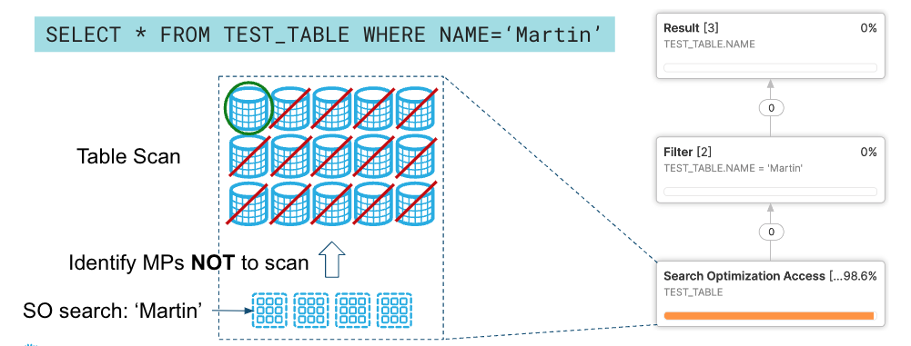


### Prerequisites
A basic knowledge of how to run and monitor queries in the Snowflake Web UI. 

### What you’ll learn
- How to acquire a suitable dataset from Snowflake Marketplace
- How to enable Search Optimization
- What is the performance impact of enabling Search Optimization on different queries

### What You'll Need
- A supported [browser](https://docs.snowflake.com/en/user-guide/setup.html)
- A Snowflake account with the Enterprise Edition 
  - Sign-up using [Snowflake Trial](https://signup.snowflake.com/?utm_source=snowflake-devrel&utm_medium=developer-guides&utm_cta=developer-guides) 
  ***OR***
  - Get access to an existing Snowflake Enterprise Edition account with the `ACCOUNTADMIN` role or the `IMPORT SHARE` privilege

### What You’ll Build 
Performant queries that explore the data from [Snowflake Public Data (Free)](https://app.snowflake.com/marketplace/listing/GZTSZ290BV255/snowflake-public-data-products-snowflake-public-data-free?search=snowflake%20public%20data) dataset by [Snowflake Public Data Products](https://app.snowflake.com/marketplace/providers/GZTSZAS2KCS/Snowflake%20Public%20Data%20Products).

Negative: The Marketplace data used in this guide changes from time-to-time, and your query results may be slightly different than indicated in this guide. Additionally, the Snowflake UI changes periodically as well, and instructions/screenshots may be out of date.

---

<!-- ------------------------ -->
## Setup Snowflake Account and Virtual Warehouse 

The first step in the guide is to set up or log into Snowflake and set up a virtual warehouse if necessary. 

### Access Snowflake's Web UI

[app.snowflake.com](https://app.snowflake.com)

**If this is the first time you are logging into the Snowflake UI**, you will be prompted to enter your account name or account URL that you were given when you acquired a trial. The account URL contains your account name and potentially the region. Click `Sign-in` and you will be prompted for your user name and password.

**If this is not the first time you are logging into the Snowflake UI**, you should see a `Select an account to sign into` prompt and a button for your account name listed below it. Click the account you wish to access and you will be prompted for your user name and password (or another authentication mechanism).

### Switch to the appropriate role

The Snowflake web interface has a lot to offer, but for now, switch your current role from the default `SYSADMIN` to `ACCOUNTADMIN`. 


This will allow you to create shared databases from Snowflake Marketplace listings. If you don't have the `ACCOUNTADMIN` role, switch to a role with `IMPORT SHARE` privileges instead.

---

## Create a Virtual Warehouse (if needed)

***If you don't already have access to a Virtual Warehouse to run queries***, you will need to create one.

- Navigate to the Compute > Warehouses screen using the menu on the left side of the window
- Click the big blue + Warehouse button in the upper right of the window
- Create a Small Warehouse as shown in the screen below

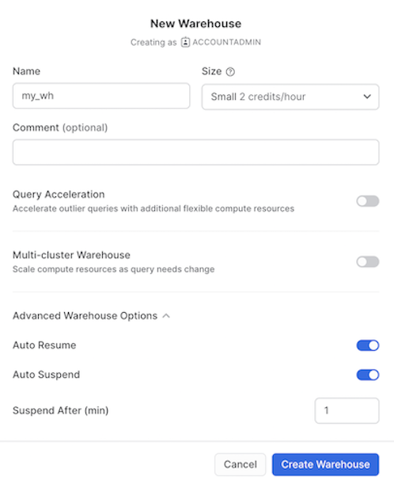

Be sure to change the `Suspend After (min) field` to 1 min to avoid wasting compute credits.

***If you already have access to a Virtual Warehouse to run queries***, make sure to scale it up or down to `Small` Warehouse for this guide.

---

## Acquiring Data from Snowflake Marketplace

The next step is to acquire data that has all data types supported by Search Optimization. The best place to acquire this data is the Snowflake Marketplace.

- Navigate to the `Marketplace` screen using the menu on the left side of the window
- Search for `Snowflake Public Data Products` in the search bar
- Find and click the `Snowflake Public Data (Free)` tile

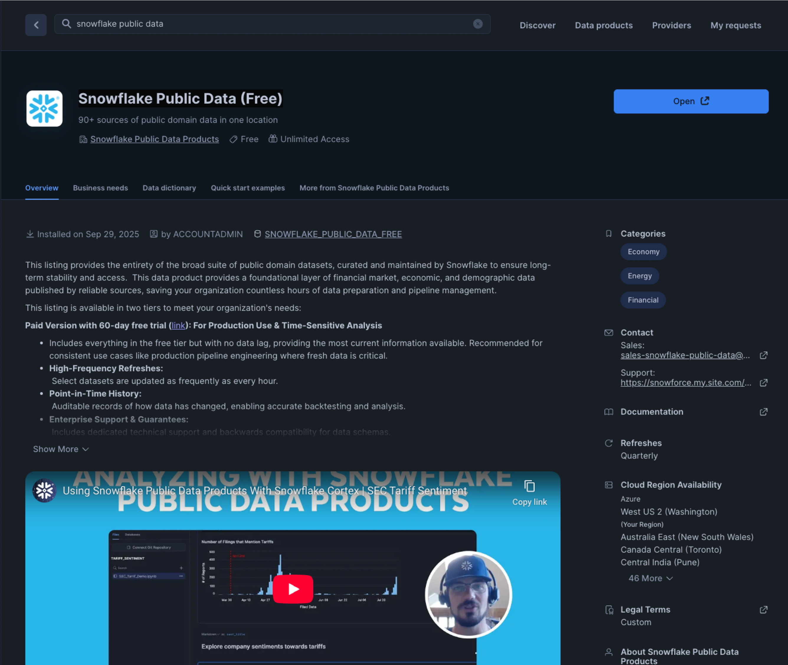

- Once in the listing, click the big blue Get Data button

On the `Get Data` screen, you may be prompted to complete your user profile if you have not done so before. Enter your name and email address into the profile screen and click the blue `Save` button. You will be returned to the `Get Data` screen.

Congratulations! You have just created a shared database named `Snowflake_Public_Data_Free` from a listing on the Snowflake Marketplace. Click the big blue `Query Data` button and advance to the next step in the guide.

---

## Data Setup

The prior section opened a worksheet editor in the new Snowflake UI with a few pre-populated queries that came from the sample queries defined in the Marketplace listing. You are not going to run any of these queries in this guide, but you are welcome to run them later. 


### Understanding the data

You are going to first copy over two of the tables from `Snowflake_Public_Data_Free` (the database that you just imported) into a new database (we will call it `LLM_TRAINING_SO`). 

This is necessary as 
- You wouldn’t have the privileges to set up Search Optimization on the shared `Snowflake_Public_Data_Free` database  
- It will allow you to run the same query on both search optimized (in `LLM_TRAINING_SO` database) and non search optimized tables (in `Snowflake_Public_Data_Free` database) to compare the performance of Search Optimization.
- Optionally, you can also create another database to store the tables without Search Optimization to compare performance and check the partition access/pruning details, as querying on the shared data will not show this information.

The table we will use is `OPENALEX_WORKS_INDEX`, which has data from OpenAlex, a bibliographic catalogue of scientific papers, authors, and institutions accessible in open access mode. It has ***~260 million rows***.


<!-- The first table we will use is `wikidata_original`, it has information about the wikidata articles such as description, label etc. There are ***96.9 million rows*** in this table. 

The second table is `entity_is_subclass_of`, which contains the information about subclass categories like subclass id and subclass name. It is a smaller table and has ***~3.3 million rows***. 

To further understand the relationship between these two tables, consider the following 	query, where we are exploring an entity with Id `Q1968` (which is a Formula One article)

```
SELECT o.label, e.subclass_of_name
    FROM
        entity_is_subclass_of as e
    JOIN wikidata_original as o
    ON e.entity_id = o.id
WHERE
    e.entity_id = 'Q1968'; -- Formula One article

```

The result looks like this:

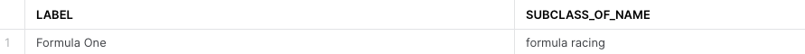

So, Id `Q1968` is an article about `Formula One` (`LABEL`) and this entity rightly belongs to the subclass `Formula Racing` (`SUBCLASS_OF_NAME`).  -->

### Copy the required tables into a new database

Now let's copy over the above table or all 27 tables into a new database before we enable Search Optimization on OPENALEX_WORKS_INDEX.

Before we run the queries to do so, let’s create a new worksheet named `Search Optimization Guide` by clicking the `+ icon` on the left navigation bar. Throughout this guide, we will run  the queries on the search optimized tables in the `Search Optimization Guide` worksheet.

Run the query below in the `Search Optimization Guide` worksheet:

```
//Note: Use appropriate role having required privileges as mentioned 
//https://docs.snowflake.com/en/user-guide/search-optimization/enabling#required-access-control-privileges
USE ROLE accountadmin;

//Note: Substitute warehouse name my_wh with your warehouse name if different
USE WAREHOUSE my_wh;

//Note: Substitute database name so_analysis with your choice of database name(if required)
CREATE OR REPLACE DATABASE LLM_TRAINING_SO;

USE DATABASE LLM_TRAINING_SO;

SHOW SCHEMAS;

//Note: Create Schema name of your choice if you do not want to use PUBLIC schema
USE SCHEMA public;
CREATE SCHEMA Public_Data;
USE SCHEMA Public_Data;

//Note: Substitute my_wh with your warehouse name if different and use warehouse size of your choice
ALTER WAREHOUSE my_wh set warehouse_size='4x-large';

//This query time will depend on the warehouse size.
CREATE OR REPLACE TABLE OPENALEX_WORKS_INDEX AS SELECT * FROM SNOWFLAKE_PUBLIC_DATA_FREE.PUBLIC_DATA_FREE.OPENALEX_WORKS_INDEX; 
```
```
//Note: Check the table details
DESCRIBE TABLE OPENALEX_WORKS_INDEX;

SHOW TABLES LIKE 'OPENALEX_WORKS_INDEX' IN SCHEMA SNOWFLAKE_PUBLIC_DATA_FREE.PUBLIC_DATA_FREE;

//Note: Check the table details by looking at the table DDL.
SELECT GET_DDL('table','SNOWFLAKE_PUBLIC_DATA_FREE.PUBLIC_DATA_FREE.OPENALEX_WORKS_INDEX');

//Note: Check the data (Optional)
SELECT * FROM SNOWFLAKE_PUBLIC_DATA_FREE.PUBLIC_DATA_FREE.OPENALEX_WORKS_INDEX LIMIT 100;
```

Before enabling Search Optimization on the table, it is recommended to execute queries on the table `OPENALEX_WORKS_INDEX` with filter predicates on the columns on which you wish to enable Search Optimization. This will show you the benefits of using Search Optimization. 

```
// Note: Optional to execute the queries before enabling Search Optimization on the table

ALTER SESSION SET use_cached_result = false; -- to clear cached data

ALTER WAREHOUSE my_wh SET warehouse_size = MEDIUM;

ALTER WAREHOUSE my_wh SUSPEND; -- to clear data cached at the warehouse level

ALTER WAREHOUSE my_wh RESUME;

ALTER WAREHOUSE my_wh SET warehouse_size= 'X-SMALL';

// Note: This query will take ~2 minutes 
SELECT *  from LLM_TRAINING_SO.Public_Data.OPENALEX_WORKS_INDEX where mag_work_id = 2240388798; 

// Note: This query will take ~2.5 minutes 
SELECT *  from LLM_TRAINING_SO.Public_Data.OPENALEX_WORKS_INDEX where work_title ilike 'Cross-domain applications of multimodal human-computer interfaces'; 

// Note: This query will take ~3 minutes 
SELECT * from LLM_TRAINING_SO.Public_Data.OPENALEX_WORKS_INDEX  where WORK_PRIMARY_LOCATION:source:display_name ilike 'Eco-forum'; 

// Note: This query will take ~4 minutes 
SELECT * from LLM_TRAINING_SO.Public_Data.OPENALEX_WORKS_INDEX  where WORK_PRIMARY_LOCATION:source:issn_l = '2615-6946'; 
```

Check Search Optimization estimated credit consumption before enabling Search Optimization using the [cost estimation function](https://docs.snowflake.com/en/sql-reference/functions/system_estimate_search_optimization_costs).

```
//Note: Optional but recommended step

SELECT SYSTEM$ESTIMATE_SEARCH_OPTIMIZATION_COSTS('LLM_TRAINING_SO.Public_Data.OPENALEX_WORKS_INDEX',
                                               'EQUALITY(MAG_WORK_ID),EQUALITY(WORK_PRIMARY_LOCATION:source.display_name),
                                               SUBSTRING(WORK_TITLE),SUBSTRING(WORK_PRIMARY_LOCATION:source.issn_l)')
AS estimate_for_columns_without_search_optimization;
```

The output of the cost estimation function will give you an idea of the credit consumption of building and maintaining the search optimization index.

### Enable Search Optimization

Now, let's enable Search Optimization for the `OPENALEX_WORKS_INDEX` in the newly created `LLM_TRAINING_SO` Database (`Search Optimization Guide` Worksheet). Depending on the queries we want to accelerate, we can either enable search optimization for the whole table or for a few columns.
 
For this guide, let's selectively enable Search optimization for a few columns:

```
// Defining Search Optimization on NUMBER fields For Equality
ALTER TABLE LLM_TRAINING_SO.Public_Data.OPENALEX_WORKS_INDEX ADD SEARCH OPTIMIZATION ON EQUALITY(MAG_WORK_ID);

// Defining Search Optimization on VARCHAR fields optimized for Wildcard search
ALTER TABLE LLM_TRAINING_SO.Public_Data.OPENALEX_WORKS_INDEX ADD SEARCH OPTIMIZATION ON SUBSTRING(WORK_TITLE);

// Defining Search Optimization on VARIANT field For Equality
ALTER TABLE LLM_TRAINING_SO.Public_Data.OPENALEX_WORKS_INDEX ADD SEARCH OPTIMIZATION ON SUBSTRING(WORK_PRIMARY_LOCATION:source.display_name);

// Defining Search Optimization on VARIANT field For Wildcard search
ALTER TABLE LLM_TRAINING_SO.Public_Data.OPENALEX_WORKS_INDEX ADD SEARCH OPTIMIZATION ON EQUALITY(WORK_PRIMARY_LOCATION:source.issn_l);

SHOW TABLES LIKE 'OPENALEX_WORKS_INDEX' IN SCHEMA LLM_TRAINING_SO.Public_Data;
```

### Ensure Search Optimization first time indexing is complete

Now, let's verify that Search Optimization is enabled and the backend process has finished indexing our data. It will take about 2 minutes for that to happen as the optimized search access paths are being built for these columns by Snowflake.

Run the below query against the newly created database (`LLM_TRAINING_SO`)

```
DESCRIBE SEARCH OPTIMIZATION ON LLM_TRAINING_SO.Public_Data.OPENALEX_WORKS_INDEX;
```
It would return a result like below:


Make sure that all the rows have the active column set to true before proceeding further in this guide.

Now you are all set up to run some queries and dive deep into Search Optimization.

> **_NOTE:_** 
Please note that the results, query time, partitions or bytes scanned might differ when you run the queries in comparison to the values noted below as the data gets refreshed monthly in the above two tables. 

---
## Equality and Wildcard Search

Now let’s build some queries and observe how Search Optimization helps optimize them. 

To start off, we have already enabled Search Optimization on the `MAG_WORK_ID` and `WORK_TITLE` fields for equality and substring predicates respectively in the previous section.


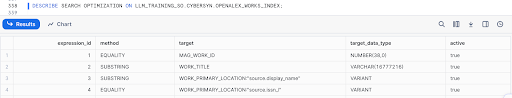

> **_NOTE:_** \
If you wish to run the queries below on both databases (`SNOWFLAKE_PUBLIC_DATA_FREE` and `LLM_TRAINING_SO`) to evaluate performance impact, please make sure to run the commands below before you switch from one database to another. This will ensure that no cached results (hot or warm) are used. \
\
ALTER SESSION SET USE_CACHED_RESULT = false; \
ALTER WAREHOUSE my_wh SUSPEND;

Now, run the same queries that you executed earlier when the Search Optimization was not enabled on the table. The query would look like below and is for the EQUALITY search on the column `MAG_WORK_ID` :

```
SELECT *  
  FROM LLM_TRAINING_SO.Public_Data.OPENALEX_WORKS_INDEX 
  WHERE 
    mag_work_id = 2240388798;
```

| **Without search optimization** | **With Search Optimization**|
|-----------------------------|-------------------------|
| It takes 1 minute 43 seconds to run the query on the table without search optimization. The other interesting aspect is that almost all partitions 15947 out of 15953 need to be scanned. Also, you will note that ~20GB of data is scanned. | On the other hand, the query takes 2.2 seconds on the search optimized table. You will notice that only 1 partition of the total 15953 partitions was scanned. In addition, only ~91MB of the data needs to be scanned. |

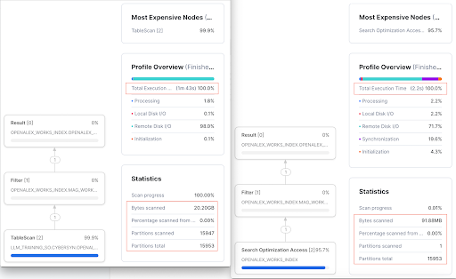

*Looking at the numbers side by side, we know that Search Optimization has definitely improved the query performance.*

|                                      | **Without Search Optimization**  | **With Search Optimization** | **Performance Impact** |
|--------------------------------------|------------------------------|--------------------------|--------------------|
| **Query run time**                   | 1 minute 43 seconds          | 2.2 seconds              |**97.86% improvement** in query speed  |
| **Percentage of partitions scanned** | 99.96%                       |0.0001%                   |**99.9% less partitions** scanned     |
| **Bytes scanned**                    |20.20GB                       |91.88MB                   |**99.9% less data** scanned           |

Let's look at another example with the SUBSTR search on the column `WORK_TITLE`.

```
SELECT *  
  FROM LLM_TRAINING_SO.Public_Data.OPENALEX_WORKS_INDEX 
  WHERE 
    work_title ilike 'Cross-domain applications of multimodal human-computer interfaces'; 
```
| **Without search optimization** | **With Search Optimization**|
|-----------------------------|-------------------------|
| The query runs for ~2.5 minutes and ALL partitions are scanned. Also, 31.70GB of data is scanned. See the picture below for full details. | On the other hand, the query runs in 5 seconds on the Search Optimized table. You'll also notice that only 182 partitions of the total 15953 partitions are scanned. In addition, 1.07GB of the data was scanned. See the picture below for full details. |


*As you can see from the **Performance Impact** column above, using Search Optimization allows us to make significant improvements in query performance.*

|                                      | **Without Search Optimization**  | **With Search Optimization** | **Performance Impact** |
|--------------------------------------|------------------------------|--------------------------|--------------------|
| **Query run time**                   | 2 minute 25s                 | 5 seconds              |**97% improvement** in query speed  |
| **Percentage of partitions scanned** | 100%                       |1.2%                     |**98.8% less partitions** scanned     |
| **Bytes scanned**                    |31.70GB                       |1.07GB                  |**96.62% less data** scanned           |

Want to learn more? You can refer to our external documentations for benefitting from Search Optimization for queries with [ Equality Predicates](https://docs.snowflake.com/en/user-guide/search-optimization-service.html#equality-or-in-predicates) and [Wildcards](https://docs.snowflake.com/en/user-guide/search-optimization-service).html#substrings-and-regular-expressions)

---

## Searching in Variant data

In this section, let’s search in the variant data and analyze how Search Optimization helps in these cases. 

> **_NOTE:_**  
 If you wish to run the queries below on both databases (`SNOWFLAKE_PUBLIC_DATA_FREE` and `LLM_TRAINING_SO`) to evaluate performance impact, please make sure to run the commands below before you switch from one database to another. This will ensure that no cached results (hot or warm) are used. \
 \
ALTER SESSION SET USE_CACHED_RESULT = false;\
ALTER WAREHOUSE my_wh SUSPEND;
ALTER WAREHOUSE my_wh RESUME;

To start, we have already enabled Search Optimization on the `WORK_PRIMARY_LOCATION` field, which is an unstructured JSON field. We also enabled SUBTR and EQUALITY search on different columns of the JSON data.

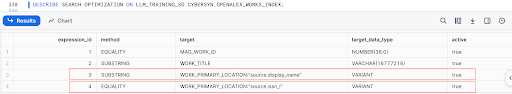

Now, run the same queries that you executed earlier when the Search Optimization was not enabled on the table. The query would look like below and is for the EQUALITY search on the variant column `WORK_PRIMARY_LOCATION:source:issn_l`:

```
select * 
  from LLM_TRAINING_SO.Public_Data.OPENALEX_WORKS_INDEX  
  where 
    WORK_PRIMARY_LOCATION:source:issn_l = '2615-6946';
```
The above query returns ***1 row out of 260 million rows***.

| **Without search optimization** | **With Search Optimization**|
|-----------------------------|-------------------------|
| The query runs for 4m14s on the table without search optimization. You will also see that ALL partitions need to be scanned. In addition, 105.76GB of data was scanned. | On the other hand, it takes 1.7 seconds to run the same query on the search optimized table. You will also notice that only 1 partition of the total 15953 partitions is scanned. In addition, only 34.80MB of the data was scanned. |

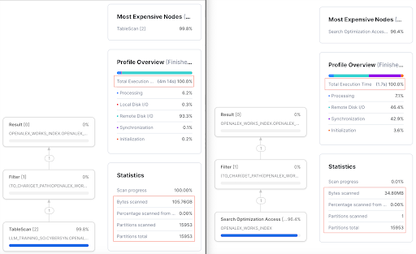

*From the **Performance Impact** column below, we see that using Search Optimization allows us to make significant improvements in query performance*

|                                      | **Without Search Optimization**  | **With Search Optimization** | **Performance Impact** |
|--------------------------------------|------------------------------|--------------------------|--------------------|
| **Query run time**                   | 4 minute 14 seconds          | 1.7 seconds              |**99.9% improvement** in query speed  |
| **Percentage of partitions scanned** | 100%                         |0.0001%                   |**99.9% less partitions** scanned     |
| **Bytes scanned**                    |105.76GB                      |34.80MB                   |**99.9% less data** scanned           |

Another example, for EQUALITY search on the variant column `WORK_PRIMARY_LOCATION:source:issn_l`:

```
select * 
  from LLM_TRAINING_SO.Public_Data.OPENALEX_WORKS_INDEX  
  where 
    WORK_PRIMARY_LOCATION:source:display_name ilike 'Eco-forum'; 
```
The above query returns ***416 rows out of 260 million rows***.

| **Without search optimization** | **With Search Optimization**|
|-----------------------------|-------------------------|
| The query runs for 3m2s on the table without search optimization. You will also see that ALL partitions need to be scanned. In addition, 28.66GB of data was scanned.  | On the other hand, it takes 12 seconds to run the same query on the search optimized table. You will also notice that only 412 partitions of the total 15953 partitions are scanned. In addition, 6.07GB of the data was scanned. |

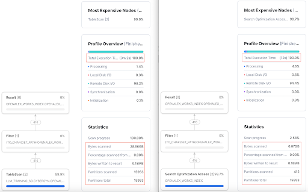

*From the **Performance Impact** column below, we see that using Search Optimization allows us to make significant improvements in query performance*

|                                      | **Without Search Optimization**  | **With Search Optimization** | **Performance Impact** |
|--------------------------------------|------------------------------|--------------------------|--------------------|
| **Query run time**                   | 3 minute 2 seconds          | 12 seconds              |**93.4% improvement** in query speed  |
| **Percentage of partitions scanned** | 100%                         |2.6%                   |**97.4% less partitions** scanned     |
| **Bytes scanned**                    |28.66GB                      |6.07MB                   |**78.82% less data** scanned           |

Want to learn more? You can refer to our external documentations for [benefitting from Search Optimization for queries on Variant Data](https://docs.snowflake.com/en/user-guide/search-optismization-service.html#fields-in-variant-columns)

----

<!-- ## Accelerating Joins

The search optimization service can improve the performance of queries that join a small table with a large table. 

> **_NOTE:_** \
In data warehousing, the large table is often referred to as the fact table. The small table is referred to as the dimension table. The rest of this topic uses these terms when referring to the large table and the small table in the join.

To enable the search optimization service to improve the performance of joins, you need to add Search Optimization to the fact table (the larger of the two tables).
In addition, the dimension table (the smaller of the two tables) should have few distinct values. In our guide, `wikidata_original` is the fact table whereas `entity_is_subclass_of` is the dimension table.

Let’s say you want to find out the Subclass ID of all articles related to `‘Formula One’`. 
Say we know the following entity ids in the wikidata_original table mapping to ‘Formula One’ articles are => `'Q1437617','Q8564669','Q1968' and 'Q5470299'`

So, the query to find the `‘Formula One’` subclass Ids would look like below:

```
SELECT *  
  FROM entity_is_subclass_of AS e 
  JOIN wikidata_original AS o ON (e.subclass_of_name = o.label)
  WHERE e.entity_id IN ('Q1437617','Q8564669','Q1968','Q5470299') ;
```

> **_NOTE:_** \
If you wish to run the queries below on both databases (`WIKIDATA` and `WIKI_SO`) to evaluate performance impact, please make sure to run the commands below before you switch from one database to another. This will ensure that no cached results (hot or warm) are used. \
\
ALTER SESSION SET USE_CACHED_RESULT = false; \
ALTER WAREHOUSE my_wh SUSPEND;

| **Without search optimization** | **With Search Optimization**|
|-----------------------------|-------------------------|
| It takes ~43 seconds and scans nearly **ALL partitions** and about 64.64GB of data to find the resulting Subclass ID. See the picture below for full details. 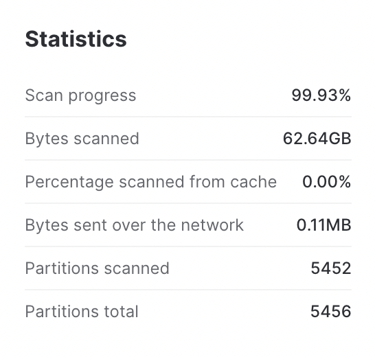 | On the other hand, the query on the search optimized table, returns the result (subclass_of_id => Q1199515) in 4.4 seconds. Also, only a small portion of data is scanned to find the answer (**12 partitions** and 99.30MB of data is scanned).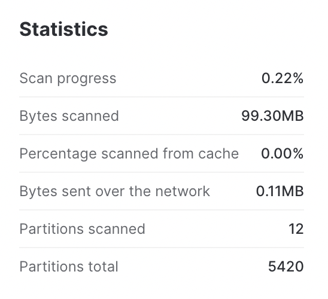 |

*If we compare the statistics side by side, we can observe that Search Optimization greatly optimized the JOIN query.*

|                                      | **Without Search Optimization**  | **With Search Optimization** | **Performance Impact** |
|--------------------------------------|------------------------------|--------------------------|--------------------|
| **Query run time**                   | 43 seconds                   | 4.4 seconds              |**92.09% improvement** in query speed  |
| **Percentage of partitions scanned** | 99.92%                       |0.22%                     |**99.70% less partitions** scanned     |
| **Bytes scanned**                    |62.64GB                       |99.30MB                   |**99.84% less data** scanned           |

Want to learn more? You can refer to our external documentations for [benefitting from Search Optimization for JOIN queries](https://docs.snowflake.com/en/user-guide/search-optimization-service.html#enabling-the-search-optimization-service-to-improve-the-performance-of-joins)

---- -->

## Queries that are not benefitting from Search Optimization

Not all queries benefit from Search Optimization. One such example is the following query to get all entries that have description with the words `Reactions Weekly` and page in that order. The query would look like:

```
select * 
  from LLM_TRAINING_SO.Public_Data.OPENALEX_WORKS_INDEX  
  where 
    WORK_PRIMARY_LOCATION:source:display_name ilike 'Reactions Weekly'; 
```
The following query returns **~256K rows**. As shown in the snapshot below, **only 8 out of the 15953 partitions is skipped** when you run the query on the search optimized **OPENALEX_WORKS_INDEX** table in our newly created **LLM_TRAINING_SO** database .

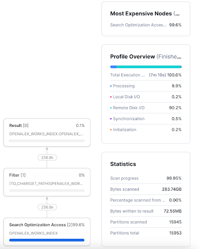

**Such queries aren’t benefitted from Search Optimization as the number of partitions that can be skipped by Search Optimization Service are very minimal.**

----

## Conclusion

In this guide, we have covered how to acquire a shared database from Snowflake Marketplace, how to enable Search Optimization on specific columns and analyze the performance improvements in queries with Search Optimization enabled. 

You are now ready to explore the larger world of Snowflake [Search Optimization Service](https://docs.snowflake.com/en/user-guide/search-optimization-service.html)
