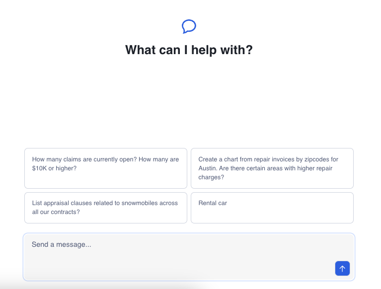

author: James Cha-Earley
id: getting-started-with-snowflake-agents-api-and-react
categories: snowflake-site:taxonomy/solution-center/certification/quickstart, snowflake-site:taxonomy/product/platform
language: en
summary: Getting Started with Snowflake Agents API and React 
environments: web
status: Published 
feedback link: https://github.com/Snowflake-Labs/sfguides/issues


# Getting Started with Snowflake Cortex Agents API and React

## Overview


In this quickstart, you'll learn how to leverage Snowflake's Cortex Agents to orchestrate across both structured and unstructured data sources to deliver insights. Cortex Agents can plan tasks, use tools to execute these tasks, and generate responses. They combine Cortex Analyst for structured data queries and Cortex Search for unstructured data insights, along with LLMs for natural language understanding.

This guide walks you through a complete, functional application that demonstrates the Cortex Agent API in action. The tutorial project includes a fully working chatbot interface built with Next.js that allows users to interact with both structured and unstructured data through natural language queries. The application handles everything from authentication to rendering complex responses with charts, tables, and citations.

### What You'll Learn

- Building applications using Cortex Agents API  
- Using Cortex Analyst for structured data queries  
- Using Cortex Search for unstructured data insights  
- Implementing key pair authentication  
- Working with tool resources and specifications  
- Managing API responses and data processing

### What You'll Build

An intelligent application that:

- Routes queries between Cortex Analyst and Cortex Search  
- Accesses both structured and unstructured data sources  
- Uses tools to execute specific tasks  
- Processes results within Snowflake's secure perimeter  
- Generates responses using LLMs

### Prerequisites

- Snowflake account ([Sign up here](https://signup.snowflake.com/?utm_source=snowflake-devrel&utm_medium=developer-guides&utm_cta=developer-guides))  
- RSA key pair authentication setup ([Key Generation Instructions](https://docs.snowflake.com/en/user-guide/key-pair-auth#generate-the-private-key))  
- Knowledge of TypeScript/JavaScript  
- Familiarity with React  
- Required Access:  
  - CORTEX\_USER database role  
  - USAGE privilege on Cortex Search Service  
  - USAGE privilege on referenced databases, schemas, and tables  
- [Supported Regions](https://docs.snowflake.com/en/user-guide/snowflake-cortex/cortex-agents#availability)  
- Where [PARSE\_DOCUMENT](https://docs.snowflake.com/en/user-guide/snowflake-cortex/parse-document#label-parse-document-regional-availability) is available. (*Note: This feature is in Public Preview as of 02/28/2025)*

## Setup Workspace


To get started, clone or download the tutorial project from: [Snowflake Agent API Chatbot Tutorial](https://github.com/Snowflake-Labs/sfguide-getting-started-with-cortex-agents-and-react)

**Step 1\.** In Snowsight, create a SQL Worksheet and open [setup.sql](https://github.com/Snowflake-Labs/sfguide-getting-started-with-cortex-agents-and-react/blob/main/data/setup.sql) to execute all statements in order from top to bottom.

This script will:

- Create the database, schema, and warehouse  
- Set up necessary roles and permissions  
- Configure Cortex Search service  
- Create a stage for semantic models

**Step 2\.** Upload the semantic model:

- Download the [semantic model](https://github.com/Snowflake-Labs/sfguide-getting-started-with-cortex-agents-and-react/blob/main/data/customer_semantic_model.yaml) (NOTE: Do NOT right-click to download.)  
- Navigate to Data » Databases » INSURANCEDB » DATA » Stages » CLAIM_STORAGE
- Click "+ Files" in the top right
- Select the semantic model file
- Click "Upload"

## Define Environment Variables


Now that we have set up the workspace, let's configure the necessary environment variables for the application. Create an `.env` file in the root folder of your project and add the following variables:

### Agent API Parameters

```
# Snowflake URL with your account details
NEXT_PUBLIC_SNOWFLAKE_URL=https://<account_details>.snowflakecomputing.com

# Path to the semantic model file; for example, @INSURANCEDB.DATA.CLAIM_STORAGE/customer_semantic_model.yaml
NEXT_PUBLIC_SEMANTIC_MODEL_PATH=@<database>.<schema>.<stage_name>/<semantic_model_name>.yaml

# Path to the search service; for example, INSURANCEDB.DATA.SUPPORT_DOCS_SEARCH
NEXT_PUBLIC_SEARCH_SERVICE_PATH=<database>.<schema>.<search_service_name>
```

### Authentication Parameters

```
# Your Snowflake account name only
SNOWFLAKE_ACCOUNT=<your_account_identifier>

# Your Snowflake username
SNOWFLAKE_USER=<your_username>

# Private RSA Key for JWT token generation
# You can skip this env var and set a rsa_key.p8 in the root folder if running locally
SNOWFLAKE_RSA_KEY=<your_private_rsa_key>

# Passphrase for RSA Key if it was encrypted
SNOWFLAKE_RSA_PASSPHRASE=<your_passphrase>
```

> 
>
> NOTE: For help with setting your-account-identifier, refer to the [documentation](https://docs.snowflake.com/en/user-guide/admin-account-identifier?_fsi=LnJgA8TM).

### UI Rendering Properties (Optional)

You can set an array of suggested queries for the initial load of the UI:

```
NEXT_PUBLIC_SUGGESTED_QUERIES=["How many claims are currently open? How many are $10K or higher?","Create a chart from repair invoices by zipcodes for Austin.  Are there certain areas with higher repair charges?","List appraisal clauses related to snowmobiles across all our contracts?","Rental car"]
```

If not specified, the application will use default suggested queries.

## Run the Application


Now that we have set up the workspace and configured the environment variables, let's run the application locally.

If you haven't installed pnpm via npm or brew, you can do so with:

```
npm i -g pnpm
# or
brew install pnpm
```

Install dependencies:

```
pnpm i
```

Start the application:

```
pnpm dev
```

The application should now be running on `http://localhost:3000`.



Click on one of the questions to see what it can do!

## Explain the Integration


Now that we have our application running, let's examine how to integrate with the Cortex Agent API. The bulk of the Agent API integration logic is located in the `@/lib/agent-api` directory.

### Define Tool Specifications

First, let's set up the constant definitions for Cortex tools:

```
export const CORTEX_ANALYST_TOOL = {
    "tool_spec": {
        "type": "cortex_analyst_text_to_sql",
        "name": "analyst1"
    }
} as const;

export const CORTEX_SEARCH_TOOL = {
    "tool_spec": {
        "type": "cortex_search",
        "name": "search1"
    }
} as const;

export const SQL_EXEC_TOOL = {
    "tool_spec": {
        "type": "sql_exec",
        "name": "sql_exec"
    }
} as const;

export const DATA_TO_CHART_TOOL = {
    "tool_spec": {
        "type": "data_to_chart",
        "name": "data_to_chart"
    }
} as const;
```

These constants define the tool specifications that tell the Cortex Agent which capabilities to use for different types of queries. Each tool has a unique name and type that identifies its functionality within the Cortex ecosystem.

### Tool Resources

Next, define the interfaces for tool resources:

```
export interface CortexAnalystToolResource {
    "analyst1": {
        "semantic_model_file": string;
    }
}

export interface CortexSearchToolResource {
    "search1": {
        "name": string;
        "max_results": number;
    }
}
```

These interfaces define the resources required by each tool. For the Cortex Analyst, you need to specify the semantic model file that maps natural language to SQL structures. For Cortex Search, you need to specify the name of the search service and the maximum number of results to return.

### Configure Request Parameters

Setup the standard request parameters for the Cortex Agent API:

```
export function buildStandardRequestParams(params: AgentRequestBuildParams) {
    const {
        authToken,
        messages,
        experimental,
        tools,
        toolResources,
    } = params;

    const headers = {
        'Accept': 'application/json',
        'Content-Type': 'application/json',
        'X-Snowflake-Authorization-Token-Type': 'KEYPAIR_JWT',
        'Authorization': `Bearer ${authToken}`,
    }

    const body = {
        "model": "claude-4-sonnet",
        "experimental": experimental,
        "messages": messages,
        "tools": tools,
        "tool_resources": toolResources,
    }

    return { headers, body };
}
```

The `buildStandardRequestParams` function creates the necessary headers and body for API requests to the Cortex Agent. It sets up authentication using JWT tokens and specifies which LLM model to use, along with messages, tools, and tool resources.

### Using the Agent API Hook

In `page.tsx`, we use the `useAgentApiQuery` hook to handle the Agent API and return state, message history, and a `handleNewMessage` function to send a new message:

```
// from page.tsx
const { agentState, messages, latestMessageId, handleNewMessage } = useAgentAPIQuery({
  authToken: jwtToken,
  snowflakeUrl: process.env.NEXT_PUBLIC_SNOWFLAKE_URL!,
  experimental: {
    EnableRelatedQueries: true,
  },
  tools,
  toolResources: {
    "analyst1": { "semantic_model_file": process.env.NEXT_PUBLIC_SEMANTIC_MODEL_PATH },
    "search1": { "name": process.env.NEXT_PUBLIC_SEARCH_SERVICE_PATH, max_results: 10 },
  }
})
```

The states returned from this hook are then passed to the appropriate components for rendering. This approach allows for clean separation of concerns between the API interaction logic and the UI rendering.

### Handle Citation Processing


In the Cortex Agent implementation, we need a way to process citations that are returned from search results. The code from the message.tsx file shows how this is handled:

```
// Extract from message.tsx showing citation handling
message.content.forEach((content) => {
    // if plain text
    if (content.type === "text") {
        const { text } = (content as AgentMessageTextContent);
        agentApiText = text;

        if (citations.length > 0) {
            relatedQueries.push(...text.matchAll(RELATED_QUERIES_REGEX).map(match => ({
                relatedQuery: match[1].trim(),
                answer: match[2].trim()
            })));
        }

        const postProcessedText = postProcessAgentText(text, relatedQueries, citations);

        agentResponses.push(<ChatTextComponent key={text} text={postProcessedText} role={role} />);
    } else if (content.type === "tool_results") {
        const toolResultsContent = (content as AgentMessageToolResultsContent).tool_results.content[0].json;

        // if search response
        if ("searchResults" in toolResultsContent) {
            citations.push(...toolResultsContent.searchResults.map((result: CortexSearchCitationSource) => ({
                text: result.text,
                number: parseInt(String(result.source_id), 10),
            })))
        }
        
        // Other content handling...
    }
});

// Later in the component, citations are displayed when available
{role === AgentMessageRole.ASSISTANT && citations.length > 0 && agentState === AgentApiState.IDLE && agentApiText && (
    <ChatCitationsComponent agentApiText={agentApiText} citations={citations} />
)}
```

This code demonstrates how the application:

1. Extracts citations from search results  
2. Collects them in an array for processing  
3. Uses them to generate related queries  
4. Renders them using a dedicated citations component when they are available

The citation processing is a key part of making Cortex Search results more usable and presentable to end users.

### Message Content Flow


Let's examine how the message content flows through the application. In page.tsx, we can see how the hook is called and its results are passed to child components:

```
// from page.tsx
const { agentState, messages, latestMessageId, handleNewMessage } = useAgentAPIQuery({
  authToken: jwtToken,
  snowflakeUrl: process.env.NEXT_PUBLIC_SNOWFLAKE_URL!,
  experimental: {
    EnableRelatedQueries: true,
  },
  tools,
  toolResources: {
    "analyst1": { "semantic_model_file": process.env.NEXT_PUBLIC_SEMANTIC_MODEL_PATH },
    "search1": { "name": process.env.NEXT_PUBLIC_SEARCH_SERVICE_PATH, max_results: 10 },
  }
})

// These values are then passed to child components
<Messages
  agentState={agentState}
  messages={messages}
  latestMessageId={latestMessageId}
/>

<ChatInput
  isLoading={agentState !== AgentApiState.IDLE}
  messagesLength={messages.length}
  handleSubmit={handleNewMessage} />
```

The Messages component will then render each message using the PreviewMessage component from message.tsx. This component handles the different types of content that can be present in Agent API responses and renders them appropriately.

The flow of data through the application provides a complete picture of how the Agent API is integrated into a user interface for interactive querying of structured and unstructured data.

### Displaying Message Components in the UI


As seen in the message.tsx file, the application handles different types of content and displays them appropriately:

```
// From message.tsx - showing how different components are rendered based on content type
return (
    <AnimatePresence>
        <motion.div
            className="w-full mx-auto max-w-3xl px-4 group/message"
            initial={{ y: 5, opacity: 0 }}
            animate={{ y: 0, opacity: 1 }}
            data-role={message.role}
        >
            <div
                className='flex gap-4 w-full group-data-[role=user]/message:ml-auto group-data-[role=user]/message:max-w-lg group-data-[role=user]/message:w-fit'
            >
                <div className="flex flex-col gap-4 w-full">
                    {agentResponses}

                    {role === AgentMessageRole.ASSISTANT && agentState === AgentApiState.EXECUTING_SQL && (
                        <Data2AnalyticsMessage message="Executing SQL..." />
                    )}

                    {role === AgentMessageRole.ASSISTANT && agentState === AgentApiState.RUNNING_ANALYTICS && (
                        <Data2AnalyticsMessage message="Analyzing data..." />
                    )}

                    {role === AgentMessageRole.ASSISTANT && relatedQueries.length > 0 && (
                        <ChatRelatedQueriesComponent relatedQueries={relatedQueries} />
                    )}

                    {role === AgentMessageRole.ASSISTANT && citations.length > 0 && agentState === AgentApiState.IDLE && agentApiText && (
                        <ChatCitationsComponent agentApiText={agentApiText} citations={citations} />
                    )}
                </div>
            </div>
        </motion.div>
    </AnimatePresence>
);
```

This code shows how the UI:

1. Displays the main content responses in the `agentResponses` array  
2. Shows loading states while SQL is executing or analytics are running  
3. Renders related queries when they are available  
4. Displays citations when they are available and the agent is idle

The component uses conditional rendering to ensure that the appropriate UI elements are shown based on the current state and available data. This creates a responsive and informative interface for users interacting with the Cortex Agent.

## Conclusion and Resources


### Conclusion

Congratulations\! You've learned how to integrate the Snowflake Cortex Agent API into your applications. By implementing the citation extraction and processing functionality, you can now create intelligent applications that can access both structured and unstructured data while providing properly sourced responses to user queries.

### What You Learned

- Setting up Cortex tool specifications  
- Configuring Cortex tool resources  
- Building request parameters for the Agent API  
- Processing Cortex Search results  
- Implementing citation extraction and filtering  
- Building user interfaces for displaying citations  
- Implementing a complete Agent API integration  
- Managing message state and responses

Note: While Snowflake strives to provide high quality responses, the accuracy of the LLM responses or the citations provided are not guaranteed. You should review all answers from the Agents API before serving them to your users.

### Resources

Documentation:

- [Cortex Agents Documentation](https://docs.snowflake.com/en/user-guide/snowflake-cortex/cortex-agents)  
- [Cortex Search Documentation](https://docs.snowflake.com/en/user-guide/snowflake-cortex/cortex-search/cortex-search-overview)  
- [Cortex Analyst Documentation](https://docs.snowflake.com/en/user-guide/snowflake-cortex/cortex-analyst)

Sample Code & Guides:

- [Agent API Chatbot Tutorial](https://github.com/Snowflake-Labs/sfguide-getting-started-with-cortex-agents-and-react)
- [Getting Started with Snowflake Agents API](/en/developers/guides/getting-started-with-cortex-agents/)
- [Getting Started with Snowflake Agents (API) and Microsoft Teams](/en/developers/guides/integrate-snowflake-cortex-agents-with-microsoft-teams/)  
- [Getting Started with Snowflake Agents (API) and Slack](/en/developers/guides/integrate-snowflake-cortex-agents-with-slack/)
