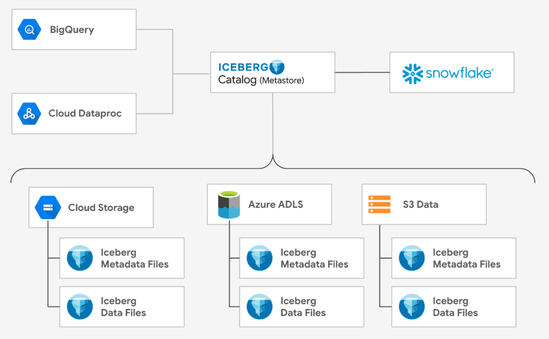

author: Matt Marzillo
id: getting-started-with-snowflake-and-bigquery-via-iceberg
categories: snowflake-site:taxonomy/solution-center/certification/quickstart, snowflake-site:taxonomy/product/data-engineering, snowflake-site:taxonomy/snowflake-feature/transformation, snowflake-site:taxonomy/snowflake-feature/apache-iceberg
language: en
summary: This is a quickstart showing users how use iceberg with Snowflake and Big Query 
environments: web
status: Published 
feedback link: https://github.com/Snowflake-Labs/sfguides/issues


# Getting Started with Snowflake and BigQuery via Iceberg
<!-- ------------------------ -->
## Overview 

Apache Iceberg has become a very popular open-source table format for data lakes as its flexibility enables freedom of choice for organizations. Whether an organization wants to use best of breed services or they’ve inherited multiple data platforms due to mergers or acquisitions, adopting an open table format could be key to eliminating data silos.

### Use Case
There is often no one-size-fits-all approach to tackling complex business challenges. Organizations often store their data in different places and use multiple tools and platforms to put that data to work. By uniting data across platforms and query engines using an open table format, organizations can serve a variety of business needs, including: 
- Modernizing their data lake
- Enabling data interoperability and a joint data mesh architecture
- Building batch or streaming data pipelines
- Building transformation and change data capture (CDC) pipelines
- Serving analytics-ready data to business teams


### Prerequisites
- Familiarity with [Snowflake](/en/developers/guides/getting-started-with-snowflake/) and a Snowflake account
- Familiarity with [Google Cloud](https://cloud.google.com/free) and a Google Cloud account.

### What You’ll Learn
- Creating a Snowflake Managed Iceberg table and then have BigQuery read the table
- Creating a BigLake Managed table and then have Snowflake read the table
- Keeping BigQuery in-sync with Iceberg tables hosted on Snowflake



### What You’ll Need
- [Snowflake account](https://signup.snowflake.com/?utm_source=snowflake-devrel&utm_medium=developer-guides&utm_cta=developer-guides) 
- [Google Cloud account](https://cloud.google.com/free)

### What You'll Build
- A Snowflake Managed Iceberg table
- A BigLake Managed Iceberg table


<!-- ------------------------ -->
## Snowflake Iceberg to BigQuery

In this section, you will create a table in Snowflake using the Iceberg format and also create a BigLake (external) table in BigQuery that points to the same Iceberg files.

### Login to Snowflake
- Click the Create button on the top left
- Select SQL Worksheet
- Run this command to switch to an account admin since we have to run some commands that requires this role:

```sql
USE ROLE accountadmin;
```

### Create a warehouse to hold the data

```sql
CREATE OR REPLACE WAREHOUSE ICEBERG_WAREHOUSE WITH WAREHOUSE_SIZE='XSMALL';
```
Reference: https://docs.snowflake.com/en/sql-reference/sql/create-warehouse

### Create a database (the database)
```sql
CREATE OR REPLACE DATABASE ICEBERG_DATABASE;
```


### Create a bucket to hold your BigLake Managed Table
Open: https://console.cloud.google.com/storage/browser
- Click the Create Bucket button
- Enter your bucket name: bigquery-snowflake-sharing (you can choose a different name)
- Click Next: Use Region: us-central1 <- must match your snowflake region
    - Note: this quickstart uses the region us-central1 if you decide to use a different region you will have to make updates to this quickstart wherever 'us-central1' is referenced.
- Click Create at the bottom

### Create a link between Snowflake and GCS. 
- In Snowflake, create a GCS volume integration.  This will create a link between Snowflake and GCS. 
A service principal will be created and we will grant access to our GCS bucket.


```sql
CREATE STORAGE INTEGRATION bigquery_integration
  TYPE = EXTERNAL_STAGE
  STORAGE_PROVIDER = 'GCS'
  ENABLED = TRUE
  STORAGE_ALLOWED_LOCATIONS = ('gcs://bigquery-snowflake-sharing');
```
Reference: https://docs.snowflake.com/en/sql-reference/sql/create-storage-integration

### Get the service principal that we will grant Storage Object Admin in our GCS bucket
```sql
DESC STORAGE INTEGRATION bigquery_integration;
```
- Copy the STORAGE_GCP_SERVICE_ACCOUNT
- e.g. xxxxxxxxx@gcpuscentral1-1dfa.iam.gserviceaccount.com

### Create a custom IAM role that has the permissions required to access the bucket and get objects.
- Open: https://console.cloud.google.com/iam-admin/roles
- Select Create Role.
- Enter a Title and optional Description for the custom role. [e.g. Snowflake Storage Admin]
- Select Add Permissions.
- In Filter, select Service and then select storage.
- Filter the list of permissions, and add the following from the list:
- storage.buckets.get
- storage.objects.get
- storage.objects.create
- storage.objects.delete
- storage.objects.list
- Select Add.
- Select Create.
- Reference: https://docs.snowflake.com/en/user-guide/tables-iceberg-configure-external-volume-gcs?_fsi=YFzl41ld&_fsi=YFzl41ld&_fsi=YFzl41ld

### Open the storage account you created
- Open: https://console.cloud.google.com/storage/browser
- Click on: bigquery-snowflake-sharing (or whatever you named it)
- Click on Permissions
- Click Grant Access
- Paste in the service account name (from Snowflake)
- For the role select Custom | Snowflake Storage Admin
- Click Save

### In Snowflake, create an external volume on GCS
```sql
CREATE EXTERNAL VOLUME snowflake_ext_volume
  STORAGE_LOCATIONS =
    (
      (
        NAME = 'us-central1'
        STORAGE_PROVIDER = 'GCS'
        STORAGE_BASE_URL = 'gcs://bigquery-snowflake-sharing/snowflake-volume/'
      )
    ),
    ALLOW_WRITES = TRUE;
```
Reference: https://docs.snowflake.com/en/sql-reference/sql/create-external-volume

### Describe the volume
```sql
DESCRIBE EXTERNAL VOLUME snowflake_external_volume
```

### Set the current database
```sql
USE ICEBERG_DATABASE;
```

### Create a schema in Snowflake
```sql
CREATE SCHEMA iceberg_schema;
```

### Make the schema active
```sql
USE SCHEMA iceberg_schema;
Create Iceberg table using Snowflake Catalog
CREATE ICEBERG TABLE driver (driver_id int, driver_name string)
  CATALOG = 'SNOWFLAKE'
  EXTERNAL_VOLUME = 'snowflake_ext_volume'
  BASE_LOCATION = 'driver';
```
Reference: https://docs.snowflake.com/en/sql-reference/sql/create-iceberg-table-snowflake

### Show the table you just created
```sql
SHOW TABLES
```

### Insert new data
```sql
INSERT INTO driver (driver_id, driver_name) VALUES (1, 'Driver 001');
SELECT * FROM driver;
```

### Review the latest metadata json file that Snowflake is pointing to as we need to point BigQuery to the same place
```sql
SELECT REPLACE(JSON_EXTRACT_PATH_TEXT(
     SYSTEM$GET_ICEBERG_TABLE_INFORMATION('ICEBERG_DATABASE.iceberg_schema.driver'),
          'metadataLocation'), 'gcs://', 'gs://');
```

### Open the storage account you created
- Open: https://console.cloud.google.com/storage/browser
- Click on: bigquery-snowflake-sharing (or whatever you named it)
- You can now browse the Iceberg files

### Create a BigQuery Dataset
```sql
CREATE SCHEMA IF NOT EXISTS snowflake_dataset OPTIONS(location = 'us-central1');
```

### Navigate to BigQuery
- Open: https://console.cloud.google.com/bigquery
- Click the Add button
- Select "Connections to external data sources"
- Select "Vertex AI remote models, remote functions and BigLake (Cloud Resource)"
- Select region: us-central1
- Enter a name: snowflake-connection (use the for friendly name and description)

### Expand your project in the left hand panel
- Expand external connections
- Double click on us-central1.snowflake-connection
- Copy the service account id: e.g. bqcx-xxxxxxxxxxxx-s3rf@gcp-sa-bigquery-condel.iam.gserviceaccount.com

### Open the storage account you created
- Open: https://console.cloud.google.com/storage/browser
- Click on: blmt-snowflake-sharing (or whatever you named it)
- Click on Permissions
- Click Grant Access
- Paste in the service account name
- For the role select Cloud Storage | Storage Object Viewer [Since Snowflake is the write BigQuery just reads]
- Click Save

### The URIs needs to be from the following Snowflake command
```sql
CREATE OR REPLACE EXTERNAL TABLE `snowflake_dataset.driver`
WITH CONNECTION `us-central1.snowflake-connection`
OPTIONS (
  format = "ICEBERG",
  uris = ["gs://bigquery-snowflake-sharing/snowflake-volume/driver/metadata/00001-2d763c77-df0a-4230-bd52-033877d02c40.metadata.json"]
);
```

### View the data in BQ
```sql
SELECT * FROM `snowflake_dataset.driver`;
```

### Update table metadata in BQ

BigQuery will not see updated data in Snowflake since we are pointing to a specific snapshot or metadata json. We will have to update the table definition to the latest table metadata.
- You will need to run the "SYSTEM$GET_ICEBERG_TABLE_INFORMATION" command in Snowflake
```sql
SYSTEM$GET_ICEBERG_TABLE_INFORMATION('<iceberg_table_name>')
```
- You will then need to update the table metadata in BigQuery: https://cloud.google.com/bigquery/docs/iceberg-external-tables#update-table-metadata

<!-- ------------------------ -->
## Big Lake Iceberg to Snowflake

In this section, you will create a table in BigQuery using the Iceberg format and also create an Iceberg (external) table in Snowflake that points to the same Iceberg files.

### Create a bucket to hold your BigLake Managed Table
- Open: https://console.cloud.google.com/storage/browser
- Click the Create Bucket button
- Enter your bucket name: blmt-snowflake-sharing (you can choose a different name)
- Click Next: Use Multi-region: us-central1
- Click Create at the bottom

### Navigate to BigQuery
- Open: https://console.cloud.google.com/bigquery
- Click the Add button
- Select "Connections to external data sources"
- Select "Vertex AI remote models, remote functions and BigLake (Cloud Resource)"
- Enter a name: blmt-connection (use the for friendly name and description)

### Expand your project in the left hand panel
- Expand external connections
- Double click on us-central1.blmt-connection
- Copy the service account id: e.g. bqcx-xxxxxxxxxxxx-s3rf@gcp-sa-bigquery-condel.iam.gserviceaccount.com
- Open your storage account you created
- Open: https://console.cloud.google.com/storage/browser
- Click on: blmt-snowflake-sharing (or whatever you named it)
- Click on Permissions
- Click Grant Access
- Paste in the service account name
- For the role select Cloud Storage | Storage Object Admin [We want admin since we want Read/Write]
- Click Save

### Navigate to BigQuery
- Open: https://console.cloud.google.com/bigquery
- Open a query window
- Run this to create a dataset:
```sql
CREATE SCHEMA IF NOT EXISTS blmt_dataset OPTIONS(location = 'us');
```

### Create a BigLake Managed table
- Run this to create a BigLake Managed table (change the storage account name below)
```sql
CREATE OR REPLACE TABLE `blmt_dataset.driver`
(
 driver_id                 INT64,
 driver_name               STRING,
 driver_mobile_number      STRING,
 driver_license_number     STRING,
 driver_email_address      STRING,
 driver_dob                DATE,
 driver_ach_routing_number STRING,
 driver_ach_account_number STRING
)
CLUSTER BY driver_id
WITH CONNECTION `us-central1.blmt-connection`
OPTIONS (
 file_format = 'PARQUET',
 table_format = 'ICEBERG',
 storage_uri = 'gs://blmt-snowflake-sharing/driver'
);
```

### Load the table with some data
```sql
LOAD DATA INTO `blmt_dataset.driver`
FROM FILES (
 format = 'parquet',
 uris = ['gs://data-analytics-golden-demo/biglake/v1-source/managed-table-source/driver/*.parquet']);
 ```

### View the data
```sql
SELECT * FROM `blmt_dataset.driver` LIMIT 1000;
```

### View the storage metadata
- Open: https://console.cloud.google.com/storage/browser and click on your storage account
- You should see a folder called "driver"
- You can  navigate to the "metadata" folder
- You will probably see the file "v0.metadata.json"

### To export the most recent metadata run this in BigQuery (a separate window is preferred)
```sql
EXPORT TABLE METADATA FROM blmt_dataset.driver;
```

### In your storage window
- Press the Refresh button (top right)
- You will not see many files in the metadata folder

### Let's connect the data to Snowflake
- Login to Snowflake
- Click the Create button on the top left
- Select SQL Worksheet
- Run this command to switch to an account admin since we have to run some commands that requires this role
```sql
USE ROLE accountadmin;
```

### Create a warehouse to hold the data
```sql
CREATE OR REPLACE WAREHOUSE BLMT_WAREHOUSE WITH WAREHOUSE_SIZE='XSMALL';
```

### Create a database in snowflake
```sql
CREATE OR REPLACE DATABASE BLMT_DATABASE;
```

### Select the database
```sql
USE DATABASE BLMT_DATABASE;
```

### Create the schema to hold the table
```sql
CREATE SCHEMA IF NOT EXISTS BLMT_SCHEMA;
```

### Select the schema
```sql
USE SCHEMA BLMT_SCHEMA;
```

### Create our GCS volume integration.  This will create a link between Snowflake and GCS.
- A service principal will be created and we will grant access to our GCS bucket.
- Reference: https://docs.snowflake.com/en/sql-reference/sql/create-storage-integration
- Change the name of the storage account
```sql
CREATE STORAGE INTEGRATION gcs_storage_integration
 TYPE = EXTERNAL_STAGE
 STORAGE_PROVIDER = 'GCS'
 ENABLED = TRUE
 STORAGE_ALLOWED_LOCATIONS = ('gcs://blmt-snowflake-sharing/');
```

### Get the service principal that we will grant Storage Object Admin in our GCS bucket
```sql
DESC STORAGE INTEGRATION gcs_storage_integration;
```
- Copy the STORAGE_GCP_SERVICE_ACCOUNT
- e.g. xxxxxxxxx@gcpuscentral1-1dfa.iam.gserviceaccount.com

### Configure an external volume for Google Cloud Storage
- Create a custom IAM role
- Create a custom role that has the permissions required to access the bucket and get objects.
- Open: https://console.cloud.google.com/iam-admin/roles
- Select Create Role.
- Enter a Title and optional Description for the custom role. [e.g. Snowflake Reader]
- Select Add Permissions.
- In Filter, select Service and then select storage.
- Filter the list of permissions, and add the following from the list:
- storage.buckets.get
- storage.objects.get
- Storage.objects.list
- Select Add.
- Select Create.
- Reference: https://docs.snowflake.com/en/user-guide/tables-iceberg-configure-external-volume-gcs?_fsi=YFzl41ld&_fsi=YFzl41ld&_fsi=YFzl41ld

### Open your storage account you created
- Open: https://console.cloud.google.com/storage/browser
- Click on: blmt-snowflake-sharing (or whatever you named it)
- Click on Permissions
- Click Grant Access
- Paste in the service account name (from Snowflake)
- For the role select Custom | Snowflake Reader
- Click Save

Create an external volume on GCS
Reference: https://docs.snowflake.com/en/sql-reference/sql/create-external-volume
CREATE OR REPLACE EXTERNAL VOLUME gcs_volume
  STORAGE_LOCATIONS =
     (
        (
           NAME = 'gcs_volume'
           STORAGE_PROVIDER = 'GCS'
           STORAGE_BASE_URL = 'gcs://blmt-snowflake-sharing/'
           )
     );
### Create a catalog integration to manage Iceberg tables in the external volume
```sql
CREATE OR REPLACE CATALOG INTEGRATION catalog_integration
   CATALOG_SOURCE=OBJECT_STORE   -- Indicates that the catalog is backed by an object store
   TABLE_FORMAT=ICEBERG          -- Specifies the table format as Iceberg
   ENABLED=TRUE;                 -- Enables the catalog integration
```

### Create the Iceberg table, pointing to the existing metadata file
- To get the "latest" metadata file
- Open your storage account and navigate to the driver/metadata folder
- Open the version-hint.text, there will be a number inside
- Replace the number below (in the value of v173076288, but leave the "v")
NOTE: Due to some metadata optional parameters set/required by V1 of the Iceberg we need to ignore some metadata.  To due this, please ask Snowflake to perform this on your account. This should not be an issue when Iceberg V2 is used. JIRA for instructions to set the metadata flag on the Snowflake account - SNOW-1624657.
```sql
CREATE OR REPLACE ICEBERG TABLE driver
   CATALOG='catalog_integration'   -- The catalog where the table will reside
   EXTERNAL_VOLUME='gcs_volume'    -- The external volume for table data
   BASE_LOCATION=''                -- Optional: Subdirectory within the storage location
   METADATA_FILE_PATH='driver/metadata/v1730762887.metadata.json'; -- Path to the existing metadata file
```

### This will show the table just created
```sql
SHOW TABLES
```

### Query the Iceberg table
```sql
SELECT * FROM driver;
SELECT COUNT(*) FROM driver;
```

### Now that you are linked, you can try the following, Insert a record into the BigQuery table:
```sql
INSERT INTO `blmt_dataset.driver`
(driver_id, driver_name, driver_mobile_number, driver_license_number, driver_email_address,
driver_dob, driver_ach_routing_number, driver_ach_account_number)
VALUES (0, 'New Driver', 'xxx-xxx-xxxx', 'driver_license_number', 'driver_email_address',
CURRENT_DATE(), 'driver_ach_routing_number','driver_ach_account_number');
```

### Now Query the record in Snowflake
```sql
SELECT * FROM driver WHERE driver_id = 0;
```
NOTE: You will not see the new record. You first need to tell BigQuery to export the latest metadata (see step “View the storage metadata”) and update the metadata used by Snowflake (see step “Create the Iceberg table, pointing to the existing metadata file”) pointing to the latest JSON file.

<!-- ------------------------ -->
## Keeping BQ in-sync with Snowflake

In this section you will set up BigQuery to stay in-sync with Iceberg tables hosted in Snowflake.


1. So far, in this Quickstart, you’ve created an Iceberg table and exported Snowflake metadata to the Google Cloud Storage account upon each update. (Section 1 of this Quickstart)
2. You’ve also created BigLake Iceberg tables in BigQuery and pointed to a specific metadata JSON file on storage. (Section 2 of this Quickstart). However, you are pointing at a specific version of the data and if changes are made to the Iceberg table in Snowflake, BigQuery will not see them.
3. To sync Iceberg tables in Snowflake with BigQuery, BigQuery will have to read the Iceberg Catalog in Snowflake which will provide the latest metadata json file. Please see this GitHub repository for steps to enable this sync and automating the process: 
- https://github.com/GoogleCloudPlatform/data-analytics-golden-demo/blob/main/colab-enterprise/BigLake-Iceberg-Sync-Demo.ipynb
4. Finally, use the PATCH command to update BigQuery’s Iceberg table to the latest metadata from Snowflake. 

<!-- ------------------------ -->
## Conclusion and Resources

### Technical Considerations
Technical considerations for the data sharing integration between BigQuery and Snowflake today include:
- An inconsistency in the manifest statistics prevents Snowflake from reading BigLake Managed Iceberg tables. You can create a support ticket with Snowflake customer support to address the issue and allow Snowflake to read Iceberg tables created in BigQuery.
- BigQuery does not yet support external federated Iceberg metastores such as Snowflake’s Polaris catalog.
- BigQuery and Snowflake don't currently support self-managed table replication from external tables.
Google Cloud and Snowflake continue to collaboratively develop deeper product integrations to achieve our shared goal of improving data interoperability for customers. 

### What you learned
By following this quickstart, you learned how to:
- Create a Snowflake Managed Iceberg table and then have BigQuery read the table
- Create a BigLake Managed table and then have Snowflake read the table
- Keep BigQuery in-sync with Iceberg tables hosted in Snowflake

### Resources
Google Cloud and Snowflake’s commitment to Apache Iceberg’s open-source table format empowers our customers to unite their data across query engines and platforms and use it to solve business problems with familiar features, tools, and services from both organizations. Learn how to build your first open data lakehouse with [Google Cloud](https://cloud.google.com/bigquery/docs/iceberg-external-tables) and [Snowflake](https://docs.snowflake.com/en/user-guide/tables-iceberg) by exploring documentation from Google Cloud and Snowflake, watching a [tutorial](/en/resources/video/what-are-iceberg-tables-in-snowflake-6-minute-demo/), then diving into the [Quickstart Guide](/en/developers/guides/getting-started-iceberg-tables/).

